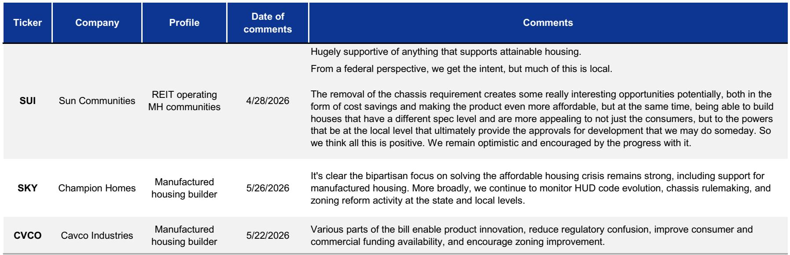
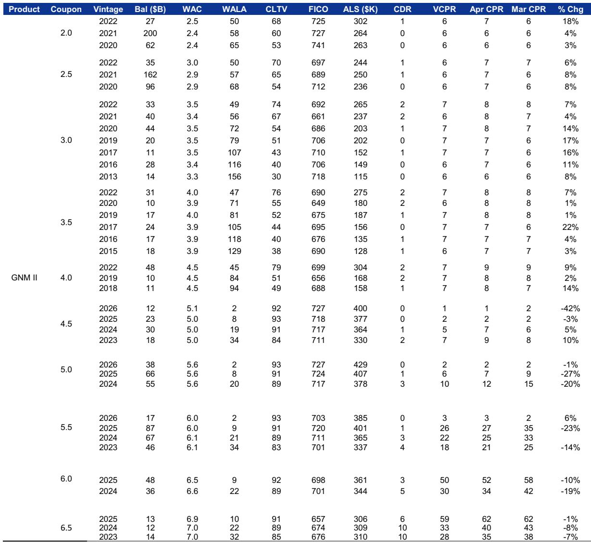
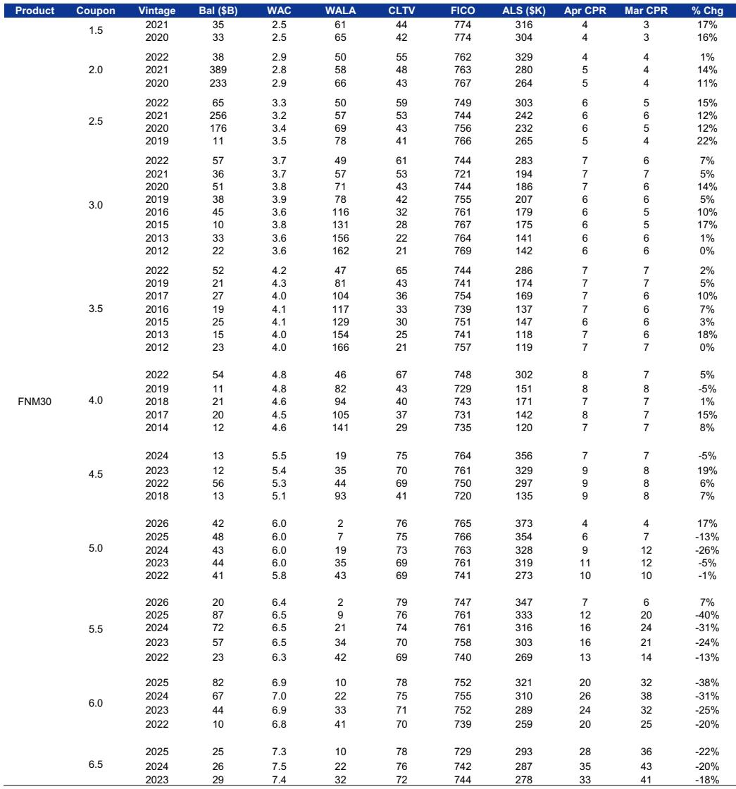

# Manufactured Housing Is Not a Niche Solution: It Is the Most Scalable Lever Left in the US Housing Crisis

The United States faces a structural shortage of roughly 3 to 4 million homes. For the past two decades, policymakers, developers, and investors have focused almost exclusively on site-built single-family construction and multifamily rental development as the primary channels to close that gap. Neither channel is delivering enough volume at affordable price points. Mortgage rates remain elevated, construction labor is scarce, and land-use regulation in high-demand metros has become a binding constraint that no amount of demand-side subsidy can fix. In this environment, manufactured housing is not a marginal alternative. It is the largest underutilized production system in American housing, and its revival would represent a structural shift in how the country supplies homes to its middle- and lower-income households.

The data is stark. Prior to 2000, the United States shipped approximately 265,000 manufactured homes per year. Since 2010, that number has averaged just 80,000 units annually. This collapse was not driven by a decline in demand for affordable shelter. It was driven by a perfect storm of regulatory tightening, financing degradation, and stigma that followed the overproduction and delinquency crisis of the 1990s. The result is a production system that operates at roughly 30 percent of its historical capacity, even as the nation faces its worst housing affordability crisis in a generation. The question is not whether manufactured housing can help solve the shortage. The question is what it will take to unlock that capacity, and whether the current wave of federal and state policy proposals is sufficient to do so.

The argument of this article is straightforward: manufactured housing is the most scalable, cost-effective, and politically viable lever to increase affordable homeownership in the United States, but unlocking it requires a coordinated intervention across three distinct domains—federal building code reform, state-level zoning and titling changes, and a restructuring of the chattel lending market. Each domain alone is insufficient. Together, they could restore the manufactured housing industry to its pre-2000 production levels and add hundreds of thousands of affordable units per year to the national housing stock.

## The Cost Advantage of Manufactured Housing Is Real, but It Has Not Been Sufficient to Drive Volume

The most compelling case for manufactured housing is simple arithmetic. In 2024, the average sale price of a manufactured home was approximately $125,000, compared to roughly $515,000 for a site-built single-family home. On a per-square-foot basis, manufactured homes cost about $84, versus $170 for site-built homes. That is not a marginal discount. It is a structural cost advantage of roughly 50 percent, excluding land. For a household earning the median US income, the difference between a $125,000 mortgage and a $515,000 mortgage is the difference between affordability and exclusion.

Yet despite this price gap, manufactured housing accounts for only about 6 percent of owner-occupied housing units in the United States, and that share has drifted marginally lower from around 7 percent in 2010. If the cost advantage were the only variable that mattered, one would expect manufactured housing to be gaining share, not losing it. The fact that it is not tells us that the barriers to adoption are not primarily economic. They are structural, regulatory, and perceptual.

The geography of manufactured housing reinforces this point. Over 54 percent of manufactured housing units are located in rural areas, defined as territories with fewer than 2,500 people. By contrast, the majority of site-built single-family homes are in large urban areas. Several states that rank high in manufactured home sales, such as Alabama, Mississippi, and Louisiana, rank low in single-family home construction. This pattern suggests that local zoning and land-use regulations are a key constraining factor. In high-demand urban and suburban markets, manufactured housing is often effectively banned by zoning codes that require minimum lot sizes, minimum square footages, or site-built construction methods. The product is affordable, but it cannot be placed where the demand is strongest.

## Financing Remains the Single Most Underserved Dimension of the Manufactured Housing Market

The affordability of the manufactured home itself is only half the equation. The financing available to purchase it is fundamentally different from, and inferior to, the financing available for site-built homes. This is the central structural weakness of the manufactured housing market, and it is the area where policy intervention could have the largest impact.

Manufactured homes are titled as either real property or personal property, depending on whether the owner owns the underlying land. When the homeowner does not own the land, which is the case for approximately 40 percent of units located in manufactured housing communities, the buyer must use a chattel loan. Chattel loans come with shorter terms, higher interest rates, and fewer borrower protections than traditional mortgages. The combination of shorter terms and higher rates makes monthly payments significantly higher than they would be for a comparable mortgage, partially negating the cost advantage of the home itself. Moreover, in the event of default, lenders can repossess a chattel-financed home without going through foreclosure, which increases the risk premium embedded in these loans.

Even when the borrower owns the land and can obtain a traditional mortgage, the fixed costs of loan origination are prohibitively high relative to the size of the loan. A $100,000 mortgage carries the same underwriting overhead as a $400,000 mortgage, but the lender's margin is much thinner. As a result, many lenders simply do not originate small mortgages, leaving manufactured home buyers with fewer options and worse terms.

The 21st Century Road to Housing Act, which has recently garnered bipartisan support, addresses some of these issues. It proposes eliminating the permanent chassis requirement, which would reduce the cost of manufactured homes by an estimated $5,000 to $10,000 per unit and make lenders more likely to treat the home as real property. It also increases the loan limits for FHA-insured manufactured housing loans. These are meaningful steps, but they do not directly address the chattel lending market. If the government-sponsored enterprises were to launch a program to finance chattel loans, it could serve as an important benchmark for lending standards across the industry and increase access to affordable financing. That step has not yet been taken, and it remains one of the most significant open questions in the sector.

## Zoning Reform at the State Level Is the Binding Constraint That Federal Policy Alone Cannot Solve

Federal policy can change building codes, loan limits, and chassis requirements. It cannot change local zoning ordinances. This is the fundamental limitation of the current legislative push, and it is the reason why the manufactured housing industry's recovery will remain incomplete without parallel action at the state and local level.

The data from the report makes this tension explicit. States like Texas, Florida, and North Carolina are top markets for manufactured homes, but they also have relatively permissive zoning environments. By contrast, states in the Northeast and West Coast, where housing affordability is most acute, have some of the most restrictive zoning regimes. Manufactured housing cannot gain significant market share in California, New York, or Massachusetts unless those states explicitly allow it in residential zones currently reserved for site-built homes.

There are encouraging signs at the state level. Montana and Kentucky recently passed legislation to treat manufactured homes on par with site-built homes for titling purposes. A recent law change in Texas will open more areas within the state to manufactured housing effective September 2026. These are incremental but important steps. The question is whether they will be enough to move the national production needle from 80,000 units per year back toward 265,000.

The report's analysis suggests that the industry itself is cautiously optimistic. Executives at Sun Communities, Champion Homes, and Cavco Industries have all expressed support for the proposed federal changes, while acknowledging that much of the work lies at the local level. The removal of the permanent chassis requirement is particularly significant, not only because of the cost savings, but because it could make manufactured homes more palatable to local planning boards that have historically viewed them as inferior or temporary structures.

## What the Report Does Not Fully Answer: The Demand-Side Question

The report provides a thorough analysis of supply-side barriers—zoning, financing, building codes, and perception. What it does not fully answer is the demand-side question: if all the supply-side barriers were removed, how many households would actually choose manufactured housing over site-built homes or renting?

The 2022 Freddie Mac survey cited in the report found that 53 percent of respondents had never heard of manufactured housing or were unfamiliar with it, and only 17 percent were very familiar with the sector. This suggests a massive awareness and perception gap. But awareness alone does not translate into demand. Manufactured homes are smaller than site-built homes, and they are historically viewed as starter homes for lower-income households. Even if the product were widely available and affordably financed, would middle-income households choose it in large numbers, or would they continue to stretch their budgets for site-built homes?

The answer to this question is not in the report, and it is critical for investors and policymakers. If the demand elasticity for manufactured housing is low—meaning that households are unwilling to substitute even when price and availability improve—then the supply-side reforms will produce only marginal gains. If demand elasticity is high, the same reforms could trigger a boom. The industry's optimism suggests the latter, but the data to confirm it does not yet exist.

## A Decision Framework for Investors and Policymakers

For readers trying to make sense of the manufactured housing opportunity, the report's analysis can be distilled into a three-part decision framework.

First, assess the regulatory trajectory at the federal level. The 21st Century Road to Housing Act is the most significant legislative proposal for manufactured housing in decades. If it passes, the elimination of the permanent chassis requirement and the increase in FHA loan limits will reduce costs and improve financing terms. Investors should monitor the bill's progress closely, as its passage would be a clear positive signal for manufacturers, community operators, and lenders in the space.

Second, evaluate state-level zoning and titling reforms. Federal policy creates the conditions for growth, but state and local policy determines whether that growth can actually occur. The states to watch are those with high housing demand and restrictive zoning. If California, New York, or Massachusetts were to pass legislation explicitly permitting manufactured housing in single-family zones, the market would expand dramatically. If reform remains concentrated in the South and Southeast, the growth will be real but geographically contained.

Third, monitor the chattel lending market. The absence of a GSE-backed chattel loan program is the single largest financing gap in the manufactured housing ecosystem. If the GSEs enter this market, it would lower borrowing costs, standardize underwriting, and reduce the risk premium that currently makes chattel loans expensive and hard to obtain. This would be a game-changer for the 40 percent of manufactured home buyers who do not own the land beneath their homes.

The report does not forecast which of these three levers will pull first or hardest. That is the analytical challenge that remains. But for any serious participant in the housing market, manufactured housing is no longer a niche to be ignored. It is the largest scalable solution to the affordability crisis that has not yet been tried at scale.

Join the community to read the full report and review the original charts.

*This article is for learning and discussion only and does not constitute investment advice.*

Personal reading notes and learning share only. Not investment advice.

