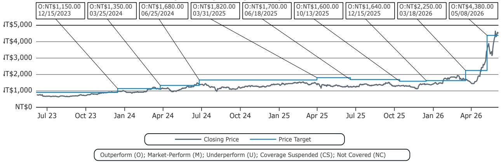

# Computex 2026：市场低估的不是算力需求，而是电力架构的重新定价

当台北南港展览馆在六月第一周涌入超过四万人次的参观者时，一个信号已经足够清晰：AI基础设施的竞赛已经从芯片性能的比拼，转向了谁能先把电力、散热和连接这三个物理瓶颈同时解决。某外资投行在Computex 2026现场发布的研报中，给出了一个值得产业决策者认真对待的判断——市场目前对AI供应链的定价，仍然停留在“需求增长”的线性逻辑上，但真正改变竞争格局的结构性变量，是电力架构的重新定价。

这份报告的核心洞察可以用一句话概括：AI数据中心的电力基础设施正在经历从“被动供电”到“主动架构”的范式转换，而这一转换将重新分配从电源设备到连接器、从液冷到PCB的整条产业链价值。

为什么这个判断现在重要？因为2026年的Computex上，800V高压直流电源机架已经不再是概念展示，而是多家供应商同时推出的量产级方案。Delta、Lite-on、Vertiv等厂商展出的800V直流电源机架，全部对齐英伟达的参考设计。这意味着，电力架构的标准化正在加速，而标准化通常伴随着规模化和集中度的提升。

以下五个维度，可以帮助你理解这场转换的产业含义。

## 1. 800V高压直流电源机架将成为AI数据中心的新标配，供应链格局正在被重新定义

过去两年，市场对AI电源的关注主要集中在功率瓦数的提升上。但Computex 2026传递出的信号是，真正重要的不是功率数值，而是配电架构本身。800V高压直流电源机架的出现，意味着数据中心内部的配电效率将从传统的48V架构跃升一个台阶。

研报指出，Delta在电源机架转换中将继续保持领先地位，预计从2026年下半年开始首次出货。但更值得关注的不是单一公司，而是这一趋势对整条供应链的连锁反应。当电源架构从低压交流转向高压直流，电源线缆和连接器也必须随之升级。研报明确提到，随着电源机架部署规模扩大，连接器厂商如Bizlink将受益于升级后的电源线和连接器需求。

这里的产业含义是：电力架构的升级不是单一组件的变化，而是整个电气系统的重构。从电源模块到配电柜，从线缆到连接器，每一个环节都会产生价值重估的机会。那些能够提前卡位800V高压直流生态的供应商，将在未来两到三年内获得显著的先发优势。

## 2. 液冷技术正在从“液对气”向“液对液”进化，但规模化的时间窗口仍在2027年后

液冷已经不是新话题，但Computex 2026上展示的产品样本揭示了技术路线的重要分化。研报指出，液对气冷却在明年仍将主导市场，但多家厂商已经开始展示液对液冷却单元的样品。Delta、Auras和Vertiv都在提供超过1兆瓦的液对液冷却单元样品，商业化时间预计在2027年下半年。

这一时间差值得注意。液对液冷却的效率更高，但系统的复杂度和成本也更高。目前市场上多数AI服务器的散热需求，液对气方案仍能覆盖。但从下一代数据中心的规划来看，液对液几乎是必然选择，因为单机柜功率密度正在逼近液对气方案的上限。

研报还提到了一些值得关注的组件级创新。Jentech展示了正在样品测试中的微通道盖板，Auras则展示了已进入量产阶段的液冷DIMM和仍在开发中的两相液冷冷板。这些组件级创新说明，液冷产业链正在从“系统集成”向“组件专业化”方向演进，这通常是一个行业走向成熟的标志。

## 3. 铜连接的生命周期比市场预期的更长，但CPO/NPO的路线分歧已经出现

英伟达在Computex上的表态“能用铜的时候就用铜”被研报直接引用，但这并不意味着光学连接不重要。更准确的解读是：铜连接在机柜内部（scale-up）仍有充足的生命周期，而光学连接将在机柜间（scale-out）扮演更重要的角色。

研报提供了几个关键的时间节点：3.2T NPO（光学引擎贴装在PCB上）将是明年scale-out的主流方案，而6.4T CPO（光学引擎集成在基板上）预计要到2028年。Wiwynn和Ayar Labs已经展示了scale-up CPO托盘，预计2027年进入客户测试阶段。

但真正有趣的是Amphenol、富士康和Arista展示的XPO方案。这种超高密度可插拔光学方案，实现了4倍于传统OSFP的密度，支持204.8T交换。结合共封装铜技术，XPO有可能进一步延长铜连接在机柜内的生命周期。

这里的产业含义是：连接方案的路线图比市场预期的更复杂，也更长。市场倾向于将CPO/NPO视为一个“要么现在、要么永远”的技术切换，但实际演进将是渐进式的，且不同应用场景会采用不同方案。这对PCB厂商如臻鼎来说是好消息，因为可插拔收发器在未来两年仍将主导scale-out市场。

## 4. 联发科在CPO和MicroLED上的布局值得关注，但ASIC业务仍缺细节

研报对联发科的评价值得仔细解读。报告中提到，联发科在Computex上展示了CPO方案，其自研的EIC和PIC设计令人印象深刻。同时，联发科正在与微软合作MicroLED项目，这项技术有可能实现光源封装在CPO内部。

但报告也坦承，联发科在ASIC业务上没有提供具体更新。这本身就是一个信号：联发科的ASIC战略可能仍在酝酿阶段，或者客户尚未进入公开披露阶段。对于投资者来说，联发科在CPO和MicroLED上的技术储备是正面信号，但ASIC业务的可见度仍然不足。

研报维持对联发科的“跑赢大盘”评级，目标价4380新台币，基于22倍市盈率和Q5-Q8每股盈利预测199新台币。但这份目标价背后的假设——尤其是ASIC业务的贡献——仍需要更多信息来验证。

## 5. 报告尚未完全回答的关键问题：电力架构升级的资本开支周期和竞争格局

即使研报提供了大量有价值的信息，仍有几个关键问题没有被完全回答。

第一个问题是资本开支周期。800V高压直流电源机架的部署，意味着数据中心运营商需要更换现有的配电基础设施。这会是一次性的资本开支高峰，还是渐进式的替换周期？不同规模的运营商（超大规模云厂商 vs. 企业级数据中心）在部署节奏上会有多大差异？这些问题的答案将直接影响供应链公司的收入可见度。

第二个问题是竞争格局的演变。研报提到Delta在电源机架转换中保持领先，但Vertiv、Flex等竞争对手也在展示类似方案。当技术标准化程度提高后，竞争将从“能否做出来”转向“成本、交付和服务能力的比拼”。Delta的领先地位能持续多久，取决于它能否将规模优势转化为成本和议价权。

第三个问题是固态变压器和燃料电池的商业化时间。研报提到固态变压器和燃料电池从2028年开始将变得更加重要，但这份报告没有详细展开这些技术的成本曲线和部署场景。对于长周期投资者来说，这些技术的演进路径可能比电源机架本身更具战略意义。

这些问题正是我们希望在后续讨论中深入探讨的方向。如果你对这些未解问题感兴趣，或者希望获得完整的研报原文和原始图表，欢迎来到我们的星球微信群继续讨论。

---

Personal reading notes and learning share only. Not investment advice.

