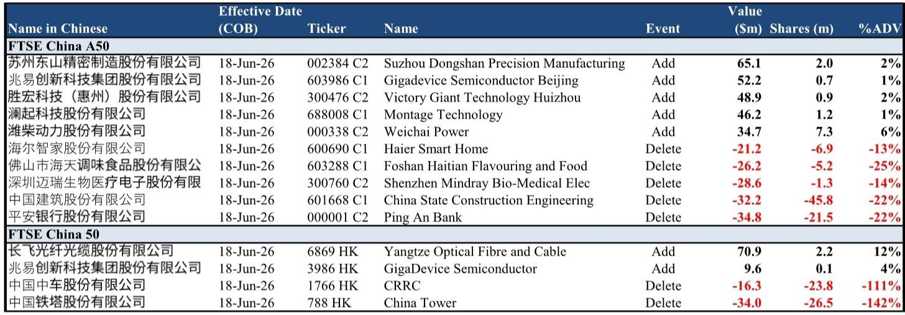
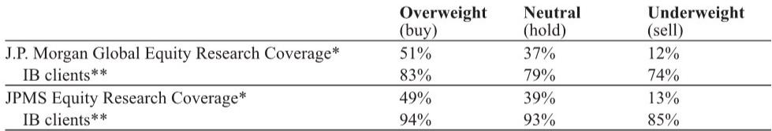

# The FTSE China Rebalance Reveals a Strategic Rotation Away from Legacy Value and Toward Semiconductor Sovereignty

The June 2026 FTSE China index rebalance is not a routine housekeeping exercise. It is a clear signal that the market’s passive infrastructure is now aligning with a structural shift in China’s economic priorities. The deletions are concentrated in state-owned industrial stalwarts and consumer staples, while the additions are dominated by semiconductor and advanced manufacturing firms. This is not about valuation cycles. It is about which sectors the global index construction machinery now deems representative of China’s future earning power.

The numbers are modest in absolute terms. The FTSE China 50 sees one-way turnover of just 3.6%, with an estimated USD 240 million in passive trade on each side. The A50 index turns over 7%, with USD 250 million per side. But the composition of those flows tells a story that goes far beyond the rebalance window. When index providers systematically replace CRRC and China Tower with GigaDevice and Montage Technology, they are codifying a thesis: China’s publicly traded equity landscape is being reshaped by technology self-sufficiency, not infrastructure spending.

Investors who treat this rebalance as a mechanical event risk missing the strategic implications. The deletions are not random; they are names that have been under structural pressure from slowing domestic demand, overcapacity, or shifting policy priorities. The additions are not speculative; they are companies with direct exposure to the semiconductor supply chain, a sector that the Chinese government has elevated to national mission status. The rebalance is a mirror, and it reflects a changing definition of what constitutes a core Chinese holding.

This article unpacks the rebalance’s logic, identifies the second-order implications that the report itself only hints at, and offers a decision framework for portfolio managers who must now decide whether to follow the index or question its assumptions.

## The Rebalance Is a Bet on Semiconductor Localization, Not Just a Sector Rotation

The most striking pattern in the additions is the overwhelming weight of semiconductor-related names. In the FTSE China A50, three of the five additions are directly tied to the chip ecosystem: GigaDevice Semiconductor Beijing, Montage Technology, and Victory Giant Technology Huizhou. In the FTSE China 50, GigaDevice appears again alongside Yangtze Optical Fibre and Cable, a key player in optical fiber and cable infrastructure that supports data centers and high-speed communications.

This is not a diversified list. It is a targeted bet on a single theme. The report does not explicitly state this, but the pattern is unmistakable. GigaDevice is a leading NOR flash and MCU designer. Montage Technology designs memory interface chips and is a critical enabler for server DRAM modules. Victory Giant Technology manufactures printed circuit boards, a foundational component for electronics and semiconductor packaging. These are not consumer-facing names. They are industrial enablers of China’s push to build a self-sufficient semiconductor supply chain.

The deletions reinforce the argument. China State Construction Engineering and Ping An Bank are proxies for the old economy: real estate development, infrastructure, and financial intermediation. Haier Smart Home and Foshan Haitian Flavouring are consumer-facing winners of the past decade. Their removal is not a judgment on their individual business quality. It is a statement that the index’s composition must evolve to reflect where China is investing its marginal capital.

The so-what is straightforward. Passive investors who track the FTSE China indices will now have a higher structural exposure to semiconductor and advanced manufacturing names. This is not a temporary factor. Until the next rebalance, these weights are locked in. For active managers, the rebalance creates a natural buyer for the additions and a forced seller for the deletions. The estimated passive flows are small relative to total market capitalization, but at the margin, they amplify the momentum behind the semiconductor theme.

## The Deletions Tell a Story of Structural Headwinds That the Report Does Not Fully Explore

The deletions from the FTSE China A50 are particularly instructive. The five names removed are China State Construction Engineering, Foshan Haitian Flavouring, Haier Smart Home, Ping An Bank, and Shenzhen Mindray Bio-Medical Electronics. Each of these companies has been a core holding for global investors seeking exposure to China’s domestic consumption and infrastructure build-out. Their removal suggests that the index committee sees these sectors as less representative of China’s current growth drivers.

China State Construction is a bellwether for the property and infrastructure cycle. Its deletion implies that the index no longer sees the construction sector as a defining feature of China’s equity market. This aligns with the broader narrative of peak infrastructure investment and the government’s pivot toward high-tech manufacturing. Ping An Bank’s deletion is even more telling. The banking sector has long been the largest weight in Chinese indices. Removing a major bank signals that the index is becoming less financialized.

Foshan Haitian and Haier Smart Home are consumer staples and durables names. Their removal suggests that the index is rotating away from domestic consumption as the primary growth story. This is a contrarian view. Many global investors still believe that China’s long-term value lies in its consumer market. The FTSE committee appears to disagree, or at least to believe that the consumer story is now mature and that the next wave of growth will come from the technology supply chain.

Mindray is the most surprising deletion. It is a high-quality medical device company with strong competitive moats and exposure to China’s aging population. Its removal may reflect concerns about pricing pressure from government procurement policies or simply the need to make room for the semiconductor additions. Either way, it is a reminder that no company is safe from the index’s structural rebalancing.

The report does not explore why these specific names were chosen. It provides the data but not the rationale. This leaves an open question: is the index committee making a deliberate bet on technology over consumption, or is this simply a function of market capitalization changes and liquidity thresholds? The answer matters because it determines whether this rebalance is a one-off or the beginning of a multi-year trend.

## The Passive Flow Estimates Are Small, but the Signaling Effect Is Large

The estimated passive trade values are modest. The FTSE China A50 rebalance implies USD 250 million of buying and selling on each side. The FTSE China 50 implies USD 240 million. For context, the average daily trading volume in the A-share market alone is often tens of billions of dollars. The passive flows from this rebalance are a drop in the ocean.

Yet the impact is disproportionate to the size. Index rebalances are highly anticipated events. The market knows the effective date and the estimated flows. This creates a predictable trading pattern: front-running by active managers, price pressure around the close on the effective date, and potential reversals in the days following. The report provides the percentage of average daily volume (ADV) for each stock, which is the key input for estimating the price impact.

The deletions face the most pressure. CRRC has an estimated passive sell of 111% of its 20-day average volume. China Tower faces 142%. These are extreme numbers. It means that on the effective date, the entire average daily volume of these stocks will be absorbed by forced selling from passive funds. The price impact could be significant, especially for China Tower, which has lower liquidity.

The additions, by contrast, have much lower ADV percentages. GigaDevice in the A50 has just 1% of ADV. Montage Technology also at 1%. The buying pressure is spread across multiple names and is small relative to normal trading volumes. This asymmetry is important. The deletions will likely experience sharp price dislocations, while the additions may see only modest upward pressure. For active managers, this creates a tactical opportunity: short the deletions before the rebalance and cover after the forced selling is complete, or buy the additions on any post-rebalance weakness.

The report does not address the tactical trading implications. It focuses on the structural changes. But for readers who are portfolio managers, the rebalance window itself is a source of alpha. The question is whether to trade the event or to use it as a signal for longer-term positioning.

## A Decision Framework for Investors: Treat the Rebalance as a Signal, Not a Mandate

The FTSE rebalance provides a clear analytical signal, but it is not a recommendation. Investors must decide how much weight to give the index’s structural judgment. The following framework can help.

First, assess your current exposure to the semiconductor and advanced manufacturing theme. If your portfolio is underweight these names relative to the new index composition, the rebalance is a reminder to consider adding exposure. The index is telling you that these sectors are now considered core to China’s equity market. You do not have to follow the index, but you should have a reason for diverging.

Second, evaluate the deletions for potential value opportunities. The forced selling may create attractive entry points for names like Mindray or Haier Smart Home, which have strong fundamentals but are being removed for structural rather than fundamental reasons. The report does not make this argument, but it is a logical second-order implication. If you believe the consumer and healthcare stories are still valid, the rebalance creates a discount.

Third, consider the concentration risk. The new additions are heavily tilted toward a single theme. If the semiconductor localization story falters, the index will underperform. The rebalance reduces diversification. Investors who prefer a more balanced exposure to China may need to supplement the index with active positions in the sectors that were removed.

Fourth, monitor the next rebalance for confirmation. If the June 2026 pattern is repeated in subsequent quarters, it will confirm that the index committee is pursuing a deliberate strategic shift. If the next rebalance reverses course and adds back consumer or financial names, then this was a one-off adjustment. The report only covers this quarter, so the trend is not yet established.

Finally, do not ignore the liquidity risk. The deletions with high ADV percentages face real price risk. If you hold these names, you may want to reduce exposure before the effective date. If you are considering buying them, wait until after the forced selling is complete.

## The Report Does Not Answer Whether This Rebalance Reflects Policy Direction or Market Mechanics

The most important unresolved question is whether this rebalance is driven by fundamental changes in the companies’ market capitalizations and liquidity, or by a deliberate decision by the index committee to tilt toward technology. The report provides the data but not the committee’s reasoning. This is a critical gap.

If the additions are simply the result of rising market caps in the semiconductor sector, then the rebalance is a passive reflection of market trends. Investors should not read too much into it. If, however, the committee made a discretionary judgment to prioritize technology names over consumer and financial names, then the rebalance is an active signal that the index is being managed for a specific outcome.

The distinction matters for forward-looking decisions. A passive rebalance is backward-looking. It tells you what has already happened. An active rebalance is forward-looking. It tells you what the committee expects to happen. The report does not clarify this, and readers are left to infer from the pattern.

My interpretation is that this is a hybrid. The semiconductor names have undoubtedly risen in market cap and liquidity, making them eligible for inclusion. But the removal of names like Mindray and Haier, which are still large and liquid, suggests a degree of active selection. The committee could have chosen to keep them and add the semiconductor names by increasing the index size. Instead, it chose to replace them. That is a judgment call.

Join the community to read the full report and review the original charts, including the detailed ADV estimates and the full list of capping factor adjustments. The original document contains additional data on the FTSE China 50 and A50 that this analysis has only touched on, including the exact share counts and the methodology behind the ADV calculations. Understanding the raw data will allow you to form your own view on whether this rebalance is the start of a new structural regime or a one-off adjustment.

*This article is for learning and discussion only and does not constitute investment advice.*

Personal reading notes and learning share only. Not investment advice.

