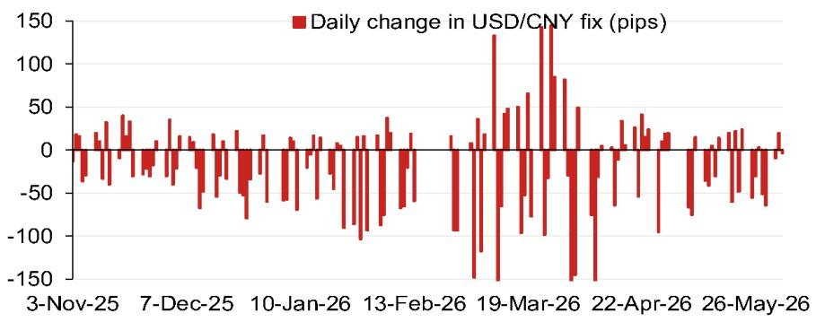
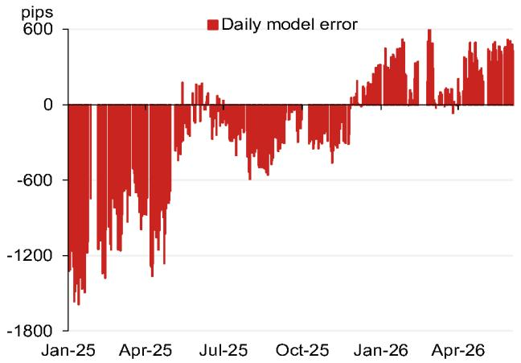

# The PBOC's Fix Model Is Signaling a Quiet Shift in Currency Strategy: Why the 505-Pip Projection Drop Matters More Than the Headline

The most important number in Asian currency markets right now is not the official USD/CNY fix itself, but the gap between what the model projects and what the central bank actually delivers. According to a detailed model from a global investment bank's Asia FX strategy team, the projected fix without counter-cyclical adjustment factors has dropped to 6.7698, a remarkable 505 pips lower than the previous projection. This is not a minor recalibration. It represents the largest single downward shift in the model's output in recent memory, and it signals that the underlying forces pressing on the renminbi are changing in character. The question is no longer whether the People's Bank of China will defend a level, but how it will manage the transition to a new equilibrium.

The model's projection, which stood at 6.8203 previously, has been slashed by more than half a cent. To put this in context, that is a move that would normally take weeks of gradual depreciation to materialize. The fact that it is appearing in a single model update suggests that the weightings of the currency basket components have shifted decisively. The Korean won and the Russian ruble are the largest negative contributors, with the ruble alone accounting for a 40-pip drag and the won contributing 17 pips. The euro and Malaysian ringgit are also negative, though more modestly. This is not a story about the dollar strengthening across the board. It is a story about specific Asian and emerging market currencies weakening relative to the renminbi's basket, forcing the model to adjust the fix lower to maintain the currency's competitiveness.

What makes this moment strategically significant is the timing. The model error chart, which tracks the daily deviation between the model's projection and the actual fix, shows a pattern that has been narrowing over the past year. Errors that exceeded 1,800 pips in early 2025 have compressed to around 600 pips by mid-2026. This convergence suggests that the PBOC is allowing the fix to become more market-determined, reducing the size of its smoothing operations. But the compression also means that when the model does shift, the actual fix is more likely to follow. The days of the central bank absorbing large deviations through counter-cyclical factors may be numbered.

The strategic implication is clear. Investors who have been positioning for a stable or gradually appreciating renminbi need to reconsider their assumptions. The model is telling us that the basket dynamics are pulling the fix lower, and the historical pattern of error compression suggests the PBOC will not resist this pull as forcefully as it once did. The question for portfolio managers is not whether to hedge renminbi exposure, but how quickly and by how much.

## The 505-Pip Drop Is Not a Forecast; It Is a Signal of Structural Basket Realignment

To understand why this model output matters, it is essential to distinguish between a forecast and a signal. The model's projection of 6.7698 is not a prediction of where the fix will be tomorrow or next week. It is a mechanical calculation based on the overnight movements of the currency basket components, weighted according to the PBOC's disclosed methodology. What makes the number significant is the magnitude of the change from the previous projection. A 505-pip drop implies that the weighted average of the basket currencies moved substantially against the renminbi overnight. This is not a random fluctuation. It reflects a structural realignment in the relative valuations of the currencies that matter most to China's trade competitiveness.

The breakdown of contributions is revealing. The Russian ruble alone accounts for 40 pips of the negative move. This is not surprising given the ongoing adjustments in energy trade flows and the geopolitical pressures that have weakened the ruble. But the Korean won's 17-pip contribution is equally important. South Korea is a direct competitor to China in many export markets, and a weaker won makes Korean goods cheaper relative to Chinese goods. The model is effectively telling us that the renminbi needs to weaken to maintain its competitive position against its closest rivals. The euro and Malaysian ringgit, while smaller contributors, reinforce the same narrative.

For the strategist, the takeaway is that the renminbi's fair value is being pulled lower by forces that are largely outside the PBOC's direct control. The central bank can smooth the path, but it cannot reverse the underlying trend without incurring significant costs. The model's output is a warning that the basket is no longer providing the support it once did.

## The Compression of Model Errors Suggests the PBOC Is Reducing Its Intervention Amplitude

The chart of daily model errors, which tracks the difference between the model's projection and the actual fix, tells a compelling story of policy evolution. In early 2025, the errors were enormous, exceeding 1,800 pips. This was a period of heavy intervention, where the PBOC was actively using its counter-cyclical adjustment factor to keep the fix far from where the market would have placed it. By mid-2026, those errors have compressed to around 600 pips. The trend is unmistakable. The PBOC is allowing the fix to converge with the model's output.

This convergence has profound implications for how investors should think about currency risk. When errors are large, the fix is predictable only in the sense that it will deviate from the model. The direction and magnitude of the deviation are policy choices, not mechanical outcomes. But as errors compress, the fix becomes more model-driven and therefore more predictable. The PBOC is effectively ceding some control to the market, or at least to the basket mechanics.

The "so what" here is that the historical pattern of large, unpredictable deviations is giving way to a regime where the fix tracks the model more closely. This reduces the uncertainty premium that investors have traditionally assigned to renminbi exposure. But it also means that when the model shifts, the fix is more likely to follow. The 505-pip drop in the projection is therefore more actionable now than it would have been a year ago, because the PBOC is less likely to offset it with a large counter-cyclical adjustment.

## The Counter-Cyclical Factor Remains the Wild Card, but Its Effectiveness Is Diminishing

The model also provides a projection that includes the counter-cyclical factor, which stands at 6.7881, or 322 pips lower than the previous fix. This is 33 pips higher than the pure model projection, indicating that the counter-cyclical factor is still being applied, but at a much smaller magnitude than in the past. The difference between the two projections, roughly 183 pips, represents the cushion that the PBOC is willing to provide to slow the depreciation.

This cushion is shrinking. In earlier periods, the counter-cyclical factor could add hundreds of pips to the fix, effectively creating a floor under the currency. Today, the cushion is barely enough to offset a single day's basket movement. The implication is that the PBOC is conserving its ammunition. It is willing to allow the renminbi to weaken in an orderly fashion, but it is not willing to fight the trend with the same intensity as before.

For investors, this means that the counter-cyclical factor should no longer be viewed as a reliable backstop. It is a tool that can smooth volatility, but it cannot reverse a structural trend. The question is not whether the renminbi will weaken, but at what pace and with what volatility. The model suggests that the pace is accelerating.

## What the Report Does Not Fully Answer: The Geopolitical Calendar and the Limits of Model-Driven Analysis

The report includes a calendar of events that extends through the end of 2026, including the Politburo meeting for economic work in late July, the APEC summit in Shenzhen in November, the Central Economic Work Conference in mid-December, and a potential visit by President Xi to the United States towards the end of the year. These events are listed without analysis of how they might affect the fix model. This is a significant gap.

The model is purely mechanical. It does not incorporate political risk, trade negotiations, or shifts in monetary policy stance. Yet these factors are likely to be the primary drivers of the renminbi's trajectory over the next six months. The APEC summit, for example, could be a venue for trade agreements or tariff adjustments that would fundamentally alter the basket weights. The Xi-Trump meeting could lead to a detente that reduces the risk premium on the renminbi, or it could lead to new tensions that accelerate depreciation.

The report also does not address what happens when the model error approaches zero. If the PBOC allows the fix to converge fully with the model, then the renminbi becomes a pure basket-driven currency. That would be a regime change of historic proportions. But the report does not explore the conditions under which the PBOC would take that step, or what it would mean for market volatility.

These are not criticisms of the model, which is designed to be a descriptive tool, not a predictive one. But they are gaps that investors need to fill with their own analysis. The model tells you where the fix is likely to be given current basket movements. It does not tell you where the basket itself is going.

## A Decision Framework for Currency Positioning in the New Regime

Given the model's signal and the PBOC's evolving behavior, investors need a framework for making currency decisions. The following three-step approach is designed to translate the model's output into actionable portfolio adjustments.

First, assess the gap between the model projection and the actual fix. A large gap, say more than 200 pips, indicates that the PBOC is still resisting the model's direction. This is a signal to wait for convergence before adjusting hedges. A small gap, as we see now with the counter-cyclical factor adding only 183 pips, indicates that the PBOC is allowing the fix to move in the model's direction. This is a signal to act.

Second, evaluate the composition of the basket movement. If the negative contributions are concentrated in a few currencies, as they are now with the ruble and the won, the move is likely to be persistent. These currencies are under structural pressure, not just experiencing a one-day fluctuation. The model's output is more reliable when the drivers are concentrated and persistent.

Third, calibrate the hedge ratio to the event calendar. The period leading up to the APEC summit and the Xi-Trump meeting is likely to be one of heightened volatility. The PBOC may use the fix to signal its policy stance, creating large deviations from the model. During these periods, a higher hedge ratio is appropriate. After the events, as the policy direction becomes clearer, the hedge ratio can be adjusted accordingly.

This framework is not a substitute for a full risk analysis, but it provides a structured way to incorporate the model's insights into a broader strategy. The key is to recognize that the model is not a crystal ball. It is a diagnostic tool that reveals the underlying pressures on the fix. The investor's job is to interpret those pressures and position accordingly.

## The Unresolved Question: How Much Further Can the Model Fall Before the PBOC Intervenes?

The model's projection has dropped 505 pips, but it could drop further. The basket weights are dynamic, and the currencies that dragged the projection down this time could continue to weaken. The ruble, in particular, faces ongoing headwinds from energy price dynamics and geopolitical isolation. The won is sensitive to the global trade cycle and to the Bank of Korea's policy stance. If these currencies continue to weaken, the model will push the fix lower.

The question is where the PBOC draws the line. The central bank has multiple tools at its disposal, including the counter-cyclical factor, direct intervention in the spot market, and capital controls. But each tool has costs. The counter-cyclical factor, as we have seen, is being used more sparingly. Direct intervention drains reserves. Capital controls distort the economy. The PBOC must balance these costs against the benefits of a stable currency.

The model cannot answer this question. It can only show the pressure. The investor must decide whether the PBOC will yield to that pressure or resist it. The historical pattern of error compression suggests that resistance is weakening. But history is not a guarantee.

This is the kind of analytical tension that makes currency markets fascinating and challenging. The model provides the data, but the strategy requires judgment. For those who want to dig deeper into the original charts and the full methodology, the report is available in its entirety.

Join the community to read the full report and review the original charts.

*This article is for learning and discussion only and does not constitute investment advice.*

Personal reading notes and learning share only. Not investment advice.

