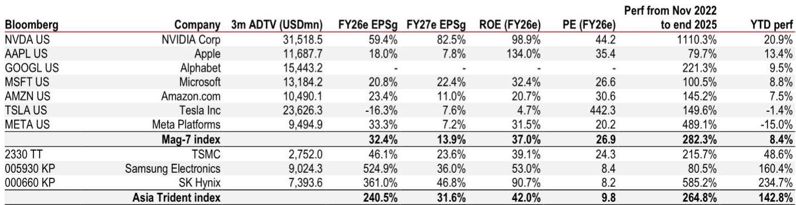
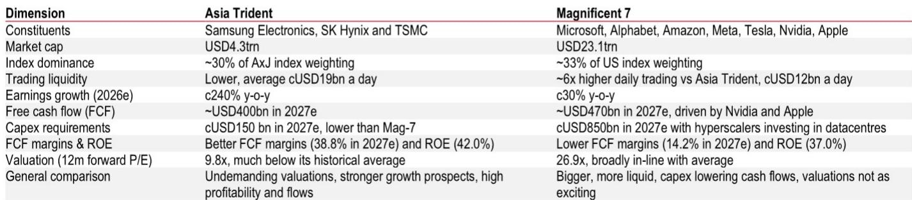
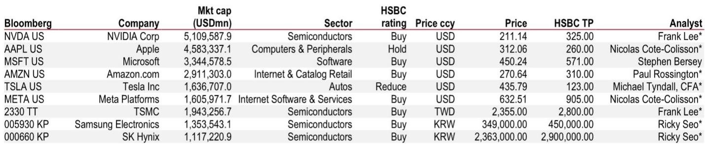

# 市场真正低估的不是需求，而是亚洲AI三巨头的估值重置

过去六个月，全球资金最拥挤的交易之一，是押注亚洲AI硬件三巨头——台积电、三星电子和SK海力士。自2025年底以来，这三只股票以等权重计算的指数涨幅已接近143%，而同期美股Magnificent 7仅上涨约8%。涨幅差距之大，让许多投资者开始追问同一个问题：这轮行情还能持续吗？

某外资投行最新发布的亚太策略报告，提供了一个值得反复推敲的分析框架。报告没有简单回答“能不能涨”，而是做了一件更关键的事：把亚洲AI三巨头与美股Mag 7放在同一张表上，从规模、流动性、盈利增长、现金流、资本开支、估值六个维度做了系统性对比。

结论是清晰的——亚洲三巨头在盈利增速、自由现金流、资本回报率等核心指标上已经具备与Mag 7对标甚至超越的实力，但估值却只有后者的三分之一。这个估值差距，才是当前市场最大的结构性误定价。

但报告也给出了一个重要的提醒：亚洲AI硬件的盈利能力历史上具有更强的周期性。这一轮估值重估的可持续性，取决于一个尚未被充分验证的假设——这次周期是否真的不同。

## 1. 亚洲三巨头对指数的支配力已经接近Mag 7，但流动性差距解释了估值折价的一半

先看规模。Mag 7总市值约23万亿美元，亚洲三巨头合计约4.3万亿美元，差距接近5倍。但真正值得关注的不是绝对值，而是它们在各自市场中的权重。

截至2026年5月，亚洲三巨头在FTSE亚洲（除日本）指数中的权重已接近30%，与Mag 7在FTSE美国指数中的约33%几乎持平。换句话说，亚洲AI硬件股对区域指数的支配力，已经达到了Mag 7对美国市场的同等水平。

但流动性是截然不同的故事。从日均成交额看，Mag 7约为118亿美元，亚洲三巨头仅约20亿美元，相差约6倍。更关键的是，亚洲三巨头仅占区域总成交额的7%，而Mag 7在美国的成交额占比高达23.5%。

这意味着什么？亚洲三巨头的估值折价，有很大一部分是流动性折价。当一只股票的日均成交额只有Mag 7的六分之一，机构投资者在配置时天然会要求更高的安全边际。当前亚洲三巨头12个月远期PE约9.8倍，而Mag 7为26.9倍。如果流动性折价部分修复，仅此一项就能带来可观的估值重估空间。

但这里需要加一个注脚：流动性折价能否收窄，取决于亚洲市场投资者结构的演变。报告提到亚洲零售投资者基础正在快速增长，但这能否转化为机构级别的交易深度，仍是一个需要持续观察的变量。

## 2. 盈利增速的差距比估值差距更惊人，但增速的可持续性才是真正的赌注

如果估值差距是市场定价错误的结果，那么盈利增长就是验证这个错误的试金石。

根据Factset一致预期，亚洲三巨头2026年净利润预计同比增长约240%，而Mag 7约为32%。即便到2027年，亚洲三巨头的增速预期仍维持在约32%，与Mag 7的14%相比依然领先。更值得注意的是，自2025年12月以来，分析师对亚洲三巨头2026年净利润的预期上调了145个百分点，而Mag 7仅为15个百分点。

这意味着，市场并未忽视亚洲AI硬件的增长故事。相反，盈利预期正在被大幅上修。但问题在于，当前的估值水平是否已经反映了这些上修？9.8倍的PE对于240%的盈利增速来说，即使考虑到半导体行业的周期性，也显得过于保守。

报告提供了一个有趣的比较视角：亚洲三巨头当前的PE不仅远低于Mag 7，也低于其自身的历史均值。而Mag 7的估值基本处于历史平均水平。换句话说，市场对Mag 7的定价是“合理”，对亚洲三巨头的定价是“打折”。这种不对称性，是当前最值得关注的定价异常。

但增速本身也暗藏风险。240%的同比增长意味着基数效应将在2027年显著放大。如果2027年增速回落至30%左右，市场是否会重新评估其估值中枢？这取决于投资者是否愿意为“周期高点后的回落”支付溢价。

## 3. 现金流和资本回报率的对比，揭示了一个反直觉的结论

盈利能力是另一个被低估的维度。报告的数据显示，亚洲三巨头2027年预期自由现金流合计约4200亿美元，与Mag 7的约4800亿美元差距并不大。但自由现金流利润率的差距是反直觉的：亚洲三巨头2027年预期FCF利润率约38.8%，而Mag 7仅为14.2%。

为什么会出现这种差异？核心在于资本开支结构。Mag 7中的美国超大规模云计算厂商正在大规模投资数据中心，2027年预期资本开支合计约8100亿美元。而亚洲三巨头的资本开支要克制得多，2027年预期合计约1500亿美元。

这意味着，亚洲三巨头在创造现金流的效率上明显更高。同样的营收规模，它们能留存更多的自由现金流。从净资产收益率看，两者差距不大——亚洲三巨头约42%，Mag 7约37%。但报告也提醒，亚洲AI硬件股的ROE历史上波动更大，周期性特征明显。

这引出了一个关键问题：亚洲三巨头当前的现金流优势，是结构性改善还是周期性的阶段性高点？如果是前者，那么当前的估值折价就是明显的投资机会；如果是后者，则需要警惕盈利拐点带来的估值回调。

## 4. 报告尚未完全回答的关键问题：这次周期真的不同吗？

报告在多个地方暗示了一个尚未完全展开的命题：亚洲AI硬件股的盈利能力是否正在经历一次结构性跃升？

从数据看，亚洲三巨头的FCF利润率从2024年的15%跃升至2026年预期的32%，再到2027年预期的39%。这种跳升的幅度，在历史上并不多见。驱动因素包括：HBM（高带宽内存）和先进制程代工的高附加值产品占比提升、产能利用率处于高位、以及资本开支强度相对可控。

但报告也明确指出了历史规律：亚洲半导体公司的盈利能力具有较强的周期性。在2017-2018年的上行周期中，亚洲三巨头的ROE曾接近40%，随后在2022-2023年的下行周期中跌至10%以下。当前42%的ROE已经接近历史峰值区域。

这里存在一个尚未被验证的核心假设：AI驱动的半导体需求周期，是否能够打破过去“两年上行、两年下行”的规律？如果AI基础设施投资持续增长，且HBM和先进制程的进入壁垒更高，那么盈利能力的可持续性可能会超出历史经验。但报告没有给出确定的答案，而是把这个问题留给了读者。

## 5. 投资者的观察框架：三个需要持续跟踪的信号

基于报告的分析逻辑，可以提炼出一个相对清晰的观察框架，帮助判断亚洲三巨头的估值重估是否仍在早期阶段。

第一个信号是盈利预期的修正方向。当前分析师仍在大幅上调2026年和2027年的盈利预测。如果这个趋势能够持续，说明产业需求端并未出现意外下行。反之，如果预期开始被下调，则可能是周期拐点的前兆。

第二个信号是资本开支的节奏变化。报告显示Mag 7的资本开支远超亚洲三巨头，但亚洲三巨头自身也在增加投入。如果资本开支增速超过营收增速，自由现金流利润率可能会承压。需要关注的是，资本开支是用于扩产还是技术升级——前者可能加剧周期性，后者则可能强化结构性优势。

第三个信号是流动性改善的迹象。亚洲三巨头在区域指数中的权重已接近30%，但成交额占比仅7%。如果随着更多被动资金和海外机构资金的流入，这一比例开始上升，那么流动性折价有望逐步收窄。这将是估值重估的催化剂之一。

这三个信号构成了一个动态的判断框架，而不是一个静态的结论。报告的价值在于提供了比较的基础数据和分析维度，但最终的判断仍需要投资者根据持续变化的产业和资金动态来做出。

---

以上讨论只是这份报告分析框架的一部分。报告中还有大量关于个股估值、目标价、盈利预测的详细数据，以及关于亚洲AI硬件产业链竞争格局的深入分析。这些内容由于篇幅限制无法在此一一展开。

如果你对完整报告中的具体数据、图表和个股分析感兴趣，欢迎来星球微信群里继续讨论。我们会在群内分享报告的原始PDF、核心图表的解读，以及后续对上述三个关键信号的持续跟踪。

Personal reading notes and learning share only. Not investment advice.

