# Bernstein Energy & Power: Heat pumps - an underappreciated lever of power demand growth?

Deepa Venkateswaran, ACA +44 20 7676 6990 deepa.venkateswaran@bernsteinsg.com

Guillaume Delaby +33 1 42 13 62 29 guillaume.delaby@bernsteinsg.com

Bob Brackett, Ph.D. +1 917 344 8422 bob.brackett@bernsteinsg.com

Neil Beveridge, Ph.D. +852 2123 2648 neil.beveridge@bernsteinsg.com

Nikhil Nigania +91 226 842 1414 nikhil.nigania@bernsteinsg.com

# BERNSTEIN ENERGY & POWER: HEAT PUMPS - AN UNDERAPPRECIATED LEVER OF POWER DEMAND GROWTH IN EUROPE?

Written by Deepa Venkateswaran and Rory Graham-Watson

The 2022 European energy crisis and the 2026 Iranian war have spurred significant adoption of decarbonisation technologies in Europe, including increased uptake of EVs and household solar/battery installations. In this Blast we analyse the prospects for an acceleration of the domestic heat pump roll-out in the wake of the latest crisis, as well as the potential beneficiaries in this scenario.

# INTRODUCTION

As set out in Exhibit 1, the heat pump is a core technology in the decarbonization plans of European national governments, including the UK. The UK Government is targeting over 450,000 new installations per year by 2030, with the National Energy System Operator contemplating 10-25% of households being fitted with a device by 2035, vs \~1% currently. Additionally, under the Labour government's Future Homes Standard, all new-build houses in the UK from 2028 onward must be fitted with a heat pump. In the EU, the 2022 REPowerEU Plan contemplates the installation of 30m heat pumps by 2030, whilst the 2026 Energy Plan/AccelerateEU contemplates 4m heat pump sales per year by 2030. In this edition of the Blast we set out an overview of heat pump technology including its history, mechanisms and key variants, as well as examining its potential implications for the broader electricity system.

EXHIBIT 1: Heat pump adoption is a key pillar of the UK's decarbonisation plans   
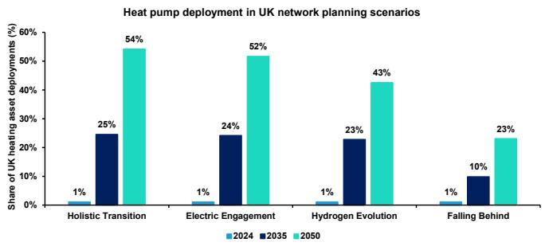

<details>
<summary>bar</summary>

| Scenario           | 2024 | 2035 | 2050 |
| ------------------ | ---- | ---- | ---- |
| Holistic Transition | 1%   | 25%  | 54%  |
| Electric Engagement | 1%   | 24%  | 52%  |
| Hydrogen Evolution | 1%   | 23%  | 43%  |
| Falling Behind     | 1%   | 10%  | 23%  |
</details>

Source: UK National Energy System Operator, Bernstein analysis

# WHAT IS A HEAT PUMP?

A heat pump is an electrically-powered heating device that uses a combination of ambient heat and compression technology to heat a building or other structure. The most commonly deployed version of the technology, the air source heat pump (ASHP), absorbs ambient heat from the air. Other versions, e.g. ground source heat pumps (GSHP) source heat from underground pipe networks. Heat pumps can enjoy significant energy efficiency benefits as the device is able to transfer more heat energy into the heated building than the electrical energy it uses in its operation.

# HOW DO HEAT PUMPS WORK?

Heat pumps work on the basis of the 4-step refrigeration cycle, i.e. 1) Evaporation, 2) Compression, 3) Condensation and 4) Expansion.

EXHIBIT 2: Illustrative air source heat pump operating cycle   
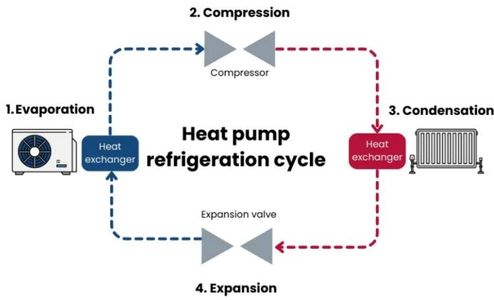

<details>
<summary>flowchart</summary>

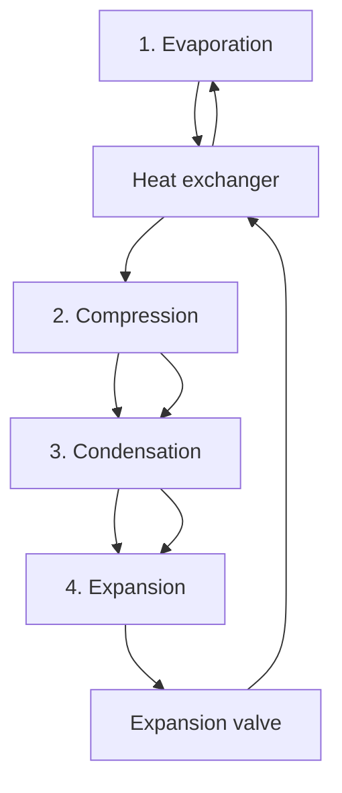
</details>

Source: Energy Saving Trust

# Evaporation

In air source heat pumps, fans are used to blow ambient outdoor air over a heat exchanger containing a chemical refrigerant in a liquid form. This liquid chemical refrigerant has a sufficiently low boiling point that even the ambient outdoor heat is sufficient to induce its evaporation into a low-pressure, low-temperature gas.

# Compression

The newly-evaporated gas is directed into an electrically-powered compressor. The compression process further raises the temperature of the gas by raising its pressure.

# Condensation

Following the compression process, the gas is transferred to a second heat exchanger which transfers its stored heat energy into a water circuit, thereby warming the water which subsequently either powers the heating system emitters (e.g. radiators or underfloor heating installations) or is used for the hot water supply.

# Expansion

Having transferred its heat to the hot water system, the newly-cooled but still compressed gas is passed through an expansion valve to lower its pressure. The decompression process further lowers the temperature of the gas such that it is again ready to absorb ambient heat from the outdoor surroundings.

# HISTORY OF HEAT PUMP TECHNOLOGY

The first instance of heat pump technology in Europe can be traced to Switzerland. Reportedly “as early as 1852, Lord Kelvin had an intuition regarding the heat pump, in remarking that a ‘reverse heat engine’ could be used not only for cooling but also for heating.’ The first large scale heat pump was installed in the US in 1948 before

the 1970s oil crisis accelerated the momentum of the technology.

EXHIBIT 3: A 1.86 MW Sulzer heat pump with 3 three-stage piston compressors, 1942   


<details>
<summary>text_image</summary>

Wärme-Pumpe - Ammoniakkreislauf.
Fernheizkraftwerk Eidg.Techn.Hochschule Zürich.
SULZER
Patente & Anmeld.
Tous droits réservés
Alle Rechte vorbehalten
All rights reserved
732233
</details>

Source: Martin Zogg, European Heat Pump Association

# TYPES OF HEAT PUMP

The two primary types of heat pump are 1) air source and 2) ground source. The former draws ambient heat from the surrounding air, whilst the latter is buried underground and draws ambient heat from the surrounding earth. Air source heat pumps are significantly more prevalent because 1) they require less space and 2) are significantly less costly to install, although they are also somewhat less efficient to operate because of variations in air temperature, which varies more than ground temperature.

EXHIBIT 4: An air source heat pump   


<details>
<summary>natural_image</summary>

Exterior view of a modern residential courtyard with a large air conditioner unit and brick wall, no visible text or symbols.
</details>

Source: EDF

EXHIBIT 5: A ground source heat pump   
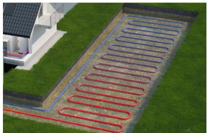

<details>
<summary>natural_image</summary>

Aerial view of a residential area with a paved road lined with red and blue oval-shaped pathways, adjacent to a house (no visible text or symbols)
</details>

Source: Energy Saving Trust

We set out a comparison of the operating mechanisms of air source and ground source heat pumps in Exhibit 6 below.

EXHIBIT 6: Air source and ground source heat pump operating mechanisms   
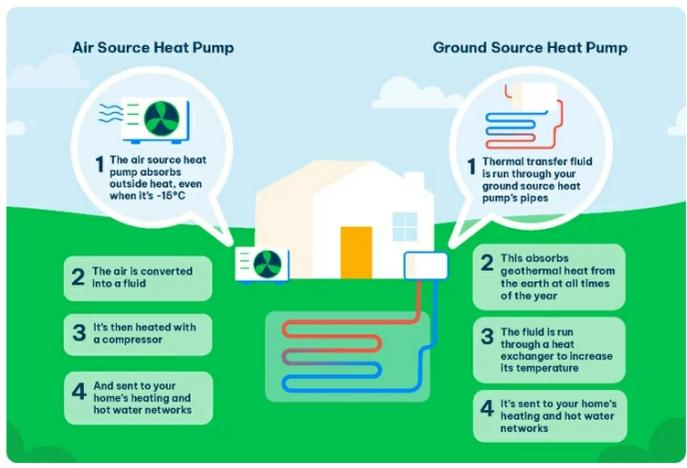

<details>
<summary>flowchart</summary>

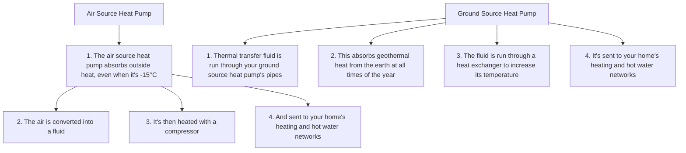
</details>

Source: The Eco Experts

# ILLUSTRATIVE ECONOMICS

Heat pumps are an alternative heating technology to traditional mechanisms such as oil- or gas-fired boilers. The competitiveness of heat pumps vs alternatives is a function of 1) the upfront cost (in turn primarily a function of site-specific factors) and 2) the ongoing operating cost (a function of e.g. the quality of installation and the ratio of electricity to gas prices in the relevant market). Unlike other decarbonization technologies, the total costs of ownership of heat pumps have an opex rather than a capex skew - see Exhibit 7.

EXHIBIT 7: Illustrative split of total cost of ownership of key decarbonisation technologies   
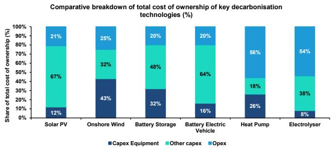

<details>
<summary>bar_stacked</summary>

Comparative breakdown of total cost of ownership of key decarbonisation technologies (%)
| Technology | Capex Equipment (%) | Other capex (%) | Opex (%) |
| :--- | :--- | :--- | :--- |
| Solar PV | 12 | 67 | 21 |
| Onshore Wind | 43 | 32 | 25 |
| Battery Storage | 32 | 48 | 20 |
| Battery Electric Vehicle | 16 | 64 | 20 |
| Heat Pump | 26 | 18 | 56 |
| Electrolyser | 8 | 38 | 54 |
</details>

Values estimated from Figure 7.17 of IEA Energy Technology Perspectives 2026
Source: IEA\*, Bernstein analysis

# Installation costs

Heat pumps are typically significantly more expensive to install than comparable gas boilers on account of the significantly greater complexity of the process, which may require upgrades to pipework and the installation of additional radiators as well as upgrades to the existing hot water cylinder.

# Operating costs

Excluding initial installation costs, the key considerations driving the technology decision between a gas boiler and an electric heat pump are 1) the comparative efficiency ratings and 2) the comparative fuel costs. Where correctly installed, heat pumps are able to achieve an efficiency rating of up to \~400%, i.e. using only 25% of the heat energy they generate as electrical energy to power the heating process. This is achieved by the physics of the evaporation, compression, condensation and expansion processes. By contrast, a gas boiler would typically achieve a maximum efficiency rating of \~93%, using more gas input than heat output generated. However, whilst heat pumps are considerably more efficient than gas boilers, the electricity that they use for fuel is also significantly more expensive in several countries including the UK.

The ratio of heat output to the electric energy input is known as the Coefficient of Performance ('COP'). Alongside the cost of electricity and the temperature differential between outside and inside, the COP is a key determinant of the operating costs of a heat pump.

The operating efficiency of a heat pump varies with: 1) the external temperature, with greater efficiency on warmer days; and 2) the internal temperature, with greater efficiency when the internal heating and hot water systems run at a lower temperature; alongside other factors pertaining to the system design, as we explain in more detail later in this Blast.

We set out in Exhibit 8 the indicative annual electricity costs for a heat pump generating \~9,000 kWh of heat energy per year and operating at varying efficiency levels. This analysis assumes electricity costs at 26.11 p/kWh, in line with the recently published UK price cap rates for Q3 2026.

EXHIBIT 8: Achieved operating efficiency is a key driver of the total cost of ownership for a heat pump   
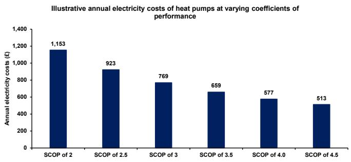

<details>
<summary>bar</summary>

| SCOP | Annual electricity costs (£) |
| ---- | ---------------------------- |
| 2    | 1,153                        |
| 2.5  | 923                          |
| 3    | 769                          |
| 3.5  | 659                          |
| 4.0  | 577                          |
| 4.5  | 513                          |
</details>

Source: Bernstein analysis and estimates

In a domestic context, a homeowner would typically consider installing an air source heat pump as an alternative to a gas boiler. As we set out in Exhibit 9, along with the prevailing level of electricity prices, the operating efficiency is a key variable in this decision, with a SCOP of higher than 3 typically required for operating cost parity. Octopus Energy, an energy retailer and heat pump installer in the UK, aims for a SCOP of \~3.3 on its installations.

EXHIBIT 9: Illustrative comparative economics of a gas boiler vs heat pump at varying efficiency levels and power price scenarios 

<table><tr><td>£ except where stated</td><td>Gas combi boiler</td><td>UK heat pump pre grant</td><td>UK heat pump post grant</td><td>France illustrative heat pump post grant</td></tr><tr><td>Upfront cost</td><td>3,500</td><td>10,000</td><td>2,500</td><td>2,241</td></tr><tr><td>Asset Life (years)</td><td>13</td><td>20</td><td>20</td><td>20</td></tr><tr><td>Depreciation and financing</td><td>406</td><td>872</td><td>218</td><td>195</td></tr><tr><td>Annual maintenance</td><td>110</td><td>180</td><td>180</td><td>180</td></tr><tr><td>Annual fuel costs (at 300% COP for HP)</td><td>946</td><td>1,044</td><td>1,044</td><td>776</td></tr><tr><td>Total cost of ownership (at 300% COP for HP)</td><td>1,462</td><td>2,096</td><td>1,442</td><td>1,151</td></tr><tr><td>Annual saving vs gas boiler (at 300% COP for HP)</td><td>0</td><td>-634</td><td>19</td><td>808</td></tr><tr><td>Annual fuel costs (at 400% COP for HP)</td><td>946</td><td>783</td><td>783</td><td>582</td></tr><tr><td>Total cost of ownership (at 400% COP for HP)</td><td>1,462</td><td>1,835</td><td>1,181</td><td>957</td></tr><tr><td>Annual saving vs gas boiler (at 400% COP for HP)</td><td>0</td><td>-373</td><td>280</td><td>1,002</td></tr></table>

Source: Bernstein analysis and estimates

Alongside the quality of installation, a key driver of achieved heat pump operating efficiency is the level of insulation in a property; the better the insulation, the lower the loss of heat from the property and the lower the required “flow temperature” from the heat pump, where the flow temperature is the temperature of the water in the system as it leaves the pump unit. A better-insulated property can operate at a lower flow temperature because the property’s radiators (or other heat emitters) will need to work less hard to maintain the targeted temperature given the reduced heat leakage. This reduces the burden on the heat pump and increases its efficiency.

EXHIBIT 10: Flow temperatures, impacted by insulation levels, are a key driver of heat pump efficiency   


<details>
<summary>flowchart</summary>

```mermaid
graph TD
    A["LOWER FLOW TEMPERATURE (e.g., 35°C)"] --> B["2.5-3.5"]
    B --> C["3.5-4.5"]
    C --> D["4.5-5.5"]
    D --> E["5.5-6.5"]
    E --> F["6.5-7.5"]
    F --> G["7.5-8.5"]
    G --> H["8.5-9.5"]
    H --> I["9.5-10.5"]
    I --> J["10.5-11.5"]
    J --> K["11.5-12.5"]
    K --> L["12.5-13.5"]
    L --> M["13.5-14.5"]
    M --> N["14.5-15.5"]
    N --> O["15.5-16.5"]
    O --> P["16.5-17.5"]
    P --> Q["17.5-18.5"]
    Q --> R["18.5-19.5"]
    R --> S["19.5-20.5"]
    S --> T["20.5-21.5"]
    T --> U["21.5-22.5"]
    U --> V["22.5-23.5"]
    V --> W["23.5-24.5"]
    W --> X["24.5-25.5"]
    X --> Y["25.5-26.5"]
    Y --> Z["26.5-27.5"]
    Z --> AA["27.5-28.5"]
    AA --> AB["28.5-29.5"]
    AB --> AC["29.5-30.5"]
    AC --> AD["30.5-31.5"]
    AD --> AE["31.5-32.5"]
    AE --> AF["32.5-33.5"]
    AF --> AG["33.5-34.5"]
    AG --> AH["34.5-35.5"]
    AH --> AI["35.5-36.5"]
    AI --> AJ["36.5-37.5"]
    AJ --> AK["37.5-38.5"]
    AK --> AL["38.5-39.5"]
    AL --> AM["39.5-40.5"]
    AM --> AN["40.5-41.5"]
    AN --> AO["41.5-42.5"]
    AO --> AP["42.5-43.5"]
    AP --> AQ["43.5-44.5"]
    AQ --> AR["44.5-45.5"]
    AR --> AS["45.5-46.5"]
    AS --> AT["46.5-47.5"]
    AT --> AU["47.5-48.5"]
    AU --> AV["48.5-49.5"]
    AV --> AW["49.5-50.5"]
    AW --> AX["50.5-51.5"]
    AX --> AY["51.5-52.5"]
    AY --> AZ["52.5-53.5"]
    AZ --> BA["53.5-54.5"]
    BA --> BB["54.5-55.5"]
    BB --> BC["55.5-56.5"]
    BC --> BD["56.5-57.5"]
    BD --> BE["57.5-58.5"]
    BE --> BF["58.5-59.5"]
    BF --> BG["60.0-61.0"]
    BG --> BH["61.0-62.0"]
    BH --> BI["62.0-63.0"]
    BI --> BJ["63.0-64.0"]
    BJ --> BK["64.0-65.0"]
    BK --> BL["65.0-66.0"]
    BL --> BM["66.0-67.0"]
    BM --> BN["67.0-68.0"]
    BN --> BO["68.0-69.0"]
    BO --> BP["69.0-70.0"]
    BP --> BQ["70.0-71.0"]
    BQ --> BR["71.0-72.0"]
    BR --> BS["72.0-73.0"]
    BS --> BT["73.0-74.0"]
    BT --> BU["74.0-75.0"]
    BU --> BV["75.0-76.0"]
    BV --> BW["76.0-77.0"]
    BW --> BX["77.0-78.0"]
    BX --> BY["78.0-79.0"]
    BY --> BZ["79.0-80.0"]
    BZ --> CA["80.0-81.0"]
    CA --> CB["81.0-82.0"]
    CB --> CC["82.0-83.0"]
    CC --> CD["83.0-84.0"]
    CD --> CE["84.0-85.0"]
    CE --> CF["85.0-86.0"]
    CF --> CG["86.0-87.0"]
    CG --> CH["87.0-88.0"]
    CH --> CI["88.0-89.0"]
    CI --> CJ["89.0-90.0"]
    CJ --> CK["90.0-91.0"]
    CK --> CL["91.0-92.0"]
    CL --> CM["92.0-93.0"]
    CM --> CN["93.0-94.0"]
    CN --> CO["94.0-95.0"]
    CO --> CP["95.0-96.0"]
    CP --> CQ["96.0-97.0"]
    CQ --> CR["97.0-98.0"]
    CR --> CS["98.0-99.0"]
    CS --> CT[99, 100, 101, 102, 103, 104, 105, 106, 107, 108, 109, 110, 111, 112, 113, 114, 115, 116, 117, 118, 119, 120, 121, 122, 123, 124, 125, 126, 127, 128, 129, 130, 131, 132, 133, 134, 135, 136, 137, 138, 139, 140, 141, 142, 143, 144, 145, 146, 147, 148, 149, 150, 151, 152, 153, 154, 155, 156, 157, 158, 159, 160, 161, 162, 163, 164, 165, 166, 167, 168, 169, 170, 171, 172, 173, 174, 175, 176, 177, 178, 179, 180, 181, 182, 183, 184, 185, 186, 187, 188, 189, 190, 191, 192, 193, 194, 195, 196, 197, 198, 199, 200, 201, 202, 203, 204, 205, 206, 207, 208, 209, 210, 211, 212, 213, 214, 215, 216, 217, 218, 219, 220, 221, 222, 223, 224, 225, 226, 227, 228, 229, 230, 231, 232, 233, 234, 235, 236, 237, 238, 239, 240, 241, 242, 243, 244, 245, 246, 247, 248, 249, 250 |
```
</details>

Source: IDM Energie

We set out an overview of the comparative ages of the housing stock in major European countries in Exhibit 11. The age of housing stock is strongly correlated with insulation quality.

EXHIBIT 11: Comparative analysis of the share of housing stock in major European countries that was built before 1946   
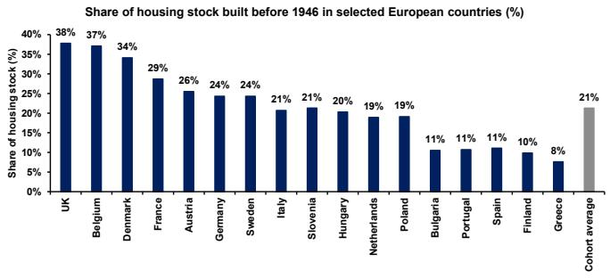

<details>
<summary>bar</summary>

Share of housing stock built before 1946 in selected European countries (%)
| Country | Share of housing stock (%) |
| :--- | :--- |
| UK | 38 |
| Belgium | 37 |
| Denmark | 34 |
| France | 29 |
| Austria | 26 |
| Germany | 24 |
| Sweden | 24 |
| Italy | 21 |
| Slovenia | 21 |
| Hungary | 20 |
| Netherlands | 19 |
| Poland | 19 |
| Bulgaria | 11 |
| Portugal | 11 |
| Spain | 11 |
| Finland | 10 |
| Greece | 8 |
| Cohort average | 21 |
</details>

Source: Building Research Establishment, Bernstein analysis

Alongside the importance of operating efficiency, Exhibit 9 above highlights the importance of the electricity-to-gas price ratio in driving the competitiveness of heat pumps. We set out a comparison of the electricity-to-gas price ratios of major European countries in Exhibit 12. As we explore in more detail later in this Blast, there is a strong correlation between this metric and heat pump uptake in major European countries.

EXHIBIT 12: The UK and Belgium have the highest electricity-to-gas price ratios amongst major European countries   
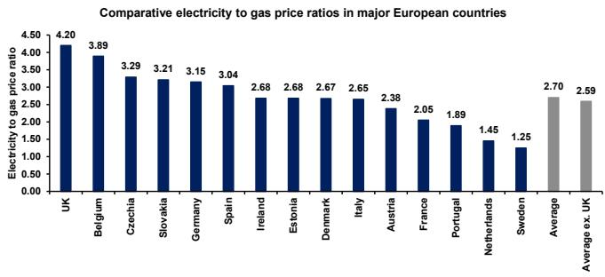

<details>
<summary>bar</summary>

Comparative electricity to gas price ratios in major European countries
| Country | Electricity to gas price ratio |
| :--- | :--- |
| UK | 4.20 |
| Belgium | 3.89 |
| Czechia | 3.29 |
| Slovakia | 3.21 |
| Germany | 3.15 |
| Spain | 3.04 |
| Ireland | 2.68 |
| Estonia | 2.68 |
| Denmark | 2.67 |
| Italy | 2.65 |
| Austria | 2.38 |
| France | 2.05 |
| Portugal | 1.89 |
| Netherlands | 1.45 |
| Sweden | 1.25 |
| Average | 2.70 |
| Average ex. UK | 2.59 |
</details>

Source: Nesta, Bernstein analysis

# HEAT PUMPS: A MIXED ADOPTION PICTURE IN EUROPE

As set out in Exhibit 13, heat pumps are currently a niche technology in markets such as the UK, with annual installations currently tracking far short of the minimum contemplated annual run rate in the UK's electricity system planning (\~250,000 year to 2035) or in UK government targets (450,000/year by 2030). Regulator Ofgem has highlighted the challenge well: "Earlier this year, the UK government updated its ambition for heat pump uptake in the Warm Homes Plan (WHP), replacing the previous aspiration of 600,000 installations per year by 2028 with an ambition for 450,000 annual installations by 2030. Official statistics show there were 51,886 retrofit heat pump installations in 2025.13 If around 200,000 installations per year in 2030 are expected to come from new homes, retrofit installations in existing buildings would need to rise to around 250,000 per year by 2030, implying average growth of around 37% per year over the next five years."

EXHIBIT 13: Annual heat pump installations in the UK are currently tracking far below the run rate contemplated in electricity system planning   
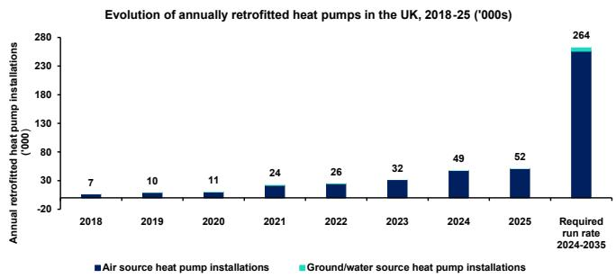

<details>
<summary>bar</summary>

| Year | Air source heat pump installations ('000s) | Ground/water source heat pump installations ('000s) |
|------|-------------------------------------------|--------------------------------------------------|
| 2018 | 7                                         | -                                                |
| 2019 | 10                                        | -                                                |
| 2020 | 11                                        | -                                                |
| 2021 | 24                                        | -                                                |
| 2022 | 26                                        | -                                                |
| 2023 | 32                                        | -                                                |
| 2024 | 49                                        | -                                                |
| 2025 | 52                                        | -                                                |
| Required run rate 2024-2035 | 264                                       | -                                                |
</details>

Source: DESNZ, National Energy System Operator, Bernstein analysis

In Europe more broadly, as we show in Exhibit 14, the picture is different, with heat pumps now a mainstream heating technology, reaching \~30% market share in 2022, 2023 and 2024 (the most recent year for which data is available). The UK's laggard status in heat pump adoption is most likely explained by a combination of factors including 1) the country's high electricity-to-power price costs as discussed in more detail earlier and 2) the comparatively poor levels of insulation in UK real estate, which serves to increase heat pump annual running costs.

EXHIBIT 14: Annual market share of heat pumps in European space heating, 2010-2024   
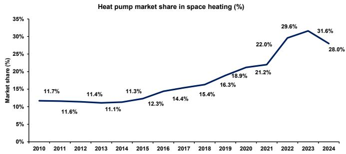

<details>
<summary>line</summary>

Heat pump market share in space heating (%)
| Year | Market share (%) |
|---|---|
| 2010 | 11.7 |
| 2011 | 11.6 |
| 2012 | 11.4 |
| 2013 | 11.1 |
| 2014 | 11.3 |
| 2015 | 12.3 |
| 2016 | 14.4 |
| 2017 | 15.4 |
| 2018 | 16.3 |
| 2019 | 18.9 |
| 2020 | 21.2 |
| 2021 | 22.0 |
| 2022 | 29.6 |
| 2023 | 31.6 |
| 2024 | 28.0 |
</details>

Source: European Heat Pump Association, Bernstein analysis

We set out the annual evolution of heat pump sales in Europe in Exhibit 15. Following an \~8% CAGR from 2010-2021, sales spiked by 42% between 2021 and 2022 in the wake of the Russia-Ukraine crisis, before falling by \~25% between 2022 and 2024, and rising by \~10% between 2024 and 2025. Annual sales remain significantly short of the EU's 2030 target of 4m units. For a cohort of European countries, heat-pump sales in Q1'26 have risen by 17%, as discussed below.

EXHIBIT 15: Annual evolution of European heat pump sales   
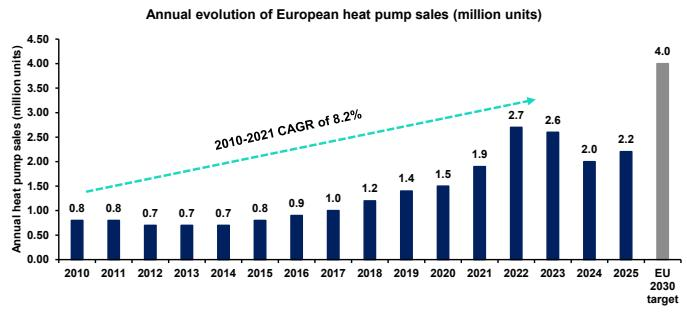

<details>
<summary>bar</summary>

| Year | Annual heat pump sales (million units) |
| ---- | -------------------------------------- |
| 2010 | 0.8                                    |
| 2011 | 0.8                                    |
| 2012 | 0.7                                    |
| 2013 | 0.7                                    |
| 2014 | 0.7                                    |
| 2015 | 0.8                                    |
| 2016 | 0.9                                    |
| 2017 | 1.0                                    |
| 2018 | 1.2                                    |
| 2019 | 1.4                                    |
| 2020 | 1.5                                    |
| 2021 | 1.9                                    |
| 2022 | 2.7                                    |
| 2023 | 2.6                                    |
| 2024 | 2.0                                    |
| 2025 | 2.2                                    |
| EU 2030 target | 4.0                               |
</details>

Source: European Heat Pump Association, Bernstein analysis

# ON THE BRINK OF A BREAKTHROUGH...?

There is significant evidence that the current Iranian crisis is catalyzing decarbonization momentum in Europe, as seen e.g. in 1) rising EV sales and 2) increasing installation of solar panels. Some industry observers have suggested that heat pump installation could see a similar boost. In the UK, The Times reported on 30 April 2026 that “the number of applications for heat pump grants...jumped to its second-highest monthly level on record” in March 2026. Similarly, in France, Le Monde reported in May 2026 that environmental services provider Effy had seen a >140% increase in heat pump installation inquiries in April 2026 vs the prior year. The French association of heating, ventilation, air conditioning and refrigeration industries (UNICLIMA) has also reported a “boom” in requests for quotes.

As we set out in Exhibit 16, some major continental European markets saw strong year-over-year growth in heat pump sales in Q1 2026, with Finland reporting a 47% increase, Germany a 34% increase and France a 22% increase.

EXHIBIT 16: Q1 2026 year-over-year heat pump sales data in selected continental European markets   
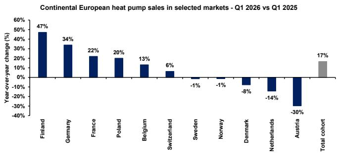

<details>
<summary>bar</summary>

Continental European heat pump sales in selected markets - Q1 2026 vs Q1 2025
| Country/Category | Year-over-year change (%) |
| :--- | :--- |
| Finland | 47 |
| Germany | 34 |
| France | 22 |
| Poland | 20 |
| Belgium | 13 |
| Switzerland | 6 |
| Sweden | -1 |
| Norway | -1 |
| Denmark | -8 |
| Netherlands | -14 |
| Austria | -30 |
| Total cohort | 17 |
</details>

Source: European Heat Pump Association, Bernstein analysis

# OTHER DECARBONISATION TECHNOLOGIES ARE SEEING A BOOST FROM THE IRANIAN CRISIS

The UK is currently seeing significant momentum in EV adoption, with the Society of Motor Manufacturers and Traders reporting a 59.1% year-on-year increase in Battery Electric Vehicle

registrations in April 2026, equivalent to a \~26% market share. As set out in Exhibit 17, in Europe more broadly, Italy saw a \~66% year-on-year increase in new battery electric vehicle registrations in Q1 2026 vs 2025.

EXHIBIT 17: Europe saw significant increases in EV demand in Q1 2026 vs Q1 2025   
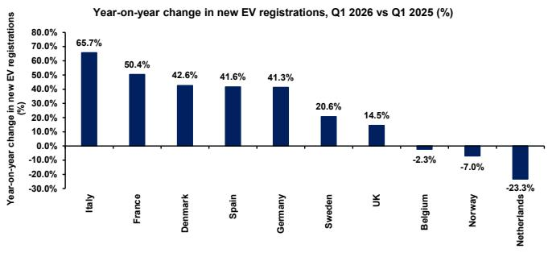

<details>
<summary>bar</summary>

Year-on-year change in new EV registrations, Q1 2026 vs Q1 2025 (%)
| Country | Year-on-year change in new EV registrations (%) |
| :--- | :--- |
| Italy | 65.7 |
| France | 50.4 |
| Denmark | 42.6 |
| Spain | 41.6 |
| Germany | 41.3 |
| Sweden | 20.6 |
| UK | 14.5 |
| Belgium | -2.3 |
| Norway | -7.0 |
| Netherlands | -23.3 |
</details>

Source: ACEA, Bernstein analysis

As set out in Exhibit 18, a similar trend is visible in domestic solar generation capacity in the UK. 85MW of capacity was installed in March 2026, c.4% above the 2023 peak in March (\~82GW) and close to the maximum monthly figure since the start of 2020 (85MW in April 2025). Since the start of the Russia-Ukraine war in February 2022, monthly domestic solar panel capacity installation has risen by \~300% in the UK.

EXHIBIT 18: UK monthly domestic solar generation capacity installations   
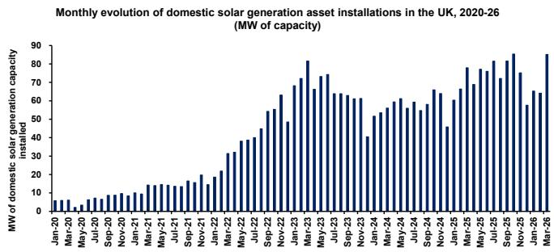

<details>
<summary>bar</summary>

Monthly evolution of domestic solar generation asset installations in the UK, 2020-26 (MW of capacity)
| Month | MW of domestic solar generation capacity installed |
|---|---|
| Jan-20 | 5 |
| Feb-20 | 4 |
| Mar-20 | 3 |
| Apr-20 | 4 |
| May-20 | 5 |
| Jun-20 | 6 |
| Jul-20 | 7 |
| Aug-20 | 8 |
| Sep-20 | 9 |
| Oct-20 | 10 |
| Nov-20 | 11 |
| Dec-20 | 12 |
| Jan-21 | 13 |
| Feb-21 | 14 |
| Mar-21 | 15 |
| Apr-21 | 16 |
| May-21 | 17 |
| Jun-21 | 18 |
| Jul-21 | 19 |
| Aug-21 | 20 |
| Sep-21 | 21 |
| Oct-21 | 22 |
| Nov-21 | 23 |
| Dec-21 | 24 |
| Jan-22 | 25 |
| Feb-22 | 26 |
| Mar-22 | 27 |
| Apr-22 | 28 |
| May-22 | 29 |
| Jun-22 | 30 |
| Jul-22 | 31 |
| Aug-22 | 32 |
| Sep-22 | 33 |
| Oct-22 | 34 |
| Nov-22 | 35 |
| Dec-22 | 36 |
| Jan-23 | 37 |
| Feb-23 | 38 |
| Mar-23 | 39 |
| Apr-23 | 40 |
| May-23 | 41 |
| Jun-23 | 42 |
| Jul-23 | 43 |
| Aug-23 | 44 |
| Sep-23 | 45 |
| Oct-23 | 46 |
| Nov-23 | 47 |
| Dec-23 | 48 |
| Jan-24 | 49 |
| Feb-24 | 50 |
| Mar-24 | 51 |
| Apr-24 | 52 |
| May-24 | 53 |
| Jun-24 | 54 |
| Jul-24 | 55 |
| Aug-24 | 56 |
| Sep-24 | 57 |
| Oct-24 | 58 |
| Nov-24 | 59 |
| Dec-24 | 60 |
| Jan-25 | 61 |
| Feb-25 | 62 |
| Mar-25 | 63 |
| Apr-25 | 64 |
| May-25 | 65 |
| Jun-25 | 66 |
| Jul-25 | 67 |
| Aug-25 | 68 |
| Sep-25 | 69 |
| Oct-25 | 70 |
| Nov-25 | 71 |
| Dec-25 | 72 |
| Jan-26 | 73 |
| Feb-26 | 74 |
| Mar-26 | 75 |
| Apr-26 | 76 |
| May-26 | 77 |
| Jun-26 | 78 |
| Jul-26 | 79 |
| Aug-26 | 80 |
| Sep-26 | 81 |
| Oct-26 | 82 |
| Nov-26 | 83 |
| Dec-26 | 84 |
| Jan-27 | 85 |
| Feb-27 | 86 |
| Mar-27 | 87 |
| Apr-27 | 88 |
| May-27 | 89 |
| Jun-27 | 90 |
| Jul-27 | 91 |
| Aug-27 | 92 |
| Sep-27 | 93 |
| Oct-27 | 94 |
| Nov-27 | 95 |
| Dec-27 | 96 |
| Jan-28 | 97 |
| Feb-28 | 98 |
| Mar-28 | 99 |
The data is a time series with months on the x-axis and the installed capacity in MW of solar generation on the y-axis. The chart displays a single series representing total installed capacity over time. The values are estimated based on the cumulative sum of available capacities for each month. There is no additional data series present in this image. The chart type is a single series.
</details>

Source: DESNZ, Bernstein analysis

In support of the view that heat pumps would be also caught up in the post-war decarbonisation boom, as set out in Exhibit 19, The Times in the UK reported on 30 April 2026 that in March 2026, the number of applications for heat pump grants jumped to its second-highest level on record. Meanwhile Greg Jackson, CEO of Octopus Energy, told the BBC in March 2026 that his company had seen a 50% rise in solar panels vs February 2026, a 30% rise in heat pump sales and a >33% rise in enquiries about EVs.

# EXHIBIT 19: The 2026 Iranian crisis has spurred adoption of decarbonisation technologies in the UK

# Solar panels fitted every three minutes in UK since Iran conflict

More of them fitted in March than any month since 2012 as conflict in the Middle East causes energy crisis


<details>
<summary>natural_image</summary>

Roof-mounted solar panels on a house roof with a brick chimney and antenna (no text or symbols visible)
</details>

Solar panels can help households save hundreds of pounds a year   
ADRIAN SHERRATT FOR THE TIMES

Adam Vaughan, Environment Editor

Thursday April 30 2026, 8.45pm, The Times


The energy crisis triggered by conflict in the Middle East has caused a rush in solar panel and heat pump installations, with solar power being fitted on a rooftop about every three minutes.

There were more than 27,000 solar power installations in March, the highest monthly total for 14 years. The number of applications for heat pump grants also jumped to its second highest monthly level on record.

Source: The Times

# INCREASING INNOVATION COULD DRIVE COSTS LOWER

In a 2023 report for the UK Energy Research Centre, Phil Heptonstall and Mark Winskel found that “in the UK, there has been little or no reduction in the average total installed cost of heat pumps over the past decade. Over the same period, some cost reductions have been achieved internationally, and over time, particular countries have successfully aligned market growth with reduced installed costs. There are real prospects for reduced installed costs, particularly non-equipment costs, over the next decade. Most UK forecasts suggest a reduction in total installed costs by 2030 of around 20-25%. Expected savings are higher for non-equipment installations costs, including labor costs, than for equipment costs.”

# Operating efficiency is showing a favourable trend

There is some evidence that the operating efficiency of heat pumps could meaningfully improve over time. Jan Rosenow, Professor of Energy and Climate Policy at Oxford University, in partnership with Trystan Lea, analyzed a cohort of heat pumps installed on

heatpumpmonitor.org, finding an average Seasonal Coefficient of Performance of \~3.9 for this cohort, vs 2.81 in the cohort used for the UK government's Electrification of Heat trial in December 2024. The authors estimated that these results were equivalent to a 19% annual operating cost premium to gas for the UK government cohort vs a 17% saving for the Heat Pump monitor cohort. As installer expertise and experience increase over time, we see potential for accompanying improvements in operating efficiency and cost competitiveness.

We set out in Exhibit 20 the operating data for a poorly-performing heat pump from the UK government's Electrification of Heat trial program. The data, for system EOH0567 on the Heat Pump Monitor website, shows poor temperature control and short cycling, indicating sub-optimal energy efficiency. With installer knowledge and experience growing as the technology is more widely deployed, achieved efficiency levels should improve.

EXHIBIT 20: Operating data for a poorly-performing heat pump from the UK government's Electrification of Heat trial program   
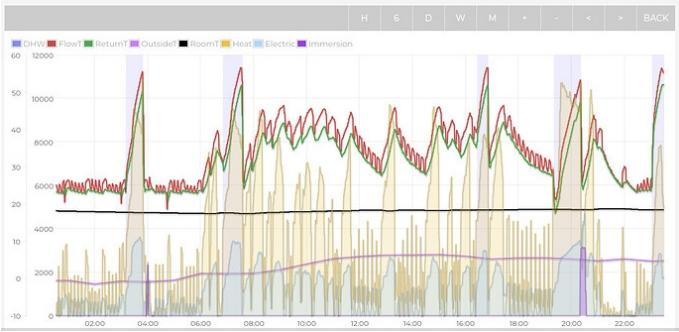

<details>
<summary>line</summary>

| Time   | DHW    | FlowT  | ReturnT | Outside | RoomT  | Heat   | Electric | Immersion |
|--------|--------|--------|---------|---------|--------|--------|----------|------------|
| 02:00  | 2000   | 2500   | 2400    | 100     | 200    | 150    | 100      | 50         |
| 04:00  | 2000   | 5500   | 5300    | 100     | 200    | 150    | 100      | 50         |
| 06:00  | 2000   | 5800   | 5600    | 100     | 200    | 150    | 100      | 50         |
| 08:00  | 2000   | 5700   | 5500    | 100     | 200    | 150    | 100      | 50         |
| 10:00  | 2000   | 5600   | 5400    | 100     | 200    | 150    | 100      | 50         |
| 12:00  | 2000   | 5500   | 5300    | 100     | 200    | 150    | 100      | 50         |
| 14:00  | 2000   | 5400   | 5200    | 100     | 200    | 150    | 100      | 50         |
| 16:00  | 2000   | 5300   | 5100    | 100     | 200    | 150    | 100      | 50         |
| 18:00  | 2000   | 5200   | 5000    | 100     | 200    | 150    | 100      | 50         |
| 20:00  | 2500   | 5100   | 4900    | 15      | 25     | 15     | 15       | 5          |
| 22:00  | 2500   | 5653   | 5479    | 15      | 25     | 15     | 15       | 5          |
</details>

Source: Open Energy Monitor

# There is some room for optimism on installation costs

In contrast to the more pessimistic picture painted above, the UK government estimated in March 2026 that there had been an 11% real terms reduction in installation costs for heat pumps in the UK since 2022. Additionally, there has also been significant innovation in the installation industry to address specific adoption bottlenecks. For example, as the UK government explains, “to provide hot water, heat pumps require a water storage cylinder, similar to older generations of gas boiler systems. New combi gas boilers do not require these cylinders, so approximately 50% of the UK housing stock lack water storage cylinders now. Further, smaller homes and last lack the spare storage space to install cylinders.” To address this bottleneck, some installers have devised smaller hot water cylinders that can fit into existing kitchen cabinetry. We see potential for further innovation to drive installation costs lower.

# Manufacturing process improvements are also a likely affordability tailwind

We also see potential for the unit costs of heat pumps to decline as manufacturing ramps up, with companies such as Octopus Energy in the UK currently making bold moves to establish a leading position in the technology.

Octopus Energy manufacture heat pumps in a factory in Northern Ireland, with full integration of deployment across the initial design, the manufacturing process and final installation and commissioning. Octopus's heat pumps are integrated into the Octopus Energy customer app and are fitted with sensors to enable remote performance monitoring.

EXHIBIT 21: Octopus Energy manufacture heat pumps under their Cosy brand name   


<details>
<summary>natural_image</summary>

Man walking past a blue electric fan on stage with brick wall background (no visible text or symbols)
</details>

Source: The Daily Telegraph

The IEA explain that “heat pump production costs vary widely by region, shaped by general manufacturing conditions (notably skills, infrastructure and labor) and market-specific factors such as product type (typically air-to-air or air-to-water), unit size, compressor choice, performance standards and regulations. Final assembly requires little energy or raw materials, so components dominate overall costs, accounting for 60-85% of production costs. Compressors are the most complex part, representing about 30% of production costs alone.”

# THERE IS A ROBUST OUTLOOK FOR EUROPEAN GOVERNMENT SUPPORT FOR HEAT PUMPS

Whilst heat pump competitiveness vs gas boilers is dependent on government subsidy, as we set out in more detail below and as shown in Exhibit 22, we see a robust appetite from governments in Europe to support the technology. The April 2026 AccelerateEU communication sets out that “the Commission will promote and help develop, including through the Energy Transition Investment Council and the Energy Efficiency Financing Coalition, social leasing schemes for clean and efficient technologies which Member States are encouraged to use to support the rapid uptake of, e.g. e-vehicles, residential heat pumps and small-scale batteries. The Commission stands ready to assist Member States in establishing financial incentives, such as targeted tax credits, for the rapid deployment of clean energy technologies such as electric vehicles, industrial and household heat pumps, behind-the-meter batteries and industrial thermal storage, while ensuring compliance with commitments under fiscal rules."

EXHIBIT 22: Comparative heat pump installation costs in selected major European countries 

<table><tr><td>Country</td><td>Price range (pre-tax)</td><td>Explanatory factors</td></tr><tr><td>Poland</td><td>€9,000-€15,000</td><td>Lower labour costs, reduced bureaucracy</td></tr><tr><td>UK</td><td>€10,000-€14,000</td><td>0% VAT, simpler regulatory standards</td></tr><tr><td>Netherlands</td><td>€11,000-€19,000</td><td>Large variety, standardised systems</td></tr><tr><td>France</td><td>€12,000-€20,000</td><td>Fixed funding, medium price level</td></tr><tr><td>Austria</td><td>€13,500-€20,000</td><td>Similar price level to Germany but with VAT concessions</td></tr><tr><td>Germany</td><td>€23,000-€40,000</td><td>Highest price level in the peer group</td></tr></table>

Source: Heat Pumps Watch, Bernstein analysis

We set out an overview of the subsidies available for heat pump installation in selected European countries in Exhibit 23.

EXHIBIT 23: Many European governments offer generous subsidies for heat pump adoption   
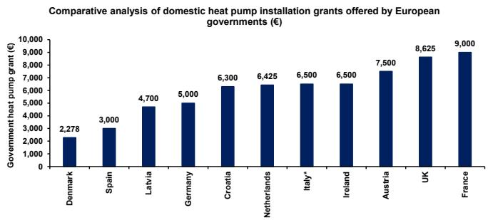

<details>
<summary>bar</summary>

Comparative analysis of domestic heat pump installation grants offered by European governments (€)
| Country | Government heat pump grant (€) |
| :--- | :--- |
| Denmark | 2,278 |
| Spain | 3,000 |
| Latvia | 4,700 |
| Germany | 5,000 |
| Croatia | 6,300 |
| Netherlands | 6,425 |
| Italy* | 6,500 |
| Ireland | 6,500 |
| Austria | 7,500 |
| UK | 8,625 |
| France | 9,000 |
</details>

Source: DESNZ, European Heat Pump Association, Bernstein analysis

# INNOVATIVE TARIFFS CAN IMPROVE COST COMPETITIVENESS

Alongside innovation in the design and manufacturing process, Octopus are also enabling the heat pump roll-out with innovative tariff options, including the Octopus Cosy tariff (see Exhibit 24), under which customers are offered 8 hours of cheap electricity per day, split over two 2-3 hour slots. During these discounted periods, customers are charged \~14.8p per KWh vs 52.49p/kWh outside of these times. Given the very high peak rate under the Cosy tariff, we would not expect it to appeal to customers who don't own a battery.

EXHIBIT 24: Octopus Energy's Cosy tariff is targeted at heat pump owners and offers 3 separated discounted electricity blocks   
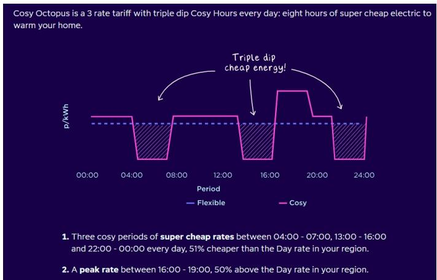

<details>
<summary>line</summary>

| Period | Flexible | Coscy |
|--------|----------|------|
| 00:00  | 51%      | 51%  |
| 04:00  | 51%      | 51%  |
| 08:00  | 51%      | 51%  |
| 12:00  | 51%      | 51%  |
| 16:00  | 51%      | 51%  |
| 20:00  | 51%      | 51%  |
| 24:00  | 51%      | 51%  |
</details>

Source: Octopus Energy

# OR ANOTHER FALSE START?

Despite the potential for optimism surrounding heat pumps in countries such as the UK, we would caution that significant barriers remain against widespread adoption as a mainstream domestic heating technology, principally the high installation costs and the UK's high electricity-to-gas price ratio. In this section we set out these potential obstacles in more detail.

# COST COMPETITIVENESS REMAINS RELIANT ON GOVERNMENT SUBSIDY

Heat pumps are considerably more expensive to install than the equivalent gas boiler. EDF present indicative cost ranges for an air source heat pump and a comparable gas boiler as between £3,999-£10,000 and £3,000-£4,000 respectively, with the stated air source heat pump range incorporating the impact of the government grant. Additionally, the air source heat pump range assumes no required upgrades to either the existing hot water cylinder or radiator system. Given that these upgrades will be required in many instances, it is clear that the upfront cost of a heat pump remains significantly higher than an equivalent gas boiler even including government grants, and is unviable without subsidy.

We set out an illustrative decomposition of UK heat pump installation costs in Exhibit 25 below.

EXHIBIT 25: Illustrative decomposition of UK heat pump installation costs   
Illustrative composition of heat pump installation costs (%)   
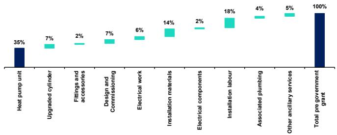

<details>
<summary>bar</summary>

| Category                  | Percentage |
| ------------------------- | ---------- |
| Heat pump unit            | 35%        |
| Upgraded cylinder         | 7%         |
| Fittings and accessories  | 2%         |
| Design and Commissioning  | 7%         |
| Electrical work           | 6%         |
| Installation materials    | 14%        |
| Electrical components     | 2%         |
| Installation labour       | 18%        |
| Associated plumbing      | 4%         |
| Other ancillary services  | 5%         |
| Total pre government grant  | 100%       |
</details>

Source: Bernstein analysis and estimates

In relation to market dependence on government subsidy, we would further note key trends set out in Exhibit 16 above. In Austria, where there is no government subsidy for heat pump installation, heat pump sales fell \~30% year-over-year in Q1 2026. Additionally, European Heat Pump Association commentary attributed the strength in German heat pump installations in Q1 2026 to attempts to preempt subsidy reform. In Sweden, where subsidies were lowered, heat pump sales fell \~1% year-on-year in Q1 2026.

# MORE SUSTAINED UPTAKE IN THE EUROPEAN LAGGARDS WILL LIKELY REQUIRE A DECREASE IN THE ELECTRICITY TO GAS PRICE RATIO

As set out in Exhibit 26, countries such as the UK and Belgium significantly lag other European countries in heat pump adoption, with a clear correlation to their higher electricity-to-gas price ratios. As previously noted, this is a significant driver of operating cost competitiveness vs alternative heating technologies such as gas boilers; a higher electricity-to-gas price ratio reduces or even completely erodes the economic case for heat pumps, with even the most efficient installations only neutralising the fuel cost disadvantage vs alternative technologies such as gas boilers, and the least efficient installations often falling short altogether. The most efficient installations may also incur higher upfront costs to optimize the asset, again weakening the overall economic case. As such, it is clear that in order to make meaningful headway in heat pump adoption, countries such as the UK must reduce their electricity-to-gas price ratios.

EXHIBIT 26: The UK's limited heat pump adoption so far is substantially explained by its high electricity-to-gas price ratio   
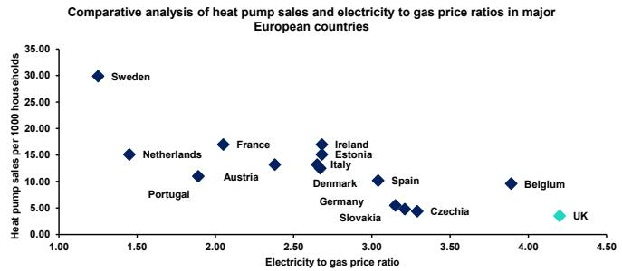

<details>
<summary>scatter</summary>

| Country | Electricity to gas price ratio | Heat pump sales per 1000 households |
| :--- | :--- | :--- |
| Sweden | 1.25 | 30.0 |
| Netherlands | 1.45 | 15.0 |
| Portugal | 1.90 | 11.0 |
| France | 2.05 | 16.5 |
| Austria | 2.35 | 13.0 |
| Ireland | 2.70 | 16.5 |
| Estonia | 2.70 | 16.0 |
| Italy | 2.65 | 13.0 |
| Denmark | 2.85 | 12.5 |
| Spain | 3.05 | 10.0 |
| Germany | 3.15 | 6.0 |
| Slovakia | 3.20 | 5.5 |
| Czechia | 3.30 | 5.0 |
| Belgium | 3.90 | 9.5 |
| UK | 4.20 | 4.5 |
</details>

Source: Nesta, European Heat Pump Association, Eurostat, Bernstein analysis

As set out in Exhibit 27, the UK's most recent price cap announcement outlined tariffs consistent with a slight fall in the electricity-to-gas price ratio, with the gas unit cost moving from 5.74p/kWh to 7.33p/kWh and the electricity unit cost moving from 24.67p/kWh to 26.11p/kWh.

EXHIBIT 27: The UK's most recent electricity price cap update showed a decline in the electricity-to-gas price ratio   
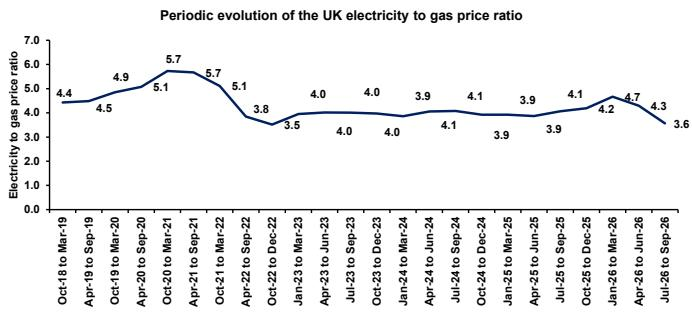

<details>
<summary>line</summary>

| Period | Electricity to gas price ratio |
| --- | --- |
| Oct-18 to Mar-19 | 4.4 |
| Apr-19 to Sep-19 | 4.5 |
| Oct-19 to Mar-20 | 4.9 |
| Apr-20 to Sep-20 | 5.1 |
| Oct-20 to Mar-21 | 5.7 |
| Apr-21 to Sep-21 | 5.7 |
| Oct-21 to Mar-22 | 5.1 |
| Apr-22 to Sep-22 | 3.8 |
| Oct-22 to Dec-22 | 3.5 |
| Jan-23 to Mar-23 | 4.0 |
| Apr-23 to Jun-23 | 4.0 |
| Jul-23 to Sep-23 | 4.0 |
| Oct-23 to Dec-23 | 3.9 |
| Jan-24 to Mar-24 | 4.1 |
| Apr-24 to Jun-24 | 4.1 |
| Jul-24 to Sep-24 | 3.9 |
| Oct-24 to Dec-24 | 3.9 |
| Jan-25 to Mar-25 | 3.9 |
| Apr-25 to Jun-25 | 4.1 |
| Jul-25 to Sep-25 | 4.2 |
| Oct-25 to Dec-25 | 4.7 |
| Jan-26 to Mar-26 | 4.3 |
| Apr-26 to Jun-26 | 3.6 |
</details>

Source: Nesta, Ofgem, Bernstein analysis

# WHAT ARE THE SYSTEM IMPLICATIONS OF HEAT PUMP ACCELERATION?

In the event that if countries are successful in spurring widespread adoption of heat pump technology, we see far-reaching consequences for the electricity system as a whole, necessitating further distribution grid upgrades and materially increasing overall demand.

# WIDER HEAT PUMP ADOPTION WOULD BE A SIGNIFICANT TAILWIND FOR TOTAL CONSUMPTION AND PEAK DEMAND...

The average heat pump in the UK could be expected to use \~2-4MWh of electricity per year, implying potentially significant upside to UK power demand in the event of a sustained increase in adoption. Under the UK National Energy System Operator's planning assumptions, it is contemplated that by 2035 between \~3m and \~8m households will use heat pumps, vs \~300,000 in 2024. As set out in Exhibit 28, this would imply between 8 and 22 TWh of additional electricity demand from heat pumps by 2035, equivalent to 5-14% of 2024 total demand.

EXHIBIT 28: The UK's electricity system planning assumptions imply 17-45TWh of additional electricity demand from heat pumps by 2035   
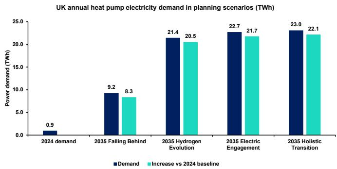

<details>
<summary>bar</summary>

UK annual heat pump electricity demand in planning scenarios (TWh)
| Scenario | Demand (TWh) | Increase vs 2024 baseline (TWh) |
|---|---|---|
| 2024 demand | 0.9 | |
| 2035 Falling Behind | 9.2 | 8.3 |
| 2035 Hydrogen Evolution | 21.4 | 20.5 |
| 2035 Electric Engagement | 22.7 | 21.7 |
| 2035 Holistic Transition | 23.0 | 22.1 |
</details>

Source: National Energy System Operator, Bernstein analysis

As set out in Exhibit 29, the potential impact is still more significant when analysed in terms of peak load. The planning scenarios imply a peak load increase from heat pumps of 8-21GW by 2035, equivalent to 17-47% of peak load in 2024. This underlines the potential network reinforcement need that wider heat pump adoption could drive.

EXHIBIT 29: The UK's electricity system planning assumptions imply a peak load from heat pumps 8-21GW higher by 2035   
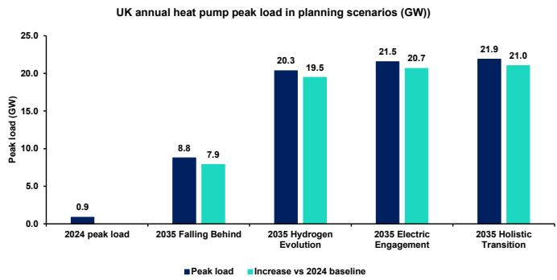

<details>
<summary>bar</summary>

UK annual heat pump peak load in planning scenarios (GW)
| Scenario | Peak load (GW) | Increase vs 2024 baseline (GW) |
|---|---|---|
| 2024 peak load | 0.9 | |
| 2035 Falling Behind | 8.8 | 7.9 |
| 2035 Hydrogen Evolution | 20.3 | 19.5 |
| 2035 Electric Engagement | 21.5 | 20.7 |
| 2035 Holistic Transition | 21.9 | 21.0 |
</details>

Source: National Energy System Operator, Bernstein analysis

# ...DRIVING GROWTH FOR ELECTRICITY DISTRIBUTION NETWORKS AND INCREASED OPPORTUNITY FOR GENERATORS

Given the significant increase in peak load that heat pumps could drive, we see electricity distribution companies as the likely primary beneficiaries, with growth driven by the need for network reinforcement to handle the increased load. Additionally, we would see opportunities for renewable and thermal generators given the likely increase in overall demand.

# Distribution networks

Increasing roll-out of heat pumps will necessitate significant investment to reinforce the electricity distribution grid. A 2017 study in Applied Energy explains that “dwellings in areas that are connected to the gas network will generally have distribution network capacities designed for very little electric heating. The problems associated with connecting large numbers of heat pumps are excessive voltage drop beyond allowed limits and insufficient thermal capacity of the Low Voltage feeder and transformer leading to overheating of these elements unless they are reinforced.” The electricity demand is impact is exacerbated by seasonality; the same study reports that “during winter periods heating energy demand can reach around 5 times the magnitude of electricity demand in UK dwellings.” The potential demand impact is further exacerbated by the fact that heat pump efficiency is at its lowest in the cold temperatures in which usage is highest.

As we set out in Exhibit 30, the monthly electricity usage profile of a heat pump in the UK is closely aligned with that of the broader system, increasing the system impact of the heat pump roll out.

EXHIBIT 30: GB system and illustrative heat pump monthly demand profiles   
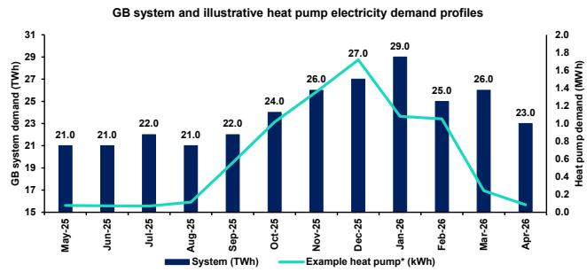

<details>
<summary>bar_line</summary>

GB system and illustrative heat pump electricity demand profiles
| Month | GB system demand (TWh) | Example heat pump* (kWh) |
|---|---|---|
| May-25 | 21.0 | 0.1 |
| Jun-25 | 21.0 | 0.1 |
| Jul-25 | 22.0 | 0.1 |
| Aug-25 | 21.0 | 0.1 |
| Sep-25 | 22.0 | 0.4 |
| Oct-25 | 24.0 | 0.8 |
| Nov-25 | 26.0 | 1.3 |
| Dec-25 | 27.0 | 1.7 |
| Jan-26 | 29.0 | 1.1 |
| Feb-26 | 25.0 | 1.1 |
| Mar-26 | 26.0 | 0.3 |
| Apr-26 | 23.0 | 0.1 |
</details>

\*Example heat pump is system 175 from Heat Pump Monitor Source: NESO, Heat Pump Monitor, Bernstein analysis

# Other system impacts

We see other significant potential impacts on total power consumption and potentially system flexibility.

# Demand

Heat pumps have the potential to significantly increase electricity demand in Europe. Taking the UK as an example, a 2023 study in Energy and Buildings developed a statistical model to “predict the additional load on the GB electricity generation and distribution infrastructure for various current and future (2050) climates, dwelling energy efficiencies and heat pump deployment scenarios”, finding that “for a cold year in the 2020s, a 100% uptake of heat pumps in the existing GB dwelling stock gave a peak electricity demand for the heat pumps of 78GW and an annual electricity demand of 189 TWh...this represents an increase in the GB peak

electricity demand in excess of 100% and an annual electricity demand increase of around 60%."

EXHIBIT 31: Heat pumps sit alongside other drivers that in aggregate could push European power demand materially higher by 2030   
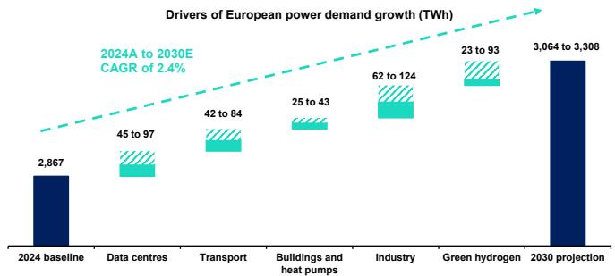

<details>
<summary>bar</summary>

| Period              | Value     |
| ------------------- | --------- |
| 2024 baseline       | 2,867     |
| Data centres         | 45 to 97  |
| Transport           | 42 to 84  |
| Buildings and heat pumps | 25 to 43  |
| Industry            | 62 to 124 |
| Green hydrogen      | 23 to 93  |
| 2030 projection      | 3,064 to 3,308 |
</details>

Source: McKinsey, BNEF, IEA, Hydrogen Europe, Eurelectric, European Heat Pump Association, Bernstein analysis and estimates

# Flexibility

Heat pumps offer a potential future electricity system stability contribution in the form of demand side response or demand flexibility. Where the system is approaching a demand peak, heat pumps participating in a flexibility services program can be turned off for a short period, easing the demand strain on the grid with little impact on user experience given that buildings retain heat for some time after a heat source has been turned off. The research and innovation foundation Nesta ran a trial between February and April 2024 where they remotely controlled participants' heat pumps for 4 hours during 'HeatFlex' events, establishing the viability of a

demand flexibility program - see Exhibit 32.

EXHIBIT 32: Nesta HeatFlex illustration   
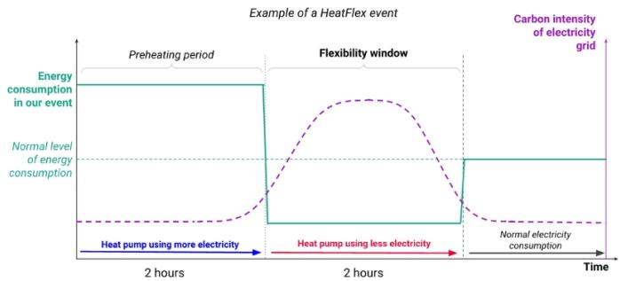

<details>
<summary>line</summary>

| Time | Energy Consumption |
|------|---------------------|
| Preheating period | 1.5 |
| Flexibility window | 0.5 |
| 2 hours | 1.5 |
| Normal electricity consumption | 0.5 |
</details>

Source: Nesta

# CONCLUSIONS

Clearly heat pump adoption will be a significant boost to electrification of the economy and the present crisis is clearly boosting prospects once again. However, at present the technology still requires a combination of subsidies, high insulation levels and a favorable electricity-to-gas price ratio to be viable. If heat pump costs can follow the path of batteries (Battery Energy Storage Systems - A primer for investors on their economics) and solar, the technology will see more widespread adoption, increasing power demand as well as requiring more investments in electricity distribution grids. We support UK regulator's more cautious approach on not investing ahead of heat pump demand in the upcoming electricity distribution period.

BERNSTEIN TICKER TABLE 

<table><tr><td rowspan="2">Ticker</td><td rowspan="2">Rating</td><td colspan="3">3 Jun 2026</td><td>TTMRel.</td><td colspan="4">Adjusted EPS</td><td colspan="3">Adjusted P/E (x)</td></tr><tr><td>Cur</td><td>Closing Price</td><td>Price Target</td><td>Perf.</td><td>Cur</td><td>2025A</td><td>2026E</td><td>2027E</td><td>2025A</td><td>2026E</td><td>2027E</td></tr><tr><td>EOAN.GR (E.ON)</td><td>M</td><td>EUR</td><td>18.09</td><td>18.00</td><td>3.7%</td><td>EUR</td><td>1.16</td><td>1.07</td><td>1.22</td><td>15.6</td><td>16.9</td><td>14.8</td></tr><tr><td>FORTUM.FH (Fortum)</td><td>U</td><td>EUR</td><td>20.84</td><td>17.70</td><td>20.4%</td><td>EUR</td><td>0.82</td><td>1.09</td><td>0.98</td><td>25.3</td><td>19.1</td><td>21.2</td></tr><tr><td>NG/.LN (National Grid)</td><td>O</td><td>GBp</td><td>1,199.00</td><td>1,450.00</td><td>2.0%</td><td>GBP</td><td>0.73</td><td>0.77</td><td>0.89</td><td>16.4</td><td>15.5</td><td>13.5</td></tr><tr><td>ORSTED.DC (Orsted)</td><td>M</td><td>DKK</td><td>160.35</td><td>140.00</td><td>(5.1)%</td><td>DKK</td><td>1.95</td><td>7.61</td><td>7.84</td><td>82.3</td><td>21.1</td><td>20.5</td></tr><tr><td>RWE.GR (RWE)</td><td>M</td><td>EUR</td><td>56.86</td><td>57.00</td><td>54.2%</td><td>EUR</td><td>2.48</td><td>2.57</td><td>3.02</td><td>22.9</td><td>22.1</td><td>18.8</td></tr><tr><td>SSE.LN (SSE)</td><td>O</td><td>GBp</td><td>2,388.00</td><td>3,040.00</td><td>23.9%</td><td>GBP</td><td>1.61</td><td>1.51</td><td>1.80</td><td>14.9</td><td>15.8</td><td>13.3</td></tr><tr><td>VWS.DC (Vestas Wind)</td><td>O</td><td>DKK</td><td>173.40</td><td>195.00</td><td>50.1%</td><td>EUR</td><td>0.78</td><td>1.14</td><td>1.36</td><td>29.9</td><td>20.3</td><td>17.1</td></tr><tr><td>EDME</td><td></td><td></td><td>1,548.21</td><td></td><td></td><td></td><td></td><td></td><td></td><td></td><td></td><td></td></tr></table>

O - Outperform, M - Market-Perform, U - Underperform, NR - Not Rated, CS - Coverage Suspended   
Source: Bloomberg, Bernstein estimates and analysis.

# I. REQUIRED DISCLOSURES

References to "Bernstein" or the "Firm" in these disclosures relate to the following entities: Bernstein Institutional Services LLC (April 1, 2024 onwards), Bernstein & Co., LLC (pre April 1, 2024), Bernstein Autonomous LLP, BSG France S.A. (April 1, 2024 onwards), Bernstein (Hong Kong) Limited 盛博香港有限公司, Bernstein (Canada) Limited, Bernstein (India) Private Limited (SEBI registration no. INH000006378), Bernstein (Singapore) Private Limited, Bernstein Japan KK (サンフォード・C・バーンスタイン株式会社) and analysts employed by SG Africa Technologies & Services to produce Bernstein under a Global Services Agreement in place between Bernstein and SG.

Bernstein is part of a joint venture between SG (SG) and AllianceBernstein, L.P. (AB). Unless specifically noted otherwise, for purposes of these disclosures, references to Bernstein's “affiliates” relate to both SG and AB and their respective affiliates.

# VALUATION METHODOLOGY

This research publication covers six or more companies. For valuation methodology and other company disclosures:

Please visit: https://bernstein-autonomous.bluematrix.com/sellside/Disclosures.action.

Or, you can also write to the Director of Compliance, Bernstein Institutional Services LLC, 245 Park Avenue, New York, NY 10167.

# RISKS

This research publication covers six or more companies. For risks and other company disclosures:

Please visit: https://bernstein-autonomous.bluematrix.com/sellside/Disclosures.action.

Or, you can also write to the Director of Compliance, Bernstein Institutional Services LLC, 245 Park Avenue, New York, NY 10167.

# RATINGS DEFINITIONS, BENCHMARKS AND DISTRIBUTION

# EQUITY RATINGS DEFINITIONS

# Bernstein brand

The Bernstein brand rates stocks based on forecasts of relative performance for the next 12 months versus the S&P 500 for stocks listed on the U.S. and Canadian exchanges, versus the Bloomberg Europe Developed Markets Large and Mid Cap Price Return Index EUR (EDME) for stocks listed on the European exchanges and emerging markets exchanges outside of the Asia Pacific region, versus the Bloomberg Japan Large and Mid Cap Price Return Index USD (JPL) for stocks listed on the Japanese exchanges, and versus the Bloomberg Asia ex-Japan Large and Mid Cap Price Return Index (ASIAX) for stocks listed on the Asian (ex-Japan) exchanges -unless otherwise specified.

The Bernstein brand has three categories of ratings:

- Outperform: Stock will outpace the market index by more than 15 pp   
• Market-Perform: Stock will perform in line with the market index to within +/-15 pp   
• Underperform: Stock will trail the performance of the market index by more than 15 pp

Coverage Suspended: Coverage of a company under the Bernstein brand has been suspended. Ratings and price targets are suspended temporarily, are no longer current, and should therefore not be relied upon.

Not Rated: A rating assigned when the stock cannot be accurately valued, or the performance of the company accurately predicted, at the present time. The covering analyst may continue to publish research reports on the company to update investors on events and developments.

Not Covered (NC) denotes companies that are not under coverage.

Bernstein brand stock ratings are based on a 12-month time horizon.

# Autonomous brand – common stocks

The Autonomous brand rates common stocks as indicated below. As our benchmarks we use the Bloomberg Europe 500 Banks And Financial Services Index (BEBANKS) and Bloomberg Europe Dev Mkt Financials Large and Mid Cap Price Ret Index EUR (EDMFI) index for developed European banks and Payments, the Bloomberg Europe 500 Insurance Index (BEINSUR) for European insurers, the S&P 500 and S&P Financials for US banks and Payments coverage, S5LIFE for US Insurance, the S&P Insurance Select Industry (SPSIINS) for US Non-Life Insurers coverage, and the Bloomberg Emerging Markets Financials Large, Mid and Small Cap Price Return Index (EMLSF) for emerging market banks and insurers and Payments. Ratings are stated relative to the sector (not the market).

The Autonomous brand has three categories of common stock ratings:

- Outperform (OP): Stock will outpace the relevant index by more than 10 pp   
- Neutral (N): Stock will perform in line with the market index to within +/-10 pp   
• Underperform (UP): Stock will trail the performance of the relevant index by more than 10 pp

Coverage Suspended: Coverage of a company under the Autonomous research brand has been suspended. Ratings and price targets are suspended temporarily, are no longer current, and should therefore not be relied upon.

Not Rated: A rating assigned when the stock cannot be accurately valued, or the performance of the company accurately predicted, at the present time. The covering analyst may continue to publish research reports on the company to update investors on events and developments.

Those denoted as ‘Feature’ (e.g., Feature Outperform FOP, Feature Under Outperform FUP) are our core ideas.

Not Covered (NC) denotes companies that are not under coverage.

Autonomous brand common stock ratings are based on a 12-month time horizon.

# Autonomous brand – preferred stocks

The Autonomous brand has three categories of preferred stock ratings:

- Outperform (OP): The total return of the preferred instrument is expected to outperform preferred securities of other issuers operating in similar sectors or rating categories over the next six months.   
- Neutral (N): The total return of the preferred instrument is expected to perform in line with preferred securities of other issuers operating in similar sectors or rating categories over the next six months.   
- Underperform (UP): The total return of the preferred instrument is expected to underperform preferred securities of other issuers operating in similar sectors or rating categories over the next six months.

Autonomous preferred stock ratings are based on a 6-month time horizon.

# AUTONOMOUS CREDIT RESEARCH

Where this report contains investment recommendations for credit instruments, as defined in article 3(1)(35) of the Market Abuse Regulation, the information below is presented to comply with its disclosure requirements.

The report may also include reference(s) to published opinions by other Autonomous or Bernstein analysts covering the equity securities of the issuer(s) referenced herein. Please note an investment recommendation for credit instruments published by the author(s) of this report may differ from the published view of the analyst covering equity securities for the issuer(s) contained in this report and vice versa.

# CREDIT RATINGS DEFINITIONS

The Autonomous brand has three categories of credit ratings:

- Credit Outperform (C-OP): The total return of the Reference Credit Instrument is expected to outperform the credit spread of bonds of other issuers operating in similar sectors or rating categories over the next six months.   
- Credit Neutral (C-N): The total return of the Reference Credit Instrument is expected to perform in line with the credit spread of bonds of other issuers operating in similar sectors or rating categories over the next six months.   
- Credit Underperform (C-UP): The total return of the Reference Credit Instrument is expected to underperform the credit spread of bonds of other issuers operating in similar sectors or rating categories over the next six months.

Autonomous credit ratings are based on a 6-month time horizon.

A list of all investment recommendations produced by the author(s) of this report alongside credit ratings history are available upon request.

It is at the sole discretion of the Firm as to when to initiate, update and cease research coverage. The Firm has established, maintains and relies on information barriers to control the flow of information contained in one or more areas (i.e. the private side) within the Firm, and into other areas, units, groups or affiliates (i.e. public side) of the Firm

DISTRIBUTION OF EQUITY RATINGS/INVESTMENT BANKING SERVICES 

<table><tr><td>Equity Rating</td><td>Market Abuse Regulation (MAR) and FINRA Rating Category</td><td>Global Rating Distribution</td><td>Investment Banking Relationships*</td></tr><tr><td>Outperform</td><td>BUY</td><td>51.1%</td><td>16.5%</td></tr><tr><td>Market-Perform (Bernstein Brand) Neutral (Autonomous Brand)</td><td>HOLD</td><td>36.3%</td><td>17.8%</td></tr><tr><td>Underperform</td><td>SELL</td><td>12.6%</td><td>14.9%</td></tr></table>

\* These figures represent the percentage of companies within each equity rating category for which affiliates of Bernstein have provided investment banking services within the previous 12 months.

As of March 31, 2026. All figures are updated quarterly.

# PRICE CHARTS/ RATINGS AND PRICE TARGET HISTORY

This research publication covers six or more companies. For price chart and other company disclosures, please visit https://bernstein-autonomous.bluematrix.com/sellside/Disclosures.action or you can write to the Director of Compliance, Bernstein Institutional Services LLC, 245 Park Avenue, New York, NY 10167.

# CONFLICTS OF INTEREST

SG and/or its affiliates beneficially own 1% or more of a class of common equity securities of the following companies: RWE AG and SSE PLC.

Bernstein and/or affiliates have received compensation for investment banking services in the past twelve months from E.ON SE, Fortum OYJ and RWE AG.

An affiliate of Bernstein has received compensation for non-investment banking securities-related products or services in the previous twelve months from the following clients: E.ON SE and National Grid PLC.

Bernstein and/or affiliates have received compensation for non-investment banking securities-related products or services in the previous twelve months from the following clients: Fortum OYJ, National Grid PLC, Orsted A/S, RWE AG and Vestas Wind Systems A/S.

Bernstein and/or affiliates expect to receive or intend to seek compensation for investment banking services in the next three months from Fortum OYJ and RWE AG.

Affiliates of Bernstein managed or co-managed in the past twelve months a public offering of securities of E.ON SE and RWE AG.

Bernstein and/or affiliates had an investment banking client relationship during the past twelve months with E.ON SE, Fortum OYJ and RWE AG.

Certain affiliates of Bernstein act as market maker or liquidity provider in the equities securities of: E.ON SE, Fortum OYJ, National Grid PLC, Orsted A/S, RWE AG, SSE PLC and Vestas Wind Systems A/S.

Certain affiliates of Bernstein act as market maker or liquidity provider in the debt securities of: Fortum OYJ, National Grid PLC, Orsted A/S, RWE AG, SSE PLC and Vestas Wind Systems A/S.

# OTHER MATTERS

The legal entity(ies) employing the analyst(s) listed in this report, and their location, can be determined by the country code of their phone number, as follows:

+1 Bernstein Institutional Services LLC; New York, New York, USA

+44 Bernstein Autonomous LLP; London UK

+212 SG Africa Technologies & Services; Casablanca, Morocco

+33 BSG France S.A.; Paris, France

+34 BSG France S.A.; Madrid, Spain

+41 Bernstein Autonomous LLP; Geneva, Switzerland

+49 BSG France S.A.; Frankfurt, Germany

+91 Bernstein (India) Private Limited; Mumbai, India

+852 Bernstein (Hong Kong) Limited 盛博香港有限公司; Hong Kong, China

+65 Bernstein (Singapore) Private Limited; Singapore

+81 Bernstein Japan KK; Tokyo, Japan

Where this report has been prepared by research analyst(s) employed by a non-US affiliate, such analyst(s), is/are (unless otherwise expressly noted below) not registered as associated persons of Bernstein Institutional Services LLC or any other SEC-registered broker-dealer and are not licensed or qualified as research analysts with FINRA. Accordingly, such analyst(s) may not be subject to FINRA's restrictions regarding (among other things) communications by research analysts with a subject company, interactions between research analysts and investment banking personnel, participation by research analysts in solicitation and marketing activities relating to investment banking transactions, public appearances by research analysts, and trading securities held by a research analyst account.

Where this report has been prepared by research analyst(s) employed by SG Africa Technologies & Services (part of the SG group of companies), it has been prepared on behalf of a Bernstein company under a Global Services Agreement in place between Bernstein and SG.

# CERTIFICATION

Each research analyst listed in this report, who is primarily responsible for the preparation of the content of this report, certifies that all of the views expressed in this publication accurately reflect that analyst's personal views about any and all of the subject securities or issuers and that no part of that analyst's compensation was, is, or will be, directly or indirectly, related to the specific

recommendations or views in this publication.

# II. ADDITIONAL GLOBAL CONFLICT DISCLOSURES

It is at the sole discretion of the Firm as to when to initiate, update and cease research coverage. The Firm has established, maintains and relies on information barriers to control the flow of information contained in one or more areas (i.e., the private side) within the Firm, and into other areas, units, groups or affiliates (i.e., public side) of the Firm.

# III. OTHER IMPORTANT INFORMATION AND DISCLOSURES

Separate branding is maintained for “Bernstein” and “Autonomous” research products.

- Bernstein produces a number of different types of research products including, among others, fundamental analysis and quantitative analysis under both the “Autonomous” and “Bernstein” brands. Recommendations contained within one type of research product may differ from recommendations contained within other types of research products, whether as a result of differing time horizons, methodologies or otherwise. Furthermore, views or recommendations within a research product issued under one brand may differ from views or recommendations under the same type of research product issued under the other brand. The Research Ratings System for the two brands and other information related to those Rating Systems are included in the previous section.   
- Autonomous operates as a separate business unit within the following entities: Bernstein Institutional Services LLC, Bernstein Autonomous LLP, Bernstein (Hong Kong) Limited 盛博香港有限公司 and Bernstein (India) Private Limited. For information relating to “Autonomous” branded products (including certain Sales materials) please visit: www.autonomous.com. For information relating to Bernstein branded products please visit: www.bernsteinresearch.com.

Analysts are compensated based on aggregate contributions to the research franchise as measured by account penetration, productivity and proactivity of investment ideas. No analysts are compensated based on performance in, or contributions to, generating investment banking revenues.

This report has been produced by an independent analyst as defined in Article 3 (1)(34)(i) of EU 596/2014 Market Abuse Regulation (“MAR”) and the same article of MAR as it forms part of United Kingdom domestic law by virtue of the European Union (Withdrawal) Act 2018.

To our readers in the United States: Bernstein Institutional Services LLC, a broker-dealer registered with the U.S. Securities and Exchange Commission (“SEC”) and a member of the U.S. Financial Industry Regulatory Authority, Inc. (“FINRA”) is distributing this publication in the United States and accepts responsibility for its contents. Where this material contains an analysis of debt product(s), such material is intended only for institutional investors and is not subject to the US independence and disclosure standards applicable to debt research prepared for retail investors.

Bernstein Institutional Services LLC may act as principal for its own account or as agent for another person (including an affiliate) in sales or purchases of any security which is a subject of this report. This report does not purport to meet the objectives or needs of any specific individuals, entities or accounts.

To our readers in Canada: If this publication pertains to a Canadian domiciled company, it is being distributed in Canada by Bernstein (Canada) Limited, which is licensed and regulated by the Canadian Investment Regulatory Organization. If the publication pertains to a non-Canadian domiciled company, it is being distributed by Bernstein Institutional Services LLC, which is licensed and regulated by both the SEC and FINRA, into Canada under the International Dealers Exemption.

This document may not be passed onto any person in Canada unless that person qualifies as "permitted client" as defined in Section 1.1 of NI 31-103.

To our readers in Brazil: This report has been prepared by Bernstein Institutional Services LLC, and Banco BTG Pactual S.A. ("BTG") is responsible for the distribution of this report in Brazil.

To readers in the United Kingdom: This publication has been issued or approved for issue in the United Kingdom by Bernstein Autonomous LLP, authorised and regulated by the Financial Conduct Authority and located at 60 London Wall, London EC2M 5SH, +44 (0)20-7170-5000. Registered in England & Wales No OC343985.

This document is for distribution only to persons who (i) have professional experience in matters relating to investments falling within Article 19(5) of the Financial Services and Markets Act 2000 (Financial Promotion) Order 2005 (as amended, the “Financial Promotion Order”), (ii) are persons falling within Article 49(2)(a) to (d) (“high net worth companies, unincorporated associations, etc.”) of the Financial Promotion Order, (iii) are outside the United Kingdom, or (iv) are persons to whom an invitation or inducement to engage in investment activity (within the meaning of section 21 of the FSMA) in connection with the issue or sale of any securities may otherwise lawfully be communicated or caused to be communicated (all such persons together being referred to as “relevant persons”). This document is directed only at relevant persons and must not be acted on or relied on by persons who are not relevant persons. Any investment or investment activity to which this document relates is available only to relevant persons and will be engaged in only with relevant persons.

To our readers in the member states of the EEA: This publication is being distributed by BSG France SA, which is authorised and regulated by the Autorité de Contrôle Prudentiel et de Résolution (ACPR) and Autorité des Marchés Financiers (AMF).

To our readers in Hong Kong: This publication is being distributed in Hong Kong by Bernstein (Hong Kong) Limited 盛博香港有限公司, which is licensed and regulated by the Hong Kong Securities and Futures Commission (Central Entity No. AXC846) to carry out Type 4 (Advising on Securities) regulated activities and subject to the licensing conditions mentioned in the SFC Public Register (https://www.sfc.hk/publicregWeb/corp/AXC846/details)). This publication is solely for professional investors, as defined in the Securities and Futures Ordinance (Cap. 571). The purpose of this report is solely to provide an analysis of the issuers referred to in this report and is not intended for any purpose contrary to the laws of Hong Kong.

To our readers in Singapore: This publication is being distributed in Singapore by Bernstein (Singapore) Private Limited, only to accredited investors or institutional investors, as defined in the Securities and Futures Act 2001 of Singapore ("SFA"). Recipients in Singapore should contact Bernstein (Singapore) Private Limited in respect of matters arising from, or in connection with, this publication. Bernstein (Singapore) Private Limited is regulated by the Monetary Authority of Singapore and licensed under the SFA as a capital markets services licence holder for dealing in capital markets products that are securities and collective investment schemes and an exempt financial adviser for advising on, issuing and promulgating analyses and reports on securities. Bernstein (Singapore) Private Limited is registered in Singapore with Company Registration No. 20213710W and located at One Raffles Quay, #27-11 South Tower, Singapore 048583, +65-6230-4612.

To our readers in the People's Republic of China: The securities referred to in this document are not being offered or sold and may not be offered or sold, directly or indirectly, in the People's Republic of China (for such purposes, not including the Hong Kong and Macau Special Administrative Regions or Taiwan, the "PRC") in contravention of any applicable laws of the PRC.

This document does not constitute an offer to sell or the solicitation of an offer to buy any securities in the PRC to any person to whom it is unlawful to make the offer or solicitation in the PRC.

We do not represent that this document may be lawfully distributed, or that any securities may be lawfully offered, in compliance with any applicable registration or other requirements in the PRC, or pursuant to an exemption available thereunder, or assume any responsibility for facilitating any such distribution or offering. In particular, no action has been taken by us which would permit a public offering of any securities or distribution of this document in the PRC. Accordingly, the securities are not being offered or sold within the PRC by means of this document or any other document. Neither this document nor any advertisement or other offering material may be distributed or published in the PRC, except under circumstances that will result in compliance with any applicable laws and regulations.

To our readers in Japan: This publication is being distributed in Japan by Bernstein Japan KK (サンフォード・C・バーンスタイン株式会社), which is registered in Japan as a Financial Instruments Business Operator with the Kanto Local Finance Bureau (registration number: The Director-General of Kanto Local Finance Bureau (FIBO) No.3387) and regulated by the Financial Services Agency. It is also a member of Japan Investment Advisers Association. This publication is solely for qualified institutional investors in Japan only, as defined in Article 2, paragraph (3), items (i) of the Financial Instruments and Exchange Act.

For the institutional client readers in Japan who have been granted access to the Bernstein website by Daiwa Group Inc. ("Daiwa"), your access to this document should not be construed as meaning that Bernstein is providing you with investment advice for any purposes. Whilst Bernstein has prepared this document, your relationship is, and will remain with, Daiwa, and Bernstein has neither any contractual relationship with you nor any obligations towards you.

To our readers in Australia: Bernstein (Hong Kong) Limited 盛博香港有限公司 is responsible for distributing research in Australia. It is regulated by the Securities and Exchange Commission under U.S. laws, by the Financial Conduct Authority under U.K. laws, which differs from Australian laws. Bernstein (Hong Kong) Limited 盛博香港有限公司 is exempt from the requirement to hold an Australian financial services license under the Corporations Act 2001 in respect of the provision of the following financial services to wholesale clients:

• providing financial product advice;   
• dealing in a financial product;   
- making a market for a financial product; and   
• providing a custodial or depository service.

To our readers in India: This publication is being distributed in India by Bernstein (India) Private Limited (SCB India) which is licensed and regulated by Securities and Exchange Board of India ("SEBI") as a research analyst entity under the SEBI (Research Analyst) Regulations, 2014, having registration no. INH000006378 and as a stock broker having registration no. INZ000213537. SCB India is currently engaged in the business of providing research and stock broking services. Please refer to www.bernsteinresearch.in for more information.

\- SCB India is a Private limited company incorporated under the Companies Act, 2013, on April 12, 2017 bearing corporate identification number U65999MH2017FTC293762, and registered office at Level 3A, 4th Floor, First International Financial Centre, Plot Nos C-54 and C-55, G Block, Near CBI Office, Bandra Kurla Complex, Bandra (East), Mumbai 400098, Maharashtra, India (Phone No: +91-22-68421401).

\- For details of Associates (i.e., affiliates/group companies) of SCB India, kindly email MUM-BERNSTEIN-InCompliance@bernsteinsg.com.

• SCB India does not have any disciplinary history as on the date of this report.

\- Except as noted above, SCB India and/or its Associates (i.e., affiliates/group companies), the Research Analysts authoring this report, and their relatives

• do not have any financial interest in the subject company   
• do not have actual/beneficial ownership of one percent or more in securities of the subject company;   
• is not engaged in any investment banking activities for Indian companies, as such;   
• have not managed or co-managed a public offering in the past twelve months for any Indian companies;   
- have not received any compensation for investment banking services or merchant banking services from the subject company in the past 12 months;   
• have not received compensation for brokerage services from the subject company in the past twelve months;   
- have not received any compensation or other benefits from the subject company or third party related to the specific recommendations or views in this report; and   
- do not currently, but may in the future, act as a market maker in the financial instruments of the companies covered in the report.   
• do not have any conflict of interest in the subject company as of the date of this report.

\- Except as noted above, the subject company has not been a client of SCB India during twelve months preceding the date of distribution of this research report. Neither SCB India nor its Associates (i.e., affiliates/group companies) have received compensation for products or services other than investment banking, merchant banking or brokerage services from the subject company in the past twelve months.

\- The principal research analyst(s) who prepared this report, members of the analysts' team, and members of their households are not an officer, director, employee or advisory board member of the companies covered in the report.

- Our Compliance officer / Grievance officer is Ms. Rupal Talati, who can be reached at +91-22-68421451, or MUM-BERNSTEIN-InCompliance@bernsteinsg.com / Scbin-investorgrievance@bernsteinsg.com   
- The Research investor charter and Terms & Conditions of SCB India are available on its website and may be accessed at Bernstein (India) Private Limited (https://bernsteinresearch.in/) for your reference.   
- Disclaimer: Registration granted by SEBI, and certification from NISM, is in no way a guarantee of performance of the intermediary or provide any assurance of returns to investors. Investments in securities market are subject to market risks. Read all the related documents carefully before investing.

To our readers in Switzerland: This document is provided in Switzerland by or through Bernstein Autonomous LLP, and is provided only to qualified investors as defined in article 10 of the Swiss Collective Investment Scheme Act (“CISA”) and related provisions of the Collective Investment Scheme Ordinance and in strict compliance with applicable Swiss law and regulations. The products mentioned in this document may not be suitable for all types of investors. This document is based on the Directives on the Independence of Financial Research issued by the Swiss Bankers Association (SBA) in January 2008.

To our readers in the Middle East: Bernstein Autonomous LLP, DIFC branch has its principal office at Gate Village 06, DIFC, Dubai, UAE. Bernstein Autonomous LLP, DIFC branch is regulated by the Dubai Financial Services Authority (DFSA) with the registration number CL10040 and is provisioned for Arranging Deals in Investments and Advising on Financial Products. All communications and services are directed at Professional Clients and Market Counterparties only (as defined in the DFSA rulebook). Persons other than Professional Clients and Market Counterparties, such as Retail Clients, are not the intended recipients of our communications or services.

# LEGAL

All research publications are disseminated to our clients through posting on the firm's password protected websites, bernsteinresearch.com and autonomous.com. Certain, but not all, research publications are also made available to clients through third-party vendors or redistributed to clients through alternate electronic means as a convenience.

This publication has been published and distributed in accordance with the Firm's policy for management of conflicts of interest in investment research, a copy of which is available from Bernstein Institutional Services LLC, Director of Compliance, 245 Park Avenue, New York, NY 10167. Additional disclosures and information regarding Bernstein's business are available on our website www.bernsteinresearch.com.

The securities described herein may not be eligible for sale in all jurisdictions or to certain categories of investors where that permission profile is not consistent with the licenses held by the entities noted herein. This document is for distribution only as may be permitted by law. This publication is not directed to, or intended for distribution to or use by, any person or entity who is a citizen or resident of, or located in any locality, state, country or other jurisdiction where such distribution, publication, availability or use would be contrary to law or regulation or which would subject any of the entities referenced herein or any of their subsidiaries or affiliates to any registration or licensing requirement within such jurisdiction. This publication is based upon public sources we believe to be reliable, but no representation is made by us that the publication is accurate or complete. We do not undertake to advise you of any change in the reported information or in the opinions herein. This publication was prepared and issued by entity referred to herein for distribution to eligible counterparties or professional clients. This publication is not an offer to buy or sell any security, and it does not constitute investment, legal or tax advice. The investments referred to herein may not be suitable for you. Investors must make their own investment decisions in consultation with their professional advisors in light of their specific circumstances. The value of investments may fluctuate, and investments that are denominated in foreign currencies may fluctuate in value as a result of exposure to exchange rate movements. Information about past performance of an investment is not necessarily a guide to, indicator of, or assurance of, future performance.

This report is directed to and intended only for our clients who are “eligible counterparties”, “professional clients”, “institutional investors” and/or “professional investors” as defined by the aforementioned regulators, and must not be redistributed to retail clients as defined by the aforementioned regulators. Retail clients who receive this report should note that the services of the entities noted herein are not available to them and should not rely on the material herein to make an investment decision. The result of such act will not hold the entities noted herein liable for any loss thus incurred as the entities noted herein are not registered/authorised/licensed to deal with retail clients and will not enter into any contractual agreement/arrangement with retail clients. This report is provided subject to the terms and conditions of any agreement that the clients may have entered into with the entities noted herein. All research reports are disseminated on a simultaneous basis to eligible clients through electronic publication to

our client portal.

The information in this report was prepared by Bernstein solely for the internal business use of our clients. Clients may store, display, analyze, reformat and print the information in this report for this limited use only. Clients may not copy, alter, create derivative works, resell, reverse engineer, commercially exploit, share or distribute any part of the information contained herein for any purpose without Bernstein's express written consent. These restrictions include extracting data or using the content to develop indices or other products. Further, you may not use this report, or any portion of this report, to train or finetune any third-party machine learning or artificial intelligence system, or as a prompt or input into any such system. You also may not, without Bernstein's express written consent, do any of the foregoing in connection with your own internal machine learning or artificial intelligence system.

Bernstein may use artificial intelligence tools in the preparation of its materials. Any such materials are reviewed by Bernstein's research analysts prior to publication.

This report has been prepared for information purposes only and is based on current public information that we consider reliable, but the entities noted herein do not warrant or represent (express or implied) as to the sources of information or data contained herein are accurate, complete, not misleading or as to its fitness for the purpose intended even though the entities noted herein rely on reputable or trustworthy data providers, it should not be relied upon as such. Opinions expressed are the author(s)' current opinions as of the date appearing on the material only and we do not undertake to advise you of any change in the reported information or in the opinions herein.

Any references to SG herein are purely factual, based upon publicly available information, and included for comparative purposes only. They do not constitute an opinion or recommendation with respect to the securities of SG.

This publication was prepared and issued by the entity referred to herein for distribution to eligible counterparties or professional clients. The information in this report is intended for general circulation and does not constitute an offer to buy or sell any security, investment, legal or tax advice nor a personal recommendation, as defined by any of the aforementioned regulators. It does not take into account the particular investment objectives, financial situations, or needs of individual investors. The report has not been reviewed by any of the aforementioned regulators and does not represent any official recommendation from the aforementioned regulators. The investments referred to herein may not be suitable for you. Investors must make their own investment decisions in consultation with advice sought from a financial adviser regarding the suitability of the investment product, taking into account the specific investment objectives, financial situation or particular needs of any recipient of the recommendation, before the recipient makes a commitment to purchase the investment product.

The analysis contained herein is based on numerous assumptions. Different assumptions could result in materially different results. The information in this report does not constitute, or form part of, any offer to sell or issue, or any offer to purchase or subscribe for shares, or to induce engage in any other investment activity. The value of any securities or financial instruments mentioned in this report may fluctuate subject to market conditions. Information about past performance of an investment is not necessarily a guide to, indicative of, or assurance of future performance. Estimates of future performance mentioned by the research analyst in this report are based on assumptions that may not be realized due to unforeseen factors like market volatility/fluctuation. In relation to securities or financial instruments denominated in a foreign currency other than the clients' home currency, movements in exchange rates will have an effect on the value, either favorable or unfavorable. Before acting on any recommendations in this report, recipients should consider the appropriateness of investing in the subject securities or financial instruments mentioned in this report and, if necessary, seek for independent professional advice.

The securities described herein may not be eligible for sale in all jurisdictions or to certain categories of investors where that permission profile is not consistent with the licenses held by the entities noted herein. This document is for distribution only as may be permitted by law. It is not directed to, or intended for distribution to or use by, any person or entity who is a citizen or resident of or located in any locality, state, country or other jurisdiction where such distribution, publication, availability or use would be contrary to law or regulation or would subject the entities noted herein to any regulation or licensing requirement within such jurisdiction.

Source: Bloomberg Index Services Limited. BLOOMBERG® is a trademark and service mark of Bloomberg Finance L.P. and its affiliates (collectively “Bloomberg”). Bloomberg or Bloomberg’s licensors own all proprietary rights in the Bloomberg Indices. Neither Bloomberg nor Bloomberg’s licensors approves or endorses this material, or guarantees the accuracy or completeness of any information herein, or makes any warranty, express or implied, as to the results to be obtained therefrom and, to the maximum extent allowed by law, neither shall have any liability or responsibility for injury or damages arising in connection therewith.

No part of this material may be reproduced, distributed or transmitted or otherwise made available without prior consent of the entities noted herein. Copyright Bernstein Institutional Services LLC Bernstein Autonomous LLP, BSG France S.A., Bernstein (Hong Kong) Limited 盛博香港有限公司, Bernstein (Canada) Limited, Bernstein (India) Private Limited (SEBI registration no. INH000006378), Bernstein (Singapore) Private Limited and Bernstein Japan KK (サンフォード・C・バーンスタイン株式会社). All rights reserved. The trademarks and service marks contained herein are the property of their respective owners. Any unauthorized use or disclosure is strictly prohibited. The entities noted herein may pursue legal action if the unauthorized use results in any defamation and/or reputational risk to the entities noted herein and research published under the Bernstein and Autonomous brands.