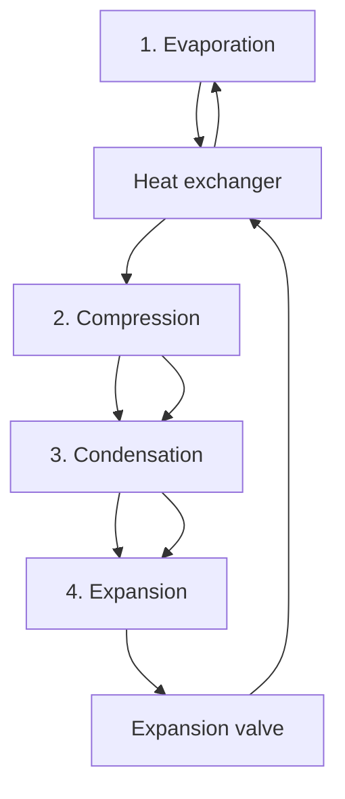
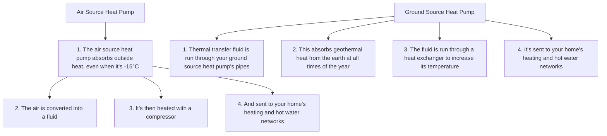

You are a senior financial newsletter editor with a consulting-style strategy lens. You turn research-report material into a long-form English article that is structured, insightful, and suitable for a serious business audience.

Objective:
- Write an English Markdown article based on the report parsing below.
- Target length: around 2200 words, plus or minus 15%.
- Tone: serious, analytical, strategic, and readable.
- The article should not feel like a summary. It should make an argument.
- You may extend the report's logic into reasonable second-order implications, but do not invent data, company actions, or quotes.
- Do not disclose every detail. Leave several meaningful open questions that make readers want the full report.

McKinsey-style writing principles:
1. Answer first: open with the controlling idea, not background.
2. Governing thought: every section must support the main answer.
3. Mutually exclusive, collectively exhaustive logic: avoid overlapping sections.
4. So what: every section must explain why the point matters.
5. Synthesis over summary: do not list facts; interpret what the pattern means.
6. Action titles: section headings must be complete, insight-bearing sentences. Do not use generic headings such as "Key Takeaways", "Market Background", "Core View", or "Reader Implications".
7. Natural hooks: if you want readers to join the community or read the full report, the hook should emerge from unresolved analytical questions, not from promotional language.

Required Markdown structure:
- `# Title`: make it a direct argument, not a topic label.
- Opening: 4-6 short paragraphs that state the main thesis and why now matters.
- 4-6 `##` sections. Each `##` heading must be an action title: a sentence that tells the reader the insight.
- One section should identify what the report does not fully answer yet.
- One section should translate the report into a decision framework for readers.
- Final section: naturally invite readers to join the community or read the full report using this CTA: Join the community to read the full report and review the original charts.
- End with: `*This article is for learning and discussion only and does not constitute investment advice.*`

Content boundaries:
- Do not mention specific investment bank names such as GS. Use "a global investment bank report" if needed.
- Do not use emoji.
- Do not write like a viral post.
- Do not output your reasoning process.
- Do not generate image Markdown; the system will insert original MinerU images afterward.

Report parsing:
"""
# Bernstein Energy & Power: Heat pumps - an underappreciated lever of power demand growth?

Deepa Venkateswaran, ACA +44 20 7676 6990 deepa.venkateswaran@bernsteinsg.com

Guillaume Delaby +33 1 42 13 62 29 guillaume.delaby@bernsteinsg.com

Bob Brackett, Ph.D. +1 917 344 8422 bob.brackett@bernsteinsg.com

Neil Beveridge, Ph.D. +852 2123 2648 neil.beveridge@bernsteinsg.com

Nikhil Nigania +91 226 842 1414 nikhil.nigania@bernsteinsg.com

# BERNSTEIN ENERGY & POWER: HEAT PUMPS - AN UNDERAPPRECIATED LEVER OF POWER DEMAND GROWTH IN EUROPE?

Written by Deepa Venkateswaran and Rory Graham-Watson

The 2022 European energy crisis and the 2026 Iranian war have spurred significant adoption of decarbonisation technologies in Europe, including increased uptake of EVs and household solar/battery installations. In this Blast we analyse the prospects for an acceleration of the domestic heat pump roll-out in the wake of the latest crisis, as well as the potential beneficiaries in this scenario.

# INTRODUCTION

As set out in Exhibit 1, the heat pump is a core technology in the decarbonization plans of European national governments, including the UK. The UK Government is targeting over 450,000 new installations per year by 2030, with the National Energy System Operator contemplating 10-25% of households being fitted with a device by 2035, vs \~1% currently. Additionally, under the Labour government's Future Homes Standard, all new-build houses in the UK from 2028 onward must be fitted with a heat pump. In the EU, the 2022 REPowerEU Plan contemplates the installation of 30m heat pumps by 2030, whilst the 2026 Energy Plan/AccelerateEU contemplates 4m heat pump sales per year by 2030. In this edition of the Blast we set out an overview of heat pump technology including its history, mechanisms and key variants, as well as examining its potential implications for the broader electricity system.

EXHIBIT 1: Heat pump adoption is a key pillar of the UK's decarbonisation plans   


<details>
<summary>bar</summary>

| Scenario           | 2024 | 2035 | 2050 |
| ------------------ | ---- | ---- | ---- |
| Holistic Transition | 1%   | 25%  | 54%  |
| Electric Engagement | 1%   | 24%  | 52%  |
| Hydrogen Evolution | 1%   | 23%  | 43%  |
| Falling Behind     | 1%   | 10%  | 23%  |
</details>

Source: UK National Energy System Operator, Bernstein analysis

# WHAT IS A HEAT PUMP?

A heat pump is an electrically-powered heating device that uses a combination of ambient heat and compression technology to heat a building or other structure. The most commonly deployed version of the technology, the air source heat pump (ASHP), absorbs ambient heat from the air. Other versions, e.g. ground source heat pumps (GSHP) source heat from underground pipe networks. Heat pumps can enjoy significant energy efficiency benefits as the device is able to transfer more heat energy into the heated building than the electrical energy it uses in its operation.

# HOW DO HEAT PUMPS WORK?

Heat pumps work on the basis of the 4-step refrigeration cycle, i.e. 1) Evaporation, 2) Compression, 3) Condensation and 4) Expansion.

EXHIBIT 2: Illustrative air source heat pump operating cycle   


<details>
<summary>flowchart</summary>


</details>

Source: Energy Saving Trust

# Evaporation

In air source heat pumps, fans are used to blow ambient outdoor air over a heat exchanger containing a chemical refrigerant in a liquid form. This liquid chemical refrigerant has a sufficiently low boiling point that even the ambient outdoor heat is sufficient to induce its evaporation into a low-pressure, low-temperature gas.

# Compression

The newly-evaporated gas is directed into an electrically-powered compressor. The compression process further raises the temperature of the gas by raising its pressure.

# Condensation

Following the compression process, the gas is transferred to a second heat exchanger which transfers its stored heat energy into a water circuit, thereby warming the water which subsequently either powers the heating system emitters (e.g. radiators or underfloor heating installations) or is used for the hot water supply.

# Expansion

Having transferred its heat to the hot water system, the newly-cooled but still compressed gas is passed through an expansion valve to lower its pressure. The decompression process further lowers the temperature of the gas such that it is again ready to absorb ambient heat from the outdoor surroundings.

# HISTORY OF HEAT PUMP TECHNOLOGY

The first instance of heat pump technology in Europe can be traced to Switzerland. Reportedly “as early as 1852, Lord Kelvin had an intuition regarding the heat pump, in remarking that a ‘reverse heat engine’ could be used not only for cooling but also for heating.’ The first large scale heat pump was installed in the US in 1948 before

the 1970s oil crisis accelerated the momentum of the technology.

EXHIBIT 3: A 1.86 MW Sulzer heat pump with 3 three-stage piston compressors, 1942   


<details>
<summary>text_image</summary>

Wärme-Pumpe - Ammoniakkreislauf.
Fernheizkraftwerk Eidg.Techn.Hochschule Zürich.
SULZER
Patente & Anmeld.
Tous droits réservés
Alle Rechte vorbehalten
All rights reserved
732233
</details>

Source: Martin Zogg, European Heat Pump Association

# TYPES OF HEAT PUMP

The two primary types of heat pump are 1) air source and 2) ground source. The former draws ambient heat from the surrounding air, whilst the latter is buried underground and draws ambient heat from the surrounding earth. Air source heat pumps are significantly more prevalent because 1) they require less space and 2) are significantly less costly to install, although they are also somewhat less efficient to operate because of variations in air temperature, which varies more than ground temperature.

EXHIBIT 4: An air source heat pump   


<details>
<summary>natural_image</summary>

Exterior view of a modern residential courtyard with a large air conditioner unit and brick wall, no visible text or symbols.
</details>

Source: EDF

EXHIBIT 5: A ground source heat pump   


<details>
<summary>natural_image</summary>

Aerial view of a residential area with a paved road lined with red and blue oval-shaped pathways, adjacent to a house (no visible text or symbols)
</details>

Source: Energy Saving Trust

We set out a comparison of the operating mechanisms of air source and ground source heat pumps in Exhibit 6 below.

EXHIBIT 6: Air source and ground source heat pump operating mechanisms   


<details>
<summary>flowchart</summary>


</details>

Source: The Eco Experts

# ILLUSTRATIVE ECONOMICS

Heat pumps are an alternative heating technology to traditional mechanisms such as oil- or gas-fired boilers. The competitiveness of heat pumps vs alternatives is a function of 1) the upfront cost (in turn primarily a function of site-specific factors) and 2) the ongoing operating cost (a function of e.g. the quality of installation and the ratio of electricity to gas prices in the relevant market). Unlike other decarbonization technologies, the total costs of ownership of heat pumps have an opex rather than a capex skew - see Exhibit 7.

EXHIBIT 7: Illustrative split of total cost of ownership of key decarbonisation technologies   


<details>
<summary>bar_stacked</summary>

Comparative breakdown of total cost of ownership of key decarbonisation technologies (%)
| Technology | Capex Equipment (%) | Other capex (%) | Opex (%) |
| :--- | :--- | :--- | :--- |
| Solar PV | 12 | 67 | 21 |
| Onshore Wind | 43 | 32 | 25 |
| Battery Storage | 32 | 48 | 20 |
| Battery Electric Vehicle | 16 | 64 | 20 |
| Heat Pump | 26 | 18 | 56 |
| Electrolyser | 8 | 38 | 54 |
</details>

Values estimated from Figure 7.17 of IEA Energy Technology Perspectives 2026
Source: IEA\*, Bernstein analysis

# Installation costs

Heat pumps are typically significantly more expensive to install than comparable gas boilers on account of the significantly greater complexity of the process, which may require upgrades to pipework and the installation of additional radiators as well as upgrades to the existing hot water cylinder.

# Operating costs

Excluding initial installation costs, the key considerations driving the technology decision between a gas boiler and an electric heat pump are 1) the comparative efficiency ratings and 2) the comparative fuel costs. Where correctly installed, heat pumps are able to achieve an efficiency rating of up to \~400%, i.e. using only 25% of the heat energy they generate as electrical energy to power the heating process. This is achieved by the physics of the evaporation, compression, condensation and expansion processes. By contrast, a gas boiler would typically achieve a maximum efficiency rating of \~93%, using more gas input than heat output generated. However, whilst heat pumps are considerably more efficient than gas boilers, the electricity that they use for fuel is also significantly more expensive in several countries including the UK.

The ratio of heat output to the electric energy input is known as the Coefficient of Performance ('COP'). Alongside the cost of electricity and the temperature differential between outside and inside, the COP is a key determinant of the operating costs of a heat pump.

The operating efficiency of a heat pump varies with: 1) the external temperature, with greater efficiency on warmer days; and 2) the internal temperature, with greater efficiency when the internal heating and hot water systems run at a lower temperature; alongside other factors pertaining to the system design, as we explain in more detail later in this Blast.

We set out in Exhibit 8 the indicative annual electricity costs for a heat pump generating \~9,000 kWh of heat energy per year and operating at varying efficiency levels. This analysis assumes electricity costs at 26.11 p/kWh, in line with the recently published UK price cap rates for Q3 2026.

EXHIBIT 8: Achieved operating efficiency is a key driver of the total cost of ownership for a heat pump   


<details>
<summary>bar</summary>

| SCOP | Annual electricity costs (£) |
| ---- | ---------------------------- |
| 2    | 1,153                        |
| 2.5  | 923                          |
| 3    | 769                          |
| 3.5  | 659                          |
| 4.0  | 577                          |
| 4.5  | 513                          |
</details>

Source: Bernstein analysis and estimates

In a domestic context, a homeowner would typically consider installing an air source heat pump as an alternative to a gas boiler. As we set out in Exhibit 9, along with the prevailing level of electricity prices, the operating efficiency is a key variable in this decision, with a SCOP of higher than 3 typically required for operating cost parity. Octopus Energy, an energy retailer and heat pump installer in the UK, aims for a SCOP of \~3.3 on its installations.

EXHIBIT 9: Illustrative comparative economics of a gas boiler vs heat pump at varying efficiency levels and power price scenarios 

<table><tr><td>£ except where stated</td><td>Gas combi boiler</td><td>UK heat pump pre grant</td><td>UK heat pump post grant</td><td>France illustrative heat pump post grant</td></tr><tr><td>Upfront cost</td><td>3,500</td><td>10,000</td><td>2,500</td><td>2,241</td></tr><tr><td>Asset Life (years)</td><td>13</td><td>20</td><td>20</td><td>20</td></tr><tr><td>Depreciation and financing</td><td>406</td><td>872</td><td>218</td><td>195</td></tr><tr><td>Annual maintenance</td><td>110</td><td>180</td><td>180</td><td>180</td></tr><tr><td>Annual fuel costs (at 300% COP for HP)</td><td>946</td><td>1,044</td><td>1,044</td><td>776</td></tr><tr><td>Total cost of ownership (at 300% COP for HP)</td><td>1,462</td><td>2,096</td><td>1,442</td><td>1,151</td></tr><tr><td>Annual saving vs gas boiler (at 300% COP for HP)</td><td>0</td><td>-634</td><td>19</td><td>808</td></tr><tr><td>Annual fuel costs (at 400% COP for HP)</td><td>946</td><td>783</td><td>783</td><td>582</td></tr><tr><td>Total cost of ownership (at 400% COP for HP)</td><td>1,462</td><td>1,835</td><td>1,181</td><td>957</td></tr><tr><td>Annual saving vs gas boiler (at 400% COP for HP)</td><td>0</td><td>-373</td><td>280</td><td>1,002</td></tr></table>

Source: Bernstein analysis and estimates

Alongside the quality of installation, a key driver of achieved heat pump operating efficiency is the level of insulation in a property; the better the insulation, the lower the loss of heat from the property and the lower the required “flow temperature” from the heat pump, where the flow temperature is the temperature of the water in the system as it leaves the pump unit. A better-insulated property can operate at a lower flow temperature because the property’s radiators (or other heat emitters) will need to work less hard to maintain the targeted temperature given the reduced heat leakage. This reduces the burden on the heat pump and increases its efficiency.

EXHIBIT 10: Flow temperatures, impacted by insulation levels, are a key driver of heat pump efficiency   


<details>
<summary>flowchart</summary>

```mermaid
graph TD
    A["LOWER FLOW TEMPERATURE (e.g., 35°C)"] --> B["2.5-3.5"]
    B --> C["3.5-4.5"]
    C --> D["4.5-5.5"]
    D --> E["5.5-6.5"]
    E --> F["6.5-7.5"]
    F --> G["7.5-8.5"]
    G --> H["8.5-9.5"]
    H --> I["9.5-10.5"]
    I --> J["10.5-11.5"]
    J --> K["11.5-12.5"]
    K --> L["12.5-13.5"]
    L --> M["13.5-14.5"]
    M --> N["14.5-15.5"]
    N --> O["15.5-16.5"]
    O --> P["16.5-17.5"]
    P --> Q["17.5-18.5"]
    Q --> R["18.5-19.5"]
    R --> S["19.5-20.5"]
    S --> T["20.5-21.5"]
    T --> U["21.5-22.5"]
    U --> V["22.5-23.5"]
    V --> W["23.5-24.5"]
    W --> X["24.5-25.5"]
    X --> Y["25.5-26.5"]
    Y --> Z["26.5-27.5"]
    Z --> AA["27.5-28.5"]
    AA --> AB["28.5-29.5"]
    AB --> AC["29.5-30.5"]
    AC --> AD["30.5-31.5"]
    AD --> AE["31.5-32.5"]
    AE --> AF["32.5-33.5"]
    AF --> AG["33.5-34.5"]
    AG --> AH["34.5-35.5"]
    AH --> AI["35.5-36.5"]
    AI --> AJ["36.5-37.5"]
    AJ --> AK["37.5-38.5"]
    AK --> AL["38.5-39.5"]
    AL --> AM["39.5-40.5"]
    AM --> AN["40.5-41.5"]
    AN --> AO["41.5-42.5"]
    AO --> AP["42.5-43.5"]
    AP --> AQ["43.5-44.5"]
    AQ --> AR["44.5-45.5"]
    AR --> AS["45.5-46.5"]
    AS --> AT["46.5-47.5"]
    AT --> AU["47.5-48.5"]
    AU --> AV["48.5-49.5"]
    AV --> AW["49.5-50.5"]
    AW --> AX["50.5-51.5"]
    AX --> AY["51.5-52.5"]
    AY --> AZ["52.5-53.5"]
    AZ --> BA["53.5-54.5"]
    BA --> BB["54.5-55.5"]
    BB --> BC["55.5-56.5"]
    BC --> BD["56.5-57.5"]
    BD --> BE["57.5-58.5"]
    BE --> BF["58.5-59.5"]
    BF --> BG["60.0-61.0"]
    BG --> BH["61.0-62.0"]
    BH --> BI["62.0-63.0"]
    BI --> BJ["63.0-64.0"]
    BJ --> BK["64.0-65.0"]
    BK --> BL["65.0-66.0"]
    BL --> BM["66.0-67.0"]
    BM --> BN["67.0-68.0"]
    BN --> BO["68.0-69.0"]
    BO --> BP["69.0-70.0"]
    BP --> BQ["70.0-71.0"]
    BQ --> BR["71.0-72.0"]
    BR --> BS["72.0-73.0"]
    BS --> BT["73.0-74.0"]
    BT --> BU["74.0-75.0"]
    BU --> BV["75.0-76.0"]
    BV --> BW["76.0-77.0"]
    BW --> BX["77.0-78.0"]
    BX --> BY["78.0-79.0"]
    BY --> BZ["79.0-80.0"]
    BZ --> CA["80.0-81.0"]
    CA --> CB["81.0-82.0"]
    CB --> CC["82.0-83.0"]
    CC --> CD["83.0-84.0"]
    CD --> CE["84.0-85.0"]
    CE --> CF["85.0-86.0"]
    CF --> CG["86.0-87.0"]
    CG --> CH["87.0-88.0"]
    CH --> CI["88.0-89.0"]
    CI --> CJ["89.0-90.0"]
    CJ --> CK["90.0-91.0"]
    CK --> CL["91.0-92.0"]
    CL --> CM["92.0-93.0"]
    CM --> CN["93.0-94.0"]
    CN --> CO["94.0-95.0"]
    CO --> CP["95.0-96.0"]
    CP --> CQ["96.0-97.0"]
    CQ --> CR["97.0-98.0"]
    CR --> CS["98.0-99.0"]
    CS --> CT[99, 100, 101, 102, 103, 104, 105, 106, 107, 108, 109, 110, 111, 112, 113, 114, 115, 116, 117, 118, 119, 120, 121, 122, 123, 124, 125, 126, 127, 128, 129, 130, 131, 132, 133, 134, 135, 136, 137, 138, 139, 140, 141, 142, 143, 144, 145, 146, 147, 148, 149, 150, 151, 152, 153, 154, 155, 156, 157, 158, 159, 160, 161, 162, 163, 164, 165, 166, 167, 168, 169, 170, 171, 172, 173, 174, 175, 176, 177, 178, 179, 180, 181, 182, 183, 184, 185, 186, 187, 188, 189, 190, 191, 192, 193, 194, 195, 196, 197, 198, 199, 200, 201, 202, 203, 204, 205, 206, 207, 208, 209, 210, 211, 212, 213, 214, 215, 216, 217, 218, 219, 220, 221, 222, 223, 224, 225, 226, 227, 228, 229, 230, 231, 232, 233, 234, 235, 236, 237, 238, 239, 240, 241, 242, 243, 244, 245, 246, 247, 248, 249, 250 |
```
</details>

Source: IDM Energie

We set out an overview of the comparative ages of the housing stock in major European countries in Exhibit 11. The age of housing stock is strongly correlated with insulation quality.

EXHIBIT 11: Comparative analysis of the share of housing stock in major European countries that was built before 1946   


<details>
<summary>bar</summary>

Share of housing stock built before 1946 in selected European countries (%)
| Country | Share of housing stock (%) |
| :--- | :--- |
| UK | 38 |
| Belgium | 37 |

[中间内容因长度限制已省略]

ence system.

Bernstein may use artificial intelligence tools in the preparation of its materials. Any such materials are reviewed by Bernstein's research analysts prior to publication.

This report has been prepared for information purposes only and is based on current public information that we consider reliable, but the entities noted herein do not warrant or represent (express or implied) as to the sources of information or data contained herein are accurate, complete, not misleading or as to its fitness for the purpose intended even though the entities noted herein rely on reputable or trustworthy data providers, it should not be relied upon as such. Opinions expressed are the author(s)' current opinions as of the date appearing on the material only and we do not undertake to advise you of any change in the reported information or in the opinions herein.

Any references to SG herein are purely factual, based upon publicly available information, and included for comparative purposes only. They do not constitute an opinion or recommendation with respect to the securities of SG.

This publication was prepared and issued by the entity referred to herein for distribution to eligible counterparties or professional clients. The information in this report is intended for general circulation and does not constitute an offer to buy or sell any security, investment, legal or tax advice nor a personal recommendation, as defined by any of the aforementioned regulators. It does not take into account the particular investment objectives, financial situations, or needs of individual investors. The report has not been reviewed by any of the aforementioned regulators and does not represent any official recommendation from the aforementioned regulators. The investments referred to herein may not be suitable for you. Investors must make their own investment decisions in consultation with advice sought from a financial adviser regarding the suitability of the investment product, taking into account the specific investment objectives, financial situation or particular needs of any recipient of the recommendation, before the recipient makes a commitment to purchase the investment product.

The analysis contained herein is based on numerous assumptions. Different assumptions could result in materially different results. The information in this report does not constitute, or form part of, any offer to sell or issue, or any offer to purchase or subscribe for shares, or to induce engage in any other investment activity. The value of any securities or financial instruments mentioned in this report may fluctuate subject to market conditions. Information about past performance of an investment is not necessarily a guide to, indicative of, or assurance of future performance. Estimates of future performance mentioned by the research analyst in this report are based on assumptions that may not be realized due to unforeseen factors like market volatility/fluctuation. In relation to securities or financial instruments denominated in a foreign currency other than the clients' home currency, movements in exchange rates will have an effect on the value, either favorable or unfavorable. Before acting on any recommendations in this report, recipients should consider the appropriateness of investing in the subject securities or financial instruments mentioned in this report and, if necessary, seek for independent professional advice.

The securities described herein may not be eligible for sale in all jurisdictions or to certain categories of investors where that permission profile is not consistent with the licenses held by the entities noted herein. This document is for distribution only as may be permitted by law. It is not directed to, or intended for distribution to or use by, any person or entity who is a citizen or resident of or located in any locality, state, country or other jurisdiction where such distribution, publication, availability or use would be contrary to law or regulation or would subject the entities noted herein to any regulation or licensing requirement within such jurisdiction.

Source: Bloomberg Index Services Limited. BLOOMBERG® is a trademark and service mark of Bloomberg Finance L.P. and its affiliates (collectively “Bloomberg”). Bloomberg or Bloomberg’s licensors own all proprietary rights in the Bloomberg Indices. Neither Bloomberg nor Bloomberg’s licensors approves or endorses this material, or guarantees the accuracy or completeness of any information herein, or makes any warranty, express or implied, as to the results to be obtained therefrom and, to the maximum extent allowed by law, neither shall have any liability or responsibility for injury or damages arising in connection therewith.

No part of this material may be reproduced, distributed or transmitted or otherwise made available without prior consent of the entities noted herein. Copyright Bernstein Institutional Services LLC Bernstein Autonomous LLP, BSG France S.A., Bernstein (Hong Kong) Limited 盛博香港有限公司, Bernstein (Canada) Limited, Bernstein (India) Private Limited (SEBI registration no. INH000006378), Bernstein (Singapore) Private Limited and Bernstein Japan KK (サンフォード・C・バーンスタイン株式会社). All rights reserved. The trademarks and service marks contained herein are the property of their respective owners. Any unauthorized use or disclosure is strictly prohibited. The entities noted herein may pursue legal action if the unauthorized use results in any defamation and/or reputational risk to the entities noted herein and research published under the Bernstein and Autonomous brands.
"""
