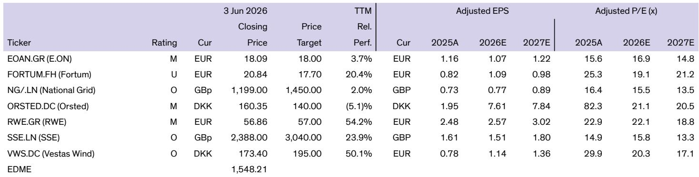
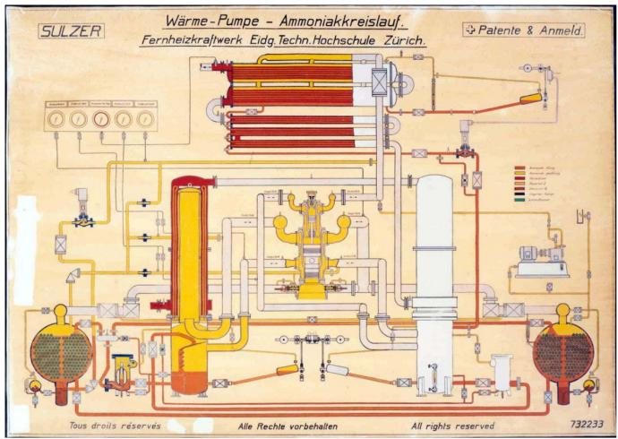
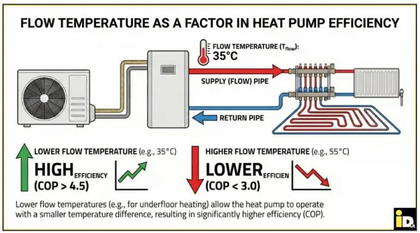

# Heat Pumps Are the Most Underappreciated Driver of European Power Demand Growth, and the Market Is Not Ready for the Grid Implications

The conventional narrative around power demand growth in Europe has focused on electric vehicles and data centers. Yet a third, quieter force is building beneath the surface: the mass adoption of domestic heat pumps. A recent analysis from a leading energy research team makes a compelling case that heat pumps may represent the most structurally underappreciated lever of electricity demand growth in Europe today. The technology is not new, but the confluence of policy mandates, energy security imperatives following the 2022 crisis and the 2026 geopolitical shocks, and improving economics is creating a tipping point that will reshape load profiles, peak demand patterns, and grid investment requirements in ways most investors have not yet priced in.

The argument is straightforward but its implications are profound. European governments, including the UK, are embedding heat pump adoption as a core pillar of their decarbonization strategies. The UK government targets over 450,000 new installations per year by 2030, with the National Energy System Operator envisioning 10 to 25 percent of households fitted with a device by 2035, up from roughly 1 percent today. In the EU, the REPowerEU Plan targets 30 million heat pumps by 2030, and the 2026 Energy Plan calls for 4 million heat pump sales per year by that same year. These are not aspirational targets; they are regulatory commitments backed by building standards, such as the UK's Future Homes Standard requiring all new-build houses from 2028 onward to be fitted with a heat pump.

The market is underestimating the scale of this transition and, critically, the grid-level consequences. Heat pumps are not like electric vehicles, which charge primarily at night or during off-peak hours and can be managed through smart charging. Heat pumps operate most intensively during cold winter mornings and evenings, precisely when the grid is already under maximum stress. The demand impact is not merely additive; it is coincident with existing peak loads, and that changes everything about how we should think about power system investment, utility earnings, and technology supply chains.

## The Economic Case for Heat Pumps Has Reached an Inflection Point, But It Depends Critically on Installation Quality and Policy Support

The core economic tension in the heat pump adoption story is that the technology offers superior energy efficiency in principle but faces a challenging cost structure in practice. A heat pump can achieve a coefficient of performance of up to 400 percent, meaning it delivers four units of heat energy for every unit of electrical energy consumed. By contrast, a gas boiler typically achieves at most 93 percent efficiency. The physics is compelling: the refrigeration cycle allows heat pumps to extract ambient heat from the air or ground and concentrate it, rather than generating heat directly through combustion.

Yet the headline efficiency advantage does not automatically translate into lower total cost of ownership. The upfront installation cost for a heat pump in the UK is approximately 10,000 pounds, compared to roughly 3,500 pounds for a gas combi boiler. Even after accounting for government grants that reduce the net upfront cost to around 2,500 pounds, the economics remain finely balanced. The analysis shows that at a seasonal coefficient of performance of 3.0, the annual fuel cost for a heat pump is approximately 1,044 pounds, versus 946 pounds for a gas boiler. The total cost of ownership, including depreciation, financing, and maintenance, is nearly identical at roughly 1,440 pounds per year versus 1,460 pounds for the gas alternative.

The inflection point comes when the achieved efficiency exceeds a seasonal coefficient of performance of 3.3 to 3.5. At a coefficient of 4.0, the annual fuel cost drops to 783 pounds, and the total cost of ownership falls to approximately 1,180 pounds, generating a meaningful 280 pounds in annual savings versus the gas boiler. This is not a theoretical upper bound; Octopus Energy, a major UK heat pump installer, targets a seasonal coefficient of performance of roughly 3.3 on its installations. The gap between achievable and achieved efficiency is where the policy and market opportunity resides.

What determines whether a household achieves a coefficient of 2.5 or 4.0? The answer is largely a function of building insulation quality and system design. Heat pumps operate most efficiently at lower flow temperatures, typically 35 to 45 degrees Celsius, compared to the 60 to 80 degrees Celsius common in gas boiler systems. A well-insulated property can maintain comfortable indoor temperatures with lower flow temperatures because less heat is lost to the outside. This reduces the burden on the heat pump and increases its efficiency. Conversely, a poorly insulated Victorian terrace in the UK, operating at a flow temperature of 55 degrees or higher, will see efficiency collapse toward a coefficient of 2.0 or lower, wiping out the economic case entirely.

This creates a critical dependency chain that the market has not fully appreciated. Heat pump adoption is not an independent variable; it is contingent on building retrofits, installer skill levels, and consumer education. The UK housing stock is among the oldest in Europe, with 38 percent of homes built before 1946, compared to roughly 25 percent in Germany and 20 percent in France. Older homes typically have poorer insulation, smaller radiators, and lower compatibility with low-temperature heating systems. The pace of heat pump adoption will therefore be constrained not by policy ambition or manufacturing capacity alone, but by the rate at which the existing building stock can be upgraded to support efficient heat pump operation.

## The Grid Impact of Mass Heat Pump Adoption Will Be Concentrated in Winter Peaks, Creating a Structural Demand Problem That Renewables Alone Cannot Solve

The most consequential insight from the analysis is not about the aggregate demand increase, but about its timing and shape. Heat pumps add demand during the coldest hours of the year, which are already the periods of highest system stress. In the UK, the winter peak demand period typically occurs on weekday mornings and evenings when temperatures are lowest and heating demand is highest. Adding millions of heat pumps operating at peak efficiency during these hours will shift the entire load duration curve upward, but the impact will be disproportionately concentrated in the highest-demand hours.

This has direct implications for capacity adequacy and the economic case for different generation technologies. Solar generation is essentially zero during winter peak hours. Wind generation is variable and often low during high-pressure winter weather systems that produce the coldest temperatures. The marginal generation that will be called upon to meet heat pump-driven peak demand will therefore be gas-fired generation, battery storage discharging over multi-hour periods, or interconnector imports from neighboring markets. Each of these has cost and carbon implications that complicate the decarbonization narrative.

The analysis does not model the exact load impact, but the direction is clear. If 25 percent of UK households adopt heat pumps by 2035, and each heat pump adds roughly 3,000 to 4,000 kilowatt-hours of annual electricity consumption, the incremental demand would be in the range of 30 to 40 terawatt-hours per year, or roughly 10 percent of current UK electricity consumption. More importantly, the peak demand impact could be 15 to 20 gigawatts on the coldest days, representing a 25 to 30 percent increase over current winter peak demand of roughly 60 gigawatts. This is not a marginal adjustment; it is a structural transformation of the load profile.

The grid operators are aware of this, but the market pricing of generation and storage assets has not fully reflected the new demand regime. The analysis implies that the value of firm, dispatchable capacity during winter peak hours will rise significantly, benefiting gas-fired peaking plants, long-duration storage, and interconnectors. Conversely, the value of solar generation, which is already experiencing capture price erosion during midday hours, may face further pressure as the system becomes increasingly winter-peaking. The investment implications for utility business models, renewable project economics, and storage duration requirements are substantial.

## The Technology Supply Chain Is Not the Binding Constraint; Installation Capacity and Consumer Economics Are

A common investor concern is whether heat pump manufacturing capacity can scale to meet policy targets. The analysis suggests this is not the primary risk. Heat pump technology is mature, with roots dating back to the 1940s and large-scale installations operating in Switzerland and the United States since the mid-20th century. The basic refrigeration cycle is well understood, and global manufacturing capacity for compressors, heat exchangers, and refrigerants is substantial and expandable.

The binding constraints are elsewhere. Installation capacity is the most obvious bottleneck. A gas boiler installation typically requires a single visit from a qualified gas engineer and takes one to two days. A heat pump installation is significantly more complex, often requiring pipework upgrades, additional radiator installations, hot water cylinder modifications, and electrical system upgrades. The installation process can take three to five days and requires specialized knowledge that is still scarce in the UK and parts of continental Europe. The analysis does not quantify the installer gap, but the implication is clear: scaling installation capacity to 450,000 units per year in the UK alone will require a multiyear training and certification effort that is only beginning.

Consumer economics present a second constraint. Even with government grants that reduce the upfront cost to roughly 2,500 pounds in the UK, the payback period for a heat pump relative to a gas boiler is highly sensitive to achieved efficiency and electricity-to-gas price ratios. In the UK, where electricity is roughly four times more expensive than gas on a per-kilowatt-hour basis, the operating cost advantage of heat pumps is compressed. In France, where the electricity-to-gas price ratio is more favorable, the economics are significantly better, with annual savings of roughly 800 pounds versus a gas boiler at a coefficient of 3.0, and over 1,000 pounds at a coefficient of 4.0.

This geographic variation in economics will drive uneven adoption rates across Europe. Countries with favorable electricity-to-gas price ratios, high carbon taxes, and generous grant programs will see faster adoption. Countries with unfavorable ratios and older housing stock will lag. The policy implication is that governments may need to address electricity pricing structures, including network charges and levies that currently fall disproportionately on electricity relative to gas, to create the economic conditions for mass adoption.

## What the Report Does Not Fully Answer: The Interaction Between Heat Pumps, Electric Vehicles, and Distributed Solar at the Household Level

The analysis provides a thorough examination of heat pump technology and its standalone economics, but it leaves open several critical questions about how heat pumps interact with other distributed energy resources at the household level. A household that adopts a heat pump, an electric vehicle, rooftop solar, and a battery storage system is not simply adding four independent loads and generators. These technologies interact in ways that can either amplify or mitigate grid impacts.

Consider a household with rooftop solar and a heat pump. During winter months, solar generation is minimal, so the heat pump's additional demand must be met from the grid. During summer months, the heat pump may be used for cooling in markets where reversible heat pumps are common, but this demand will coincide with solar generation, potentially reducing net grid demand. The seasonal mismatch between solar generation and heat pump demand is a structural challenge that battery storage can partially address, but the economics of a household battery sized to shift winter heating demand from peak to off-peak hours are challenging given the multi-hour discharge durations required.

Similarly, the interaction between heat pumps and electric vehicle charging is underexplored. If both devices are controlled by a smart home energy management system that prioritizes off-peak operation, the grid impact can be significantly reduced. But if households charge their vehicles in the evening after returning from work and run their heat pumps at maximum output during the same period, the coincident peak demand could be substantially higher than the sum of the individual loads.

The report also does not address the potential for heat pumps to provide demand-side flexibility services to the grid. Heat pumps with thermal storage, in the form of large hot water tanks or phase-change materials, can shift their electricity consumption by several hours without compromising comfort. This could make heat pumps a valuable grid resource, reducing the need for dedicated peaking capacity. The value of this flexibility depends on tariff structures, smart meter penetration, and the development of aggregation markets, all of which are in early stages across Europe.

These open questions are not weaknesses of the analysis; they reflect the early stage of the transition and the complexity of the integrated energy system. Investors and policymakers who treat heat pumps as an isolated technology risk will miss the system-level dynamics that will ultimately determine the pace and shape of adoption.

## A Decision Framework for Investors: Three Dimensions to Monitor in the Heat Pump Opportunity

For investors seeking to position for the heat pump transition, the analysis suggests a framework organized around three dimensions: the economic viability threshold, the grid infrastructure response, and the technology supply chain positioning.

The first dimension is the economic viability threshold, defined by the achieved coefficient of performance and the electricity-to-gas price ratio. Markets where the ratio is below 3.0 and where achieved coefficients consistently exceed 3.5 will see rapid adoption without significant subsidy. Markets where the ratio exceeds 4.0 and housing stock is old will require sustained policy intervention to achieve adoption targets. The key leading indicator is not heat pump sales volumes, but the trajectory of electricity-to-gas price ratios and the rate of building retrofits.

The second dimension is the grid infrastructure response. Utilities and grid operators that proactively invest in distribution network reinforcement, smart meter deployment, and time-of-use tariffs will be better positioned to accommodate heat pump load growth without excessive curtailment or reliability degradation. The analysis implies that distribution utilities with exposure to winter-peaking networks in cold climates face the most significant investment requirements and, potentially, the most attractive regulated returns.

The third dimension is the technology supply chain. While manufacturing capacity is not the binding constraint, there are specific components and services where value will accrue. High-efficiency compressors, advanced refrigerants with lower global warming potential, smart controls and thermostats, and installation services are all areas where the analysis suggests structural growth. The key question is which parts of the value chain will see margin expansion versus margin compression as scale increases.

## The Full Report Contains Original Charts and Detailed Country-Level Analysis That Cannot Be Captured in Summary

The analysis presented here is based on a detailed research report that includes original charts on heat pump adoption scenarios, comparative economics across European markets, and the relationship between flow temperatures and achieved efficiency. The report also contains a historical perspective on heat pump technology dating back to the 1940s, which provides important context for understanding why the technology is now reaching an inflection point after decades of slow adoption.

The original charts, which are referenced throughout this article, provide visual evidence for the key arguments: the steep trajectory of policy targets, the sensitivity of total cost of ownership to achieved efficiency, and the comparative housing stock ages that will determine adoption rates across countries. These charts are essential for investors who want to test the assumptions underlying the analysis and develop their own views on which markets and technologies will outperform.

Join the community to read the full report and review the original charts.

*This article is for learning and discussion only and does not constitute investment advice.*

Personal reading notes and learning share only. Not investment advice.

