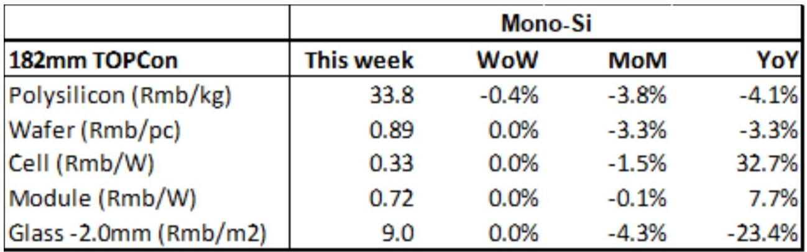
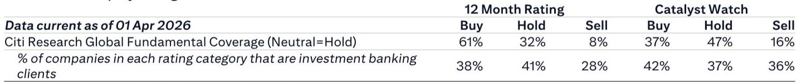
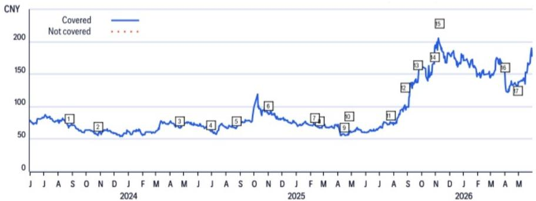

# China's Solar Sector Is Not a Commodity Story; The Real Opportunity Lies in Energy Storage and Inverter Supply Chains

The most important truth about China's solar photovoltaic sector right now is this: the upstream commodity manufacturing chain is trapped in a structural overhang that will not resolve quickly, while the downstream enablers of energy storage and power conversion are entering a fundamentally different demand cycle. Any investor who treats the entire solar value chain as a single trade is making a category error.

In the week ending June 3, 2026, n-type polysilicon prices fell another 0.4% week-on-week to RMB 33.8 per kilogram. Every other major product category—wafers, cells, modules, and glass—remained flat at levels that are already deeply compressed. The industry is operating with 299,000 tons of polysilicon inventory at producer plants, a 53.4-day inventory period for solar glass, and wafer production volumes that are scheduled to increase 6.3% month-on-month in June. Supply is not merely ample; it is structurally excessive, and demand is not absorbing it.

This is not a cyclical trough that will snap back in a quarter or two. The conditions that created this oversupply—massive capital expenditure during the 2020-2022 boom, technology transitions that stranded legacy capacity, and a fragmented competitive landscape where no single producer can discipline pricing—are still in place. The report makes clear that even the prospect of government "anti-involution" measures in 2026 is likely to be softer than those implemented in 2025, precisely because China's PPI and CPI have rebounded partly on higher energy prices from the Middle East conflict. The macro rationale for aggressive industry consolidation has weakened.

Yet within this bleak upstream picture, the report identifies two names with Buy ratings: Sungrow Power Supply and Ningbo Deye Technology. Both are inverter and energy storage companies, not commodity solar manufacturers. This divergence is the analytical key to the entire sector.

## The Upstream Commodity Glut Is Not a Short-Term Pain; It Reflects a Structural Mismatch Between Capacity and Demand That Will Persist Through Mid-2026

The price data tells a story of exhaustion, not equilibrium. Polysilicon prices have collapsed from over RMB 250 per kilogram in mid-2022 to below RMB 34 today. Wafer prices for 182mm n-type products are at RMB 0.89 per piece, a level that barely covers cash costs for many producers. Solar cells at RMB 0.325 per watt and modules at RMB 0.723 per watt leave virtually no margin for differentiation. Glass at RMB 9.0 per square meter for 2.0mm products is down 23.4% year-on-year.

The conventional explanation is that this is a demand problem. It is not. Global solar installations continue to grow. The issue is that supply grew faster and will not easily shrink. The scheduled production resumptions and capacity expansions in June that the report cites are not irrational; they reflect the fact that many producers are operating with sunk capital and cannot afford to shut down without triggering debt covenants or losing market share to rivals who will keep running.

What makes this structurally different from previous solar downturns is the technology transition. The shift from PERC to TOPCon and HJT cells has rendered much of the legacy capacity economically obsolete, but it has not yet been fully retired. Instead, it operates at low utilization rates, depressing pricing for the entire value chain. The inventory data supports this: polysilicon inventory at 299,000 tons is down only 0.7% week-on-week, meaning destocking is happening at a glacial pace.

The report's forecast that this situation will persist through June-July is almost certainly conservative. The real question is whether any producer will be forced into restructuring before year-end. That depends on access to credit and parent company support, which is highly uneven across the sector.

## India's Local Manufacturing Mandate Will Reshape Trade Flows but Not Solve the Global Oversupply Problem

On June 1, 2026, India's Approved List of Models and Manufacturers for Solar PV Cells became formally effective, requiring that solar cells in the relevant list be manufactured locally. This is a significant policy shift for the world's most populous country and a major solar market.

The immediate effect will be to redirect Chinese exports. China has been the dominant supplier of solar cells and modules to India. With the new requirement, Chinese manufacturers will have to either establish local production in India, form joint ventures with Indian partners, or redirect their exports to Southeast Asia, the Middle East, or Africa.

For the global oversupply problem, however, this is a redistribution, not a reduction. Chinese manufacturing capacity is not shrinking; it is being redirected. The report correctly notes that this will shift trade patterns, but it does not argue that it will tighten global supply-demand balances. The implication is that pricing pressure will remain intense in markets outside India, as Chinese producers compete for alternative buyers.

There is a second-order effect worth considering: if Indian domestic production ramps up and proves cost-competitive, it could eventually reduce global import demand from China on a permanent basis. But that is a multi-year process. In the near term, the redirected volumes will find other homes, keeping global prices low.

The more interesting strategic question is whether this policy accelerates the trend of solar manufacturing moving closer to end markets. If so, the long-term winners may be companies that can localize production in multiple geographies, not those with the largest single-site factories in China.

## The Real Growth Engine Is Not Solar Panels but the Energy Storage and Inverter Ecosystem That Enables Their Integration

The report's Buy ratings on Sungrow and Deye are the most analytically significant signal in the entire document. Both companies are primarily inverter and energy storage system providers, not solar cell or module manufacturers. Their value proposition is fundamentally different from the upstream commodity chain.

Sungrow is a global leader in PV inverters and energy storage systems. Its business is driven by the need to integrate variable renewable energy into grids, which becomes more critical as solar penetration increases. The company benefits from the very trend that is crushing upstream manufacturers: more solar installations mean more demand for inverters, balance-of-system components, and storage.

Deye specializes in residential and commercial and industrial energy storage inverters, particularly for emerging markets. The report's valuation analysis for Deye explicitly cites "sustainable growth in energy storage demand from emerging markets, from current low penetration levels." This is a structural growth story, not a cyclical one. The penetration of energy storage in emerging markets is still in its infancy, and the drivers—grid instability, falling battery costs, and supportive policy—are secular.

The contrast with upstream solar is stark. When you buy a solar module, you are buying a commodity that is priced at marginal cost. When you buy an inverter or a storage system, you are buying a product that involves software, power electronics, and system integration capabilities that are harder to replicate. The pricing power and margin profiles are fundamentally different.

This is why the report's sector view is "selective." It is not bullish on solar; it is bullish on specific parts of the solar-enabled ecosystem. Investors who conflate the two will miss the distinction.

## What the Report Does Not Fully Answer: How Quickly Can Inverter and Storage Margins Be Compressed by New Entrants?

The report is clear on why Sungrow and Deye are attractive today. What it does not fully address is the threat of margin compression in the inverter and storage segment as competition intensifies.

The solar inverter market has historically been more concentrated than the solar cell market, but that is changing. Chinese manufacturers are entering the space aggressively. Battery pack costs are falling, which benefits storage system integrators but also lowers barriers to entry. If the inverter and storage segment becomes as commoditized as solar modules, the thesis for premium valuations would break down.

The report's valuation methodology for both companies uses discounted cash flow models with terminal growth rates of 3% to 4%. That implies an assumption that these businesses will sustain above-average returns for an extended period. The key risk is that they do not. The report lists downside risks for both companies, including "fiercer-than-expected price competition among inverter peers" for Deye and "less-than-expected energy storage system demand" for Sungrow. But it does not quantify how much margin compression is already priced into the stocks.

A reader should ask: at what point does the inverter and storage business become the next solar module business? The answer likely depends on how much software and system integration content is in the product versus pure hardware. The higher the software content, the more durable the margin advantage. The report implies this distinction but does not explore it in depth.

## A Decision Framework for Investors in the China Solar and Storage Ecosystem

Based on the report's analysis, investors should evaluate opportunities in this sector using a three-dimensional framework rather than a single bullish or bearish view.

First, distinguish between commodity and technology-enabled value chains. Commodity solar manufacturing—polysilicon, wafers, cells, modules, glass—is in a structural oversupply that will not resolve quickly. These businesses should be evaluated on their ability to survive a prolonged low-price environment, not on their potential for margin recovery. Technology-enabled businesses—inverters, storage systems, power electronics—operate in a different competitive dynamic where differentiation is possible and pricing power is higher.

Second, assess end-market exposure. The report highlights emerging markets as a key growth driver for Deye. The India policy shift creates both risk and opportunity. Companies with diversified geographic exposure and the ability to localize production will be more resilient than those dependent on a single export market.

Third, evaluate balance sheet strength and cash flow durability. In a sector where upstream players are bleeding cash, the ability to fund R&D and capacity expansion without distress is a competitive advantage. Both Sungrow and Deye are positioned as survivors and consolidators, but investors should stress-test their assumptions about working capital requirements and customer payment terms in emerging markets.

The implication is clear: this is not a sector for passive index exposure. It is a sector for active, selective stock picking based on business model quality and end-market positioning.

## The Incomplete Picture: Why the Full Report Matters

The weekly price data and near-term forecasts in this report are valuable, but they are snapshots, not the full film. The report's charts on polysilicon, wafer, cell, module, and glass prices over the past eight years reveal the magnitude of the structural decline, but they do not answer the most important forward-looking questions.

How much of the current inventory is distressed and likely to be written off? Which producers are most vulnerable to credit tightening? What is the trajectory of battery pack costs, and how will that affect storage system pricing? How will the SNEC exhibition in Shanghai this week influence technology adoption and capacity planning? These are the questions that require deeper analysis than a weekly price report can provide.

The report also leaves open the question of government policy. The suggestion that anti-involution measures will be softer in 2026 is based on macro conditions that could change. If the Middle East conflict escalates further, energy prices could rise more, giving Chinese policymakers more room to let inefficient producers fail. If it de-escalates, the pressure for intervention could return. The report acknowledges this uncertainty but does not model it.

For serious investors, the weekly data is a starting point, not a conclusion. The full report, with its detailed charts, valuation models, and risk analysis, provides the context needed to make informed decisions.

Join the community to read the full report and review the original charts.

*This article is for learning and discussion only and does not constitute investment advice.*

Personal reading notes and learning share only. Not investment advice.

