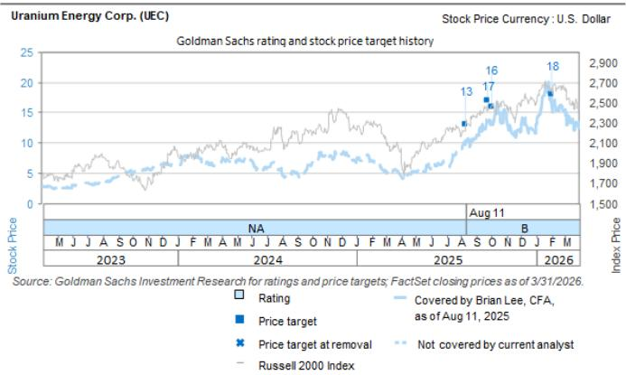
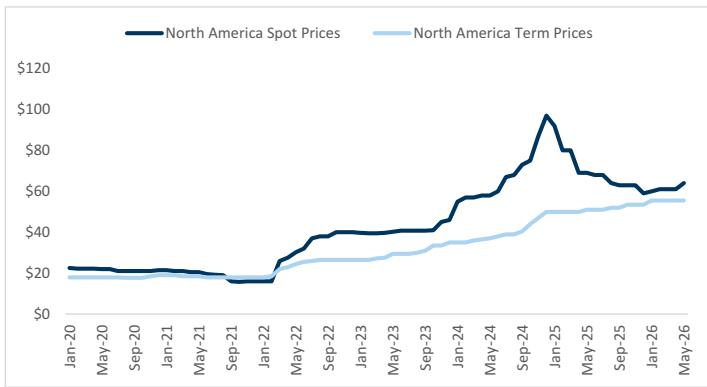
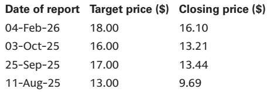

# 核燃料转化环节正在经历一场被低估的供给侧重定价

当市场还在热议AI数据中心对核电需求的长期拉动时，一个更直接、更确定的定价信号已经在核燃料链的上游出现。某外资投行最新发布的一份研报，通过对一家核心核燃料转化企业的深度分析，揭示了铀转化环节正在经历的结构性变化。这份报告的核心判断值得产业决策者和投资者认真对待：**铀转化市场正从长达六年的产能闲置周期，转向供给刚性约束下的价格重定价阶段，而市场对这一变化的定价可能仍不充分。**

之所以说“不充分”，是因为多数讨论仍停留在铀矿价格层面，忽视了从铀矿到反应堆燃料之间那道不可绕过的化学门槛。这份研报的关键价值，在于它把聚光灯打在了这个容易被忽略、但壁垒极高的环节上。报告不仅提供了价格走势的硬数据，更重要的是，它通过一家占据全球约30%非中俄供应份额的企业，揭示了这一环节的竞争格局、合约结构以及利润弹性的演化路径。

以下是我们基于该研报的深度解读，试图提炼出对行业格局和投资框架有实际意义的几个层次。

## 1. 全球仅剩五家玩家的市场，供给侧已经完成了一次出清

理解当前铀转化市场定价逻辑的前提，是认识到这个市场“天然稀缺”的供给结构。报告明确指出，全球具备铀转化能力的企业仅有五家。这五家之外，俄罗斯和中国的产能通常不被计入西方市场的有效供给。这意味着，对于北美和欧洲的核电站而言，其可依赖的供应商数量屈指可数。

而更大的变化发生在2023年之前。报告提到，该企业旗下的Metropolis工厂从2017年至2023年一直处于闲置状态，原因是市场上存在过量的二次供应。所谓二次供应，主要来自政府库存、乏燃料再处理以及军用高浓缩铀的稀释。当这些廉价供给在2022年前后开始显著减少，叠加全球核电装机容量的缓慢恢复和新建项目的推进，供需的天平开始倾斜。

这个“闲置-重启”的周期，本质上是一次供给侧的自然出清。当过剩库存被消化殆尽，存量产能的议价权便开始回归。对于投资者而言，这意味着需要重新评估相关企业的资产价值。一家曾经被市场视为“闲置资产”的工厂，一旦重新投运并锁定高价长协，其盈利能力和估值逻辑将发生根本性改变。报告显示，该工厂2024年的产量将在2026年扩产20%至每年超过1万公吨UF6，而90%的产能已经通过合约锁定。这组数字背后，是供给侧的确定性收缩和需求侧的刚性支撑。

## 2. 转化成本仅占燃料总成本的5%，却决定了整个核电供应链的稳定性

报告提供了一个极具说服力的数据点：铀转化环节的成本仅占大型反应堆燃料总成本的约5%。这个比例低到足以让下游客户对转化价格上涨的敏感度大大降低，却又高到足以决定供应链的连续性。没有UF6，铀矿就无法进入浓缩环节，整个核燃料循环就会中断。

这种“成本占比低但不可或缺”的特性，赋予了转化环节极强的定价权。当供给紧张时，下游客户几乎没有替代选择，只能接受更高的价格。报告中的价格图表清晰地展示了这一趋势：自2022年以来，北美现货和长协价格均出现了陡峭的上涨。现货价格从2022年初约28美元/公斤UF6，攀升至2025年初接近100美元/公斤的高位，尽管此后有所回落，但整体价格中枢已较2020年水平上移了数倍。

这带来的行业含义非常明确：对于拥有转化能力的公司而言，其收入不仅受益于量增，更受益于价涨。报告指出，随着旧合约逐步到期，新合约将按照当前更高的市场价格重新定价，这将直接推动该业务板块的EBITDA在未来几年实现两位数的年复合增长率。对于投资者而言，这意味着需要关注相关公司的合约到期结构，那些即将大量进入重新定价周期的公司，其利润弹性可能远超市场预期。

## 3. 长协锁定+90%产能，现金流可见性远超市场想象

与许多大宗商品业务不同，铀转化市场的合约结构提供了极高的现金流可视性。报告详细描述了该企业的合约特征：合约期限通常为3至5年，签约后1至2年才开始交付，且包含固定的数量承诺和上下浮动10%的空间。这种结构意味着，企业的收入流并非完全暴露于现货价格的短期波动，而是建立在长期的、有保障的合约基础之上。

更关键的是，报告提到该公司已将其约90%的产能通过合约锁定，订单管道价值约22亿美元，覆盖到2030年及以后的产能。这种高度的前置销售，使得分析师和投资者可以相对准确地预测未来数年的收入和利润底线。它降低了企业盈利的不确定性，也提高了其作为防御性资产的吸引力。对于追求稳定现金流和可预测增长的投资者而言，这类资产在当前的宏观环境下具有独特的配置价值。

## 4. 扩产的门槛远比想象中高：氟化学专长与监管护城河

报告在讨论该企业的竞争优势时，提到了几个关键壁垒。首先是氟化学专长。铀转化过程需要处理剧毒的氟化氢，而该企业拥有内部的HF生产能力，这在行业内是稀缺的。其次，该企业自1950年代就开始从事铀转化，与客户建立了长达半个多世纪的信任关系。这种关系在核工业这种高度监管、安全至上的行业中，几乎是不可替代的资产。

最重要的壁垒或许是监管。报告指出，该企业已经拥有一个获得许可的在运设施。对于任何一个新进入者而言，要获得在美国建设并运营铀转化设施的许可，不仅需要数年的审批时间，还需要面对极高的政治和法律不确定性。报告提到，另一家同业公司UEC（Uranium Energy Corp）在2024年7月才开始与一家工程公司合作评估建设新产能的可行性，预计2026年才能完成可行性研究。这意味着，即便一切顺利，新产能从规划到投产至少需要5到7年时间。

这一事实强化了现有产能的稀缺性。在增量供给到来之前，存量产能的价值将持续被重估。对于投资者而言，这意味着在判断相关公司估值时，不应简单套用普通制造业的周期股框架，而应将其视为拥有稀缺准入权的“准特许经营权”资产。

## 5. 报告尚未完全回答的关键问题：扩产的第二阶影响与竞争格局的动态演变

尽管这份报告提供了大量有价值的信息，但它也留下了一些值得进一步探讨的问题。一个核心问题是，当现有玩家开始扩产，且潜在新玩家（如UEC）的产能规划逐步落地，市场是否会从“供给短缺”转向“供给过剩”？报告提到的工程分析尚处于初期阶段，没有给出明确的资本开支规模和投产时间表。这意味着，投资者需要自行判断，当前的高价是否已经包含了未来几年新产能投放的预期。

另一个未解问题是，该企业的非转化业务（如铀存储、样品制备、U3O8采购等）虽然每年贡献4000万至8000万美元的收入，但其盈利能力、增长驱动力以及与核心转化业务的协同效应，报告并未展开。这部分业务是否构成了一个独立的增长引擎，还是仅仅作为客户关系维护的增值服务？其估值逻辑是否应与转化业务分开考虑？这些问题需要更深入的分析才能回答。

这些未解问题，恰恰是深度研究可以创造超额收益的地方。市场往往对已知信息进行定价，但对这些结构性问题的不同答案，将导致截然不同的投资结论。

## 欢迎来星球微信群里继续讨论

上述分析只是我们对这份研报核心逻辑的提炼。报告中还有更多关于具体公司的估值模型、风险因素以及同业对比的细节，这些内容对于做出具体的投资决策至关重要。例如，报告中对UEC的12个月目标价设定为18美元，基于35倍EV/EBITDA估值，但同时也指出了铀价波动、产能爬坡不确定性等关键风险。这些细节的讨论，远非一篇导读可以穷尽。

如果你对核燃料产业链的定价逻辑、相关公司的竞争壁垒，以及如何在这个主题下构建投资组合感兴趣，欢迎加入我们的知识星球和微信群。我们会在社群中分享完整的研报原文、更详细的财务模型拆解，并持续跟踪相关公司的季度更新和行业动态。在社群里，你可以与其他产业决策者和专业投资者一起，就这些未解问题进行更深入的碰撞和讨论。期待你的加入。

Personal reading notes and learning share only. Not investment advice.

