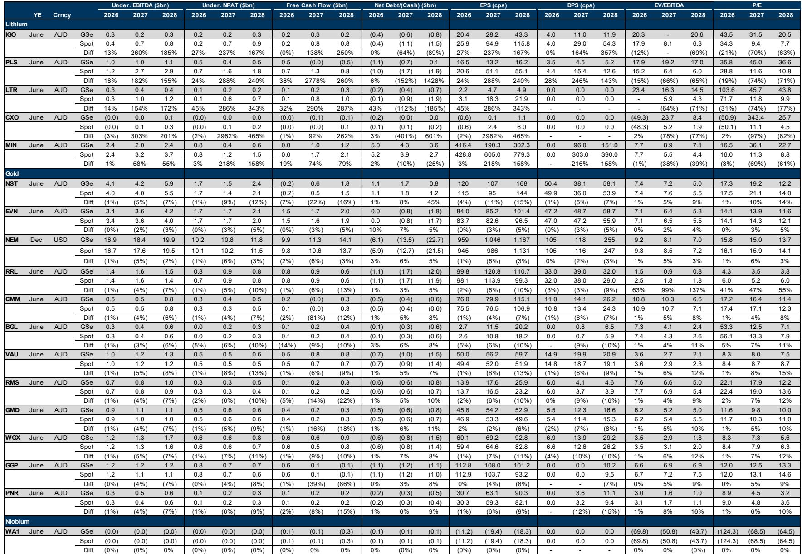
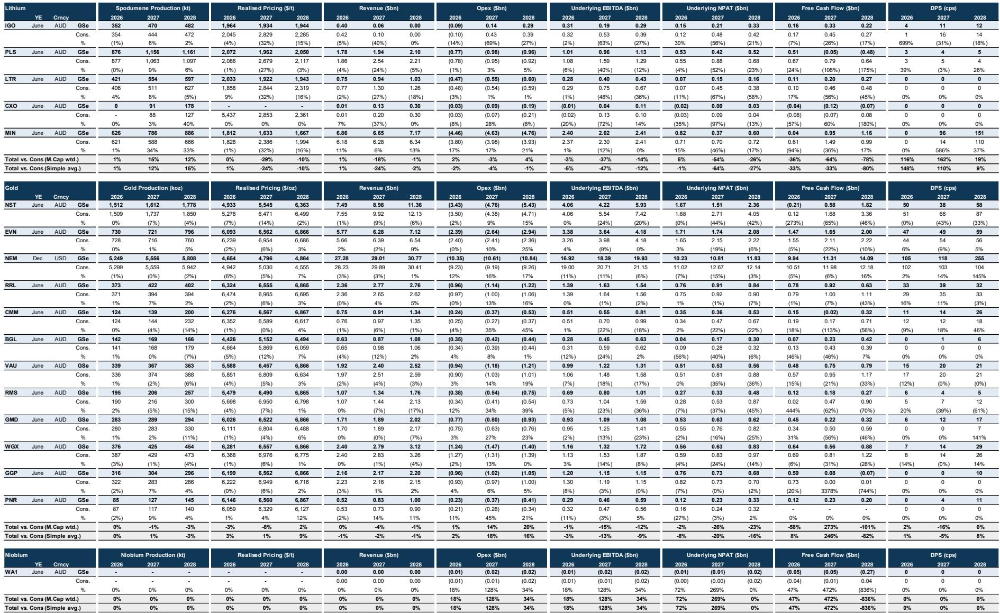
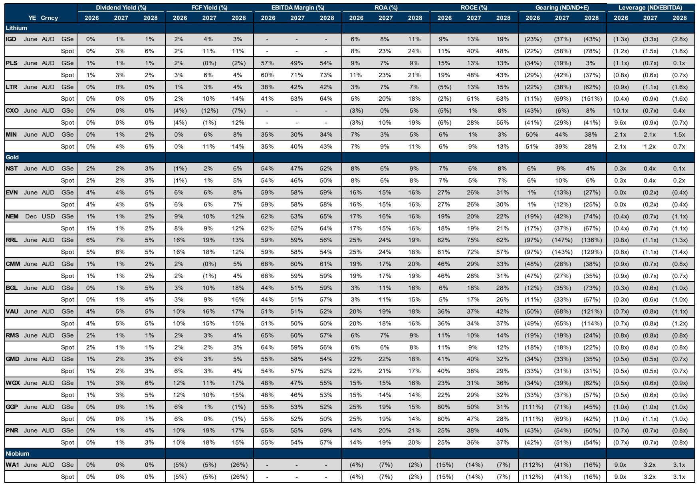

# The Australian Mining Market Is Not Pricing Commodities Correctly: Why the Gap Between Forecast and Spot Creates a Structural Opportunity

The most important insight from the latest coverage of Australian lithium and gold producers is not about which stocks are rated Buy or Sell. It is about the massive divergence between what the market assumes and what the research team projects. When you compare the FY27 EBITDA estimates under the base-case forecast versus spot pricing, the differences are not marginal. They are extreme. For lithium producers, the gap ranges from 58 percent to over 300 percent. For gold producers, the gap is consistently negative, around negative 3 to negative 5 percent. This asymmetry tells you something fundamental about how the market is pricing these two sectors, and it creates a decision framework that is far more useful than a simple list of ratings.

The report, priced as of June 5, 2026, covers 18 Australian mining companies across lithium, gold, and specialty metals. It provides explicit price targets, NAV valuations, and EV/EBITDA multiples under both the research team's base-case commodity forecasts and spot pricing. The key takeaway is not the targets themselves but the structure of the gaps. The market is pricing lithium stocks as if current high prices will persist, while the research team expects a significant decline. The market is pricing gold stocks as if current prices are sustainable, while the research team expects modest further upside. The opportunity lies in understanding which side is more likely to be wrong.

Why now matters. We are in a period of extreme commodity price dispersion. Gold is at 4,480 US dollars per ounce, up from 2,387 in 2024. Spodumene is at 2,550 US dollars per tonne, up from 974 in 2024. These are not normal levels. They reflect a combination of structural demand shifts, supply constraints, and macro uncertainty. The question every serious investor must answer is whether these prices are the new normal or a temporary spike. The report provides a clear, data-driven answer, but that answer is not the same for every commodity. And the implications for portfolio construction are profound.

## The Lithium Sector Is Priced for Perpetual Boom, But the Forecast Points to a Sharp Correction

The research team's base case for spodumene is 1,575 US dollars per tonne in Q3 2026, declining to 1,260 by Q4 2026, and averaging 1,700 for the full year. That is a 52 percent decline from the spot price of 2,550. For lithium carbonate, the forecast is 15,500 in Q3 2026 and 13,000 in Q4 2026, a 32 percent decline from spot. These are not subtle adjustments. They imply that the current pricing environment is unsustainable and that a correction is imminent.

Now look at what happens to company valuations under these two scenarios. For Pilbara Minerals, which is rated Sell with a 4.20 Australian dollar target against a 5.93 spot price, the FY27 underlying EBITDA under the base case is 1.0 billion Australian dollars. Under spot pricing, it jumps to 2.8 billion, a 182 percent difference. For Liontown Resources, the gap is 154 percent. For IGO, it is 260 percent. For Core Lithium, it is 303 percent. These are not small errors in valuation. They represent a fundamental disagreement between what the market is pricing and what the research team believes is realistic.

The so-what is straightforward. If the research team is correct and lithium prices revert toward their forecasts, then the current market capitalization of these companies embeds expectations of cash flows that will not materialize. The P/NAV ratios for lithium stocks are all above 1.0, ranging from 1.25 for Core Lithium to 1.60 for Pilbara Minerals. That means the market is paying a premium to net asset value, which only makes sense if you believe future prices will be higher than the NAV assumptions. But the research team believes the opposite. The risk is asymmetric, and it is concentrated in the lithium names.

The open question the report does not fully answer is what catalyst would trigger the revaluation. The forecast shows a gradual decline over the next two quarters, not a crash. But the market may not wait for the data to confirm the trend. If demand from Chinese battery producers softens, or if new supply from Africa or Latin America comes online faster than expected, the adjustment could be sudden. The report provides the destination but not the precise timing of the journey.

## Gold Producers Are Priced for Stagnation, But the Forecast Implies Modest Upside and Strong Cash Flow

The contrast with gold could not be starker. The research team's base case for gold is 4,565 US dollars per ounce in Q3 2026, rising to 4,626 in Q4 2026, and averaging 4,664 for the full year. That is only 2 percent above the spot price of 4,480. For 2027, the forecast is 4,820, and for 2028 it is 4,888. The trajectory is upward but gradual. There is no crash scenario embedded in the gold forecast.

When you apply this to the gold producers, the EBITDA differences between base case and spot are consistently negative, around negative 3 to negative 5 percent. That means the research team's base case is actually slightly more optimistic than spot pricing for most gold companies. Northern Star Resources, which is rated Buy with a 25.20 Australian dollar target against a 20.27 spot price, shows a negative 5 percent difference in FY27 EBITDA between base case and spot. Newmont Corporation, also rated Buy, shows negative 3 percent. Evolution Mining, rated Neutral, shows negative 2 percent.

The so-what for gold is different. The market is not pricing in a boom, but it is also not pricing in a bust. The valuations are reasonable. The P/NAV ratios for gold stocks are all below 1.0, ranging from 0.58 for Ramelius Resources to 0.91 for Evolution Mining and Newmont. That means the market is paying a discount to net asset value. The EV/EBITDA multiples are also low, with large-cap gold averaging 6.5 times and mid-cap averaging 5.0 times. For context, the lithium sector average is 11.0 times.

This creates a different type of opportunity. Gold stocks are not expensive, and the research team expects stable to slightly rising prices. The total shareholder return potential is driven by valuation re-rating and cash flow generation, not by commodity price speculation. The report shows that under spot pricing, the FY27 free cash flow yields for gold producers like Westgold Resources are 11 percent, for Bellevue Gold are 10 percent, and for Newmont are 9 percent. These are real cash returns in a sector that is not priced for perfection.

The unresolved question for gold is whether the research team's long-term real price assumption of 3,800 US dollars per ounce is too conservative. That is a 15 percent decline from current spot. If gold sustains levels above 4,000 for structural reasons such as de-dollarization, central bank buying, or fiscal dominance, then the current valuations are deeply attractive. But if gold reverts toward the long-term real assumption, then even the current modest premiums may be at risk. The report provides a framework but does not resolve this debate.

## The Report Leaves a Critical Analytical Gap: What Happens If Commodity Prices Converge to the Midpoint?

The report presents two scenarios: the research team's base case and spot pricing. But it does not fully explore what happens if prices settle somewhere in between. This is not a criticism of the analysis, which is rigorous and data-rich. It is an invitation for readers to think about the sensitivity of their own portfolios.

Consider lithium again. If spodumene prices settle at 1,900 US dollars per tonne, which is roughly the midpoint between spot and the Q3 2026 forecast, then the EBITDA for Pilbara Minerals would be somewhere between 1.0 billion and 2.8 billion. At that level, the current EV/EBITDA multiple of 18.8 times under the base case would compress significantly, but the stock would not be as cheap as the spot scenario suggests. The same logic applies to gold. If gold settles at 4,300 US dollars per ounce, which is below spot but above the long-term real assumption, then the gold producers would still generate strong cash flows, but the upside to the price targets would be reduced.

The report does not provide a third scenario, but the data allows readers to construct one. The commodity price forecasts and the financial model outputs are presented with sufficient granularity to calculate sensitivities. The thoughtful investor should run their own midpoint scenario and ask which stocks are most resilient and which are most vulnerable. The lithium names are clearly more vulnerable to a downside surprise. The gold names are more resilient but have less upside if prices remain flat.

## A Decision Framework for Investors: Three Questions to Determine Your Exposure

Based on the structure of the report, the most useful way to approach this data is not to ask which stocks are Buy or Sell. It is to ask three questions that align with the report's logic.

First, what is your view on lithium prices over the next twelve months? If you believe that the current spot price of 2,550 US dollars per tonne for spodumene is sustainable or will rise further, then the lithium stocks are cheap. The FY27 EV/EBITDA under spot pricing for Pilbara Minerals is 6.7 times, which is below the sector average. But if you believe the research team's forecast of a decline toward 1,575 is more realistic, then the current multiples are dangerously high. There is no middle ground. The dispersion of outcomes is too wide.

Second, what is your required rate of return and your tolerance for cash flow uncertainty? The gold producers offer free cash flow yields of 9 to 19 percent under spot pricing, with low valuation multiples. They are not exciting, but they are defensive. The lithium producers offer potential upside if prices stay high, but the cash flow is highly sensitive to commodity price changes. The report shows that under the base case, the FY27 free cash flow for Pilbara Minerals is negative 0.0 billion Australian dollars. Under spot, it is 1.0 billion. That is a swing from zero to substantial. You need to decide whether you are being paid enough to take that risk.

Third, how do you think about M&A optionality? The report provides M&A price targets for several gold producers, including Bellevue Gold at 2.59 Australian dollars per share, Ramelius Resources at 6.94, Genesis Minerals at 10.44, Westgold Resources at 10.29, and Predictive Discovery at 5.77. These are above the current stock prices and above the twelve-month price targets. The report does not explicitly argue that M&A is likely, but the presence of these estimates suggests that the research team sees consolidation as a possible catalyst. For lithium, no M&A targets are provided, which may reflect the view that current valuations are too high for acquirers to act.

## The Portfolio Implication Is Clear, But the Report Does Not Spell It Out

The report is structured as a coverage summary with ratings, targets, and valuation tables. It does not provide a model portfolio or a recommended allocation. But the data speaks clearly. The gold sector offers a margin of safety, with low valuations, positive free cash flow, and commodity prices that are not expected to collapse. The lithium sector offers high risk and high potential reward, but the base case suggests that current prices are not sustainable.

The most consistent pattern across the report is that the research team is significantly more bearish on lithium than the market and slightly more bullish on gold than the market. That is not a recommendation to sell all lithium and buy all gold. It is an observation that the market is pricing these two sectors with very different assumptions about the future. The investor who understands this asymmetry can position accordingly.

The report also highlights a structural feature of the Australian mining market that is easy to overlook. The large-cap gold producers like Newmont and Northern Star trade at lower multiples than the mid-cap and small-cap gold producers. But the mid-cap and small-cap names offer higher free cash flow yields and more upside to the price targets. The report rates Ramelius Resources, Westgold Resources, Predictive Discovery, and Bellevue Gold as Buy. These are not the largest names, but they offer the most compelling risk-reward if the research team's gold price forecast proves correct.

For lithium, the report rates only one company as Neutral and two as Sell. There are no Buy ratings among the lithium producers. That is a strong signal, even if the report does not state it explicitly. The research team sees more downside than upside in the lithium names at current prices.

## Join the Community to Read the Full Report and Review the Original Charts

The analysis above is based on a detailed parsing of the coverage summary, commodity forecasts, and valuation tables. But the full report contains additional layers of data that are essential for a complete understanding. The original charts show the P/NAV and EV/EBITDA comparisons across the entire coverage universe, the FY27 free cash flow yields under both scenarios, and the percentage differences in underlying EBITDA that reveal the magnitude of the gap between market pricing and research forecasts. These charts are not reproduced here, and they contain nuances that cannot be captured in text alone.

If you want to see the exact data points for each company, the trajectory of the commodity price forecasts across multiple years, and the detailed financial projections for FY26 through FY28, the full report is the source. It also includes the M&A valuation estimates that could serve as a floor for certain gold stocks. Join the community to read the full report and review the original charts. The data will change how you think about Australian mining exposure.

*This article is for learning and discussion only and does not constitute investment advice.*

Personal reading notes and learning share only. Not investment advice.

