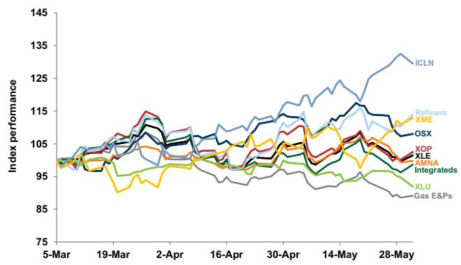
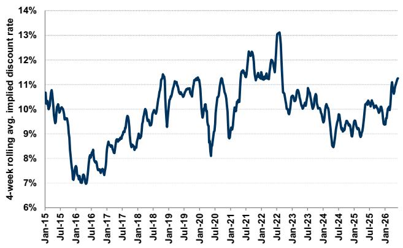
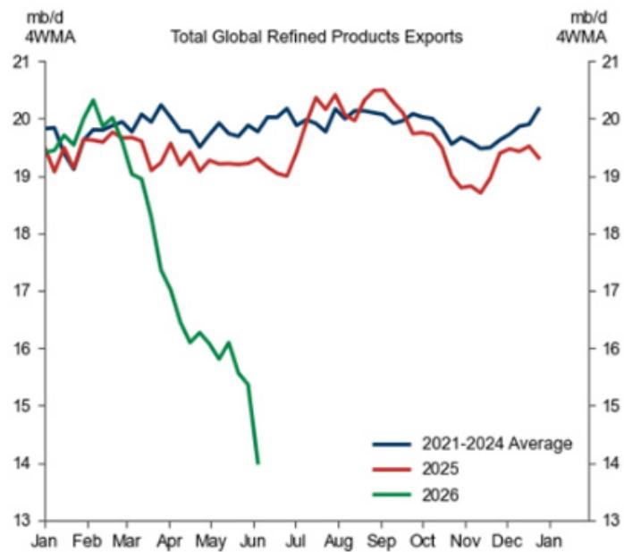
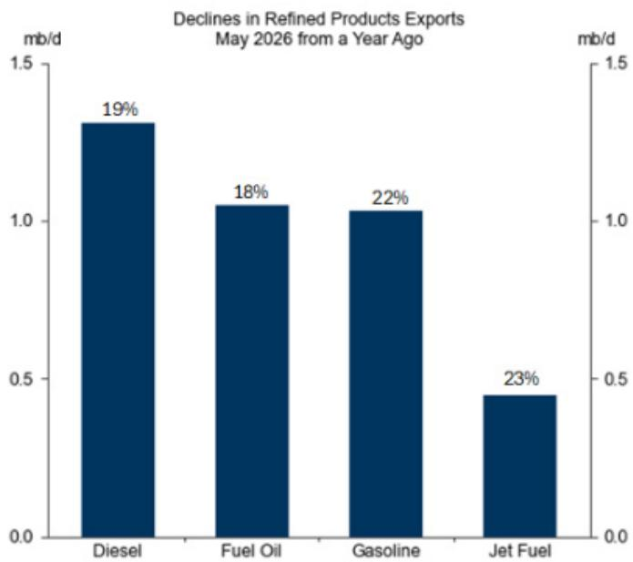
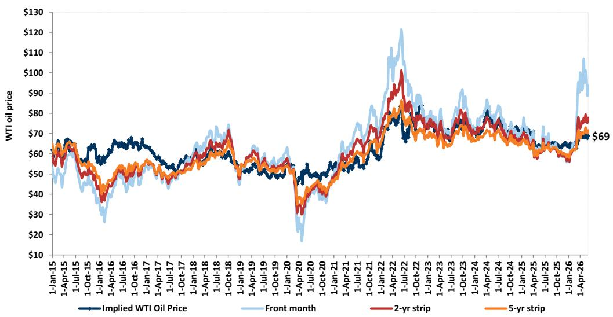
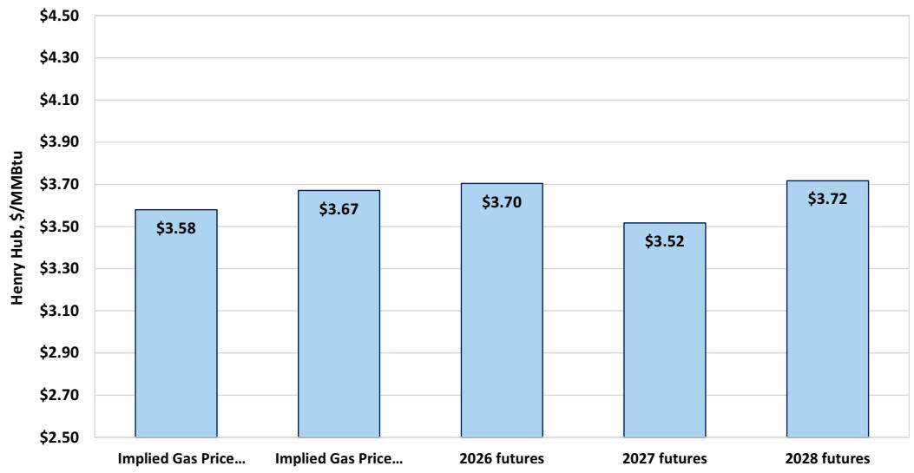
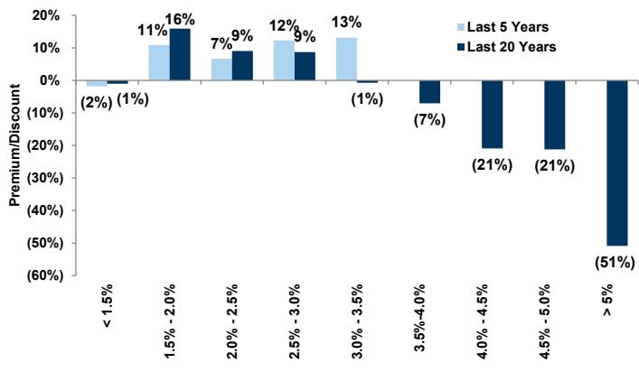
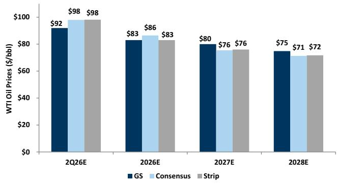
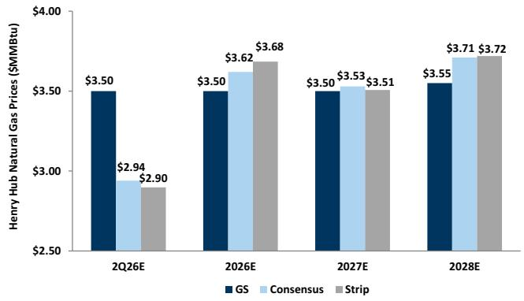
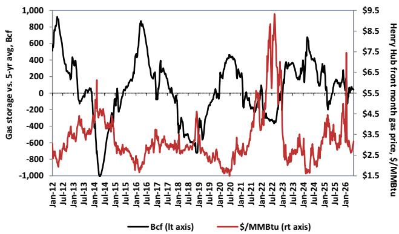

# Energy, Utilities & Mining Pulse: Investors Asking: What Are Key Debates in Natural Resources from Here?

This week in the Pulse we ask our senior analyst team to discuss key debates in their sector they expect to remain topical through 2Q earnings season and the rest of the year. Teams discuss the key debates, and highlight stocks where they see continued upside.

Specifically, we asked the teams to weigh in on:

Integrated & Refining: Views within refining equities amid a bullish crack spread environment

Energy Services: Incremental views on offshore and international activity

E&P: Natural gas E&P equities underperformance vs Oil E&P equities

Midstream: Permian basin supply and incremental drivers

Utilities: Evaluating large-cap Utilities amid a strong power demand environment

Clean Tech: Incremental upside within the SSTs space

Metals & Mining: Views on copper exposed equities amid a strong copper commodity environment

# Integrated & Refining:

Large cap refining equities have returned \~50% YTD. Our commodities team published updated forecasts maintaining a bullish crack spread view. What should investors do now with refining equities, and where are you the most bullish?

For refining, we continue to see a constructive outlook for the group underpinned by our view of (a) tight long-term supply/demand fundamentals, (b) significant inventory draws, and (c) positive consensus estimate revisions, which should drive equity performance. Amid a potentially higher for longer crack spread environment, we screen for companies with scale, track records of strong execution, balance sheet strength, and attractive capital return profiles. That said, we highlight Buy rated stocks Valero Energy (VLO), Marathon Petroleum (MPC), HF Sinclair (DINO), and for those looking down-cap, Delek (DK) and Par Pacific (PARR). For VLO, we continue to view the company as the key beneficiary of tighter refining fundamentals given its premium asset portfolio, Gulf Coast positioning, and track record of execution. For MPC, we highlight the stock's robust MPLX distributions which support the

# Neil Mehta

+1(212)357-4042 | neil.mehta@gs.com
GS & Co. LLC

# Brian Lee, CFA

+1(917)343-3110 | brian.k.lee@gs.com
GS & Co. LLC

# John Mackay

+1(212)357-5379 |
john.mackay@gs.com
GS & Co. LLC

# Carly Davenport

+1(212)357-1914 | carly.davenport@gs.com GS & Co. LLC

# Ati Modak

+1(212)902-9365 | ati.modak@gs.com
GS & Co. LLC

# Nick Cash

+1(212)357-6372 | nick.cash@gs.com
GS & Co. LLC

# Alexa Petrick

+1(917)343-9472 | alexa.petrick@gs.com GS & Co. LLC

company's attractive capital returns profile, coupled with the stock's elevated exposure to the structurally tighter West Coast market. On DINO, we remain constructive on the company's non-refining earnings contributions, balance sheet strength, and attractive underlying refining earnings power across operating regions (Mid-Con and the Rockies). Lastly, we highlight DK and PARR for investors looking down-cap where we highlight SRE optionality and see an attractive risk/reward.

# Energy Services:

# You've had a constructive view on the offshore cycle, including FTI. This week you upgraded XPRO to Buy. Why are you positive on offshore, and which regions? Why is XPRO well-positioned for offshore recovery?

Conversations with OFS companies at our Middle East Energy Symposium point to a growing consensus for incremental offshore activity in the medium term, as the market looks to diversify oil production amid the disruption in the Middle East. We have seen several offshore rig additions and reactivations, both in the Middle East and other regions, which aligns with our current estimates of a y/y increase of 5% for offshore rigs from 2026 to 2027. We currently see the potential for incremental offshore opportunity in the Africa, Latin America, and Asia regions, which we estimate will drive earnings power for OFS stocks exposed to those regions. Due to improving offshore activity dynamics, as well as relative underperformance, we see XPRO as well positioned to benefit from anticipated increasing offshore activity, particularly in regions with harsher drilling environments, as the company remains a leader in specialized technology for more complex drilling, resulting in our upgrade of the stock from Neutral to Buy. The stock has underperformed international OFS peers by \~20% since the beginning of the conflict in the Middle East. We see the stock's \~80% international and \~70% offshore revenue exposure as underappreciated by the market, and forecast incremental earnings power for the company in an improving international and offshore services environment. We also estimate improving EBITDA margins through 2031 as the company continues cost optimization strategies, and remains acquisitive of incremental specialized services, such as their pending acquisition of Enhanced Drilling, which upon closing would add managed pressure drilling technologies to the portfolio.

# E&P:

# Natural gas E&P equities have underperformed oil E&P equities by 42% this year given relative commodity performance. What has weighed on the natural gas curve and what are the equities now discounting? For those more bullish on natural gas, where do we see the most upside?

Sentiment toward the upstream natural gas equities has remained weak as we near the halfway point in 2026 as the market has remained cautious of the supply overhang ahead in North American gas markets in 2026/2027, particularly following a more constructive oil price outlook despite strong expectations for power and LNG demand to continue to inflect upward. In addition, incremental natural gas demand from the ramp up of Golden Pass has been weaker than investor expectations to start 2026. The supply overhang is driven in part by expectations for incremental Permian takeaway capacity to begin ramping in 2H26 as well as select natural gas producers are forecasting growth or adding activity despite the lower natural gas prices. The Haynesville rig count increase has particularly been in focus with investors given the +13 rig adds across the basin YTD. For those with a more constructive view on the natural gas pricing curve in 2026/2027, we highlight EXE as a name where we see outsized upside of 25% to shares at current levels. EXE's hedge-the-wedge risk management strategy provides the company with strong downside protection and ample upside potential in the event of prices improving from current strip prices. We also note the company's target of driving \~\$0.20/Mcfe of FCF improvements over 5 years through increased access to premium pricing markets, improving monetization of price volatility, and capturing new demand opportunities can serve as catalysts for the stock. We also highlight Buys on AR and EQT in the US as we see upside potential of 26% and 19% respectively to shares at current levels using a mid-cycle Henry Hub gas price of \$3.75/MMBtu.

# Midstream:

You’ve been Buy-rated on TRGP amid market debate on increasing gas supply in the Permian basin. How do you see increasing supply impacting midstream equities, and what do you see as incremental drivers for your Buy-rated view from here?

Debates have emerged on the influx of gas growth as Permian pipeline egress additions address ongoing bottleneck concerns. At the EIC conference last month, many producers pointed to a wave of meaningful Permian natural gas supply being unlocked by new pipe development. For context, Permian gas pipeline capacity is expected to increase by +5 bcf/d into 2027. As a result, we see significant volume step-ups for several companies among our coverage, particularly those most exposed to Permian gas and GOR growth. While the basin should experience a flush of incremental gas supply, there should be a more limited impact to oil growth, implying much higher Gas-to-Oil ratios (GORs) for the basin into 2027. The underlying volume growth outlook however also implies a more constructive environment for NGL volume upside as the amount of NGL volumes associated with each incremental MCF (GPMs) trend higher where the basin is currently constrained. This could be more supportive to those in our coverage with new Permian NGL pipe egress and contract roll-offs as S/D dynamics could tighten relative to our initial expectations. For TRGP, we view the company as a prime candidate for upward estimates revision upside from 2027 onward. We note projections within our midstream coverage have remained largely conservative despite constructive macro dynamics to date. We currently forecast 17%/9% annual EBITDA growth for 2026/2027, largely in line vs. FactSet consensus of 18%/9%. Stronger volume tailwinds in the back-half of 2026 and into 2027 could imply a much better exit rate for TRGP's 2027 growth expectations and support upcoming infrastructure projects. We remain focused on the timing of the return of Permian gas flows and any incremental production growth thereafter (which had previously been constrained).

# Utilities:

You've had a positive view on many large-cap regulated Utilities, including AEP, XEL, and DUK. Given higher rates and risk-on sentiment, are you seeing growing pushback to this stance? You recently met with DUK, including touring one of their nuclear facilities; what stood out about that trip?

We do believe that the 10%+ increase in the 10-year interest rate over the past three months and broader risk on momentum in the market, as well as the rotation into tech has weighed on sentiment for the regulated utilities, with the XLU underperforming the S&P500 by 18% in the past three months. That said, we still see idiosyncratic

opportunities from strong fundamentals and upcoming catalysts for select stocks in our coverage including Buy-rated AEP, XEL, and DUK. For AEP, we see catalysts from clarity on its outstanding large load tariff filings in VA, MI, OK, and TX, an update on the Bloom deal, and progress on RFPs where we expect approvals by 4Q2026 for APCo and I&M and by 3Q2027 for PSO. For XEL, we highlight potential for reducing the regulatory overhang via its large load tariff filing and approval of its rate case settlement in Colorado, and a decision on its RFPs in Q3 and Q4 for \~7.55 GW across NSP and SPS. We also believe navigating wildfire season successfully will drive the multiple to rerate back to a premium.

We also remain bullish on DUK following our meeting with management and tour of its McGuire station and we see upside risk to its current 5%-7% long-term EPS CAGR as the company gets clarity on its North Carolina rate cases and is able to continue contracting its 15.4 GW high-confidence load pipeline. On the nuclear front, management has been messaging its focus on cost overrun risk sharing for nuclear newbuild, where it has seen progress in conversations with the government, OEMs, hyperscalers, and other stakeholders. Management noted that it would be supportive to be able to monetize ITCs as capital is deployed rather than at COD. At the plant, the company highlighted uprate opportunities of 75 MW for each unit and its plans to extend the refueling cycle from 18 to 24 months.

# Clean Tech:

You've taken a constructive view on the upside from solid-state transformers (SSTs), as discussed in your note here. This has driven outperformance of stocks such as FLNC/SEDG. Where do you see incremental upside from here? What do you see as a potential next-derivative to play this theme?

Despite the strong price moves in ENPH and SEDG based on the market potential for SSTs, we believe there is continued discovery value as this opportunity becomes more tangible. In particular, as these companies can confirm pilot deployments are being sent out as well as additional details on customer feedback and revenue potential, we see an increasing ability to start working in some assumptions into financial results starting in the 2028 timeframe. In terms of next-derivative plays, we see NXT and FLNC as key potential beneficiaries of the theme of powering AI DCs. We note that NXT continues to diversify its business, including a recent announcement that it is acquiring a battery storage company. With an upcoming Analyst Day this fall, we believe there could be continued discussion on the AI DC opportunity. Regarding FLNC, the company continues to highlight its recent master supply agreements with two hyperscalers for AI DC battery storage deployments, where it is bidding on up to 12 GWh of supply that could look to come online sometime in F2028. As a result, we see this theme providing incremental discovery value for NXT and FLNC over the near- and medium-term.

# Metals & Mining:

You've had a constructive view on copper with your Buy-rating on FCX. Our Commodities team recently increased their copper forecasts. Where do you see incremental upside from here, and what do you see driving your view compared to consensus?

We remain constructive on FCX due to both the macro and the micro. As a result of our Commodities team's recent copper forecast revision, we see FCX as a direct beneficiary of higher for longer copper prices which have been driven by better than expected data points on growth trends while China inventory destocking has been faster than seasonal norms. As a result, this has contributed to the ex. US deficit which the team expects will be a tailwind to pricing. On the micro side, while we remain conservative on the Grasberg recovery, we believe a faster recovery of volumes will enable FCX to capture a greater share of the currently favorable copper and gold pricing environment. In the near term, the spread between COMEX and LME copper prices continue to widen, driven by US markets factoring in a potential copper tariff. As a result, we expect FCX's North American segment to achieve prices above COMEX which is currently \~4% above LME prices. We anticipate this will help offset the impact of higher fuel costs in the near term while also improving FCX's operating leverage in North America. As a result, we expect FCX will be a relative outperformer vs. peers.

# Editor's Choice Charts

Exhibit 1: Energy, Utilities & Mining sub-sector performance   
Past 90 days (3/5/2026-6/3/2026)   

line

| Date    | ICLN  | Refiners | XME   | OSX   | XOP   | AMNA  | Integrateds | XLU   | Gas E&Ps |
|---------|-------|----------|-------|-------|-------|-------|--------------|-------|----------|
| 5-Mar   | 98    | 97       | 96    | 97    | 96    | 95    | 96           | 95    | 94       |
| 19-Mar  | 102   | 101      | 100   | 101   | 100   | 99    | 100          | 98    | 97       |
| 2-Apr   | 105   | 104      | 103   | 104   | 103   | 102   | 103          | 101   | 100      |
| 16-Apr  | 108   | 107      | 106   | 107   | 106   | 105   | 106          | 104   | 103      |
| 30-Apr  | 112   | 111      | 110   | 111   | 110   | 109   | 110          | 108   | 107      |
| 14-May  | 118   | 117      | 116   | 117   | 116   | 115   | 116          | 114   | 113      |
| 28-May  | 135   | 134      | 133   | 134   | 133   | 132   | 133          | 131   | 130      |

Source: FactSet, GS Global Investment Research

Exhibit 2: We believe E&Ps are reflecting a cost of capital above 11%   
4-week rolling avg. of the implied discount rate for E&Ps based on five-year futures   

line

| Date    | 4-week rolling avg. implied discount rate |
|---------|------------------------------------------|
| Jan-15  | 10.5%                                    |
| Jul-15  | 10.8%                                    |
| Jan-16  | 7.0%                                     |
| Jul-16  | 7.5%                                     |
| Jan-17  | 8.0%                                     |
| Jul-17  | 8.5%                                     |
| Jan-18  | 9.0%                                     |
| Jul-18  | 9.5%                                     |
| Jan-19  | 10.0%                                    |
| Jul-19  | 10.5%                                    |
| Jan-20  | 8.0%                                     |
| Jul-20  | 10.0%                                    |
| Jan-21  | 11.0%                                    |
| Jul-21  | 12.0%                                    |
| Jan-22  | 12.5%                                    |
| Jul-22  | 13.0%                                    |
| Jan-23  | 10.0%                                    |
| Jul-23  | 10.5%                                    |
| Jan-24  | 9.0%                                     |
| Jul-24  | 8.5%                                     |
| Jan-25  | 9.5%                                     |
| Jul-25  | 10.0%                                    |
| Jan-26  | 11.0%                                    |

Source: Bloomberg, GS Global Investment Research

Exhibit 3: Hormuz Closure Pushed Global Exports of Refined Products Down 4.0mb/d from a Year Ago Levels in May   

line

| Month | 2021-2024 Average | 2025 | 2026 |
|-------|-------------------|------|------|
| Jan   | 19.8              | 19.5 | 19.7 |
| Feb   | 19.9              | 19.6 | 20.3 |
| Mar   | 19.8              | 19.7 | 19.5 |
| Apr   | 19.7              | 19.4 | 17.5 |
| May   | 19.8              | 19.3 | 16.0 |
| Jun   | 19.7              | 19.2 | 14.0 |
| Jul   | 19.8              | 19.5 | -    |
| Aug   | 19.9              | 20.3 | -    |
| Sep   | 20.0              | 20.5 | -    |
| Oct   | 19.9              | 19.8 | -    |
| Nov   | 19.7              | 18.8 | -    |
| Dec   | 19.8              | 19.5 | -    |
| Jan   | 20.1              | 19.3 | -    |

Refined products on the left panel include diesel, gasoline, jet fuel, fuel oil

bar

Declines in Refined Products Exports May 2026 from a Year Ago
| Product | Decline (%) |
| :--- | :--- |
| Diesel | 19 |
| Fuel Oil | 18 |
| Gasoline | 22 |
| Jet Fuel | 23 |

Source: Kpler, GS Global Investment Research

# Sector in Context

Exhibit 4: Valuations of E&P stocks reflect WTI oil prices below the five-year strip. Historical WTI price implied in covered E&Ps and forward oil futures, \$/bbl   

line

| Date       | Implied WTI Oil Price | Front month | 2-yr strip | 5-yr strip |
|------------|------------------------|-------------|----------|----------|
| 1-Apr-26   | $69                    |             |          |          |

Source: FactSet, GS Global Investment Research

# Exhibit 5: Gas-focused E&Ps are broadly implying \~\$3.65/MMBtu long-term gas price vs. our mid-cycle view of \$3.75/MMBtu, 2026/2027/2028 gas futures at \~\$3.70/\$3.52/\$3.72 per MMBtu

Henry Hub gas price implied by our FCF Yield-analysis of covered gas producers, vs. 2026/2027/2028
Henry Hub gas futures

bar

| Category | Value ($/MMBtu) |
| :--- | :--- |
| Implied Gas Price... | 3.58 |
| Implied Gas Price... | 3.67 |
| 2026 futures | 3.70 |
| 2027 futures | 3.52 |
| 2028 futures | 3.72 |

Source: FactSet, GS Global Investment Research

# Exhibit 6: Historically, Utilities trade at a P/E multiple premium to the S&P when the 10-year UST remains below \~3%, however, the relationship weakens in times of negative real rates

Utility P/E multiple premium / discount to the S&P in different UST 10-year yield environments

bar

| Range | Last 5 Years (%) | Last 20 Years (%) |
| :--- | :--- | :--- |
| < 1.5% | (2) | (1) |
| 1.5% - 2.0% | 11 | 16 |
| 2.0% - 2.5% | 7 | 9 |
| 2.5% - 3.0% | 12 | 9 |
| 3.0% - 3.5% | 13 | (1) |
| 3.5% - 4.0% | | (7) |
| 4.0% - 4.5% | | (21) |
| 4.5% - 5.0% | | (21) |
| > 5% | | (51) |

Source: Company data, GS Global Investment Research

# Conversations we are having with investors

# E&P – Neil Mehta

DVN. DVN has been a stock in focus this week following the company's recent closing of the merger with CTRA (closed May 7, 2026), DVN's announced \$2.6 bn Federal Lease Sale acquisitions in Lea and Eddy Counties, NM, as well as the recent reports around a proposed \$8 bn offer for DVN's Marcellus gas assets (as reported here). Investors have generally been constructive on the outlook for DVN shares from current levels, particularly following the recent 1-month underperformance versus peers (DVN -9% vs +0% average for EOG, OXY, COP, FANG). Investors have also been focused on the company's lease sale acquisitions in the Delaware Basin and more broadly on the value of undeveloped acreage in the Delaware Basin in 2026 given the maturity of the basin. Lastly, investors have been highly focused on the company's asset positions, particularly the Marcellus and Anadarko assets. Some investors also note the incremental M&A activity seen within the Anadarko Basin more recently and the strategic optionality DVN holds with its diversified portfolio of assets. Investor considerations on the potential to sell the Marcellus have included the pure-play natural gas composition of the asset as well as the less-constructive natural gas price outlook relative to several months ago.

OXY. OXY has been a stock in focus in our recent conversations following our recent upgrade of the stock here. Investors have been incrementally more constructive on the outlook for OXY following continued quarterly execution strength, reiterated focus on capital efficiency, and incremental progress on deleveraging given recent oil price strength. Investors have highlighted recent positive rate of change with the company's focus on operational execution and reducing the sustaining capital intensity of the business. Some investors have queried if OXY's return of capital program relative to oily E&P peers could be more conservative given OXY's stated focus on prioritizing cash reserves to redeem a large preferred equity stake in August 2029.

# Majors & Refining – Neil Mehta & Alexa Petrick

U.S. Majors. Investors continue to discuss the outlook for U.S. Majors amid a volatile commodity price environment. For XOM, key questions at a recent lunch in New York focused on Permian growth, Middle East exposure, LNG strategy, refining margins, and exploration opportunities. Management still views the company as a logical consolidator over the medium-term, particularly in the Lower 48, but notes near-term geopolitical conflict drives volatility in bid-ask spreads. For COP, some investors emerged from recent Boston meetings with a more constructive outlook on major growth projects, including NFE and Willow, though pushback remains around the free cash flow inflection being longer-dated. For CVX, investors highlight attractive valuation, commodity price torque, and support from operations, with TCO, Gorgon, Wheatstone, and Leviathan back in service.

Canadian Oils. Western Canada remains a compelling region for many energy investors, with an abundance of long-life, low-decline assets and a favorable geopolitical risk profile amid ongoing global supply disruptions. Investors see upside to CNQ given recent underperformance relative to peers, but some express concern around capital spend and regulatory support for medium-term in-situ and long-term mining projects. More constructive investors highlight accelerating capital returns, with net debt now under \~C\$16 bn and on track to hit \~C\$13 bn by year-end at strip pricing. Despite strong outperformance, investors also remain constructive on CVE ahead of first oil from West White Rose and additional production from Christina Lake North. They continue to see expensive valuation for IMO.TO and debate the extent of further upside to SU.

# Energy Services – Ati Modak & Neil Mehta

AGX Earnings. Conversations with investors this week focused on Argan ahead of the company's 1FQ27 earnings. After a large beat vs the Street in 4FQ26 as the company realized improving project execution and the substantial completion of a large gas project, investors are focused on the next steps of growth and project additions for the company. With the company achieving \~29% gross margins in the Power segment in 4FQ26, conversations focused heavily on the expectations on margins for 1FQ27, and the forward margin profile from current levels. Investors are heavily focused on forward pricing expectations for incremental projects, as signals from turbine manufacturers and customers suggest potentially higher pricing as the supply/demand for EPCs continues to tighten. Debate remains on the correct price to apply to forward project assumptions, and the duration of pricing over the next several years as OEM lead times for turbines remain several years. As more Utilities and IPPs announce incremental gas projects, the market remains focused on the timing for incremental project announcements for AGX, particularly as the company has reached substantial completion on a larger project.

Offshore Activity. On the back of our Middle East Energy Symposium and upgrade of international and offshore oilfield levered XPRO, conversations with investors have focused on the magnitude of potential incremental activity, particularly within the jack-up and drillship markets as many countries look to diversify oil supply amid the continued conflict in the Middle East. Investors are focused on the regions of potential activity additions, and the magnitude of potential rig additions. With incremental work expected on the back of an end to the disruption in the Middle East as well as continued focus on diversifying supply, international and offshore levered OFS companies continue to see potential upside to spending for oilfield services over the medium term. From our conversations, many investors are looking for idiosyncratic ways to play into this theme, as the market remains focused on North America exposed OFS stocks while the supply disruption continues and commodity prices remain elevated.

# Utilities - Carly Davenport

Eversource. This week, we hosted ES management for an NDR in Toronto. While investor sentiment has been more bearish on ES over the past 12 months due to overhang from offshore wind, concern on the Connecticut regulatory environment and broader affordability in New England, and an adverse outcome on FERC transmission base ROEs for New England Transmission Owners this year, investor feedback on meetings was more constructive. As we look towards June/July, investors we met with are no longer looking to express a negative view on the stock, and could see a case to get more positive as we gain more regulatory clarity in CT and around the FERC process. Investors are watching the Aquarion appeal period (which ends June 14), storm cost securitization rules in CT in June/July to build confidence around the balance sheet outlook and funding plans, where management has not baked an Aquarion sale into plans explicitly, but has included the storm cost securitization. There was also optimism around the potential for credit outlook upgrades from the agencies after the securitization orders in CT. The focus here is on execution, and eventually demonstration of the ability to hit the top end of its EPS growth guidance range of 5%-7%, with potential path higher if the company is successful on the FERC ROE proceedings.

AEP. In our conversations, we are seeing more debate around AEP among generalist and specialist investors. Those that are more bullish continue to point to the positive revision story, with AEP having recently updated their capital plan and EPS growth, in addition to highlighting clear line of sight to incremental capex opportunities. There is also a positive view on the geographic diversification in a busy election year. Those that are more bearish are growing increasingly concerned about the election outlook in PJM, particularly in Ohio, where investors are focused on the political debate surrounding utility regulation, as affordability-driven campaign platforms have prompted discussions regarding how state regulators may impact future rate structures. This concern is coupled with perceived risk around the company's large load outlook, particularly in Texas, where the company does not have control over the power generation build, leaving potential risk that the load is delayed or canceled due to lack of generation capacity. Investors debate how much of the large load pipeline is actually in the capital plan, with those more bullish holding the view that even if some load fell out, new opportunities will likely backfill it. Some believe there is better risk reward to other utilities with PJM exposure, like FE, which already trade at a valuation discount, relative to AEP now trading at a premium to the group.

# MLPs/Pipelines - John Mackay

Cheniere in focus following announced EPC contract on SPL expansion. We fielded several inbounds this week on Cheniere following progress on the company's pre-FID Sabine Pass Expansion project in late May. For context, Cheniere announced they signed a lump sum, turn-key EPC contract with Bechtel on phase 1 of their pre-FID SPL expansion project and issued limited notices to proceed (LNTP) with construction to Bechtel. On timing, some investors noted the issuance of LNTP to Bechtel was earlier than expected (management had previously noted this was possible later in 2026). That said, most investors we speak with still expect permitting to be the gating item before FID in late 2026 or early 2027. On project costs, many investors we spoke with viewed the disclosed EPC contract size, which came in at similar capex/ton cost to Cheniere's recent brownfields, as a positive, particularly given broader EPC cost inflation. For context, the announced EPC contract of \$4.69b for over 6 mtpa of capacity implies a capex/ton cost of low \~\$700/ton - which compares to Cheniere's most recent brownfield projects at \$700/ton, and also compares to costs from US LNG peers of \$1,000-\$1,300+/ton. The minimal capex inflation on the announced Sabine EPC contract confirms stable construction costs for the initial Phase 1. This establishes a firm cost baseline while Cheniere works to contract the remaining capacity needed to support the Corpus expansion in the current SPA price environment. All that said, most investors we speak are focused on the potential for Cheniere to grow beyond a phase 1 expansion at each site (above 75 mtpa) under the current SPA price environment.

CVX Bakken productivity trends and read throughs to HESM. This week, we fielded several inbounds on CVX/HES Bakken well-level production data and the related implications for HESM. Investors are focused on a divergence in productivity levels between CVX and other basin operators such as Continental and COP, where the data shows CVX acreage screening below peers on a Year-1 average oil production per well basis. We fielded multiple inbounds centered on the fact that, while peers screen flat-to-up on a productivity basis, CVX appears flat-to-down on both a per-well and lateral-foot-adjusted basis, with the trend softening from 2022 through 2025 and continuing with a slow start to 2026. More cautious investors are concerned about the CVX volume outlook on the legacy HES acreage given the productivity trends and the read-through downside risk to HESM throughput volumes and associated minimum volume commitment dynamics. Meanwhile, more constructive investors point to the potential for CVX to improve recovery on the historical HES acreage, citing usage of advanced chemicals and other technology which could improve recovery rates above historical productivity. From here, focus remains on CVX's ability to de-risk the productivity trajectory with investors looking for further proof points on recovery-enhancing technology and the quality of underlying volume drivers ahead of 2Q26 earnings, particularly given the continued strength in the commodity price.

# Clean Technology – Brian Lee, CFA

SSTs. We continue to field elevated investor interest in the outlook for solid-state transformers, particularly related to ENPH and SEDG. Investors continue to ask about the potential market TAM, as well as ENPH/SEDG's competitive advantages in this market. In particular, there have been questions on the competitive dynamics between ENPH and SEDG, as well as market incumbents and new start-ups in the space, with a focus on the differences between SiC and GAN based technologies. Additionally, there have been inquiries into how much of this opportunity is already priced into these stocks, and how we are thinking about the market trajectory from here.

FLNC. We have seen increased investor interest in FLNC and battery storage, especially following NXT's recent acquisition of a battery storage company as well as news from Siemens that it is designing architecture for AI DCs with FLNC and NVDA. In particular, investors have wanted to better understand the competitive dynamics within the industry, including how FLNC differentiates itself. Additionally, there have been questions on sizing the AI DC TAM for battery storage, and how FLNC can capitalize on this trend to expand its growth opportunities.

# Metals & Mining - Nick Cash

CLF. Investor inbounds on CLF increased this week following the stock's \~40% gain over the past month. Investors attribute the movement to positive steel sentiment and pricing tailwinds despite a lack of new corporate news. Investors are analyzing the impact of these pricing trends on free cash flow and debt reduction. Additionally, investors are evaluating revenue opportunities from data center demand – linked to the company's GOES exposure – as well as potential asset sales as guided by the company. We believe the performance has been driven by pricing tailwinds and upside from contract resets on \~2mn tons of steel which have contract renegotiations coming in 4Q26-1Q27 which could provide additional upside to realized prices.

Tariffs. Inbounds on tariffs and concessions continue to be front and center of the conversation. Investors have been trying to gauge what level of section 232 steel tariffs to underwrite in 2027 and beyond to gauge where mid cycle steel prices could settle out in the coming years. There remains a wide range of views that seemingly shifts weekly as investors digest new data points on imports, global supply, inventory levels, mill utilization etc. Investors have queried if any concessions are made to Canada and Mexico, could that trigger broader global tariff reductions, and whether this would lead to immediate downward pressure on prices.

# Key GS Energy Research Reports

# GS Energy Research for the Week

Exxon Mobil Corp. (XOM): Takeaways from Investor Lunch: Upstream Execution, Downstream Margins, and M&A Strategy in Focus

Uranium Energy Corp. (UEC): F3Q26 preview; updating estimates to reflect production ramp

Eversource Energy (ES): Takeaways from NDR: Clear path to de-risking regulatory items and balance sheet positioning

PLAINS ALL AMERICAN (PAA/PAGP): Upgrade to Neutral on More Constructive Macro, Streamlined Portfolio, FCF, and M&A Potential

Americas Pipelines and MLPs: GS Canada Oil & Gas Series — Key Takeaways from Virtual Meeting with Keyera

Freeport-McMoRan Inc. (FCX): Raising estimates; expect increased COMEX vs. LME spread to result in relative outperformance for FCX; Buy

# Commodities - Oil and Natural Gas strip

Exhibit 7: Oil: GS vs. consensus vs. strip   
GS Commodities estimates vs consensus vs strip prices for WTI oil, \$/bbl   

bar

| Year | GS ($) | Consensus ($) | Strip ($) |
| :--- | :--- | :--- | :--- |
| 2Q26E | 92 | 98 | 98 |
| 2026E | 83 | 86 | 83 |
| 2027E | 80 | 76 | 76 |
| 2028E | 75 | 71 | 72 |

Source: FactSet, Bloomberg, GS Global Investment Research

Exhibit 8: Natural gas: GS vs. consensus vs. strip   
GS Commodities estimates vs consensus vs strip prices for natural gas, \$/MMBtu   

bar

| Year | GS ($MMBtu) | Consensus ($MMBtu) | Strip ($MMBtu) |
| :--- | :--- | :--- | :--- |
| 2Q26E | 3.50 | 2.94 | 2.90 |
| 2026E | 3.50 | 3.62 | 3.68 |
| 2027E | 3.50 | 3.53 | 3.51 |
| 2028E | 3.55 | 3.71 | 3.72 |

Source: FactSet, Bloomberg, GS Global Investment Research

Exhibit 9: Natural gas inventories are in a modest surplus versus the 5-year-average   
Natural gas storage vs. the five-year average (Bcf) vs. HH front-month natural gas price (\$/MMBtu)   

line

| Date   | Gas storage (lt axis) | Henry Hub front month gas price ($/MMBtu) |
|--------|----------------------|------------------------------------------|
| Jan-12 | ~900                 | ~$3.5                                    |
| Jul-12 | ~400                 | ~$3.0                                    |
| Jan-13 | ~-200                | ~$2.5                                    |
| Jul-13 | ~-800                | ~$2.0                                    |
| Jan-14 | ~-1,000              | ~$1.5                                    |
| Jul-14 | ~-600                | ~$2.5                                    |
| Jan-15 | ~-400                | ~$3.0                                    |
| Jul-15 | ~-200                | ~$3.5                                    |
| Jan-16 | ~800                 | ~$4.0                                    |
| Jul-16 | ~400                 | ~$4.5                                    |
| Jan-17 | ~-200                | ~$5.0                                    |
| Jul-17 | ~-600                | ~$5.5                                    |
| Jan-18 | ~-800                | ~$6.0                                    |
| Jul-18 | ~-400                | ~$6.5                                    |
| Jan-19 | ~-200                | ~$7.0                                    |
| Jul-19 | ~-600                | ~$7.5                                    |
| Jan-20 | ~-400                | ~$8.0                                    |
| Jul-20 | ~-200                | ~$8.5                                    |
| Jan-21 | ~400                 | ~$9.0                                    |
| Jul-21 | ~-200                | ~$9.5                                    |
| Jan-22 | ~-400                | ~$9.5                                    |
| Jul-22 | ~400                 | ~$9.5                                    |
| Jan-23 | ~600                 | ~$9.5                                    |
| Jul-23 | ~400                 | ~$9.5                                    |
| Jan-24 | ~600                 | ~$9.5                                    |
| Jul-24 | ~400                 | ~$9.5                                    |
| Jan-25 | ~600                 | ~$9.5                                    |
| Jul-25 | ~400                 | ~$9.5                                    |
| Jan-26 | ~600                 | ~$9.5                                    |

Source: EIA, GS Global Investment Research

# GS Energy & Utilities Analyst Contributors

GS Energy, Utilities & Mining team   
Contributors to this report 

<table><tr><td colspan="7">Neil Mehta, Business Unit LeaderBrian Lee, CFA, Deputy Business Unit Leader</td></tr><tr><td>E&amp;Ps</td><td>Intgd. Oils/Refiners</td><td>Energy Services</td><td>Clean Energy</td><td>Utilities</td><td>Pipelines/MLPs</td><td>Metals &amp; Mining</td></tr><tr><td>Neil Mehta(212) 357-4042neil.mehta@gs.comGoldman, Sachs &amp; Co.</td><td>Neil Mehta(212) 357-4042neil.mehta@gs.comGoldman, Sachs &amp; Co.</td><td>Ati Modak(212) 902-9365ati.modak@gs.comGoldman, Sachs &amp; Co.</td><td>Brian Lee, CFA(917) 343-3110brian.k.lee@gs.comGoldman, Sachs &amp; Co.</td><td>Carly Davenport(212) 357-1914carly.davenport@gs.comGoldman, Sachs &amp; Co.</td><td>John Mackay(212) 357-5379john.mackay@gs.comGoldman, Sachs &amp; Co.</td><td>Nick Cash(212) 357-6372nick.cash@gs.comGoldman, Sachs &amp; Co.</td></tr><tr><td>Greta Drefke(212) 357-5667greta.drefke@gs.comGoldman, Sachs &amp; Co.</td><td>Alexa Petrick(212) 357-4089alexa.petrick@gs.comGoldman, Sachs &amp; Co.</td><td>Neil Mehta(212) 357-4042neil.mehta@gs.comGoldman, Sachs &amp; Co.</td><td>Tyler Bisset(212)357-5510tyler.bisset@gs.comGoldman, Sachs &amp; Co.</td><td>Beatriz Abreu(212) 357-0455beatriz.abreau@gs.comGoldman, Sachs &amp; Co.</td><td>Jackie Koletas(917) 343-8915jackie.koletas@gs.comGoldman, Sachs &amp; Co.</td><td>Cecilia Tang(713) 904-8282cecilia.x.tang@gs.comGoldman, Sachs &amp; Co.</td></tr><tr><td>Jack Cavanagh(212) 902-7206jack.cavanagh@gs.comGoldman, Sachs &amp; Co.</td><td>Lydia Gould(212) 357-1041lydia.gould@gs.comGoldman, Sachs &amp; Co.</td><td>Caitlin Donohue(212) 357-9738caitlin.donohue@gs.comGoldman, Sachs &amp; Co.</td><td>Keshav Choudhary(332) 245-7971keshav.choudhary@gs.comGoldman, Sachs India SPL</td><td>Jaskaran Jaiya(332) 245-7709jaskaran.jaiya@gs.comGoldman, Sachs India SPL</td><td>Olivia Halferty(801) 212-7314olivia.halferty@gs.comGoldman, Sachs &amp; Co.</td><td></td></tr><tr><td>Jerry Speicher(801) 744-0758jerry.speicher@gs.comGoldman, Sachs &amp; Co.</td><td>Josiah Knight(212) 357-9806josiah.knight@gs.comGoldman, Sachs &amp; Co.</td><td></td><td></td><td>Jaya Patel(212) 357-9901jaya.patel@gs.comGoldman, Sachs &amp; Co.</td><td>Ben Lund(801) 884-1197ben.lund@gs.comGoldman, Sachs &amp; Co.</td><td></td></tr></table>

Source: GS Global Investment Research

# Valuation and Key Risks

EXE. We are Buy rated on EXE with a 12-month price target of \$115 with a target free cash flow yield of 9.0% on average 2027/2028 estimates applying \$75/\$75 per bbl Brent oil price and \$3.75/\$3.75 per MMBtu Henry Hub gas price. Key risks include costs, well results, commodity price volatility and government pronouncements. Closing Price: \$93.40.

NXT. We are Buy-rated on NXT and our 12-month price target of \$168 is based on a 33X P/E multiple on our Q5-Q8 EPS. Key risks include increasing competition, customer attrition, patent protection, market demand, policy, and supplier product availability/pricing. Closing Price: \$150.32.

FLNC. We are Buy-rated on FLNC and our 12-month price target of \$22 is based 50% on a DCF value assuming a 4.5% terminal growth rate, and 50% on an EV/Sales valuation of \$23 using a 1x on our FY2027E revenue. Key risks include slower than expected energy storage adoption, slower energy storage revenue recognition, worse supply chain impacts such as battery shortages and/or logistics issues, litigation outcomes, and the timing of mix shift from hardware to software revenue. Closing Price: \$27.15.

FCX. We are Buy-rated with a 12-month price target of \$75 based on a through-cycle EV/EBITDA valuation (85%) and an M&A component (15%). We derived \$72 from applying a 7.1x EV/EBITDA multiple to 2026-2028 average estimates and a \$94 theoretical value for the M&A component by applying a 9.0x multiple to our EV/EBITDA valuation component, in line the most recent five comparable copper-related transactions, above \$1bn in deal value. Key Risks. 1) Commodity prices lower than anticipated; 2) Higher energy costs; 3) Labor strikes in Indonesia and South America; 4) Mine operating disruptions resulting in less output than anticipated; 5) Higher than anticipated capital costs; 6) Cost reduction less than anticipated. Closing Price: \$69.69.

TRGP. We are Buy rated with a 12-month PT of \$283 based on a 12.75x multiple applied to our 2027 EBITDA estimate. Downside risks include: 1) slower growth in the Northern Delaware Basin, 2) lower NGL prices, 3) slower than expected roll-offs for NGL dedications to third-parties, 4) execution on capital projects, 5) higher than expected run-rate capex needs, 6) execution on capital return plans, and 7) high-multiple M&A. Closing Price: \$267.37.

AEP. We are Buy rated on AEP. Our 12-month, SOTP-based price target is \$147. Key risks relate to lower-than-expected ownership of renewable RFPs, financing needs, failure to make progress on closing the ROE gap at the VIU utilities, and cost management. Closing Price: \$127.79.

XEL. We are Buy rated on XEL. We apply a 20x multiple to our Q5-Q8 earnings, representing a 3x premium to our baseline multiple to account for attractive leverage to renewables and transmission, as well as above-average growth versus peers and a strong track record of execution. Our 12-month price target is \$92. Key risks to our rating include 1) negative rate case outcomes, 2) litigation, 3) failure to close the gap between earned vs authorized ROE, and 4) cost management. Closing Price: \$77.77.

DUK. We are Buy rated on DUK (on CL) and see 18% total return potential to our 12-month, \$145 price target which is based on a P/E multiple of 19.5x on our Q5-Q8 estimates to capture the upside opportunities around generation capex and improved regulatory position. Key downside risks include: DUK's balance sheet not improving; regulatory uncertainty from recently filed rate case; and any decline in the strong load growth forecast impacting expected earnings growth. Closing Price: \$121.82.

XPRO. Our 12-month price target is \$19 and is based on the average of two methodologies: a target through-cycle free cash flow yield of 9.0% and a target through-cycle EV/EBITDA multiple of 5.5x. Key Risks: 1) Slowdown in international/offshore activity, 2) slower than anticipated increase in international OFS markets, 3) slower than anticipated technology developments. Closing Price: \$16.59.

MPC. We are Buy rated on MPC, and our 6-month, P/E (15.0x on normalized EPS) and SOTP-based price target is \$291. Key risks relate to refining margins, operational execution, and midstream earnings. Closing Price: \$267.05.

DK. We are Buy rated on DK and our 6-month price target (SOTP based 85%, M&A 15%) is \$58. For the M&A value, we apply a \$1/bbl higher crack spread in our model, consistent with the methodology across our broader coverage. Key risks relate to refining margins, operational execution, and capital allocation. Closing Price: \$47.67.

DINO. We are Buy rated on DINO, and our 6-month, P/E (11.5x normalized EPS) and SOTP-based price target is \$81. Key risks relate to refining margins, non-refining earnings, and operational execution. Closing Price: \$72.83.

PARR. We are Buy rated on PARR, and our 6-month SOTP-based price target is \$77 prior. Key risks relate to refining margins, retail earnings, and operational execution. Closing Price: \$55.55.

VLO. We are Buy-rated on VLO, and our 6-month, P/E (15.0x on our normalized EPS forecast) and SOTP-based price target is \$283. Key risks relate to refining margins, operational execution, and capital returns. Closing Price: \$258.85.

AR. We are Buy rated on AR with a 12-month price target of \$46 with a target free cash flow yield of 9.5% on average 2027/2028 estimates applying \$75/\$75 per bbl Brent oil price and \$3.75/\$3.75 per MMBtu Henry Hub gas price. Key risks include costs, well results, commodity price volatility and government pronouncements. Closing Price:

\$37.10

EQT. We are Buy rated on EQT with a 12-month price target of \$65 and a target free cash flow yield of 8.5% on average 2027/2028 estimates applying \$75/\$75 per bbl Brent oil price and \$3.75/\$3.75 per MMBtu Henry Hub gas price. Key risks include costs, well results, commodity price volatility and government pronouncements. Closing Price: \$55.24

# Disclosure Appendix

# Reg AC

We, Neil Mehta, Brian Lee, CFA, John Mackay, Carly Davenport, Ati Modak, Nick Cash and Alexa Petrick, hereby certify that all of the views expressed in this report accurately reflect our personal views about the subject company or companies and its or their securities. We also certify that no part of our compensation was, is or will be, directly or indirectly, related to the specific recommendations or views expressed in this report.

Unless otherwise stated, the individuals listed on the cover page of this report are analysts in GS' Global Investment Research division.

Contributing Authors: Neil Mehta GS & Co. LLC, Brian Lee, CFA GS & Co. LLC, John Mackay GS & Co. LLC, Carly Davenport GS & Co. LLC, Ati Modak GS & Co. LLC, Nick Cash GS & Co. LLC, Alexa Petrick GS & Co. LLC.

Unless otherwise stated, the individuals listed in the Contributing Authors disclosure of this report are analysts in GS' Global Investment Research division.

# GS Factor Profile

The GS Factor Profile provides investment context for a stock by comparing key attributes to the market (i.e. our universe of rated stocks) and its sector peers. The four key attributes depicted are: Growth, Financial Returns, Multiple (e.g. valuation) and Integrated (a composite of Growth, Financial Returns and Multiple). Growth, Financial Returns and Multiple are calculated by using normalized ranks for specific metrics for each stock. The normalized ranks for the metrics are then averaged and converted into percentiles for the relevant attribute. The precise calculation of each metric may vary depending on the fiscal year, industry and region, but the standard approach is as follows:

Growth is based on a stock's forward-looking sales growth, EBITDA growth and EPS growth (for financial stocks, only EPS and sales growth), with a higher percentile indicating a higher growth company. Financial Returns is based on a stock's forward-looking ROE, ROCE and CROCI (for financial stocks, only ROE), with a higher percentile indicating a company with higher financial returns. Multiple is based on a stock's forward-looking P/E, P/B, price/dividend (P/D), EV/EBITDA, EV/FCF and EV/Debt Adjusted Cash Flow (DACF) (for financial stocks, only P/E, P/B and P/D), with a higher percentile indicating a stock trading at a higher multiple. The Integrated percentile is calculated as the average of the Growth percentile, Financial Returns percentile and (100% - Multiple percentile).

Financial Returns and Multiple use the GS analyst forecasts at the fiscal year-end at least three quarters in the future. Growth uses inputs for the fiscal year at least seven quarters in the future compared with the year at least three quarters in the future (on a per-share basis for all metrics).

For a more detailed description of how we calculate the GS Factor Profile, please contact your GS representative.

# M&A Rank

Across our global coverage, we examine stocks using an M&A framework, considering both qualitative factors and quantitative factors (which may vary across sectors and regions) to incorporate the potential that certain companies could be acquired. We then assign a M&A rank as a means of scoring companies under our rated coverage from 1 to 3, with 1 representing high (30%-50%) probability of the company becoming an acquisition target, 2 representing medium (15%-30%) probability and 3 representing low (0%-15%) probability. For companies ranked 1 or 2, in line with our standard departmental guidelines we incorporate an M&A component into our target price. M&A rank of 3 is considered immaterial and therefore does not factor into our price target, and may or may not be discussed in research.

# Quantum

Quantum is GS' proprietary database providing access to detailed financial statement histories, forecasts and ratios. It can be used for in-depth analysis of a single company, or to make comparisons between companies in different sectors and markets.

# Disclosures

The rating(s) for Antero Midstream Corp. and Targa Resources Corp. is/are relative to the other companies in its/their coverage universe: Antero Midstream Corp., Cheniere Energy Inc., Cheniere Energy Partners, DT Midstream Inc., Energy Transfer LP, Enterprise Products Partners LP, Golar LNG, Hess Midstream LP, Kinder Morgan Inc., Kinetik Holdings, Kodiak Gas Services Inc., LandBridge, MPLX LP, ONEOK Inc., Plains All American Pipeline LP, Plains GP Holdings, South Bow Corp., TC Energy Corp., Targa Resources Corp., Venture Global, WaterBridge Infrastructure, Williams Cos.

The rating(s) for American Electric Power, Duke Energy Corp. and Xcel Energy Inc. is/are relative to the other companies in its/their coverage universe: Ameren Corp., American Electric Power, Consolidated Edison Inc., Duke Energy Corp., Edison International, Eversource Energy, Exelon Corp., FirstEnergy Corp., NRG Energy Inc., PG&E Corp., Public Service Enterprise Group, Sempra, Southern Co., Vistra Corp., WEC Energy Group, Xcel Energy Inc.

The rating(s) for EQT Corp. and Expand Energy Corp. is/are relative to the other companies in its/their coverage universe: APA Corp., Antero Resources Corp., Comstock Resources Inc., Diamondback Energy Inc., EOG Resources Inc., EQT Corp., Expand Energy Corp., Magnolia Oil & Gas, Murphy Oil Corp., Occidental Petroleum Corp., Ovintiv Inc., Permian Resources Corp., Range Resources Corp., Talos Energy, Tourmaline Oil Corp., Viper Energy Inc.

The rating(s) for Delek US Holdings, HF Sinclair Corp., Marathon Petroleum Corp., Par Pacific Holdings and Valero Energy Corp. is/are relative to the other companies in its/their coverage universe: CVR Energy Inc., Calumet Inc., Canadian Natural Resources Ltd., Cenovus Energy Inc., Chevron Corp., ConocoPhillips, Delek US Holdings, Exxon Mobil Corp., HF Sinclair Corp., Imperial Oil Ltd., Kosmos Energy Ltd., Marathon Petroleum Corp., PBF Energy Inc., Par Pacific Holdings, Phillips 66, Suncor Energy Inc., Valero Energy Corp.

The rating(s) for Freeport-McMoRan Inc. is/are relative to the other companies in its/their coverage universe: Cleveland-Cliffs Inc., Commercial Metals Co., Freeport-McMoRan Inc., Nucor Corp., Reliance Inc.

The rating(s) for Fluence Energy Inc. and Nextpower is/are relative to the other companies in its/their coverage universe: Acuity Inc., Array Technologies Inc., Cameco Corp., Canadian Solar Inc., Energy Fuels Inc., Energy Vault Holdings, Enphase Energy Inc., First Solar Inc., Fluence Energy Inc., HA Sustainable Infrastructure, Hayward Holdings, JinkoSolar Holding, MP Materials, Mueller Water Products Inc., Nextpower, Nuscale Power Corp., Oklo Inc., Pentair Plc, Ramaco Resources Inc., Shoals Technologies, SolarEdge Technologies Inc., Sunrun Inc., Universal Display Corp., Uranium Energy Corp., Veralto Corp., Watts Water Technologies Inc., Wolfspeed Inc., Xylem Inc.

The rating(s) for Expro Group Holdings NV is/are relative to the other companies in its/their coverage universe: Argan Inc., Atlas Energy Solutions, Expro Group Holdings NV, Halliburton Co., Helmerich & Payne Inc., Liberty Energy Inc., MYR Group, MasTec Inc., NOV Inc., Patterson-UTI Energy Inc., ProPetro Holding Corp., Quanta Services, SLB, TechnipFMC Plc, Weatherford International Ltd.

# Company-specific regulatory disclosures

Compendium report: please see disclosures at https://www.gs.com/research/hedge.html. Disclosures applicable to the companies included in this compendium can be found in the latest relevant published research

# Distribution of ratings/investment banking relationships

GS Investment Research global Equity coverage universe

<table><tr><td rowspan="2"></td><td colspan="3">Rating Distribution</td><td colspan="3">Investment Banking Relationships</td></tr><tr><td>Buy</td><td>Hold</td><td>Sell</td><td>Buy</td><td>Hold</td><td>Sell</td></tr><tr><td>Global</td><td>50%</td><td>34%</td><td>16%</td><td>65%</td><td>60%</td><td>45%</td></tr></table>

As of April 1, 2026, GS Global Investment Research had investment ratings on 3,074 equity securities. GS assigns stocks as Buys and Sells on various regional Investment Lists; stocks not so assigned are deemed Neutral. Such assignments equate to Buy, Hold and Sell for the purposes of the above disclosure required by the FINRA Rules. See ‘Ratings, Coverage universe and related definitions’ below. The Investment Banking Relationships chart reflects the percentage of subject companies within each rating category for whom GS has provided investment banking services within the previous twelve months.

# Price target and rating history chart(s)

Compendium report: please see disclosures at https://www.gs.com/research/hedge.html. Disclosures applicable to the companies included in this compendium can be found in the latest relevant published research

# Target price history table(s)

Targa Resources Corp. (TRGP) 

<table><tr><td>Date of report</td><td>Target price ($)</td><td>Closing price ($)</td></tr><tr><td>15-May-26</td><td>283.00</td><td>271.99</td></tr><tr><td>20-Apr-26</td><td>268.00</td><td>231.51</td></tr><tr><td>20-Feb-26</td><td>242.00</td><td>231.35</td></tr><tr><td>11-Jan-26</td><td>196.00</td><td>176.86</td></tr><tr><td>12-Nov-25</td><td>188.00</td><td>170.58</td></tr><tr><td>07-Oct-25</td><td>189.00</td><td>166.44</td></tr><tr><td>12-Aug-25</td><td>186.00</td><td>168.04</td></tr><tr><td>10-Jul-25</td><td>188.00</td><td>170.74</td></tr><tr><td>04-May-25</td><td>194.00</td><td>161.87</td></tr><tr><td>23-Feb-25</td><td>218.00</td><td>200.36</td></tr><tr><td>30-Jan-25</td><td>222.00</td><td>205.21</td></tr><tr><td>18-Dec-24</td><td>223.00</td><td>171.94</td></tr><tr><td>07-Nov-24</td><td>185.00</td><td>187.79</td></tr><tr><td>07-Oct-24</td><td>162.00</td><td>158.08</td></tr><tr><td>18-Sep-24</td><td>163.00</td><td>152.19</td></tr><tr><td>01-Aug-24</td><td>147.00</td><td>136.10</td></tr><tr><td>01-Jul-24</td><td>132.00</td><td>131.27</td></tr><tr><td>02-May-24</td><td>121.00</td><td>112.99</td></tr><tr><td>03-Apr-24</td><td>117.00</td><td>116.00</td></tr><tr><td>20-Feb-24</td><td>105.00</td><td>96.36</td></tr><tr><td>10-Jan-24</td><td>100.00</td><td>83.81</td></tr><tr><td>07-Nov-23</td><td>102.00</td><td>85.52</td></tr><tr><td>05-Oct-23</td><td>101.00</td><td>80.15</td></tr></table>

Expand Energy Corp. (EXE) 

<table><tr><td>Date of report</td><td>Target price ($)</td><td>Closing price ($)</td></tr><tr><td>14-Apr-26</td><td>115.00</td><td>95.69</td></tr><tr><td>12-Mar-26</td><td>122.00</td><td>107.83</td></tr><tr><td>22-Jan-26</td><td>130.00</td><td>109.49</td></tr><tr><td>03-Dec-25</td><td>132.00</td><td>122.89</td></tr><tr><td>29-Oct-25</td><td>124.00</td><td>100.41</td></tr><tr><td>15-Oct-25</td><td>125.00</td><td>103.17</td></tr><tr><td>01-Aug-25</td><td>123.00</td><td>101.97</td></tr><tr><td>17-Jul-25</td><td>125.00</td><td>108.15</td></tr><tr><td>14-May-25</td><td>127.00</td><td>113.31</td></tr><tr><td>15-Apr-25</td><td>121.00</td><td>104.23</td></tr><tr><td>18-Mar-25</td><td>123.00</td><td>107.00</td></tr><tr><td>31-Jan-25</td><td>121.00</td><td>101.60</td></tr><tr><td>12-Dec-23</td><td>90.00</td><td>73.76</td></tr><tr><td>30-Nov-23</td><td>92.00</td><td>80.31</td></tr><tr><td>18-Oct-23</td><td>90.00</td><td>89.37</td></tr><tr><td>23-Aug-23</td><td>91.00</td><td>84.90</td></tr></table>

Freeport-McMoRan Inc. (FCX) 

<table><tr><td>Date of report</td><td>Target price ($)</td><td>Closing price ($)</td></tr><tr><td>01-Jun-26</td><td>75.00</td><td>67.04</td></tr><tr><td>24-Apr-26</td><td>68.00</td><td>61.05</td></tr><tr><td>01-Apr-26</td><td>70.00</td><td>61.20</td></tr><tr><td>07-Jul-23</td><td>45.00</td><td>38.64</td></tr></table>

Delek US Holdings (DK) 

<table><tr><td>Date of report</td><td>Target price ($)</td><td>Closing price ($)</td></tr><tr><td>14-May-26</td><td>58.00</td><td>43.69</td></tr><tr><td>30-Apr-26</td><td>57.00</td><td>46.59</td></tr><tr><td>10-Apr-26</td><td>55.00</td><td>41.74</td></tr><tr><td>11-Mar-26</td><td>43.00</td><td>41.88</td></tr><tr><td>13-Nov-25</td><td>41.00</td><td>39.36</td></tr><tr><td>22-Oct-25</td><td>39.00</td><td>35.57</td></tr><tr><td>12-Sep-25</td><td>28.00</td><td>27.90</td></tr><tr><td>20-Aug-25</td><td>25.00</td><td>24.79</td></tr><tr><td>31-Jul-25</td><td>22.00</td><td>22.37</td></tr><tr><td>23-May-25</td><td>17.00</td><td>19.42</td></tr><tr><td>30-Apr-25</td><td>15.00</td><td>13.02</td></tr><tr><td>27-Mar-25</td><td>17.00</td><td>16.08</td></tr><tr><td>25-Feb-25</td><td>18.00</td><td>16.40</td></tr></table>

Freeport-McMoRan Inc. (FCX)   
Date of report Target price (\$) Closing price (\$)   
Delek US Holdings (DK) 

<table><tr><td>Date of report</td><td>Target price ($)</td><td>Closing price ($)</td></tr><tr><td>30-Jan-25</td><td>20.00</td><td>18.34</td></tr><tr><td>22-Nov-24</td><td>21.00</td><td>18.60</td></tr><tr><td>29-Oct-24</td><td>20.00</td><td>16.02</td></tr><tr><td>08-Oct-24</td><td>21.00</td><td>19.67</td></tr><tr><td>16-Jul-24</td><td>23.00</td><td>22.71</td></tr><tr><td>19-Dec-23</td><td>25.00</td><td>27.03</td></tr><tr><td>26-Jul-23</td><td>26.00</td><td>26.27</td></tr></table>

Par Pacific Holdings (PARR) 

<table><tr><td>Date of report</td><td>Target price ($)</td><td>Closing price ($)</td></tr><tr><td>10-Apr-26</td><td>77.00</td><td>62.77</td></tr><tr><td>11-Mar-26</td><td>53.00</td><td>50.92</td></tr><tr><td>13-Nov-25</td><td>44.00</td><td>41.13</td></tr><tr><td>22-Oct-25</td><td>40.00</td><td>36.88</td></tr><tr><td>20-Aug-25</td><td>34.00</td><td>31.75</td></tr><tr><td>30-Jul-25</td><td>31.00</td><td>31.98</td></tr><tr><td>08-May-25</td><td>19.00</td><td>17.53</td></tr><tr><td>24-Apr-25</td><td>18.00</td><td>14.54</td></tr><tr><td>27-Mar-25</td><td>19.00</td><td>14.80</td></tr><tr><td>26-Feb-25</td><td>18.00</td><td>13.94</td></tr><tr><td>30-Jan-25</td><td>20.00</td><td>17.11</td></tr><tr><td>18-Dec-24</td><td>23.00</td><td>15.82</td></tr><tr><td>28-Oct-24</td><td>26.00</td><td>17.10</td></tr><tr><td>08-Oct-24</td><td>28.00</td><td>17.62</td></tr><tr><td>30-Jul-24</td><td>32.00</td><td>26.17</td></tr><tr><td>03-May-24</td><td>37.00</td><td>30.84</td></tr><tr><td>10-Nov-23</td><td>36.00</td><td>32.87</td></tr><tr><td>01-Sep-23</td><td>35.00</td><td>35.66</td></tr><tr><td>26-Jul-23</td><td>31.00</td><td>30.63</td></tr><tr><td>23-Jun-23</td><td>29.00</td><td>24.45</td></tr></table>

HF Sinclair Corp. (DINO) 

<table><tr><td>Date of report</td><td>Target price ($)</td><td>Closing price ($)</td></tr><tr><td>05-May-26</td><td>81.00</td><td>74.50</td></tr><tr><td>10-Apr-26</td><td>72.00</td><td>57.51</td></tr><tr><td>11-Mar-26</td><td>70.00</td><td>56.39</td></tr><tr><td>28-Jan-26</td><td>64.00</td><td>50.77</td></tr><tr><td>31-Oct-25</td><td>63.00</td><td>51.60</td></tr><tr><td>22-Oct-25</td><td>62.00</td><td>52.89</td></tr><tr><td>18-Sep-25</td><td>61.00</td><td>53.11</td></tr><tr><td>15-Aug-25</td><td>54.00</td><td>44.82</td></tr><tr><td>21-Jul-25</td><td>52.00</td><td>44.40</td></tr><tr><td>20-May-25</td><td>43.00</td><td>36.15</td></tr><tr><td>17-Apr-25</td><td>40.00</td><td>29.03</td></tr><tr><td>20-Feb-25</td><td>43.00</td><td>37.43</td></tr><tr><td>22-Jan-25</td><td>46.00</td><td>35.44</td></tr><tr><td>13-Nov-24</td><td>48.00</td><td>42.42</td></tr><tr><td>22-Oct-24</td><td>50.00</td><td>44.05</td></tr><tr><td>16-Sep-24</td><td>52.00</td><td>45.30</td></tr><tr><td>23-Jul-24</td><td>57.00</td><td>47.94</td></tr><tr><td>28-May-24</td><td>66.00</td><td>55.90</td></tr><tr><td>22-Mar-24</td><td>73.00</td><td>61.59</td></tr><tr><td>27-Feb-24</td><td>67.00</td><td>58.66</td></tr><tr><td>30-Jan-24</td><td>65.00</td><td>56.96</td></tr><tr><td>27-Nov-23</td><td>67.00</td><td>54.36</td></tr><tr><td>01-Sep-23</td><td>68.00</td><td>56.88</td></tr><tr><td>08-Aug-23</td><td>63.00</td><td>57.42</td></tr></table>

Marathon Petroleum Corp. (MPC) 

<table><tr><td>Date of report</td><td>Target price ($)</td><td>Closing price ($)</td></tr><tr><td>07-May-26</td><td>291.00</td><td>242.26</td></tr><tr><td>10-Apr-26</td><td>264.00</td><td>222.62</td></tr><tr><td>11-Mar-26</td><td>239.00</td><td>226.74</td></tr><tr><td>04-Feb-26</td><td>211.00</td><td>195.92</td></tr><tr><td>21-Jan-26</td><td>204.00</td><td>177.48</td></tr><tr><td>05-Nov-25</td><td>206.00</td><td>186.18</td></tr><tr><td>16-Oct-25</td><td>207.00</td><td>181.15</td></tr><tr><td>18-Sep-25</td><td>203.00</td><td>185.03</td></tr><tr><td>08-Aug-25</td><td>187.00</td><td>160.84</td></tr><tr><td>21-Jul-25</td><td>186.00</td><td>174.88</td></tr><tr><td>08-May-25</td><td>169.00</td><td>149.97</td></tr><tr><td>17-Apr-25</td><td>161.00</td><td>127.72</td></tr><tr><td>27-Mar-25</td><td>173.00</td><td>147.35</td></tr><tr><td>04-Feb-25</td><td>174.00</td><td>156.91</td></tr><tr><td>22-Jan-25</td><td>165.00</td><td>147.61</td></tr><tr><td>22-Oct-24</td><td>178.00</td><td>158.24</td></tr><tr><td>16-Sep-24</td><td>180.00</td><td>161.01</td></tr><tr><td>30-Jul-24</td><td>193.00</td><td>178.29</td></tr><tr><td>21-May-24</td><td>206.00</td><td>176.58</td></tr><tr><td>25-Apr-24</td><td>213.00</td><td>199.51</td></tr><tr><td>22-Mar-24</td><td>211.00</td><td>200.17</td></tr></table>

American Electric Power (AEP) 

<table><tr><td>Date of report</td><td>Target price ($)</td><td>Closing price ($)</td></tr><tr><td>05-May-26</td><td>147.00</td><td>137.04</td></tr><tr><td>15-Apr-26</td><td>142.00</td><td>134.39</td></tr><tr><td>12-Feb-26</td><td>141.00</td><td>126.43</td></tr><tr><td>29-Oct-25</td><td>133.00</td><td>122.11</td></tr><tr><td>14-Oct-25</td><td>128.00</td><td>118.38</td></tr><tr><td>30-Jul-25</td><td>125.00</td><td>113.25</td></tr><tr><td>07-May-25</td><td>120.00</td><td>107.48</td></tr><tr><td>07-Nov-24</td><td>116.00</td><td>96.33</td></tr><tr><td>09-Oct-24</td><td>113.00</td><td>97.72</td></tr><tr><td>30-Jul-24</td><td>107.00</td><td>98.14</td></tr><tr><td>30-Nov-23</td><td>99.00</td><td>79.55</td></tr><tr><td>18-Jul-23</td><td>100.00</td><td>84.67</td></tr><tr><td>07-Jun-23</td><td>98.00</td><td>84.58</td></tr></table>

Marathon Petroleum Corp. (MPC) 

<table><tr><td>Date of report</td><td>Target price ($)</td><td>Closing price ($)</td></tr><tr><td>21-Feb-24</td><td>175.00</td><td>166.05</td></tr><tr><td>18-Jan-24</td><td>163.00</td><td>151.80</td></tr><tr><td>22-Nov-23</td><td>164.00</td><td>149.21</td></tr><tr><td>01-Sep-23</td><td>163.00</td><td>145.96</td></tr><tr><td>03-Aug-23</td><td>153.00</td><td>136.22</td></tr></table>

American Electric Power (AEP) 

<table><tr><td>Date of report</td><td>Target price ($)</td><td>Closing price ($)</td></tr></table>

Xcel Energy Inc. (XEL) 

<table><tr><td>Date of report</td><td>Target price ($)</td><td>Closing price ($)</td></tr><tr><td>01-May-26</td><td>92.00</td><td>82.58</td></tr><tr><td>20-Mar-26</td><td>91.00</td><td>76.77</td></tr><tr><td>06-Feb-26</td><td>90.00</td><td>75.90</td></tr><tr><td>30-Oct-25</td><td>89.00</td><td>81.59</td></tr><tr><td>24-Sep-25</td><td>87.00</td><td>77.93</td></tr><tr><td>04-Aug-25</td><td>83.00</td><td>74.24</td></tr><tr><td>28-Apr-25</td><td>80.00</td><td>69.58</td></tr><tr><td>07-Feb-25</td><td>79.00</td><td>66.60</td></tr><tr><td>03-Nov-24</td><td>78.00</td><td>66.69</td></tr><tr><td>09-Oct-24</td><td>77.00</td><td>62.58</td></tr><tr><td>05-Aug-24</td><td>73.00</td><td>57.99</td></tr><tr><td>26-Apr-24</td><td>72.00</td><td>53.96</td></tr><tr><td>07-Mar-24</td><td>71.00</td><td>50.04</td></tr><tr><td>29-Jan-24</td><td>75.00</td><td>59.66</td></tr><tr><td>01-Aug-23</td><td>74.00</td><td>62.85</td></tr><tr><td>07-Jun-23</td><td>75.00</td><td>64.31</td></tr></table>

Expro Group Holdings NV (XPRO) 

<table><tr><td>Date of report</td><td>Target price ($)</td><td>Closing price ($)</td></tr><tr><td>14-Jan-26</td><td>19.00</td><td>16.26</td></tr><tr><td>04-Nov-25</td><td>15.00</td><td>13.76</td></tr><tr><td>07-Oct-25</td><td>12.00</td><td>12.71</td></tr><tr><td>02-Jul-25</td><td>11.00</td><td>9.27</td></tr><tr><td>09-Apr-25</td><td>12.00</td><td>8.42</td></tr><tr><td>03-Mar-25</td><td>17.00</td><td>10.82</td></tr><tr><td>12-Dec-24</td><td>18.00</td><td>11.40</td></tr><tr><td>29-Aug-24</td><td>22.00</td><td>19.93</td></tr><tr><td>03-Jun-24</td><td>23.00</td><td>20.67</td></tr><tr><td>15-Apr-24</td><td>22.00</td><td>19.11</td></tr><tr><td>12-Jan-24</td><td>20.00</td><td>16.55</td></tr><tr><td>13-Nov-23</td><td>22.00</td><td>14.98</td></tr><tr><td>09-Aug-23</td><td>25.00</td><td>23.34</td></tr></table>

Nextpower (NXT) 

<table><tr><td>Date of report</td><td>Target price ($)</td><td>Closing price ($)</td></tr><tr><td>29-May-26</td><td>168.00</td><td>156.40</td></tr><tr><td>13-May-26</td><td>153.00</td><td>136.37</td></tr><tr><td>14-Apr-26</td><td>140.00</td><td>114.92</td></tr><tr><td>28-Jan-26</td><td>133.00</td><td>119.97</td></tr><tr><td>13-Nov-25</td><td>121.00</td><td>88.09</td></tr><tr><td>24-Oct-25</td><td>125.00</td><td>98.28</td></tr><tr><td>07-Oct-25</td><td>89.00</td><td>77.55</td></tr><tr><td>30-Jul-25</td><td>79.00</td><td>58.88</td></tr><tr><td>14-Jul-25</td><td>77.00</td><td>59.87</td></tr><tr><td>15-May-25</td><td>68.00</td><td>61.59</td></tr><tr><td>29-Jan-25</td><td>61.00</td><td>49.24</td></tr><tr><td>16-Dec-24</td><td>54.00</td><td>35.54</td></tr><tr><td>31-Oct-24</td><td>63.00</td><td>39.82</td></tr><tr><td>02-Aug-24</td><td>69.00</td><td>41.98</td></tr><tr><td>15-May-24</td><td>72.00</td><td>45.98</td></tr><tr><td>01-Feb-24</td><td>70.00</td><td>56.50</td></tr><tr><td>16-Jan-24</td><td>62.00</td><td>41.19</td></tr></table>

Antero Midstream Corp. (AM) 

<table><tr><td>Date of report</td><td>Target price ($)</td><td>Closing price ($)</td></tr><tr><td>24-Feb-26</td><td>23.00</td><td>22.12</td></tr><tr><td>26-Jan-26</td><td>18.00</td><td>18.69</td></tr><tr><td>18-Aug-25</td><td>17.50</td><td>17.55</td></tr><tr><td>18-Dec-24</td><td>15.50</td><td>14.22</td></tr><tr><td>05-Nov-24</td><td>14.50</td><td>14.61</td></tr><tr><td>18-Sep-24</td><td>15.00</td><td>14.98</td></tr><tr><td>10-Jul-24</td><td>14.00</td><td>14.75</td></tr><tr><td>25-Apr-24</td><td>13.50</td><td>14.23</td></tr><tr><td>27-Feb-24</td><td>13.00</td><td>13.17</td></tr><tr><td>05-Oct-23</td><td>12.50</td><td>11.84</td></tr></table>

Fluence Energy Inc. (FLNC) 

<table><tr><td>Date of report</td><td>Target price ($)</td><td>Closing price ($)</td></tr><tr><td>07-May-26</td><td>22.00</td><td>18.97</td></tr><tr><td>14-Apr-26</td><td>20.00</td><td>14.80</td></tr><tr><td>05-Feb-26</td><td>28.00</td><td>18.95</td></tr><tr><td>20-Jan-26</td><td>30.00</td><td>25.51</td></tr><tr><td>17-Dec-25</td><td>26.00</td><td>18.57</td></tr><tr><td>26-Nov-25</td><td>20.00</td><td>18.99</td></tr><tr><td>07-Oct-25</td><td>15.00</td><td>13.83</td></tr><tr><td>13-Aug-25</td><td>10.00</td><td>7.55</td></tr><tr><td>14-Jul-25</td><td>11.00</td><td>7.94</td></tr><tr><td>09-May-25</td><td>8.00</td><td>4.58</td></tr><tr><td>08-Apr-25</td><td>9.00</td><td>3.90</td></tr></table>

Valero Energy Corp. (VLO) 

<table><tr><td>Date of report</td><td>Target price ($)</td><td>Closing price ($)</td></tr><tr><td>01-May-26</td><td>283.00</td><td>246.87</td></tr><tr><td>10-Apr-26</td><td>258.00</td><td>238.82</td></tr><tr><td>11-Mar-26</td><td>237.00</td><td>231.05</td></tr><tr><td>03-Feb-26</td><td>203.00</td><td>192.27</td></tr><tr><td>21-Jan-26</td><td>201.00</td><td>188.19</td></tr><tr><td>23-Oct-25</td><td>197.00</td><td>173.13</td></tr><tr><td>16-Oct-25</td><td>180.00</td><td>156.39</td></tr><tr><td>05-Sep-25</td><td>178.00</td><td>156.77</td></tr><tr><td>17-Jul-25</td><td>162.00</td><td>144.67</td></tr><tr><td>13-May-25</td><td>154.00</td><td>135.11</td></tr><tr><td>28-Apr-25</td><td>127.00</td><td>114.75</td></tr></table>

Fluence Energy Inc. (FLNC) 

<table><tr><td>Date of report</td><td>Target price ($)</td><td>Closing price ($)</td></tr><tr><td>12-Feb-25</td><td>13.00</td><td>6.53</td></tr><tr><td>22-Mar-24</td><td>26.00</td><td>15.72</td></tr><tr><td>08-Feb-24</td><td>32.00</td><td>21.58</td></tr><tr><td>30-Nov-23</td><td>36.00</td><td>25.08</td></tr><tr><td>16-Oct-23</td><td>33.00</td><td>21.35</td></tr><tr><td>10-Aug-23</td><td>35.00</td><td>26.02</td></tr><tr><td>18-Jul-23</td><td>34.00</td><td>31.13</td></tr></table>

Valero Energy Corp. (VLO) 

<table><tr><td>Date of report</td><td>Target price ($)</td><td>Closing price ($)</td></tr><tr><td>17-Apr-25</td><td>115.00</td><td>110.06</td></tr><tr><td>27-Mar-25</td><td>124.00</td><td>133.23</td></tr><tr><td>22-Jan-25</td><td>129.00</td><td>135.08</td></tr><tr><td>14-Nov-24</td><td>128.00</td><td>140.02</td></tr><tr><td>17-Oct-24</td><td>130.00</td><td>136.65</td></tr><tr><td>16-Sep-24</td><td>131.00</td><td>133.75</td></tr><tr><td>17-Jul-24</td><td>149.00</td><td>150.05</td></tr><tr><td>12-Jun-24</td><td>162.00</td><td>148.38</td></tr><tr><td>19-Apr-24</td><td>168.00</td><td>163.89</td></tr><tr><td>22-Mar-24</td><td>171.00</td><td>169.64</td></tr><tr><td>30-Nov-23</td><td>130.00</td><td>125.36</td></tr><tr><td>05-Oct-23</td><td>131.00</td><td>127.48</td></tr><tr><td>01-Sep-23</td><td>128.00</td><td>133.58</td></tr></table>

Duke Energy Corp. (DUK) 

<table><tr><td>Date of report</td><td>Target price ($)</td><td>Closing price ($)</td></tr><tr><td>05-May-26</td><td>145.00</td><td>127.58</td></tr><tr><td>11-Feb-26</td><td>142.00</td><td>125.20</td></tr><tr><td>12-Nov-25</td><td>141.00</td><td>123.90</td></tr><tr><td>05-Aug-25</td><td>138.00</td><td>124.00</td></tr><tr><td>15-Jul-25</td><td>133.00</td><td>117.10</td></tr><tr><td>25-Jun-25</td><td>132.00</td><td>115.95</td></tr><tr><td>13-May-25</td><td>125.00</td><td>113.07</td></tr><tr><td>18-Feb-25</td><td>122.00</td><td>110.89</td></tr><tr><td>08-Nov-24</td><td>121.00</td><td>113.23</td></tr><tr><td>09-Oct-24</td><td>120.00</td><td>111.32</td></tr><tr><td>09-Aug-24</td><td>113.00</td><td>112.67</td></tr><tr><td>09-May-24</td><td>102.00</td><td>103.02</td></tr><tr><td>09-Feb-24</td><td>100.00</td><td>91.69</td></tr><tr><td>18-Jan-24</td><td>101.00</td><td>95.86</td></tr><tr><td>10-Nov-23</td><td>98.00</td><td>88.27</td></tr><tr><td>09-Aug-23</td><td>97.00</td><td>92.82</td></tr><tr><td>07-Jun-23</td><td>99.00</td><td>91.57</td></tr></table>

EQT Corp. (EQT) 

<table><tr><td>Date of report</td><td>Target price ($)</td><td>Closing price ($)</td></tr><tr><td>14-Apr-26</td><td>65.00</td><td>56.71</td></tr><tr><td>12-Mar-26</td><td>68.00</td><td>64.64</td></tr><tr><td>22-Jan-26</td><td>66.00</td><td>54.73</td></tr><tr><td>03-Dec-25</td><td>70.00</td><td>61.17</td></tr><tr><td>15-Oct-25</td><td>66.00</td><td>55.44</td></tr><tr><td>17-Jul-25</td><td>68.00</td><td>58.75</td></tr><tr><td>24-Apr-25</td><td>63.00</td><td>48.82</td></tr><tr><td>15-Apr-25</td><td>61.00</td><td>50.74</td></tr><tr><td>20-Feb-25</td><td>62.00</td><td>52.56</td></tr><tr><td>12-Feb-25</td><td>66.00</td><td>52.37</td></tr><tr><td>17-Dec-24</td><td>59.00</td><td>44.20</td></tr><tr><td>15-Oct-24</td><td>45.00</td><td>36.28</td></tr><tr><td>05-Sep-24</td><td>46.00</td><td>32.82</td></tr><tr><td>11-Jul-24</td><td>42.00</td><td>37.19</td></tr><tr><td>02-Apr-24</td><td>43.00</td><td>36.87</td></tr><tr><td>24-Jan-24</td><td>48.00</td><td>35.66</td></tr><tr><td>12-Dec-23</td><td>50.00</td><td>36.01</td></tr><tr><td>30-Nov-23</td><td>51.00</td><td>39.96</td></tr><tr><td>23-Aug-23</td><td>48.00</td><td>41.75</td></tr></table>

Price targets shown in table(s) are unadjusted for corporate actions.

# Regulatory disclosures

# Disclosures required by United States laws and regulations

See company-specific regulatory disclosures above for any of the following disclosures required as to companies referred to in this report: manager or co-manager in a pending transaction; 1% or other ownership; compensation for certain services; types of client relationships; managed/co-managed public offerings in prior periods; directorships; for equity securities, market making and/or specialist role. GS trades or may trade as a principal in debt securities (or in related derivatives) of issuers discussed in this report.

The following are additional required disclosures: Ownership and material conflicts of interest: GS policy prohibits its analysts, professionals reporting to analysts and members of their households from owning securities of any company in the analyst's area of coverage. Analyst compensation: Analysts are paid in part based on the profitability of GS, which includes investment banking revenues. Analyst as officer or director: GS policy generally prohibits its analysts, persons reporting to analysts or members of their households from serving as an officer, director or advisor of any company in the analyst's area of coverage. Non-U.S. Analysts: Non-U.S. analysts may not be associated persons of GS & Co. LLC and therefore may not be subject to FINRA Rule 2241 or FINRA Rule 2242 restrictions on communications with a subject company, public appearances and trading in securities covered by the analysts.

Distribution of ratings: See the distribution of ratings disclosure above. Price chart: See the price chart, with changes of ratings and price targets in prior periods, above, or, if electronic format or if with respect to multiple companies which are the subject of this report, on the GS website at https://www.gs.com/research/hedge.html.

# Additional disclosures required under the laws and regulations of jurisdictions other than the United States

The following disclosures are those required by the jurisdiction indicated, except to the extent already made above pursuant to United States laws and regulations. Australia: GS Australia Pty Ltd and its affiliates are not authorised deposit-taking institutions (as that term is defined in the Banking Act 1959 (Cth)) in Australia and do not provide banking services, nor carry on a banking business, in Australia. This research, and any access to it, is intended only for “wholesale clients” within the meaning of the Australian Corporations Act, unless otherwise agreed by GS. In producing research reports, members of Global Investment Research of GS Australia may attend site visits and other meetings hosted by the companies and other entities which are the subject of its research reports. In some instances the costs of such site visits or meetings may be met in part or in whole by the issuers concerned if GS Australia considers it is appropriate and reasonable in the specific circumstances relating to the site visit or meeting. To the extent that the contents of this document contains any financial product advice, it is general advice only and has been prepared by GS without taking into account a client's objectives, financial situation or needs. A client should, before acting on any such advice, consider the appropriateness of the advice having regard to the client's own objectives, financial situation and needs. A copy of certain GS Australia and New Zealand disclosure of interests and a copy of GS' Australian Sell-Side Research Independence Policy Statement are available at: https://www.goldmansachs.com/disclosures/australia-new-zealand/index.html. Brazil: Disclosure information in relation to CVM Resolution n. 20 is available at https://www.gs.com/worldwide/brazil/area/gir/index.html. Where applicable, the Brazil-registered analyst primarily responsible for the content of this research report, as defined in Article 20 of CVM Resolution n. 20, is the first author named at the beginning of this report, unless indicated otherwise at the end of the text. Canada: This information is being provided to you for information purposes only and is not, and under no circumstances should be construed as, an advertisement, offering or solicitation by GS & Co. LLC for purchasers of securities in Canada to trade in any Canadian security. GS & Co. LLC is not registered as a dealer in any jurisdiction in Canada under applicable Canadian securities laws and generally is not permitted to trade in Canadian securities and may be prohibited from selling certain securities and products in certain jurisdictions in Canada. If you wish to trade in any Canadian securities or other products in Canada please contact GS Canada Inc., an affiliate of The GS Group Inc., or another registered Canadian dealer. Hong Kong: Further information on the securities of covered companies referred to in this research may be obtained on request from GS (Asia) L.L.C. India: Further information on the subject company or companies referred to in this research may be obtained from GS (India) Securities Private Limited, Research Analyst - SEBI Registration Number INH000001493, 10th Floor, Ascent-Worli, Sudam Kalu Ahire Marg, Worli, Mumbai-400 025, India, Corporate Identity Number U74140MH2006FTC160634, Phone +91 22 6616 9000, Fax +91 22 6616 9001. GS may beneficially own 1% or more of the securities (as such term is defined in clause 2 (h) the Indian Securities Contracts (Regulation) Act, 1956) of the subject company or companies referred to in this research report. Investment in securities market are subject to market risks. Read all the related documents carefully before investing. Registration granted by SEBI and certification from NISM in no way guarantee performance of the intermediary or provide any assurance of returns to investors. GS (India) Securities Private Limited compliance officer and investor grievance contact details can be found at: https://www.goldmansachs.com/worldwide/india/documents/Grievance-Redressal-and-Escalation-Matrix.pdf, and a copy of the annual audit compliance report can be found at this link: https://publishing.gs.com/content/site/india-annual-compliance-report.html. Japan: See below. Korea: This research, and any access to it, is intended only for “professional investors” within the meaning of the Financial Services and Capital Markets Act, unless otherwise agreed by GS. Further information on the subject company or companies referred to in this research may be obtained from GS (Asia) L.L.C., Seoul Branch. New Zealand: GS New Zealand Limited and its affiliates are neither “registered banks” nor “deposit takers” (as defined in the Reserve Bank of New Zealand Act 1989) in New Zealand. This research, and any access to it, is intended for “wholesale clients” (as defined in the Financial Advisers Act 2008) unless otherwise agreed by GS. A copy of certain GS Australia and New Zealand disclosure of interests is available at: https://www.goldmansachs.com/disclosures/australia-new-zealand/index.html. Russia: Research reports distributed in the Russian Federation are not advertising as defined in the Russian legislation, but are information and analysis not having product promotion as their main purpose and do not provide appraisal within the meaning of the Russian legislation on appraisal activity. Research reports do not constitute a personalized investment recommendation as defined in Russian laws and regulations, are not addressed to a specific client, and are prepared without analyzing the financial circumstances, investment profiles or risk profiles of clients. GS assumes no responsibility for any investment decisions that may be taken by a client or any other person based on this research report. Singapore: GS (Singapore) Pte. (Company Number: 198602165W), which is regulated by the Monetary Authority of Singapore, accepts legal responsibility for this research, and should be contacted with respect to any matters arising from, or in connection with, this research. Taiwan: This material is for reference only and must not be reprinted without permission. Investors should carefully consider their own investment risk. Investment results are the responsibility of the individual investor. United Kingdom: Persons who would be categorized as retail clients in the United Kingdom, as such term is defined in the rules of the Financial Conduct Authority, should read this research in conjunction with prior GS on the covered companies referred to herein and should refer to the risk warnings that have been sent to them by GS International. A copy of these risks warnings, and a glossary of certain financial terms used in this report, are available from GS International on request.

European Union and United Kingdom: Disclosure information in relation to Article 6 (2) of the European Commission Delegated Regulation (EU) (2016/958) supplementing Regulation (EU) No 596/2014 of the European Parliament and of the Council (including as that Delegated Regulation is implemented into United Kingdom domestic law and regulation following the United Kingdom's departure from the European Union and the European Economic Area) with regard to regulatory technical standards for the technical arrangements for objective presentation of investment recommendations or other information recommending or suggesting an investment strategy and for disclosure of particular interests or indications of conflicts of interest is available at https://www.gs.com/disclosures/europeanpolicy.html which states the European Policy for Managing Conflicts of Interest in Connection with Investment Research.

Japan: GS Japan Co., Ltd. is a Financial Instrument Dealer registered with the Kanto Financial Bureau under registration number Kinsho 69, and a member of Japan Securities Dealers Association, Financial Futures Association of Japan Type II Financial Instruments Firms Association, and Investment Management Association of Japan. Sales and purchase of equities are subject to commission pre-determined with clients plus consumption tax. See company-specific disclosures as to any applicable disclosures required by Japanese stock exchanges, the Japanese Securities Dealers Association or the Japanese Securities Finance Company.

# Ratings, coverage universe and related definitions

Buy (B), Neutral (N), Sell (S) Analysts recommend stocks as Buys or Sells for inclusion on various regional Investment Lists. Being assigned a Buy or Sell on an Investment List is determined by a stock's total return potential relative to its coverage universe. Any stock not assigned as a Buy or a Sell on an Investment List with an active rating (i.e., a stock that is not Rating Suspended, Not Rated, Early-Stage Biotech, Coverage Suspended or Not Covered), is deemed Neutral. Each region manages Regional Conviction Lists, which are selected from Buy rated stocks on the respective region's Investment Lists and represent investment recommendations focused on the size of the total return potential and/or the likelihood of the realization of the return across their respective areas of coverage. The addition or removal of stocks from such Conviction Lists are managed by the Investment Review Committee or other designated committee in each respective region and do not represent a change in the analysts' investment rating for such stocks.

Total return potential represents the upside or downside differential between the current share price and the price target, including all paid or anticipated dividends, expected during the time horizon associated with the price target. Price targets are required for all covered stocks. The total return potential, price target and associated time horizon are stated in each report adding or reiterating an Investment List membership.

Coverage Universe: A list of all stocks in each coverage universe is available by primary analyst, stock and coverage universe at https://www.gs.com/research/hedge.html.

Not Rated (NR). The investment rating, target price and earnings estimates (where relevant) are removed pursuant to GS policy when GS is acting in an advisory capacity in a merger or in a strategic transaction involving this company, when there are legal, regulatory or policy constraints due to GS' involvement in a transaction, and in certain other circumstances. Early-Stage Biotech (ES). An investment rating and a target price are not assigned pursuant to GS policy when this company has neither a drug, treatment or medical device that has passed a Phase II clinical trial nor a license to distribute a post-Phase II drug, treatment or medical device. Rating Suspended (RS). GS has suspended the investment rating and price target for this stock, because there is not a sufficient fundamental basis for determining an investment rating or target price. The previous investment rating and target price, if any, are no longer in effect for this stock and should not be relied upon. Coverage Suspended (CS). GS has suspended coverage of this company. Not Covered (NC). GS does not cover this

company.

# Global product; distributing entities

GS Global Investment Research produces and distributes research products for clients of GS on a global basis. Analysts based in GS offices around the world produce research on industries and companies, and research on macroeconomics, currencies, commodities and portfolio strategy. This research is disseminated in Australia by GS Australia Pty Ltd (ABN 21 006 797 897); in Brazil by GS do Brasil Corretora de Títulos e Valores Mobiliários S.A.; Public Communication Channel GS Brazil: 0800 727 5764 and / or contatogoldmanbrasil@gs.com. Available Weekdays (except holidays), from 9am to 6pm. Canal de Comunicação com o Público GS Brasil: 0800 727 5764 e/ou contatogoldmanbrasil@gs.com. Horário de funcionamento: segunda-feira à sexta-feira (exceto feriados), das 9h às 18h; in Canada by GS & Co. LLC; in Hong Kong by GS (Asia) L.L.C.; in India by GS (India) Securities Private Ltd.; in Japan by GS Japan Co., Ltd.; in the Republic of Korea by GS (Asia) L.L.C., Seoul Branch; in New Zealand by GS New Zealand Limited; in Russia by OOO GS; in Singapore by GS (Singapore) Pte. (Company Number: 198602165W); and in the United States of America by GS & Co. LLC. GS International has approved this research in connection with its distribution in the United Kingdom.

GS International (“GSI”), authorised by the Prudential Regulation Authority (“PRA”) and regulated by the Financial Conduct Authority (“FCA”) and the PRA, has approved this research in connection with its distribution in the United Kingdom.

European Economic Area: GS Bank Europe SE (“GSBE”) is a credit institution incorporated in Germany and, within the Single Supervisory Mechanism, subject to direct prudential supervision by the European Central Bank and in other respects supervised by German Federal Financial Supervisory Authority (Bundesanstalt für Finanzdienstleistungsaufsicht, BaFin) and Deutsche Bundesbank and disseminates research within the European Economic Area.

# General disclosures

This research is for our clients only. Other than disclosures relating to GS, this research is based on current public information that we consider reliable, but we do not represent it is accurate or complete, and it should not be relied on as such. The information, opinions, estimates and forecasts contained herein are as of the date hereof and are subject to change without prior notification. We seek to update our research as appropriate, but various regulations may prevent us from doing so. Other than certain industry reports published on a periodic basis, the large majority of reports are published at irregular intervals as appropriate in the analyst's judgment.

GS conducts a global full-service, integrated investment banking, investment management, and brokerage business. We have investment banking and other business relationships with a substantial percentage of the companies covered by Global Investment Research. GS & Co. LLC, the United States broker dealer, is a member of SIPC (https://www.sipc.org).

Our salespeople, traders, and other professionals may provide oral or written market commentary or trading strategies to our clients and principal trading desks that reflect opinions that are contrary to the opinions expressed in this research. Our asset management area, principal trading desks and investing businesses may make investment decisions that are inconsistent with the recommendations or views expressed in this research.

The analysts named in this report may have from time to time discussed with our clients, including GS salespersons and traders, or may discuss in this report, trading strategies that reference catalysts or events that may have a near-term impact on the market price of the equity securities discussed in this report, which impact may be directionally counter to the analyst's published price target expectations for such stocks. Any such trading strategies are distinct from and do not affect the analyst's fundamental equity rating for such stocks, which rating reflects a stock's return potential relative to its coverage universe as described herein.

We and our affiliates, officers, directors, and employees will from time to time have long or short positions in, act as principal in, and buy or sell, the securities or derivatives, if any, referred to in this research, unless otherwise prohibited by regulation or GS policy.

The views attributed to third party presenters at GS arranged conferences, including individuals from other parts of GS, do not necessarily reflect those of Global Investment Research and are not an official view of GS.

Any third party referenced herein, including any salespeople, traders and other professionals or members of their household, may have positions in the products mentioned that are inconsistent with the views expressed by analysts named in this report.

This research is not an offer to sell or the solicitation of an offer to buy any security in any jurisdiction where such an offer or solicitation would be illegal. It does not constitute a personal recommendation or take into account the particular investment objectives, financial situations, or needs of individual clients. Clients should consider whether any advice or recommendation in this research is suitable for their particular circumstances and, if appropriate, seek professional advice, including tax advice. The price and value of investments referred to in this research and the income from them may fluctuate. Past performance is not a guide to future performance, future returns are not guaranteed, and a loss of original capital may occur. Fluctuations in exchange rates could have adverse effects on the value or price of, or income derived from, certain investments.

Certain transactions, including those involving futures, options, and other derivatives, give rise to substantial risk and are not suitable for all investors. Investors should review current options and futures disclosure documents which are available from GS sales representatives or at https://www.theocc.com/about/publications/character-risks.jsp and https://www.goldmansachs.com/disclosures/cftc\_fcm\_disclosures. Transaction costs may be significant in option strategies calling for multiple purchase and sales of options such as spreads. Supporting documentation will be supplied upon request.

Differing Levels of Service provided by Global Investment Research: The level and types of services provided to you by GS Global Investment Research may vary as compared to that provided to internal and other external clients of GS, depending on various factors including your individual preferences as to the frequency and manner of receiving communication, your risk profile and investment focus and perspective (e.g., marketwide, sector specific, long term, short term), the size and scope of your overall client relationship with GS, and legal and regulatory constraints. As an example, certain clients may request to receive notifications when research on specific securities is published, and certain clients may request that specific data underlying analysts' fundamental analysis available on our internal client websites be delivered to them electronically through data feeds or otherwise. No change to an analyst's fundamental research views (e.g., ratings, price targets, or material changes to earnings estimates for equity securities), will be communicated to any client prior to inclusion of such information in a research report broadly disseminated through electronic publication to our internal client websites or through other means, as necessary, to all clients who are entitled to receive such reports.

All research reports are disseminated and available to all clients simultaneously through electronic publication to our internal client websites. Not all research content is redistributed to our clients or available to third-party aggregators, nor is GS responsible for the redistribution of our research by third party aggregators. For research, models or other data related to one or more securities, markets or asset classes (including related services) that may be available to you, please contact your GS representative or go to https://research.gs.com.

Disclosure information is also available at https://www.gs.com/research/hedge.html or from Research Compliance, 200 West Street, New York, NY 10282.

# © 2026 GS.

You are permitted to store, display, analyze, modify, reformat, and print the information made available to you via this service only for your own use. You may not resell or reverse engineer this information to calculate or develop any index for disclosure and/or marketing or create any other derivative works or commercial product(s), data or offering(s) without the express written consent of GS. You are not permitted to publish, transmit, or otherwise reproduce this information, in whole or in part, in any format to any third party without the express written consent of GS. This foregoing restriction includes, without limitation, using, extracting, downloading or retrieving this information, in whole or in part, to train or finetune a machine learning or artificial intelligence system, or to provide or reproduce this information, in whole or in part, as a prompt or input to any such system.