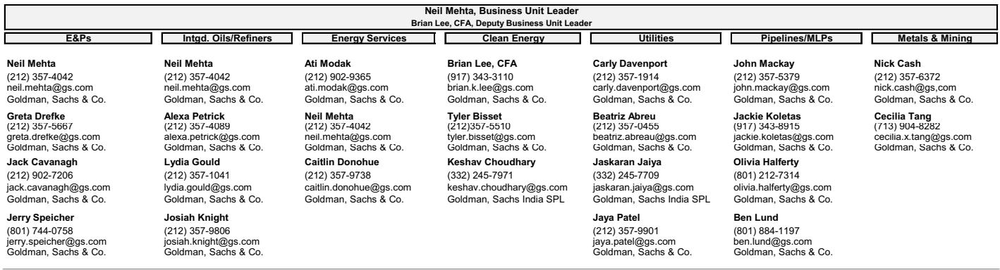
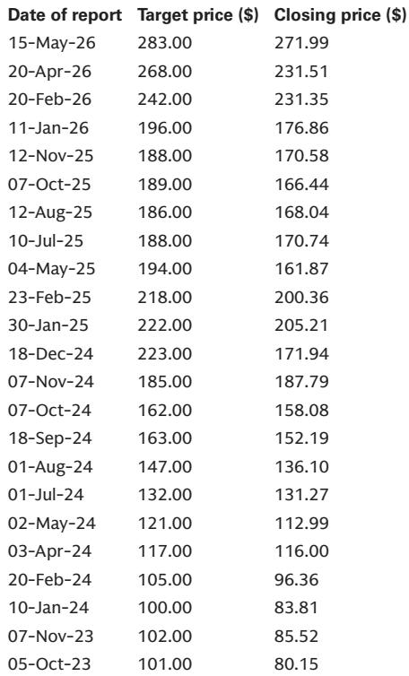

# 市场真正低估的不是需求，而是供给侧的再定价

这份来自某外资投行的综合研报，覆盖了从炼油、能源服务到公用事业和清洁技术的七个细分领域。如果只用一个判断来概括其核心信号，那就是：市场正在经历一轮由供给侧结构性收紧驱动的资产重定价，而投资者的惯性思维仍然停留在需求侧叙事上。

研报的发布时点耐人寻味。2026年二季度财报季前，全球能源与自然资源板块出现了显著的分化：炼油股年内涨幅接近50%，铜矿股在商品价格创新高后持续走强，而天然气上游企业却跑输石油上游企业超过40个百分点。这种分化并非来自需求端的突然变化，而是供给端的结构性变量在加速显现。

报告中最值得关注的新信号，并不是某个具体的价格预测，而是分析师团队在七个子行业中不约而同地指向了同一个逻辑链条：供给约束正在从“周期性因素”演变为“结构性特征”，那些能够将规模、技术和地理优势转化为议价权的企业，正在获得持续的定价溢价。

换句话说，过去三年市场习惯了用需求弹性来预测资源股，但接下来的核心变量可能是供给刚性的持续时间和深度。这不是一个短期交易信号，而是一个可能持续数个季度的资产定价框架转变。

以下，我们从研报中提炼出五个关键洞察，每一个都指向同一个主判断：供给侧的结构性再定价，才是当前最被低估的投资主题。

## 1. 炼油资产的超额收益背后，是供给侧的“三重收紧”而非需求复苏

炼油股年内近50%的涨幅，很容易被市场解读为“需求强劲”的信号。但研报给出的逻辑框架完全不同：分析师强调的核心驱动力来自供给端的三重收紧——长期供需基本面偏紧、库存大幅下降、以及盈利预测的持续上修。

这意味着，即便需求增速放缓，只要供给约束不解除，炼油利润就能维持高位。研报特别指出，在当前“更高更久”的裂解价差环境下，选股标准已经从“谁增长快”转向了“谁有规模、执行力和资本回报纪律”。那些拥有优质资产组合、位于墨西哥湾沿岸、且具备强劲资产负债表的公司，正在成为结构性受益者。

这里的关键洞察是：市场对炼油股的定价，可能仍然低估了供给约束的持续性。研报虽然给出了具体的看多标的，但并没有完全回答一个关键问题——如果全球炼油产能的退出速度因监管和ESG压力而进一步加快，当前的估值是否还有上行空间？这个问题，留给了读者自己去验证。

## 2. 海上油气服务的复苏，本质上是“地缘风险溢价”正在转化为资本开支

能源服务板块的看多逻辑，同样来自供给侧而非需求侧。研报提到，中东地区的持续扰动正在推动市场寻求石油生产的多元化，这直接驱动了海上钻井平台的新增和重启。

分析师预计，2026到2027年海上钻井平台数量将同比增长5%。但真正值得关注的不是这个数字本身，而是背后的逻辑转换：过去几年，海上油气项目因成本高、周期长而被资本抛弃，但当地缘风险成为常态时，这些项目的“安全溢价”开始被重新定价。

研报特别强调，非洲、拉丁美洲和亚洲地区的海上活动增量，将为那些拥有复杂钻井技术的服务商带来盈利弹性。这意味着一家公司的价值不再仅仅取决于其服务价格，更取决于其技术壁垒和地理布局能否转化为议价能力。

但这里有一个尚未被充分讨论的问题：海上项目的资本开支周期通常长达数年，当前的市场定价是否已经充分反映了2027年之后的盈利潜力？研报没有给出明确答案，这恰恰是投资者需要自行研判的空间。

## 3. 天然气上游的困境，是“供给过剩预期”压倒了“需求增长叙事”

天然气上游股今年跑输石油股42个百分点，这看似是一个需求端的故事——市场担忧2026-2027年北美天然气供给过剩。但研报揭示了一个更深层的矛盾：尽管电力需求和LNG出口正在加速增长，但供给端的增长预期更快。

具体来看，二叠纪盆地新增管道运力将在2026年下半年开始释放，同时海恩斯维尔地区的钻机数量今年已增加13台。这意味着，即便需求增长，供给的释放速度可能在短期内超过需求吸收能力。

研报中提到的“对冲-楔形”风险管理策略，本质上是对这种供给过剩预期的一种对冲工具。那些能够通过长期合约锁定价格、同时保留上行弹性的公司，正在获得市场的重新定价。

但这里有一个值得追问的伏笔：如果AI数据中心的电力需求超预期增长，或者LNG出口设施的投产进度加快，当前的供给过剩预期是否会被快速修正？研报没有展开这一情景分析，但它的逻辑框架已经为这种可能性留出了空间。

## 4. 二叠纪管道的瓶颈解除，正在重塑中游资产的增长曲线

中游板块的讨论，是研报中供给逻辑最清晰的案例之一。二叠纪盆地天然气管道运力预计到2027年将增加50亿立方英尺/日，这直接解锁了被压抑的天然气产量。

但分析师强调了一个容易被忽视的二级效应：天然气产量的增长将带动天然气液体（NGL）产量的同步上升，而当前二叠纪的NGL管道运力已经接近饱和。这意味着，那些拥有新NGL管道运力、或者面临合同到期的中游公司，将受益于供需关系的趋紧。

研报对某中游公司的预测显示，2026-2027年EBITDA增速分别为17%和9%，与市场共识基本一致。但分析师暗示，如果2026年下半年天然气流量恢复速度超出预期，当前的保守预测可能存在显著的上修空间。

这里的关键判断是：市场可能低估了中游资产的“二阶增长”——即管道瓶颈解除后，产量增长对NGL和天然气处理环节的传导效应。这一逻辑尚未被充分定价。

## 5. 公用事业和清洁技术的机会，藏在“负荷增长”与“技术迭代”的交汇点

公用事业板块近期因利率上升和风险偏好转向科技股而承压，但研报指出，大型监管公用事业公司正在迎来结构性催化剂：大型负荷电价申报、核电站延寿、以及数据中心的电力需求。

特别值得注意的是，分析师在参观某公用事业公司的核电站后，强调了75兆瓦的机组增容潜力和换料周期从18个月延长至24个月的计划。这些看似微小的技术改进，实际上意味着在不新建核电机组的情况下，现有资产可以产生更多的可调度电力。

清洁技术方面，固态变压器（SST）的主题正在从概念走向落地。研报指出，随着试点部署的推进和客户反馈的积累，市场开始有能力将SST的收入潜力纳入2028年的财务预测中。而下一层衍生机会，可能来自为AI数据中心提供电池储能解决方案的公司。

但这里有一个悬而未决的问题：SST技术的商业化时间表仍然存在不确定性，投资者如何区分“真正的技术领先者”和“概念炒作”？研报提到了几家公司的试点进展，但并未提供一套完整的评估框架。这正是读者需要自己深入研究的领域。

---

以上五个洞察，共同指向了一个核心判断：当前能源与自然资源板块的资产定价，正在从“需求驱动”转向“供给约束驱动”。那些能够将规模、技术和地理优势转化为定价权的企业，正在获得持续的估值溢价。

但这份研报并非没有留下未解问题。以下几个关键假设，仍有待时间和数据的验证：

第一，炼油利润的“更高更久”能否持续到2027年？如果全球衰退风险上升，需求端的下行可能重新成为主导变量。

第二，海上油气服务的资本开支周期，是否会被新能源政策或ESG压力打断？当前的市场定价是否已经充分反映了政策风险？

第三，天然气供给过剩的预期，是否会在AI电力需求超预期时被快速修正？这一情景的触发条件和时间窗口尚未被明确讨论。

第四，公用事业公司的核电站增容和延寿计划，能否在监管审批和成本控制方面顺利推进？任何延误都可能影响盈利预测的兑现。

这些问题，正是研报没有完全展开、但值得深入探讨的方向。如果你对这些未解问题感兴趣，或者希望看到完整的原始图表和数据分析，欢迎来我们的知识星球微信群里继续讨论。我们会在群内定期分享深度研报的完整解读、图表背后的二阶影响分析，以及跨行业的比较框架。

Personal reading notes and learning share only. Not investment advice.

