# HONG KONG REAL ESTATE

# Assessing China's tighter capital controls. Analyze demand drivers, exposure and earnings sensitivity

Following the release of new directives by the China Securities Regulatory Commission (CSRC) on May 22nd to clamp down on illegal offshore brokerage and investment activities (link), the State Council issued another document on June 1st setting out guidelines on corporate and individuals' overseas investments (link). Some commentators see the broadening of its guidelines to cover not only corporate but also “individual” investors as a signal that the Chinese government may more closely scrutinize individual investors abroad, potentially making it more difficult for mainland Chinese to purchase properties in Hong Kong. In this report, we address such concerns by analyzing the population/immigration trends and recent sales transaction data to better understand the buyer profiles and housing demand drivers.

# Mainland Chinese have become a major source of buyers. They tend to prefer brand-new over second-hand units.

As a recap, Hong Kong had a total of 60k residential units transacted last year together adding up to HK\$517bn property sales, which recovered sharply from \~HK\$390bn in 2022-23 amid the pandemic but still lags behind its prior peak of HK\$712bn in 2021 (Exhibit 1). The momentum has continued into this year with sales up by another +71% yoy to HK\$223bn in 4M26. As discussed in our prior reports (link, link), we attribute the housing market recovery to strong government support, with the removal of all the austerity measures in early 2024 (e.g., buyer, seller stamp duties) and more proactive policies to attract talent and immigrants. The buoyant stock market has also drawn more liquidity and mainland Chinese investors to HK who might have otherwise invested elsewhere in Shanghai, Shenzhen and other mainland Chinese cities. Indeed, per Centraline sale data which capture sale transactions with buyers' last names in mandarin pinyin (n.b. the Centraline 'Mainland Chinese' classification is a proxy based on Mandarin Pinyin names and does not account for residency, meaning the figures include Hong Kong-based Mainland nationals and local residents with pinyin-style names), ML Chinese aggregate housing purchases have more than doubled from HK\$96bn in 2023 to HK\$182bn in 2025 (and tripled from 5.8k to 14.8k units in volume term), representing 35%/25% of Hong Kong's total property sales and volume last year (up from 25%/14% in 2023). The data also suggest that ML Chinese buyers tend to prefer brand-new units, accounting for 63% or HK\$114bn of their purchases in value terms. Over half of HK's

# Simon Cheung, CFA

+852-2978-6102

simon.cheung@gs.com

GS (Asia) L.L.C.

# Alpha Wang

+852-2978-1984 | alpha.wang@gs.com

GS (Asia) L.L.C.

# Zhaoheng Chen

+852-2978-0901

zhaoheng.chen@gs.com

GS (Asia) L.L.C.

# Leah Pan

+852-2978-6972 | leah.pan@gs.com

GS (Asia) L.L.C.

residential primary sales were associated with these mainland Chinese buyers with pinyin last names.

Exhibit 1: HK private residential housing transaction value   
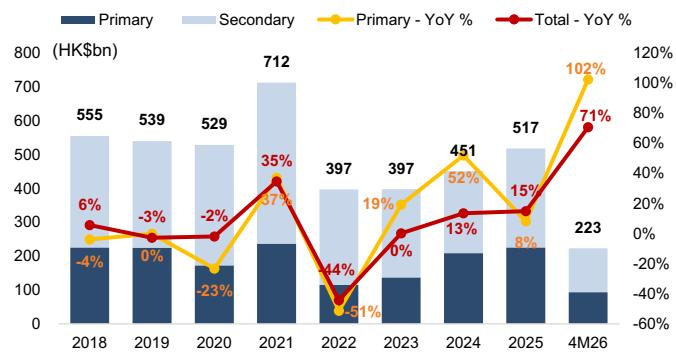

bar_line

| Year | Primary (HK$bn) | Secondary (HK$bn) | Primary - YoY % (%) | Total - YoY % (%) |
| :--- | :--- | :--- | :--- | :--- |
| 2018 | 230 | 555 | -4 | 6 |
| 2019 | 230 | 539 | -3 | -3 |
| 2020 | 170 | 529 | -23 | -2 |
| 2021 | 240 | 712 | 37 | 35 |
| 2022 | 80 | 397 | -51 | -44 |
| 2023 | 140 | 397 | 19 | 0 |
| 2024 | 210 | 451 | 52 | 13 |
| 2025 | 230 | 517 | 8 | 15 |
| 4M26 | 90 | 223 | 102 | 71 |

Source: Centraline

Exhibit 2: HK private residential housing transaction volume   
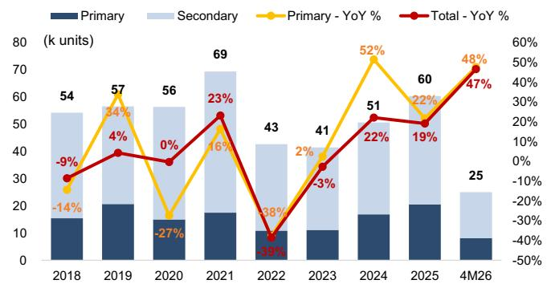

bar_line

| Year | Primary (k units) | Secondary (k units) | Primary - YoY (%) | Total - YoY (%) |
| :--- | :--- | :--- | :--- | :--- |
| 2018 | 15 | 54 | -14 | -9 |
| 2019 | 20 | 57 | 34 | 4 |
| 2020 | 16 | 56 | -27 | 0 |
| 2021 | 18 | 69 | 16 | 23 |
| 2022 | 10 | 43 | -38 | -49 |
| 2023 | 11 | 41 | 2 | -3 |
| 2024 | 17 | 51 | 52 | 22 |
| 2025 | 20 | 60 | 22 | 19 |
| 4M26 | 8 | 25 | 48 | 47 |

Source: Centraline

Exhibit 3: HK private residential housing transaction value by Mainland Chinese buyers   
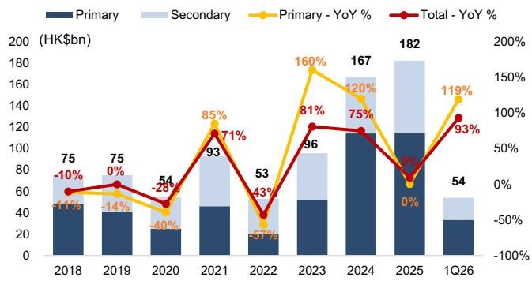

bar_line

| Year | Primary (HK$bn) | Secondary (HK$bn) | Primary - YoY (%) | Total - YoY (%) |
| :--- | :--- | :--- | :--- | :--- |
| 2018 | 75 | 11 | -10 | -11 |
| 2019 | 75 | 14 | 0 | 0 |
| 2020 | 23 | 40 | -28 | -54 |
| 2021 | 46 | 93 | 85 | 71 |
| 2022 | 18 | 53 | -43 | -57 |
| 2023 | 52 | 96 | 160 | 81 |
| 2024 | 114 | 167 | 120 | 75 |
| 2025 | 114 | 182 | 8 | -8 |
| 1Q26 | 34 | 54 | 119 | 93 |

The ‘Mainland Chinese’ classification is a proxy based on Mandarin Pinyin names. It does not account for residency, meaning the figures include Hong Kong-based Mainland nationals and local residents with pinyin-style names.

Exhibit 4: % of mainland buyers by transaction value   
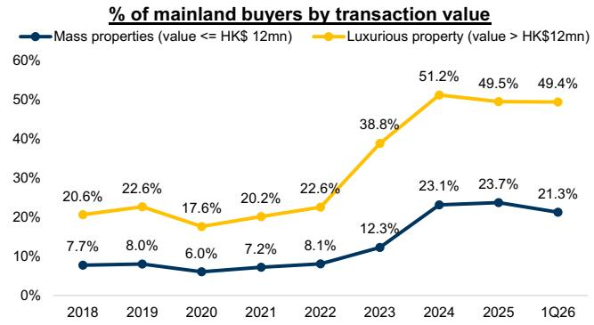

line

| Year | Mass properties (value <= HK$ 12mn) | Luxurious property (value > HK$12mn) |
|------|-------------------------------------|--------------------------------------|
| 2018 | 7.7%                                | 20.6%                                |
| 2019 | 8.0%                                | 22.6%                                |
| 2020 | 6.0%                                | 17.6%                                |
| 2021 | 7.2%                                | 20.2%                                |
| 2022 | 8.1%                                | 22.6%                                |
| 2023 | 12.3%                               | 38.8%                                |
| 2024 | 23.1%                               | 51.2%                                |
| 2025 | 23.7%                               | 49.5%                                |
| 1Q26 | 21.3%                               | 49.4%                                |

The ‘Mainland Chinese’ classification is a proxy based on Mandarin Pinyin names. It does not account for residency, meaning the figures include Hong Kong-based Mainland nationals and local residents with pinyin-style names.   
Source: Centraline   
Source: Centraline

Exhibit 5: HK private residential housing transaction value by Mainland Chinese buyers (breakdown by unit price)   
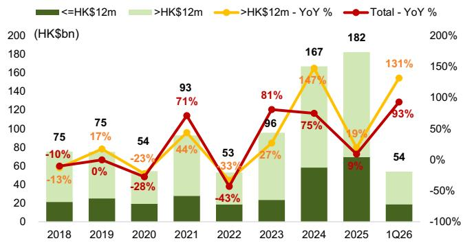

bar_line

| Year | <=HK$12m (HK$bn) | >HK$12m (HK$bn) | Total - YoY % (%) |
| :--- | :--- | :--- | :--- |
| 2018 | 20 | 75 | -10 |
| 2019 | 22 | 75 | 0 |
| 2020 | 18 | 54 | -23 |
| 2021 | 26 | 93 | 71 |
| 2022 | 18 | 53 | -43 |
| 2023 | 22 | 96 | 81 |
| 2024 | 58 | 167 | 75 |
| 2025 | 70 | 182 | 9 |
| 1Q26 | 18 | 54 | 93 |

The ‘Mainland Chinese’ classification is a proxy based on Mandarin Pinyin names. It does not account for residency, meaning the figures include Hong Kong-based Mainland nationals and local residents with pinyin-style names.

Source: Centraline

Exhibit 7: % of HK private housing transactions with short holding periods   
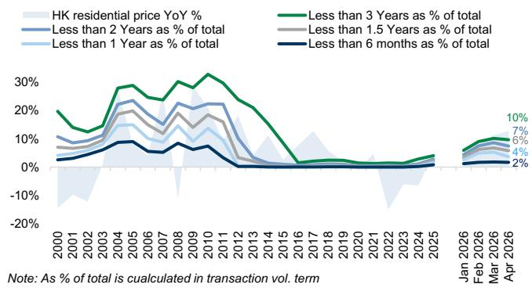

Source: Centraline

Exhibit 6: HK private residential housing transaction volume by Mainland Chinese buyers (breakdown by unit price)   
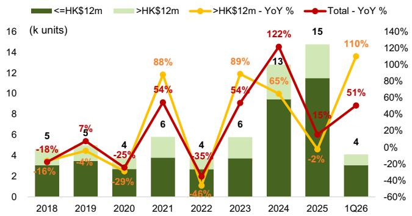

bar_line

| Year | <=HK$12m (k units) | >HK$12m (k units) | Total - YoY % (%) |
| :--- | :--- | :--- | :--- |
| 2018 | 5 | 4 | -16 |
| 2019 | 4 | 3 | 7 |
| 2020 | 4 | 2 | -25 |
| 2021 | 6 | 4 | 54 |
| 2022 | 4 | 1 | -46 |
| 2023 | 6 | 4 | 54 |
| 2024 | 13 | 6 | 122 |
| 2025 | 15 | 5 | -2 |
| 1Q26 | 4 | 1 | 51 |

The ‘Mainland Chinese’ classification is a proxy based on Mandarin Pinyin names. It does not account for residency, meaning the figures include Hong Kong-based Mainland nationals and local residents with pinyin-style names.

Source: Centraline

Exhibit 8: % of HK private housing transactions with holding period of less than 3 years (4M26)   
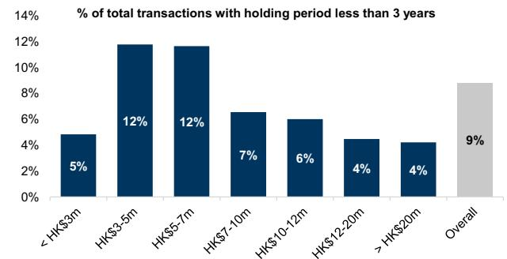

bar

% of total transactions with holding period less than 3 years
| Category | % of total transactions with holding period less than 3 years (%) |
| :--- | :--- |
| <HK$3m | 5 |
| HK$3-5m | 12 |
| HK$5-7m | 12 |
| HK$7-10m | 7 |
| HK$10-12m | 6 |
| HK$12-20m | 4 |
| >HK$20m | 4 |
| Overall | 9 |

Note: As % of total is cualculated in transaction vol. term

Source: Centraline

# Maintain our view of multi-year HK housing market upcycles

While we take no view on any outcome, the directive itself has not specified any new additional measures to tighten capital flow to HK. We believe the potential impact, if any, would be on bigger-ticket sizes transactions. In the past, we observed that when control tightened (e.g., in 2016), alternative/new channels to transmit cash to HK emerged which somewhat mitigated the impact. As shown in Exhibit 9, there are a few legitimate ways for mainland Chinese residents to bring or transfer cash outside of mainland China: (1) an annual limit of US\$50k or Rmb340k individually set by the State Administration of Foreign Exchange (SAFE); (2) Rmb20k each trip they can bring abroad when traveling; (3) Rmb10k cash withdrawal via ATM per Unioncard pay each day, with a cap of Rmb100k per annum; (4) up to Rmb3mn to be remitted to HK for qualified residents in the Greater Bay area under the Cross-boundary Wealth Management Connect Scheme launched since Sept 2021 (link). Adding them all up would translate to no more than Rmb4mn capital one can transmit or bring offshore annually (or up to Rmb8mn for a two-person household). If we assume the mainland Chinese buyers take on typical 70% mortgages and have to make 30% initial downpayments, the value of the properties they purchase would likely be below Rmb13mn for individual buyer (or Rmb26mn for a household). Indeed, out of the 14.8k housing units purchased by mainland Chinese last year, 78% or 11.5k were priced below HK\$12mn (Exhibit 6).

Nevertheless, it is too early to assess, but given the legitimate channels to transferring in cash for property purchases, vulnerability may be in property worth well beyond these prices. Meanwhile, we also see other reasons to believe the current uptrend would unlikely be derailed.

# ■ Most home purchases by Chinese buyers are driven by pent-up demand.

Investment demand still a minority - As discussed in our sector reports (May 19, Feb 18), the key driver for our call of a “multi-year upcycle” for the HK housing market is demand and supply imbalance. On the supply side, after several years of weak market sentiment, land sales (i.e., government land sales, MTR site tenders, redevelopment etc) are still tracking behind government’s FY26 target of 22k, suggesting ongoing difficulty for housing supply to catch up with its annual target of 26-34k units. On the demand side, the launch of various new visa schemes (i.e., Top Talent Pass Scheme introduced in 2022 for those earning more than HK\$2.5mn per annum or graduated from the world’s top 100 universities) has attracted many applications boosting the total number of visas approved to 120-140k annually in 2023-25 (vs. 60-70k before the pandemic) (Exhibit 11). Since the social unrest in 2018, 660k visa applications have cumulatively been approved by the government, of which media (link) had previously reported that roughly half or \~300-400k currently stay in HK (vs. 60-70k in 2018). If we assume half of these additional 240-330k individuals or households decided to purchase properties in Hong Kong, it would translate to 120-160k units of incremental housing demand. With merely 52k mainland Chinese buyer transactions during this period, per Centraline, we could infer that (1) the majority of the 52k units sold in recent years have been driven by end-user demand rather than for investment purposes; (2) the backlog remains quite significant and supportive of volume trend ahead. To put the numbers into perspective, in sales/volume terms, 35%/25% of HK residential transactions could be attributed to mainland Chinese buyers as mentioned earlier. If we assume say \~20% were investment demand, based on developers’ observations, those more vulnerable or subject to closer capital control or scrutiny would represent only \~7%/5%.

# Positive rental growth outlook with low vacancy. Rental yield of HK residential properties still compelling vs. top-tier PRC cities and other Asia gateway cities –

After the $\sim 20\%$ cumulative increase over the past 3 years, the slower rental growth of $+1.4\%$ ytd suggests that certain demand has shifted from renting to buying. Even though housing prices have appreciated by $\sim 10\%$ ytd, home owners in HK could still enjoy a mild positive carry with average rental yield of $3.3\%$ (for Class B units) vs.

3.25% mortgage rate. This still looks more favorable vs. other top-tier PRC cities and Asia gateway cities, i.e., 2.9%/2%/1.8%/1.7% rental yield in

Singapore/Beijing/Shenzhen/Shanghai respectively. We believe the decision or choice to buy vs. rent will continue to affect near-term property sales momentum in the quarters ahead. On a positive note, the fundamentals remain positive as vacancy is quite low at 4.3% at end-FY25 (vs. historical average \~5%), while housing supply is tight (i.e., 16k unsold inventories plus 12k new units scheduled for launches). As far as interest rates are concerned, our macro team still expects 2 more 25bps Fed fund rate cuts in Dec-26 and Mar-27 respectively (May 11), but rising inflation raises concern of a potential delay or reversal. Even in a US rate hike scenario, just as HKMA did not follow the US Fed to cut its rates previously, it may not necessarily need to follow hiking its rate if the banking system still has abundant liquidity as they do now.

# ■ Government policies on immigration policies, property purchases remain supportive. Past cycles suggest CNY devaluation is the key risk to watch for -

Although closer scrutiny and tighter capital control could affect market liquidity and potentially housing purchases esp. the luxury ones as mentioned above, we believe government policies in other housing-related areas remain broadly supportive, e.g., visa/immigration policies, Northern Metroplis development. Last year, the Financial Secretary of Hong Kong, Paul Chan, had reportedly held discussions with the mainland Chinese government to explore appropriate relaxations on capital transfer restrictions for mainland Chinese workers and immigrants settling in HK who want to purchase HK properties (link). From past experience, tightened liquidity and capital control are usually associated with sharp CNY depreciation. This time around, CNY actually appreciated against USD by 6% over the past year.

# Developer exposure to high-end, luxury units. Earnings and NAV sensitivity

As discussed above, we believe closer scrutiny and tighter capital control, especially on any alternative channels that may emerge, could affect (1) sell-through of the luxury units; (2) mainland Chinese investors who are not genuine end-users and do not necessarily plan to settle in HK - using our assumptions explained above would imply that mainland Chinese investment demand would account for no more than 10% of HK property sales. Among the developers we cover, we note that Kerry Properties, CKA and Henderson have a larger proportion of their saleable resources (remaining stocks + projects scheduled for launch this year) that are considered luxury priced at HK\$25k psf or above, i.e., 41%, 44%, 32% vs. SHKP 22% (Exhibit 15).

As a recap, we forecast +15%/+7%/+4% HK housing prices increase in 2026/27/28E. In a bear case scenario where we assume -5%/-10% downside to our housing prices/volume assumptions adding up to -15% cut to contracted sales forecasts, we could see on average -2-9% earnings impact for our covered property developers in FY26-28E. Our FY26E NAV estimates could be cut by -3-9% with NWD and Kerry Properties the most sensitive due to higher financial leverage (Exhibit 17). Exhibit 20 lays out detailed NAV breakdown for all our covered HK property names. Though not directly comparable, we note that Macau casino stocks tended to pull back fairly sharply in the past whenever there has been newsflow related to tighter liquidity or capital controls (Exhibit 18). Compared to HK properties, the Macau casino sector has much greater exposure to China's grey-area liquidity (i.e., 20-50% over the cycles), vs. <10% mainland Chinese investors for HK properties as mentioned above. We see the recent correction as a continued good opportunity to accumulate our Buy-rated HK property developer names: Henderson Land (on CL), SHKP and Sino Land.

Exhibit 9: Chinese government restrictions on cross-border capital outflow 

<table><tr><td>Category</td><td>Restriction</td></tr><tr><td>Individual SAFE quota</td><td>US$50k per calendar year</td></tr><tr><td>Individual outbound travel</td><td>The equivalent of US$5k for foreign currency, or Rmb20k per trip</td></tr><tr><td>Cash withdrawal using debit/credit cards issued in mainland China</td><td>Rmb100k per annum per card, or Rmb10k per day per card</td></tr><tr><td>Cross-boundary Wealth Management Connect Scheme (for eligible GBA residents only)</td><td>Rmb3mn per personEligibility: at least 2 years of investment experience, and - outstanding household net financial asset of no less than Rmb1mn, or - outstanding household financial asset of no less than Rmb2mn, or - avg. personal annual income of no less than Rmb400k</td></tr></table>

Source: GOV.CN, SAFE, HKMA

Exhibit 10: Summary of different visa schemes in HK 

<table><tr><td>Visa Program</td><td>Target Applicant</td><td>Key Eligibility Criteria</td><td>Job Offer Required?</td><td>Remarks</td></tr><tr><td rowspan="3">Top Talent Pass Scheme</td><td>Category A - High-income earners</td><td>Annual income of HK$2.5mn+ in the year preceding application.</td><td>No</td><td rowspan="3">Newly introduced in 2022</td></tr><tr><td>Category B - Experienced graduates</td><td>Degree from a top-100 university + 3 years of work experience in the last 5 years.</td><td>No</td></tr><tr><td>Category C - Recent graduates</td><td>Degree from a top-100 university within the last 5 years; &lt;3 years of experience.</td><td>No</td></tr><tr><td>New Capital Investment Entrant Scheme</td><td>High-net-worth investors</td><td>Net assets of HK$30mn+; investment of HK$30mn in permissible HK assets (incl. up to HK$10mn in HK housing)</td><td>No</td><td>Newly introduced in 2024</td></tr><tr><td>Quality Migrant Admission Scheme</td><td>Highly skilled talent</td><td>Points-based (General or Achievement); minimum 80/225 points for General Test.</td><td>No</td><td></td></tr><tr><td>General Employment Policy</td><td>Non-Mainland professionals</td><td>Relevant degree/skills; job offer with market-rate salary; role not easily filled locally.</td><td>Yes</td><td></td></tr><tr><td>Admission Scheme for Mainland Talents and Professionals</td><td>Mainland professionals</td><td>PRC nationals with specialized skills; job offer with market-rate salary.</td><td>Yes</td><td></td></tr><tr><td>Immigration Arrangements for Non-local Graduates</td><td>Non-local graduates</td><td>Obtained a degree from a Hong Kong university (or GBA campus of HK university).</td><td>No</td><td></td></tr><tr><td>Technology Talent Admission Scheme</td><td>Technology talent</td><td>Principally conduct R&amp;D in a technology area; degree in STEM from a top-100 university for STEM-related subjects</td><td>Yes</td><td></td></tr></table>

Source: Immigration Department

Exhibit 11: No. of applications approved under different HK visa programs   
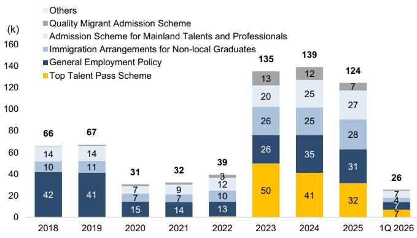

bar_stacked

| Year     | Top Talent Pass Scheme | General Employment Policy | Immigration Arrangements for Non-local Graduates | Admission Scheme for Mainland Talents and Professionals | Quality Migrant Admission Scheme | Others |
| -------- | ---------------------- | -------------------------- | ----------------------------------------------- | -------------------------------------------------------- | --------------------------------- | ------ |
| 2018     | 42                     | 42                         | 10                                              | 14                                                     | 14                                | 66     |
| 2019     | 41                     | 41                         | 11                                              | 14                                                     | 14                                | 67     |
| 2020     | 15                     | 15                         | 7                                               | 7                                                      | 7                                 | 31     |
| 2021     | 14                     | 14                         | 9                                               | 7                                                      | 9                                 | 32     |
| 2022     | 13                     | 13                         | 10                                              | 12                                                     | 3                                 | 39     |
| 2023     | 50                     | 50                         | 26                                              | 20                                                     | 13                                | 135    |
| 2024     | 41                     | 41                         | 25                                              | 25                                                     | 12                                | 139    |
| 2025     | 32                     | 32                         | 28                                              | 27                                                     | 7                                 | 124    |
| 1Q 2026  | 7                      | 7                          | 4                                              | 4                                                      | 7                                 | 26     |

Source: HK Immigration Department

Exhibit 12: HK housing price trend   
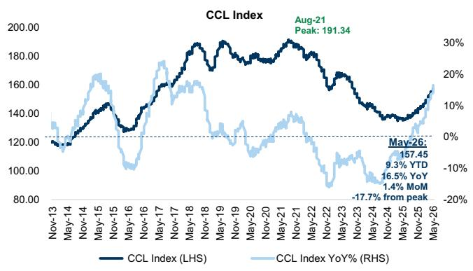

line

| Date     | CCL Index (LHS) | CCL Index YoY (%) |
|----------|-----------------|-------------------|
| Aug-21   | 191.34          |                   |
| May-26   | 157.45          | -17.7% from peak   |
| May-26   |                 | 9.3% YTD          |
| May-26   |                 | 16.5% YoY         |
| May-26   |                 | 1.4% MoM          |

Source: Centraline

Exhibit 13: Net rental yield (after deducting mortgage rate) stayed positive territory since Mar-25   
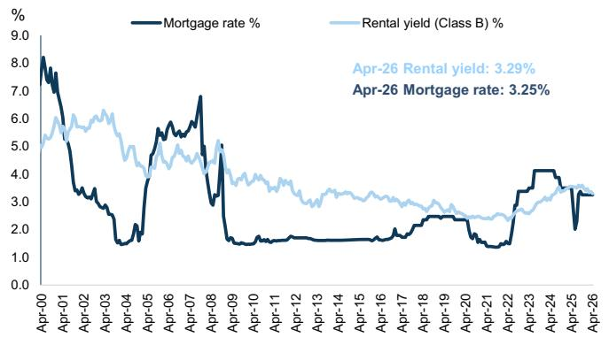

line

| Date   | Mortgage rate % | Rental yield (Class B) % |
|--------|-----------------|--------------------------|
| Apr-26 | 3.25            | 3.29%                    |

Exhibit 14: Major developers market share by contracted sales (%)   
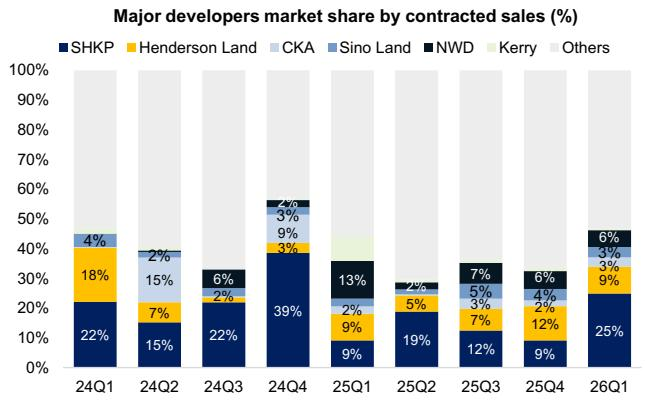

bar_stacked

Major developers market share by contracted sales (%)
| Quarter | SHKP (%) | Henderson Land (%) | CKA (%) | Sino Land (%) | NWD (%) | Kerry (%) | Others (%) |
| :--- | :--- | :--- | :--- | :--- | :--- | :--- | :--- |
| 24Q1 | 22 | 18 | 4 | 0 | 0 | 0 | 0 |
| 24Q2 | 15 | 7 | 15 | 2 | 0 | 0 | 0 |
| 24Q3 | 22 | 0 | 2 | 0 | 6 | 0 | 0 |
| 24Q4 | 39 | 3 | 9 | 3 | 4 | 0 | 0 |
| 25Q1 | 9 | 9 | 2 | 0 | 13 | 5 | 0 |
| 25Q2 | 19 | 5 | 0 | 0 | 2 | 0 | 0 |
| 25Q3 | 12 | 7 | 3 | 5 | 7 | 0 | 0 |
| 25Q4 | 9 | 12 | 4 | 4 | 6 | 0 | 0 |
| 26Q1 | 25 | 9 | 3 | 3 | 6 | 0 | 0 |

Figures are based on preliminary agreement signed date.   
Source: Centraline, GS Global Investment Research

Exhibit 15: Saleable resources (as of end 1Q26) breakdown by developers and price bands   
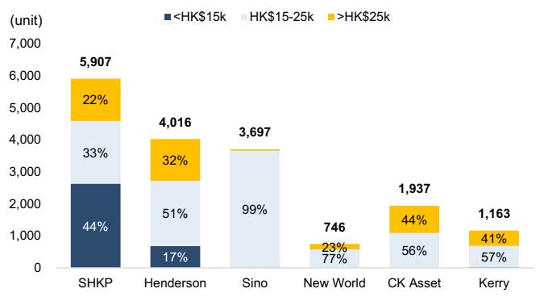

bar_stacked

| Category | <HK$15k (%) | HK$15-25k (%) | >HK$25k (%) |
| :--- | :--- | :--- | :--- |
| SHKP | 44 | 33 | 22 |
| Henderson | 17 | 51 | 32 |
| Sino | 0 | 99 | 0 |
| New World | 0 | 77 | 23 |
| CK Asset | 0 | 56 | 44 |
| Kerry | 0 | 57 | 41 |
The total values are labeled as 5,907 (SHKP), 4,016 (Henderson), 3,697 (Sino), 746 (New World), and 1,937 (CK Asset). The values for each category are explicitly labeled on the bars.

Source: Centraline, GS Global Investment Research

Exhibit 16: Remaining stocks (as of end 1Q26) breakdown by developers and price bands   
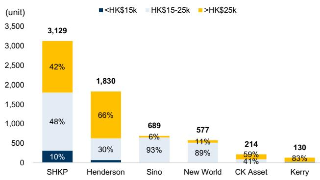

bar_stacked

| Category | <HK$15k (%) | HK$15-25k (%) | >HK$25k (%) |
| :--- | :--- | :--- | :--- |
| SHKP | 10 | 48 | 42 |
| Henderson | 30 | 66 | 0 |
| Sino | 0 | 93 | 6 |
| New World | 0 | 89 | 11 |
| CK Asset | 0 | 0 | 59 |
| Kerry | 0 | 0 | 83 |
The chart displays a total of 3,129 units with each bar segmented to show the percentage contribution of each category to the total. The values for the bars are explicitly labeled on the chart.

Source: Centraline, GS Global Investment Research

Exhibit 17: HK developers earnings and NAV sensitivity to HK resi price and volume assumptions 

<table><tr><td colspan="5">Base case</td><td colspan="4">Bear caseHK resi price -5%, volume -10% vs.base case over FY26-28E</td><td colspan="3">vs. Base case</td></tr><tr><td></td><td>FY26E</td><td>FY27E</td><td>FY28E</td><td>FY25-28ECAGR</td><td>FY26E</td><td>FY27E</td><td>FY28E</td><td>FY25-28ECAGR</td><td>FY26E</td><td>FY27E</td><td>FY28E</td></tr><tr><td>HK resi price yoy</td><td>15%</td><td>7%</td><td>4%</td><td></td><td>14%</td><td>5%</td><td>2%</td><td></td><td>-1ppt</td><td>-2ppt</td><td>-2ppt</td></tr><tr><td colspan="12">Underlying earnings (HK$ mn)</td></tr><tr><td>SHKP</td><td>23,921</td><td>27,035</td><td>27,668</td><td>8%</td><td>23,468</td><td>25,932</td><td>25,280</td><td>5%</td><td>-2%</td><td>-4%</td><td>-9%</td></tr><tr><td>NWD</td><td>607</td><td>1,569</td><td>2,069</td><td>n.m.</td><td>535</td><td>1,416</td><td>1,401</td><td>n.m.</td><td>-12%</td><td>-10%</td><td>-32%</td></tr><tr><td>Sino</td><td>5,148</td><td>5,328</td><td>5,724</td><td>4%</td><td>5,025</td><td>5,120</td><td>5,356</td><td>2%</td><td>-2%</td><td>-4%</td><td>-6%</td></tr><tr><td>Henderson</td><td>7,936</td><td>10,246</td><td>11,847</td><td>25%</td><td>7,652</td><td>9,504</td><td>10,347</td><td>20%</td><td>-4%</td><td>-7%</td><td>-13%</td></tr><tr><td>CKA</td><td>12,867</td><td>13,936</td><td>17,174</td><td>13%</td><td>12,675</td><td>13,585</td><td>15,974</td><td>10%</td><td>-1%</td><td>-3%</td><td>-7%</td></tr><tr><td>Kerry</td><td>2,026</td><td>4,498</td><td>5,542</td><td>40%</td><td>1,982</td><td>4,354</td><td>5,172</td><td>37%</td><td>-2%</td><td>-3%</td><td>-7%</td></tr><tr><td>Coverage total</td><td>52,504</td><td>62,611</td><td>70,025</td><td>15%</td><td>51,337</td><td>59,911</td><td>63,530</td><td>11%</td><td>-2%</td><td>-4%</td><td>-9%</td></tr><tr><td colspan="12">P/E</td></tr><tr><td>SHKP</td><td>15.0</td><td>13.3</td><td>13.0</td><td></td><td>15.3</td><td>13.9</td><td>14.2</td><td></td><td></td><td></td><td></td></tr><tr><td>NWD</td><td>n.m.</td><td>12.6</td><td>9.6</td><td></td><td>n.m.</td><td>14.0</td><td>14.2</td><td></td><td></td><td></td><td></td></tr><tr><td>Sino</td><td>21.5</td><td>22.0</td><td>21.7</td><td></td><td>22.0</td><td>22.9</td><td>23.2</td><td></td><td></td><td></td><td></td></tr><tr><td>Henderson</td><td>18.2</td><td>14.1</td><td>12.2</td><td></td><td>18.9</td><td>15.2</td><td>14.0</td><td></td><td></td><td></td><td></td></tr><tr><td>CKA</td><td>12.7</td><td>11.8</td><td>9.5</td><td></td><td>12.9</td><td>12.1</td><td>10.3</td><td></td><td></td><td></td><td></td></tr><tr><td>Kerry</td><td>14.5</td><td>6.5</td><td>5.3</td><td></td><td>14.8</td><td>6.8</td><td>5.7</td><td></td><td></td><td></td><td></td></tr><tr><td>Coverage avg.</td><td>15.8</td><td>13.3</td><td>12.0</td><td></td><td>16.1</td><td>13.9</td><td>13.2</td><td></td><td></td><td></td><td></td></tr><tr><td>NAV (HK$/share)</td><td colspan="4">NAV discount %</td><td colspan="4">NAV discount %</td><td></td><td></td><td></td></tr><tr><td>SHKP (FY27E)</td><td>242.5</td><td>-49%</td><td></td><td></td><td>225.5</td><td>-45%</td><td></td><td></td><td>-7%</td><td></td><td></td></tr><tr><td>NWD (FY27E)</td><td>73.3</td><td>-89%</td><td></td><td></td><td>66.8</td><td>-88%</td><td></td><td></td><td>-9%</td><td></td><td></td></tr><tr><td>Sino (FY27E)</td><td>22.2</td><td>-47%</td><td></td><td></td><td>21.5</td><td>-45%</td><td></td><td></td><td>-3%</td><td></td><td></td></tr><tr><td>Henderson</td><td>66.8</td><td>-55%</td><td></td><td></td><td>62.4</td><td>-52%</td><td></td><td></td><td>-7%</td><td></td><td></td></tr><tr><td>CKA</td><td>110.1</td><td>-57%</td><td></td><td></td><td>105.2</td><td>-56%</td><td></td><td></td><td>-4%</td><td></td><td></td></tr><tr><td>Kerry</td><td>88.2</td><td>-77%</td><td></td><td></td><td>81.5</td><td>-75%</td><td></td><td></td><td>-8%</td><td></td><td></td></tr></table>

\* SHKP, NWD and Sino's financial years are Jun-end, while others' are Dec-end   
Source: Datastream, Company data, GS Global Investment Research

Exhibit 18: Macau gaming sector historical share price performance against news on tightening cross-border capital flow   
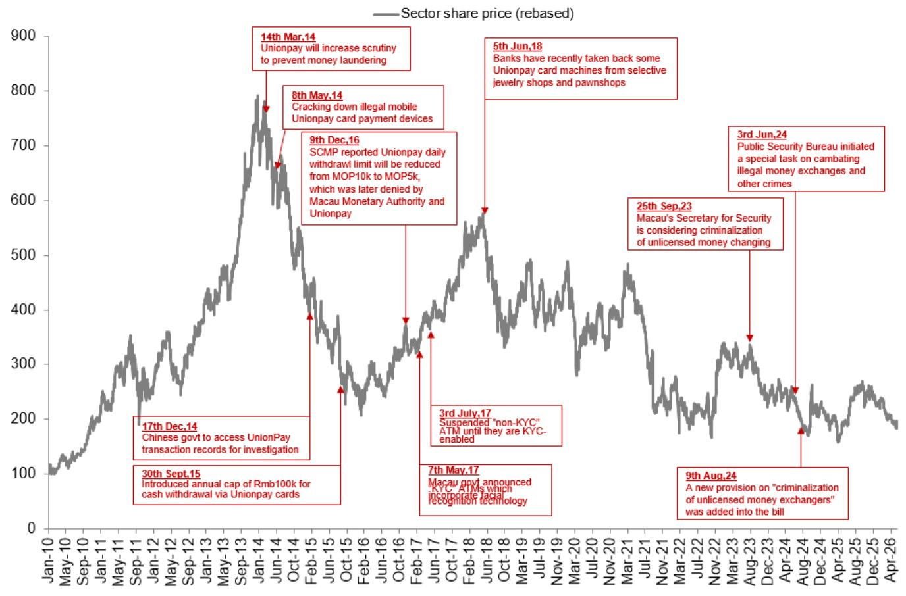

line

| Date       | Event Description                                      | Price |
|------------|-----------------------------------------------------|-------|
| 14 Mar.14  | Unionpay will increase scrutiny to prevent money laundering | ~780  |
| 8 May.14   | Cracking down illegal mobile Unionpay card payment devices | ~650  |
| 9 Dec.16   | SCMP reported Unionpay daily withdrawl limit will be reduced from MOP10k to MOP5k, which was later denied by Macau Monetary Authority and Unionpay | ~380  |
| 5 Jun.18   | Banks have recently taken back some Unionpay card machines from selective jewelry shops and pawnshops | ~550  |
| 3rd July.17 | Suspended "non-KYC" ATM until they are KYC-enabled | ~350  |
| 25 Sep.23  | Macau's Secretary for Security is considering criminalization of unlicensed money changing | ~480  |
| 3rd Jun.24  | Public Security Bureau initiated a special task on cambating illegal money exchanges and other crimes | ~330  |
| 9th Aug.24  | A new provision on "criminalization of unlicensed money exchangers" was added into the bill | ~180  |
| 30 Sept.15  | Introduced annual cap of Rmb100k for cash withdrawal via Unionpay cards | ~200  |

Source: Datastream, GOV.CN

Exhibit 19: HK developers unsold inventory as of 1Q26 and key projects (to be) launched in 2026 

<table><tr><td>Key Developer(s)</td><td>Key projects</td><td>Location</td><td>No. of Units</td><td>Latest average price (HK$ k/s.f.)</td><td>Key Developer(s)</td><td>Key projects</td><td>Location</td><td>No. of Units</td><td>Latest average price (HK$ k/s.f.)</td><td>Total saleable units in 2026</td></tr><tr><td colspan="5">Unsold inventory (units, as of end 1Q26)</td><td colspan="5">Key projects (to be) launched in 2Q-4Q 2026</td><td></td></tr><tr><td rowspan="12">SHKP</td><td>The Yoho Hub Phase B</td><td>Yuen Long</td><td>555</td><td>19.6</td><td rowspan="12">SHKP</td><td>Tung Shing Lei Ph. 1A</td><td>Tuen Mun</td><td>665</td><td>n.a.</td><td rowspan="12"></td></tr><tr><td>Cullinan Sky II</td><td>Kai Tak</td><td>375</td><td>32.9</td><td>Fanling Sheung Shui Town Lot No.279 Ph.1</td><td>Kwu Tung</td><td>645</td><td>n.a.</td></tr><tr><td>Novo Land IIA</td><td>Tuen Mun</td><td>271</td><td>15.1</td><td>1A Ying Ho Road</td><td>Yuen Long</td><td>566</td><td>n.a.</td></tr><tr><td>Victoria Harbour IIB-3</td><td>North Point</td><td>176</td><td>40.6</td><td>13-23 Wang Wo Tsai Street</td><td>Tsuen Wan</td><td>462</td><td>n.a.</td></tr><tr><td>Cullinan Harbour I</td><td>Kai Tak</td><td>172</td><td>44.8</td><td>Siu Lek Yuen Residential Project</td><td>Sha Tin</td><td>300</td><td>n.a.</td></tr><tr><td>The Yoho Hub Phase C</td><td>Yuen Long</td><td>95</td><td>17.2</td><td>Cullinan Harbour Ph. 2B</td><td>Kai Tak</td><td>140</td><td>13.5</td></tr><tr><td>Victoria Harbour IIB-2</td><td>North Point</td><td>93</td><td>45.8</td><td></td><td></td><td></td><td></td></tr><tr><td>Park Vista IIB - Park Yoho Napoli</td><td>Yuen Long</td><td>80</td><td>13.5</td><td></td><td></td><td></td><td></td></tr><tr><td>Wetland Seasons Bay I</td><td>Tin Shui Wai</td><td>78</td><td>14.3</td><td></td><td></td><td></td><td></td></tr><tr><td>Sierra Sea Ph. 2B</td><td>Sai Sha</td><td>17</td><td>13.1</td><td></td><td></td><td></td><td></td></tr><tr><td>Sierra Sea Ph. 2A</td><td>Sai Sha</td><td>16</td><td>12.7</td><td></td><td></td><td></td><td></td></tr><tr><td>Others</td><td></td><td>1,201</td><td></td><td></td><td></td><td></td><td></td></tr><tr><td></td><td></td><td>Sub total</td><td>3,129</td><td></td><td></td><td></td><td>Sub total</td><td>2,778</td><td></td><td>5,907</td></tr><tr><td rowspan="12">Henderson</td><td>The Knightsbridge</td><td>Kai Tak</td><td>307</td><td>32.4</td><td>Henderson</td><td>Chester</td><td>Hung Hom</td><td>241</td><td>20.2</td><td rowspan="12"></td></tr><tr><td>Henley Park</td><td>Wong Tai Sin</td><td>268</td><td>31.0</td><td rowspan="11">attr.</td><td>One Victoria Cove</td><td>Hung Hom</td><td>648</td><td>20.2</td></tr><tr><td>Highwood I</td><td>Hung Hom</td><td>204</td><td>19.1</td><td>Fanling Sheung Shui Town Lot No. 263</td><td>Kwu Tung</td><td>614</td><td>n.a.</td></tr><tr><td>The Henley III</td><td>Kai Tak</td><td>119</td><td>27.3</td><td>Highwood (Phase 2)</td><td>Ma Tau Kok</td><td>415</td><td>22.9</td></tr><tr><td>Baker Circle One I - Baker Circle-Dover</td><td>Hung Hom</td><td>115</td><td>22.6</td><td>18 Man On Street</td><td>Mong Kok</td><td>126</td><td>n.a.</td></tr><tr><td>The Henley I</td><td>Kai Tak</td><td>105</td><td>28.1</td><td>33 Elgin Street</td><td>Central</td><td>93</td><td>n.a.</td></tr><tr><td>The Legacy I</td><td>Mid-Levels</td><td>95</td><td>48.0</td><td>16-20 Temple Street</td><td>Yau Ma Tei</td><td>48</td><td>n.a.</td></tr><tr><td>Woodis</td><td>Wan Chai</td><td>62</td><td>24.3</td><td>29A Lugard Road</td><td>The Peak</td><td>1</td><td>n.a.</td></tr><tr><td>The Henley II</td><td>Kai Tak</td><td>61</td><td>32.2</td><td></td><td></td><td></td><td></td></tr><tr><td>The Harmonie</td><td>Cheung Sha Wan</td><td>59</td><td>19.7</td><td></td><td></td><td></td><td></td></tr><tr><td>Eden Manor</td><td>North</td><td>55</td><td>13.2</td><td></td><td></td><td></td><td></td></tr><tr><td>Others</td><td></td><td>435</td><td></td><td></td><td></td><td></td><td></td></tr><tr><td></td><td></td><td>Sub total</td><td>1,830</td><td></td><td></td><td></td><td>Sub total</td><td>2,186</td><td></td><td>4,016</td></tr><tr><td rowspan="8">Sino</td><td>One Park Place</td><td>Kwun Tong</td><td>313</td><td>15.7</td><td rowspan="8">Sino</td><td>Lohas Park XIIIIB - La Mirabelle I</td><td>Tseung Kwan O</td><td>2,550</td><td>16.8</td><td rowspan="8"></td></tr><tr><td>Grand Mayfair Phase 2 - Grand Mayfair III</td><td>Yuen Long</td><td>281</td><td>15.8</td><td>KIL 11285, Wing Kwong St. / Sung On St.</td><td>To Kwa Wan</td><td>458</td><td>n.a.</td></tr><tr><td>St. George&#x27;s Mansions</td><td>Ho Man Tin</td><td>27</td><td>38.3</td><td></td><td></td><td></td><td></td></tr><tr><td>Silversands</td><td>Ma On Shan</td><td>12</td><td>18.0</td><td></td><td></td><td></td><td></td></tr><tr><td>The Balmoral</td><td>Tai Po</td><td>11</td><td>13.4</td><td></td><td></td><td></td><td></td></tr><tr><td>Grand Mayfair Phase 1B - Grand Mayfair II</td><td>Yuen Long</td><td>11</td><td>17.0</td><td></td><td></td><td></td><td></td></tr><tr><td>Grand Victoria I</td><td>Cheung Sha Wan</td><td>10</td><td>25.8</td><td></td><td></td><td></td><td></td></tr><tr><td>Others</td><td></td><td>24</td><td></td><td></td><td></td><td></td><td></td></tr><tr><td></td><td></td><td>Sub total</td><td>689</td><td></td><td></td><td></td><td>Sub total</td><td>3,008</td><td></td><td>3,697</td></tr><tr><td rowspan="4">New World</td><td>The Pavilia Forest II</td><td>Wong Tai Sin</td><td>345</td><td>20.2</td><td rowspan="4">New World</td><td>Canton Road &amp; Kwun Chung Street</td><td>Jordan</td><td>60</td><td>n.a.</td><td rowspan="4"></td></tr><tr><td>The Pavilia Farm III</td><td>Sha Tin</td><td>46</td><td>25.8</td><td>Pavilia Rosa</td><td>Kowloon Tong</td><td>109</td><td>n.a.</td></tr><tr><td>The Pavilia Forest III</td><td>Wong Tai Sin</td><td>36</td><td>23.9</td><td></td><td></td><td></td><td></td></tr><tr><td>Others</td><td></td><td>150</td><td></td><td></td><td></td><td></td><td></td></tr><tr><td></td><td></td><td>Sub total</td><td>577</td><td></td><td></td><td></td><td>Sub total</td><td>169</td><td></td><td>746</td></tr><tr><td rowspan="3">CK Asset</td><td>21 Borrett Road I</td><td>Mid-Levels</td><td>61</td><td>67.1</td><td rowspan="3">CK Asset</td><td>Hung Fook St./ Kai Ming St./ Wing Kwong St.</td><td>To Kwa Wan</td><td>1,000</td><td>n.a.</td><td rowspan="3"></td></tr><tr><td>The Southside IIIB - Blue Coast</td><td>Aberdeen</td><td>42</td><td>21.4</td><td>Victoria Blossom Ph.1&amp;2</td><td>Kai Tak</td><td>723</td><td>n.a.</td></tr><tr><td>Others</td><td></td><td>111</td><td></td><td></td><td></td><td></td><td></td></tr><tr><td></td><td></td><td>Sub total</td><td>214</td><td></td><td></td><td></td><td>Sub total</td><td>1,723</td><td></td><td>1,937</td></tr><tr><td rowspan="3">Kerry</td><td>The Southside IVA - La Montagne</td><td>Aberdeen</td><td>80</td><td>31.0</td><td rowspan="3">Kerry</td><td>The Southside IVB - La Montagne</td><td>Aberdeen</td><td>368</td><td>n.a.</td><td rowspan="3"></td></tr><tr><td>Hava</td><td>Yuen Long</td><td>16</td><td>14.6</td><td>Hung Fook Street / Ngan Hon Street</td><td>To Kwa Wan</td><td>665</td><td>n.a.</td></tr><tr><td>Others</td><td></td><td>34</td><td></td><td></td><td></td><td></td><td></td></tr><tr><td></td><td></td><td>Sub total</td><td>130</td><td></td><td></td><td></td><td>Sub total</td><td>1,033</td><td></td><td>1,163</td></tr><tr><td colspan="3">Coverage sub total</td><td>6,569</td><td></td><td colspan="3">Coverage sub total</td><td>10,897</td><td></td><td rowspan="3"></td></tr><tr><td colspan="3">Others</td><td>10,103</td><td></td><td></td><td></td><td></td><td></td><td></td></tr><tr><td></td><td></td><td>Sub total</td><td>16,672</td><td></td><td></td><td></td><td></td><td></td><td></td></tr></table>

Source: Centraline, Company data, Data compiled by GS Global Investment Research

Exhibit 20: HK property names NAV breakdown by segment 

<table><tr><td rowspan="2">HK$mn Ticker</td><td colspan="6">HK developers</td><td colspan="7">HK landlords</td></tr><tr><td>Henderson 0012.HK</td><td>SHKP 0016.HK</td><td>NWD 0017.HK</td><td>Sino 0083.HK</td><td>Kerry 0683.HK</td><td>CKA 1113.HK</td><td>Link REIT 0823.HK</td><td>Swire Prop 1972.HK</td><td>HKLand HKLD.SI</td><td>HLP 0101.HK</td><td>Wharf REIC 1997.HK</td><td>Hysan 0004.HK</td><td>Wharf Hldg 0014.HK</td></tr><tr><td>NAV as of end</td><td>12/31/2026</td><td>6/30/2027</td><td>6/30/2027</td><td>6/30/2027</td><td>12/31/2026</td><td>12/31/2026</td><td>3/31/2026</td><td>12/31/2026</td><td>12/31/2026</td><td>12/31/2026</td><td>12/31/2026</td><td>12/31/2026</td><td>12/31/2026</td></tr><tr><td>Hong Kong</td><td>288,445</td><td>618,198</td><td>181,506</td><td>106,229</td><td>59,511</td><td>175,221</td><td>161,629</td><td>189,919</td><td>123,367</td><td>59,878</td><td>178,867</td><td>74,953</td><td>39,752</td></tr><tr><td>Residential</td><td>106,073</td><td>246,132</td><td>81,229</td><td>33,957</td><td>48,730</td><td>87,759</td><td>0</td><td>27,206</td><td>27</td><td>8,689</td><td>0</td><td>4,325</td><td>39,752</td></tr><tr><td>Office</td><td>97,265</td><td>166,472</td><td>43,250</td><td>16,102</td><td>2,822</td><td>45,251</td><td>3,757</td><td>113,770</td><td>83,926</td><td>20,709</td><td>50,776</td><td>34,890</td><td>0</td></tr><tr><td>Retail</td><td>77,546</td><td>170,515</td><td>54,451</td><td>49,552</td><td>5,814</td><td>26,514</td><td>122,938</td><td>44,780</td><td>39,413</td><td>29,389</td><td>114,052</td><td>28,186</td><td>0</td></tr><tr><td>Others (SA, carpark)</td><td>7,561</td><td>35,079</td><td>2,575</td><td>6,618</td><td>2,144</td><td>15,697</td><td>34,934</td><td>4,163</td><td>0</td><td>1,091</td><td>14,039</td><td>7,553</td><td>0</td></tr><tr><td>ML China</td><td>50,850</td><td>116,609</td><td>115,903</td><td>8,743</td><td>115,334</td><td>55,074</td><td>27,277</td><td>138,480</td><td>119,424</td><td>93,247</td><td>5,630</td><td>3,041</td><td>65,268</td></tr><tr><td>Residential</td><td>14,562</td><td>21,229</td><td>49,131</td><td>2,116</td><td>38,898</td><td>39,737</td><td>0</td><td>7,070</td><td>26,230</td><td>10,391</td><td>1,526</td><td>196</td><td>5,516</td></tr><tr><td>Office</td><td>23,339</td><td>43,141</td><td></td><td>3,426</td><td>33,812</td><td>5,355</td><td>3,724</td><td>10,045</td><td>41,741</td><td>18,917</td><td>4,066</td><td>505</td><td>25,427</td></tr><tr><td>Retail</td><td>12,073</td><td>44,167</td><td>63,405</td><td>3,200</td><td>32,024</td><td>5,830</td><td>20,950</td><td>78,024</td><td>43,164</td><td>59,573</td><td>37</td><td>2,340</td><td>27,230</td></tr><tr><td>Others (SA, carpark)</td><td>875</td><td>8,072</td><td></td><td>0</td><td>10,601</td><td>4,152</td><td>2,603</td><td>43,340</td><td>8,289</td><td>4,367</td><td>0</td><td>0</td><td>7,095</td></tr><tr><td>Non-property/Overseas</td><td>111,372</td><td>51,089</td><td>52,270</td><td>44,297</td><td>8,461</td><td>183,727</td><td>44,297</td><td>13,585</td><td>48,050</td><td>0</td><td>21,585</td><td>1,657</td><td>42,241</td></tr><tr><td>Total asset</td><td>450,667</td><td>785,897</td><td>349,678</td><td>159,268</td><td>183,307</td><td>414,023</td><td>233,203</td><td>341,983</td><td>290,841</td><td>153,125</td><td>206,081</td><td>79,651</td><td>147,261</td></tr><tr><td>Net cash/(debt)</td><td>(127,265)</td><td>(83,235)</td><td>(165,264)</td><td>56,211</td><td>(55,325)</td><td>(17,037)</td><td>(54,193)</td><td>(43,271)</td><td>(23,332)</td><td>(42,825)</td><td>(29,786)</td><td>(33,084)</td><td>8,318</td></tr><tr><td>Total NAV</td><td>323,402</td><td>702,661</td><td>184,414</td><td>215,480</td><td>127,981</td><td>396,985</td><td>179,010</td><td>298,712</td><td>267,509</td><td>110,300</td><td>176,295</td><td>46,567</td><td>155,580</td></tr><tr><td>% of GAV</td><td></td><td></td><td></td><td></td><td></td><td></td><td></td><td></td><td></td><td></td><td></td><td></td><td></td></tr><tr><td>Hong Kong</td><td>64%</td><td>79%</td><td>52%</td><td>67%</td><td>32%</td><td>42%</td><td>69%</td><td>56%</td><td>42%</td><td>39%</td><td>87%</td><td>94%</td><td>27%</td></tr><tr><td>Residential</td><td>24%</td><td>31%</td><td>23%</td><td>21%</td><td>27%</td><td>21%</td><td>0%</td><td>8%</td><td>0%</td><td>6%</td><td>0%</td><td>5%</td><td>27%</td></tr><tr><td>Office</td><td>22%</td><td>21%</td><td>12%</td><td>10%</td><td>2%</td><td>11%</td><td>2%</td><td>33%</td><td>29%</td><td>14%</td><td>25%</td><td>44%</td><td>0%</td></tr><tr><td>Retail</td><td>17%</td><td>22%</td><td>16%</td><td>31%</td><td>3%</td><td>6%</td><td>53%</td><td>13%</td><td>14%</td><td>19%</td><td>55%</td><td>35%</td><td>0%</td></tr><tr><td>Others</td><td>2%</td><td>4%</td><td>1%</td><td>4%</td><td>1%</td><td>4%</td><td>15%</td><td>1%</td><td>0%</td><td>1%</td><td>7%</td><td>9%</td><td>0%</td></tr><tr><td>ML China</td><td>11%</td><td>15%</td><td>33%</td><td>5%</td><td>63%</td><td>13%</td><td>12%</td><td>40%</td><td>41%</td><td>61%</td><td>3%</td><td>4%</td><td>44%</td></tr><tr><td>Residential</td><td>3%</td><td>3%</td><td>14%</td><td>1%</td><td>21%</td><td>10%</td><td>0%</td><td>2%</td><td>9%</td><td>7%</td><td>1%</td><td>0%</td><td>4%</td></tr><tr><td>Office</td><td>5%</td><td>5%</td><td>18%</td><td>2%</td><td>18%</td><td>1%</td><td>2%</td><td>3%</td><td>14%</td><td>12%</td><td>2%</td><td>1%</td><td>17%</td></tr><tr><td>Retail</td><td>3%</td><td>6%</td><td>0%</td><td>2%</td><td>17%</td><td>1%</td><td>9%</td><td>23%</td><td>15%</td><td>39%</td><td>0%</td><td>3%</td><td>18%</td></tr><tr><td>Others</td><td>0%</td><td>1%</td><td>0%</td><td>0%</td><td>6%</td><td>1%</td><td>1%</td><td>13%</td><td>3%</td><td>3%</td><td>0%</td><td>0%</td><td>5%</td></tr><tr><td>Non-property/Overseas</td><td>25%</td><td>7%</td><td>15%</td><td>28%</td><td>5%</td><td>44%</td><td>19%</td><td>4%</td><td>17%</td><td>0%</td><td>10%</td><td>2%</td><td>29%</td></tr><tr><td>Total asset</td><td>100%</td><td>100%</td><td>100%</td><td>100%</td><td>100%</td><td>100%</td><td>100%</td><td>100%</td><td>100%</td><td>100%</td><td>100%</td><td>100%</td><td>100%</td></tr></table>

Source: Company data, GS Global Investment Research

# Price Target Risks and Methodology - Sun Hung Kai Properties

We are Buy rated on SHKP. Our 12m target price of HK\$170.0 is FY27E NAV-based (target NAV discount of -30%).

Key downside risks include: 1) Lower-than-expected dividend payout ratio. 2) Higher for longer \$ rates versus expectations; 3) Protracted downturn in HK & mainland China property buyer confidence; 4) Bank or bond market financing conditions tightening.

# Price Target Risks and Methodology - Sino Land

We are Buy rated on Sino Land. Our 12m target price of HK\$16.0 is FY27E NAV-based (target NAV discount of -30%).

Key downside risks include: 1) More conservative government land sale policies leading to a lack of suitable land acquisition targets and insufficient future upside potential. 2) Worse-than-expected recovery in HK retail and office segments, with rental reversion falling short of expectations, putting pressure on the company's IP portfolio performance. 3) Lower-than-expected residential property demand, such as slower-than-expected population inflow and reduced enthusiasm from mainland China buyers, leading to lower-than-expected Hong Kong DP sales. 4) Stricter-than-expected government policies to cool down Hong Kong housing market.

# Price Target Risks and Methodology - Henderson Land

We are Buy rated on Henderson Land. Our 12m target price of HK\$41.0 is FY26E NAV-based (target NAV discount of -40%).

Key downside risks include: 1) Less active policy support than we expect, which could significantly erode property buyer confidence and lead to lower-than-expected market recovery. 2) Federal Reserve rate cuts falling short of expectations, meaning the Fed maintains a tighter monetary policy for longer than anticipated, could directly impact buyer affordability by increasing borrowing costs and reducing the purchasing power of prospective homeowners. 3) Slower-than-expected farmland resumptions, which are often crucial for urban expansion and new development projects, could delay the supply of new land and infrastructure. Concurrently, insufficient Northern Metropolis policy support (e.g., for specific regional development initiatives) could hinder investment in those areas, leading to weaker demand for property and slower project execution. 4) Worse-than-expected Hong Kong IP portfolio performance driven by factors such as a worse-than-expected retail recovery and office oversupply, reduced business activity, or shifts in investor sentiment towards the region.

# Price Target Risks and Methodology - New World Development

We are Neutral-Rated on NWD. Our 12m target price of HK\$11.0 is FY26E NAV-based (target NAV discount of -85%).

Key upside risks include: 1) Better-than-expected assets sales.2) Lower-than-expected interest rates.3) Better-than-expected recovery in housing price. Key downside risks include: 1) Weaker-than-expected CRE market.2) CAPEX reduction below guidance.3) Tighter-than-expected bank loan and bond market.

# Price Target Risks and Methodology - Kerry Properties

We are Neutral-rated on Kerry Properties. Our 12m target price of HK\$26 is FY26E NAV-based (target NAV discount of -70%).

Upside risks include: 1) Corporate restructuring initiatives which could lead to IP units being spun off to unlock value; 2) Policy support which improves property buyer confidence; 3) Fed rate cuts which improve buyer affordability. Downside risks include: 1) Higher for longer \$ rates versus expectations; 2) Protracted downturn in HK-mainland China property buyer confidence; 3) Bank or bond market financing conditions tightening.

# Price Target Risks and Methodology - CK Asset Holdings Ltd

We are Neutral-rated on CKA. Our 12m target price of HK\$56.0 is FY26E NAV-based (target NAV discount of -50%).

Key risks: (1) better/worse-than-expected HK residential property sales leading to higher/lower levels of revenues, earnings, and shareholder returns;

(2)better/worse-than-expected China primary property market conditions leading to higher/lower levels of sales and/or potential landbank revaluations;

(3)better/worse-than-expected HK office dynamics leading to higher/lower levels of rental reversions; (4) better/worse-than-expected performance of infra/utility and pub businesses.

# Disclosure Appendix

# Reg AC

I, Simon Cheung, CFA, hereby certify that all of the views expressed in this report accurately reflect my personal views about the subject company or companies and its or their securities. I also certify that no part of my compensation was, is or will be, directly or indirectly, related to the specific recommendations or views expressed in this report.

Unless otherwise stated, the individuals listed on the cover page of this report are analysts in GS' Global Investment Research division.

Contributing Authors: Simon Cheung, CFA GS (Asia) L.L.C., Alpha Wang GS (Asia) L.L.C., Zhaoheng Chen GS (Asia) L.L.C., Leah Pan GS (Asia) L.L.C..

Unless otherwise stated, the individuals listed in the Contributing Authors disclosure of this report are analysts in GS' Global Investment Research division.

# GS Factor Profile

The GS Factor Profile provides investment context for a stock by comparing key attributes to the market (i.e. our universe of rated stocks) and its sector peers. The four key attributes depicted are: Growth, Financial Returns, Multiple (e.g. valuation) and Integrated (a composite of Growth, Financial Returns and Multiple). Growth, Financial Returns and Multiple are calculated by using normalized ranks for specific metrics for each stock. The normalized ranks for the metrics are then averaged and converted into percentiles for the relevant attribute. The precise calculation of each metric may vary depending on the fiscal year, industry and region, but the standard approach is as follows:

Growth is based on a stock's forward-looking sales growth, EBITDA growth and EPS growth (for financial stocks, only EPS and sales growth), with a higher percentile indicating a higher growth company. Financial Returns is based on a stock's forward-looking ROE, ROCE and CROCI (for financial stocks, only ROE), with a higher percentile indicating a company with higher financial returns. Multiple is based on a stock's forward-looking P/E, P/B, price/dividend (P/D), EV/EBITDA, EV/FCF and EV/Debt Adjusted Cash Flow (DACF) (for financial stocks, only P/E, P/B and P/D), with a higher percentile indicating a stock trading at a higher multiple. The Integrated percentile is calculated as the average of the Growth percentile, Financial Returns percentile and (100% - Multiple percentile).

Financial Returns and Multiple use the GS analyst forecasts at the fiscal year-end at least three quarters in the future. Growth uses inputs for the fiscal year at least seven quarters in the future compared with the year at least three quarters in the future (on a per-share basis for all metrics).

For a more detailed description of how we calculate the GS Factor Profile, please contact your GS representative.

# M&A Rank

Across our global coverage, we examine stocks using an M&A framework, considering both qualitative factors and quantitative factors (which may vary across sectors and regions) to incorporate the potential that certain companies could be acquired. We then assign a M&A rank as a means of scoring companies under our rated coverage from 1 to 3, with 1 representing high (30%-50%) probability of the company becoming an acquisition target, 2 representing medium (15%-30%) probability and 3 representing low (0%-15%) probability. For companies ranked 1 or 2, in line with our standard departmental guidelines we incorporate an M&A component into our target price. M&A rank of 3 is considered immaterial and therefore does not factor into our price target, and may or may not be discussed in research.

# Quantum

Quantum is GS' proprietary database providing access to detailed financial statement histories, forecasts and ratios. It can be used for in-depth analysis of a single company, or to make comparisons between companies in different sectors and markets.

# Disclosures

The rating(s) for CK Asset Holdings Ltd, Henderson Land, Kerry Properties, New World Development, Sino Land and Sun Hung Kai Properties is/are relative to the other companies in its/their coverage universe: CK Asset Holdings Ltd, CK Infrastructure, Fosun International, Hang Lung Properties, Henderson Land, Hongkong Land, Hysan Development, Jardine Matheson, Kerry Properties, Link REIT, MTR Corp., New World Development, Sino Land, Sun Hung Kai Properties, Swire Pacific, Swire Properties, Wharf Holdings, Wharf REIC

# Company-specific regulatory disclosures

Compendium report: please see disclosures at https://www.gs.com/research/hedge.html. Disclosures applicable to the companies included in this compendium can be found in the latest relevant published research

# Distribution of ratings/investment banking relationships

GS Investment Research global Equity coverage universe

<table><tr><td rowspan="2"></td><td colspan="3">Rating Distribution</td></tr><tr><td>Buy</td><td>Hold</td><td>Sell</td></tr><tr><td>Global</td><td>50%</td><td>34%</td><td>16%</td></tr></table>

<table><tr><td colspan="3">Investment Banking Relationships</td></tr><tr><td>Buy</td><td>Hold</td><td>Sell</td></tr><tr><td>65%</td><td>60%</td><td>45%</td></tr></table>

As of April 1, 2026, GS Global Investment Research had investment ratings on 3,074 equity securities. GS assigns stocks as Buys and Sells on various regional Investment Lists; stocks not so assigned are deemed Neutral. Such assignments equate to Buy, Hold and Sell for the purposes of the above disclosure required by the FINRA Rules. See ‘Ratings, Coverage universe and related definitions’ below. The Investment Banking Relationships chart reflects the percentage of subject companies within each rating category for whom GS has provided investment banking services within the previous twelve months.

# Price target and rating history chart(s)

Compendium report: please see disclosures at https://www.gs.com/research/hedge.html. Disclosures applicable to the companies included in this compendium can be found in the latest relevant published research

Target price history table(s)   
New World Development (0017.HK) 

<table><tr><td>Date of report</td><td>Target price (HK$)</td><td>Closing price (HK$)</td></tr><tr><td>19-May-26</td><td>11.00</td><td>8.44</td></tr><tr><td>01-Mar-26</td><td>12.50</td><td>10.86</td></tr><tr><td>18-Feb-26</td><td>12.00</td><td>10.89</td></tr><tr><td>27-Sep-25</td><td>6.00</td><td>7.84</td></tr><tr><td>21-Jul-25</td><td>5.50</td><td>5.63</td></tr><tr><td>19-May-25</td><td>4.60</td><td>4.50</td></tr><tr><td>26-Mar-25</td><td>4.40</td><td>5.35</td></tr><tr><td>28-Feb-25</td><td>4.70</td><td>4.82</td></tr><tr><td>12-Jan-25</td><td>5.10</td><td>4.44</td></tr><tr><td>26-Sep-24</td><td>5.80</td><td>8.19</td></tr><tr><td>22-May-24</td><td>6.40</td><td>9.94</td></tr><tr><td>29-Feb-24</td><td>11.40</td><td>9.87</td></tr><tr><td>29-Jan-24</td><td>11.60</td><td>10.40</td></tr><tr><td>05-Dec-23</td><td>13.10</td><td>10.60</td></tr></table>

Kerry Properties (0683.HK) 

<table><tr><td>Date of report</td><td>Target price (HK$)</td><td>Closing price (HK$)</td></tr><tr><td>25-Mar-26</td><td>26.00</td><td>22.32</td></tr><tr><td>18-Feb-26</td><td>27.30</td><td>25.58</td></tr><tr><td>22-Aug-25</td><td>20.90</td><td>20.76</td></tr><tr><td>21-Jul-25</td><td>20.60</td><td>20.70</td></tr><tr><td>19-May-25</td><td>18.00</td><td>19.50</td></tr><tr><td>26-Mar-25</td><td>16.80</td><td>18.78</td></tr><tr><td>19-Mar-25</td><td>17.40</td><td>18.74</td></tr><tr><td>22-Aug-24</td><td>16.70</td><td>14.10</td></tr><tr><td>22-May-24</td><td>16.40</td><td>15.36</td></tr><tr><td>29-Jan-24</td><td>17.20</td><td>13.00</td></tr><tr><td>05-Dec-23</td><td>17.80</td><td>13.02</td></tr><tr><td>13-Sep-23</td><td>18.70</td><td>14.34</td></tr><tr><td>29-Aug-23</td><td>20.20</td><td>14.80</td></tr><tr><td>09-Jul-23</td><td>21.70</td><td>16.10</td></tr></table>

Henderson Land (0012.HK) 

<table><tr><td>Date of report</td><td>Target price (HK$)</td><td>Closing price (HK$)</td></tr><tr><td>19-May-26</td><td>41.00</td><td>32.40</td></tr><tr><td>23-Mar-26</td><td>38.00</td><td>30.02</td></tr><tr><td>18-Feb-26</td><td>39.00</td><td>32.70</td></tr><tr><td>20-Aug-25</td><td>19.30</td><td>27.32</td></tr><tr><td>21-Jul-25</td><td>19.60</td><td>26.55</td></tr><tr><td>19-May-25</td><td>20.40</td><td>24.25</td></tr><tr><td>26-Mar-25</td><td>18.80</td><td>22.65</td></tr><tr><td>20-Mar-25</td><td>20.30</td><td>23.00</td></tr><tr><td>21-Aug-24</td><td>19.50</td><td>21.65</td></tr><tr><td>22-May-24</td><td>21.40</td><td>26.80</td></tr><tr><td>22-Mar-24</td><td>26.00</td><td>23.55</td></tr><tr><td>29-Jan-24</td><td>25.60</td><td>21.55</td></tr><tr><td>05-Dec-23</td><td>27.00</td><td>20.95</td></tr><tr><td>13-Sep-23</td><td>26.30</td><td>20.65</td></tr><tr><td>22-Aug-23</td><td>29.40</td><td>20.80</td></tr><tr><td>09-Jul-23</td><td>31.50</td><td>22.65</td></tr></table>

Sun Hung Kai Properties (0016.HK) 

<table><tr><td>Date of report</td><td>Target price (HK$)</td><td>Closing price (HK$)</td></tr><tr><td>19-May-26</td><td>170.00</td><td>135.90</td></tr><tr><td>26-Feb-26</td><td>164.00</td><td>136.30</td></tr><tr><td>18-Feb-26</td><td>159.00</td><td>134.70</td></tr><tr><td>04-Sep-25</td><td>96.00</td><td>91.40</td></tr><tr><td>21-Jul-25</td><td>104.00</td><td>90.90</td></tr><tr><td>19-May-25</td><td>89.00</td><td>80.90</td></tr><tr><td>26-Mar-25</td><td>86.00</td><td>75.10</td></tr><tr><td>27-Feb-25</td><td>90.00</td><td>74.95</td></tr><tr><td>22-May-24</td><td>92.00</td><td>79.65</td></tr><tr><td>29-Jan-24</td><td>95.00</td><td>76.50</td></tr><tr><td>05-Dec-23</td><td>99.00</td><td>75.90</td></tr><tr><td>13-Sep-23</td><td>101.00</td><td>81.60</td></tr><tr><td>07-Sep-23</td><td>112.00</td><td>88.30</td></tr><tr><td>09-Jul-23</td><td>116.00</td><td>95.10</td></tr></table>

CK Asset Holdings Ltd (1113.HK) 

<table><tr><td>Date of report</td><td>Target price (HK$)</td><td>Closing price (HK$)</td></tr><tr><td>19-May-26</td><td>56.00</td><td>50.45</td></tr><tr><td>18-Feb-26</td><td>53.00</td><td>47.24</td></tr><tr><td>14-Aug-25</td><td>48.00</td><td>38.00</td></tr><tr><td>21-Jul-25</td><td>47.00</td><td>35.50</td></tr><tr><td>19-May-25</td><td>44.70</td><td>32.75</td></tr><tr><td>20-Mar-25</td><td>45.70</td><td>33.65</td></tr><tr><td>15-Aug-24</td><td>41.00</td><td>31.60</td></tr><tr><td>22-May-24</td><td>40.50</td><td>35.00</td></tr><tr><td>21-Mar-24</td><td>49.00</td><td>36.80</td></tr><tr><td>29-Jan-24</td><td>53.00</td><td>36.25</td></tr><tr><td>14-Dec-23</td><td>55.60</td><td>38.05</td></tr><tr><td>05-Dec-23</td><td>56.70</td><td>37.40</td></tr><tr><td>13-Sep-23</td><td>54.20</td><td>40.80</td></tr><tr><td>09-Jul-23</td><td>58.90</td><td>42.05</td></tr></table>

Sino Land (0083.HK) 

<table><tr><td>Date of report</td><td>Target price (HK$)</td><td>Closing price (HK$)</td></tr><tr><td>19-May-26</td><td>16.00</td><td>12.45</td></tr><tr><td>01-Mar-26</td><td>15.20</td><td>12.78</td></tr><tr><td>18-Feb-26</td><td>14.60</td><td>12.59</td></tr><tr><td>27-Aug-25</td><td>7.50</td><td>9.26</td></tr><tr><td>21-Jul-25</td><td>7.90</td><td>8.75</td></tr><tr><td>19-May-25</td><td>7.20</td><td>8.20</td></tr><tr><td>26-Mar-25</td><td>7.40</td><td>7.79</td></tr><tr><td>26-Feb-25</td><td>7.70</td><td>7.98</td></tr><tr><td>27-Aug-24</td><td>8.00</td><td>8.33</td></tr><tr><td>22-May-24</td><td>8.40</td><td>8.93</td></tr><tr><td>29-Jan-24</td><td>9.50</td><td>8.28</td></tr><tr><td>05-Dec-23</td><td>9.90</td><td>7.91</td></tr><tr><td>13-Sep-23</td><td>10.10</td><td>8.76</td></tr><tr><td>29-Aug-23</td><td>10.30</td><td>8.97</td></tr><tr><td>09-Jul-23</td><td>10.50</td><td>9.30</td></tr></table>

Price targets shown in table(s) are unadjusted for corporate actions.

# Regulatory disclosures

# Disclosures required by United States laws and regulations

See company-specific regulatory disclosures above for any of the following disclosures required as to companies referred to in this report: manager or co-manager in a pending transaction; 1% or other ownership; compensation for certain services; types of client relationships; managed/co-managed public offerings in prior periods; directorships; for equity securities, market making and/or specialist role. GS trades or may trade as a principal in debt securities (or in related derivatives) of issuers discussed in this report.

The following are additional required disclosures: Ownership and material conflicts of interest: GS policy prohibits its analysts, professionals reporting to analysts and members of their households from owning securities of any company in the analyst's area of coverage. Analyst compensation: Analysts are paid in part based on the profitability of GS, which includes investment banking revenues. Analyst as officer or director: GS policy generally prohibits its analysts, persons reporting to analysts or members of their households from serving as an officer, director or advisor of any company in the analyst's area of coverage. Non-U.S. Analysts: Non-U.S. analysts may not be associated persons of GS & Co. LLC and therefore may not be subject to FINRA Rule 2241 or FINRA Rule 2242 restrictions on communications with a subject company, public appearances and trading in securities covered by the analysts.

Distribution of ratings: See the distribution of ratings disclosure above. Price chart: See the price chart, with changes of ratings and price targets in prior periods, above, or, if electronic format or if with respect to multiple companies which are the subject of this report, on the GS website at https://www.gs.com/research/hedge.html.

# Additional disclosures required under the laws and regulations of jurisdictions other than the United States

The following disclosures are those required by the jurisdiction indicated, except to the extent already made above pursuant to United States laws and regulations. Australia: GS Australia Pty Ltd and its affiliates are not authorised deposit-taking institutions (as that term is defined in the Banking Act 1959 (Cth)) in Australia and do not provide banking services, nor carry on a banking business, in Australia. This research, and any access to it, is intended only for “wholesale clients” within the meaning of the Australian Corporations Act, unless otherwise agreed by GS. In producing research reports, members of Global Investment Research of GS Australia may attend site visits and other meetings hosted by the companies and other entities which are the subject of its research reports. In some instances the costs of such site visits or meetings may be met in part or in whole by the issuers concerned if GS Australia considers it is appropriate and reasonable in the specific circumstances relating to the site visit or meeting. To the extent that the contents of this document contains any financial product advice, it is general advice only and has been prepared by GS without taking into account a client’s objectives, financial situation or needs. A client should, before acting on any such advice, consider the appropriateness of the advice having regard to the client’s own objectives, financial situation and needs. A copy of certain GS Australia and New Zealand disclosure of interests and a copy of GS’ Australian Sell-Side Research Independence Policy Statement are available at: https://www.goldmansachs.com/disclosures/australia-new-zealand/index.html. Brazil: Disclosure information in relation to CVM Resolution n. 20 is available at https://www.gs.com/worldwide/brazil/area/gir/index.html. Where applicable, the Brazil-registered analyst primarily responsible for the content of this research report, as defined in Article 20 of CVM Resolution n. 20, is the first author named at the beginning of this report, unless indicated otherwise at the end of the text. Canada: This information is being provided to you for information purposes only and is not, and under no circumstances should be construed as, an advertisement, offering or solicitation by GS & Co. LLC for purchasers of securities in Canada to trade in any Canadian security. GS & Co. LLC is not registered as a dealer in any jurisdiction in Canada under applicable Canadian securities laws and generally is not permitted to trade in Canadian securities and may be prohibited from selling certain securities and products in certain jurisdictions in Canada. If you wish to trade in any Canadian securities or other products in Canada please contact GS Canada Inc., an affiliate of The GS Group Inc., or another registered Canadian dealer. Hong Kong: Further information on the securities of covered companies referred to in this research may be obtained on request from GS (Asia) L.L.C. India: Further information on the subject company or companies referred to in this research may be obtained from GS (India) Securities Private Limited, Research Analyst - SEBI Registration Number INH000001493, 10th Floor, Ascent-Worli, Sudam Kalu Ahire Marg, Worli, Mumbai-400 025, India, Corporate Identity Number U74140MH2006FTC160634, Phone +91 22 6616 9000, Fax +91 22 6616 9001. GS may beneficially own 1% or more of the securities (as such term is defined in clause 2 (h) the Indian Securities Contracts (Regulation) Act, 1956) of the subject company or companies referred to in this research report. Investment in securities market are subject to market risks. Read all the related documents carefully before investing. Registration granted by SEBI and certification from NISM in no way guarantee performance of the intermediary or provide any assurance of returns to investors. GS (India) Securities Private Limited compliance officer and investor grievance contact details can be found at: https://www.goldmansachs.com/worldwide/india/documents/Grievance-Redressal-and-Escalation-Matrix.pdf, and a copy of the annual audit compliance report can be found at this link: https://publishing.gs.com/content/site/india-annual-compliance-report.html. Japan: See below. Korea: This research, and any access to it, is intended only for “professional investors” within the meaning of the Financial Services and Capital Markets Act, unless otherwise agreed by GS. Further information on the subject company or companies referred to in this research may be obtained from GS (Asia) L.L.C., Seoul Branch. New Zealand: GS New Zealand Limited and its affiliates are neither “registered banks” nor “deposit takers” (as defined in the Reserve Bank of New Zealand Act 1989) in New Zealand. This research, and any access to it, is intended for “wholesale clients” (as defined in the Financial Advisers Act 2008) unless otherwise agreed by GS. A copy of certain GS Australia and New Zealand disclosure of interests is available at: https://www.goldmansachs.com/disclosures/australia-new-zealand/index.html. Russia: Research reports distributed in the Russian Federation are not advertising as defined in the Russian legislation, but are information and analysis not having product promotion as their main purpose and do not provide appraisal within the meaning of the Russian legislation on appraisal activity. Research reports do not constitute a personalized investment recommendation as defined in Russian laws and regulations, are not addressed to a specific client, and are prepared without analyzing the financial circumstances, investment profiles or risk profiles of clients. GS assumes no responsibility for any investment decisions that may be taken by a client or any other person based on this research report. Singapore: GS (Singapore) Pte. (Company Number: 198602165W), which is regulated by the Monetary Authority of Singapore, accepts legal responsibility for this research, and should be contacted with respect to any matters arising from, or in connection with, this research. Taiwan: This material is for reference only and must not be reprinted without permission. Investors should carefully consider their own investment risk. Investment results are the responsibility of the individual investor. United Kingdom: Persons who would be categorized as retail clients in the United Kingdom, as such term is defined in the rules of the Financial Conduct Authority, should read this research in conjunction with prior GS on the covered companies referred to herein and should refer to the risk warnings that have been sent to them by GS International. A copy of these risks warnings, and a glossary of certain financial terms used in this report, are available from GS International on request.

European Union and United Kingdom: Disclosure information in relation to Article 6 (2) of the European Commission Delegated Regulation (EU) (2016/958) supplementing Regulation (EU) No 596/2014 of the European Parliament and of the Council (including as that Delegated Regulation is implemented into United Kingdom domestic law and regulation following the United Kingdom's departure from the European Union and the European Economic Area) with regard to regulatory technical standards for the technical arrangements for objective presentation of investment recommendations or other information recommending or suggesting an investment strategy and for disclosure of particular interests or indications of conflicts of interest is available at https://www.gs.com/disclosures/europeanpolicy.html which states the European Policy for Managing Conflicts of Interest in Connection with Investment Research.

Japan: GS Japan Co., Ltd. is a Financial Instrument Dealer registered with the Kanto Financial Bureau under registration number Kinsho 69, and a member of Japan Securities Dealers Association, Financial Futures Association of Japan Type II Financial Instruments Firms Association, and Investment Management Association of Japan. Sales and purchase of equities are subject to commission pre-determined with clients plus consumption tax. See company-specific disclosures as to any applicable disclosures required by Japanese stock exchanges, the Japanese Securities Dealers Association or the Japanese Securities Finance Company.

# Ratings, coverage universe and related definitions

Buy (B), Neutral (N), Sell (S) Analysts recommend stocks as Buys or Sells for inclusion on various regional Investment Lists. Being assigned a Buy or Sell on an Investment List is determined by a stock's total return potential relative to its coverage universe. Any stock not assigned as a Buy or a Sell on an Investment List with an active rating (i.e., a stock that is not Rating Suspended, Not Rated, Early-Stage Biotech, Coverage Suspended or Not Covered), is deemed Neutral. Each region manages Regional Conviction Lists, which are selected from Buy rated stocks on the respective region's Investment Lists and represent investment recommendations focused on the size of the total return potential and/or the likelihood of the realization of the return across their respective areas of coverage. The addition or removal of stocks from such Conviction Lists are managed by the Investment Review Committee or other designated committee in each respective region and do not represent a change in the analysts' investment rating for such stocks.

Total return potential represents the upside or downside differential between the current share price and the price target, including all paid or anticipated dividends, expected during the time horizon associated with the price target. Price targets are required for all covered stocks. The total return potential, price target and associated time horizon are stated in each report adding or reiterating an Investment List membership.

Coverage Universe: A list of all stocks in each coverage universe is available by primary analyst, stock and coverage universe at https://www.gs.com/research/hedge.html.

Not Rated (NR). The investment rating, target price and earnings estimates (where relevant) are removed pursuant to GS policy when GS is acting in an advisory capacity in a merger or in a strategic transaction involving this company, when there are legal, regulatory or policy constraints due to GS' involvement in a transaction, and in certain other circumstances. Early-Stage Biotech (ES). An investment rating and a target price are not assigned pursuant to GS policy when this company has neither a drug, treatment or medical device that has passed a Phase II clinical trial nor a license to distribute a post-Phase II drug, treatment or medical device. Rating Suspended (RS). GS has suspended the investment rating and price target for this stock, because there is not a sufficient fundamental basis for determining an investment rating or target price. The previous investment rating and target price, if any, are no longer in effect for this stock and should not be relied upon. Coverage Suspended (CS). GS has suspended coverage of this company. Not Covered (NC). GS does not cover this company.

# Global product; distributing entities

GS Global Investment Research produces and distributes research products for clients of GS on a global basis. Analysts based in GS offices around the world produce research on industries and companies, and research on macroeconomics, currencies, commodities and portfolio strategy. This research is disseminated in Australia by GS Australia Pty Ltd (ABN 21 006 797 897); in Brazil by GS do Brasil Corretora de Títulos e Valores Mobiliários S.A.; Public Communication Channel GS Brazil: 0800 727 5764 and / or contatogoldmanbrasil@gs.com. Available Weekdays (except holidays), from 9am to 6pm. Canal de Comunicação com o Público GS Brasil: 0800 727 5764 e/ou contatogoldmanbrasil@gs.com. Horário de funcionamento: segunda-feira à sexta-feira (exceto feriados), das 9h às 18h; in Canada by GS & Co. LLC; in Hong Kong by GS (Asia) L.L.C.; in India by GS (India) Securities Private Ltd.; in Japan by GS Japan Co., Ltd.; in the Republic of Korea by GS (Asia) L.L.C., Seoul Branch; in New Zealand by GS New Zealand Limited; in Russia by OOO GS; in Singapore by GS (Singapore) Pte. (Company Number: 198602165W); and in the United States of America by GS & Co. LLC. GS International has approved this research in connection with its distribution in the United Kingdom.

GS International (“GSI”), authorised by the Prudential Regulation Authority (“PRA”) and regulated by the Financial Conduct Authority (“FCA”) and the PRA, has approved this research in connection with its distribution in the United Kingdom.

European Economic Area: GS Bank Europe SE (“GSBE”) is a credit institution incorporated in Germany and, within the Single Supervisory Mechanism, subject to direct prudential supervision by the European Central Bank and in other respects supervised by German Federal Financial Supervisory Authority (Bundesanstalt für Finanzdienstleistungsaufsicht, BaFin) and Deutsche Bundesbank and disseminates research within the European Economic Area.

# General disclosures

This research is for our clients only. Other than disclosures relating to GS, this research is based on current public information that we consider reliable, but we do not represent it is accurate or complete, and it should not be relied on as such. The information, opinions, estimates and forecasts contained herein are as of the date hereof and are subject to change without prior notification. We seek to update our research as appropriate, but various regulations may prevent us from doing so. Other than certain industry reports published on a periodic basis, the large majority of reports are published at irregular intervals as appropriate in the analyst's judgment.

GS conducts a global full-service, integrated investment banking, investment management, and brokerage business. We have investment banking and other business relationships with a substantial percentage of the companies covered by Global Investment Research. GS & Co. LLC, the United States broker dealer, is a member of SIPC (https://www.sipc.org).

Our salespeople, traders, and other professionals may provide oral or written market commentary or trading strategies to our clients and principal trading desks that reflect opinions that are contrary to the opinions expressed in this research. Our asset management area, principal trading desks and investing businesses may make investment decisions that are inconsistent with the recommendations or views expressed in this research.

The analysts named in this report may have from time to time discussed with our clients, including GS salespersons and traders, or may discuss in this report, trading strategies that reference catalysts or events that may have a near-term impact on the market price of the equity securities discussed in this report, which impact may be directionally counter to the analyst's published price target expectations for such stocks. Any such trading strategies are distinct from and do not affect the analyst's fundamental equity rating for such stocks, which rating reflects a stock's return potential relative to its coverage universe as described herein.

We and our affiliates, officers, directors, and employees will from time to time have long or short positions in, act as principal in, and buy or sell, the securities or derivatives, if any, referred to in this research, unless otherwise prohibited by regulation or GS policy.

The views attributed to third party presenters at GS arranged conferences, including individuals from other parts of GS, do not necessarily reflect those of Global Investment Research and are not an official view of GS.

Any third party referenced herein, including any salespeople, traders and other professionals or members of their household, may have positions in the products mentioned that are inconsistent with the views expressed by analysts named in this report.

This research is not an offer to sell or the solicitation of an offer to buy any security in any jurisdiction where such an offer or solicitation would be illegal. It does not constitute a personal recommendation or take into account the particular investment objectives, financial situations, or needs of individual clients. Clients should consider whether any advice or recommendation in this research is suitable for their particular circumstances and, if appropriate, seek professional advice, including tax advice. The price and value of investments referred to in this research and the income from them may fluctuate. Past performance is not a guide to future performance, future returns are not guaranteed, and a loss of original capital may occur. Fluctuations in exchange rates could have adverse effects on the value or price of, or income derived from, certain investments.

Certain transactions, including those involving futures, options, and other derivatives, give rise to substantial risk and are not suitable for all investors. Investors should review current options and futures disclosure documents which are available from GS sales representatives or at https://www.theocc.com/about/publications/character-risks.jsp and https://www.goldmansachs.com/disclosures/cftc\_fcm\_disclosures. Transaction costs may be significant in option strategies calling for multiple purchase and sales of options such as spreads. Supporting documentation will be supplied upon request.

Differing Levels of Service provided by Global Investment Research: The level and types of services provided to you by GS Global Investment Research may vary as compared to that provided to internal and other external clients of GS, depending on various factors including your individual preferences as to the frequency and manner of receiving communication, your risk profile and investment focus and perspective (e.g., marketwide, sector specific, long term, short term), the size and scope of your overall client relationship with GS, and legal and regulatory constraints. As an example, certain clients may request to receive notifications when research on specific securities is published, and certain clients may request that specific data underlying analysts' fundamental analysis available on our internal client websites be delivered to them electronically through data feeds or otherwise. No change to an analyst's fundamental research views (e.g., ratings, price targets, or material changes to earnings estimates for equity securities), will be communicated to any client prior to inclusion of such information in a research report broadly disseminated through electronic publication to our internal client websites or through other means, as necessary, to all clients who are entitled to receive such reports.

All research reports are disseminated and available to all clients simultaneously through electronic publication to our internal client websites. Not all research content is redistributed to our clients or available to third-party aggregators, nor is GS responsible for the redistribution of our research by third party aggregators. For research, models or other data related to one or more securities, markets or asset classes (including related services) that may be available to you, please contact your GS representative or go to https://research.gs.com.

Disclosure information is also available at https://www.gs.com/research/hedge.html or from Research Compliance, 200 West Street, New York, NY 10282.

# © 2026 GS.

You are permitted to store, display, analyze, modify, reformat, and print the information made available to you via this service only for your own use. You may not resell or reverse engineer this information to calculate or develop any index for disclosure and/or marketing or create any other derivative works or commercial product(s), data or offering(s) without the express written consent of GS. You are not permitted to publish, transmit, or otherwise reproduce this information, in whole or in part, in any format to any third party without the express written consent of GS. This foregoing restriction includes, without limitation, using, extracting, downloading or retrieving this information, in whole or in part, to train or finetune a machine learning or artificial intelligence system, or to provide or reproduce this information, in whole or in part, as a prompt or input to any such system.