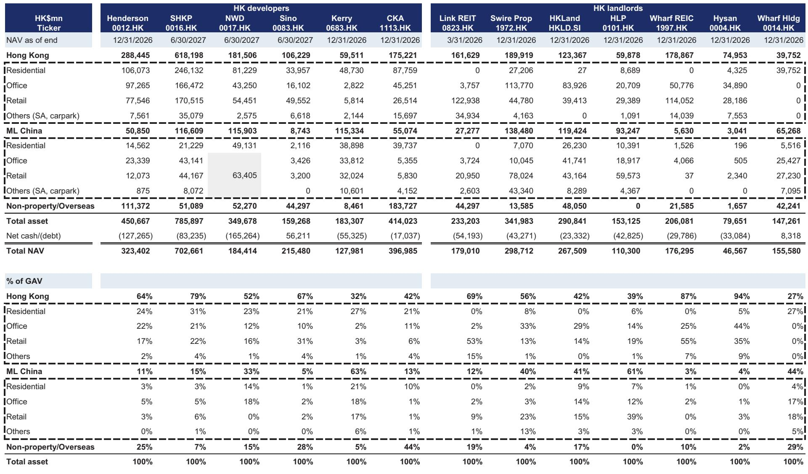
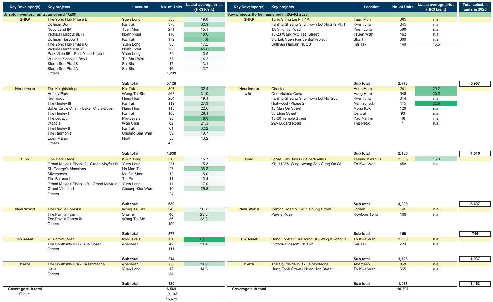
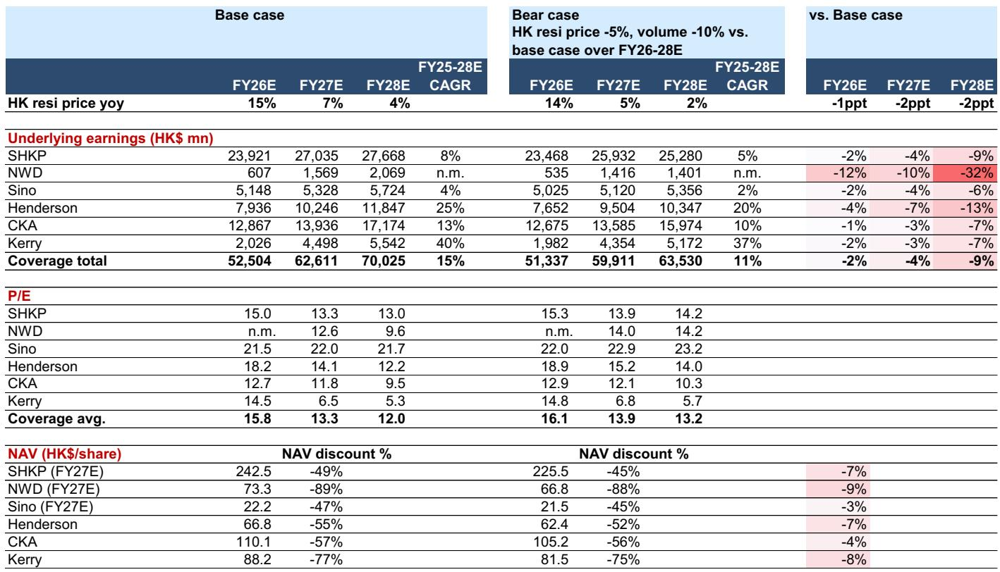

# Mainland Chinese Buyers Are Now the Swing Factor in Hong Kong’s Housing Market, But the Real Risk Is Not What You Think

The Hong Kong residential property market has staged a dramatic recovery. After bottoming out at roughly HK$390 billion in total transaction value during the pandemic years of 2022-2023, sales rebounded to HK$517 billion in 2025 and are running 71% higher year-on-year in the first four months of 2026. Behind this resurgence lies a structural shift that is often misunderstood: mainland Chinese buyers have tripled their purchasing volume since 2023, accounting for 35% of total transaction value last year. Yet the prevailing narrative—that tighter Chinese capital controls will abruptly halt this flow—misses the deeper story. The real insight is not about how much money can leave China, but about who is buying, why they are buying, and what kind of demand is genuinely at risk.

The Chinese government’s new directives, issued in late May and early June 2026, have triggered widespread concern that individual capital outflows will be scrutinized more closely. This is a legitimate worry, but it must be calibrated against the actual demand drivers. Our analysis of transaction data, immigration trends, and buyer profiles reveals that the majority of mainland Chinese purchases in Hong Kong are not speculative capital flight. They are end-user demand driven by a massive influx of talent and immigrants under new visa schemes. The real vulnerability is concentrated in a narrow segment: luxury units purchased by non-resident investors. For the broader market, the fundamentals remain supportive, and the multi-year upcycle thesis still holds—provided one understands where the risks actually lie.

## Demand from Mainland Buyers Is Dominated by Genuine End-Users, Not Speculators

The most critical distinction to make is between investment demand and end-user demand. A global investment bank report tracking transaction data by Mandarin pinyin names shows that mainland Chinese buyers purchased 14,800 housing units in Hong Kong in 2025, up from 5,800 in 2023. That is a remarkable surge. But the question is: what is driving it?

The answer lies in Hong Kong’s visa and immigration policies. Since the social unrest in 2018, the government has approved approximately 660,000 visa applications under various schemes, most notably the Top Talent Pass Scheme introduced in 2022. Media reports suggest that roughly half of these approved applicants, or 300,000 to 400,000 individuals, currently reside in Hong Kong. That compares to an annual visa approval rate of just 60,000 to 70,000 before the pandemic. The math is straightforward: if even half of these additional 240,000 to 330,000 individuals or households decide to purchase property, that translates to 120,000 to 160,000 units of incremental housing demand. Against this backdrop, the 52,000 mainland Chinese buyer transactions recorded during this period are not excessive—they are likely conservative.

This implies two things. First, the overwhelming majority of these purchases are end-user driven, not speculative. Second, there remains a significant backlog of unmet demand. When you overlay this with the fact that 78% of mainland Chinese purchases in 2025 were for units priced below HK$12 million, the picture becomes clear: these are not wealthy investors parking capital; they are professionals and families moving to Hong Kong for work and education. The investment demand component, based on developer observations, is likely around 20% of mainland Chinese purchases, which translates to roughly 7% of total Hong Kong residential transaction value. That is the segment genuinely exposed to capital control tightening.

## Tighter Capital Controls Will Bite at the High End, But Legitimate Channels Already Constrain Most Buyers

The new directives have not specified any additional measures to tighten capital flow to Hong Kong. But even if they did, the impact would be highly uneven across price segments. Understanding the existing legitimate channels for transferring money out of mainland China is essential to gauging the magnitude of any potential disruption.

A mainland Chinese individual can legally transfer or bring offshore up to roughly RMB 4 million per year through a combination of the SAFE annual quota of USD 50,000, travel allowances, ATM withdrawals, and the Cross-boundary Wealth Management Connect Scheme. For a two-person household, that figure rises to approximately RMB 8 million. Assuming a typical 70% mortgage, this means the property price a mainland buyer can afford through legitimate channels is capped at around RMB 13 million for an individual or RMB 26 million for a household. In Hong Kong dollars, that translates to roughly HK$14 million and HK$28 million respectively.

This explains why 78% of mainland Chinese purchases in 2025 were below HK$12 million. These buyers are operating within the existing regulatory framework. The segment that is vulnerable to tighter controls is the luxury market—properties priced well above HK$20 million, where buyers must rely on alternative channels to move larger sums. That segment represents a much smaller share of total transactions. In 2025, only 22% of mainland Chinese purchases by volume were above HK$12 million, and the share of luxury transactions as a percentage of total mainland buying has actually declined slightly from its 2024 peak.

The historical precedent is instructive. When capital controls were tightened in 2016, alternative channels emerged to mitigate the impact. The key risk to watch is not the directives themselves, but whether the Chinese authorities close those alternative channels more aggressively this time. That remains an open question.

## Rental Yields and Low Vacancy Provide a Fundamental Floor That Policy Changes Cannot Easily Dislodge

While policy headlines dominate the narrative, the microeconomic fundamentals of Hong Kong’s housing market remain remarkably supportive. The average rental yield for Class B units stands at 3.3%, compared to a mortgage rate of 3.25%. That means homeowners are enjoying a mild positive carry—a rare condition in any major global city. Compare this to other Asian gateway markets: Singapore yields 2.9%, Beijing 2.0%, Shenzhen 1.8%, and Shanghai 1.7%. Hong Kong offers a compelling relative return for landlords.

Vacancy is also low at 4.3%, below the historical average of roughly 5%. Unsold inventories stand at 16,000 units, with only 12,000 new units scheduled for launch. This supply constraint is not accidental. After years of weak market sentiment, government land sales and MTR site tenders are still tracking behind the official annual target of 22,000 units, suggesting that the structural supply shortage will persist. Even if demand softens temporarily due to capital control concerns, the supply side provides a natural buffer against sharp price declines.

The rental growth trajectory adds another layer of support. After a cumulative 20% increase over the past three years, rental growth has slowed to 1.4% year-to-date, which likely reflects a shift from renting to buying as confidence returns. This is actually a positive signal for property sales. The decision to buy versus rent will continue to influence near-term momentum, but the fundamental calculus favors ownership given the yield advantage and the expectation of further price appreciation.

## The Bear Case Is Concentrated and Manageable: Developer Exposure to Luxury Units Is the Key Variable

If the risk is concentrated in the luxury segment, the logical next question is which developers are most exposed. Among the major Hong Kong developers, three stand out: Kerry Properties, CK Asset Holdings, and Henderson Land have 41%, 44%, and 32% of their saleable resources priced at HK$25,000 per square foot or above, respectively. In contrast, Sun Hung Kai Properties has only 22% exposure to this luxury threshold.

A bear case scenario that assumes a 5% downside to housing prices and a 10% downside to transaction volumes would translate to a 15% reduction in contracted sales forecasts. For the covered developers, this would imply an average earnings impact of 2% to 9% over fiscal years 2026 to 2028, with net asset value estimates cut by 3% to 9%. New World Development and Kerry Properties would be the most sensitive due to higher financial leverage.

These are not catastrophic numbers. They suggest that even in a worst-case scenario where capital controls meaningfully reduce luxury demand, the impact on developer earnings and balance sheets is manageable. The broader market would likely absorb the shock through a rotation toward mass-market and mid-tier properties, where demand remains structurally supported by immigration and end-user needs.

It is worth noting that the Macau casino sector, which has 20% to 50% exposure to China’s grey-area liquidity, has historically pulled back sharply on capital control news. But the comparison is misleading. Hong Kong property has less than 10% exposure to mainland Chinese investment demand, and the majority of that is end-user driven. The two sectors are not analogous.

## What the Report Does Not Fully Answer: The Second-Order Effects on Alternative Channels and the Currency Link

The analysis is rigorous on the first-order effects, but it leaves several important questions unresolved. The most critical is the behavior of alternative capital transmission channels. In previous tightening cycles, new pathways emerged—often through trade finance, cryptocurrency, or corporate structures—that allowed capital to flow despite restrictions. The current regulatory environment is more sophisticated, and the Chinese government has shown increasing willingness to track and block these channels. Whether the old playbook still works is an open question.

Second, the report notes that past tightening episodes were usually associated with sharp CNY depreciation, whereas the renminbi has actually appreciated 6% against the USD over the past year. This is a meaningful difference. A stable or appreciating currency reduces the incentive for capital flight and makes it harder to justify aggressive tightening. But if the currency outlook shifts, the calculus changes. The relationship between currency policy and capital controls is the single most important variable to monitor, and it remains unresolved.

Third, the report does not fully explore the potential for policy divergence between Beijing and Hong Kong. The Hong Kong Financial Secretary has reportedly held discussions with mainland authorities to explore relaxations on capital transfer restrictions for mainland workers and immigrants settling in Hong Kong. If such relaxations materialize, they could offset the tightening impact entirely. This is a live policy negotiation, and its outcome will determine whether the current upcycle continues or stalls.

## A Decision Framework for Investors: Three Questions to Determine Your Exposure

For investors trying to navigate this environment, the analysis suggests a simple three-part framework.

First, assess your exposure to the luxury segment. If your portfolio is tilted toward developers with high exposure to units priced above HK$25,000 per square foot, the risk from capital control tightening is real but quantifiable. The earnings impact in a bear case is 2% to 9%, which is manageable but not negligible.

Second, monitor the renminbi. The historical pattern is clear: when the CNY weakens sharply, capital controls tighten and property demand softens. The current environment of CNY stability is supportive, but any change in the currency trajectory should trigger a reassessment.

Third, watch the visa and immigration data. The structural demand driver for Hong Kong housing is not capital flows; it is people flows. As long as the Top Talent Pass Scheme and other visa programs continue to attract 120,000 to 140,000 approved applicants annually, the underlying demand base remains robust. A slowdown in visa approvals would be a more significant bear signal than any capital control directive.

The market has already priced in some degree of risk. We see the recent correction as a continued good opportunity to accumulate positions in developers with diversified exposure and strong execution track records. The multi-year upcycle thesis remains intact, but it requires a more nuanced understanding of where the risks actually lie.

Join the community to read the full report and review the original charts.

*This article is for learning and discussion only and does not constitute investment advice.*

Personal reading notes and learning share only. Not investment advice.

