# Hong Kong Real Estate

## High base effect about to kick in for retail business

## EMDEquities REMD

Hong Kong

◆ Sustained improvement in retail sales should support rental stabilisation for many retail landlords  
Looking ahead, we expect retail sales growth to moderate in 2H given higher base and growing e-commerce penetration  
◆ Among landlords, we like Hysan (14 HK), Swire Properties (1972 HK), and Link REIT (823 HK); all rated Buy

Expecting retail sales to moderate in 2H. Retail sales in April went up by $8.6\%$ y/y, extending the expansionary territory to a twelfth consecutive month. The recovery is becoming more balanced, broadening from luxury-led spending to some mass-market consumption. Retail landlords' earnings visibility should continue to improve alongside the narrowing negative rental reversion for many malls, resulting in a rental stabilisation for many landlords. However, we believe the recovery will only be modest and uneven. (Green light for high-end malls, 10 December 2025). A higher base effect and growing penetration from mainland Chinese e-commerce operators should result in a more gradual retail sales improvement in the coming months, compared to a growth of $11.3\%$ in 4M26. Retailers need to continuously adapt to the changing value-led spending behaviours and introduce more service and product ranges to attract customers.

Read-across from the landlords. Tenant sales for both major high-end malls and community malls continue to improve. Notably, Wharf REIC's Chairman expressed optimism about the Hong Kong retail outlook, his first such positive signal in recent years since COVID-19, citing early indications of a turning point. For Link REIT, tenant sales displayed some improvement in its community malls. Swire Properties' major mall Pacific Place in Hong Kong delivered an outperformance in tenant sales versus the overall market. Henderson Land reported that tenant sales of its mall portfolio exceeded $10\%$ growth in the May holiday.

Investment ideas. We remain constructive on Hong Kong retail landlords. We see growing DPU resiliency in Link REIT (823 HK, HKD39.22, Buy) while the restart of its buyback campaign should support its valuation. Improving tenant sales performance at Hysan's (14 HK, HKD18.20, Buy) high-end malls, coupled with faster than expected capital recycling initiatives could support its earnings outlook. Swire Properties (1972 HK, HKD22.68, Buy) transformation into an integrated commercial landlord and earnings recovery should support its re-rating process, in our view.

Stocks mentioned in the report

<table><tr><td>Company</td><td>Ticker</td><td>Mkt cap (USDbn)</td><td>ADTV (USDm)</td><td>HSBC rating</td><td>CCY</td><td>Latest price</td><td>Target price</td><td>Upside/ downside)</td><td>FY26e PE (x)</td><td>FY26e div yield</td><td>NAV discount</td></tr><tr><td>Hysan Dev</td><td>14 HK</td><td>2.4</td><td>6.0</td><td>Buy</td><td>HKD</td><td>18.20</td><td>23.00</td><td>26.4%</td><td>7.3</td><td>5.9%</td><td>-66%</td></tr><tr><td>Swire Properties</td><td>1972 HK</td><td>16.7</td><td>10.7</td><td>Buy</td><td>HKD</td><td>22.68</td><td>30.20</td><td>33.2%</td><td>15.4</td><td>5.3%</td><td>-55%</td></tr><tr><td>Link REIT</td><td>823 HK</td><td>12.9</td><td>55.6</td><td>Buy</td><td>HKD</td><td>39.22</td><td>46.50</td><td>18.6%</td><td>15.5</td><td>6.5%</td><td>-33%</td></tr></table>

Source: Bloomberg, HSBC estimates. Priced as of close 2 June 2026

## Raymond Liu\*, CFA

Analyst, Asia Real Estate and Conglomerates  
The Hongkong and Shanghai Banking Corporation Limited  
raymond.w.m.liu@hsbc.com.hk  
+852 2996 6743

## Michelle Kwok\*

Head of Asia Real Estate and HK Equity Research  
The Hongkong and Shanghai Banking Corporation Limited  
michellekwok@hsbc.com.hk  
+852 2996 6918

## Ganesh Siva\*

Associate

Bangalore

\* Employed by a non-US affiliate of HSBC Securities (USA) Inc, and is not registered/qualified pursuant to FINRA regulations

HSBC Funding the Future Survey

Sentiment, AI and Private Credit

Click to view

## Disclosures & Disclaimer

This report must be read with the disclosures and the analyst certifications in the Disclosure appendix, and with the Disclaimer, which forms part of it.

Issuer of report: The Hongkong and Shanghai Banking Corporation Limited

View HSBC Global Investment Research at:

https://www.research.hsbc.com

## Retail sales growth continued in April 2026

Hong Kong's retail sales growth stayed positive for the twelfth consecutive month. In April 2026, retail sales grew $8.6\%$ y/y, compared to $12.8\%$ in March; retail sales for 4M26 increased by $11.3\%$ . We believe the retail market is still facing various challenges, such as the change in tourist spending patterns and more frequent outbound travel by locals. These trends should continue, resulting in some leakage in tenant sales, which in turn should lead to a more gradual improvement compared to previous cycles.

Among major sub-segments, the largest increase in retail spending came from Consumer Durable Goods, which rose 26.2% y/y, followed by Jewellery, Watches, Clocks & Valuable Gifts, and Cosmetics at 19.8%.

Across all categories, retail sales declined in two sub-segments in Department Store Sales (down $6.7\%$ y/y) and Fuels (down $11.7\%$ y/y), while other sub-sectors reported growth of $0.3 - 8.1\%$ , excluding the categories stated above.

Fig 1. Retail sales growth in Hong Kong (% y/y change)  
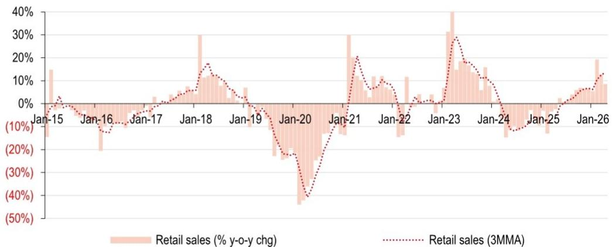

bar-line hybrid chart

| Date   | Retail sales (% y-o-y chg) | Retail sales (3MMA) |
|--------|-----------------------------|---------------------|
| Jan-15 | 15%                         | 0%                  |
| Jan-16 | -10%                        | -10%                |
| Jan-17 | 0%                          | 0%                  |
| Jan-18 | 30%                         | 15%                 |
| Jan-19 | 5%                          | 0%                  |
| Jan-20 | -20%                        | -20%                |
| Jan-21 | 30%                         | 20%                 |
| Jan-22 | -10%                        | -10%                |
| Jan-23 | 30%                         | 30%                 |
| Jan-24 | 15%                         | 15%                 |
| Jan-25 | -10%                        | -10%                |
| Jan-26 | 20%                         | 10%                 |

Source: The Census and Statistical Department of the Hong Kong SAR Government, HSBC: retail sales % y-o-y change and retail sales (3MMA) updated as at April 2026.

Fig 2. Hong Kong retail sales growth by category: Consumer Durable Goods followed by Jewellery, Watches, Clocks & Valuable Gift saw the biggest jump in April 2026  
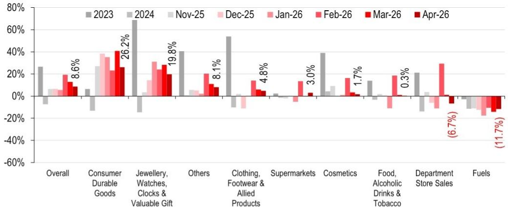

bar chart

| Category | 2023 (%) | 2024 (%) | Nov-25 (%) | Dec-25 (%) | Jan-26 (%) | Feb-26 (%) | Mar-26 (%) | Apr-26 (%) |
|---|---|---|---|---|---|---|---|---|
| Overall | 27 | -10 | 5 | 5 | 18 | 10 | 8.6 | 8.6 |
| Consumer Durable Goods | 5 | -15 | 27 | 38 | 35 | 23 | 40 | 26.2 |
| Jewellery, Watches, Clocks & Valuable Gift | 70 | -15 | 3 | 15 | 30 | 25 | 20 | 19.8 |
| Others | 40 | 5 | 4 | 5 | 20 | 10 | 8.1 | 8.1 |
| Clothing, Footwear & Allied Products | 54 | -10 | -10 | -15 | 14 | 5 | 4.8 | 4.8 |
| Supermarkets | 2 | -1 | -1 | -5 | -10 | 13 | 3.0 | 3.0 |
| Cosmetics | 40 | 4 | 6 | -1 | -1 | 16 | 1.7 | 1.7 |
| Food, Alcoholic Drinks & Tobacco | 14 | -5 | -3 | -10 | -10 | 18 | 0.3 | 0.3 |
| Department Store Sales | 21 | -15 | -5 | -10 | -15 | 30 | -6.7 | -6.7 |
| Fuels | -3 | -5 | -10 | -15 | -20 | -15 | -11.7 | -11.7 |

Source: The Census and Statistical Department of the Hong Kong SAR Government, HSBC

Fig 3. Hong Kong retail sales posted strong growth in April 2026 at $8.6\%$ on a regional basis (y/y)  
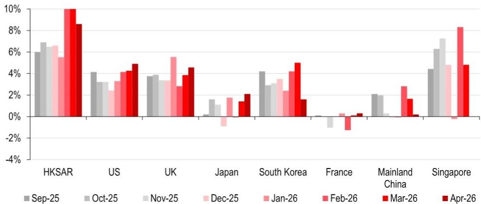

bar chart

| Country | Sep-25 (%) | Oct-25 (%) | Nov-25 (%) | Dec-25 (%) | Jan-26 (%) | Feb-26 (%) | Mar-26 (%) | Apr-26 (%) |
| :--- | :---: | :---: | :---: | :---: | :---: | :---: | :---: | :---: |
| HKSAR | 6.0 | 7.0 | 6.8 | 6.7 | 5.5 | 10.0 | 8.5 | 8.5 |
| US | 4.1 | 3.2 | 3.1 | 2.4 | 3.3 | 4.1 | 4.2 | 4.9 |
| UK | 3.8 | 3.9 | 3.4 | 3.2 | 5.5 | 3.9 | 4.0 | 4.5 |
| Japan | 0.1 | 1.6 | 1.1 | -0.8 | 1.8 | 0.1 | 1.4 | 2.1 |
| South Korea | 4.1 | 3.0 | 3.4 | 3.5 | 2.4 | 4.1 | 5.0 | 1.6 |
| France | 0.0 | -0.2 | -0.8 | -0.3 | -0.3 | -1.4 | -0.2 | 0.2 |
| Mainland China | 2.0 | 2.0 | 0.3 | -0.1 | 2.8 | 1.6 | -0.1 | -0.1 |
| Singapore | 4.3 | 6.3 | 7.2 | -0.1 | 4.7 | 8.3 | 4.8 | 4.8 |

Source: CEIC, LSEG Datastream, Bloomberg, HSBC Singapore retail sales figure are up to March 2026

Fig 4. The positive wealth effect continue to bode well for the retail market, in our view  
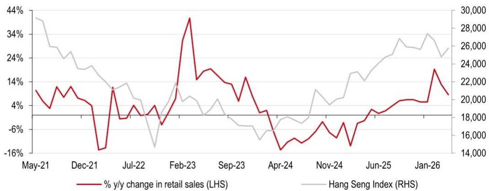

line chart

| Month    | % y/y change in retail sales (LHS) | Hang Seng Index (RHS) |
|----------|-------------------------------------|------------------------|
| May-21   | ~10%                                | ~30,000                |
| Dec-21   | ~-16%                               | ~20,000                |
| Jul-22   | ~-5%                                | ~18,000                |
| Feb-23   | ~35%                                | ~22,000                |
| Sep-23   | ~14%                                | ~16,000                |
| Apr-24   | ~-16%                               | ~18,000                |
| Nov-24   | ~-5%                                | ~20,000                |
| Jun-25   | ~4%                                 | ~24,000                |
| Jan-26   | ~14%                                | ~26,000                |

Source: CEIC, LSEG Datastream, Bloomberg, HSBC

Fig 5. We expect luxury retail sales to outperform non-luxury retail sales in the next 12 months....  
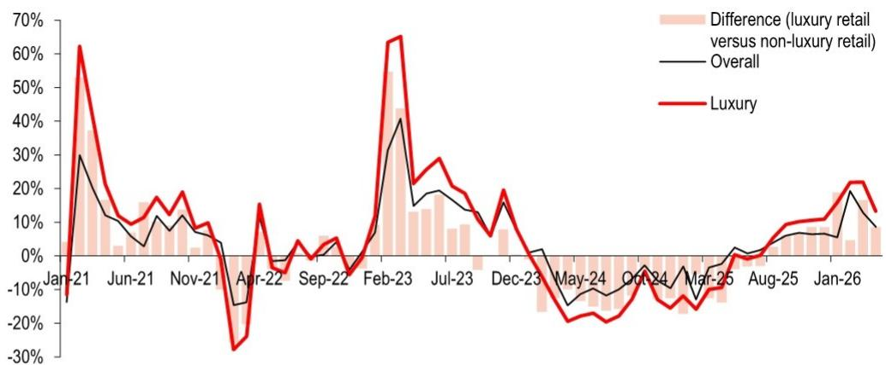

line chart

| Month   | Difference (luxury retail versus non-luxury retail) | Overall | Luxury |
|---------|------------------------------------------------------|---------|--------|
| Jan-21  | -15%                                                 | 30%     | 60%    |
| Jun-21  | 10%                                                  | 5%      | 15%    |
| Nov-21  | 5%                                                   | 10%     | 15%    |
| Apr-22  | -10%                                                 | -15%    | -25%   |
| Sep-22  | 0%                                                   | 5%      | 5%     |
| Feb-23  | 40%                                                  | 40%     | 65%    |
| Jul-23  | 15%                                                  | 20%     | 30%    |
| Dec-23  | 5%                                                   | 10%     | 20%    |
| May-24  | -10%                                                 | -15%    | -20%   |
| Oct-24  | -5%                                                  | -10%    | -15%   |
| Mar-25  | -10%                                                 | -5%     | -10%   |
| Aug-25  | 0%                                                   | 5%      | 10%    |
| Jan-26  | 5%                                                   | 10%     | 20%    |

Source: The Census and Statistical Department of the Hong Kong SAR Government, HSBC

Fig 6. Hong Kong & Macau – monthly visitor arrivals  
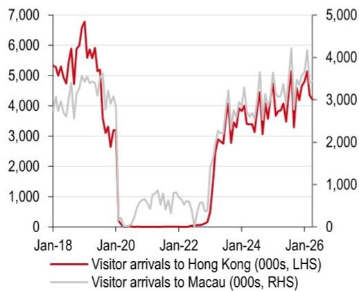

line chart

| Date   | Visitor arrivals to Hong Kong (000s, LHS) | Visitor arrivals to Macau (000s, RHS) |
|--------|------------------------------------------|--------------------------------------|
| Jan-18 | ~5,500                                   | ~4,000                               |
| Jan-20 | ~3,000                                   | ~1,000                               |
| Jan-22 | ~1,000                                   | ~1,500                               |
| Jan-24 | ~3,500                                   | ~4,500                               |
| Jan-26 | ~5,000                                   | ~6,000                               |

Note: 2026 data represents up to April 2026  
Source: CEIC, HSBC

Fig 7. Hong Kong & Macau – hotel occupancy rate (%)  
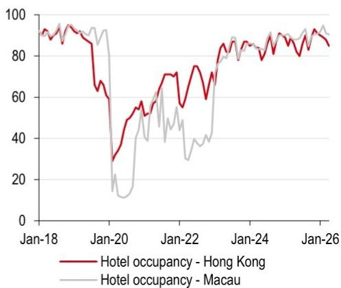

line chart

| Date   | Hotel occupancy - Hong Kong | Hotel occupancy - Macau |
|--------|-----------------------------|--------------------------|
| Jan-18 | ~95                         | ~95                      |
| Jan-20 | ~30                         | ~15                      |
| Jan-22 | ~75                         | ~40                      |
| Jan-24 | ~85                         | ~80                      |
| Jan-26 | ~90                         | ~95                      |

Note: 2026 data represents up to April 2026.
Source: CEIC, HSBC

Fig 8. Hong Kong – average daily room rate  
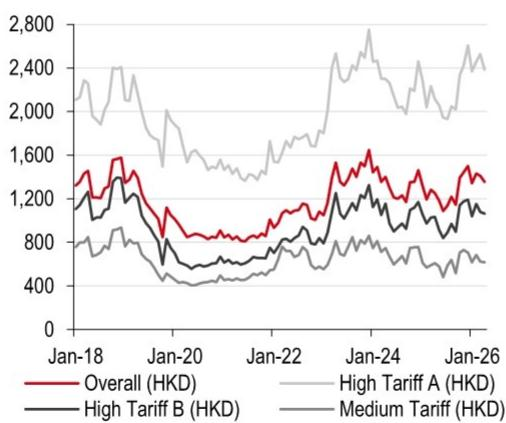

line chart

| Date   | Overall (HKD) | High Tariff A (HKD) | High Tariff B (HKD) | Medium Tariff (HKD) |
|--------|---------------|---------------------|---------------------|---------------------|
| Jan-18 | 1300          | 2400                | 1200                | 800                 |
| Jan-20 | 1000          | 1500                | 700                 | 500                 |
| Jan-22 | 1100          | 1600                | 800                 | 600                 |
| Jan-24 | 1600          | 2700                | 1100                | 700                 |
| Jan-26 | 1400          | 2500                | 1000                | 600                 |

Note: 2026 data represents up to April 2026.
Source: CEIC, HSBC

Fig 9. Hong Kong & Macau – retail sales and gaming receipts  
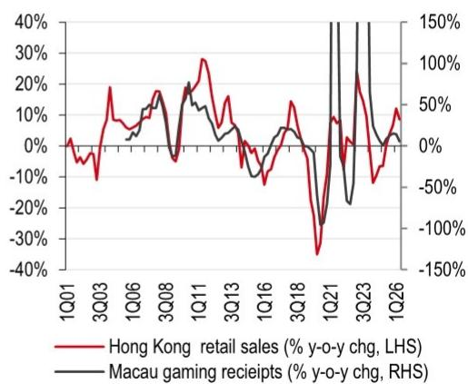

line chart

| Quarter | Hong Kong retail sales (% y-o-y chg, LHS) | Macau gaming receipts (% y-o-y chg, RHS) |
|---------|-------------------------------------------|------------------------------------------|
| 1Q01    | ~0%                                       | ~0%                                      |
| 3Q03    | ~-10%                                     | ~-5%                                     |
| 1Q06    | ~15%                                      | ~10%                                     |
| 3Q08    | ~-5%                                      | ~-10%                                    |
| 1Q11    | ~25%                                      | ~15%                                     |
| 3Q13    | ~-5%                                      | ~-10%                                    |
| 1Q16    | ~-10%                                     | ~-5%                                     |
| 3Q18    | ~-30%                                     | ~-20%                                    |
| 1Q21    | ~-40%                                     | ~-150%                                   |
| 3Q23    | ~20%                                      | ~150%                                    |
| 1Q26    | ~10%                                      | ~50%                                     |

Note: Macau's gaming receipts increased 421% y-o-y in 4Q23, 780% y-o-y in 3Q23 and 436% y-o-y in 2Q23. 2026 data represents up to April 2026
Source: CEIC, HSBC

Fig 10. Hong Kong's retail sales and Macau's gaming receipts in value  
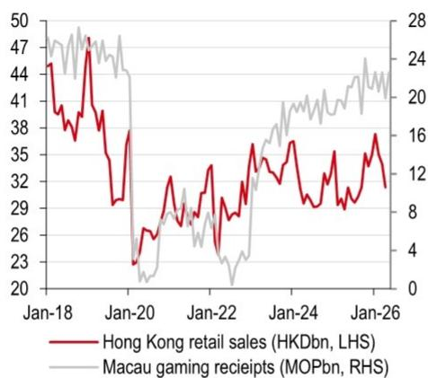

line chart

| Date   | Hong Kong retail sales (HKDbn, LHS) | Macau gaming receipts (MOPbn, RHS) |
|--------|--------------------------------------|------------------------------------|
| Jan-18 | 47                                   | 28                                 |
| Jan-20 | 38                                   | 4                                  |
| Jan-22 | 35                                   | 8                                  |
| Jan-24 | 37                                   | 16                                 |
| Jan-26 | 38                                   | 20                                 |

Note: 2026 data represents up to April 2026.
Source: CEIC, HSBC

Fig 11. Mainland China: Number of daily passenger flights executed – domestic and international routes  
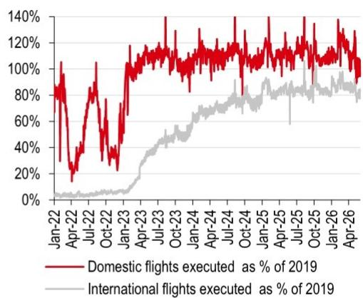

line chart

| Date    | Domestic flights executed as % of 2019 | International flights executed as % of 2019 |
|---------|------------------------------------------|-----------------------------------------------|
| Jan-22  | ~100%                                    | ~0%                                           |
| Apr-22  | ~20%                                     | ~0%                                           |
| Jul-22  | ~80%                                     | ~0%                                           |
| Oct-22  | ~100%                                    | ~0%                                           |
| Jan-23  | ~110%                                    | ~0%                                           |
| Apr-23  | ~115%                                    | ~20%                                          |
| Jul-23  | ~120%                                    | ~40%                                          |
| Oct-23  | ~115%                                    | ~60%                                          |
| Jan-24  | ~110%                                    | ~70%                                          |
| Apr-24  | ~115%                                    | ~75%                                          |
| Jul-24  | ~110%                                    | ~80%                                          |
| Oct-24  | ~115%                                    | ~85%                                          |
| Jan-25  | ~110%                                    | ~90%                                          |
| Apr-25  | ~115%                                    | ~85%                                          |
| Jul-25  | ~110%                                    | ~80%                                          |
| Oct-25  | ~115%                                    | ~85%                                          |
| Jan-26  | ~110%                                    | ~80%                                          |
| Apr-26  | ~105%                                    | ~75%                                          |

Note: 2026 data represents up to 31 May 2026.
Source: Wind, HSBC

Valuation and risks

<table><tr><td colspan="2"></td><td>Valuation</td><td>Risks</td></tr><tr><td>Hysan Development 14 HK</td><td rowspan="2">Current price:HKD18.20Target price:HKD23.00Up/downside:+26.4%</td><td rowspan="2">We maintain our Buy rating with a target price of HKD23.00. Our target price is based on a discount of 57%, (0.75 SD below mean) applied to our NAV estimate per share of HKD53.60 (all unchanged).Our target discount is based on our valuation framework, which factors in business diversification, strengthening rental income, and policy risks. For our NAV estimate, we calculate the value of each existing or prospective property development project using a DCF model to derive the GAV of each project. We continue to use the cost of equity metrics as defined by HSBC Global Investment Research&#x27;s equity strategists. For our DCF model, we assume a WACC for Hong Kong and mainland China of 5.9% and 6.1%, respectively, based on risk-free rates of 4.25% for both markets; a market risk premium of 4.25% and 4.75%, respectively; and a beta of 0.71 for both markets (all unchanged).Our target price implies 26.4% upside from the current share price; we maintain our Buy rating as Hysan&#x27;s shopping mall portfolio in Causeway Bay, with a focus on discretionary spending, should benefit from a positive wealth effect, in our view. Together with the expansion of several high-end retail flagship stores, this should help improve its earnings and dividend visibility.Raymond Liu*, CFA | raymond.w.m.liu@hsbc.com.hk | +852 2996 6743</td><td rowspan="2">Downside risks: Lower-than-expected retail rentals achieved; dividend cut, slower-than-expected visitor arrivals; and a spike in HIBOR that leads to higher-than expected interest expenses.</td></tr><tr><td>Buy</td></tr><tr><td>Swire Properties 1972 HK</td><td rowspan="2">Current price:HKD22.68Target price:HKD30.20Up/downside:+33.2%</td><td rowspan="2">We have a Buy rating with a target price of HKD30.20. Our TP is based on a target discount of 40% (0.50 SD below the historical mean) applied to our NAV estimate of HKD50.40/share (all unchanged). Our target discount is based on our valuation framework, which factors in business diversification, strengthening rental income, and policy risks, and reflects the level at which similar landlords in Hong Kong trade.We calculate the NAV estimate by summing our valuations of its assets using a DCF model for property developments and a capitalisation approach for investment properties. We continue to use the cost of equity metrics as defined by HSBC Global Investment Research&#x27;s equity strategists. For our DCF model, we assume a Hong Kong and mainland China WACC of 5.6% and 6.0%, respectively, based on a risk-free rate of 4.25% for both markets, a market risk premium of 4.25% and 4.75%, respectively, and a beta of 0.60 for both markets (all unchanged). Our capitalisation rates for properties in the portfolio are 4.50-6.50% (unchanged).Our target price implies 33.2% upside; we therefore maintain our Buy rating. We believe Swire&#x27;s resumption of rental income growth and active asset recycling can unlock value, and its high DPS growth visibility makes the stock attractive.Raymond Liu*, CFA | raymond.w.m.liu@hsbc.com.hk | +852 2996 6743</td><td rowspan="2">Downside risks: Slower-than-expected office and retail rentals achieved; slower-than-expected completions and ramp-ups of new projects in Shanghai and Hainan; and unsuccessful value-accretive project acquisitions.</td></tr><tr><td>Buy</td></tr><tr><td>Link REIT 823 HK</td><td>Current price:HKD39.22Target price:HKD46.50Up/downside:+18.6%</td><td>We maintain our Buy rating on Link REIT and keep out TP unchanged at HKD46.50. We set our fair value estimate at a par valuation to our DDM-based NAV estimate per share of HKD46.50, assuming a cost of equity of 7.3% with an adjusted beta of 0.72 (Bloomberg), a risk-free rate of 4.25%, a market risk premium of 4.25% and a terminal growth rate of 1.5% (all unchanged)Our HKD46.50 target price implies upside of 18.6%. We retain our Buy rating as we believe the worst is over for Link REIT, supported by its capital recycling strategy and improving retail sales momentum. The successful divestment of Swing By @ Thomson Plaza at a premium to book value demonstrates the company&#x27;s ability to execute its capital recycling strategy to drive unitholder value. Furthermore, Hong Kong&#x27;s retail sector has shown consistent modest growth, which provided a supportive environment for Link&#x27;s non-discretionary focus.Raymond Liu*, CFA | raymond.w.m.liu@hsbc.com.hk | +852 2996 6743</td><td>Downside risks: Slower-than-expected retail recovery in Hong Kong, expensive project acquisitions, worse-than-expected DPU cut and a more hawkish Fed than we expect.</td></tr></table>

Note: Priced as of 2 June 2026.  
\*Employed by a non-US affiliate of HSBC Securities (USA) Inc. and not registered/qualified pursuant to FINRA regulations.  
Source: Bloomberg, HSBC estimates

# Disclosure appendix

## Analyst Certification

The following analyst(s), economist(s), or strategist(s) who is(are) primarily responsible for this report, including any analyst(s) whose name(s) appear(s) as author of an individual section or sections of the report and any analyst(s) named as the covering analyst(s) of a subsidiary company in a sum-of-the-parts valuation certifies(y) that the opinion(s) on the subject security(ies) or issuer(s), any views or forecasts expressed in the section(s) of which such individual(s) is(are) named as author(s), and any other views or forecasts expressed herein, including any views expressed on the back page of the research report, accurately reflect their personal view(s) and that no part of their compensation was, is or will be directly or indirectly related to the specific recommendation(s) or views contained in this research report: Raymond Liu, CFA and Michelle Kwok

## Important disclosures

## Equities: Stock ratings and basis for financial analysis

HSBC and its affiliates, including the issuer of this report ("HSBC") believes an investor's decision to buy or sell a stock should depend on individual circumstances such as the investor's existing holdings, risk tolerance and other considerations and that investors utilise various disciplines and investment horizons when making investment decisions. Ratings should not be used or relied on in isolation as investment advice. Different securities firms use a variety of ratings terms as well as different rating systems to describe their recommendations and therefore investors should carefully read the definitions of the ratings used in each research report. Further, investors should carefully read the entire research report and not infer its contents from the rating because research reports contain more complete information concerning the analysts' views and the basis for the rating.

## From 23rd March 2015 HSBC has assigned ratings on the following basis:

The target price is based on the analyst's assessment of the stock's actual current value, although we expect it to take six to 12 months for the market price to reflect this. When the target price is more than $20\%$ above the current share price, the stock will be classified as a Buy; when it is between $5\%$ and $20\%$ above the current share price, the stock may be classified as a Buy or a Hold; when it is between $5\%$ below and $5\%$ above the current share price, the stock will be classified as a Hold; when it is between $5\%$ and $20\%$ below the current share price, the stock may be classified as a Hold or a Reduce; and when it is more than $20\%$ below the current share price, the stock will be classified as a Reduce.

Our ratings are re-calibrated against these bands at the time of any 'material change' (initiation or resumption of coverage, change in target price or estimates).

Upside/Downside is the percentage difference between the target price and the share price.

## Prior to this date, HSBC's rating structure was applied on the following basis:

For each stock we set a required rate of return calculated from the cost of equity for that stock's domestic or, as appropriate, regional market established by our strategy team. The target price for a stock represented the value the analyst expected the stock to reach over our performance horizon. The performance horizon was 12 months. For a stock to be classified as Overweight, the potential return, which equals the percentage difference between the current share price and the target price, including the forecast dividend yield when indicated, had to exceed the required return by at least 5 percentage points over the succeeding 12 months (or 10 percentage points for a stock classified as Volatile\*). For a stock to be classified as Underweight, the stock was expected to underperform its required return by at least 5 percentage points over the succeeding 12 months (or 10 percentage points for a stock classified as Volatile\*). Stocks between these bands were classified as Neutral.

\*A stock was classified as volatile if its historical volatility had exceeded $40\%$ , if the stock had been listed for less than 12 months (unless it was in an industry or sector where volatility is low) or if the analyst expected significant volatility. However, stocks which we did not consider volatile may in fact also have behaved in such a way. Historical volatility was defined as the past month's average of the daily 365-day moving average volatilities. In order to avoid misleadingly frequent changes in rating, however, volatility had to move 2.5 percentage points past the $40\%$ benchmark in either direction for a stock's status to change.

## Rating distribution for long-term investment opportunities

As of 31 March 2026, the distribution of all independent ratings published by HSBC is as follows:

<table><tr><td>Buy</td><td>59%</td><td>(12% of these provided with Investment Banking Services in the past 12 months)</td></tr><tr><td>Hold</td><td>36%</td><td>(12% of these provided with Investment Banking Services in the past 12 months)</td></tr><tr><td>Sell</td><td>6%</td><td>(6% of these provided with Investment Banking Services in the past 12 months)</td></tr></table>

For the purposes of the distribution above the following mapping structure is used during the transition from the previous to current rating models: under our previous model, Overweight = Buy, Neutral = Hold and Underweight = Sell; under our current model Buy = Buy, Hold = Hold and Reduce = Sell. For rating definitions under both models, please see “Stock ratings and basis for financial analysis” above.

For the distribution of non-independent ratings published by HSBC, please see the disclosure page available at http://www.hsbcnet.com/gbm/financial-regulation/investment-recommendations-disclosures.

Share price and rating changes for long-term investment opportunities  
Hysan Development (0014.HK) share price performance
HKD Vs HSBC rating history  
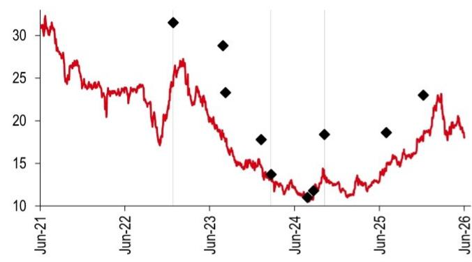

line chart

| Date   | Value |
|--------|-------|
| Jun-21 | 30    |
| Jun-22 | 25    |
| Jun-23 | 28    |
| Jun-24 | 11    |
| Jun-25 | 19    |
| Jun-26 | 23    |

Source: HSBC

Link REIT (0823.HK) share price performance HKD Vs HSBC rating history  
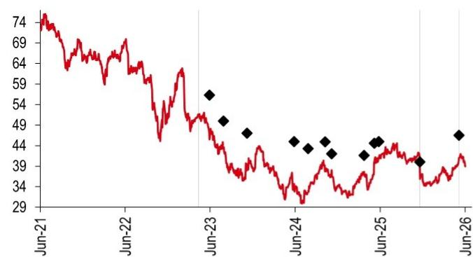

line chart

| Date   | Value |
|--------|-------|
| Jun-21 | 74    |
| Jun-22 | 64    |
| Jun-23 | 54    |
| Jun-24 | 44    |
| Jun-25 | 44    |
| Jun-26 | 48    |

Source: HSBC

Rating & target price history

<table><tr><td>From</td><td>To</td><td>Date</td><td>Analyst</td></tr><tr><td>Hold</td><td>Buy</td><td>27 Dec 2022</td><td>Raymond Liu, CFA</td></tr><tr><td>Buy</td><td>Hold</td><td>22 Feb 2024</td><td>Raymond Liu, CFA</td></tr><tr><td>Hold</td><td>Buy</td><td>09 Oct 2024</td><td>Raymond Liu, CFA</td></tr><tr><td>Target price</td><td>Value</td><td>Date</td><td>Analyst</td></tr><tr><td>Price 1</td><td>31.50</td><td>27 Dec 2022</td><td>Raymond Liu, CFA</td></tr><tr><td>Price 2</td><td>28.80</td><td>30 Jul 2023</td><td>Raymond Liu, CFA</td></tr><tr><td>Price 3</td><td>23.30</td><td>10 Aug 2023</td><td>Raymond Liu, CFA</td></tr><tr><td>Price 4</td><td>17.80</td><td>10 Jan 2024</td><td>Raymond Liu, CFA</td></tr><tr><td>Price 5</td><td>13.70</td><td>22 Feb 2024</td><td>Raymond Liu, CFA</td></tr><tr><td>Price 6</td><td>11.00</td><td>28 Jul 2024</td><td>Raymond Liu, CFA</td></tr><tr><td>Price 7</td><td>11.80</td><td>23 Aug 2024</td><td>Raymond Liu, CFA</td></tr><tr><td>Price 8</td><td>18.40</td><td>09 Oct 2024</td><td>Raymond Liu, CFA</td></tr><tr><td>Price 9</td><td>18.60</td><td>02 Jul 2025</td><td>Raymond Liu, CFA</td></tr><tr><td>Price 10</td><td>23.00</td><td>09 Dec 2025</td><td>Raymond Liu, CFA</td></tr><tr><td colspan="4">Source: HSBC</td></tr></table>

Rating & target price history

<table><tr><td>From</td><td>To</td><td>Date</td><td>Analyst</td></tr><tr><td>Restricted</td><td>Buy</td><td>14 Apr 2023</td><td>Raymond Liu, CFA</td></tr><tr><td>Buy</td><td>Hold</td><td>20 Nov 2025</td><td>Raymond Liu, CFA</td></tr><tr><td>Hold</td><td>Buy</td><td>07 May 2026</td><td>Raymond Liu, CFA</td></tr><tr><td>Target price</td><td>Value</td><td>Date</td><td>Analyst</td></tr><tr><td>Price 1</td><td>56.30</td><td>31 May 2023</td><td>Raymond Liu, CFA</td></tr><tr><td>Price 2</td><td>50.00</td><td>30 Jul 2023</td><td>Raymond Liu, CFA</td></tr><tr><td>Price 3</td><td>47.00</td><td>08 Nov 2023</td><td>Raymond Liu, CFA</td></tr><tr><td>Price 4</td><td>45.00</td><td>29 May 2024</td><td>Raymond Liu, CFA</td></tr><tr><td>Price 5</td><td>43.30</td><td>28 Jul 2024</td><td>Raymond Liu, CFA</td></tr><tr><td>Price 6</td><td>44.90</td><td>09 Oct 2024</td><td>Raymond Liu, CFA</td></tr><tr><td>Price 7</td><td>42.00</td><td>06 Nov 2024</td><td>Raymond Liu, CFA</td></tr><tr><td>Price 8</td><td>41.60</td><td>25 Mar 2025</td><td>Raymond Liu, CFA</td></tr><tr><td>Price 9</td><td>44.60</td><td>08 May 2025</td><td>Raymond Liu, CFA</td></tr><tr><td>Price 10</td><td>45.00</td><td>27 May 2025</td><td>Raymond Liu, CFA</td></tr><tr><td>Price 11</td><td>40.00</td><td>20 Nov 2025</td><td>Raymond Liu, CFA</td></tr><tr><td>Price 12</td><td>46.50</td><td>07 May 2026</td><td>Raymond Liu, CFA</td></tr></table>

Source: HSBC

Swire Properties (1972.HK) share price performance HKD Vs HSBC rating history  
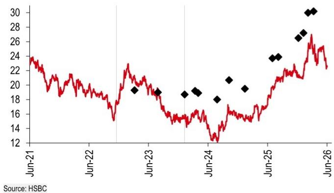

line chart

| Date   | Value |
|--------|-------|
| Jun-21 | 24    |
| Jun-22 | 15    |
| Jun-23 | 19    |
| Jun-24 | 18    |
| Jun-25 | 24    |
| Jun-26 | 30    |

Rating & target price history

<table><tr><td>From</td><td>To</td><td>Date</td><td>Analyst</td></tr><tr><td>Buy</td><td>Hold</td><td>17 Nov 2022</td><td>Raymond Liu, CFA</td></tr><tr><td>Hold</td><td>Buy</td><td>10 Jan 2024</td><td>Raymond Liu, CFA</td></tr><tr><td>Target price</td><td>Value</td><td>Date</td><td>Analyst</td></tr><tr><td>Price 1</td><td>19.30</td><td>09 Mar 2023</td><td>Raymond Liu, CFA</td></tr><tr><td>Price 2</td><td>19.00</td><td>30 Jul 2023</td><td>Raymond Liu, CFA</td></tr><tr><td>Price 3</td><td>18.70</td><td>10 Jan 2024</td><td>Raymond Liu, CFA</td></tr><tr><td>Price 4</td><td>19.20</td><td>14 Mar 2024</td><td>Raymond Liu, CFA</td></tr><tr><td>Price 5</td><td>18.90</td><td>02 Apr 2024</td><td>Raymond Liu, CFA</td></tr><tr><td>Price 6</td><td>18.00</td><td>28 Jul 2024</td><td>Raymond Liu, CFA</td></tr><tr><td>Price 7</td><td>20.70</td><td>09 Oct 2024</td><td>Raymond Liu, CFA</td></tr><tr><td>Price 8</td><td>19.50</td><td>14 Jan 2025</td><td>Raymond Liu, CFA</td></tr><tr><td>Price 9</td><td>23.70</td><td>02 Jul 2025</td><td>Raymond Liu, CFA</td></tr><tr><td>Price 10</td><td>23.90</td><td>07 Aug 2025</td><td>Raymond Liu, CFA</td></tr><tr><td>Price 11</td><td>26.50</td><td>09 Dec 2025</td><td>Raymond Liu, CFA</td></tr><tr><td>Price 12</td><td>27.20</td><td>09 Jan 2026</td><td>Raymond Liu, CFA</td></tr><tr><td>Price 13</td><td>30.00</td><td>06 Feb 2026</td><td>Raymond Liu, CFA</td></tr><tr><td>Price 14</td><td>30.20</td><td>12 Mar 2026</td><td>Raymond Liu, CFA</td></tr></table>

Source: HSBC

To view a list of all the independent fundamental ratings/recommendations disseminated by HSBC during the preceding 12-month period, and the location where we publish our quarterly distribution of non-fundamental recommendations (applicable to Fixed Income and Currencies research only), please use the following links to access the disclosure page:

Clients of HSBC Private Bank: www.research.privatebank.hsbc.com/Disclosures

All other clients: www.research.hsbc.com/A/Disclosures

HSBC & Analyst disclosures
Disclosure checklist

<table><tr><td>Company</td><td>Ticker</td><td>Recent price</td><td>Price date</td><td>Disclosure</td></tr><tr><td>HYSAN DEVELOPMENT</td><td>0014.HK</td><td>18.00</td><td>03 Jun 2026</td><td>4,7</td></tr><tr><td>LINK REIT</td><td>0823.HK</td><td>38.96</td><td>03 Jun 2026</td><td>4,6,7,11</td></tr><tr><td>SWIRE PROPERTIES</td><td>1972.HK</td><td>22.54</td><td>03 Jun 2026</td><td>6,7</td></tr></table>

Source: HSBC  
1 HSBC has managed or co-managed a public offering of securities for this company within the past 12 months.  
2 HSBC expects to receive or intends to seek compensation for investment banking services from this company in the next 3 months.  
3 At the time of publication of this report, HSBC Securities (USA) Inc. is a Market Maker in securities issued by this company.  
4 As of 30 April 2026, HSBC beneficially owned $1\%$ or more of a class of common equity securities of this company.  
5 This company was a client of HSBC or had during the preceding 12 month period been a client of and/or paid compensation to HSBC in respect of investment banking services.  
6 This company was a client of HSBC or had during the preceding 12 month period been a client of and/or paid compensation to HSBC in respect of non-investment banking securities-related services.  
7 This company was a client of HSBC or had during the preceding 12 month period been a client of and/or paid compensation to HSBC in respect of non-securities services.  
8 A covering analyst/s has received compensation from this company in the past 12 months.  
9 A covering analyst/s or a member of his/her household has a financial interest in the securities of this company, as detailed below.  
10 A covering analyst/s or a member of his/her household is an officer, director or supervisory board member of this company, as detailed below.  
11 At the time of publication of this report, HSBC is a non-US Market Maker in securities issued by this company and/or in securities in respect of this company.  
12 As of 27 May 2026, HSBC beneficially held a net long position of more than $0.5\%$ of this company's total issued share capital, calculated according to the SSR methodology.

13 As of 27 May 2026, HSBC beneficially held a net short position of more than $0.5\%$ of this company's total issued share capital, calculated according to the SSR methodology.  
14 HSBC Qianhai Securities Limited holds 1% or more of a class of common equity securities of this company.

HSBC and its affiliates will from time to time sell to and buy from customers the securities/instruments, both equity and debt (including derivatives) of companies covered in HSBC on a principal or agency basis or act as a market maker or liquidity provider in the securities/instruments mentioned in this report.

Analysts, economists, and strategists are paid in part by reference to the profitability of HSBC which includes investment banking, sales & trading, and principal trading revenues.

Whether, or in what time frame, an update of this analysis will be published is not determined in advance.

Non-U.S. analysts may not be associated persons of HSBC Securities (USA) Inc, and therefore may not be subject to FINRA Rule 2241 or FINRA Rule 2242 restrictions on communications with the subject company, public appearances and trading securities held by the analysts.

Economic sanctions laws imposed by certain jurisdictions such as the US, the EU, the UK, and others, may prohibit persons subject to those laws from making certain types of investments, including by transacting or dealing in securities of particular issuers, sectors, or regions. This report does not constitute advice in relation to any such laws and should not be construed as an inducement to transact in securities in breach of such laws.

For disclosures in respect of any company mentioned in this report, please see the most recently published report on that company available at www.hsbcnet.com/research. HSBC Private Bank clients should contact their Relationship Manager for queries regarding other research reports. In order to find out more about the proprietary models used to produce this report, please contact the authoring analyst.

## Additional disclosures

1 This report is dated as at 03 June 2026.  
2 All market data included in this report are dated as at close 02 June 2026, unless a different date and/or a specific time of day is indicated in the report.  
3 HSBC has procedures in place to identify and manage any potential conflicts of interest that arise in connection with its Research business. HSBC's analysts and its other staff who are involved in the preparation and dissemination of Research operate and have a management reporting line independent of HSBC's Investment Banking business. Information Barrier procedures are in place between the Investment Banking, Principal Trading, and Research businesses to ensure that any confidential and/or price sensitive information is handled in an appropriate manner.  
4 You are not permitted to use, for reference, any data in this document for the purpose of (i) determining the interest payable, or other sums due, under loan agreements or under other financial contracts or instruments, (ii) determining the price at which a financial instrument may be bought or sold or traded or redeemed, or the value of a financial instrument, and/or (iii) measuring the performance of a financial instrument or of an investment fund.  
5 As of 28 May 2026 HSBC owned a significant interest in the debt securities of the following company(ies): HYSAN DEVELOPMENT, SWIRE PROPERTIES

## Production & distribution disclosures

1. This report was produced and signed off by the author on 03 Jun 2026 11:21 GMT.  
2. In order to see when this report was first disseminated please see the disclosure page available at https://www.research.hsbc.com/R/34/jpWSRJT

## Disclaimer

Legal entities as at 13 May 2026:

HSBC Bank plc; HSBC Continental Europe; HSBC Continental Europe SA, Germany; HSBC Bank Middle East Limited, DIFC; HSBC Bank Middle East Limited, Dubai branch; HSBC Yatirim Menkul Degerler AS, Istanbul; The Hongkong and Shanghai Banking Corporation Limited, Hong Kong; The Hongkong and Shanghai Banking Corporation Limited, Singapore Branch; The Hongkong and Shanghai Banking Corporation Limited, Seoul Securities Branch; The Hongkong and Shanghai Banking Corporation Limited, Seoul Branch; HSBC Qianhai Securities Limited; HSBC Securities (Taiwan) Corporation Limited; HSBC Securities and Capital Markets (India) Private Limited, Mumbai; HSBC Bank Australia Limited; HSBC Securities (USA) Inc., New York; HSBC México, SA, Institución de Banca Múltiple, Grupo Financiero HSBC; Banco HSBC SA

Issuer of report

The Hongkong and Shanghai Banking Corporation Limited

Level 16, 1 Queen's Road Central

Hong Kong SAR

Telephone: +852 2843 9111

Fax: +852 2596 0200

Website: www.research.hsbc.com

This document has been issued by The Hongkong and Shanghai Banking Corporation Limited ("HSBC") in the conduct of its Hong Kong regulated business for the information of its institutional and professional investor (as defined by Securities and Future Ordinance (Chapter 571)) customers; it is not intended for and should not be distributed to retail customers in Hong Kong, unless permitted otherwise. The Hongkong and Shanghai Banking Corporation Limited is regulated by the Hong Kong Monetary Authority. All enquires by recipients in Hong Kong must be directed to your HSBC contact in Hong Kong. If it is received by a customer of an affiliate of HSBC, its provision to the recipient is subject to the terms of business in place between the recipient and such affiliate. This document is not and should not be construed as an offer to sell or the solicitation of an offer to purchase or subscribe for any investment. HSBC has based this document on information obtained from sources it believes to be reliable but which it has not independently verified; HSBC makes no guarantee, representation or warranty and accepts no responsibility or liability as to its accuracy or completeness. Expressions of opinion are those of the Research Division of HSBC only and are subject to change without notice. From time to time research analysts conduct site visits of covered issuers. HSBC policies prohibit research analysts from accepting payment or reimbursement for travel expenses from the issuer for such visits. HSBC and its affiliates and/or their officers, directors and employees may have positions in any securities mentioned in this document (or in any related investment) and may from time to time add to or dispose of any such securities (or investment). HSBC and its affiliates may act as market maker or have assumed an underwriting commitment in the securities of companies discussed in this document (or in related investments), may sell them to or buy them from customers on a principal basis and may also perform or seek to perform investment banking or underwriting services for or relating to those companies. The document is intended to be distributed in its entirety. Unless governing law permits otherwise, you must contact a HSBC Group member in your home jurisdiction if you wish to use HSBC Group services in effecting a transaction in any investment mentioned in this document.

In the UK, this publication is distributed by HSBC Bank plc for the information of its Clients (as defined in the Rules of FCA) and those of its affiliates only. Nothing herein excludes or restricts any duty or liability to a customer which HSBC Bank plc has under the Financial Services and Markets Act 2000 or under the Rules of FCA and PRA. A recipient who chooses to deal with any person who is not a representative of HSBC Bank plc in the UK will not enjoy the protections afforded by the UK regulatory regime. HSBC Bank plc is regulated by the Financial Conduct Authority and the Prudential Regulation Authority.

In the European Economic Area, this publication has been distributed by HSBC Continental Europe or by such other HSBC affiliate from which the recipient receives relevant services.

In Japan, this publication has been distributed by HSBC Securities (Japan) Co., Ltd.. It may not be further distributed in whole or in part for any purpose. In Korea, this publication is distributed by either The Hongkong and Shanghai Banking Corporation Limited, Seoul Securities Branch ("HBAP SLS") or The Hongkong and Shanghai Banking Corporation Limited, Seoul Branch ("HBAP SEL") for the general information of professional investors specified in Article 9 of the Financial Investment Services and Capital Markets Act ("FSCMA"). This publication is not a prospectus as defined in the FSCMA. It may not be further distributed in whole or in part for any purpose. Both HBAP SLS and HBAP SEL are regulated by the Financial Services Commission and the Financial Supervisory Service of Korea. In Singapore, this publication is distributed by The Hongkong and Shanghai Banking Corporation Limited, Singapore Branch for the general information of institutional investors or other persons specified in Sections 274 and 304 of the Securities and Futures Act 2001 of Singapore ("SFA") and accredited investors and other persons in accordance with the conditions specified in Sections 275 and 305 of the SFA. Only Economics or Currencies reports are intended for distribution to a person who is not an Accredited Investor, Expert Investor or Institutional Investor as defined in SFA. The Hongkong and Shanghai Banking Corporation Limited, Singapore Branch accepts legal responsibility for the contents of reports. This publication is not a prospectus as defined in the SFA. It may not be further distributed in whole or in part for any purpose. The Hongkong and Shanghai Banking Corporation Limited Singapore Branch is regulated by the Monetary Authority of Singapore. Recipients in Singapore should contact a "Hongkong and Shanghai Banking Corporation Limited, Singapore Branch" representative in respect of any matters arising from, or in connection with this report. Please refer to The Hongkong and Shanghai Banking Corporation Limited Singapore Branch's website at www.business.hsbc.com.sg for contact details. In Australia, this publication has been distributed by The Hongkong and Shanghai Banking Corporation Limited (ABN 65 117 925 970, AFSL 301737) for the general information of its "wholesale" customers (as defined in the Corporations Act 2001). Where distributed to retail customers, this research is distributed by HSBC Bank Australia Limited (ABN 48 006 434 162, AFSL No. 232595). These respective entities make no representations that the products or services mentioned in this document are available to persons in Australia or are necessarily suitable for any particular person or appropriate in accordance with local law. No consideration has been given to the particular investment objectives, financial situation or particular needs of any recipient.

HSBC Securities (USA) Inc. accepts responsibility for the content of this research report prepared by its non-US foreign affiliate. The information contained herein is under no circumstances to be construed as investment advice and is not tailored to the needs of the recipient. All US persons receiving and/or accessing this report and wishing to effect transactions in any security discussed herein should do so with HSBC Securities (USA) Inc. in the United States and not with its non-US foreign affiliate, the issuer of this report. HSBC México, S.A., Institución de Banca Múltiple, Grupo Financiero HSBC is authorized and regulated by Secretaría de Hacienda y Crédito Público and Comisión Nacional Bancaria y de Valores (CNBV). In Brazil, this document has been distributed by Banco HSBC SA ("HSBC Brazil"), and/or its affiliates. As required by Resolution No. 20/2021 of the Securities and Exchange Commission of Brazil (Comissão de Valores Mobiliários), potential conflicts of interest concerning (i) HSBC Brazil and/or its affiliates; and (ii) the analyst(s) responsible for authoring this report are stated on the chart above labelled "HSBC & Analyst Disclosures".

If you are a customer of HSBC International Wealth & Premier Banking ("IWPB"), including HSBC Private Bank, you are eligible to receive this publication only if: (i) you have been approved to receive relevant research publications by an applicable HSBC legal entity; (ii) you have agreed to the applicable HSBC entity's terms and conditions and/or customer declaration for accessing research; and (iii) you have agreed to the terms and conditions of any other internet banking, online banking, mobile banking and/or investment services offered by that HSBC entity, through which you will access research publications (collectively with (ii), the "Terms"). If you do not meet the above eligibility requirements, please disregard this publication and, if you are a IWPB customer, please notify your Relationship Manager or call the relevant customer hotline. Distribution of this publication is the sole responsibility of the HSBC entity with whom you have agreed the Terms. Receipt of research publications is strictly subject to the Terms and any other conditions or disclaimers applicable to the provision of the publications that may be advised by IWPB.

© Copyright 2026, The Hongkong and Shanghai Banking Corporation Limited, ALL RIGHTS RESERVED. No part of this publication may be reproduced, stored in a retrieval system, or transmitted, on any form or by any means, electronic, mechanical, photocopying, recording, or otherwise, without the prior written permission of The Hongkong and Shanghai Banking Corporation Limited.

[1280564]