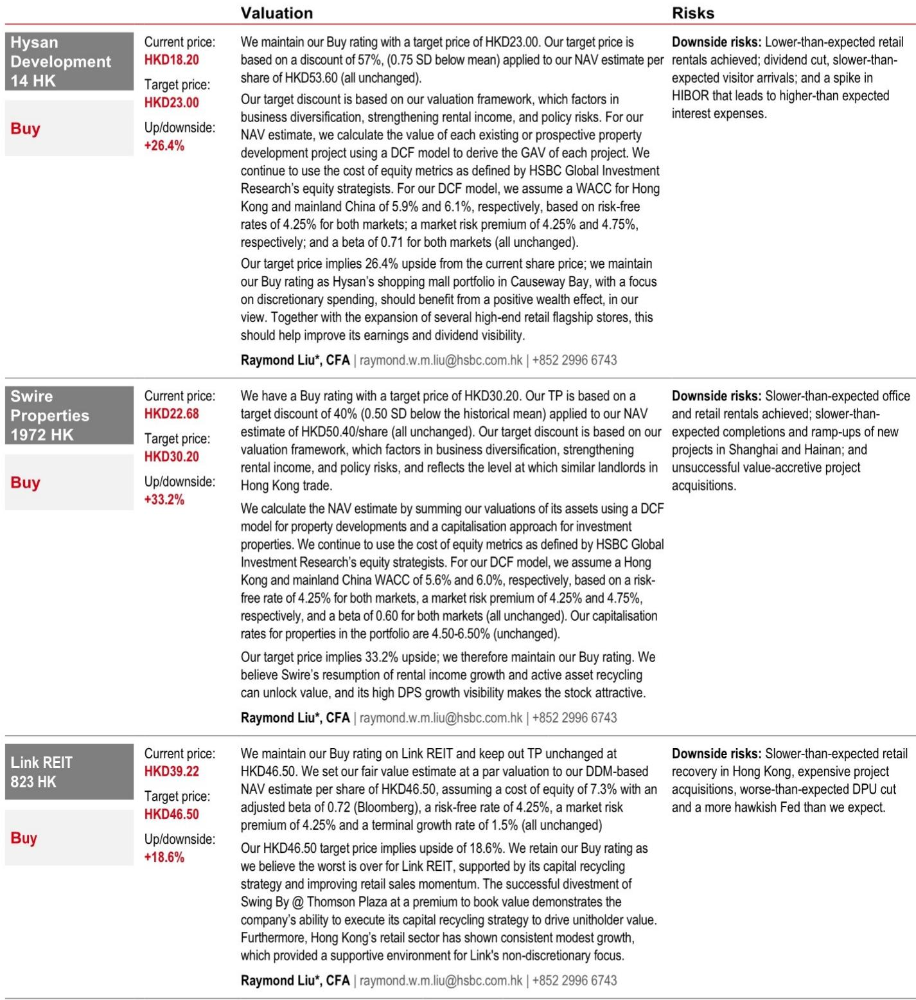
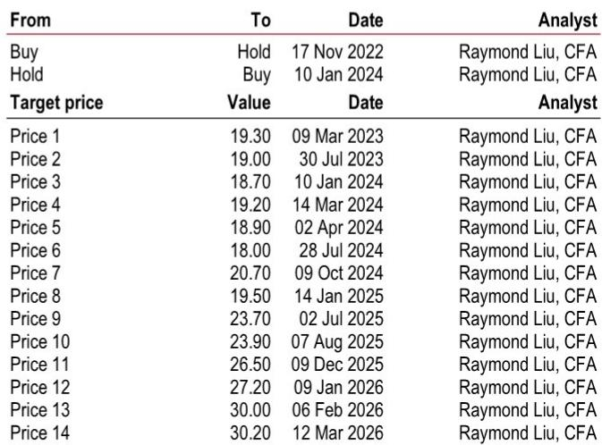
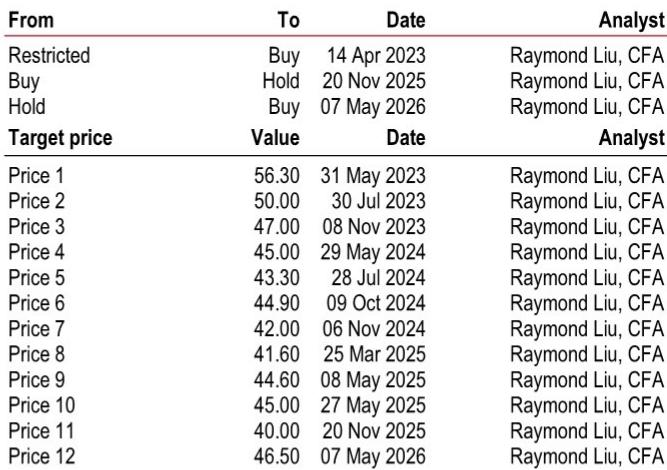

# Hong Kong Retail Landlords Face a Narrowing Window of Recovery as the Base Effect Turns from Tailwind to Headwind

Hong Kong's retail sales have now posted twelve consecutive months of year-on-year expansion, with April 2026 delivering an 8.6 percent gain. For the first four months of 2026, aggregate growth reached 11.3 percent. These numbers appear to tell a story of sustained recovery. But the real strategic question for investors is not whether the recovery is happening—it is how much of the recovery is already priced in, and what happens when the arithmetic turns against the sector.

The critical insight that the raw data does not immediately reveal is this: the recovery is about to enter a phase where the base effect shifts from a powerful tailwind to a measurable headwind. The same period in 2025 that produced the low bases fueling current comparisons will soon be replaced by months that already reflect recovering activity. By the second half of 2026, year-on-year comparisons will become structurally harder, and the market will need to distinguish between genuine demand improvement and statistical noise. Investors who treat the current momentum as a linear trend risk misallocating capital at precisely the moment when selectivity matters most.

This is not a call to abandon the sector. Several high-quality landlords are executing well, tenant sales are improving, and rental reversions are narrowing. But the window for broad-based, undifferentiated exposure to Hong Kong retail real estate is closing. The next twelve months will separate landlords who can generate organic earnings growth from those who were simply riding the arithmetic of low comparisons. The report flags this explicitly, noting that a higher base effect and growing penetration from mainland Chinese e-commerce operators should result in a more gradual retail sales improvement in the coming months. The question for investors is which landlords have the asset quality, tenant mix, and balance sheet discipline to outperform in a moderating environment.

## The Recovery Is Broadening, But the Composition of Growth Reveals Underlying Fragility

The headline figure of 8.6 percent year-on-year growth in April 2026 masks a more complex picture than the aggregate suggests. The recovery is becoming more balanced, broadening from luxury-led spending to include some mass-market consumption. This is a genuinely positive development. A recovery that depends solely on high-end tourism spending is inherently vulnerable to shifts in travel patterns and geopolitical sentiment. The broadening into mass-market categories provides a more diversified revenue base for landlords whose portfolios span multiple price points.

However, the category-level data reveals where the real strength lies and where it remains absent. Consumer durable goods surged 26.2 percent year-on-year, while jewellery, watches, clocks, and valuable gifts rose 19.8 percent. These are the categories most directly tied to tourist spending, particularly from mainland Chinese visitors. They are also the categories most exposed to the base effect shift. As the comparison periods move into months where these categories had already begun recovering, the growth rates will naturally decelerate.

More concerning is what is happening at the other end of the spectrum. Department store sales declined 6.7 percent year-on-year. Fuels fell 11.7 percent. These are not marginal categories. The department store segment, in particular, serves as a bellwether for mid-market consumer confidence and domestic spending patterns. A decline in this segment suggests that the local population remains cautious in its spending behavior, even as tourist-driven categories show strength. This divergence matters because it implies that the recovery is not yet self-sustaining. If tourist spending moderates—whether due to base effects, changing travel preferences, or macroeconomic conditions in mainland China—there may not be sufficient domestic demand to fill the gap.

The report also notes that retailers need to continuously adapt to changing value-led spending behaviors and introduce more service and product ranges to attract customers. This is not a discretionary observation. It is a structural statement about the evolution of Hong Kong's retail market. The era of passive rental growth driven by tourist volume alone is over. Landlords who can help their tenants adapt—through flexible leasing, experiential retail concepts, and data-driven tenant mix optimization—will outperform those who treat their properties as passive income streams.

## Tenant Sales Data from Major Landlords Suggests a Divergence Between Prime Assets and Secondary Locations

The most instructive data in the report may not be the aggregate retail sales figures but the read-across from individual landlords. The chairman of Wharf REIC expressed optimism about the Hong Kong retail outlook for the first time since the COVID-19 pandemic, citing early indications of a turning point. This is a signal worth taking seriously. Wharf REIC's portfolio is heavily weighted toward high-end assets, and its chairman has been notably cautious in recent years. A public shift in tone from a major landlord with direct exposure to luxury spending patterns carries more weight than any single data point.

Similarly, Swire Properties' Pacific Place delivered an outperformance in tenant sales versus the overall market. This is consistent with the pattern we have observed throughout the recovery: prime assets in central locations with strong tenant rosters and high footfall are recovering faster than secondary or tertiary properties. Henderson Land reported that tenant sales across its mall portfolio exceeded 10 percent growth during the May holiday period. For Link REIT, tenant sales displayed some improvement in its community malls, though the language in the report suggests the improvement was more modest.

The divergence between asset tiers is not a temporary phenomenon. It reflects a structural shift in how consumers and tourists allocate their spending. Visitors to Hong Kong are increasingly selective about where they shop and what they buy. The days of broad-based spending across all retail categories and all locations are unlikely to return in full force. Landlords with prime, well-located, well-managed assets will continue to see tenant demand and rental stability. Landlords with secondary assets, particularly those reliant on mass-market domestic spending, will face a more challenging environment as e-commerce penetration continues to grow and outbound travel by locals remains frequent.

The report explicitly identifies this dynamic, noting that the retail market is still facing challenges such as changes in tourist spending patterns and more frequent outbound travel by locals. These trends should continue, resulting in some leakage in tenant sales and a more gradual improvement compared to previous cycles. For investors, this means that asset selection within the Hong Kong retail landlord universe is not a matter of marginal preference. It is the primary determinant of risk-adjusted returns.

## The Base Effect Shift Will Create a Critical Test for Earnings Visibility in the Second Half of 2026

The most important analytical question for the remainder of 2026 is not whether retail sales will continue to grow in absolute terms. It is whether the rate of growth will decelerate sufficiently to challenge the earnings expectations embedded in current valuations. The report provides the framework for answering this question by highlighting the base effect dynamic explicitly.

Retail sales grew 11.3 percent in the first four months of 2026. But the comparison periods for the second half of 2026 will be significantly more challenging. By the middle of 2025, the recovery was already underway, meaning the base for year-on-year comparisons will be higher. The report estimates that retail sales growth will moderate in the second half, and the data already shows a deceleration from the 12.8 percent growth recorded in March 2026 to the 8.6 percent recorded in April.

This deceleration is not a cause for alarm in itself. A moderation from double-digit to high single-digit growth is consistent with a maturing recovery. The concern is whether the deceleration overshoots expectations. If growth falls to the low single digits or turns negative in certain months, the impact on landlord earnings could be more significant than the market currently anticipates. Rental reversions have been narrowing, but they remain negative for many malls. A further slowdown in tenant sales could delay the transition from negative to positive rental reversions, compressing the earnings recovery timeline.

The report's investment ideas are instructive in this context. The analysts like Hysan, Swire Properties, and Link REIT, all rated Buy. Each of these names has specific catalysts that go beyond the general recovery story. For Hysan, the focus is on improving tenant sales performance at its high-end malls combined with faster than expected capital recycling initiatives. For Swire Properties, the thesis centers on its transformation into an integrated commercial landlord and the earnings recovery that should support a re-rating. For Link REIT, the emphasis is on growing DPU resiliency and the restart of its buyback campaign.

These are not generic recovery plays. They are specific investment theses that depend on company-specific execution as much as on the macro environment. This is precisely the kind of selectivity that will matter more as the base effect tailwind fades.

## What the Report Does Not Fully Answer: The Interaction Between E-Commerce Penetration and Physical Retail Rental Rates

The report acknowledges that growing penetration from mainland Chinese e-commerce operators will be a factor in moderating retail sales growth. This is an important acknowledgment, but it raises a question that the report does not fully resolve: how will the structural shift toward e-commerce affect the equilibrium rental rates for physical retail space in Hong Kong?

The traditional model for Hong Kong retail landlords has been that prime location and footfall provide pricing power that insulates them from e-commerce competition. This model is being tested. Mainland Chinese e-commerce operators are not just competing on price and convenience. They are increasingly sophisticated in their use of social commerce, live streaming, and cross-border logistics. For categories like cosmetics, fashion accessories, and even some consumer durables, the convenience of online shopping combined with competitive pricing is a genuine substitute for physical retail.

The question is whether this substitution effect is primarily affecting lower-tier assets or whether it is beginning to encroach on prime locations as well. If e-commerce penetration primarily affects community malls and secondary retail corridors, then the impact on landlords like Swire Properties and Hysan, whose portfolios are concentrated in prime locations, may be manageable. If the effect spreads to prime locations, the implications for rental growth assumptions would be more significant.

The report does not provide a definitive answer to this question, and it would be unreasonable to expect one. The data on e-commerce penetration in Hong Kong is still evolving, and the behavior of mainland Chinese consumers in Hong Kong specifically may differ from their behavior at home. But investors should monitor this dynamic closely. The landlords that can demonstrate resilience in tenant sales and rental rates despite growing e-commerce competition will deserve a premium valuation. Those that cannot will face an increasingly difficult operating environment.

## A Decision Framework for Investors: Three Filters for Selecting Hong Kong Retail Landlord Exposure

Given the moderating growth outlook, the base effect shift, and the structural challenges from e-commerce and changing tourist behavior, investors need a clear framework for selecting exposure within the Hong Kong retail landlord universe. The following three filters are designed to separate landlords that can deliver relative outperformance from those that are merely riding the macro wave.

First, asset quality and location concentration. Landlords with portfolios concentrated in prime, high-footfall locations with strong tenant rosters will have more pricing power and greater ability to maintain occupancy and rental rates during periods of moderation. The report's data on Pacific Place's outperformance relative to the overall market is consistent with this principle. Investors should favor landlords whose portfolios are weighted toward assets that have demonstrated relative resilience in tenant sales.

Second, balance sheet flexibility and capital recycling capability. The report highlights Hysan's faster than expected capital recycling initiatives as a positive catalyst. This is not a coincidence. Landlords that can actively manage their portfolios—selling non-core assets, reinvesting in higher-return opportunities, and maintaining balance sheet capacity for opportunistic acquisitions—will have more tools to navigate a moderating environment. Landlords with high leverage or limited liquidity will be forced to be passive, which is a disadvantage when the macro tailwind is fading.

Third, tenant mix adaptability and experiential retail exposure. The report notes that retailers need to continuously adapt to changing value-led spending behaviors. Landlords that can facilitate this adaptation—through flexible leasing terms, investment in common areas and amenities, and curation of tenant mixes that include experiential and service-oriented concepts—will be better positioned to maintain footfall and tenant demand. Landlords that treat their properties as static income streams will see tenant demand erode as consumer preferences evolve.

These three filters are not exhaustive, but they provide a structured approach to evaluating the Hong Kong retail landlord universe at a time when the easy comparisons are behind us and the hard work of organic earnings growth lies ahead.

## The Full Report Contains the Charts and Data That Make These Distinctions Visible

The argument presented here is based on the analytical framework and data points available in the report. But the full report contains the charts and detailed data that allow investors to test these conclusions against the actual numbers. The relationship between retail sales growth and the Hang Seng Index, the breakdown of sales by category over time, the comparison of Hong Kong's retail performance against other Asian markets, and the detailed financial metrics for each landlord mentioned are all essential tools for making informed investment decisions.

Join the community to read the full report and review the original charts.

*This article is for learning and discussion only and does not constitute investment advice.*

Personal reading notes and learning share only. Not investment advice.

