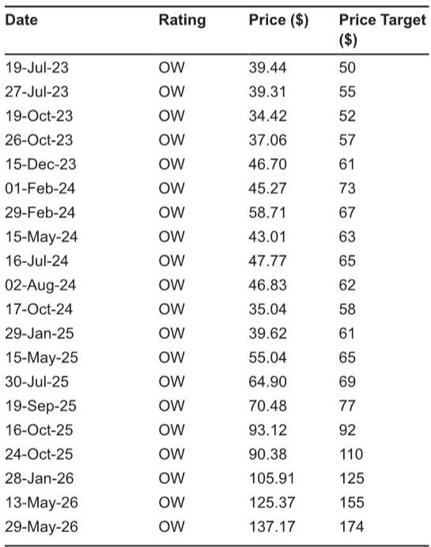
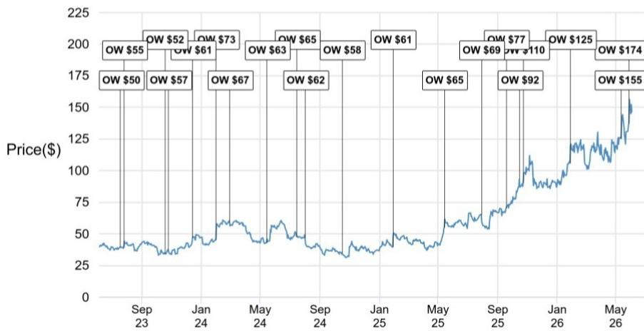
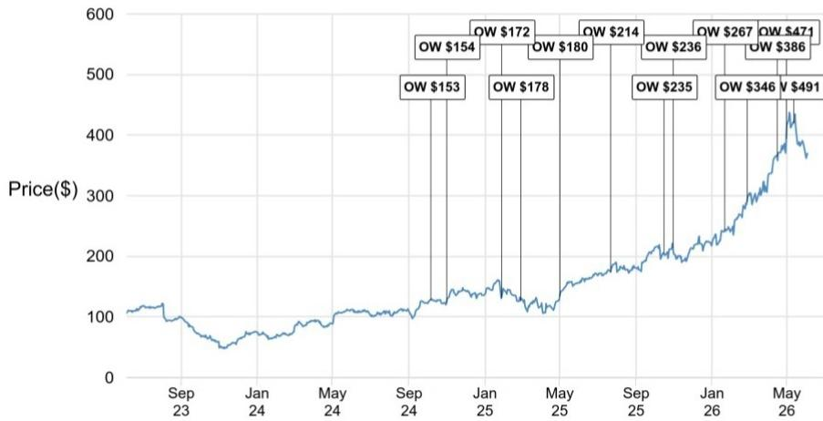

# 清洁能源的真正拐点不是需求爆发，而是供给侧的结构性重塑

2026年6月初，某外资投行在休斯顿CleanPower大会后发布了一份调研笔记。参会的开发者、EPC承包商和设备制造商传递出的信号非常一致：电力需求正在经历一代人未见的增长，AI、工业化和电气化三重动力叠加，正在创造一个让所有参与者都感到“难以置信”的市场环境。

但这份报告的核心价值，并不在于确认需求有多旺盛。市场对清洁能源的需求叙事已经足够熟悉。真正值得反复咀嚼的判断是：这一轮增长周期的赢家结构正在被重新定义，规模、资产负债表和执行确定性正在成为比技术路线更关键的筛选标准。而储能、机器人等子领域的加速渗透，正在从边际变量转变为结构性变量。

以下是我们从这份研报中提炼出的五个关键洞察，以及一个报告尚未完全回答的关键问题。

## 1. 需求侧已经不需要论证，但“为谁供电”正在重塑整个产业链的信用结构

大会上几乎每一场对话都以“难以置信的电力需求”开场。开发商的共识是，太阳能和风能在满足新增发电需求方面将与化石燃料同等重要。但真正值得注意的，不是需求总量，而是需求结构的变化。

报告指出，互联队列（interconnection queues）正在被高质量的、具备信用背书的购电方填满，这些购电方签署的是长期购电协议。这与过去充斥投机性项目的开发周期形成了鲜明对比。换句话说，清洁能源项目的买家画像正在从“赌未来电价”的金融玩家，转向拥有真实负荷和长期规划的产业巨头。

这一变化的含义是深刻的：当购电方的信用等级提升，项目的融资成本、审批速度和执行风险都会同步改善。对于拥有成熟项目管道和大型客户关系的开发商而言，这是一个正向循环。而对于那些依赖短期合约或资质不明的购电方的项目，市场正在自动关闭大门。

## 2. 储能不再是附加选项，而是默认配置——但数据中心储能的市场规模仍是最大变量

报告清晰地指出，储能与太阳能联合开发正在从“可选附加项”转变为“默认配置”。在ERCOT、CAISO和PJM等关键市场，独立储能项目在商业基础上的承销条件已经非常有利，价差套利和容量市场收入共同支撑了项目的经济性。

BESS（电池储能系统）用于数据中心备用电源和负荷管理是大会的热门话题，尤其是某储能公司与英伟达和西门子最近宣布的合作。但报告也诚实地指出，数据中心驱动的BESS市场的整体规模，仍然是许多与会者心中的关键问题——包括那些形容当前数据中心BESS需求“高得离谱”的储能开发商。

这里有一个值得注意的张力：一方面，储能成本正在超预期下降。报告提到，磷酸铁锂电池系统成本已经低于行业对2026年的预期。另一方面，储能技术能否真正满足数据中心对可靠性的要求，仍然存在争议。多位与会者指出，在储能技术取得进一步突破之前，可再生能源还无法完全满足数据中心的可靠性需求。

这意味着，储能板块的短期增长是确定的，但“数据中心储能”这个细分赛道的爆发时点和天花板，仍然需要更多数据来验证。对于投资者而言，区分“确定性增长”和“高弹性但高不确定性”的子领域，将是下半年配置的关键。

## 3. 机器人技术在EPC和运维中的渗透，正在从“试点”进入“规模化部署”阶段

这是一个容易被忽视但意义重大的变化。报告指出，熟练劳动力的短缺正在倒逼开发商和承包商采用机器人解决方案。大会上的多家机器人公司展示了自动面板清洁、无人机巡检、植被管理、线缆管理和太阳能板安装等技术。

关键信号在于：许多解决方案已经达到“显著成熟度和行业采用水平”，部分公司声称其解决方案已部署或管理了双位数GW的规模。机器人面板清洁和基于无人机的热成像巡检，在超过一定规模的公用事业级项目上已经成为标准做法。

更重要的是，报告引用了大会上的案例研究，表明AI驱动的监控平台与自主巡检机器人结合，可以显著压缩每兆瓦时的运维成本，这种改善已经开始在项目层面的回报率中体现出来。

对于投资者而言，这意味着清洁能源的“后市场”正在从人力密集型转向技术密集型。那些能够将机器人解决方案规模化、标准化的公司，可能正在建立一个被当前市场低估的长期护城河。

## 4. 规模化正在成为唯一的护城河，小型开发商面临生存危机

这是整份报告中最具战略判断力的部分。报告指出，互联复杂性、设备采购规模和资本密集度这三个因素的叠加，正在创造一种“自然选择”机制——更大、资本更充裕的运营商占据优势，而小型开发商正在被挤出。

具体来说，互联队列的拥堵和审批不确定性，意味着只有拥有成熟关系和经验的团队才能有效推进项目。设备采购的规模效应，使得大型开发商在光伏组件、逆变器和储能系统上获得更优惠的定价和交付承诺。而项目规模本身也在快速膨胀——过去100-200MW的项目，现在越来越多地以500MW到1GW以上的规模开发。

这一趋势正在被超大规模云服务商进一步强化。报告指出，这些科技巨头越来越倾向于将采购集中到能够交付GW级管道、具备执行确定性的大型、信用良好的对手方。

这意味着，清洁能源行业正在经历一场“机构化”进程。对于小型开发商而言，要么被收购，要么转向利基市场，否则将难以在主流市场竞争。对于投资者而言，那些已经建立起规模化优势、拥有深厚EPC能力和供应商关系的公司，正在获得一种自我强化的竞争优势。

## 5. 报告尚未完全回答的关键问题：技术突破与商业化的时间差

尽管报告对储能和机器人的前景持积极态度，但它也诚实地指出了几个尚未被充分回答的问题。

第一个问题是：储能技术的下一步突破何时到来？报告指出，当前LFP电池的成本下降速度已经超出预期，但可再生能源要完全满足数据中心的可靠性要求，还需要储能技术的进一步演进。这个“进一步”是多长时间？是两年还是五年？这直接决定了数据中心储能市场的爆发时点。

第二个问题是：机器人技术的规模化能否持续降低运维成本？报告中的案例研究令人鼓舞，但案例研究的样本量、地域分布和长期效果仍然需要更多数据来验证。如果运维成本降低的幅度被证明是可持续的，那么它将从根本上改变项目的全生命周期经济性。

第三个问题是：行业整合的速度和深度。报告描述了大型开发商正在获得优势，但没有给出具体的整合节奏。哪些细分领域将最先出现并购潮？估值水平是否已经反映了整合溢价？

这些未解问题，恰恰是深入阅读完整报告、与行业参与者持续对话的价值所在。它们不是报告的缺陷，而是这一轮增长周期中真正需要被跟踪和验证的关键变量。

---

如果你对以上任何一个洞察背后的数据支撑、公司层面的具体受益逻辑，或者报告中对四家重点覆盖公司的详细分析感兴趣，欢迎加入我们的星球微信群继续讨论。在那里，我们可以一起拆解报告中的原始图表、探讨未解问题的可能答案，并跟踪这些判断在接下来的季度中如何被验证或修正。

Personal reading notes and learning share only. Not investment advice.

