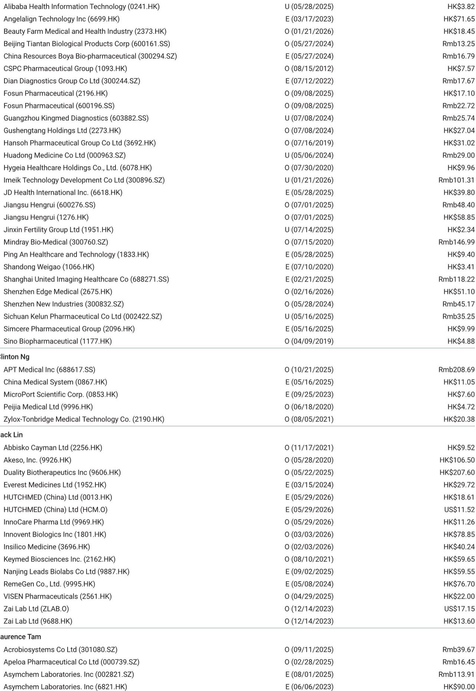
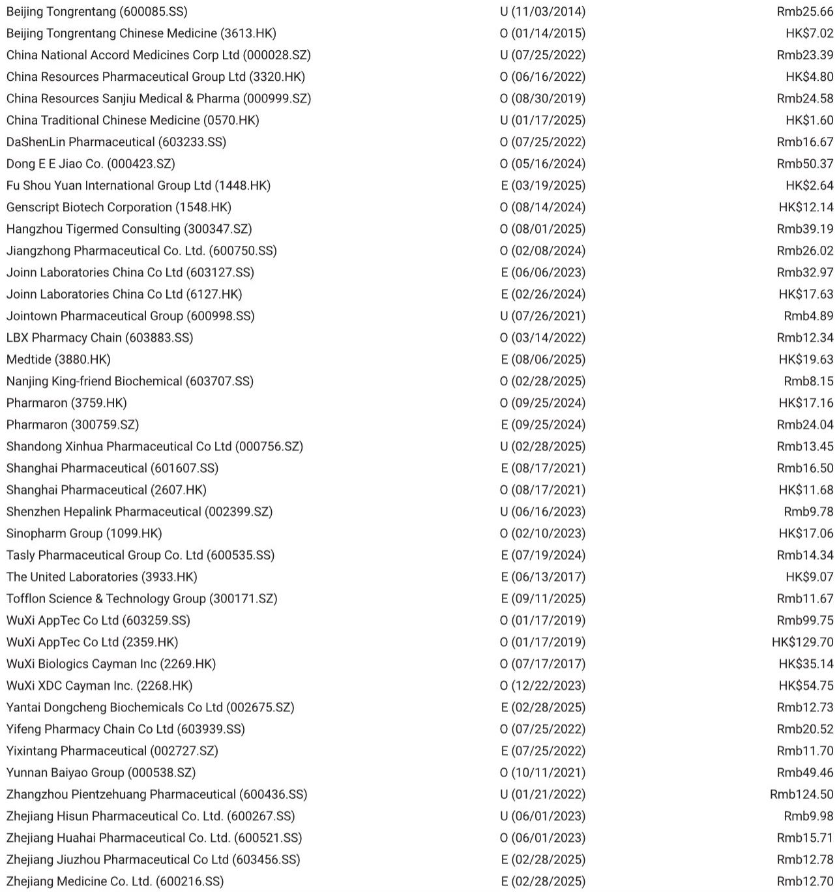
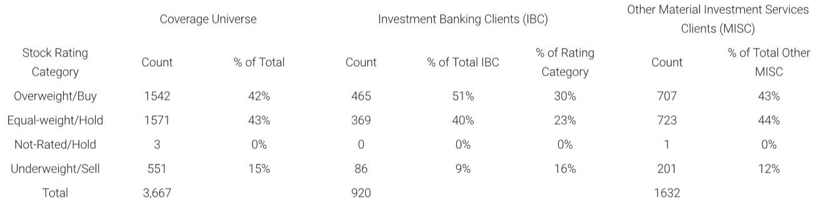

# 中国生物科技融资的真正拐点不在总量，而在结构

2026年5月的数据，放在过去两年的坐标系里看，会得出一个截然不同的结论。

某外资投行最新发布的月度跟踪报告显示，中国生物科技融资总额环比增长28%，达到约7.65亿美元。单看这个数字，市场可能会认为行业融资环境正在温和改善。但真正值得关注的信号，藏在两个结构性变化里：一是公开市场融资环比飙升138%至6.75亿美元，二是对外授权交易总金额暴增至约270亿美元，是4月的15倍。

这两个数字合在一起，意味着中国生物科技行业的资金循环模式正在发生根本性转变。过去依赖风险投资支撑研发的阶段正在过去，取而代之的是两条更成熟、也更具门槛的路径：头部公司通过公开市场融资，优质管线通过全球药企的授权交易变现。这不是一个所有参与者都能受益的复苏，而是一个分水岭正在形成。

## 1. 公开市场融资的爆发，掩盖了风险投资端的急剧收缩

5月私募融资骤降至9000万美元，环比下降72%。这个数字是过去两年来的最低点之一，仅次于2024年9月的水平。而同期公开市场融资却创下6.75亿美元的高位，主要由两家公司的大规模定向增发驱动。

这两组数据放在一起，揭示了一个关键判断：风险投资对中国生物科技的态度正在从“广撒网”转向“极度挑剔”。私募融资的萎缩不是暂时的波动，而是行业风险偏好系统性下降的结果。过去三年，大量同质化管线、缺乏差异化靶点的公司，已经消耗了风险资本的耐心。现在，只有那些已经进入临床后期、或拥有明确全球权益的资产，才能获得私募融资。

与此同时，公开市场的融资能力则集中在少数头部公司。这两家进行定向增发的公司，均已在A股上市，拥有成熟的商业化产品和稳定的现金流。公开市场愿意为它们加仓，不是因为行业整体向好，而是因为这些公司已经证明了自己具备持续的研发产出能力和商业化执行力。

这意味着，5月融资总额的反弹并不代表行业融资环境的全面回暖。它更像是一个“马太效应”的加速器：头部公司更容易拿到钱，尾部公司正在被挤出融资市场。对于投资者而言，跟踪融资数据时不应只看总量，而应关注融资分布的集中度。如果未来几个月私募融资继续低迷，而公开市场融资依然集中在少数几家公司，那么行业内部的优胜劣汰将比市场预期的更为剧烈。

## 2. 对外授权交易规模跃升，但首付比例才是真实的定价信号

5月对外授权交易总金额达到约270亿美元，环比增长15倍，同比增长181%。这一数字的飙升主要来自两笔超级交易：恒瑞医药与百时美施贵宝的152亿美元合作，以及信达生物与辉瑞的105亿美元打包协议。

表面上看，这是中国生物科技管线全球价值获得认可的标志。但需要仔细拆解的是交易结构。恒瑞的协议涉及13个早期肿瘤和血液管线，包括4个对外授权、4个引进授权和5个共同开发项目。信达的协议则覆盖12个资产，包括4个共同开发和8个对外授权。这些都不是简单的“卖管线”，而是深度的全球合作开发安排。

真正的定价信号，隐藏在首付比例中。根据报告披露的数据，5月对外授权交易的平均首付比例约为4.5%。这个数字虽然高于4月的1.5%，但远低于2025年8月创下的32.5%的高点。首付比例的高低，直接反映了买方对管线价值的确定性判断。当买方愿意支付高比例首付时，意味着他们对资产的临床数据、监管路径和商业前景有高度信心。反之，低首付、高里程碑的交易结构，说明买方将更多风险转移给了卖方。

从这个角度看，5月交易总金额的暴增，更多反映的是交易管线数量的增加和潜在总价值的膨胀，而不是单笔资产估值的大幅提升。恒瑞和信达的协议虽然总金额惊人，但首付比例仍处于历史低位区间。这一现象背后，有可能意味着全球药企对中国管线的兴趣正在上升，但它们的支付意愿仍然高度保守，更愿意用里程碑付款来分摊风险。

对于行业而言，这既是机遇也是挑战。机遇在于，中国生物科技公司有了更多与全球药企合作的机会，尤其是早期管线的共同开发模式正在成为主流。挑战在于，这种模式对公司的现金管理能力提出了更高要求——低首付意味着短期内现金流改善有限，公司需要依靠自身储备或其他融资渠道来支撑研发，直到里程碑触发。

## 3. 融资结构的转变，正在重塑中国生物科技的竞争逻辑

综合融资和授权两方面的数据，一个清晰的图景正在浮现：中国生物科技行业正在从“融资驱动研发”的模式，转向“授权驱动价值”的模式。

在旧的模式下，一家公司能否推进研发，取决于它能否持续从风险投资或公开市场获得资金。研发管线的价值，最终通过上市产品的销售收入来兑现。这个周期漫长且充满不确定性，对公司的资本消耗极大。

在新的模式下，研发管线的价值可以在更早的阶段通过对外授权交易来部分变现。这不仅缩短了投资回报周期，更重要的是，它将风险从中国公司转移到了全球药企身上。全球药企拥有更强的临床开发能力、更广的市场覆盖和更丰富的监管经验，它们愿意为有潜力的管线支付里程碑付款，本质上是对管线价值的第三方认证。

但这一模式并非对所有公司都友好。它要求公司拥有真正差异化的管线，能够在早期就引起全球药企的兴趣。对于那些做fast-follow或me-too策略的公司来说，它们既难以在私募市场获得融资，也难以在授权交易中拿到好的条款。它们的生存空间正在被快速压缩。

报告的图表数据也支持这一判断。从2024年1月到2026年5月，私募融资和公开市场融资的月度波动都在加大，但趋势方向截然不同。私募融资在2024年底达到6.5亿美元的高点后持续下滑，而公开市场融资则在2025年初达到峰值后震荡回落但始终高于2024年水平。这种分化不是短期的，而是行业结构性调整的反映。

## 4. 报告尚未完全回答的关键问题：低首付交易能否持续驱动行业正向循环

尽管5月的数据令人振奋，但一个关键问题仍然悬而未决：低首付、高里程碑的交易结构，能否真正支撑中国生物科技公司的长期发展？

从财务角度看，低首付意味着公司在前几年仍然需要依靠自身资金或外部融资来维持运营。如果私募融资持续萎缩，而公开市场融资又只对少数头部公司开放，那么大多数中小型生物科技公司将面临“青黄不接”的困境。它们虽然有授权交易在手，但短期内无法从中获得足够的现金流来支撑研发。

从战略角度看，低首付交易往往伴随着更复杂的合作条款，包括共同开发权的分配、知识产权的归属、以及未来利润的分成比例。这些条款的细节，决定了中国公司能从交易中获得的真实价值。报告没有披露这些具体条款，而这恰恰是判断交易质量的关键。

此外，还有一个二阶影响值得关注：当越来越多的中国公司通过对外授权实现管线价值时，全球药企对中国管线的定价能力会增强还是减弱？如果供给增加，买方可能会变得更加挑剔，首付比例可能进一步下降。这反过来又会压缩中国公司的谈判空间。

这些问题的答案，取决于未来几个季度的交易数据。如果首付比例能够回升到10%以上，说明全球药企对中国管线的信心在增强。如果首付比例继续维持在5%以下，那么交易总金额的增长可能只是“虚胖”，对行业基本面的改善有限。

## 5. 投资者需要盯住的三个先行指标

基于上述分析，对于关注中国生物科技行业的投资者和决策者，有三个指标比月度融资总额更能反映行业的真实状态。

第一，私募融资的月度变化趋势。如果私募融资在未来两个月仍然低于1.5亿美元，说明风险资本对行业的信心尚未恢复。这将加剧中小型公司的生存压力，并可能引发一轮并购整合潮。

第二，对外授权交易的首付比例。这是全球药企对中国管线定价意愿的最直接信号。如果首付比例持续低于10%，说明买方仍然将中国管线视为高风险、高回报的期权，而非已经验证的价值。

第三，公开市场融资的集中度。如果未来公开市场融资仍然集中在少数几家已上市公司，说明二级市场对生物科技行业的风险偏好仍然高度分化。那些没有稳定收入和商业化产品的公司，将很难通过公开市场获得资金。

这三个指标合在一起，可以构建一个比“融资总额”更精细的行业健康度评估框架。它们分别对应了行业的外部资本供给、管线价值认可度、以及头部公司的资金获取能力。

## 6. 报告埋下的伏笔：行业分化才刚刚开始

这份月度报告虽然只覆盖了一个月的数据，但其中蕴含的行业信号远比单月数字丰富。融资结构的转变、授权模式的演进、以及首付比例的波动，都在暗示中国生物科技行业正在进入一个“价值分化”的新阶段。

在这个阶段，行业的整体融资规模可能不会出现爆发式增长，但优质公司和优质管线的价值将被重新定价。那些能够持续产出差异化管线、并与全球药企建立深度合作的公司，将获得更高的估值溢价。而那些依赖融资续命、缺乏核心竞争力的公司，将面临越来越大的生存压力。

报告没有完全展开的一个方向是：这种分化对行业并购格局的影响。当中小型公司融资困难、而头部公司手握大量现金时，并购的窗口正在打开。但并购的定价逻辑是什么？是管线价值、团队能力、还是临床数据？这需要更深入的分析。

同样值得追问的是，低首付授权交易是否会对中国公司的资产负债表产生隐性压力？如果里程碑无法按时实现，公司是否需要计提减值？这些会计处理方式，可能会影响市场对相关公司的盈利预期。

这些问题，正是这份研报在数据之外留给读者的思考空间。如果你对上述问题的答案感兴趣，欢迎来星球微信群里继续讨论。我们会结合更多原始图表和跨期数据，深入拆解这些结构性变化对中国生物科技投资框架的长期影响。

Personal reading notes and learning share only. Not investment advice.

