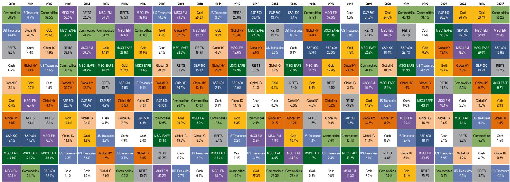
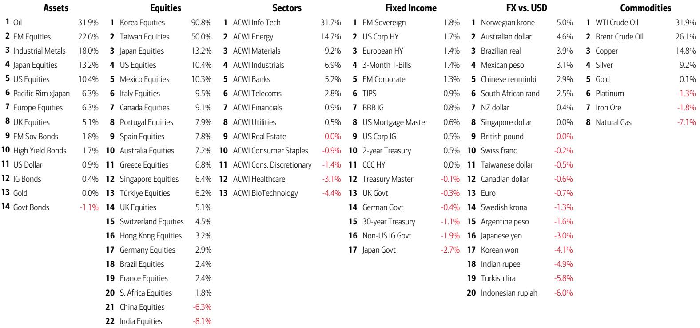
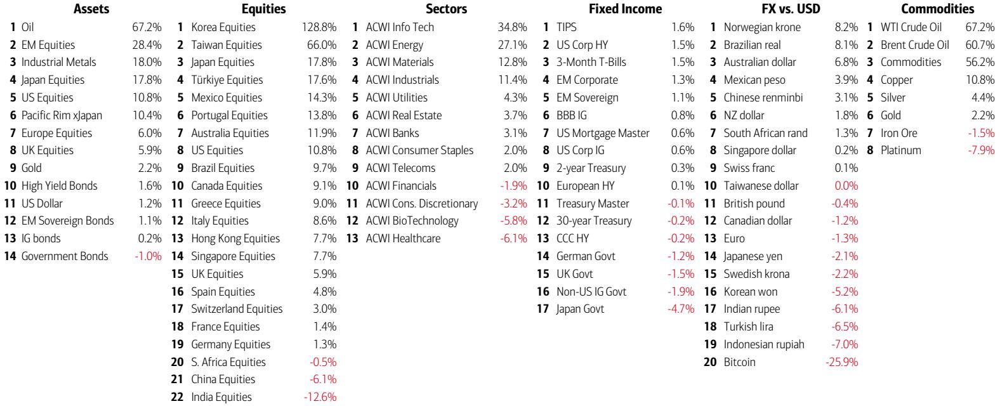

# The Wealth Boom Loop Is Now the Central Bankers' Trap: Why Record Stock Wealth Is Creating a Policy Paradox That Markets Have Not Yet Priced

The most dangerous phrase in markets today is not "recession" or "default." It is "wealth effect." US household equity wealth has surged by $6 trillion year-to-date, following gains of $10 trillion in 2025 and $9 trillion in 2024. This is not a benign backdrop for a soft landing. It is a self-reinforcing cycle in which rising asset prices fuel consumption, which fuels inflation, which forces central banks to tighten, which threatens the very asset prices that started the loop. The market is currently treating this as a virtuous circle. The historical record suggests it is anything but.

The numbers demand a reexamination of the prevailing narrative. The BofA Bull & Bear Indicator has risen to 8.7, now in its third consecutive week of "sell signal" territory. Since 2002, there have been 17 such signals, and global stocks have posted average losses of 2-3% over the subsequent two to three months, with maximum drawdowns of 15-20%. The indicator is not a timing tool—tops are a process, not a moment—but it is a warning that sentiment has reached levels from which the path of least resistance has historically been lower.

The deeper structural issue is that central banks are now behind the curve. According to the report, 46 out of 68 global central banks are currently overshooting their inflation targets. The US Federal Reserve, the European Central Bank, and the Bank of Japan are all facing inflation rates above their stated goals. The market is pricing rate hikes, not cuts. The yield curve is bear-flattening. Long-duration assets, leverage, and emerging market currencies are all struggling. The Korean won is near levels last seen during the Global Financial Crisis and the Asian Crisis. The Indonesian rupiah is at a record low. The Indian rupee is at historic lows. This is not a localized stress event; it is a global repricing of the assumption that inflation is under control.

This article argues that the wealth-equity "boom loop" is creating a policy paradox that markets have not yet fully priced. The very mechanism that has driven equity markets to new highs is also the mechanism that is forcing central banks to tighten into a slowing global economy. The result is a narrowing path between a "Goldilocks" scenario and a regime shift that could upend the current risk-on positioning.

## The "Boom Loop" Is Real, But It Is Also the Mechanism That Will Break Itself

The report documents a striking pattern: US household equity wealth has risen by $6 trillion year-to-date, following $10 trillion in 2025 and $9 trillion in 2024. This is not simply a reflection of higher stock prices. It is a feedback loop. Rising equity values increase household wealth, which boosts consumption, which drives corporate earnings, which pushes stock prices higher. The BofA Private Client data shows that equity allocations have reached a record high of 66.1% of assets under management, while cash holdings are also at a record high. This is the K-shaped economy in its most extreme form: the wealthiest households are benefiting disproportionately from the equity boom, and their consumption patterns are driving inflation in the services and luxury goods sectors.

The problem is that this loop is inherently unstable. The report shows that the US unemployment rate is on the verge of falling below the inflation rate for only the seventh time since 1960. The previous instances—1966, 1973, 1990, 2000, 2008, and 2021—were all years that preceded significant market stress. When unemployment is lower than inflation, the labor market is tight enough to drive wage growth, but inflation is not falling fast enough to accommodate it. This is the definition of a policy dilemma: the Fed cannot cut rates without risking a reacceleration of inflation, but it cannot hold rates steady without risking a slowdown in the real economy.

The "so what" here is that the boom loop is not self-sustaining. It relies on the assumption that inflation will continue to moderate, allowing central banks to ease or at least hold steady. But the data suggests otherwise. The report notes that US CPI has been rising by 0.6% month-over-month for the past three months and 0.4% over the past six months. If the May CPI print comes in above 0.4%, US CPI will be above 4% year-over-year, and on course for 5% by the US midterm elections. Historically, once CPI crosses 4%, the S&P 500 has averaged a 4% decline over the next three months and a 7% decline over the next six months.

This is the trap. The wealth boom is creating inflation, and inflation is creating the conditions for a policy response that will break the boom. The market is not pricing this risk because it is focused on the near-term momentum of earnings and the resilience of the consumer. But the consumer is not monolithic. The K-shape means that the top decile is driving consumption, while the bottom half is increasingly stretched. The political consequences of this divergence are already visible: the report notes that Trump's inflation approval rating has fallen below Biden's lows. The wealth boom is creating a political backlash that will only intensify as inflation remains sticky.

## Central Banks Are Behind the Curve, and the Yield Curve Is Sending a Warning That Markets Are Ignoring

The report highlights a striking statistic: 46 out of 68 global central banks are currently overshooting their inflation targets. This is not a US-specific problem. It is a global phenomenon. The ECB is facing inflation of 3.2% against a 2% target. The Bank of Japan is facing inflation that is forcing it to consider rate hikes to prevent the yen from breaking through the "Maginot Line" of 160 against the dollar. The Bank of England is facing inflation above 3% against a 2% target. The pattern is clear: central banks around the world are struggling to bring inflation back to target, and they are being forced to tighten into a global economy that is showing signs of slowing.

The implication for the yield curve is profound. The report shows a strong correlation between the unemployment rate minus CPI and the US 2s10s yield curve. When unemployment is below inflation, the yield curve tends to invert. This is exactly what the data is pointing to now. The curve is already inverted, and the report suggests that it could remain inverted or even steepen in a bear-flattening fashion as central banks are forced to hike rates further.

The "so what" is that long-duration assets are at risk. The report notes that 30-year bond yields in the UK could test 6%, US yields could test 5%, and Japanese yields could test 4%. These levels would be highly disruptive for risk assets, given that positioning is bullish and profit expectations are high. The report lists a series of June events that could trigger this repricing: the US payrolls report, the US CPI print, the ECB meeting, the Bank of Japan meeting, and the first FOMC meeting under Kevin Warsh. Each of these events carries the potential to shift the narrative from "inflation is moderating" to "inflation is sticky and central banks are behind the curve."

The market is currently pricing a Goldilocks scenario in which the Fed can hold rates steady while inflation gradually falls. But the data suggests that this scenario is increasingly unlikely. If the May CPI print comes in above 0.4%, the narrative will shift abruptly. The report shows that the path to 5% CPI by the midterms is not a tail risk; it is a base case if monthly inflation prints continue at the current pace. This is the kind of scenario that forces central banks to act, and when they act, they tend to break something.

## The Political Shift to the Right in Latin America and Europe Is a Structural Tailwind for Bonds, But It Carries Its Own Risks

One of the most underappreciated developments in the report is the political shift to the right in Latin America and Europe. The report shows that the number of Latin American governments with right-leaning economic ideologies could rise to 10 out of 19, the highest since 2003, if Brazil flips from Lula to Bolsonaro in October. In Europe, 19 out of 28 governments were right-wing last year, the highest level since 1990.

This shift has direct implications for bond markets. Right-leaning governments tend to be more fiscally conservative and more market-friendly. The report notes that USD-denominated Latin American government and corporate bond spreads are at 217 basis points, the lowest since November 2007. This is a remarkable compression for a region that has historically been associated with high inflation and political instability. The political shift to the right is a structural tailwind for bonds because it reduces the risk of populist fiscal policies and default.

However, this tailwind carries its own risks. The report shows that the most oversold equity markets are Indonesia, India, and China. These are not right-leaning governments. They are markets that are being punished by the strong dollar and tight global financial conditions. The political shift to the right in Latin America is a positive for bonds, but it does not insulate these markets from the broader global repricing. If the dollar continues to strengthen and EM FX continues to weaken, the bond spread compression could reverse sharply.

The "so what" is that the political shift to the right is a positive for bond markets in the near term, but it is not a panacea. The real test will come when global financial conditions tighten further. If the Fed is forced to hike rates, the dollar will strengthen, and EM bonds will come under pressure regardless of the political orientation of the government. The report's data on EM FX weakness—the Korean won near crisis lows, the Indonesian rupiah at record lows, the Indian rupee at historic lows—suggests that the pressure is already building.

## What the Report Does Not Fully Answer: The Transmission Mechanism from Wealth to Inflation and the Timing of the Break

The report provides a wealth of data and analysis, but it leaves several critical questions unanswered. The most important is the transmission mechanism from wealth to inflation. The report documents the "boom loop" in which rising equity wealth boosts consumption, but it does not fully explain how this consumption feeds into the inflation data. Is it primarily through services? Through luxury goods? Through housing? The answer matters for the policy response. If the inflation is concentrated in sectors that are insensitive to interest rates, then the Fed's tools will be less effective, and the boom loop will persist until it breaks on its own.

The second unanswered question is the timing of the break. The report notes that the BofA Bull & Bear Indicator has been in "sell signal" territory for three weeks, but it also notes that "tops are a process, lows are a moment." The market could continue to grind higher for weeks or even months before the break comes. The report identifies June as a potential inflection point, with a series of high-impact events, but it does not provide a precise trigger.

The third unanswered question is the role of the World Cup. The report includes a "World Cup Quiz" and notes that the tournament will be the biggest global sporting event ever staged, with 48 teams, 104 matches, and expected attendance of 6.5 million people. The report suggests that the World Cup will have "surprisingly big macro, market, and AI impacts," but it does not elaborate. This is a fascinating open question. Will the World Cup boost consumption in the host countries? Will it distract investors from the macro risks? Will it create a "World Cup effect" in the same way that the Olympics have historically boosted host country markets? The report does not answer these questions, but they are worth exploring.

## A Decision Framework for the Current Regime: Three Scenarios and the Key Inflection Points

Given the complexity of the current environment, a simple decision framework is essential. The report's data points to three scenarios, each with different implications for asset allocation.

**Scenario 1: Goldilocks.** In this scenario, the May CPI print comes in below 0.4%, the labor market remains strong but not overheating, and the Fed holds rates steady. The yield curve remains inverted but does not steepen dramatically. Equities continue to grind higher, driven by the wealth boom and strong earnings. This is the scenario that the market is currently pricing. The key risk is that it relies on inflation continuing to moderate, which the data suggests is increasingly unlikely.

**Scenario 2: Sticky Inflation.** In this scenario, the May CPI print comes in above 0.4%, pushing US CPI above 4% year-over-year. The narrative shifts from "inflation is moderating" to "inflation is sticky." The Fed is forced to hike rates, and the yield curve bear-flattens. Long-duration assets, EM FX, and leverage all come under pressure. Equities sell off, with the S&P 500 declining 4-7% over the next three to six months. This is the scenario that the historical data supports.

**Scenario 3: Regime Shift.** In this scenario, the inflation data forces a more aggressive response from central banks. The 30-year bond yield in the US tests 5%, in the UK tests 6%, and in Japan tests 4%. The wealth boom reverses as equity markets decline sharply. The "boom loop" becomes a "doom loop" as falling equity wealth reduces consumption, which reduces earnings, which pushes stocks lower. This is the tail risk scenario, but it is not implausible.

The key inflection points are the June events: the payrolls report, the CPI print, the ECB meeting, the Bank of Japan meeting, and the first Warsh FOMC meeting. Each of these events has the potential to shift the narrative from Scenario 1 to Scenario 2 or 3. The report suggests that the most important event is the Warsh FOMC meeting. If Warsh is too dovish, the long end of the curve will head toward 6%. If he is too hawkish, the S&P 500 will pull back toward 7,000. Goldilocks Warsh is the best outcome for risk assets, but it is a narrow path.

## Join the Community to Read the Full Report and Review the Original Charts

The data and analysis in this article are drawn from a comprehensive global investment strategy report that includes detailed charts on the wealth boom, central bank overshooting, EM FX weakness, and the political shift to the right in Latin America and Europe. The full report provides the granular data that supports the arguments made here, including the historical analysis of the unemployment rate versus CPI, the correlation with the yield curve, and the path to 5% CPI by the US midterms. It also includes the World Cup Quiz and the analysis of the "World Cup effect" on macro, markets, and AI. To access the full report and review the original charts, join the community.

*This article is for learning and discussion only and does not constitute investment advice.*

Personal reading notes and learning share only. Not investment advice.

