# HK Banks & Insurance: Addressing frequently asked questions on the latest regulatory announcements

Our covered HK Banks and Insurance stocks underperformed today (down up to 7% vs. a generally flat HSI/HSCEI), as regulatory announcements and news headlines raise investor questions over long-term growth of the HK business, especially in the mainland China resident segment. In this note, we try to address frequently asked questions from investors as well as provide some context on regional/segment exposure while we await further details on the regulations.

1. What are the new regulations? There have been two sets of announcements, 1) regulatory controls on online brokers and related fines issued by the CSRC on May 22; and 2) State Council Decree 837 on outbound investment issued on June 1. Our conversations suggest that HK bank and insurance investors are generally more focused on any uncertainties arising from the new outbound investment rules and news reports that some banks had suspended opening HK investment accounts for mainland residents at mainland branches.

2. What does the new outbound investment rule say? The document sets out a broad framework for outbound investment by Chinese investors, where the government is establishing a comprehensive legal framework to regulate the full life cycle of outbound investment, from pre-investment approval and filing through ongoing compliance and enforcement. For individuals, the detailed implementation rules are to be formulated by the investment and commerce authorities under the State Council, according to the announcement.

3. Timeline: The new regulation is set to become effective on 1 July 2026. With this, we would expect the detailed implementation rules to be released in the coming weeks.

# What's happening on the ground?

Banks under our coverage – Per press reports and our channel checks, covered HK Banks, including STAN, HSBC, BOC HK and BEA – have highlighted incremental account opening requirements, particularly for investment accounts. Clients are now required to provide declarations that funds are legally sourced and originate from outside mainland China. This reflects a broader push toward ensuring regulatory compliance and mitigating cross-border capital risks.

Operationally, an ongoing focus of the banks is the rationalization of dormant accounts, with a focus on closing zero-balance accounts. Some institutions have

# Thomas Wang

+852-2978-1697

thomas.wang@gs.com

GS (Asia) L.L.C.

# Melissa Kuang, CFA

+65-6889-2869

melissa.kuang@gs.com

GS (Singapore) Pte

# Chris Hallam

+44(20)7552-2958

chris.hallam@gs.com

GS International

# Simone Chen

+852-2978-0619

simone.chen@gs.com

GS (Asia) L.L.C.

# Wayne Wang

+65-6889-2866

wayne.q.wang@gs.com

GS (Singapore) Pte

already implemented such measures, while others have indicated plans to follow in due course, suggesting a phased but coordinated industry response.

We note that banks continue to report that account opening activity for both deposits and investment products remain ongoing in HK, indicating that while procedural requirements have been enhanced, there has been no broad-based halt in client onboarding or cross-border banking activity in HK.

Investor focus has increased on this element given the strong growth in wealth management income in recent years, particularly driven by Hong Kong and Chinese client flows. As highlighted in our earlier note, Riding Asia's liquidity wave II; Momentum continues to build in May 2026, wealth income for Standard Chartered and HSBC account for c.34% of total fees or non-NII and c.29% of operating income, with fee income growth trending in the high-teens to low-30% range over the past few years.

For HSBC, wealth fees from its disclosed HK segment (which likely excludes insurance) contributes to approximately 19-23% of total wealth fees and 2-3% of group operating income (as per their HK divisional disclosure), while for STAN, Hong Kong wealth contributes c.40% of total wealth income. Both HSBC and STAN also note that a significant proportion of new-to-bank clients are non-resident in Hong Kong (Exhibit 10), with net new money increasingly sourced from global Chinese clients (Exhibit 12). For BOC Hong Kong and BEA, securities, asset management and insurance fee income accounted for approximately 40-65% of total fee income and 6-9% of operating income as at FY2025.

Across the sector, HK banks continue to emphasis adherence to KYC on verification that funds are used for investment purposes.

Exhibit 1: Wealth's share of fee income has risen \~5ppt in just two years...   
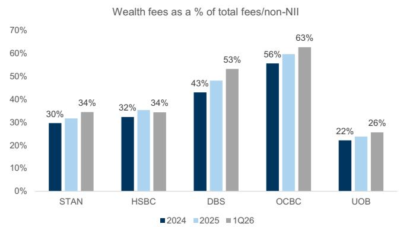

bar

Wealth fees as a % of total fees/non-NII
| Bank | 2024 (%) | 2025 (%) | 1Q26 (%) |
|---|---|---|---|
| STAN | 30 | 32 | 34 |
| HSBC | 32 | 35 | 34 |
| DBS | 43 | 48 | 53 |
| OCBC | 56 | 60 | 63 |
| UOB | 22 | 24 | 26 |

Respective disclosure for banks based on net/gross fees. STAN % of wealth fees is based against non-NII.

Exhibit 2: Wealth income now accounts for 29% of operating income   
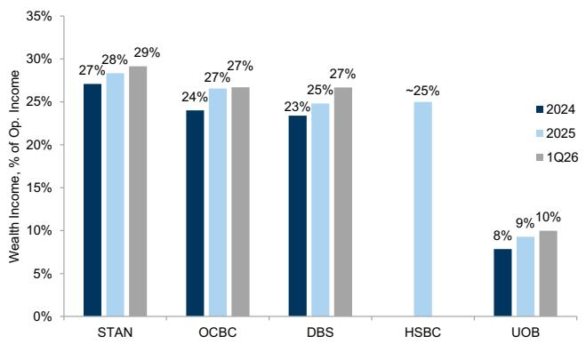

bar

| Company | 2024 (%) | 2025 (%) | 1Q26 (%) |
| :--- | :--- | :--- | :--- |
| STAN | 27 | 28 | 29 |
| OCBC | 24 | 27 | 27 |
| DBS | 23 | 25 | 27 |
| HSBC | ~25 | - | - |
| UOB | 8 | 9 | 10 |

OCBC wealth income here refers to only banking.   
Source: Company data, GS Global Investment Research

Source: Company data

Exhibit 3: HSBC HK wealth fees account for \~20% of group wealth fees...   
HSBC HK wealth fees as a % of grp operating income / wealth fees   
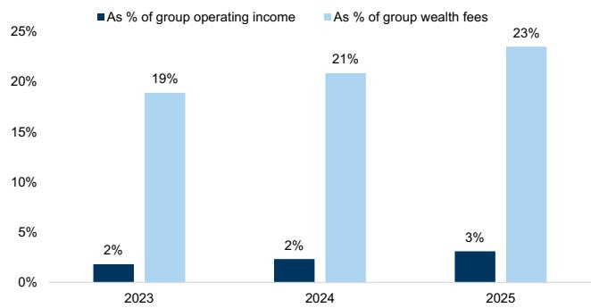

bar

| Year | As % of group operating income (%) | As % of group wealth fees (%) |
| :--- | :--- | :--- |
| 2023 | 2 | 19 |
| 2024 | 2 | 21 |
| 2025 | 3 | 23 |

HSBC HK wealth fees here do not include fees from insurance which is included in IWPB.   
Source: Company data

Exhibit 5: Securities/AM/Insurance fees for BOC HK and BEA as a % of total fees / operating income also steady increasing   
Securities/AM/Insurances fees vs. total fees / operating income   
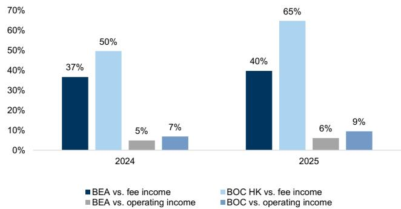

bar

| Year | BEA vs. fee income (%) | BOC HK vs. fee income (%) | BEA vs. operating income (%) | BOC vs. operating income (%) |
|---|---|---|---|---|
| 2024 | 37 | 50 | 5 | 7 |
| 2025 | 40 | 65 | 6 | 9 |

Source: Company data

Exhibit 7: STAN's 22% AUM growth in FY25 outpaced HK/SG peers   
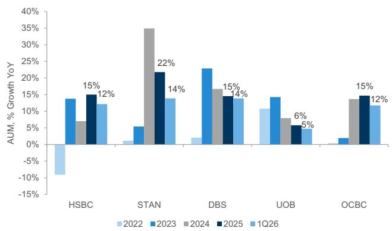

bar

| Company | 2022 (%) | 2023 (%) | 2024 (%) | 2025 (%) | 1Q26 (%) |
| :--- | :--- | :--- | :--- | :--- | :--- |
| HSBC | -8.5 | 13.5 | 7.0 | 15.0 | 12.0 |
| STAN | 1.0 | 5.5 | 35.0 | 22.0 | 14.0 |
| DBS | 2.0 | 23.0 | 16.5 | 15.0 | 14.0 |
| UOB | 10.5 | 14.0 | 8.0 | 6.0 | 5.0 |
| OCBC | -0.5 | 2.0 | 13.5 | 15.0 | 12.0 |

Source: Company data

Exhibit 4: ...while for STAN about c.40% of wealth solutions income was generated from Hong Kong in FY25
STAN FY25 Wealth solutions income by market   
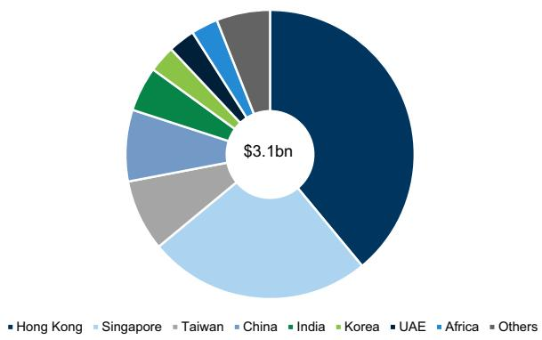

pie

| Region | Value ($bn) |
| :--- | :--- |
| Hong Kong | 3.1 |
| Singapore | 2.8 |
| Taiwan | 0.9 |
| China | 0.7 |
| India | 0.6 |
| Korea | 0.4 |
| UAE | 0.3 |
| Africa | 0.2 |
| Others | 0.5 |

Source: Company data

Exhibit 6: Banks are delivering: Wealth fee growth of 18-45% YoY across coverage in 1Q26   
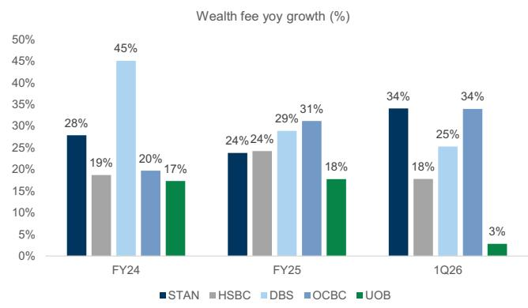

bar

Wealth fee yoy growth (%)
| Period | STAN (%) | HSBC (%) | DBS (%) | OCBC (%) | UOB (%) |
| :--- | :--- | :--- | :--- | :--- | :--- |
| FY24 | 28 | 19 | 45 | 20 | 17 |
| FY25 | 24 | 24 | 29 | 31 | 18 |
| 1Q26 | 34 | 18 | 25 | 34 | 3 |

Source: Company data

Exhibit 8: NNM intensity remains strong — STAN at 16% annualised in 1Q26   
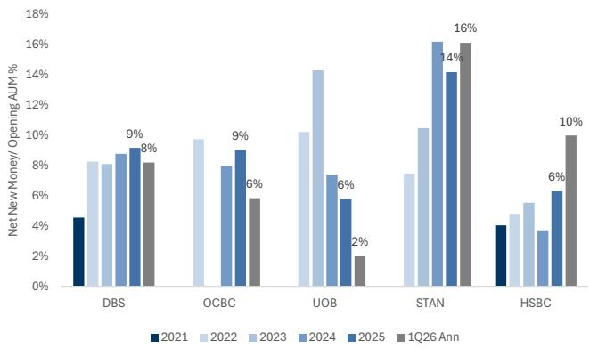

bar

| Bank | 2021 (%) | 2022 (%) | 2023 (%) | 2024 (%) | 2025 (%) | 1Q26 Ann (%) |
|---|---|---|---|---|---|---|
| DBS | 4.5 | 8.2 | 8.0 | 8.7 | 9.1 | 8.1 |
| OCBC | 0.0 | 9.8 | 9.0 | 7.9 | 9.1 | 5.8 |
| UOB | 0.0 | 10.2 | 14.4 | 7.4 | 5.8 | 1.9 |
| STAN | 0.0 | 7.4 | 10.4 | 16.3 | 14.2 | 16.1 |
| HSBC | 0.0 | 4.3 | 5.0 | 3.7 | 6.3 | 10.0 |

Source: Company data

Exhibit 9: HSBC has captured US\$234bn in cumulative NNM over FY23-25 — the largest pool   
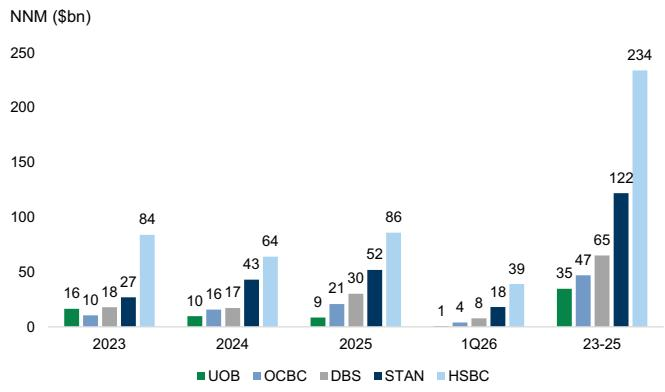

bar

| Year     | UOB | OCBC | DBS | STAN | HSBC |
| -------- | --- | ---- | --- | ---- | ---- |
| 2023     | 16  | 10   | 18  | 27   | 84   |
| 2024     | 10  | 16   | 17  | 43   | 64   |
| 2025     | 9   | 21   | 30  | 52   | 86   |
| 1Q26     | 1   | 4    | 8   | 18   | 39   |
| 23-25    | 35  | 47   | 65  | 122  | 234  |

Source: Company data

Exhibit 10: HSBC's new-to-bank customer acquisition in HK accelerated to 1.1mn in FY25 for RBW with a large proportion coming from non-resident...   
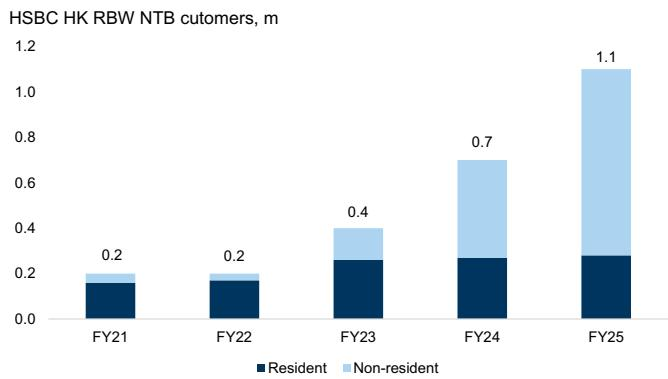

bar_stacked

HSBC HK RBW NTB customers, m
| Year | Resident (m) | Non-resident (m) |
| :--- | :--- | :--- |
| FY21 | 0.16 | 0.04 |
| FY22 | 0.17 | 0.03 |
| FY23 | 0.25 | 0.14 |
| FY24 | 0.26 | 0.48 |
| FY25 | 0.27 | 0.91 |

RBW: Retail banking and wealth.   
Source: Company data   
STAN 2025 NNM mix

Exhibit 11: ...similar to STAN where global Chinese accounted for c.33% of NNM in 2025 and...

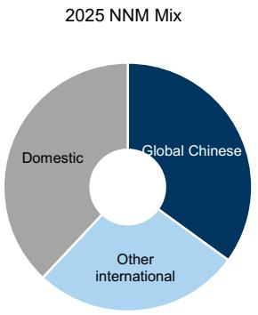

pie

2025 NNM Mix
| Category | Value |
|---|---|
| Global Chinese | 35 |
| Other international | 18 |
| Domestic | 30 |

Source: Company data

Exhibit 12: ...>50% of STAN HK NNM comes from global Chinese   
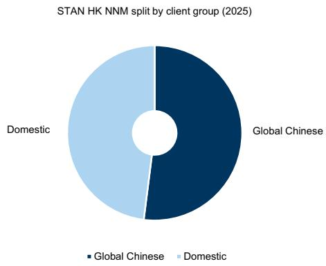

pie

STAN HK NNM split by client group (2025)
| Client Group | Value |
| :--- | :--- |
| Global Chinese | 48 |
| Domestic | 36 |

Source: Company data

Exhibit 13: Quarter by quarter, the wealth engine continues to show robust momentum 

<table><tr><td colspan="2"></td><td>1Q24</td><td>2Q24</td><td>3Q24</td><td>4Q24</td><td>1Q25</td><td>2Q25</td><td>3Q25</td><td>4Q25</td><td>1Q26</td></tr><tr><td rowspan="6">STAN</td><td>NNM (US$bn)</td><td>10</td><td>13</td><td>10</td><td>10</td><td>13</td><td>16</td><td>13</td><td>10</td><td>18</td></tr><tr><td>AUM (US$bn)</td><td>279</td><td>294</td><td>320</td><td>367</td><td>389</td><td>420</td><td>438</td><td>447</td><td>443</td></tr><tr><td>Wealth Income (US$mn)</td><td>1,285</td><td>1,331</td><td>1,402</td><td>1,278</td><td>1,464</td><td>1,421</td><td>1,620</td><td>1,432</td><td>1,720</td></tr><tr><td>yoy growth (%)</td><td>12%</td><td>14%</td><td>15%</td><td>19%</td><td>14%</td><td>7%</td><td>16%</td><td>12%</td><td>17%</td></tr><tr><td>Wealth Fees (US$mn)</td><td>617</td><td>619</td><td>695</td><td>563</td><td>778</td><td>742</td><td>890</td><td>677</td><td>1,043</td></tr><tr><td>yoy growth (%)</td><td>21%</td><td>25%</td><td>32%</td><td>36%</td><td>26%</td><td>20%</td><td>28%</td><td>20%</td><td>34%</td></tr><tr><td rowspan="4">HSBC</td><td>NNM (US$bn)</td><td>27</td><td>6</td><td>26</td><td>5</td><td>22</td><td>22</td><td>29</td><td>26</td><td>39</td></tr><tr><td>AUM (US$bn)</td><td>-</td><td>1,332</td><td>-</td><td>1,359</td><td>1,400</td><td>1,475</td><td>1,537</td><td>1,563</td><td>1,570</td></tr><tr><td>Wealth Fee (US$mn)</td><td>1,893</td><td>1,848</td><td>2,060</td><td>1,758</td><td>2,290</td><td>2,273</td><td>2,680</td><td>2,147</td><td>2,697</td></tr><tr><td>yoy growth (%)</td><td>13%</td><td>10%</td><td>29%</td><td>23%</td><td>21%</td><td>23%</td><td>30%</td><td>22%</td><td>18%</td></tr><tr><td rowspan="6">DBS</td><td>NNM (S$bn)</td><td>6</td><td>3</td><td>6</td><td>8</td><td>9</td><td>11</td><td>7</td><td>12</td><td>10</td></tr><tr><td>AUM (S$bn)</td><td>382</td><td>396</td><td>401</td><td>426</td><td>432</td><td>442</td><td>474</td><td>488</td><td>492</td></tr><tr><td>Wealth Income (S$mn)</td><td>1,326</td><td>1,294</td><td>1,358</td><td>1,238</td><td>1,488</td><td>1,353</td><td>1,536</td><td>1,303</td><td>1,587</td></tr><tr><td>yoy growth (%)</td><td>23%</td><td>19%</td><td>19%</td><td>10%</td><td>12%</td><td>5%</td><td>13%</td><td>5%</td><td>7%</td></tr><tr><td>Wealth Fees (S$mn)</td><td>536</td><td>518</td><td>609</td><td>520</td><td>724</td><td>649</td><td>796</td><td>645</td><td>907</td></tr><tr><td>yoy growth (%)</td><td>47%</td><td>37%</td><td>55%</td><td>41%</td><td>35%</td><td>25%</td><td>31%</td><td>24%</td><td>25%</td></tr><tr><td rowspan="6">OCBC</td><td>NNM (S$bn)</td><td>5</td><td>2</td><td>5</td><td>9</td><td>5</td><td>4</td><td>12</td><td>6</td><td>5</td></tr><tr><td>AUM (S$bn)</td><td>273</td><td>279</td><td>284</td><td>299</td><td>306</td><td>310</td><td>336</td><td>343</td><td>342</td></tr><tr><td>Wealth Income (S$mn)</td><td>1,291</td><td>1,250</td><td>1,295</td><td>1,065</td><td>1,342</td><td>1,295</td><td>1,621</td><td>1,298</td><td>1,483</td></tr><tr><td>yoy growth (%)</td><td>19%</td><td>-1%</td><td>1%</td><td>10%</td><td>4%</td><td>4%</td><td>25%</td><td>22%</td><td>11%</td></tr><tr><td>Wealth Fees (S$mn)</td><td>266</td><td>253</td><td>286</td><td>289</td><td>315</td><td>326</td><td>431</td><td>363</td><td>422</td></tr><tr><td>yoy growth (%)</td><td>16%</td><td>15%</td><td>22%</td><td>26%</td><td>18%</td><td>29%</td><td>51%</td><td>26%</td><td>34%</td></tr><tr><td rowspan="6">UOB</td><td>NNM (S$bn)</td><td>3</td><td>3</td><td>4</td><td>3</td><td>2</td><td>3</td><td>5</td><td>1</td><td>1</td></tr><tr><td>AUM (S$bn)</td><td>179</td><td>182</td><td>185</td><td>190</td><td>189</td><td>191</td><td>199</td><td>201</td><td>198</td></tr><tr><td>Wealth Income (S$mn)</td><td>300</td><td>240</td><td>309</td><td>272</td><td>323</td><td>296</td><td>357</td><td>305</td><td>342</td></tr><tr><td>yoy growth (%)</td><td></td><td></td><td></td><td></td><td>8%</td><td>23%</td><td>16%</td><td>12%</td><td>6%</td></tr><tr><td>Wealth Fees (S$mn)</td><td>164</td><td>173</td><td>183</td><td>178</td><td>213</td><td>188</td><td>218</td><td>203</td><td>219</td></tr><tr><td>yoy growth (%)</td><td>5%</td><td>22%</td><td>25%</td><td>18%</td><td>30%</td><td>9%</td><td>19%</td><td>14%</td><td>3%</td></tr></table>

<table><tr><td>1Q26 YoY (%)</td><td>1Q26 QoQ (%)</td><td>1Q26 Annu.NNM to prior AUM</td></tr><tr><td>38%</td><td>80%</td><td>16%</td></tr><tr><td>14%</td><td>-1%</td><td></td></tr><tr><td>17%</td><td>20%</td><td></td></tr><tr><td>34%</td><td>54%</td><td></td></tr><tr><td>77%</td><td>50%</td><td>10%</td></tr><tr><td>12%</td><td>0%</td><td></td></tr><tr><td>18%</td><td>26%</td><td></td></tr><tr><td>11%</td><td>-17%</td><td>8%</td></tr><tr><td>14%</td><td>1%</td><td></td></tr><tr><td>7%</td><td>22%</td><td></td></tr><tr><td>25%</td><td>41%</td><td></td></tr><tr><td>0%</td><td>-17%</td><td>6%</td></tr><tr><td>12%</td><td>0%</td><td></td></tr><tr><td>11%</td><td>14%</td><td></td></tr><tr><td>34%</td><td>16%</td><td></td></tr><tr><td>-50%</td><td>0%</td><td>2%</td></tr><tr><td>5%</td><td>-1%</td><td></td></tr><tr><td>6%</td><td>12%</td><td></td></tr><tr><td>3%</td><td>8%</td><td></td></tr></table>

HSBC all AUM figures shown and 1Q26 NNM are based on latest restatement. OCBC wealth income refers to banking only and wealth fees includes brokerage and fund management based on latest restatement. UOB wealth income excludes NII contribution.   
Source: Company data

Exhibit 14: Unlike prior rate-cut cycles, HK deposit growth remains well above the 20-year average   
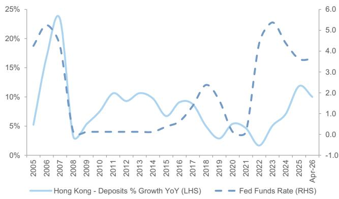

line

| Year | Hong Kong - Deposits % Growth YoY (LHS) | Fed Funds Rate (RHS) |
|------|----------------------------------------|----------------------|
| 2005 | ~5%                                    | ~4.5                 |
| 2006 | ~18%                                   | ~5.5                 |
| 2007 | ~24%                                   | ~5.0                 |
| 2008 | ~3%                                    | ~0.5                 |
| 2009 | ~5%                                    | ~0.5                 |
| 2010 | ~7%                                    | ~0.5                 |
| 2011 | ~10%                                   | ~0.5                 |
| 2012 | ~9%                                    | ~0.5                 |
| 2013 | ~10%                                   | ~0.5                 |
| 2014 | ~9%                                    | ~0.5                 |
| 2015 | ~7%                                    | ~0.5                 |
| 2016 | ~9%                                    | ~1.0                 |
| 2017 | ~8%                                    | ~1.5                 |
| 2018 | ~5%                                    | ~2.0                 |
| 2019 | ~3%                                    | ~1.5                 |
| 2020 | ~5%                                    | ~0.5                 |
| 2021 | ~3%                                    | ~1.0                 |
| 2022 | ~1%                                    | ~4.5                 |
| 2023 | ~5%                                    | ~5.5                 |
| 2024 | ~8%                                    | ~4.5                 |
| 2025 | ~12%                                   | ~3.5                 |
| Apr-26 | ~10%                                   | ~3.5                 |

Deposit growth YoY is based on deposits base in US\$ for Hong Kong. Chart showing till 1Q26.

Exhibit 15: USD deposits are the primary driver in Hong Kong   

line

| Date   | Hong Kong dollar | US dollar | Other foreign currencies | Long term Avg (US dollar) | Long term Avg (Hong Kong dollar) | Total Deposits |
|--------|------------------|-----------|--------------------------|----------------------------|----------------------------------|----------------|
| Jan-20 | ~0               | ~0        | ~0                       | ~10                        | ~10                              | ~0             |
| Jul-20 | ~10              | ~5        | ~5                       | ~10                        | ~10                              | ~5             |
| Jan-21 | ~25              | ~10       | ~15                      | ~10                        | ~10                              | ~10            |
| Jul-21 | ~10              | ~5        | ~10                      | ~10                        | ~10                              | ~5             |
| Jan-22 | ~-15             | ~5        | ~20                      | ~10                        | ~10                              | ~5             |
| Jul-22 | ~0               | ~5        | ~0                       | ~10                        | ~10                              | ~5             |
| Jan-23 | ~-5              | ~5        | ~-15                     | ~10                        | ~10                              | ~5             |
| Jul-23 | ~0               | ~5        | ~0                       | ~10                        | ~10                              | ~5             |
| Jan-24 | ~5               | ~10       | ~5                       | ~10                        | ~10                              | ~5             |
| Jul-24 | ~10              | ~15       | ~10                      | ~10                        | ~10                              | ~5             |
| Jan-25 | ~5               | ~20       | ~5                       | ~10                        | ~10                              | ~5             |
| Jul-25 | ~10              | ~25       | ~10                      | ~10                        | ~10                              | ~5             |
| Jan-26 | ~5               | ~20       | ~5                       | ~10                        | ~10                              | ~5             |

Source: Hong Kong Monetary Authority, CEIC   
Source: Federal Reserve Board, Hong Kong Monetary Authority, CEIC

Exhibit 16: Wealth deposits are growing faster than group deposits at STAN and HSBC   
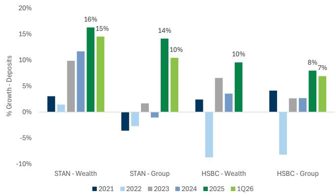

bar

| Category | 2021 (%) | 2022 (%) | 2023 (%) | 2024 (%) | 2025 (%) | 1Q26 (%) |
| :--- | :--- | :--- | :--- | :--- | :--- | :--- |
| STAN - Wealth | 3.0 | 1.0 | 10.0 | 11.5 | 16.0 | 15.0 |
| STAN - Group | -3.0 | -3.0 | 1.5 | -1.0 | 14.0 | 10.0 |
| HSBC - Wealth | 2.5 | -8.0 | 6.5 | 3.5 | 9.5 | 10.0 |
| HSBC - Group | 4.0 | -8.0 | 2.5 | 2.5 | 8.0 | 7.0 |

Source: Company data

For insurers under our coverage – including AIA, PRU, and FWD – we highlight that HK agents are prohibited from conducting business in mainland China, and the sales process has to take place in HK. The industry experienced enhanced regulatory controls in 2016, on the use of UnionPay cards to purchase insurance. From 2016, the HK Insurance Authority imposed additional safeguards, including declaration and evidence of physical presence of MCVs. There has been no change to these regulations so far. In addition, according to AIA, around 90% of new business and renewal premiums in the MCV segment were paid out of funds already in HK bank accounts in 2025.

Exhibit 17: VONB contribution from HK was around 40-50% for our covered regional insurers...   
HK VONB contribution (%)   
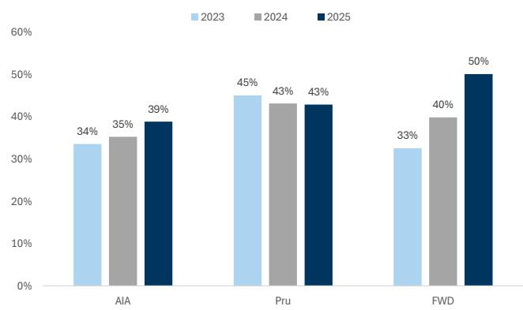

bar

| Category | 2023 (%) | 2024 (%) | 2025 (%) |
| :--- | :--- | :--- | :--- |
| AIA | 34 | 35 | 39 |
| Pru | 45 | 43 | 43 |
| FWD | 33 | 40 | 50 |

Source: Company data

Exhibit 18: ...with HK EV accounts for 36-40% of group total EV   
HK EV contribution (%)   
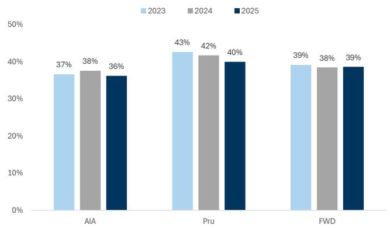

bar

| Category | 2023 (%) | 2024 (%) | 2025 (%) |
| :--- | :--- | :--- | :--- |
| AIA | 37 | 38 | 36 |
| Pru | 43 | 42 | 40 |
| FWD | 39 | 38 | 39 |

Source: Company data

Exhibit 19: MCV contribution was 36% in 2024
HK MCV ANP (HK\$bn)   
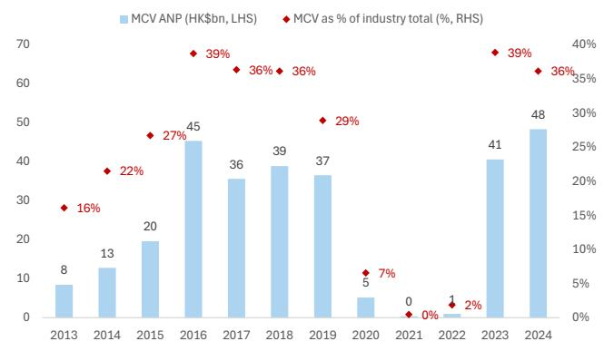

bar_line

| Year | MCV ANP (HK$bn, LHS) | MCV as % of industry total (%, RHS) |
| :--- | :--- | :--- |
| 2013 | 8 | 16 |
| 2014 | 13 | 22 |
| 2015 | 20 | 27 |
| 2016 | 45 | 39 |
| 2017 | 36 | 36 |
| 2018 | 39 | 36 |
| 2019 | 37 | 29 |
| 2020 | 5 | 7 |
| 2021 | 0 | 0 |
| 2022 | 1 | 2 |
| 2023 | 41 | 39 |
| 2024 | 48 | 36 |

Source: HKIA

Exhibit 20: Pru reported 62% ANP from offshore customers in 2024, followed by 60%/49% for AIA/FWD HK ANP by onshore/offshore (%, 2024)   
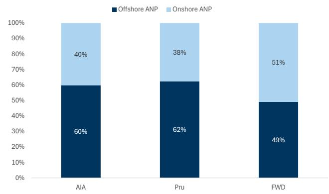

bar_stacked

| Category | Offshore ANP (%) | Onshore ANP (%) |
| :--- | :--- | :--- |
| AIA | 60 | 40 |
| Pru | 62 | 38 |
| FWD | 49 | 51 |

\*Offshore includes sales to MCV and other non-HK residents.   
Source: HKIA

# Disclosure Appendix

# Reg AC

We, Thomas Wang, Melissa Kuang, CFA, Chris Hallam, Simone Chen and Wayne Wang, hereby certify that all of the views expressed in this report accurately reflect our personal views about the subject company or companies and its or their securities. We also certify that no part of our compensation was, is or will be, directly or indirectly, related to the specific recommendations or views expressed in this report.

Unless otherwise stated, the individuals listed on the cover page of this report are analysts in GS' Global Investment Research division.

Contributing Authors: Thomas Wang GS (Asia) L.L.C., Melissa Kuang, CFA GS (Singapore) Pte, Chris Hallam GS International, Simone Chen GS (Asia) L.L.C., Wayne Wang GS (Singapore) Pte.

Unless otherwise stated, the individuals listed in the Contributing Authors disclosure of this report are analysts in GS' Global Investment Research division.

# GS Factor Profile

The GS Factor Profile provides investment context for a stock by comparing key attributes to the market (i.e. our universe of rated stocks) and its sector peers. The four key attributes depicted are: Growth, Financial Returns, Multiple (e.g. valuation) and Integrated (a composite of Growth, Financial Returns and Multiple). Growth, Financial Returns and Multiple are calculated by using normalized ranks for specific metrics for each stock. The normalized ranks for the metrics are then averaged and converted into percentiles for the relevant attribute. The precise calculation of each metric may vary depending on the fiscal year, industry and region, but the standard approach is as follows:

Growth is based on a stock's forward-looking sales growth, EBITDA growth and EPS growth (for financial stocks, only EPS and sales growth), with a higher percentile indicating a higher growth company. Financial Returns is based on a stock's forward-looking ROE, ROCE and CROCI (for financial stocks, only ROE), with a higher percentile indicating a company with higher financial returns. Multiple is based on a stock's forward-looking P/E, P/B, price/dividend (P/D), EV/EBITDA, EV/FCF and EV/Debt Adjusted Cash Flow (DACF) (for financial stocks, only P/E, P/B and P/D), with a higher percentile indicating a stock trading at a higher multiple. The Integrated percentile is calculated as the average of the Growth percentile, Financial Returns percentile and (100% - Multiple percentile).

Financial Returns and Multiple use the GS analyst forecasts at the fiscal year-end at least three quarters in the future. Growth uses inputs for the fiscal year at least seven quarters in the future compared with the year at least three quarters in the future (on a per-share basis for all metrics).

For a more detailed description of how we calculate the GS Factor Profile, please contact your GS representative.

# M&A Rank

Across our global coverage, we examine stocks using an M&A framework, considering both qualitative factors and quantitative factors (which may vary across sectors and regions) to incorporate the potential that certain companies could be acquired. We then assign a M&A rank as a means of scoring companies under our rated coverage from 1 to 3, with 1 representing high (30%-50%) probability of the company becoming an acquisition target, 2 representing medium (15%-30%) probability and 3 representing low (0%-15%) probability. For companies ranked 1 or 2, in line with our standard departmental guidelines we incorporate an M&A component into our target price. M&A rank of 3 is considered immaterial and therefore does not factor into our price target, and may or may not be discussed in research.

# Quantum

Quantum is GS' proprietary database providing access to detailed financial statement histories, forecasts and ratios. It can be used for in-depth analysis of a single company, or to make comparisons between companies in different sectors and markets.

# Disclosures

# Distribution of ratings/investment banking relationships

GS Investment Research global Equity coverage universe

<table><tr><td rowspan="2"></td><td colspan="3">Rating Distribution</td><td colspan="3">Investment Banking Relationships</td></tr><tr><td>Buy</td><td>Hold</td><td>Sell</td><td>Buy</td><td>Hold</td><td>Sell</td></tr><tr><td>Global</td><td>50%</td><td>34%</td><td>16%</td><td>65%</td><td>60%</td><td>45%</td></tr></table>

As of April 1, 2026, GS Global Investment Research had investment ratings on 3,074 equity securities. GS assigns stocks as Buys and Sells on various regional Investment Lists; stocks not so assigned are deemed Neutral. Such assignments equate to Buy, Hold and Sell for the purposes of the above disclosure required by the FINRA Rules. See ‘Ratings, Coverage universe and related definitions’ below. The Investment Banking Relationships chart reflects the percentage of subject companies within each rating category for whom GS has provided investment banking services within the previous twelve months.

# Regulatory disclosures

# Disclosures required by United States laws and regulations

See company-specific regulatory disclosures above for any of the following disclosures required as to companies referred to in this report: manager or co-manager in a pending transaction; 1% or other ownership; compensation for certain services; types of client relationships; managed/co-managed public offerings in prior periods; directorships; for equity securities, market making and/or specialist role. GS trades or may trade as a principal in debt securities (or in related derivatives) of issuers discussed in this report.

The following are additional required disclosures: Ownership and material conflicts of interest: GS policy prohibits its analysts, professionals reporting to analysts and members of their households from owning securities of any company in the analyst's area of coverage. Analyst compensation: Analysts are paid in part based on the profitability of GS, which includes investment banking revenues. Analyst as officer or director: GS policy generally prohibits its analysts, persons reporting to analysts or members of their households from serving as an officer, director or advisor of any company in the analyst's area of coverage. Non-U.S. Analysts: Non-U.S. analysts may not be associated persons of GS & Co. LLC and therefore may not be subject to FINRA Rule 2241 or FINRA Rule 2242 restrictions on communications with a subject company, public appearances and trading in securities covered by the analysts.

Distribution of ratings: See the distribution of ratings disclosure above. Price chart: See the price chart, with changes of ratings and price targets in prior periods, above, or, if electronic format or if with respect to multiple companies which are the subject of this report, on the GS website at https://www.gs.com/research/hedge.html.

# Additional disclosures required under the laws and regulations of jurisdictions other than the United States

The following disclosures are those required by the jurisdiction indicated, except to the extent already made above pursuant to United States laws and regulations. Australia: GS Australia Pty Ltd and its affiliates are not authorised deposit-taking institutions (as that term is defined in the Banking Act 1959 (Cth)) in Australia and do not provide banking services, nor carry on a banking business, in Australia. This research, and any access to it, is intended only for “wholesale clients” within the meaning of the Australian Corporations Act, unless otherwise agreed by GS. In producing research reports, members of Global Investment Research of GS Australia may attend site visits and other meetings hosted by the companies and other entities which are the subject of its research reports. In some instances the costs of such site visits or meetings may be met in part or in whole by the issuers concerned if GS Australia considers it is appropriate and reasonable in the specific circumstances relating to the site visit or meeting. To the extent that the contents of this document contains any financial product advice, it is general advice only and has been prepared by GS without taking into account a client’s objectives, financial situation or needs. A client should, before acting on any such advice, consider the appropriateness of the advice having regard to the client’s own objectives, financial situation and needs. A copy of certain GS Australia and New Zealand disclosure of interests and a copy of GS’ Australian Sell-Side Research Independence Policy Statement are available at: https://www.goldmansachs.com/disclosures/australia-new-zealand/index.html. Brazil: Disclosure information in relation to CVM Resolution n. 20 is available at https://www.gs.com/worldwide/brazil/area/gir/index.html. Where applicable, the Brazil-registered analyst primarily responsible for the content of this research report, as defined in Article 20 of CVM Resolution n. 20, is the first author named at the beginning of this report, unless indicated otherwise at the end of the text. Canada: This information is being provided to you for information purposes only and is not, and under no circumstances should be construed as, an advertisement, offering or solicitation by GS & Co. LLC for purchasers of securities in Canada to trade in any Canadian security. GS & Co. LLC is not registered as a dealer in any jurisdiction in Canada under applicable Canadian securities laws and generally is not permitted to trade in Canadian securities and may be prohibited from selling certain securities and products in certain jurisdictions in Canada. If you wish to trade in any Canadian securities or other products in Canada please contact GS Canada Inc., an affiliate of The GS Group Inc., or another registered Canadian dealer. Hong Kong: Further information on the securities of covered companies referred to in this research may be obtained on request from GS (Asia) L.L.C. India: Further information on the subject company or companies referred to in this research may be obtained from GS (India) Securities Private Limited, Research Analyst - SEBI Registration Number INH000001493, 10th Floor, Ascent-Worli, Sudam Kalu Ahire Marg, Worli, Mumbai-400 025, India, Corporate Identity Number U74140MH2006FTC160634, Phone +91 22 6616 9000, Fax +91 22 6616 9001. GS may beneficially own 1% or more of the securities (as such term is defined in clause 2 (h) the Indian Securities Contracts (Regulation) Act, 1956) of the subject company or companies referred to in this research report. Investment in securities market are subject to market risks. Read all the related documents carefully before investing. Registration granted by SEBI and certification from NISM in no way guarantee performance of the intermediary or provide any assurance of returns to investors. GS (India) Securities Private Limited compliance officer and investor grievance contact details can be found at: https://www.goldmansachs.com/worldwide/india/documents/Grievance-Redressal-and-Escalation-Matrix.pdf, and a copy of the annual audit compliance report can be found at this link: https://publishing.gs.com/content/site/india-annual-compliance-report.html. Japan: See below. Korea: This research, and any access to it, is intended only for “professional investors” within the meaning of the Financial Services and Capital Markets Act, unless otherwise agreed by GS. Further information on the subject company or companies referred to in this research may be obtained from GS (Asia) L.L.C., Seoul Branch. New Zealand: GS New Zealand Limited and its affiliates are neither “registered banks” nor “deposit takers” (as defined in the Reserve Bank of New Zealand Act 1989) in New Zealand. This research, and any access to it, is intended for “wholesale clients” (as defined in the Financial Advisers Act 2008) unless otherwise agreed by GS. A copy of certain GS Australia and New Zealand disclosure of interests is available at: https://www.goldmansachs.com/disclosures/australia-new-zealand/index.html. Russia: Research reports distributed in the Russian Federation are not advertising as defined in the Russian legislation, but are information and analysis not having product promotion as their main purpose and do not provide appraisal within the meaning of the Russian legislation on appraisal activity. Research reports do not constitute a personalized investment recommendation as defined in Russian laws and regulations, are not addressed to a specific client, and are prepared without analyzing the financial circumstances, investment profiles or risk profiles of clients. GS assumes no responsibility for any investment decisions that may be taken by a client or any other person based on this research report. Singapore: GS (Singapore) Pte. (Company Number: 198602165W), which is regulated by the Monetary Authority of Singapore, accepts legal responsibility for this research, and should be contacted with respect to any matters arising from, or in connection with, this research. Taiwan: This material is for reference only and must not be reprinted without permission. Investors should carefully consider their own investment risk. Investment results are the responsibility of the individual investor. United Kingdom: Persons who would be categorized as retail clients in the United Kingdom, as such term is defined in the rules of the Financial Conduct Authority, should read this research in conjunction with prior GS on the covered companies referred to herein and should refer to the risk warnings that have been sent to them by GS International. A copy of these risks warnings, and a glossary of certain financial terms used in this report, are available from GS International on request.

European Union and United Kingdom: Disclosure information in relation to Article 6 (2) of the European Commission Delegated Regulation (EU) (2016/958) supplementing Regulation (EU) No 596/2014 of the European Parliament and of the Council (including as that Delegated Regulation is implemented into United Kingdom domestic law and regulation following the United Kingdom's departure from the European Union and the European Economic Area) with regard to regulatory technical standards for the technical arrangements for objective presentation of investment recommendations or other information recommending or suggesting an investment strategy and for disclosure of particular interests or indications of conflicts of interest is available at https://www.gs.com/disclosures/europeanpolicy.html which states the European Policy for Managing Conflicts of Interest in Connection with Investment Research.

Japan: GS Japan Co., Ltd. is a Financial Instrument Dealer registered with the Kanto Financial Bureau under registration number Kinsho 69, and a member of Japan Securities Dealers Association, Financial Futures Association of Japan Type II Financial Instruments Firms Association, and Investment Management Association of Japan. Sales and purchase of equities are subject to commission pre-determined with clients plus consumption tax. See company-specific disclosures as to any applicable disclosures required by Japanese stock exchanges, the Japanese Securities Dealers Association or the Japanese Securities Finance Company.

# Ratings, coverage universe and related definitions

Buy (B), Neutral (N), Sell (S) Analysts recommend stocks as Buys or Sells for inclusion on various regional Investment Lists. Being assigned a Buy or Sell on an Investment List is determined by a stock's total return potential relative to its coverage universe. Any stock not assigned as a Buy or a Sell on an Investment List with an active rating (i.e., a stock that is not Rating Suspended, Not Rated, Early-Stage Biotech, Coverage Suspended or Not Covered), is deemed Neutral. Each region manages Regional Conviction Lists, which are selected from Buy rated stocks on the respective region's Investment Lists and represent investment recommendations focused on the size of the total return potential and/or the likelihood of the realization of the return across their respective areas of coverage. The addition or removal of stocks from such Conviction Lists are managed by the Investment Review Committee or other designated committee in each respective region and do not represent a change in the analysts' investment rating for such stocks.

Total return potential represents the upside or downside differential between the current share price and the price target, including all paid or anticipated dividends, expected during the time horizon associated with the price target. Price targets are required for all covered stocks. The total return potential, price target and associated time horizon are stated in each report adding or reiterating an Investment List membership.

Coverage Universe: A list of all stocks in each coverage universe is available by primary analyst, stock and coverage universe at https://www.gs.com/research/hedge.html.

Not Rated (NR). The investment rating, target price and earnings estimates (where relevant) are removed pursuant to GS policy when GS is acting in an advisory capacity in a merger or in a strategic transaction involving this company, when there are legal, regulatory or policy constraints due to GS' involvement in a transaction, and in certain other circumstances. Early-Stage Biotech (ES). An investment rating and a target price are not assigned pursuant to GS policy when this company has neither a drug, treatment or medical device that has passed a Phase II clinical trial nor a license to distribute a post-Phase II drug, treatment or medical device. Rating Suspended (RS). GS has suspended the investment rating and price target for this stock, because there is not a sufficient fundamental basis for determining an investment rating or target price. The previous investment rating and target price, if any, are no longer in effect for this stock and should not be relied upon. Coverage Suspended (CS). GS has suspended coverage of this company. Not Covered (NC). GS does not cover this company.

# Global product; distributing entities

GS Global Investment Research produces and distributes research products for clients of GS on a global basis. Analysts based in GS offices around the world produce research on industries and companies, and research on macroeconomics, currencies, commodities and portfolio strategy. This research is disseminated in Australia by GS Australia Pty Ltd (ABN 21 006 797 897); in Brazil by GS do Brasil Corretora de Títulos e Valores Mobiliários S.A.; Public Communication Channel GS Brazil: 0800 727 5764 and / or contatogoldmanbrasil@gs.com. Available Weekdays (except holidays), from 9am to 6pm. Canal de Comunicação com o Público GS Brasil: 0800 727 5764 e/ou contatogoldmanbrasil@gs.com. Horário de funcionamento: segunda-feira à sexta-feira (exceto feriados), das 9h às 18h; in Canada by GS & Co. LLC; in Hong Kong by GS (Asia) L.L.C.; in India by GS (India) Securities Private Ltd.; in Japan by GS Japan Co., Ltd.; in the Republic of Korea by GS (Asia) L.L.C., Seoul Branch; in New Zealand by GS New Zealand Limited; in Russia by OOO GS; in Singapore by GS (Singapore) Pte. (Company Number: 198602165W); and in the United States of America by GS & Co. LLC. GS International has approved this research in connection with its distribution in the United Kingdom.

GS International (“GSI”), authorised by the Prudential Regulation Authority (“PRA”) and regulated by the Financial Conduct Authority (“FCA”) and the PRA, has approved this research in connection with its distribution in the United Kingdom.

European Economic Area: GS Bank Europe SE (“GSBE”) is a credit institution incorporated in Germany and, within the Single Supervisory Mechanism, subject to direct prudential supervision by the European Central Bank and in other respects supervised by German Federal Financial Supervisory Authority (Bundesanstalt für Finanzdienstleistungsaufsicht, BaFin) and Deutsche Bundesbank and disseminates research within the European Economic Area.

# General disclosures

This research is for our clients only. Other than disclosures relating to GS, this research is based on current public information that we consider reliable, but we do not represent it is accurate or complete, and it should not be relied on as such. The information, opinions, estimates and forecasts contained herein are as of the date hereof and are subject to change without prior notification. We seek to update our research as appropriate, but various regulations may prevent us from doing so. Other than certain industry reports published on a periodic basis, the large majority of reports are published at irregular intervals as appropriate in the analyst's judgment.

GS conducts a global full-service, integrated investment banking, investment management, and brokerage business. We have investment banking and other business relationships with a substantial percentage of the companies covered by Global Investment Research. GS & Co. LLC, the United States broker dealer, is a member of SIPC (https://www.sipc.org).

Our salespeople, traders, and other professionals may provide oral or written market commentary or trading strategies to our clients and principal trading desks that reflect opinions that are contrary to the opinions expressed in this research. Our asset management area, principal trading desks and investing businesses may make investment decisions that are inconsistent with the recommendations or views expressed in this research.

The analysts named in this report may have from time to time discussed with our clients, including GS salespersons and traders, or may discuss in this report, trading strategies that reference catalysts or events that may have a near-term impact on the market price of the equity securities discussed in this report, which impact may be directionally counter to the analyst's published price target expectations for such stocks. Any such trading strategies are distinct from and do not affect the analyst's fundamental equity rating for such stocks, which rating reflects a stock's return potential relative to its coverage universe as described herein.

We and our affiliates, officers, directors, and employees will from time to time have long or short positions in, act as principal in, and buy or sell, the securities or derivatives, if any, referred to in this research, unless otherwise prohibited by regulation or GS policy.

The views attributed to third party presenters at GS arranged conferences, including individuals from other parts of GS, do not necessarily reflect those of Global Investment Research and are not an official view of GS.

Any third party referenced herein, including any salespeople, traders and other professionals or members of their household, may have positions in the products mentioned that are inconsistent with the views expressed by analysts named in this report.

This research is not an offer to sell or the solicitation of an offer to buy any security in any jurisdiction where such an offer or solicitation would be illegal. It does not constitute a personal recommendation or take into account the particular investment objectives, financial situations, or needs of individual clients. Clients should consider whether any advice or recommendation in this research is suitable for their particular circumstances and, if appropriate, seek professional advice, including tax advice. The price and value of investments referred to in this research and the income from them may fluctuate. Past performance is not a guide to future performance, future returns are not guaranteed, and a loss of original capital may occur. Fluctuations in exchange rates could have adverse effects on the value or price of, or income derived from, certain investments.

Certain transactions, including those involving futures, options, and other derivatives, give rise to substantial risk and are not suitable for all investors. Investors should review current options and futures disclosure documents which are available from GS sales representatives or at https://www.theocc.com/about/publications/character-risks.jsp and https://www.goldmansachs.com/disclosures/cftc\_fcm\_disclosures. Transaction costs may be significant in option strategies calling for multiple purchase and sales of options such as spreads. Supporting documentation will be supplied upon request.

Differing Levels of Service provided by Global Investment Research: The level and types of services provided to you by GS Global Investment Research may vary as compared to that provided to internal and other external clients of GS, depending on various factors including your individual preferences as to the frequency and manner of receiving communication, your risk profile and investment focus and perspective (e.g., marketwide, sector specific, long term, short term), the size and scope of your overall client relationship with GS, and legal and regulatory constraints. As an example, certain clients may request to receive notifications when research on specific securities is published, and certain clients may request that specific data underlying analysts' fundamental analysis available on our internal client websites be delivered to them electronically through data feeds or otherwise. No change to an analyst's fundamental research views (e.g., ratings, price targets, or material changes to earnings estimates for equity securities), will be communicated to any client prior to inclusion of such information in a research report broadly disseminated through electronic publication to our internal client websites or through other means, as necessary, to all clients who are entitled to receive such reports.

All research reports are disseminated and available to all clients simultaneously through electronic publication to our internal client websites. Not all research content is redistributed to our clients or available to third-party aggregators, nor is GS responsible for the redistribution of our research by third party aggregators. For research, models or other data related to one or more securities, markets or asset classes (including related services) that may be available to you, please contact your GS representative or go to https://research.gs.com.

Disclosure information is also available at https://www.gs.com/research/hedge.html or from Research Compliance, 200 West Street, New York, NY 10282.

# © 2026 GS.

You are permitted to store, display, analyze, modify, reformat, and print the information made available to you via this service only for your own use. You may not resell or reverse engineer this information to calculate or develop any index for disclosure and/or marketing or create any other derivative works or commercial product(s), data or offering(s) without the express written consent of GS. You are not permitted to publish, transmit, or otherwise reproduce this information, in whole or in part, in any format to any third party without the express written consent of GS. This foregoing restriction includes, without limitation, using, extracting, downloading or retrieving this information, in whole or in part, to train or finetune a machine learning or artificial intelligence system, or to provide or reproduce this information, in whole or in part, as a prompt or input to any such system.