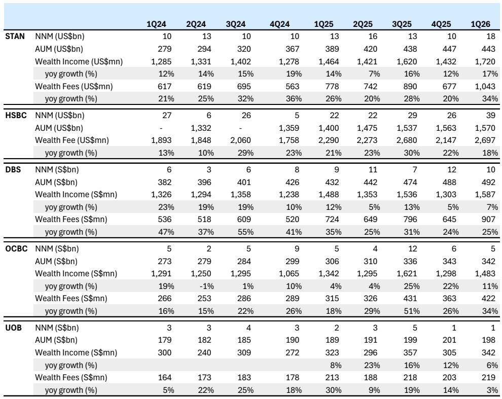
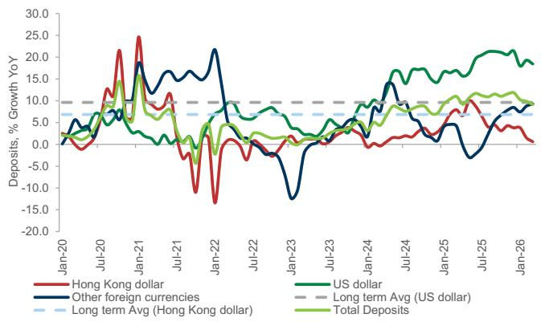
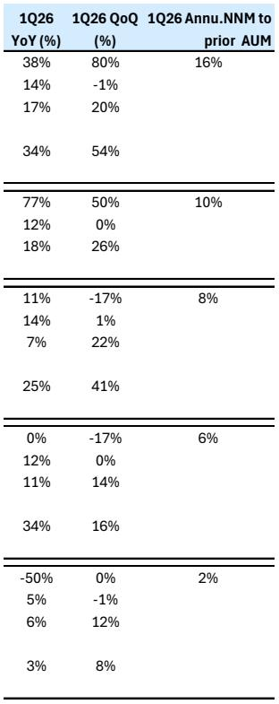

# 香港银行保险股的回调，市场真正担忧的不是监管本身，而是增长引擎的“可证明性”

过去几个交易日，香港银行与保险板块出现了一轮明显回调，部分个股单日跌幅超过7%，而同期恒生指数与国企指数基本持平。市场情绪迅速转向审慎，投资者在追问：这轮监管信号究竟意味着什么？

如果你只是简单地将这理解为“政策风险冲击估值”，那可能低估了当前的市场定价逻辑。某外资投行在最新发布的研报中，系统性地回应了投资者对近期监管公告的疑问，并在大量财务数据与运营细节的基础上，给出了一个值得认真对待的判断框架。

这份报告的核心洞察并非“监管来了，增长要停”，而是：**香港财富管理业务过去几年的高速增长，高度依赖于一个尚未被充分定价的结构性变量——内地居民跨境资金流动的制度化通道。** 新监管框架的真正影响，不在于短期开户量的波动，而在于银行能否在更严格的合规环境下，依然证明其客户获取与收入增长的可持续性。

换句话说，市场正在从“相信故事”转向“要求证据”。

## 1. 两套监管公告指向同一个方向：跨境资金的合规化正在从“原则”走向“细则”

引发本轮市场波动的直接原因，是两套几乎同时发布的监管信号。第一套是5月22日中国证监会针对线上券商的监管控制与相关罚单；第二套是6月1日发布的国务院第837号令，涉及对外投资的全新法律框架。

从表面看，这两套公告针对的对象不同。前者聚焦于证券经纪业务的线上展业合规，后者则是对中国投资者境外投资的整体法律框架进行重塑。但将它们放在一起看，一个清晰的信号浮现出来：监管层正在从“事后追责”转向“事前穿透”，从“原则性指导”转向“全生命周期管理”。

研报明确指出，国务院第837号令“建立了一个全面的法律框架，以规范境外投资的全生命周期——从投资前的审批与备案，到持续合规与执法”。对于个人投资者而言，具体的实施细则将由国务院下属的投资与商务主管部门另行制定。

这里的核心变量是时间线：新规将于2026年7月1日正式生效。这意味着，在接下来的一年多时间里，详细的实施规则将陆续发布。对于在香港开展业务的银行与保险公司而言，这既是一个合规升级的窗口期，也是一个商业模式承受压力的测试期。

我们不应将这一过程简单理解为“收紧”。更准确的说法是：**过去几年内地居民通过香港进行跨境财富配置的快速增长，在很大程度上是在一个制度框架尚不完善的环境下发生的。现在，这个框架正在被系统性地补全。**

对于投资者而言，真正的问题不是“监管会不会影响增长”，而是“在新的合规环境下，哪些银行的商业模式能够经得起穿透式审查”。

## 2. 银行已经在行动：开户流程收紧的实质是“合规成本”从后台走向前台

市场担忧的另一个直接触发因素，是媒体报道称部分银行已暂停在内地分行为内地居民开设香港投资账户。这一消息引发了关于“跨境财富管理通道是否会被关闭”的猜测。

但研报通过渠道核查给出了一个更细致的图景：**银行并未停止开户，而是大幅提升了开户流程中的合规要求。**

具体来说，覆盖范围内的银行——包括渣打、HSBC、中银香港与东亚银行——均已强调，客户现在需要提供资金来源声明，证明资金合法来源且源自中国内地以外。这并非断流，而是加了一个过滤阀。

与此同时，银行运营层面正在推进的一项重点工作是“休眠账户的清理”，特别是零余额账户的关闭。部分银行已经实施，其他银行表示将在适当时机跟进。这反映出行业正在经历一轮系统性的合规升级，而非孤立的个别事件。

研报特别强调了一个容易被忽视的细节：银行仍在持续报告开户活动，无论是存款账户还是投资账户，在香港依然正常进行。这意味着，**开户流程的收紧并不等同于业务暂停，而是“合规成本”从后台被推向前台，直接体现在客户体验与开户周期上。**

对于投资者而言，这一变化的财务含义是：获客成本上升、开户转化率可能下降、存量客户的合规维护费用增加。这些成本最终会反映在财富管理业务的利润率上。

## 3. 财富管理收入已成为香港银行利润表中最敏感的变量

要理解为什么市场对这类监管信号如此敏感，我们需要看清一个事实：财富管理收入在过去几年中，已成为香港银行利润表中最具增长弹性、也最脆弱的变量。

研报提供的数据清晰地展示了这一趋势。渣打银行的财富管理收入占其非利息收入的比例，从2024年的32%上升至1Q26的34%；HSBC的这一比例稳定在34%左右；星展银行则从48%升至53%；华侨银行从60%升至63%。**财富管理收入占运营收入的比例，在渣打达到29%，在HSBC约为25%，在星展和华侨均超过27%。**

更关键的是增长速度。2025年全年，覆盖范围内银行的财富管理手续费收入同比增长在18%至31%之间。进入2026年第一季度，渣打的财富管理手续费同比增长34%，华侨银行增长34%，星展增长25%。这些数字并非孤立地好看——它们是在一个利率环境已经发生变化的背景下实现的。

HSBC香港的财富管理手续费占集团财富管理手续费的比例，从2023年的19%上升至2025年的23%，占集团运营收入的2%至3%。渣打香港的财富解决方案收入占其全球财富收入约40%。对于中银香港和东亚银行而言，证券、资产管理与保险手续费收入合计占其总手续费收入的40%至65%，占运营收入的6%至9%。

**这些数字合在一起，指向一个清晰的判断：对于香港银行板块的估值而言，财富管理业务已经不是“加分项”，而是“核心驱动项”。** 任何可能影响这一业务增长可持续性的变量，都会被市场迅速定价。

## 4. 报告尚未完全回答的关键问题：内地居民财富跨境配置的“真实渗透率”是多少？

尽管研报提供了大量的运营数据与财务指标，但有一个关键问题并未被完全回答：**在目前的增长中，有多少是“结构性需求”的释放，有多少是“制度套利”的驱动？**

这个问题之所以重要，是因为它直接决定了监管收紧后的增长韧性。

从数据看，HSBC香港零售银行与财富管理业务的新增客户数量在2025年达到110万，其中非居民客户占比从2023年的36%飙升至77%。渣打2025年的净新增资金中，全球华人客户贡献了35%。在渣打香港的净新增资金中，全球华人客户的占比高达48%。

这些数据表明，内地居民——无论是通过香港还是其他渠道——已成为香港财富管理市场最重要的增量客户来源。但问题在于，这部分客户的资金流动，在多大程度上依赖于当前相对宽松的跨境资本管理环境？

国务院第837号令的实施细则尚未公布。投资者目前无法判断，新规将对个人投资者的境外投资额度、资金来源审核、资金回流机制等关键环节产生何种具体影响。**这种不确定性正是市场定价中最难量化的部分。**

研报并未回避这一不确定性，而是将其作为需要持续跟踪的核心变量。对于读者而言，这恰恰是最值得深入阅读完整报告的部分——因为只有理解了制度框架的可能演变方向，才能对银行股的估值做出有依据的判断。

## 5. 给投资者的观察框架：三个维度判断银行在合规升级中的“护城河”

基于研报提供的信息，我们可以构建一个简洁但有效的观察框架，用于评估不同银行在面对合规升级时的相对优势。

第一个维度是客户基础的结构。那些拥有更高比例“存量合规客户”的银行，在开户流程收紧的环境中受到的冲击更小。具体来说，如果一家银行的财富管理客户中，已经有较高比例是香港本地居民或已通过合规渠道配置资产的内地居民，那么新增合规要求对其获客能力的边际影响就会更小。反之，如果一家银行的增长高度依赖“新开内地居民投资账户”，那么它面临的短期压力就会更大。

第二个维度是收入来源的分散度。渣打和HSBC的财富管理收入占比较高，但它们在亚洲其他市场以及全球其他区域也有相当规模的业务布局。中银香港和东亚银行的财富管理手续费收入占比虽然也较高，但它们的业务更多集中于香港本地市场。在面临区域性的监管变化时，业务地理分散度更高的银行具有更强的缓冲能力。

第三个维度是合规体系的成熟度。这可能是最难量化、但最重要的维度。那些在过去几年已经在KYC（了解你的客户）、反洗钱、资金来源审核等方面投入了大量资源的银行，在应对新规时的边际成本会更低。而那些主要依赖“规模驱动”增长、合规体系尚未充分建设的银行，将面临更大的成本压力。

**这三个维度共同指向一个结论：在监管升级的环境中，规模本身不再是护城河，合规能力才是。**

## 6. 存款增长的超常表现背后，可能隐藏着一个未被充分讨论的结构性变化

研报中有一个数据点值得单独拿出来讨论：香港的存款增长，在当前的利率环境下，依然显著高于20年历史均值。

从图表数据看，香港存款总额的同比增速在2024年达到约8%，2025年进一步升至约12%，即使在2026年4月仍保持在约10%的水平。而在过去20年中，香港存款增速的中枢大约在5%至8%之间。尤其值得注意的是，这一轮存款增长的主要驱动力是美元存款，而非港元存款。

在典型的利率下行周期中，存款增速通常会放缓，因为储户会寻求更高收益的替代投资。但当前的情况恰恰相反——存款增速在利率下行后反而加速。

**这一现象的背后，可能隐藏着一个结构性的变化：内地居民正在将香港作为“离岸人民币与美元资产的配置枢纽”，而不仅仅是“投资目的地”。** 换言之，流入香港的资金，有相当一部分可能尚未进入股票、基金或保险产品，而是以存款形式“停泊”在香港的银行体系中，等待更明确的配置信号。

如果这一判断成立，那么对于银行而言，这部分“停泊资金”既是机会也是风险。机会在于，一旦市场环境或监管框架明朗化，这些存款可以迅速转化为财富管理产品的手续费收入。风险在于，如果监管收紧导致资金回流内地，银行的存款基础将面临收缩压力，进而影响其净息差与流动性管理。

研报并未对这一现象给出明确的判断，但提出了一个值得持续跟踪的问题：**存款增长的超常表现，到底是因为利率仍具吸引力，还是因为客户正在将香港视为“资金中转站”？** 这个问题的答案，将直接决定财富管理业务未来两年的增长空间。

---

以上讨论，只是这份研报中大量数据与判断的一个缩影。报告中还包含了更详细的银行层面收入拆分、客户结构分析、以及不同监管情景下的压力测试框架。这些内容对于理解香港银行保险板块的估值逻辑至关重要，但受限于篇幅，无法在此一一展开。

如果你对以下问题感兴趣——不同银行的财富管理业务对内地居民客户的依赖度究竟有多高？新规实施后的可能情景有哪些？哪些银行在合规升级中具备更强的结构性优势？——欢迎来星球微信群里继续讨论。我们会基于这份研报的完整内容，结合最新渠道信息，持续跟踪这一主题的演变。

Personal reading notes and learning share only. Not investment advice.

