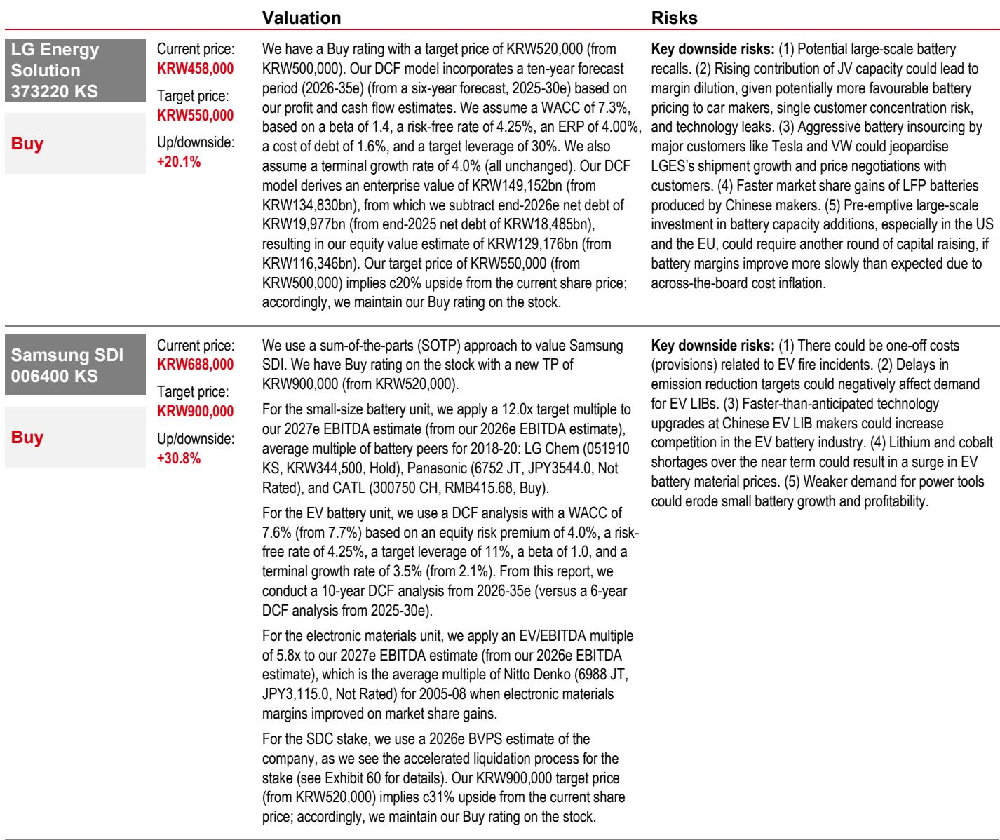
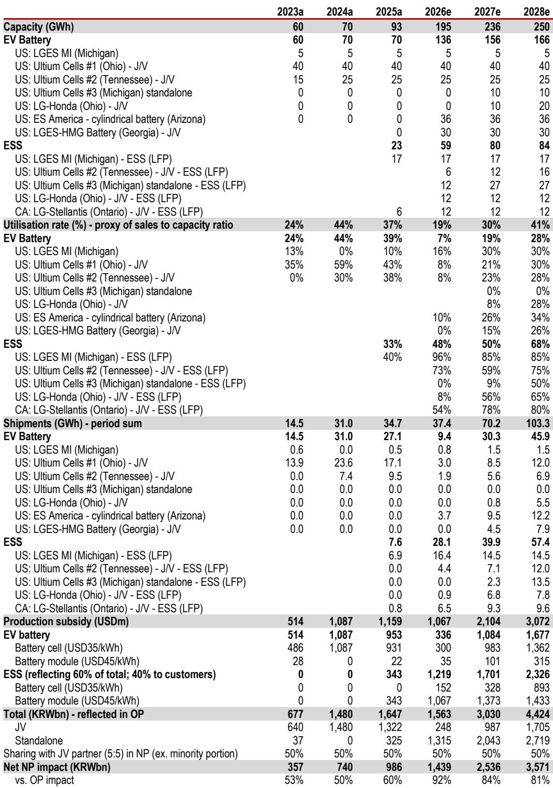
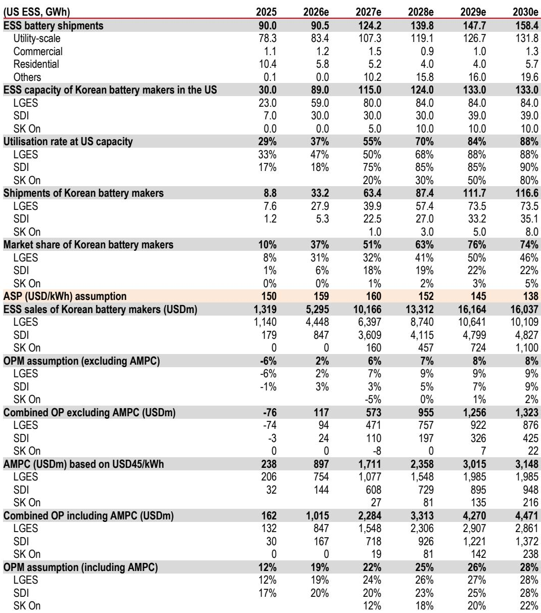

# 韩国电池板块的真正拐点不在EV，而在ESS的结构性重定价

市场对韩国电池股的悲观情绪，很大程度上仍停留在对电动车需求放缓的线性外推上。但一份来自某外资投行的最新研报给出了一个方向完全不同的判断：韩国电池制造商正在经历的，不是一个需求周期的底部，而是一个供给结构的重构——储能系统正在成为新的增长主轴，而美国市场的政策环境正在系统性地将中国电池供应商挤出舞台。这一轮变化，不是EV的反弹故事，而是ESS的定价权转移故事。

报告的核心信号是：三星SDI和LG新能源的盈利拐点将在2027年到来，但市场目前仍以EV周期的旧框架来定价这两只股票。这意味着，如果ESS的订单增长和市场占有率扩张被市场充分理解，当前的估值水平可能提供了显著的预期差。

以下是我们从这份报告中提炼出的五个核心洞察。

## 1. EV需求的下行已经Price In，但供给侧的收缩正在改变游戏规则

电动车需求放缓是2024年以来市场对电池板块的主要担忧，这一点已经是共识。报告并没有否认这一点——事实上，两家公司2026年第一季度的经营利润仍为亏损，三星SDI亏损1560亿韩元，LG新能源亏损2080亿韩元。但这些数字本身已经不是新的信息。

真正值得关注的变化来自供给侧。报告明确指出，供给端的纪律——包括产能削减和投资缩减——正在开始缓解过去两年困扰行业的产能过剩问题。这是一个典型的“坏消息出尽”的信号：当所有人都知道需求疲软时，股价已经消化了这一预期，但供给侧的主动收缩往往被低估。

更关键的是，油价持续处于高位正在改善电动车的总拥有成本。报告提到一个具体的时间节点——2026年5月，油价高企将推动TCO接近与燃油车持平。这意味着，即使没有新的政策刺激，电动车需求也可能在自然经济性推动下触底回升。这一逻辑在研报中并未被过度渲染，但它提供了一个重要的时间框架：EV需求的自然修复可能在2026年下半年开始显现。

## 2. 美国ESS市场正在系统性地向韩国企业倾斜，这不是短期波动

如果说EV是韩国电池板块的“过去时”，那么ESS就是“现在进行时”和“未来时”。报告最核心的增量信息，是韩国电池制造商在美国ESS市场的结构性优势正在被政策、关税和地缘政治三重因素共同强化。

这一判断不是定性的口号，而是有清晰的量化支撑。报告测算，美国本土生产的韩国电池在计入关税、AMPC和ITC三项政策红利后，可以将ESS项目总资本开支降低约16%。具体来看：中国产电池虽然基础成本更低，但面临43.4%的关税，无法享受30%的投资税收抵免，也无法获得每千瓦时35至45美元的先进制造业生产税收抵免。这三项叠加，使得中国供应商在美国ESS市场的成本优势被完全逆转。

报告据此预测，韩国制造商在美国ESS市场的占有率将从2025年的10%迅速攀升至2028年的63%。这是一个五年内翻六倍的数字。如果这一预测成立，那么ESS将成为韩国电池企业未来三年盈利增长的主要驱动力，其重要性将超过EV业务的修复。

## 3. AI数据中心正在成为ESS需求的新增量，但市场尚未充分定价

报告引用了BNEF的数据：美国数据中心能源需求将从2023年的约120太瓦时增长至2030年的约390太瓦时，年复合增长率约为18%。这一增长直接拉动了配套储能的需求——报告估算，AI数据中心将在2026至2030年间每年贡献25至31吉瓦时的ESS增量需求。

这里有一个容易被忽视的细节：报告指出，EV和ESS电池在制造工艺上具有高度的可互换性。这意味着，韩国电池企业可以将原本用于EV的产能灵活地转向ESS生产。当EV需求疲软时，这一灵活性本身就是一种期权价值——它降低了产能闲置的风险，同时让企业能够更快地捕捉到ESS市场的增长。

但报告也坦诚地指出，这一逻辑的成立依赖于一个关键假设：韩国企业能够持续获得美国ESS订单。这一假设目前正在被验证——报告提到，新的订单合同和市场份额增长正在发生。但2026至2027年的具体订单量尚未完全锁定，这仍然是需要持续跟踪的核心变量。

## 4. 三星SDI和LG新能源的盈利预测存在显著的上行空间

报告给出了一个非常具体的数字：对三星SDI 2027年和2028年的经营利润预测，分别比彭博一致预期高出44%和23%；对LG新能源同期的预测，分别高出17%和12%。

这一差距的来源，主要是报告对ESS业务的收入预期高于市场共识。报告将三星SDI的目标价从52万韩元大幅上调至90万韩元，LG新能源从50万韩元上调至55万韩元。前者上调幅度超过70%，这在投行研报中并不常见。

但需要指出的是，这一预测的成立高度依赖于ESS市场占有率扩张的速度。报告自己给出的2025至2028年市场占有率路径——10%、37%、51%、63%——是一个相当陡峭的曲线。如果2026年的实际订单低于预期，或者中国供应商通过东南亚产能规避关税的速度超出预期，这一预测将面临下行风险。报告在风险因素部分也明确提到了这一点：如果美国降低对中国产电池的关税，韩国企业将受到负面影响。

## 5. 报告尚未完全回答的关键问题：盈利拐点的时间窗口和估值锚

尽管报告对中长期前景给出了明确的方向性判断，但仍有几个关键问题没有完全展开。

第一个问题是盈利拐点的具体时间。报告预测三星SDI 2026年的经营利润仅为1210亿韩元，营业利润率不到1%，而2027年则跃升至超过2万亿韩元，利润率达到10%。这一跳跃的幅度相当大，但报告并未详细拆解2026年下半年到2027年之间的季度盈利路径。换句话说，市场需要一个更清晰的“催化剂时间表”来判断何时应该开始定价这一拐点。

第二个问题是估值锚。当前三星SDI的股价约为68.8万韩元，距离报告给出的90万韩元目标价仍有约31%的上行空间；LG新能源约为45.8万韩元，距离55万韩元目标价约有20%的空间。但报告并未明确讨论，在什么条件下这些股票的估值会从当前的周期低位向成长股溢价切换。如果ESS业务真的成为增长主轴，这些公司是否应该按照储能或数据中心基础设施的估值框架来重新定价，而不是继续按汽车零部件供应商的框架来估值？这个问题本身可能就蕴含着更大的预期差。

第三个问题是竞争格局的长期演变。报告重点讨论了韩国企业在美国市场的结构性优势，但并未深入分析中国电池企业通过东南亚产能规避关税的能力和速度。如果中国供应商在2027至2028年成功建立非中国的替代产能，韩国企业的市场份额扩张速度是否会放缓？这是一个需要持续跟踪的变量。

---

以上五个洞察，只是我们从这份研报中提炼出的一部分。完整的报告还包含了详细的财务模型、订单分析、政策条款解读以及针对两家公司的具体投资逻辑——包括三星SDI的小型电池业务复苏和资产负债表改善，以及LG新能源作为EV反弹高贝塔标的的定位。

这些内容，以及报告中没有完全展开的季度盈利路径和竞争格局推演，我们会在星球微信群中继续讨论。如果你对韩国电池板块的拐点判断感兴趣，或者想看到完整的财务模型和图表，欢迎加入我们的社群。

Personal reading notes and learning share only. Not investment advice.

