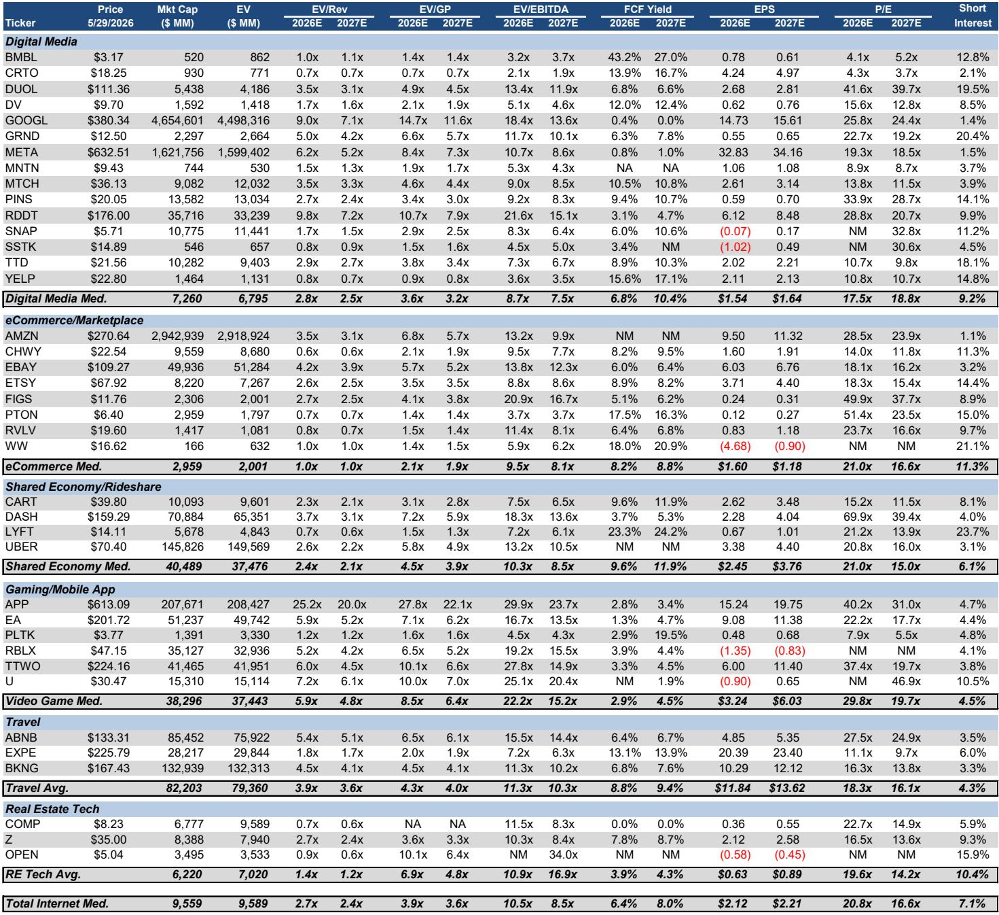
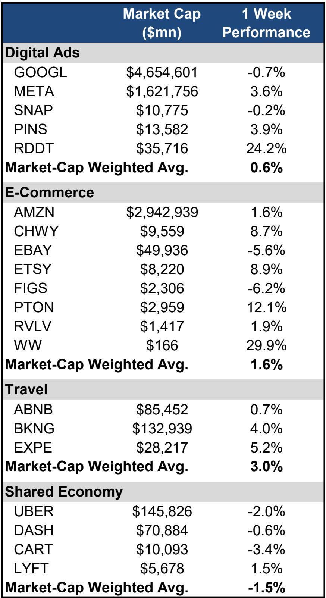
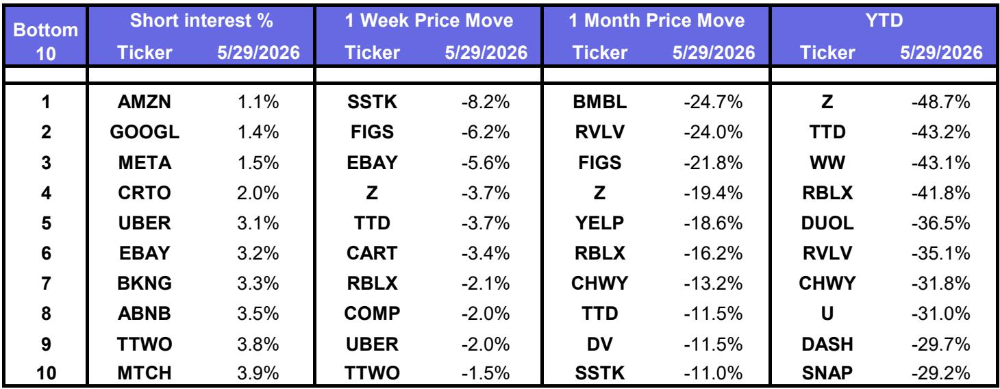

# The Market Is Pricing a Narrow AI Winner Thesis, But the Real Opportunity Lies in the Diverging Paths of Monetization and Multiple Compression

The North American internet sector rose modestly in the final week of May, with the broader market indices gaining one to three percent. Yet beneath this placid surface, a powerful sorting mechanism is at work. The mega-cap leaders that powered the first wave of the AI narrative are now trading at valuations that tell a more complex story than the simple "AI wins" thesis suggests. Amazon and Meta rose, Google declined, and a cluster of mid-cap names including Reddit and AppLovin posted outsized gains that have little to do with the large language model arms race and everything to do with specific, executable monetization strategies.

The critical insight for the summer of 2026 is this: the market is no longer rewarding AI exposure as a category. It is rewarding AI monetization. The distinction is not semantic; it is the central strategic question for every portfolio manager and corporate strategist watching this space. Companies that can demonstrate a clear line from AI capability to revenue acceleration are being revalued upward, while those that remain in the "build the platform" phase are seeing multiple compression despite fundamentally sound businesses.

This report, drawn from a major investment bank's detailed North America internet comp sheet and weekly performance tracker, provides the raw material for a more nuanced argument. The data through late May 2026 reveals a sector in transition. The easy money from the AI narrative has been made. What remains is the harder work of separating durable compounders from narrative-driven re-ratings that may have peaked.

## Mega-Cap Valuations Reveal a Market That Has Already Priced In the AI Promise, Creating a High Bar for Execution

The most striking feature of the current valuation landscape is not that mega-cap internet names are expensive. It is that they are expensive in ways that imply very different expectations. Amazon trades at 29x 2026 estimated earnings, which is 11 percent below its trailing twelve-month average. Meta trades at 19x, a full 23 percent below its trailing average. Google, at 26x, is only 2 percent above its average.

These numbers tell a story that is not immediately obvious from the price action alone. Amazon's relative cheapness compared to its own history suggests the market has already discounted significant margin expansion from its AI investments in AWS and logistics. The question is not whether Amazon will benefit from AI, but whether the benefit will be large enough to justify the current multiple. Meta's deep discount to its average, meanwhile, indicates that the market has already priced in the risk that its AI spending cycle will not produce proportional revenue acceleration. Google's near-average multiple suggests the market sees it as fairly valued, with neither the upside of Amazon nor the downside risk of Meta.

The implication is clear: for these mega-caps, the AI thesis is already in the price. The next leg of returns will depend on execution against a high bar, not on the narrative itself. This is a dangerous environment for investors who continue to buy the story without scrutinizing the numbers. The data does not support a blanket "buy the mega-cap AI winners" strategy. It supports a far more selective approach that differentiates between companies that have already monetized AI at scale and those that are still investing toward that goal.

## The Market Is Rotating Toward Specific AI Monetization Stories, Not Broad Sector Exposure

The one-week performance data reveals a clear pattern that is easy to miss if you only look at the index-level returns. Internet names as a group rose one percent, but the dispersion within that average is enormous. Reddit gained 24 percent, AppLovin surged 27 percent, and Pinterest added 4 percent. Meanwhile, Google declined by 1 percent and Uber fell by 2 percent.

What unites the outperformers? Each has a specific, demonstrable AI monetization story that is not dependent on general economic growth or advertising market share gains. Reddit's gain was linked to its Shopify integration, which uses AI to connect user discussions directly to commerce. AppLovin's continued surge reflects its AI-driven advertising optimization platform that has shown consistent ability to improve advertiser returns. Pinterest's modest gain came from its AI-powered visual search and shopping features.

These are not broad AI platform bets. They are specific product-level integrations where the AI capability is directly tied to a revenue-generating transaction. The market is rewarding this specificity. It is punishing companies that have AI capabilities but cannot yet show the revenue impact, or whose AI investments are still in the cost-heavy build phase.

This rotation has profound implications for portfolio construction. Owning the sector through an index or a basket of mega-caps will capture the average, but the average is being pulled down by the companies that are investing heavily without yet monetizing. The alpha in this environment comes from identifying the specific monetization triggers, not from betting on the sector as a whole.

## Mid-Cap and Small-Cap Internet Names Are Where the Most Interesting Risk-Reward Dynamics Are Emerging

The comp sheet data reveals that the most extreme valuations and the most dramatic price moves are occurring in the mid-cap and small-cap segments of the internet universe. AppLovin trades at 40x 2026 estimated earnings, more than double the median digital media multiple of 17.5x. Reddit trades at 29x. Duolingo, a language learning platform that has integrated AI into its core product, trades at 42x.

These multiples are not sustainable in any traditional valuation framework. But they reflect a market that is trying to price the option value of AI-driven growth acceleration. The critical question for investors is whether these companies can grow into their multiples, or whether they represent the kind of narrative-driven speculation that ends badly.

The data provides some clues. AppLovin's 2027 estimated P/E of 31x implies that the market expects significant earnings growth. Reddit's 2027 multiple of 21x suggests a similar assumption. But the comp sheet also shows that short interest in many of these names is elevated. Duolingo has 19.5 percent short interest. Pinterest has 14.1 percent. Reddit has 9.9 percent. This is not a market that is uniformly bullish on these stories. There is a significant contingent of investors who believe the current valuations are unsustainable.

The strategic implication is that the mid-cap internet space is becoming a battleground between two competing narratives. One narrative says that AI will enable a new generation of internet companies to grow faster and more profitably than ever before. The other says that the current multiples have already priced in years of future growth, leaving no margin for error. The resolution of this battle will determine which of these names become the next generation of mega-caps and which become cautionary tales.

## What the Report Does Not Fully Answer: The Sustainability of the AI Monetization Premium

The report provides a comprehensive snapshot of where the sector is trading, but it leaves several critical questions unanswered. The most important of these is whether the AI monetization premium that has been awarded to names like AppLovin and Reddit is sustainable, or whether it represents a temporary overvaluation that will correct as the market gains more data on actual revenue and earnings outcomes.

The comp sheet shows that many of the names with the highest multiples also have the most dramatic price moves. AppLovin is up 27 percent in a single week. Reddit is up 24 percent. These moves are not being driven by new fundamental data that justifies a revaluation of the entire business. They are being driven by specific product announcements and integrations that the market has interpreted as signals of future monetization potential. The question is whether these signals are reliable.

History suggests that the market tends to overestimate the near-term impact of new technologies and underestimate the long-term impact. The current enthusiasm for AI monetization may be following this pattern. The companies that are being rewarded today may be the ones that have the most visible AI-driven revenue streams, but visibility is not the same as sustainability. The report does not provide a framework for distinguishing between AI monetization that is durable and AI monetization that is a one-time boost from early adopters.

Another unanswered question is how the competitive dynamics will evolve as more companies deploy similar AI capabilities. If every advertising platform can offer AI-driven optimization, the premium that the market is assigning to the early movers may erode. The report's comp sheet shows that many companies are trading at very different multiples despite offering similar AI capabilities. This suggests that the market is making fine-grained distinctions that may not be justified by the underlying competitive dynamics.

## A Decision Framework for Navigating the Summer of AI

For investors and strategists trying to make sense of this environment, the data in this report suggests a three-part framework for evaluating internet names.

First, separate AI exposure from AI monetization. The market is no longer rewarding companies simply for having an AI strategy. It is rewarding companies that can show a direct line between AI capability and revenue growth. When evaluating any internet name, ask whether the AI investment is producing measurable revenue acceleration or whether it remains in the cost-heavy investment phase. The comp sheet provides the raw data for this analysis, but the interpretation requires a deep understanding of each company's business model.

Second, assess the sustainability of the monetization premium. Companies that are trading at multiples significantly above their historical averages and above their peer group need to demonstrate that their AI-driven growth is not a one-time event. Look for evidence of recurring revenue from AI products, expanding use cases, and increasing customer willingness to pay. The short interest data in the report can be a useful signal. High short interest in a name with a high multiple suggests that the market is divided on the sustainability question. Low short interest in a high-multiple name suggests that the market is more confident.

Third, consider the competitive moat. AI capabilities are becoming commoditized. The companies that will sustain their premium valuations are those that have proprietary data, network effects, or distribution advantages that cannot be easily replicated. The report's comp sheet shows that companies with strong network effects, such as Meta and Amazon, trade at lower multiples than some of the smaller names with less defensible positions. This may be a signal that the market is already pricing in the competitive risk for the smaller names, or it may be a sign that the smaller names are overvalued.

## The Unresolved Questions That Make This Report Worth Reading in Full

The most valuable insights from this report are not the ones that are explicitly stated. They are the questions that emerge from the data but are not fully answered. Why is Google, which has arguably the most advanced AI capabilities of any company in the sector, trading at a near-average multiple while AppLovin, a much smaller company with a narrower product set, trades at a massive premium? Is the market correctly pricing the risk that Google's AI investments will be commoditized by open-source competition, or is it missing the long-term value of Google's distribution and data advantages?

Why is the travel and shared economy segment, which includes companies like Uber and Airbnb that are heavily investing in AI, seeing negative price performance while the digital advertising segment is positive? Is this a temporary rotation driven by sentiment, or does it reflect a fundamental difference in the monetization timelines of these two segments?

These are not academic questions. They are the questions that will determine which portfolios outperform over the next twelve months. The report provides the data to ask these questions, but it does not provide the answers. That is why reading the full report, with its detailed comp sheets and performance trackers, is essential for anyone who wants to make informed investment decisions in this environment.

Join the community to read the full report and review the original charts.

*This article is for learning and discussion only and does not constitute investment advice.*

Personal reading notes and learning share only. Not investment advice.

