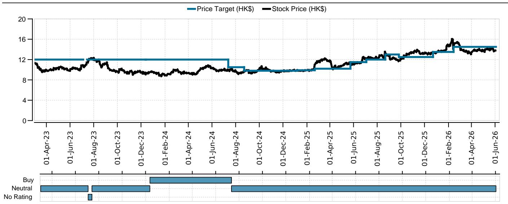
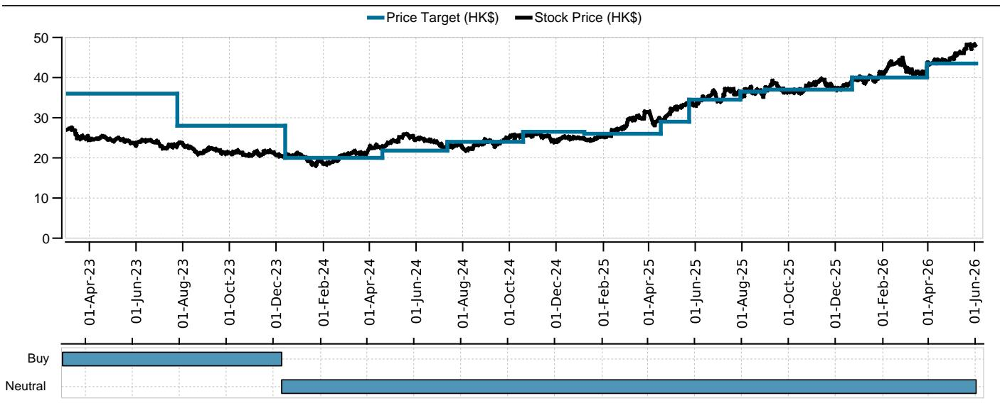
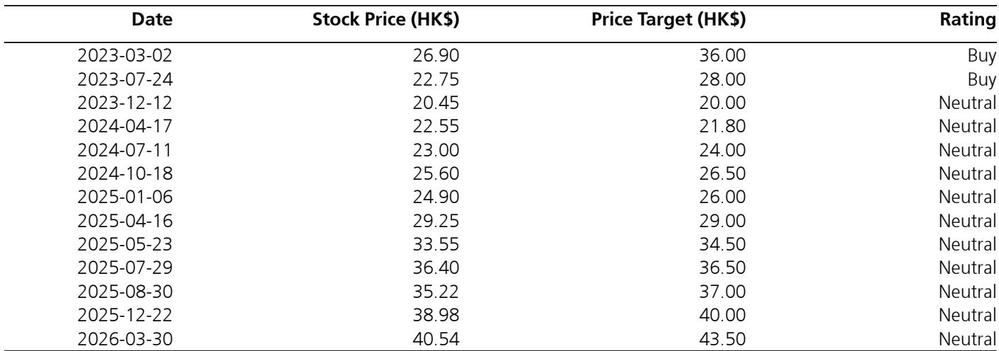

# Hong Kong Banks Face a Structural Reckoning: The Cross-Border Growth Engine Is Being Regulated Into Slow Motion

The dominant narrative for Hong Kong banks over the past three years has been straightforward: mainland Chinese capital, seeking higher yields and portfolio diversification, has flowed steadily into the territory's banking system, driving double-digit customer growth and robust wealth management revenues. That narrative is now being challenged by two concurrent regulatory actions that, taken together, represent the most significant constraint on cross-border financial activity since the pandemic-era capital controls. The China Securities Regulatory Commission's crackdown on illegal cross-border securities trading, followed by the Hong Kong Monetary Authority's additional procedures for investment accounts held by mainland Chinese investors, is not a temporary speed bump. It is a structural recalibration of the business model that has powered Hong Kong banks' recent growth.

The implications extend well beyond the immediate compliance burdens of signing new declarations on source of funds and document authenticity. These measures, combined with China's State Council's new regulation on mainland outbound investments effective July 2026, create a compounding effect that will reshape how Hong Kong banks acquire customers, generate fee income, and manage their balance sheets. The question for investors is not whether the near-term impact is manageable—the evidence suggests it is—but whether the medium-term trajectory for cross-border revenue growth has been permanently altered.

This analysis examines the strategic implications of these regulatory shifts, identifies which banks are most exposed, and provides a decision framework for positioning in a sector where the old growth formula is no longer reliable.

## The New Account Controls Target the Most Profitable Customer Segment, Not Just the Most Problematic One

The HKMA's additional measures, introduced in response to the CSRC's enforcement actions, require mainland Chinese investors opening investment accounts in Hong Kong to sign declarations covering three specific areas: the lawful source of funds outside mainland China, the authenticity of documents, and prior compliance records. On the surface, this appears to be a straightforward tightening of know-your-customer procedures—an incremental compliance cost that well-run banks can absorb. But the strategic significance is far deeper.

Mainland Chinese clients have been the marginal growth driver for Hong Kong banks over the past two to three years. Bank of China (Hong Kong) reported that its cross-border high-end customer base grew by more than 20% year-over-year, with wealth management income rising by 40% in 2025. Bank of East Asia recorded double-digit growth in its southbound cross-boundary client base, assets under management, and revenue in the same period. These are not peripheral business lines; they are the primary source of new customer acquisition and fee income expansion.

The critical insight is that the new controls do not merely target illegal activity. They create friction for the entire onboarding process for mainland clients. Every incremental declaration, every additional verification step, and every compliance review reduces the conversion rate of prospective clients. In a market where customer acquisition has been driven by ease of access and speed of execution, introducing procedural friction is economically meaningful even if compliance rates remain high. The banks with the highest exposure to mainland Chinese retail and high-net-worth clients—predominantly local Hong Kong banks rather than international peers—will feel this pressure most acutely.

International banks operating in Hong Kong have more diversified revenue streams and a lower proportion of mainland Chinese individual investors in their customer mix. Their securities investment services for mainland clients likely account for a small share of total revenue. Local Hong Kong banks, by contrast, have built their growth strategies around this demographic. The asymmetry of exposure is the first strategic consideration for investors: the regulatory tightening is not sector-neutral.

## The Outbound Investment Regulation Creates a Second Layer of Pressure on Corporate Banking Revenues

While the account controls affect retail and wealth management clients, the State Council's new regulation on mainland outbound investments, effective July 2026, targets the corporate side of the equation. The regulation introduces a framework for closer scrutiny of outbound investments by mainland Chinese entities, which will directly affect the corporate banking businesses of Hong Kong banks.

The numbers illustrate the scale of the issue. In 2025, China's trade surplus reached USD 1.2 trillion, yet foreign exchange reserves increased by only USD 155.5 billion. The implication is clear: a significant portion of China's trade surplus is being held offshore rather than repatriated. Hong Kong, as the primary offshore renminbi center and the most accessible international financial hub for mainland entities, is likely one of the key destinations for these funds. The new regulation aims to bring this offshore capital under closer supervision.

For Hong Kong banks, mainland China-related business contributes a double-digit share of revenue. Non-bank China exposure accounts for approximately 40% of the Hong Kong banking system's loan portfolio. The downstream effects of tighter outbound investment rules will be felt across multiple revenue streams: excess deposit balances that have been a cheap funding source, cash management and custodian services that generate fee income, insurance product distribution to mainland clients, and securities and brokerage trading volumes.

The compounding effect is what matters here. The account controls constrain retail and wealth management growth on the client acquisition side. The outbound investment regulation constrains corporate banking growth on the balance sheet side. Together, they create a simultaneous headwind for both the fee income and net interest income components of Hong Kong banks' revenue. This is not a single-issue regulatory event; it is a coordinated policy signal that the era of easy cross-border capital movement is being recalibrated.

## Valuation Disparity Reflects Different Risk Profiles, Not Different Outcomes

The current valuation landscape for Hong Kong banks reveals an interesting divergence that may not fully account for the regulatory risks. Bank of China (Hong Kong) trades at 1.4 times 2026 estimated price-to-book, with a dividend yield of 4.9%. Bank of East Asia trades at 0.3 times 2026 estimated price-to-book, a level that appears deeply undemanding by any historical standard.

The disparity in valuations reflects different risk profiles, but the regulatory headwinds may be more evenly distributed than the market currently prices. For BOCHK, the premium valuation already embeds expectations of continued cross-border growth. The question is whether the new regulatory environment can support those expectations. The bank's three-year shareholder framework, which investors have been monitoring for dividend and capital return signals, may need to be reassessed in light of slower customer acquisition and potentially lower revenue growth from cross-border activities.

For BEA, the low valuation is not a bargain if the regulatory environment delays the bank's progress toward its 2028 return on equity target of 7%. The key variable for BEA is not valuation but credit costs. If the new regulations slow economic activity and corporate cash flows, the credit quality of BEA's loan book—particularly its exposure to mainland China property developers and Hong Kong commercial real estate—becomes a more acute concern. A bank trading at 0.3 times book value is not cheap if book value itself is at risk.

The shared vulnerability is that both banks have built their strategic plans around cross-border growth that is now being constrained. The difference in valuation multiples may narrow not because BEA re-rates upward, but because BOCHK's premium compresses as the market re-evaluates the sustainability of its growth trajectory.

## What the Report Does Not Fully Answer: The Second-Order Effects on Deposit Franchises and Net Interest Margins

The report focuses primarily on the immediate revenue and customer growth implications of the regulatory changes. But there are second-order effects that deserve deeper exploration, and the report leaves several critical questions open.

The first unanswered question concerns the impact on deposit franchises. Hong Kong banks have benefited from a significant inflow of mainland Chinese deposits, which have provided cheap and stable funding. If the new outbound investment rules reduce the flow of offshore deposits, Hong Kong banks will face a funding gap that may need to be filled with more expensive wholesale funding or higher-rate local deposits. This would compress net interest margins precisely when loan growth is also under pressure.

The second question relates to the competitive dynamics between local and international banks. If mainland Chinese clients face higher friction in opening accounts with local Hong Kong banks, will they shift their business to international banks that have different compliance frameworks and potentially less scrutiny from mainland regulators? Or will the regulation push clients toward private banking channels that are less affected by the new procedures? The report suggests local banks face greater pressure, but it does not fully explore whether this creates a competitive opportunity for global players.

The third open question is about the timeline. The outbound investment regulation does not take effect until July 2026. This creates a window of uncertainty where banks and clients may accelerate activity before the rules take effect, potentially creating a near-term boost followed by a sharper slowdown. The report acknowledges that implementation details are pending, but it does not model the potential for a "pull-forward" effect that could distort near-term performance metrics.

These unanswered questions are not criticisms of the analysis; they are the natural boundaries of what can be known at this stage. But they are precisely the questions that investors should be tracking as the regulatory framework becomes clearer.

## A Decision Framework for Positioning in Hong Kong Banks

For investors evaluating Hong Kong banks in this new regulatory environment, the analytical framework should shift from a growth-focused lens to a resilience-focused lens. The following framework organizes the key decision points.

First, assess revenue concentration risk. The critical metric is not simply the proportion of revenue from mainland Chinese clients, but the growth trajectory of that revenue. Banks where cross-border clients have been the marginal growth driver—where new customer acquisition has been concentrated in this segment—face a more significant growth deceleration than banks where mainland business is a stable, mature contributor. The distinction matters because a mature business can be managed for cash flow and dividends, while a growth business that suddenly stops growing creates valuation compression.

Second, evaluate the balance sheet flexibility to absorb slower growth. Banks with higher capital ratios, lower loan-to-deposit ratios, and more diversified funding sources have greater strategic optionality. They can return capital to shareholders through buybacks or special dividends if organic growth opportunities diminish. Banks that are capital-constrained or dependent on cross-border deposits for funding are more vulnerable.

Third, analyze the fee income composition. Wealth management fees, securities brokerage commissions, and insurance distribution income are the revenue streams most directly affected by the account controls. Banks with a higher proportion of recurring fee income from asset management or custody services, as opposed to transaction-based fees, will be more resilient. The distinction between recurring and transactional revenue becomes a key differentiator.

Fourth, consider the credit cycle implications. Tighter outbound investment rules may reduce corporate cash flows and investment activity, which could lead to higher credit losses in the corporate loan book. Banks with higher exposure to mainland China property developers, Hong Kong commercial real estate, or trade finance are more exposed. The credit cost trajectory, as the report highlights for BEA, becomes a more important variable than revenue growth in determining shareholder returns.

Fifth, evaluate the dividend sustainability. Banks that have been increasing dividends based on cross-border growth assumptions may need to recalibrate their payout policies. A dividend cut in a rising regulatory risk environment would compound the negative sentiment. Banks with conservative payout ratios and strong capital generation are better positioned to maintain or grow dividends even if revenue growth slows.

## The Path Forward Requires a New Investment Thesis for the Sector

The regulatory changes affecting Hong Kong banks are not isolated events. They are part of a broader policy framework that seeks to manage capital outflows, maintain financial stability, and align offshore financial activity with domestic regulatory objectives. Hong Kong's role as the gateway for Chinese capital will not disappear, but the terms of engagement are being rewritten.

The investment case for Hong Kong banks going forward will depend less on the pace of cross-border customer acquisition and more on the quality of existing customer relationships, the efficiency of operations, and the ability to generate returns from a slower-growth environment. Banks that can maintain return on equity in a lower-growth regime, while returning excess capital to shareholders, will outperform. Banks that were dependent on high growth to justify their valuations will face downward pressure.

The report's neutral ratings on both BOCHK and BEA reflect this uncertainty. For BOCHK, the question is whether a 1.4 times price-to-book valuation can be sustained without the growth that justified it. For BEA, the question is whether the path to 7% return on equity is achievable when one of the key growth drivers is being constrained. Neither question has a clear answer today, which is precisely why the sector requires active monitoring rather than passive positioning.

Join the community to read the full report and review the original charts.

*This article is for learning and discussion only and does not constitute investment advice.*

Personal reading notes and learning share only. Not investment advice.

