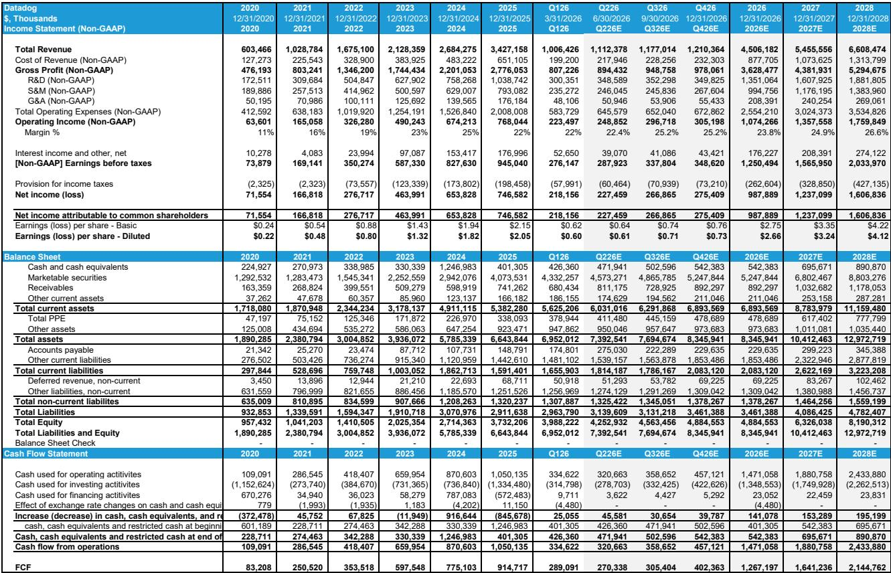
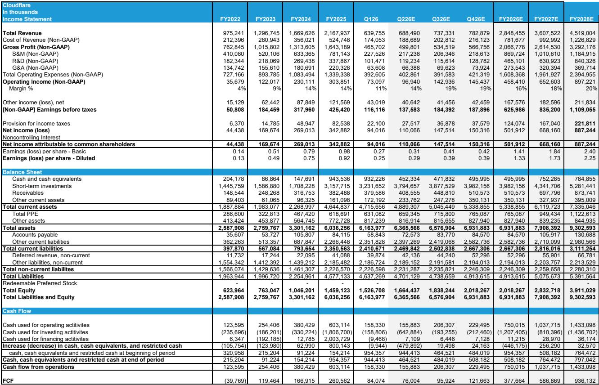
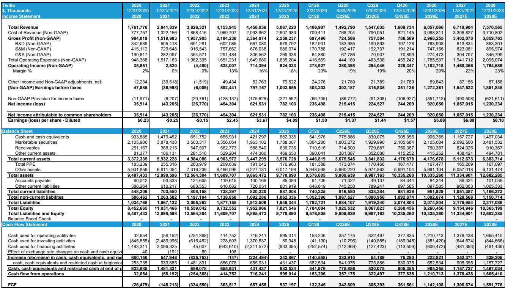

# 云消费的增长势头正在出现一个被市场忽略的拐点

过去四个季度，市场对云计算的需求信号之强，被某外资投行的另类数据追踪为“自疫情以来最强劲”。这份强劲已经反映在AWS的财报中，也带动了Datadog、Snowflake、Cloudflare等云消费相关标的的股价表现。然而，该投行最新发布的AWS网络指标数据显示，一个值得警惕的趋势正在浮现：在过去四周（加上本周初），增长曲线出现了异常的平缓，与过去三年的季节性模式明显背离。

这并不是一个已经确认的结论，而是一个需要密切关注的早期信号。如果这个趋势持续，它可能意味着市场对云消费的线性外推——即AI拉动需求持续加速——需要被重新审视。更关键的是，这个信号背后可能隐藏着比“需求放缓”更复杂的结构性变化。

## 1. 当前季度财报不受影响，但Q4的非AI消费可能承压

理解这个信号的时序影响，是判断其重要性的第一步。该投行使用的AWS单点登录（SSO）页面交互数据，是一个领先指标，与AWS的营收有大约一个季度的相关性。也就是说，我们目前看到的Q2初期的数据平缓，反映的是Q3的增量ARR变化，而不是即将发布的Q2财报。

根据报告，Q2的营收将主要反映Q1的强劲信号。该投行预计Q2的AWS营收增速可能还会再加速100个基点。因此，对于即将到来的财报季，市场不必过度担忧。

问题出在更远的未来。如果当前的增长平缓趋势延续到Q3的网络指标数据中，那么Q4的非AI消费将面临显著的同比增速压力。报告特别指出，Q3 2025的基数本身就比较强，这意味着即使Q2后期的疲软在6月得到逆转，Q3的同比增长也只会是“正常”水平。真正的风险在于，如果Q3的数据也表现疲软，那么Q4的同比增速将面临一个明显的“数学上的”逆风。

这意味着，市场目前对云消费的乐观预期，可能在下半年面临一个现实的检验。投资者需要关注的不是即将到来的财报，而是Q3的季中更新信号。

## 2. 增长平缓的根源不是需求不足，而是供给侧的结构性错配

为什么在AI需求如此旺盛的背景下，云消费的增长会突然平缓？该投行通过访谈大型软件公司、大型成长型软件PE基金以及企业买家顾问，得出了一个与直觉相反的结论：问题不在于需求不足，而在于供给侧的瓶颈。

核心论点是：超大规模云服务商正在面临容量约束，新增的计算资源被大量分配给前沿AI实验室，留给其他买家（如传统企业、软件厂商）的可用供应量正在减少。换句话说，不是企业不想上云，而是他们想上的时候，发现“算力”这个资源被AI巨头们“挤占”了。

报告还从产品团队买家的角度，听到了两个更具体的微观解释：

- 网络安全合规的紧迫性：由“神话”（Mythos）引发的网络安全紧迫感，造成了巨大的积压问题需要解决。企业正在全力冲刺解决这些安全问题，而不是去开展下一个新的增量工作负载。
- “Token过度消费”的后遗症：一些产品团队正在尝试控制对编码助手和AI Copilot的支出增长。在经历了快速采用期后，它们正在“重置”并施加纪律。

这两个微观解释非常关键。它们暗示，当前的增长平缓并非永久性的需求萎缩，而是短期内的资源再分配和内部治理的调整。这为后续需求的恢复埋下了伏笔。

## 3. 这个信号对不同公司的含义完全不同

一个重要的洞察是，这个信号对不同公司的冲击是非对称的。该投行明确表示，一个更疲软的消费环境在Q3+可能对传统企业买家和云软件厂商产生冲击，但对于“生于AI”的群体（即与AI相关的AWS和Datadog的AI业务线）来说，问题不大。

这意味着，投资者需要区分两类公司：

- 传统云消费受益者：这类公司的增长与企业的常规IT工作负载迁移和增量项目高度相关。如果供给瓶颈导致企业无法启动新项目，它们的增长将直接承压。报告中没有点名，但可以推断，那些依赖企业IT预算的SaaS公司，可能会面临更大的挑战。

- AI原生受益者：这类公司的增长与AI工作负载直接挂钩。即使总容量受限，只要AWS将更多容量分配给高利润的AI工作负载，这些公司的业务依然可以保持强劲。Datadog的AI业务线和AWS自身的AI服务都属于这个范畴。

这个区分意味着，市场对“云消费”这个笼统概念的定价可能需要分化。那些被错误归入“AI受益”但实际是“传统云消费”的公司，其估值可能面临修正。

## 4. 供给瓶颈反而可能成为AWS的定价权来源

报告中一个反直觉的推论是：供给瓶颈对AWS本身可能不是坏事。如果供应受限，那么企业为了获得容量来部署新工作负载，将面临一个更具竞争性的环境。这给了AWS定价杠杆。

更深入一层，如果有限的容量被更多地分配给高利润的AI工作负载，那么AWS的财务表现（尤其是利润率）可能会因此受益。这意味着，即使总营收增速因非AI消费疲软而放缓，AWS的单位经济模型可能会变得更好。

这是市场目前可能没有定价的因素。市场通常将“增长放缓”视为负面信号，但如果这种放缓是由“主动选择更高利润的客户”驱动的，那么它对股东的长期价值可能是正面的。报告没有完全展开这个逻辑，但它暗示了，在评估AWS时，营收增速和利润率之间的权衡可能正在发生变化。

## 5. 报告尚未完全回答的关键问题：这个趋势是“噪音”还是“新常态”？

该投行自己也承认，另类数据可能会因为各种原因与基本面脱节。他们过去也看到过数据在短期内出现波动，但这次长达四周以上的疲软，让他们认为“更可能是一个趋势”。

然而，报告中至少有两个关键问题没有完全回答：

- 容量瓶颈何时能缓解？ 超大规模云服务商的资本开支计划是巨大的，但新产能的交付需要时间。这个供给瓶颈是未来几个季度的短期现象，还是一个持续的结构性问题？报告没有给出明确的时间表。

- 企业内部的“重置”是暂时的还是永久性的？ 产品团队对AI Copilot的“Token过度消费”进行纪律约束，是短期的“宿醉”，还是企业开始理性评估AI投入产出比的长期趋势？这个问题对判断AI需求的可持续性至关重要。

这两个问题，正是决定这个信号是“噪音”还是“新常态”的关键。如果供给瓶颈在Q3得到缓解，企业内部的“重置”也只是短期行为，那么当前的增长平缓可能只是一个“假摔”。反之，如果这两个因素持续发酵，那么市场对云消费的长期增长假设就需要重新定价。

这篇报告的真正价值，不在于给出了一个确定的结论，而在于提出了一个值得持续追踪的假设。它提醒我们，在AI驱动的增长叙事下，微观层面的供给和内部治理因素，正在成为影响宏观趋势的不可忽视的力量。

对于希望深入理解这些未解问题，并跟踪后续数据更新的读者，欢迎来星球微信群里继续讨论。我们将持续关注该投行的后续报告，以及关键公司的财报电话会议中关于容量和消费趋势的评论。

Personal reading notes and learning share only. Not investment advice.

