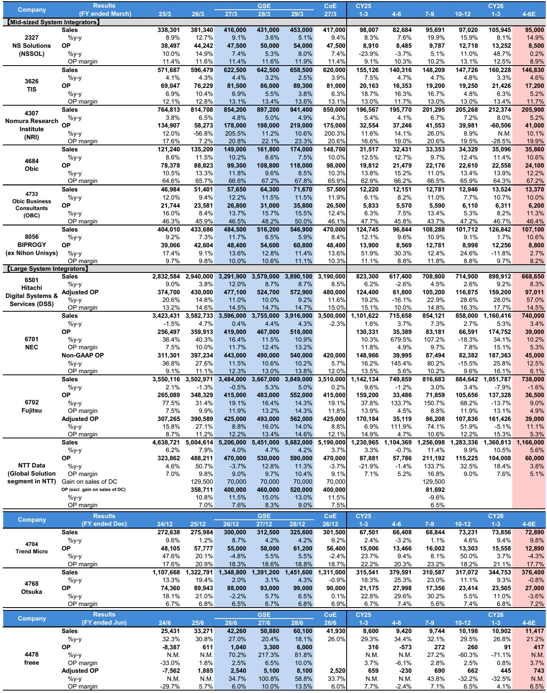
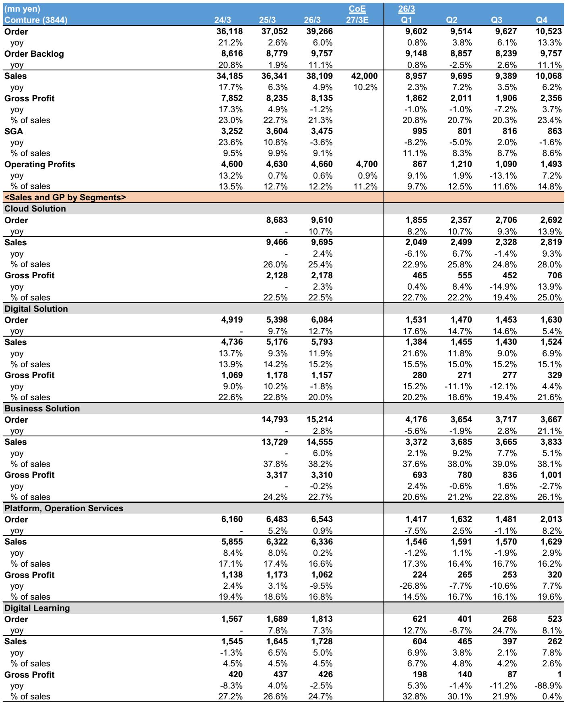
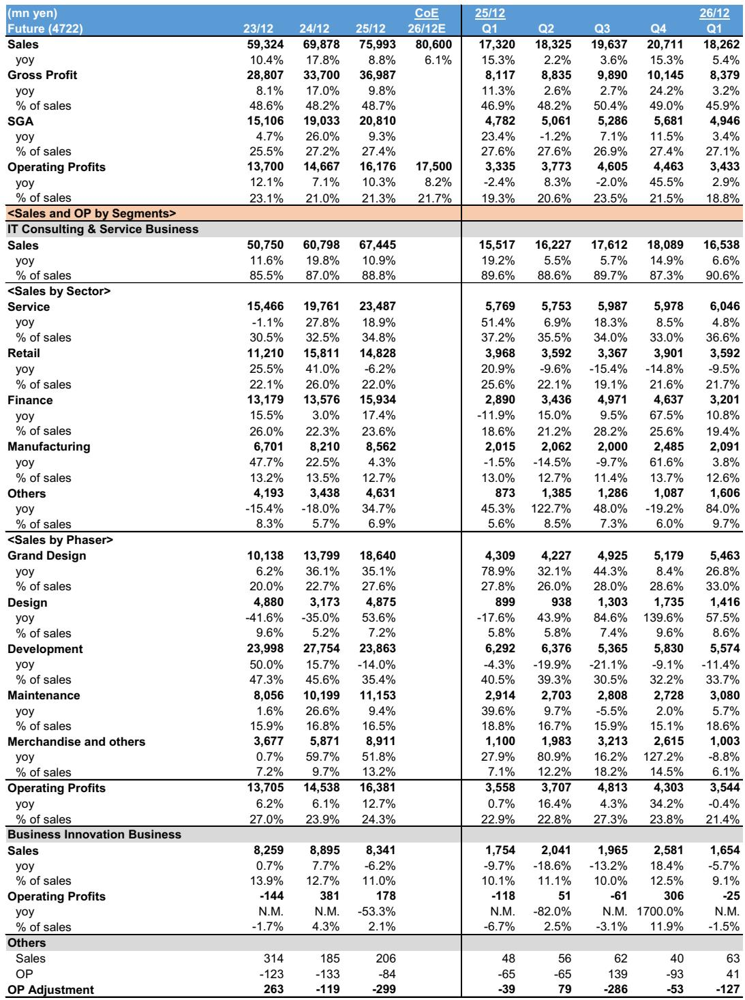

# 日本IT服务业的真相：市场低估了项目空窗期的深度，而非需求的结构性衰退

日本IT服务板块正在经历一个微妙但关键的转折点。某外资投行最新发布的一份研报，通过对三家非覆盖公司——Future、SIGMAXYZ和Comture的实地调研，揭示了一个被市场普遍忽视的信号：当前行业面临的不是需求萎缩，而是大型项目周期切换带来的“空窗期”。这三家公司分别代表了咨询/SI、纯咨询和云集成三个细分赛道，它们的业绩轨迹共同指向一个判断——板块盈利能力的底部可能比预期更深，但结构性需求并未消失，只是正在重新分配。

这份研报的价值不在于给出买入或卖出的简单结论，而在于它提供了一个从微观企业行为反推行业周期的观察框架。对于关注日本IT服务板块的投资者而言，理解这三家公司正在经历的阵痛，比追逐宏观叙事更为重要。

## 1. 咨询业务的利润下滑是周期性的，但“项目空窗期”的持续时间超出预期

SIGMAXYZ的数据最具警示意义。该公司4Q3/26咨询业务销售额同比下降15%，对前十大客户的销售额更是骤降35%，两者均连续第三个季度负增长。管理层将此归因于多个核心系统更新（SaaS）项目的集中收尾。咨询师利用率同比下滑6个百分点至70%，且公司预计这一趋势将持续到1H3/27。

问题不在于需求消失，而在于大型项目的“波峰”与“波谷”之间的过渡期比预期更长。SIGMAXYZ的客户投资意愿并未因宏观环境（如中东局势）而减弱，但新项目从询价到正式启动存在时间差。公司预计盈利复苏要到2H3/27才能实现，这意味着空窗期可能持续长达两个季度。

对行业而言，这意味着：那些依赖少数大型客户、项目集中度高的咨询公司，在2026财年上半年将面临更大的盈利压力。投资者的观察重点应从“订单是否增长”转向“新项目启动速度是否快于预期”。

## 2. 云集成业务的毛利率下行是结构性压力，成本转嫁能力成为关键分水岭

Comture的案例揭示了另一个层面的风险。这家云集成商FY3/26营业利润同比仅增长1%，大幅低于指引，核心原因是云解决方案业务需求疲软，加上成本转嫁进展缓慢。毛利率同比下降1.3个百分点，工资上涨是主要拖累。更值得关注的是，公司给出的FY3/27营业利润指引仅为同比微增1%，这意味着盈利困境可能延续至第三年。

订单环境确实在改善——4Q3/26订单同比增长13%，连续四个季度加速，数据管理、数据湖以及AWS云（AI基础设施）领域需求强劲。但问题在于，订单增长未能有效传导至利润。Comture明确表示，核心Salesforce云产品在日本国内的渗透率已经很高，增长空间有限。同时，公司还面临内部系统折旧、工资上涨等费用压力，SG&A费用预计同比增长18%。

这里的关键洞察是：云集成业务的竞争正在从“获取客户”转向“管理成本”。那些能够将工资上涨、人力成本有效转嫁给客户的公司，将获得超额利润；而转嫁能力弱的公司，即使订单回暖，盈利改善也将非常有限。Comture的毛利率下行趋势尚未触底，这一信号值得投资者警惕。

## 3. 下一代银行系统的客户获取速度低于预期，但共享系统逻辑依然成立

Future的咨询业务在1Q（1-3月）营业利润同比仅增长3%，剔除下一代银行系统的一次性许可费收入后，已是连续第四个季度营业利润同比下降。好消息是降幅显著收窄，但坏消息是下一代银行系统的客户获取进度“略低于内部假设”。

截至报告期，Future已获取6家银行用户，第7家及之后的银行客户获取进度落后于预期。这意味着1H的一次性许可费收入可能低于公司原有假设。不过，报告也指出，SBI新生银行的大型项目正处于总体设计阶段，预计2H进入全面开发阶段，系统切换要到FY12/29之后。项目周期之长，说明这类业务的收入确认节奏高度不确定。

尽管如此，这份研报的跨公司分析（read-across）仍给出了一个明确的投资信号：区域银行对共享系统的需求正在扩大，这对在该领域拥有强大市场地位的BIPROGY（某投行给予买入评级）构成盈利利好。共享系统逻辑的核心在于，单个银行的系统投资预算有限，但多家银行联合采购共享平台，可以摊薄成本、提升效率。这一需求趋势并未因Future的短期客户获取放缓而改变。

对投资者而言，需要区分两类信息：一是Future自身的执行节奏问题（客户获取慢于预期），二是行业结构性趋势（区域银行共享系统需求扩大）。后者才是更值得关注的长期变量。

## 4. 资本联盟成为咨询公司突破增长瓶颈的新策略，但协同效应仍需验证

SIGMAXYZ宣布正在考虑与Core Concept Technologies（CCT）进行资本和业务联盟。SIGMAXYZ目前持有CCT 10.64%的股权，并计划在2027年3月底前将投票权比例提升至能够采用权益法核算的水平。

CCT是一家专注于制造业中型企业的DX支持和IT人员派遣公司，不涉及咨询业务。SIGMAXYZ认为双方业务具有互补性——CCT在制造业的客户基础可以弥补SIGMAXYZ的行业覆盖空白，而SIGMAXYZ的咨询能力可以提升CCT的项目附加值。

这一策略的逻辑是清晰的：在咨询业务面临项目空窗期的背景下，通过资本联盟获取新的客户资源和行业垂直能力，比内生增长更有效率。但这里存在两个需要验证的问题：第一，资本联盟能否真正带来客户转化，还是仅仅停留在财务投资层面；第二，两家公司的企业文化、项目交付标准能否有效整合。报告对此并未展开分析，这恰恰是投资者需要持续跟踪的关键点。

从更广的视角看，日本IT服务行业的整合正在加速。中小型咨询公司面临人才短缺、成本上升、客户需求碎片化等多重压力，通过并购或联盟实现规模效应和行业聚焦，可能成为未来几年的主流趋势。

## 5. 报告尚未完全回答的关键问题：AI需求能否真正转化为利润增量

三家公司的管理层都提到了AI相关需求。Comture认为，随着生成式AI的普及，数据管理/数据湖领域以及AWS云（AI基础设施）的需求将持续扩大。SIGMAXYZ也指出，AI咨询需求强劲，尤其是数据基础设施建设和AI应用领域。

但报告没有给出一个关键判断：AI需求对利润的贡献率是多少？目前，AI项目往往处于早期阶段，项目规模小、标准化程度低，咨询公司需要投入大量人力进行定制化开发，利润率可能低于传统核心系统更新项目。Comture的订单增长与利润低迷并存，或许已经暗示了这一点——AI相关订单虽然增长快，但可能拉低了整体毛利率。

另一个未解问题是：AI需求能否填补核心系统更新项目收尾后的收入缺口？SIGMAXYZ的询价量虽然处于恢复趋势，但主要集中在核心系统更新项目，AI咨询需求是否足够大、是否可持续，仍需时间验证。

这些问题的答案，将决定日本IT服务板块未来12-18个月的盈利轨迹。目前来看，“AI红利”更多体现在订单层面，而非利润层面。投资者在评估相关公司时，需要区分“订单增长”和“利润改善”是两个不同的变量。

## 6. 投资者需要建立一个“项目周期+成本转嫁”的双维观察框架

基于上述分析，评估日本IT服务公司的投资价值，不能只看收入增速或订单金额，而应建立一个更精细的框架：

第一，项目周期位置。需要判断公司当前处于大型项目的哪个阶段——是项目启动期（高投入、低利润）、执行期（利润释放）还是收尾期（收入下降、人员闲置）。SIGMAXYZ的利用率下滑和Comture的订单回暖，分别代表了空窗期的不同阶段。

第二，成本转嫁能力。在工资上涨的大背景下，公司能否将人力成本上涨转嫁给客户，决定了毛利率的走向。Comture的毛利率持续下行，而Future的咨询业务利润率降幅收窄，说明转嫁能力存在差异。转嫁能力的核心指标是客户集中度和项目不可替代性——客户越分散、项目越定制化，转嫁能力越强。

第三，AI需求的利润转化率。目前市场对AI主题的定价可能过于乐观。投资者需要关注AI项目的毛利率是否低于传统项目，以及AI收入占比提升是否会拉低整体利润率。

第四，资本配置效率。SIGMAXYZ的资本联盟策略值得跟踪，但需要关注其投资回报率是否高于内生增长。如果资本联盟只是扩大了收入规模而未能改善利润率，那么对股东价值的贡献将是有限的。

---

这份研报最值得深思的地方，在于它揭示了一个反直觉的行业现实：在AI热潮和数字化转型的大叙事下，日本IT服务板块的微观企业正在经历一场“盈利底部的延长赛”。项目空窗期、成本转嫁困难、AI利润转化率不明，这些因素叠加在一起，意味着板块的整体盈利拐点可能比市场预期的更晚到来。

但与此同时，结构性需求并未消失。区域银行的共享系统、制造业的DX需求、AI基础设施的建设，这些长期趋势依然成立。问题在于，哪些公司能够穿越周期，在下一轮增长中占据更有利的位置。答案可能不在研报的结论里，而在那些尚未完全展开的细节中——比如Comture的订单结构变化、SIGMAXYZ的资本联盟进展、Future的下一代银行系统客户获取节奏。

这些未解的问题，恰恰是继续深入研究的价值所在。欢迎来星球微信群里继续讨论，我们可以一起追踪这些公司的季度变化，验证或修正上述判断。

Personal reading notes and learning share only. Not investment advice.

