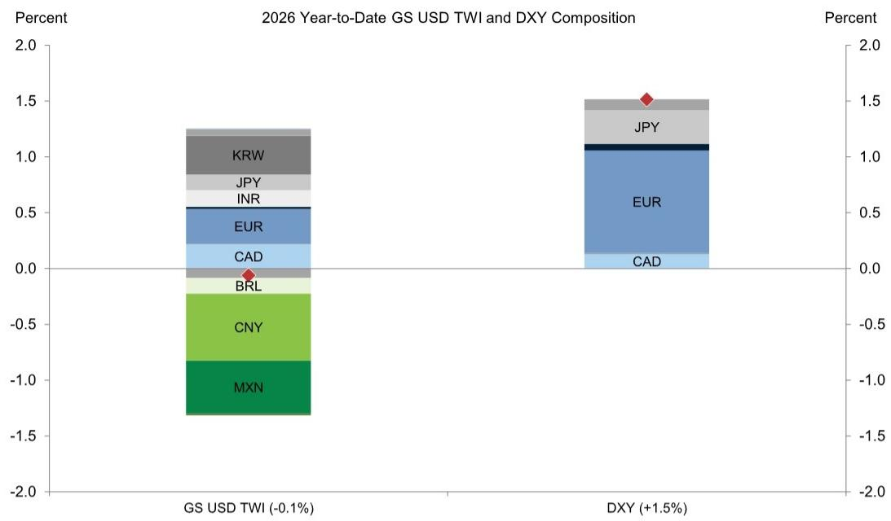
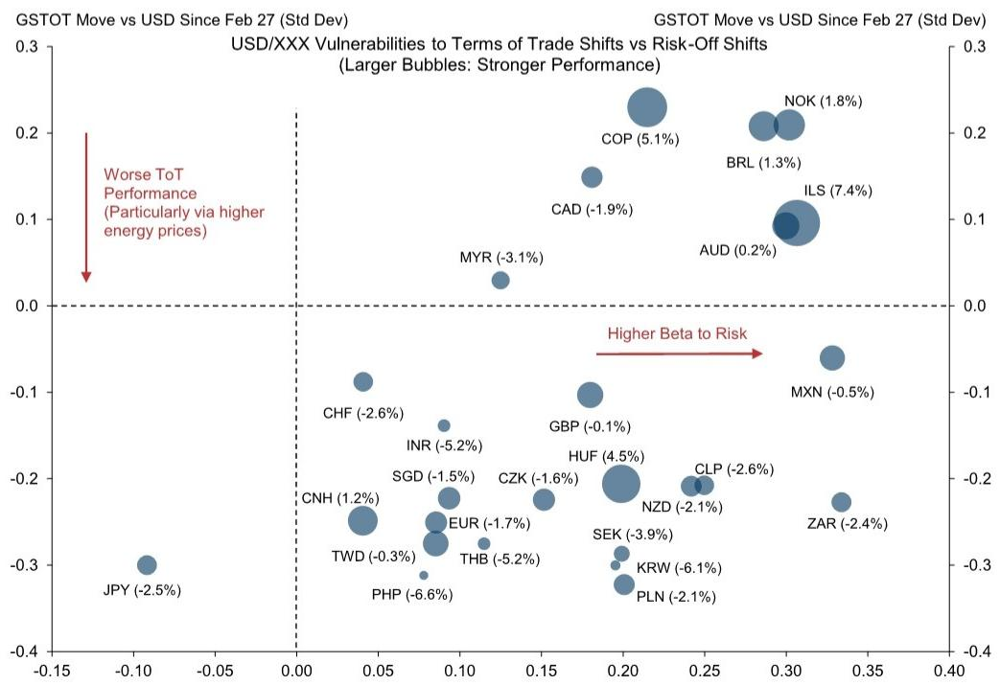
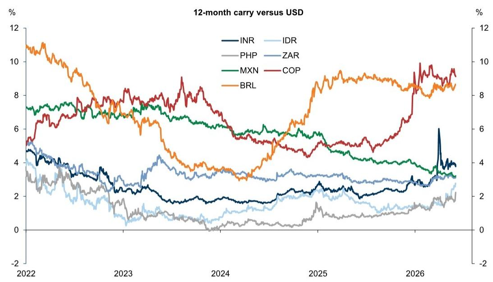

GLOBAL FX TRADER

Heating Up

# Our thoughts on USD, JPY, The Resolution Playbook, EM Carry, CAD, INR and IDR

USD: Divided we stand. The divided dollar spent another week wrestling offsetting impulses but finished the week moderately stronger. On the one hand, cyclical activity data remains firmly reflationary, with a bumper payrolls report and the ISM surveys providing evidence both of better growth prospects and uncomfortable inflationary pressures, and that has pushed rate differentials in favour of the Dollar, especially versus Europe. On the other hand, while many commodity and high carry EM currencies have been resilient through the conflict, as US-Iran negotiations inch forward, the potential for lower oil prices and relief across key energy importing economies has raised the prospect of gains across lower-yielding cyclical currencies as well (see Resolution Playbook bullet). And over this period, the persistent appreciation in the Chinese Renminbi—a trend that we think is likely to be gradual but sustained beyond consensus expectations—and the stickiness of the Japanese Yen—through a combination of actual and threatened interventions—has meant that the Dollar is truly divided. As an illustration, the DXY index with a heavy weight in the Euro and other G10 currencies is up \~+1.5% year-to-date even as the broader USD Trade-weighted Index is down by about \~-0.1% (Exhibit 1). We continue to think that the imprint of the War will keep the cyclical news in the Dollar’s favour for a while longer versus the majors, but if the data is unable to push the Dollar clearly out of recent ranges, the focus may shift to upcoming policy meetings. Given the current resilient activity and high inflation mix, Chair Warsh may come across as more hawkish than many market participants expect, but that may not be enough to push the Dollar higher if global equity risk continues to trade well on more positive Iran War headlines and that weighs on the cyclical dollar. Without a clearer resolution one way or another, we envisage more divided Dollar performance ahead, and a fair backdrop for carry strategies.

Kamakshya Trivedi

+44(20)7051-4005

kamakshya.trivedi@gs.com

GS International

Michael Cahill

+44(20)7552-8314

michael.e.cahill@gs.com

GS International

Danny Suwanapruti

+65-6889-1987

danny.suwanapruti@gs.com

GS (Singapore) Pte

Teresa Alves

+44(20)7051-7566

teresa.alves@gs.com

GS International

Karen Reichgott Fishman

+1(212)855-6006

karen.fishman@gs.com

GS & Co. LLC

Stuart Jenkins

+44(20)7051-4700

stuart.jenkins@gs.com

GS International

Victor Engel

+44(20)7051-3862

victor.engel@gs.com

GS International

Lexi Kanter

+1(212)855-9701

alexandra.kanter@gs.com

GS & Co. LLC

Exhibit 1: Divergent year-to-date performance across DXY and our Dollar TWI is testament to divided recent Dollar performance   

bar_stacked

2026 Year-to-Date GS USD TWI and DXY Composition
| Currency Pair | GS USD TWI (%) | DXY (%) |
| :--- | :--- | :--- |
| KRW | -0.1 | 0.3 |
| JPY | -0.1 | 0.4 |
| INR | -0.1 | 0.3 |
| EUR | -0.1 | 0.5 |
| CAD | -0.1 | 0.3 |
| BRL | -0.1 | 0.0 |
| CNY | -0.1 | 0.5 |
| MXN | -0.1 | -0.9 |
The chart displays two stacked bars: the left bar represents GS USD TWI, and the right bar represents DXY. The red diamond at -0.1 indicates the base pair of each pair, while the diamond at 1.5 indicates the top pair of each pair. The Y-axis represents Percent (ranging from -2.0 to 2.0).

Source: Bloomberg, GS Global Investment Research

JPY: Taking the hike. Governor Ueda in his June 3 speech appeared to signal a hike at the next BoJ meeting, endorsing market pricing and leading our economists to pull forward their July hike to June. In his remarks, he alluded to one justification being that markets could perceive the Board as behind the curve if it were to disappoint expectations, which would put further upward pressure on long-term yields—a point he also likely emphasized when meeting with PM Takaichi a couple weeks ago. Though the main emphasis, since even the April meeting, was greater concern around the upside risks to inflation rather than the downside risks to growth. The challenge for the BoJ is the high bar for a hawkish surprise, and a continued message of only gradual hikes would likely prove insufficient to strengthen the currency. We also see two other reasons to anticipate continued depreciation pressures over the nearer-term, even if the administration intervenes again. First, the combination of higher-for-longer US yields (with risks still skewed to the upside) and constructive risk sentiment tends to weigh on the Yen. Second, lingering fiscal risks will likely return to the forefront with spending plans set to be clarified over the coming months. Moreover, those anticipating JPY-positive repatriation flows are still likely to be left disappointed, barring any policy directive or a more favorable rate differential. But even the impact of a policy pivot could be relatively short-lived without a change in the broader macro backdrop; FX tends to trade most closely with cyclical fundamentals rather than capital flows when they have opposing implications. Taken together, we continue to like JPY funding despite intervention risk.

The Resolution Playbook. As the conflict in the Middle East nears the 100-day mark, flows through the Strait remain heavily constrained, and terms of trade pressures in FX markets have continued to steadily expand. While we continue to think the onus is on a tangible recovery in energy flows to start reversing the terms of trade imprint, the recent string of more constructive soundbites on the conflict have shifted investor focus to resolution opportunities. We think the simple framework we have been using throughout the energy shock offers a useful playbook for deescalation in FX markets. Many of our preferred longs in recent months have been procyclical currencies that are net energy exporters (including AUD and BRL), and while risk-sentiment should remain firmly supported on a resolution and keep procyclical currencies bid, the terms of trade dimension of the shock should reverse. Along these two axes, we think the candidate outperformers on a resolution would rotate from high-beta energy exporters (the upper-right quadrant of Exhibit 2) to high-beta energy importers (the lower-right quadrant). We see ZAR, KRW, PLN, CLP, and HUF as the most likely beneficiaries in EM space, with recent HUF outperformance on the EU convergence trade an unlikely barrier to further gains from energy relief in our view, though continued equity outflows in Korea would likely undermine the resolution boost for KRW. In G10 space, we see SEK, NZD, and GBP as the top candidate resolution longs under this framework. Overlaying the potential terms of trade reversal with domestic macro and valuation factors remains key in our view though, and is a reason why we see greater value in targeting a reversal in AUD/NZD versus in NOK/SEK for instance, and why we remain constructive HUF even without a resolution. Finally, even in the event of a full restoration of energy flows through the Strait, we see a high hurdle for a full reversal in many of these pairs. Our commodity strategists' year-end energy forecasts stand well above their pre-conflict projections, even accounting for an eventual resolution, and the parallel to the 2022 energy shock is a key reminder that terms of trade effects can extend even after commodity prices have peaked.

Exhibit 2: High-beta energy importer currencies would likely benefit most from a resolution to the conflict, unwinding their recent outperformance   

bubble

USD/XXX Vulnerabilities to Terms of Trade Shifts vs Risk-Off Shifts (Larger Bubbles: Stronger Performance)
| Currency | USD Movement vs USD Change (%) |
| :--- | :--- |
| COP | 5.1 |
| NOK | 1.8 |
| BRL | 1.3 |
| ILS | 7.4 |
| AUD | 0.2 |
| CAD | -1.9 |
| MYR | -3.1 |
| CHF | -2.6 |
| INR | -5.2 |
| SGD | -1.5 |
| EUR | -1.7 |
| THB | -5.2 |
| PHP | -6.6 |
| CNH | 1.2 |
| TWD | -0.3 |
| CZK | -1.6 |
| GBP | -0.1 |
| HUF | 4.5 |
| NZD | -2.1 |
| CLP | -2.6 |
| SEK | -3.9 |
| KRW | -6.1 |
| PLN | -2.1 |
| ZAR | -2.4 |
| MXN | -0.5 |
| JPY | -2.5 |
GSTOT Move vs USD Since Feb 27 (Std Dev)
USD/XXX Vulnerabilities to Terms of Trade Shifts vs Risk-Off Shifts
(Larger Bubbles: Stronger Performance)

Source: GS Global Investment Research, GS FICC and Equities

EM Carry: Switching gears and carrying on. We have favoured carry accrual strategies in EM FX against a backdrop of declining implied volatility, broadly flat YTD returns for the dollar, and reduced room for EM central banks to deliver cuts that would have steadily eroded carry levels. We have argued for a selective approach when constructing FX carry baskets, where carry levels, relative terms of trade shifts, and idiosyncratic developments all play a crucial role, and have highlighted BRL, HUF, MXN, and ZAR as our preferred longs. Among these, we maintain a constructive view on HUF driven by EU fund and Euro adoption tailwinds, which more than offset the impact of higher energy prices on external balances. This positive HUF view is not reliant on a conflict resolution (though we expect HUF to be among the outperformers in this scenario), whereas for ZAR, near-term tactics remain more sensitive to the back-and-forth on an eventual deal. MXN is more levered to US-specific cyclical pricing and more insulated from a terms-of-trade perspective. However, even as the Peso has been a relative outperformer, we find that it has still underperformed the rally in US equities, arguing for further appreciation ahead if US cyclical pricing remains supported. In Colombia, we had taken a more cautious view on COP due to rising political noise and limited undervaluation signal, especially when compared with long-end bonds. However, if local factors turn more supportive (with the signal from the first round of the presidential elections going in that direction), we think COP carry longs screen as increasingly more attractive, as the Peso benefits from Colombia's recent terms of trade surge, and a proactive BanRep hiking cycle—which should resume after the elections and which has taken carry levels close to 10%. BRL has seen a similar improvement in its terms of trade, it also yields close to 9% carry, and has traded closely in line with its typical betas to global market variables. Still, if rising political noise ahead of the October elections leads to higher volatility (as we expect), we think it makes sense to partly rotate from BRL longs to COP longs, if Colombian local developments remain supportive after the second round. Finally, we think there is a growing case for adding INR back into diversified carry baskets in the event of a clearer resolution that pushes oil prices lower (see INR bullet).

CAD: Trading blows. Through much of the energy shock CAD had been relatively resilient—at points outperforming the Dollar just behind the likes of AUD and NOK—consistent with Canada’s status as an energy exporter. But, unlike the more procyclical AUD and NOK, CAD’s higher beta to the broad Dollar has weighed on the currency on “de-escalatory” days when oil prices decline. In our view, that tension between terms of trade and broad Dollar exposure helps explain CAD’s more middling performance in recent weeks, alongside a soft domestic backdrop which we expect to be an increasingly meaningful driver as markets shift focus beyond the energy shock. Recent data has disappointed, including the Q1 GDP report which showed a second consecutive quarter of contraction—one definition of recession, and the labor market remains fragile. There are reasons not to overstate softness: GDP data are lagged, some survey indicators have improved on the margin, and the composition of the May employment report was strong with a decline in the UR despite stable participation and full-time employment gains. But broadly, while the worst may be behind us, the data have yet to show any convincing pickup. And trade uncertainty is an additional reason for caution. Canada and Mexico have now

formally requested a USMCA renewal, but while the US and Mexico have already announced bilateral negotiating rounds, formal talks between the US and Canada have not begun. That is consistent with our expectation that USMCA negotiations are likely to proceed bilaterally with US-Canada talks proving more difficult, mirroring the original USMCA process and the 2025 fentanyl-related tariffs. While USMCA would remain in effect if negotiations continue past July 1 deadline, extended trade uncertainty should weigh on the currency by deterring investment and keeping the Bank of Canada on the more dovish end of the central bank spectrum (and on hold in our economists view at the upcoming June meeting). Given the domestic backdrop, trade uncertainty, and CAD carry to vol close to multi decade lows, we think CAD funding looks attractive particularly vs EM carry longs (see EM Carry bullet) and we revise our USD/CAD forecasts higher to 1.40, 1.38, 1.38 in the 3,6, and 12 months (from 1.36, 1.34, 1.32 previously).

INR: Plateauing not peaking. We think there is a growing case for adding the Rupee back into diversified carry baskets as we have discussed. Carry levels in the INR have increased since the beginning of the US-Iran War, and they are now higher than other Asia high-yielders (IDR and PHP) and even higher than some other popular carry candidates across EM such as ZAR and MXN (Exhibit 3). Likewise, while the Rupee is still at fair levels on a trade-weighted basis and rich relative to key currencies like the CNY, it now screens among the more undervalued EM currencies versus the Dollar among the higher carry complex on our GSDEER and GSFEER metrics. And while the RBI stayed on hold this week (with hikes likely to come later in the year), they also implemented some new measures that should mitigate the portfolio outflow pressure on the balance of payments. Prominent among these are an exemption of tax on capital gains or interest income on foreign investments in government securities, foreign investor access extended to securities further out to ultra-long-end maturities, and exemptions for banks raising foreign currency bonds and deposits. Taken together, these considerations should limit the depreciation pressure on Rupee, but to be clear, we do not expect substantial spot appreciation either. The Rupee depreciation is not out of line with other key energy importing currencies in the region, and we expect that any renewed capital inflows should and will be used to rebuild the reserve buffer and unwind the short forward book. In that sense, we envisage a plateau in the USD/INR cross rate, and are rolling forward our forecasts to 96, 96 and 97 in 3, 6 and 12 months (from 97, 96 and 96 previously).

Exhibit 3: INR carry is now higher than for other Asia high-yielders (IDR and PHP), ZAR and MXN   

line

| Year | INR  | IDR  | PHP  | ZAR  | MXN  | COP  | BRL  |
|------|------|------|------|------|------|------|------|
| 2022 | 4.5  | 3.8  | 3.2  | 4.0  | 7.2  | 5.5  | 11.0 |
| 2023 | 3.0  | 2.5  | 1.5  | 3.5  | 6.8  | 7.5  | 8.0  |
| 2024 | 2.0  | 1.8  | 0.5  | 3.0  | 6.0  | 6.5  | 4.0  |
| 2025 | 2.5  | 2.0  | 1.0  | 3.5  | 5.5  | 5.0  | 9.0  |
| 2026 | 3.5  | 2.5  | 1.5  | 4.0  | 4.5  | 9.0  | 8.5  |
| 2027 | 4.0  | 3.0  | 2.0  | 4.5  | 3.5  | 9.5  | 8.0  |

Source: GS FICC and Equities, GS Global Investment Research

IDR: Increasing domestic risk premium. USD/IDR broke above 18,000 for the first time ever this week, and is now the worst performing currency in Asia. While the Middle-East conflict pushed USD/Asia higher, increasingly domestic developments are playing a greater role in IDR depreciation. Even though BI delivered a larger than expected 50bp hike on May 20 $^{th}$ , other factors have led to an increase in risk premium. First, the government plans to centralize natural resource exports and retain export proceeds in state banks, and business groups are seeking clarity on this policy: while it is aimed at improving tax revenue and preventing exports under-invoicing, investors are worried that this added bureaucracy can delay/slow down exports. Second, Indonesia's House of Representative passed a Law to expand BI's mandate adding a more explicit pro-growth and employment objective to BI's existing mandate on price and exchange rate stability, leading to investor concerns around the inflation targeting framework. Third, we expect MSCI to provide updated guidance on its treatment of Indonesian equities, including its EM status, by June 23. MSCI has already rebalanced Indonesia's weight lower in May, leading to around USD 1.7bn of passive outflows. Any additional downgrade could trigger further outflows. Separately, the FTSE Global Equity Index rebalancing will take effect after June 19, for which we estimate a further \~US\$400mn of passive outflows. The above development adds to the already challenging set of macro-objectives including the President's pro-growth preference, maintaining fuel subsidies, free meal program (albeit already reduced to 1.1% of GDP from 1.3%) and keeping within the 3% fiscal deficit cap. Given the challenging macro background and rising domestic risk premium, we maintain our bearish view on the IDR and Indonesian rates markets.

Global FX Forecasts 

<table><tr><td rowspan="2"></td><td rowspan="2">Current Spot</td><td colspan="2">3-Month Horizon</td><td colspan="2">6-Month Horizon</td><td colspan="2">12-Month Horizon</td></tr><tr><td>Forward</td><td>Forecast</td><td>Forward</td><td>Forecast</td><td>Forward</td><td>Forecast</td></tr><tr><td colspan="8">G10</td></tr><tr><td>EUR/$</td><td>1.16</td><td>1.17</td><td>1.14</td><td>1.17</td><td>1.18</td><td>1.18</td><td>1.20</td></tr><tr><td>£/$</td><td>1.34</td><td>1.34</td><td>1.33</td><td>1.34</td><td>1.34</td><td>1.34</td><td>1.33</td></tr><tr><td>AUD/$</td><td>0.71</td><td>0.71</td><td>0.72</td><td>0.71</td><td>0.73</td><td>0.71</td><td>0.74</td></tr><tr><td>NZD/$</td><td>0.59</td><td>0.59</td><td>0.60</td><td>0.59</td><td>0.61</td><td>0.59</td><td>0.62</td></tr><tr><td>$/CAD</td><td>1.39</td><td>1.39</td><td>1.40</td><td>1.38</td><td>1.38</td><td>1.37</td><td>1.38</td></tr><tr><td>$/CHF</td><td>0.79</td><td>0.78</td><td>0.78</td><td>0.77</td><td>0.76</td><td>0.76</td><td>0.76</td></tr><tr><td>$/NOK</td><td>9.34</td><td>9.36</td><td>9.30</td><td>9.38</td><td>8.98</td><td>9.41</td><td>8.75</td></tr><tr><td>$/SEK</td><td>9.39</td><td>9.34</td><td>9.65</td><td>9.30</td><td>9.15</td><td>9.22</td><td>8.75</td></tr><tr><td>$/JPY</td><td>160</td><td>159</td><td>160</td><td>158</td><td>158</td><td>155</td><td>155</td></tr><tr><td colspan="8">EMEA</td></tr><tr><td>$/CZK</td><td>20.8</td><td>20.8</td><td>21.5</td><td>20.8</td><td>20.7</td><td>20.8</td><td>20.2</td></tr><tr><td>$/HUF</td><td>305</td><td>306</td><td>311</td><td>307</td><td>297</td><td>308</td><td>288</td></tr><tr><td>$/PLN</td><td>3.65</td><td>3.65</td><td>3.77</td><td>3.65</td><td>3.60</td><td>3.66</td><td>3.54</td></tr><tr><td>$/RON</td><td>4.53</td><td>4.55</td><td>4.52</td><td>4.58</td><td>4.39</td><td>4.62</td><td>4.38</td></tr><tr><td>$/RUB</td><td>75.88</td><td>75.88</td><td>80.0</td><td>78.15</td><td>85.0</td><td>82.31</td><td>90.0</td></tr><tr><td>$/UAH</td><td>44.3</td><td>45.5</td><td>44.0</td><td>46.8</td><td>46.0</td><td>49.5</td><td>48.0</td></tr><tr><td>$/TRY</td><td>46.03</td><td>50.30</td><td>48.0</td><td>54.75</td><td>50.0</td><td>64.49</td><td>54.0</td></tr><tr><td>$/ILS</td><td>2.90</td><td>2.89</td><td>3.00</td><td>2.89</td><td>3.05</td><td>2.87</td><td>3.10</td></tr><tr><td>$/ZAR</td><td>16.31</td><td>16.43</td><td>16.50</td><td>16.56</td><td>16.00</td><td>16.82</td><td>15.75</td></tr><tr><td>$/NGN</td><td>1361</td><td>1401</td><td>1325</td><td>1442</td><td>1300</td><td>1513</td><td>1250</td></tr><tr><td colspan="8">Americas</td></tr><tr><td>$/ARS</td><td>1437</td><td>1516</td><td>1500</td><td>1604</td><td>1600</td><td>1804</td><td>1800</td></tr><tr><td>$/BRL</td><td>5.06</td><td>5.18</td><td>4.90</td><td>5.29</td><td>5.00</td><td>5.51</td><td>5.00</td></tr><tr><td>$/MXN</td><td>17.28</td><td>17.42</td><td>17.75</td><td>17.55</td><td>18.00</td><td>17.84</td><td>18.00</td></tr><tr><td>$/CLP</td><td>896</td><td>896</td><td>920</td><td>896</td><td>900</td><td>896</td><td>860</td></tr><tr><td>$/PEN</td><td>3.41</td><td>3.42</td><td>3.40</td><td>3.44</td><td>3.35</td><td>3.47</td><td>3.30</td></tr><tr><td>$/COP</td><td>3562</td><td>3638</td><td>3600</td><td>3721</td><td>3700</td><td>3888</td><td>3750</td></tr><tr><td colspan="8">Asia</td></tr><tr><td>$/CNY</td><td>6.77</td><td>6.71</td><td>6.80</td><td>6.67</td><td>6.70</td><td>6.58</td><td>6.50</td></tr><tr><td>$/HKD</td><td>7.83</td><td>7.81</td><td>7.80</td><td>7.79</td><td>7.80</td><td>7.76</td><td>7.80</td></tr><tr><td>$/INR</td><td>95.79</td><td>96.78</td><td>96.00</td><td>97.69</td><td>96.00</td><td>99.37</td><td>97.00</td></tr><tr><td>$/KRW</td><td>1532</td><td>1530</td><td>1460</td><td>1527</td><td>1440</td><td>1522</td><td>1420</td></tr><tr><td>$/MYR</td><td>4.01</td><td>4.00</td><td>3.90</td><td>3.99</td><td>3.80</td><td>3.97</td><td>3.70</td></tr><tr><td>$/SGD</td><td>1.28</td><td>1.28</td><td>1.28</td><td>1.27</td><td>1.25</td><td>1.25</td><td>1.24</td></tr><tr><td>$/TWD</td><td>31.5</td><td>31.6</td><td>31.5</td><td>31.7</td><td>31.0</td><td>31.8</td><td>30.5</td></tr><tr><td>$/THB</td><td>32.66</td><td>32.53</td><td>34.00</td><td>32.40</td><td>33.50</td><td>32.08</td><td>33.00</td></tr><tr><td>$/IDR</td><td>18033</td><td>18119</td><td>17000</td><td>18245</td><td>17100</td><td>18490</td><td>17200</td></tr><tr><td>$/PHP</td><td>61.62</td><td>61.76</td><td>62.00</td><td>61.98</td><td>61.00</td><td>62.47</td><td>61.00</td></tr><tr><td colspan="8">Euro Crosses</td></tr><tr><td>EUR/GBP</td><td>0.86</td><td>0.87</td><td>0.86</td><td>0.87</td><td>0.88</td><td>0.88</td><td>0.90</td></tr><tr><td>EUR/CHF</td><td>0.92</td><td>0.91</td><td>0.89</td><td>0.91</td><td>0.90</td><td>0.89</td><td>0.91</td></tr><tr><td>EUR/NOK</td><td>10.85</td><td>10.91</td><td>10.60</td><td>10.96</td><td>10.60</td><td>11.07</td><td>10.50</td></tr><tr><td>EUR/SEK</td><td>10.90</td><td>10.89</td><td>11.00</td><td>10.88</td><td>10.80</td><td>10.86</td><td>10.50</td></tr><tr><td>EUR/CZK</td><td>24.20</td><td>24.27</td><td>24.50</td><td>24.33</td><td>24.40</td><td>24.46</td><td>24.20</td></tr><tr><td>EUR/HUF</td><td>354</td><td>357</td><td>355</td><td>359</td><td>350</td><td>363</td><td>345</td></tr><tr><td>EUR/PLN</td><td>4.24</td><td>4.25</td><td>4.30</td><td>4.27</td><td>4.25</td><td>4.31</td><td>4.25</td></tr><tr><td>EUR/RON</td><td>5.26</td><td>5.30</td><td>5.15</td><td>5.35</td><td>5.18</td><td>5.44</td><td>5.25</td></tr><tr><td>EUR/RUB</td><td>88.1</td><td>88.4</td><td>91.2</td><td>91.4</td><td>100.3</td><td>96.9</td><td>108.0</td></tr></table>

Note: Spot values are as of Thursday's close.   
See dynamic table here (or click image above): https://publishing.gs.com/content/themes/fx-forecasts.html   
Source: GS Global Investment Research

Return Forecasts & Valuations 

<table><tr><td rowspan="3"></td><td rowspan="3">Current Spot</td><td rowspan="2" colspan="4">Forecast: 12-Month Return (%)</td><td colspan="3">GSDEER</td><td colspan="3">GSFEER</td><td rowspan="3">Average Estimate</td><td rowspan="3">PPP*</td></tr><tr><td rowspan="2">Estimate</td><td colspan="2">Misalignment</td><td rowspan="2">Estimate</td><td colspan="2">Misalignment</td></tr><tr><td>Spot</td><td>Carry</td><td>Total</td><td>NEER</td><td>Bilateral</td><td>Trade-Weighted</td><td>Bilateral</td><td>Trade-Weighted</td></tr><tr><td colspan="14">G10</td></tr><tr><td>EUR/$</td><td>1.17</td><td>3.0</td><td>-1.4</td><td>1.5</td><td>2.3</td><td>1.20</td><td>-3%</td><td>8%</td><td>1.18</td><td>-1%</td><td>1%</td><td>1.19</td><td>1.52</td></tr><tr><td>GBP/$</td><td>1.34</td><td>-0.8</td><td>0.2</td><td>-0.6</td><td>-2.5</td><td>1.22</td><td>10%</td><td>24%</td><td>1.30</td><td>4%</td><td>6%</td><td>1.25</td><td>1.50</td></tr><tr><td>AUD/$</td><td>0.72</td><td>3.3</td><td>0.8</td><td>4.1</td><td>0.2</td><td>0.81</td><td>-12%</td><td>11%</td><td>0.72</td><td>-1%</td><td>7%</td><td>0.78</td><td>0.70</td></tr><tr><td>NZD/$</td><td>0.59</td><td>4.5</td><td>-0.7</td><td>3.7</td><td>1.5</td><td>0.67</td><td>-11%</td><td>3%</td><td>0.62</td><td>-4%</td><td>1%</td><td>0.65</td><td>0.67</td></tr><tr><td>$/CAD</td><td>1.38</td><td>4.4</td><td>-1.4</td><td>3.0</td><td>3.6</td><td>1.21</td><td>-12%</td><td>-8%</td><td>1.34</td><td>-2%</td><td>0%</td><td>1.27</td><td>1.17</td></tr><tr><td>$/CHF</td><td>0.78</td><td>3.4</td><td>-3.9</td><td>-0.6</td><td>1.6</td><td>0.84</td><td>8%</td><td>15%</td><td>0.800</td><td>2%</td><td>4%</td><td>0.83</td><td>0.92</td></tr><tr><td>$/NOK</td><td>9.25</td><td>5.8</td><td>0.7</td><td>6.5</td><td>3.5</td><td>6.38</td><td>-31%</td><td>-23%</td><td>8.92</td><td>-4%</td><td>-3%</td><td>7.39</td><td>8.87</td></tr><tr><td>$/SEK</td><td>9.25</td><td>5.7</td><td>-1.8</td><td>3.8</td><td>3.1</td><td>7.41</td><td>-20%</td><td>-12%</td><td>8.99</td><td>-3%</td><td>-2%</td><td>8.04</td><td>8.26</td></tr><tr><td>$/JPY</td><td>159.2</td><td>2.7</td><td>-2.9</td><td>-0.2</td><td>0.5</td><td>93</td><td>-41%</td><td>-32%</td><td>140</td><td>-12%</td><td>-6%</td><td>112</td><td>93</td></tr><tr><td colspan="14">EMEA</td></tr><tr><td>$/CZK</td><td>20.84</td><td>3.3</td><td>-0.4</td><td>2.9</td><td>1.1</td><td>25.4</td><td>22%</td><td>29%</td><td>20.8</td><td>0%</td><td>1%</td><td>23.6</td><td>15.8</td></tr><tr><td>$/HUF</td><td>304</td><td>5.8</td><td>1.0</td><td>6.9</td><td>3.8</td><td>318</td><td>4%</td><td>15%</td><td>329</td><td>8%</td><td>8%</td><td>322</td><td>261</td></tr><tr><td>$/PLN</td><td>3.63</td><td>2.4</td><td>0.4</td><td>2.8</td><td>0.9</td><td>3.92</td><td>8%</td><td>15%</td><td>3.7</td><td>2%</td><td>3%</td><td>3.84</td><td>2.43</td></tr><tr><td>$/RON</td><td>4.50</td><td>2.9</td><td>1.7</td><td>4.7</td><td>--</td><td>--</td><td>--</td><td>--</td><td>5.25</td><td>17%</td><td>16%</td><td>--</td><td>--</td></tr><tr><td>$/RUB</td><td>73.1</td><td>-18.8</td><td>8.5</td><td>-11.9</td><td>-20.5</td><td>76.80</td><td>5%</td><td>18%</td><td>75.94</td><td>4%</td><td>4%</td><td>76.46</td><td>40.15</td></tr><tr><td>$/UAH</td><td>44.26</td><td>-7.8</td><td>11.7</td><td>3.9</td><td>--</td><td>--</td><td>--</td><td>--</td><td>--</td><td>--</td><td>--</td><td>--</td><td>--</td></tr><tr><td>$/TRY</td><td>45.86</td><td>-15.1</td><td>40.7</td><td>19.5</td><td>-15.3</td><td>32.15</td><td>-30%</td><td>-26%</td><td>45.51</td><td>-1%</td><td>2%</td><td>37.49</td><td>29.15</td></tr><tr><td>$/ILS</td><td>2.82</td><td>-9.1</td><td>-0.9</td><td>-9.9</td><td>-9.9</td><td>3.54</td><td>26%</td><td>36%</td><td>3.03</td><td>8%</td><td>6%</td><td>3.34</td><td>4.70</td></tr><tr><td>$/ZAR</td><td>16.2</td><td>3.1</td><td>3.1</td><td>6.3</td><td>0.7</td><td>12.97</td><td>-20%</td><td>-11%</td><td>15.4</td><td>-5%</td><td>-3%</td><td>13.96</td><td>18.40</td></tr><tr><td>$/NGN</td><td>1376</td><td>10.1</td><td>10.9</td><td>21.0</td><td>--</td><td>--</td><td>--</td><td>--</td><td>--</td><td>--</td><td>--</td><td>--</td><td>--</td></tr><tr><td colspan="14">Americas</td></tr><tr><td>$/ARS</td><td>1409.6</td><td>-21.7</td><td>26.3</td><td>4.6</td><td>-23.1</td><td>--</td><td>--</td><td>--</td><td>--</td><td>--</td><td>--</td><td>--</td><td>--</td></tr><tr><td>$/BRL</td><td>5.04</td><td>0.8</td><td>8.5</td><td>9.3</td><td>0.1</td><td>4.22</td><td>-16%</td><td>-3%</td><td>5.18</td><td>3%</td><td>9%</td><td>4.61</td><td>5.28</td></tr><tr><td>$/MXN</td><td>17.32</td><td>-3.8</td><td>3.2</td><td>-0.8</td><td>-5.0</td><td>19.33</td><td>12%</td><td>21%</td><td>17.23</td><td>-1%</td><td>2%</td><td>18.49</td><td>20.29</td></tr><tr><td>$/CLP</td><td>891</td><td>3.6</td><td>0.0</td><td>3.6</td><td>2.2</td><td>673</td><td>-24%</td><td>-13%</td><td>830</td><td>-7%</td><td>-2%</td><td>736</td><td>787</td></tr><tr><td>$/PEN</td><td>3.41</td><td>3.5</td><td>1.7</td><td>5.2</td><td>2.3</td><td>2.75</td><td>-20%</td><td>-6%</td><td>2.98</td><td>-13%</td><td>-11%</td><td>2.84</td><td>4.24</td></tr><tr><td>$/COP</td><td>3640</td><td>-2.9</td><td>9.5</td><td>6.3</td><td>-3.8</td><td>3502</td><td>-4%</td><td>12%</td><td>3823</td><td>5%</td><td>7%</td><td>3630</td><td>3298</td></tr><tr><td colspan="14">Asia</td></tr><tr><td>$/CNY</td><td>6.78</td><td>4.2</td><td>-2.8</td><td>1.4</td><td>2.7</td><td>5.02</td><td>-26%</td><td>-17%</td><td>5.89</td><td>-13%</td><td>-10%</td><td>5.37</td><td>5.82</td></tr><tr><td>$/HKD</td><td>7.83</td><td>0.4</td><td>-1.0</td><td>-0.5</td><td>-2.8</td><td>6.93</td><td>-12%</td><td>10%</td><td>6.67</td><td>-15%</td><td>-7%</td><td>6.82</td><td>5.85</td></tr><tr><td>$/INR</td><td>95.70</td><td>-0.3</td><td>4.1</td><td>3.8</td><td>-1.9</td><td>85.85</td><td>-10%</td><td>-2%</td><td>86.97</td><td>-9%</td><td>-6%</td><td>86.30</td><td>57.50</td></tr><tr><td>$/KRW</td><td>1494</td><td>5.2</td><td>-1.0</td><td>4.2</td><td>3.2</td><td>1169</td><td>-22%</td><td>-8%</td><td>1161</td><td>-22%</td><td>-17%</td><td>1166</td><td>929</td></tr><tr><td>$/MYR</td><td>3.98</td><td>7.5</td><td>-1.0</td><td>6.5</td><td>4.6</td><td>3.26</td><td>-18%</td><td>-1%</td><td>4.02</td><td>1%</td><td>8%</td><td>3.56</td><td>1.95</td></tr><tr><td>$/SGD</td><td>1.276</td><td>2.9</td><td>-2.6</td><td>0.2</td><td>-0.2</td><td>1.36</td><td>7%</td><td>26%</td><td>1.30</td><td>2%</td><td>8%</td><td>1.34</td><td>0.57</td></tr><tr><td>$/TWD</td><td>31.42</td><td>3.0</td><td>0.7</td><td>3.7</td><td>0.0</td><td>24.9</td><td>-21%</td><td>-1%</td><td>26.1</td><td>-17%</td><td>-12%</td><td>25.3</td><td>13.2</td></tr><tr><td>$/THB</td><td>32.70</td><td>-0.9</td><td>-1.9</td><td>-2.8</td><td>-3.7</td><td>30.99</td><td>-5%</td><td>15%</td><td>33.83</td><td>3%</td><td>10%</td><td>32.13</td><td>18.82</td></tr><tr><td>$/IDR</td><td>17789</td><td>3.4</td><td>2.7</td><td>6.2</td><td>0.6</td><td>14113</td><td>-21%</td><td>-5%</td><td>15947</td><td>-10%</td><td>-3%</td><td>14846</td><td>10885</td></tr><tr><td>$/PHP</td><td>61.63</td><td>1.0</td><td>1.4</td><td>2.4</td><td>-1.8</td><td>58.94</td><td>-4%</td><td>18%</td><td>63.29</td><td>3%</td><td>11%</td><td>60.68</td><td>52.56</td></tr><tr><td colspan="14">Euro Crosses</td></tr><tr><td>EUR/GBP</td><td>0.87</td><td>-3.7</td><td>1.6</td><td>-2.1</td><td>-2.5</td><td>0.98</td><td>14%</td><td>24%</td><td>0.91</td><td>5%</td><td>6%</td><td>0.95</td><td>1.01</td></tr><tr><td>EUR/CHF</td><td>0.91</td><td>0.4</td><td>-2.4</td><td>-2.1</td><td>1.6</td><td>1.01</td><td>11%</td><td>15%</td><td>0.94</td><td>3%</td><td>4%</td><td>0.98</td><td>1.40</td></tr><tr><td>EUR/NOK</td><td>10.78</td><td>2.7</td><td>2.1</td><td>4.8</td><td>3.5</td><td>7.65</td><td>-29%</td><td>-23%</td><td>10.49</td><td>-3%</td><td>-3%</td><td>8.79</td><td>13.46</td></tr><tr><td>EUR/SEK</td><td>10.78</td><td>2.7</td><td>-0.4</td><td>2.2</td><td>3.1</td><td>8.89</td><td>-18%</td><td>-12%</td><td>10.58</td><td>-2%</td><td>-2%</td><td>9.56</td><td>12.54</td></tr><tr><td>EUR/CZK</td><td>24.28</td><td>0.3</td><td>1.0</td><td>1.3</td><td>1.1</td><td>30.45</td><td>25%</td><td>29%</td><td>24.47</td><td>1%</td><td>1%</td><td>28.06</td><td>24.02</td></tr><tr><td>EUR/HUF</td><td>355</td><td>2.8</td><td>2.4</td><td>5.1</td><td>3.8</td><td>381</td><td>8%</td><td>15%</td><td>387</td><td>9%</td><td>8%</td><td>384</td><td>396</td></tr><tr><td>EUR/PLN</td><td>4.23</td><td>-0.5</td><td>1.8</td><td>1.3</td><td>0.9</td><td>4.70</td><td>11%</td><td>15%</td><td>4.4</td><td>3%</td><td>3%</td><td>4.57</td><td>3.68</td></tr><tr><td>EUR/RON</td><td>5.25</td><td>-0.1</td><td>3.1</td><td>3.1</td><td>--</td><td>--</td><td>--</td><td>--</td><td>6.18</td><td>18%</td><td>16%</td><td>--</td><td>--</td></tr><tr><td>EUR/RUB</td><td>85.1</td><td>-21.2</td><td>9.9</td><td>-11.2</td><td>-20.5</td><td>92.1</td><td>8%</td><td>18%</td><td>89.4</td><td>5%</td><td>4%</td><td>91.0</td><td>--</td></tr><tr><td colspan="14">Addendum</td></tr><tr><td>USD</td><td>--</td><td>-1.1</td><td>-2.0</td><td>-2.9</td><td>-2.2</td><td>--</td><td>--</td><td>16%</td><td>--</td><td>--</td><td>4%</td><td>--</td><td>--</td></tr></table>

Note: USD returns average of all other currencies (except ARS, NGN and UAH) with opposite sign; \*EM estimates adjusted for per capita income. Spot values as of Thursday.   
See dynamic table here (or click image above): https://publishing.gs.com/content/themes/table.html?criteriaKey=1k2HGqqS2h   
Source: GS Global Investment Research

# Disclosure Appendix

# Reg AC

We, Kamakshya Trivedi, Michael Cahill, Danny Suwanapruti, Teresa Alves, Karen Reichgott Fishman, Stuart Jenkins, Victor Engel and Lexi Kanter, hereby certify that all of the views expressed in this report accurately reflect our personal views, which have not been influenced by considerations of the firm's business or client relationships.

Unless otherwise stated, the individuals listed on the cover page of this report are analysts in GS' Global Investment Research division.

Contributing Authors: Kamakshya Trivedi GS International, Michael Cahill GS International, Danny Suwanapruti GS (Singapore) Pte, Teresa Alves GS International, Karen Reichgott Fishman GS & Co. LLC, Stuart Jenkins GS International, Victor Engel GS International, Lexi Kanter GS & Co. LLC.

Unless otherwise stated, the individuals listed in the Contributing Authors disclosure of this report are analysts in GS' Global Investment Research division.

# Disclosures

# Regulatory disclosures

# Disclosures required by United States laws and regulations

See company-specific regulatory disclosures above for any of the following disclosures required as to companies referred to in this report: manager or co-manager in a pending transaction; $1\%$ or other ownership; compensation for certain services; types of client relationships; managed/co-managed public offerings in prior periods; directorships; for equity securities, market making and/or specialist role. GS trades or may trade as a principal in debt securities (or in related derivatives) of issuers discussed in this report.

The following are additional required disclosures: Ownership and material conflicts of interest: GS policy prohibits its analysts, professionals reporting to analysts and members of their households from owning securities of any company in the analyst's area of coverage. Analyst compensation: Analysts are paid in part based on the profitability of GS, which includes investment banking revenues. Analyst as officer or director: GS policy generally prohibits its analysts, persons reporting to analysts or members of their households from serving as an officer, director or advisor of any company in the analyst's area of coverage. Non-U.S. Analysts: Non-U.S. analysts may not be associated persons of GS & Co. LLC and therefore may not be subject to FINRA Rule 2241 or FINRA Rule 2242 restrictions on communications with a subject company, public appearances and trading in securities covered by the analysts.

# Additional disclosures required under the laws and regulations of jurisdictions other than the United States

The following disclosures are those required by the jurisdiction indicated, except to the extent already made above pursuant to United States laws and regulations. Australia: GS Australia Pty Ltd and its affiliates are not authorised deposit-taking institutions (as that term is defined in the Banking Act 1959 (Cth)) in Australia and do not provide banking services, nor carry on a banking business, in Australia. This research, and any access to it, is intended only for “wholesale clients” within the meaning of the Australian Corporations Act, unless otherwise agreed by GS. In producing research reports, members of Global Investment Research of GS Australia may attend site visits and other meetings hosted by the companies and other entities which are the subject of its research reports. In some instances the costs of such site visits or meetings may be met in part or in whole by the issuers concerned if GS Australia considers it is appropriate and reasonable in the specific circumstances relating to the site visit or meeting. To the extent that the contents of this document contains any financial product advice, it is general advice only and has been prepared by GS without taking into account a client’s objectives, financial situation or needs. A client should, before acting on any such advice, consider the appropriateness of the advice having regard to the client’s own objectives, financial situation and needs. A copy of certain GS Australia and New Zealand disclosure of interests and a copy of GS’ Australian Sell-Side Research Independence Policy Statement are available at: https://www.goldmansachs.com/disclosures/australia-new-zealand/index.html. Brazil: Disclosure information in relation to CVM Resolution n. 20 is available at https://www.gs.com/worldwide/brazil/area/gir/index.html. Where applicable, the Brazil-registered analyst primarily responsible for the content of this research report, as defined in Article 20 of CVM Resolution n. 20, is the first author named at the beginning of this report, unless indicated otherwise at the end of the text. Canada: This information is being provided to you for information purposes only and is not, and under no circumstances should be construed as, an advertisement, offering or solicitation by GS & Co. LLC for purchasers of securities in Canada to trade in any Canadian security. GS & Co. LLC is not registered as a dealer in any jurisdiction in Canada under applicable Canadian securities laws and generally is not permitted to trade in Canadian securities and may be prohibited from selling certain securities and products in certain jurisdictions in Canada. If you wish to trade in any Canadian securities or other products in Canada please contact GS Canada Inc., an affiliate of The GS Group Inc., or another registered Canadian dealer. Hong Kong: Further information on the securities of covered companies referred to in this research may be obtained on request from GS (Asia) L.L.C. India: Further information on the subject company or companies referred to in this research may be obtained from GS (India) Securities Private Limited, Research Analyst – SEBI Registration Number INH000001493, 10th Floor, Ascent-Worli, Sudam Kalu Ahire Marg, Worli, Mumbai-400 025, India, Corporate Identity Number U74140MH2006FTC160634, Phone +91 22 6616 9000, Fax +91 22 6616 9001. GS may beneficially own 1% or more of the securities (as such term is defined in clause 2 (h) the Indian Securities Contracts (Regulation) Act, 1956) of the subject company or companies referred to in this research report. Investment in securities market are subject to market risks. Read all the related documents carefully before investing. Registration granted by SEBI and certification from NISM in no way guarantee performance of the intermediary or provide any assurance of returns to investors. GS (India) Securities Private Limited compliance officer and investor grievance contact details can be found at: https://www.goldmansachs.com/worldwide/india/documents/Grievance-Redressal-and-Escalation-Matrix.pdf, and a copy of the annual audit compliance report can be found at this link: https://publishing.gs.com/content/site/india-annual-compliance-report.html. Japan: See below. Korea: This research, and any access to it, is intended only for “professional investors” within the meaning of the Financial Services and Capital Markets Act, unless otherwise agreed by GS. Further information on the subject company or companies referred to in this research may be obtained from GS (Asia) L.L.C., Seoul Branch. New Zealand: GS New Zealand Limited and its affiliates are neither “registered banks” nor “deposit takers” (as defined in the Reserve Bank of New Zealand Act 1989) in New Zealand. This research, and any access to it, is intended for “wholesale clients” (as defined in the Financial Advisers Act 2008) unless otherwise agreed by GS. A copy of certain GS Australia and New Zealand disclosure of interests is available at: https://www.goldmansachs.com/disclosures/australia-new-zealand/index.html. Russia: Research reports distributed in the Russian Federation are not advertising as defined in the Russian legislation, but are information and analysis not having product promotion as their main purpose and do not provide appraisal within the meaning of the Russian legislation on appraisal activity. Research reports do not constitute a personalized investment recommendation as defined in Russian laws and regulations, are not addressed to a specific client, and are prepared without analyzing the financial circumstances, investment profiles or risk profiles of clients. GS assumes no responsibility for any investment decisions that may be taken by a client or any other person based on this research report. Singapore: GS (Singapore) Pte. (Company Number: 198602165W), which is regulated by the Monetary Authority of Singapore, accepts legal responsibility for this research, and should be contacted with respect to any matters arising from, or in connection with, this research. Taiwan: This material is for reference only and must not be reprinted without permission. Investors should carefully consider their own investment risk. Investment results are the responsibility of the individual investor. United Kingdom: Persons who would be categorized as retail clients in the United Kingdom, as such term is defined in the rules of the Financial Conduct Authority, should read this research in conjunction with prior GS on the covered companies referred to herein and should refer to the risk warnings that have been sent to them by GS International. A copy of these risks warnings, and a glossary of certain financial terms used in this report, are available from GS International on request.

European Union and United Kingdom: Disclosure information in relation to Article 6 (2) of the European Commission Delegated Regulation (EU) (2016/958) supplementing Regulation (EU) No 596/2014 of the European Parliament and of the Council (including as that Delegated Regulation is implemented into United Kingdom domestic law and regulation following the United Kingdom's departure from the European Union and the European Economic Area) with regard to regulatory technical standards for the technical arrangements for objective presentation of investment recommendations or other information recommending or suggesting an investment strategy and for disclosure of particular interests or indications of conflicts of interest is available at https://www.gs.com/disclosures/europeanpolicy.html which states the European Policy for Managing Conflicts of Interest in Connection with Investment Research.

Japan: GS Japan Co., Ltd. is a Financial Instrument Dealer registered with the Kanto Financial Bureau under registration number Kinsho 69, and a member of Japan Securities Dealers Association, Financial Futures Association of Japan Type II Financial Instruments Firms Association, and Investment Management Association of Japan. Sales and purchase of equities are subject to commission pre-determined with clients plus consumption tax. See company-specific disclosures as to any applicable disclosures required by Japanese stock exchanges, the Japanese Securities Dealers Association or the Japanese Securities Finance Company.

# Global product; distributing entities

GS Global Investment Research produces and distributes research products for clients of GS on a global basis. Analysts based in GS offices around the world produce research on industries and companies, and research on macroeconomics, currencies, commodities and portfolio strategy. This research is disseminated in Australia by GS Australia Pty Ltd (ABN 21 006 797 897); in Brazil by GS do Brasil Corretora de Títulos e Valores Mobiliários S.A.; Public Communication Channel GS Brazil: 0800 727 5764 and / or contatogoldmanbrasil@gs.com. Available Weekdays (except holidays), from 9am to 6pm. Canal de Comunicação com o Público GS Brasil: 0800 727 5764 e/ou contatogoldmanbrasil@gs.com. Horário de funcionamento: segunda-feira à sexta-feira (exceto feriados), das 9h às 18h; in Canada by GS & Co. LLC; in Hong Kong by GS (Asia) L.L.C.; in India by GS (India) Securities Private Ltd.; in Japan by GS Japan Co., Ltd.; in the Republic of Korea by GS (Asia) L.L.C., Seoul Branch; in New Zealand by GS New Zealand Limited; in Russia by OOO GS; in Singapore by GS (Singapore) Pte. (Company Number: 198602165W); and in the United States of America by GS & Co. LLC. GS International has approved this research in connection with its distribution in the United Kingdom.

GS International (“GSI”), authorised by the Prudential Regulation Authority (“PRA”) and regulated by the Financial Conduct Authority (“FCA”) and the PRA, has approved this research in connection with its distribution in the United Kingdom.

European Economic Area: GS Bank Europe SE ("GSBE") is a credit institution incorporated in Germany and, within the Single Supervisory Mechanism, subject to direct prudential supervision by the European Central Bank and in other respects supervised by German Federal Financial Supervisory Authority (Bundesanstalt für Finanzdienstleistungsaufsicht, BaFin) and Deutsche Bundesbank and disseminates research within the European Economic Area.

# General disclosures

This research is for our clients only. Other than disclosures relating to GS, this research is based on current public information that we consider reliable, but we do not represent it is accurate or complete, and it should not be relied on as such. The information, opinions, estimates and forecasts contained herein are as of the date hereof and are subject to change without prior notification. We seek to update our research as appropriate, but various regulations may prevent us from doing so. Other than certain industry reports published on a periodic basis, the large majority of reports are published at irregular intervals as appropriate in the analyst's judgment.

GS conducts a global full-service, integrated investment banking, investment management, and brokerage business. We have investment banking and other business relationships with a substantial percentage of the companies covered by Global Investment Research. GS & Co. LLC, the United States broker dealer, is a member of SIPC (https://www.sipc.org).

Our salespeople, traders, and other professionals may provide oral or written market commentary or trading strategies to our clients and principal trading desks that reflect opinions that are contrary to the opinions expressed in this research. Our asset management area, principal trading desks and investing businesses may make investment decisions that are inconsistent with the recommendations or views expressed in this research.

We and our affiliates, officers, directors, and employees will from time to time have long or short positions in, act as principal in, and buy or sell, the securities or derivatives, if any, referred to in this research, unless otherwise prohibited by regulation or GS policy.

The views attributed to third party presenters at GS arranged conferences, including individuals from other parts of GS, do not necessarily reflect those of Global Investment Research and are not an official view of GS.

Any third party referenced herein, including any salespeople, traders and other professionals or members of their household, may have positions in the products mentioned that are inconsistent with the views expressed by analysts named in this report.

This research is focused on investment themes across markets, industries and sectors. It does not attempt to distinguish between the prospects or performance of, or provide analysis of, individual companies within any industry or sector we describe.

Any trading recommendation in this research relating to an equity or credit security or securities within an industry or sector is reflective of the investment theme being discussed and is not a recommendation of any such security in isolation.

This research is not an offer to sell or the solicitation of an offer to buy any security in any jurisdiction where such an offer or solicitation would be illegal. It does not constitute a personal recommendation or take into account the particular investment objectives, financial situations, or needs of individual clients. Clients should consider whether any advice or recommendation in this research is suitable for their particular circumstances and, if appropriate, seek professional advice, including tax advice. The price and value of investments referred to in this research and the income from them may fluctuate. Past performance is not a guide to future performance, future returns are not guaranteed, and a loss of original capital may occur. Fluctuations in exchange rates could have adverse effects on the value or price of, or income derived from, certain investments.

Certain transactions, including those involving futures, options, and other derivatives, give rise to substantial risk and are not suitable for all investors. Investors should review current options and futures disclosure documents which are available from GS sales representatives or at https://www.theocc.com/about/publications/character-risks.jsp and https://www.goldmansachs.com/disclosures/cftc\_fcm\_disclosures. Transaction costs may be significant in option strategies calling for multiple purchase and sales of options such as spreads. Supporting documentation will be supplied upon request.

Differing Levels of Service provided by Global Investment Research: The level and types of services provided to you by GS Global Investment Research may vary as compared to that provided to internal and other external clients of GS, depending on various factors including your individual preferences as to the frequency and manner of receiving communication, your risk profile and investment focus and perspective (e.g., marketwide, sector specific, long term, short term), the size and scope of your overall client relationship with GS, and legal and regulatory constraints. As an example, certain clients may request to receive notifications when research on specific securities is published, and certain clients may request that specific data underlying analysts' fundamental analysis available on our internal client websites be delivered to them electronically through data feeds or otherwise. No change to an analyst's fundamental research views (e.g., ratings, price targets, or material changes to earnings estimates for equity securities), will be communicated to any client prior to inclusion of such information in a research report broadly disseminated through electronic publication to our internal client websites or through other means, as necessary, to all clients who are entitled to receive such reports.

All research reports are disseminated and available to all clients simultaneously through electronic publication to our internal client websites. Not all research content is redistributed to our clients or available to third-party aggregators, nor is GS responsible for the redistribution of our research by third party aggregators. For research, models or other data related to one or more securities, markets or asset classes (including related services) that may be available to you, please contact your GS representative or go to https://research.gs.com.

Disclosure information is also available at https://www.gs.com/research/hedge.html or from Research Compliance, 200 West Street, New York, NY 10282.

# © 2026 GS.

You are permitted to store, display, analyze, modify, reformat, and print the information made available to you via this service only for your own use. You may not resell or reverse engineer this information to calculate or develop any index for disclosure and/or marketing or create any other derivative works or commercial product(s), data or offering(s) without the express written consent of GS. You are not permitted to publish, transmit, or otherwise reproduce this information, in whole or in part, in any format to any third party without the express written consent of GS. This foregoing restriction includes, without limitation, using, extracting, downloading or retrieving this information, in whole or in part, to train or finetune a machine learning or artificial intelligence system, or to provide or reproduce this information, in whole or in part, as a prompt or input to any such system.