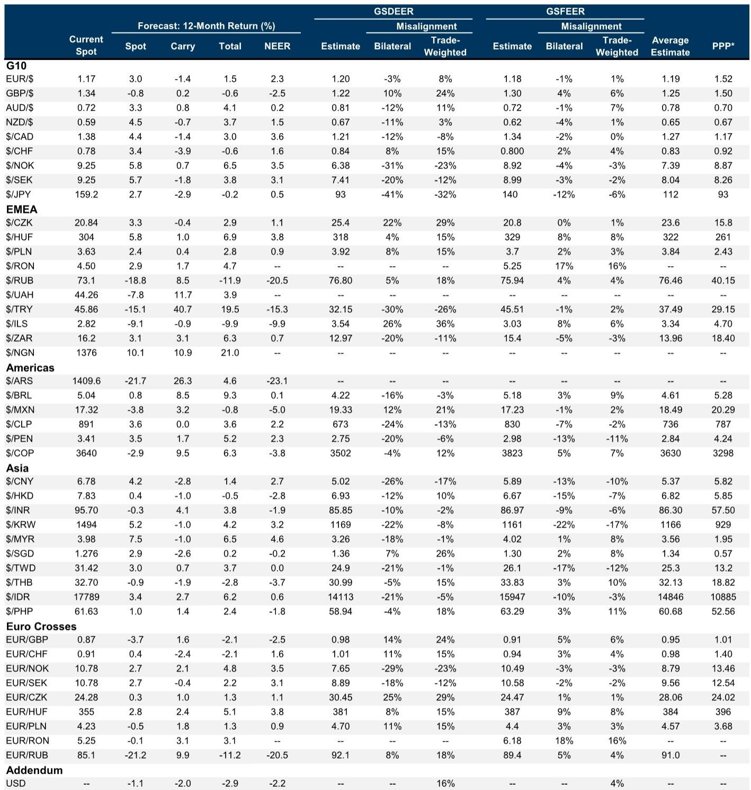
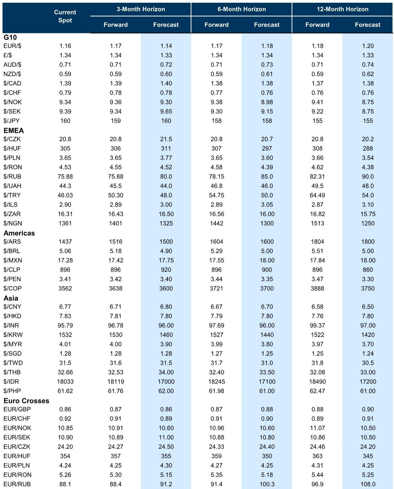

# The Dollar Is Not One Market: Why a Divided USD Creates the Most Interesting FX Opportunity in Years

The US dollar is sending two entirely different signals at once, and that divergence is not noise. It is the central fact that should govern every FX allocation decision for the remainder of the year. The DXY index, heavily weighted toward the euro and other G10 currencies, is up roughly 1.5% year-to-date. The broader USD Trade-Weighted Index, which includes a far larger share of Asian and emerging market currencies, is essentially flat. These two measures usually move together. That they have diverged so meaningfully tells us something structural about the current environment: the dollar is not a single trade, and treating it as one will lead to systematic errors.

The source of this division is a clash between two powerful forces. On one side, cyclical activity data in the United States remains firmly reflationary. Bumper payrolls reports and strong ISM surveys point to better growth prospects and uncomfortably sticky inflationary pressures. That has pushed rate differentials in favor of the dollar, especially against Europe. On the other side, the persistent appreciation of the Chinese renminbi, the stickiness of the Japanese yen through actual and threatened intervention, and the resilience of many commodity and high-carry emerging market currencies have created a powerful counterweight. The dollar is stronger against the euro but weaker against the renminbi. It is stronger against the Swiss franc but softer against the Brazilian real. The net result is not a trend. It is a tension.

This tension is unlikely to resolve quickly. The data-dependent case for a stronger dollar remains intact, but the data alone may not be sufficient to push the greenback clearly out of its recent ranges. If that proves true, the focus will shift to upcoming policy meetings. Given the current mix of resilient activity and high inflation, the Federal Reserve Chair may come across as more hawkish than many market participants expect. But even that may not be enough to drive the dollar higher if global equity risk continues to trade well on more positive headlines regarding the Middle East conflict, and that risk appetite weighs on the cyclical dollar. The implication is clear: without a clearer resolution one way or another, divided dollar performance is not a temporary anomaly. It is the new baseline.

For investors, this creates a strategic imperative. The old playbook of taking a single directional view on the dollar and expressing it uniformly across all pairs is no longer adequate. The opportunity lies in identifying which currencies will move with the reflationary impulse and which will move with the resolution trade, and then constructing positions that exploit the divergence rather than fighting it.

## The Bank of Japan Is About to Hike, but That Alone Will Not Save the Yen

Governor Ueda has signaled that a rate hike is coming at the next Bank of Japan meeting, and our economists have pulled forward their forecast for the move from July to June. The justification is telling: Ueda explicitly noted that markets could perceive the Board as behind the curve if it were to disappoint expectations, which would put further upward pressure on long-term yields. This is a central bank that is now more concerned about the perception of being behind than about the risk of moving too early. The emphasis, since even the April meeting, has shifted decisively toward greater concern about upside risks to inflation rather than downside risks to growth.

Yet the challenge for the BoJ is that the bar for a hawkish surprise is very high. A continued message of only gradual hikes will likely prove insufficient to strengthen the currency meaningfully. There are two additional reasons to anticipate continued depreciation pressures over the near term, even if the administration intervenes again. First, the combination of higher-for-longer US yields, with risks still skewed to the upside, and constructive risk sentiment tends to weigh on the yen. Second, lingering fiscal risks will likely return to the forefront as spending plans are clarified over the coming months.

Those anticipating yen-positive repatriation flows are still likely to be left disappointed, barring any policy directive or a more favorable rate differential. But even the impact of a policy pivot could be relatively short-lived without a change in the broader macro backdrop. FX tends to trade most closely with cyclical fundamentals rather than capital flows when those two forces have opposing implications. The fundamental question that the report leaves open is whether a BoJ hike can break the yen out of its depreciation trend, or whether it will prove to be just another temporary intervention in a longer-term structural decline. The evidence suggests the latter, which is why yen funding remains attractive despite intervention risk.

## A Geopolitical Resolution Would Redraw the Map of FX Outperformance

As the conflict in the Middle East nears the 100-day mark, the terms of trade pressures in FX markets have continued to expand steadily. The recent string of more constructive soundbites on the conflict has shifted investor focus to resolution opportunities. This is not simply a matter of risk-on/risk-off. The resolution trade has a specific structure, and understanding that structure is essential for positioning.

The framework that has been used throughout the energy shock offers a useful playbook for de-escalation. Many of the preferred longs in recent months have been procyclical currencies that are net energy exporters, including the Australian dollar and the Brazilian real. On a resolution, risk sentiment should remain firmly supported, and procyclical currencies should stay bid. But the terms of trade dimension of the shock should reverse. That means the candidate outperformers on a resolution would rotate from high-beta energy exporters to high-beta energy importers.

In the emerging market space, the most likely beneficiaries are the South African rand, the Korean won, the Polish zloty, the Chilean peso, and the Hungarian forint. In the G10 space, the Swedish krona, the New Zealand dollar, and the British pound stand out as top candidate resolution longs. But there are important nuances. Continued equity outflows in Korea would likely undermine the resolution boost for the won. Overlaying the potential terms of trade reversal with domestic macro and valuation factors remains key, which is why there is greater value in targeting a reversal in AUD/NZD than in NOK/SEK, and why the Hungarian forint remains constructive even without a resolution.

The most important insight from this framework, however, is that even in the event of a full restoration of energy flows, the hurdle for a full reversal in many of these pairs is high. Commodity strategists' year-end energy forecasts stand well above their pre-conflict projections, even accounting for an eventual resolution. The parallel to the 2022 energy shock is a key reminder that terms of trade effects can extend even after commodity prices have peaked. This means that the resolution trade is not simply a mean reversion trade. It is a relative value trade that requires careful selection.

## The Carry Trade Is Not Dead, but It Has Become a Stock-Picker's Game

Carry accrual strategies in emerging market FX have performed well against a backdrop of declining implied volatility, broadly flat year-to-date returns for the dollar, and reduced room for EM central banks to deliver cuts that would have steadily eroded carry levels. But a selective approach is essential, and the factors that matter are carry levels, relative terms of trade shifts, and idiosyncratic developments.

The Hungarian forint remains a preferred long, driven by EU fund and euro adoption tailwinds that more than offset the impact of higher energy prices on external balances. This view is not reliant on a conflict resolution, though the forint would be among the outperformers in that scenario. The Mexican peso is more levered to US-specific cyclical pricing and more insulated from a terms-of-trade perspective, but it has still underperformed the rally in US equities, arguing for further appreciation if US cyclical pricing remains supported.

The Colombian peso presents an interesting case. A more cautious view had been warranted due to rising political noise and limited undervaluation signal, but if local factors turn more supportive, COP carry longs screen as increasingly attractive. The peso benefits from Colombia's recent terms of trade surge and a proactive BanRep hiking cycle that has taken carry levels close to 10%. The Brazilian real has seen a similar improvement in its terms of trade and yields close to 9% carry, but rising political noise ahead of the October elections suggests it may make sense to partly rotate from BRL longs to COP longs if Colombian local developments remain supportive.

The most intriguing development is the growing case for adding the Indian rupee back into diversified carry baskets. Carry levels in the INR have increased since the beginning of the conflict, and they are now higher than other Asia high-yielders and even higher than some popular carry candidates across EM. The rupee also screens among the more undervalued EM currencies on certain metrics. The RBI has implemented new measures to mitigate portfolio outflow pressure, including tax exemptions on foreign investments in government securities and extended access to ultra-long-end maturities. These considerations should limit depreciation pressure, though substantial spot appreciation is not expected either.

## The Canadian Dollar and the Indonesian Rupiah Reveal Two Different Kinds of Risk

The Canadian dollar has been relatively resilient through much of the energy shock, consistent with Canada's status as an energy exporter. But unlike the more procyclical Australian and New Zealand dollars, CAD's higher beta to the broad dollar has weighed on the currency on de-escalatory days when oil prices decline. That tension between terms of trade and broad dollar exposure helps explain CAD's more middling performance, alongside a soft domestic backdrop that is becoming an increasingly meaningful driver.

Recent data has disappointed, including a Q1 GDP report that showed a second consecutive quarter of contraction. The labor market remains fragile. Trade uncertainty is an additional reason for caution. Canada and Mexico have formally requested a USMCA renewal, but while the US and Mexico have already announced bilateral negotiating rounds, formal talks between the US and Canada have not begun. Extended trade uncertainty should weigh on the currency by deterring investment and keeping the Bank of Canada on the more dovish end of the central bank spectrum. Given the domestic backdrop, trade uncertainty, and CAD carry to vol close to multi-decade lows, CAD funding looks attractive, particularly against EM carry longs.

The Indonesian rupiah presents a very different story. USD/IDR broke above 18,000 for the first time ever, and it is now the worst performing currency in Asia. While the Middle East conflict pushed USD/Asia higher, increasingly domestic developments are playing a greater role. The government plans to centralize natural resource exports and retain export proceeds in state banks, and business groups are seeking clarity. Investors worry that added bureaucracy could delay or slow down exports. The Indonesian House of Representatives passed a law to expand BI's mandate, adding a more explicit pro-growth and employment objective that raises concerns about the inflation targeting framework. MSCI has already rebalanced Indonesia's weight lower, and any additional downgrade could trigger further outflows.

The key question the report leaves unanswered is whether the IDR depreciation is a temporary adjustment to a new set of policy risks or the beginning of a more sustained structural decline. The answer depends on whether the government can provide sufficient clarity on its export policies and whether BI can maintain credibility on its inflation mandate.

## What the Report Does Not Fully Answer: The Interaction Between the Fed and the Geopolitical Calendar

The report lays out a clear framework for thinking about dollar divergence, the BoJ, the resolution playbook, and EM carry. But it leaves one critical question unresolved: what happens when the Fed's policy meeting calendar intersects with the geopolitical calendar? The report notes that if data is unable to push the dollar clearly out of recent ranges, the focus may shift to upcoming policy meetings. And it suggests that the Fed Chair may come across as more hawkish than many expect. But it does not fully explore the scenario in which hawkish Fed guidance coincides with positive geopolitical developments.

In that scenario, the dollar would face a genuine tug-of-war. Hawkish Fed guidance would push rate differentials in the dollar's favor, particularly against Europe. But positive geopolitical headlines would support risk appetite and weigh on the cyclical dollar. The net effect would depend on the relative strength of these two forces, and the report does not provide a clear framework for weighting them. This is not a criticism of the report; it is an honest recognition that the interaction between monetary policy and geopolitics is inherently uncertain. But it is the uncertainty that creates opportunity. Investors who can develop their own framework for weighting these forces will have an edge.

## A Decision Framework for the Divided Dollar Environment

For investors trying to navigate this environment, the following framework may prove useful. First, distinguish between the two dimensions of dollar performance: the rate differential dimension and the risk appetite dimension. The rate differential dimension favors the dollar against G10 currencies, particularly the euro and the yen. The risk appetite dimension favors EM and commodity currencies.

Second, identify which currencies are most exposed to each dimension. The euro and the yen are primarily rate differential trades. The Australian dollar, the New Zealand dollar, and the Brazilian real are primarily risk appetite trades. The Canadian dollar and the Mexican peso sit in between, exposed to both.

Third, construct positions that exploit the divergence rather than fighting it. If you believe the rate differential story will dominate, go long USD against EUR and JPY. If you believe the risk appetite story will dominate, go long AUD, NZD, and BRL against USD. If you believe both stories will continue to coexist, look for relative value trades within each bucket.

Fourth, do not ignore the resolution playbook. The currencies that have benefited most from the terms of trade shock are not the same currencies that will benefit most from a resolution. If you have a view on the geopolitical calendar, express it through the appropriate pairs.

Fifth, be selective in carry. Not all high-yielding currencies are created equal. The Hungarian forint offers carry with a tailwind from EU fund flows. The Colombian peso offers carry with a tailwind from terms of trade and hiking cycles. The Indian rupee offers carry with a tailwind from policy measures. The Indonesian rupiah offers carry with a headwind from domestic policy uncertainty. Choose accordingly.

Join the community to read the full report and review the original charts.

*This article is for learning and discussion only and does not constitute investment advice.*

Personal reading notes and learning share only. Not investment advice.

