GLOBAL RATES TRADER

A Higher Floor

The strong employment report has reinforced a higher distribution around US yields. We still think a long pause from the Fed is more likely than hikes and expect US yields to end the year lower than spot levels. However, the combination of solid growth news and unresolved inflationary pressure is likely to keep front-end pricing skewed towards hikes in the near term, even with ongoing prospects for energy price relief on any confirmation of a US-Iran deal. We now expect 10y UST yields to end the year at $4.4\%$ from $4.1\%$ previously. Given yields are currently above this level, we expect limited spillover effects into other G10 markets and keep most other yield forecasts unchanged. That said, we raise our 10y Gilt forecasts by 10bp to $4.5\%$ for end-2026 given the higher beta exhibited by UK rates in recent years. We continue to expect earlier ECB hikes (starting next week) and weaker growth outcomes to restrain yields in Europe—tactically we think US 5y yields have room to rise on a relative basis versus Europe. In Japan, the hawkish shift in the BoJ communication raises the prospect of 5y rate underperformance on the curve, but we are not yet expecting the BoJ to signal a faster pace of tightening that would create the conditions to stabilize forward yields.

# United States and Canada

\- Shifting the distribution. We think the May US labor market report sets a higher floor on US yields for now. Firm growth and ongoing inflation risk are likely to keep the market pricing clear asymmetry towards hikes in the near term. The main factor that likely held the market back from an even more front-loaded selloff was the relative stability in the unemployment rate and wage growth. Our economists have revised their projected Fed path, pushing out the final two rate cuts in their forecast to June and December 2027. Reflecting this, we have revised our UST yield forecasts higher and now see 2y and 10y yields ending 2026 at $3.8\%$ and $4.4\%$ respectively (from $3.4\%$ and $4.1\%$ previously), levels consistent with the market converging towards a more balanced distribution of risks around the policy path by year-end alongside relative stability in longer-term forwards (e.g. 5y5y, which are currently about fair). That dovish convergence in pricing likely requires some amount of validation from the data, which we expect over time under our economists' forecast for a moderation in sequential inflation and an uptick in the unemployment rate by year-end. But nearer-term risks are more balanced, with vulnerability that firmer data or a

# George Cole

+44(20)7552-1214

george.cole@gs.com

GS International

# William Marshall

+1(212)357-0413

william.c.marshall@gs.com

GS & Co. LLC

# Simon Freycenet

+44(20)7774-5017

simon.freycenet@gs.com

GS Bank Europe SE - Paris

Branch

# Isabella Rosenberg

+1(212)357-7628

isabella.rosenberg@gs.com

GS & Co. LLC

# Friedrich Schaper

+1(917)343-3214

friedrich.schaper@gs.com

GS & Co. LLC

# Loic Mathys

+44(20)7051-1664

loic.mathys@gs.com

GS International

more concrete hawkish shift in Fed communication see hike risks pulled forward (which would likely see leadership in sell-offs move into late-26/early-27 from mid-27 pricing).

\- Reds run ahead. 1y1y rates (reds) have been the most volatile point along the US forward curve since the onset of the conflict, re-rating by about 110bp versus end-February levels and generally leading the way in both sell-offs and rallies. That repricing has shifted the prior front-end inversion into a hump, with a positive slope between 1y and 1y1y, and inversion from 1y1y to 2y1y. We think there are multiple routes to see that relative cheapness in 1y1y moderate. It is typical to see the 1y1y point lead on the curve in sharp inflections in front-end rates (Exhibit 1). While an extension of acute front-end cheapening can see further 1y1y underperformance, we would expect the opposite to hold on a reversal lower in yields, and we think that a period of stabilization can be a source of pressure relief. We think that can happen either via more benign inflation signals that moderate the upward slope priced into the front-end (1y/1y1y flattening), or due to a more resilient growth and labor market backdrop that either shift the timing of hike risk further in or start to undo the inversion priced in further out (1y1y/2y1y steepening) if the Fed signals a more patient approach.

Exhibit 1: The 1y1y point has typically led on the US curve during sharp inflections in front-end rates   
3m change in 2y swap rate vs 1y/1y1y/2y1y swap fly return (higher = belly underperforms)   
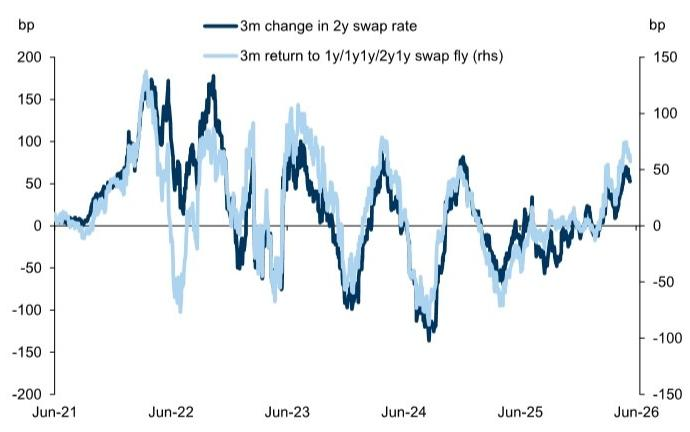

line

| Date   | 3m change in 2y swap rate (bp) | 3m return to 1y/1y1y2y1y swap fly (rhs) (bp) |
|--------|----------------------------------|-----------------------------------------------|
| Jun-21 | ~0                               | ~0                                            |
| Jun-22 | ~180                             | ~150                                          |
| Jun-23 | ~-100                            | ~-50                                          |
| Jun-24 | ~-150                            | ~-100                                         |
| Jun-25 | ~-50                             | ~-50                                          |
| Jun-26 | ~100                             | ~75                                           |

Source: GS Global Investment Research, GS FICC and Equities

Exhibit 2: Solid YTD Money Fund AUM growth reflects the higher-for-longer front-end yields   
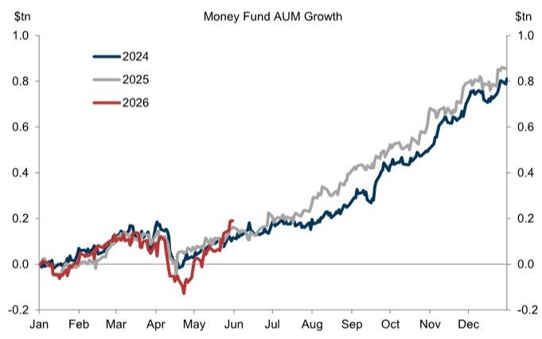

line

| Month | 2024 | 2025 | 2026 |
|-------|------|------|------|
| Jan   | 0.0  | 0.0  | 0.0  |
| Feb   | 0.05 | 0.05 | 0.05 |
| Mar   | 0.1  | 0.1  | 0.1  |
| Apr   | 0.15 | 0.15 | 0.15 |
| May   | -0.1 | -0.1 | -0.1 |
| Jun   | 0.15 | 0.15 | 0.15 |
| Jul   | 0.2  | 0.2  | 0.2  |
| Aug   | 0.3  | 0.3  | 0.3  |
| Sep   | 0.4  | 0.4  | 0.4  |
| Oct   | 0.5  | 0.5  | 0.5  |
| Nov   | 0.65 | 0.65 | 0.65 |
| Dec   | 0.8  | 0.8  | 0.8  |

Source: GS Global Investment Research, Crane Data

■ Money fund AUM heading higher. Growth in money fund AUM has been strong following a larger drop around the mid-April tax deadline compared to recent years. Year-to-date, however, cumulative AUM growth is only slightly above the 2024 and 2025 pace (Exhibit 2). We anticipated a deceleration in the pace of money fund growth this year on our expectations of lower front-end rates, a steeper overall curve, and positive equity returns. Even as the expectations for a steeper curve (e.g. 3m/2y or 3m/10y) and solid risk asset returns have been playing out, a Fed on hold baseline skews risks towards firmer AUM growth. Throughout this environment, T-bills have remained supported and still look slightly rich to fundamentals in spite of a rebuild in supply. Broadly, we think this reinforces our earlier assessment on underlying liquidity conditions and the scope to sustain a lower pace of RMPs.

Canadian data dashboard warrants pricing more two-sided risks. Following repeated downside inflation surprises and the growth contraction that has put the Canadian economy into a recession, the BoC will have to weigh uncertain inflation risks from the conflict in the Middle East against activity weakness even as this week's stronger labor report quelled more urgent concerns. Market pricing through year-end has remained notably hawkish through some of the more dovish signals from domestic fundamentals, with about 35bp of hikes priced by December. While we think placing some weight on an eventual return towards the middle of the neutral range is reasonable, we think the hurdle to hike in the near term is high, particularly as long as USMCA negotiations are unresolved. Given the risks to activity, we think additional cuts cannot be written off and continue to see value to receiving the front-end of the CAD curve. That said, we continue to prefer 2s5s steepeners over outright longs, as we think the front-end should be comparatively sticky versus the belly in broader sell-offs, whereas there is room still to reorient the near-term path and/or delay the timing of hikes on additional data disappointment.

# Europe

July signaling key for EUR front-end pricing. Our economists expect the ECB to deliver a 25bp hike as their macroeconomic projections are likely to show a substantial and sticky core HICP overshoot above the 2% target. We believe the ECB will continue to defend a meeting-by-meeting approach, but any signals on the likelihood of an additional hike in July will be closely watched. We note that July pricing has partly decoupled from its relationship with December pricing since mid-May, suggesting some vulnerability should President Lagarde hint at willingness to tighten policy faster than in quarterly increments. At the same time, any signals that July is likely to be a pass (for example, any sense of ‘patience’ in waiting for further data) is likely to see December pricing catch down to the July slope pricing as the market puts higher weight on the possibility of a ‘one-and-done’ hike in June. On our baseline, the ECB will hike, which offers relatively unattractive risk-reward longs on Z6. We prefer terminal rate longs instead as growth signals weaken and ECB hikes help anchor forward rates.

HICP pricing some relief, real rates to fall further. HICP pricing has declined in recent weeks, alongside relief in energy markets as confidence in an eventual US-Iran deal increased. Pricing is still modestly above our forecasts in the coming year, but our fair value model for inflation forward pricing shows that the recent relief rally has moved further than macro factors and energy prices imply (Exhibit 3). The rebalancing of the oil market via not only temporary inventory drawdowns but also weaker oil demand not only clips the upside risks to energy prices but also reveals the potential downside growth effects from the current shock. As a result, risk-reward remains balanced on the HICP curve. Given the modest cheapening in inflation vs our macro model, in combination with ongoing weakness in growth signals we continue to recommend long 5y5y real EUR swap rates.

Exhibit 3: The recent decline in traded inflation has outpaced what the macro and energy pricing imply   
Fair value model based on energy prices, core inflation, the euro currency and the level of nominal yields   
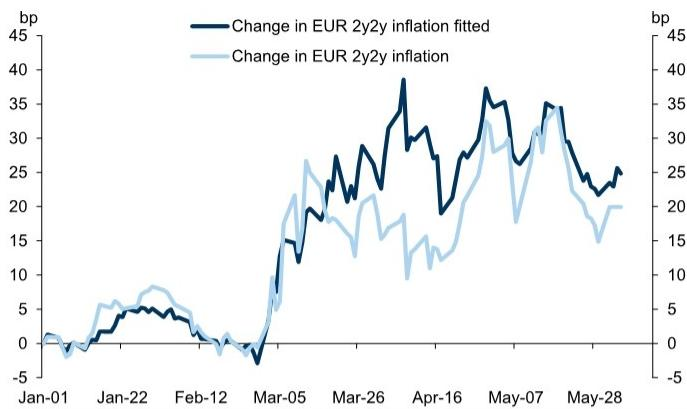

line

| Date    | Change in EUR 2y2y inflation fitted | Change in EUR 2y2y inflation |
|---------|-------------------------------------|-------------------------------|
| Jan-01  | ~0                                  | ~0                            |
| Jan-22  | ~5                                  | ~5                            |
| Feb-12  | ~0                                  | ~0                            |
| Mar-05  | ~15                                 | ~15                           |
| Mar-26  | ~30                                 | ~25                           |
| Apr-16  | ~35                                 | ~30                           |
| May-07  | ~30                                 | ~25                           |
| May-28  | ~25                                 | ~20                           |

Source: GS Global Investment Research, GS FICC and Equities, Haver Analytics

Exhibit 4: Signals for Gilt spreads suggest supply is not the key issue for Gilts   
Fair value model based on repo-ois spread, rates volatility, free float, the level of yield and the curve   
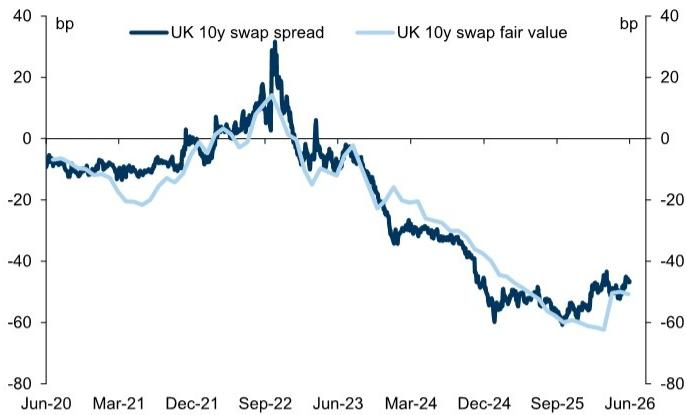

line

| Date    | UK 10y swap spread | UK 10y swap fair value |
|---------|--------------------|------------------------|
| Jun-20  | ~0                 | ~0                     |
| Mar-21  | ~-10               | ~-15                   |
| Dec-21  | ~-5                | ~-10                   |
| Sep-22  | ~30                | ~20                    |
| Jun-23  | ~-10               | ~-15                   |
| Mar-24  | ~-30               | ~-25                   |
| Dec-24  | ~-60               | ~-40                   |
| Sep-25  | ~-55               | ~-50                   |
| Jun-26  | ~-45               | ~-65                   |

Source: GS Global Investment Research, GS FICC and Equities, Haver Analytics

Fiscal policy still relevant for European spreads. We continue to be positive on front-end sovereign credit as a carry expression in European rates markets. With inflation risks now more balanced, there are reduced prospects for much higher rates volatility, and the market already prices the extent of the upcoming ECB hiking cycle, in our view. The fiscal response to higher energy prices has so far been muted, including in places like France which had provided substantial relief back in 2022/23. But pressure remains on European budgets, especially should flows through Hormuz stay muted. For instance, this week the European Commission decided to allow some exemptions for “energy resilience” measures in the context of fiscal rules, worth 0.3% of GDP for the years 2026-28. While this remains modest, against this backdrop we think front-end EGBs should be better protected should energy price upside re-emerge, in which case we’d expect the credit curve to steepen curves.

■ Macro risks not supply risks key for Gilts. Despite a strong narrative around political and supply risks for the UK bond market, 10y Gilts have quietly performed quite well on asset swap over recent weeks. Gilt risks have relaxed since mid-May with our term premium estimate declining by around 25bp. We think the relative stability — if not strength — of Gilts on asset swap is supporting evidence for the view that risk premium in the Gilt curve is currently more macro-driven rather than supply-driven. Indeed, on our models, we find swap spread valuation near fair (Exhibit 4). Although we find evidence that over recent years the increase in the supply of bonds via large deficits and BoE QT has contributed to higher long-end yields, current term premium volatility seems to derive from macro risks around the medium-term fiscal outlook and near-term inflation. Given that fiscal uncertainty is likely to linger through any potential Labour leadership contest, we think that further macro relief is required for Gilt outperformance, namely additional certainty around the path for inflation, and confirmation that the inflation path is consistent with the BoE on hold. As a result, we prefer to 2s10s curve steepeners given its compatibility with both macro relief and a sticky fiscal risk premium into the 18 June Makerfield by-election. Reflecting the higher beta to global yields in recent years, we raise our 10y Gilt forecast to $4.5\%$ from $4.4\%$ given our higher US 10y yield forecasts as

above.

# Japan

Behind the curve worries remain despite an earlier BOJ hike. The JGB curve flattened this week, reflecting a hawkish repricing of the June BoJ meeting, with BOJ OIS implying nearly a $95\%$ probability of a June hike (up from $70\%$ last week). Governor Ueda signaled greater urgency to tighten and the need to secure market confidence that the BoJ will properly control inflation, supporting the market's repricing and prompting our economists to pull forward their forecast for the next BoJ hike to June from July. Even with the timing adjustment, they have maintained their baseline for a roughly semi-annual pace of hikes. While the curve had flattened somewhat into the speech, the aftermath has seen yields move higher and the curve re-steepen, a pattern at odds with the intuitive response to a hawkish signal. Indeed we find that hawkish policy innovations—proxied as instances with higher 3m OIS yields and a stronger Yen—typically result in bear flattening consistent with a more front-loaded policy reaction (Exhibit 5). Although the shift at the very front-end was directionally hawkish and recent communications have emphasized the importance of securing market confidence, we think the muted move beyond the first few meetings and limited FX response suggests little perceived shift in broader reaction function at this point. A more explicit hawkish shift in the BoJ reaction function (i.e. openness to a faster pace of hikes/higher rate) would be impactful, in our view, but absent that we think that near-term risks remain towards further upward pressure on yields, with more of that cheapness migrating into the belly of the curve.

Exhibit 5: Hawkish BoJ policy innovations typically result in bear flattening consistent with a more front-loaded policy reaction   
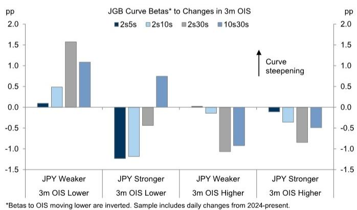

bar

JGB Curve Betas* to Changes in 3m OIS
| Scenario | 2s5s (pp) | 2s10s (pp) | 2s30s (pp) | 10s30s (pp) |
| :--- | :--- | :--- | :--- | :--- |
| JPY Weaker 3m OIS Lower | 0.1 | 0.5 | 1.6 | 1.1 |
| JPY Stronger 3m OIS Lower | -1.2 | -1.2 | -0.4 | 0.7 |
| JPY Weaker 3m OIS Higher | 0.0 | -0.1 | -1.0 | -0.9 |
| JPY Stronger 3m OIS Higher | -0.1 | -0.3 | -0.8 | -0.5 |
*Betas to OIS moving lower are inverted. Sample includes daily changes from 2024-present.

Source: Bloomberg, GS Global Investment Research

# Latest Thematic Research:

Global Markets Analyst: Revisiting the Outlook for the Fed's Balance Sheet — 21 May 2026

Global Rates Notes: US Treasury Valuations and Requirements for a Yield Reversal — 20 May 2026

Global Markets Analyst: UK T-bills: Not A Magic Bullet For Gilts — 11 May 2026

Global Markets Comment: Market Stress Monitor — 11 May 2026

Rates Vol Monitor: A Look at Hedging the Right Tail — 8 May 2026

# Latest Global Markets Dailies:

The Hedge Value Of Rate Receivers — 28 May 2026

The Energy Shock Impact on Foreign Official Treasury Demand — 27 May 2026

Why Always Gilts? — 14 May 2026

A More Durable Risk Premium in JGBs — 8 May 2026

Trading Terms of Trade Shocks in the Smaller G10 Rates Markets — 21 April 2026

# Forecasts

G10 10y yield forecast 

<table><tr><td colspan="14">G10 10-Year Yield Forecasts</td></tr><tr><td></td><td>USD</td><td>DEM</td><td>FRA</td><td>ITA</td><td>ESP</td><td>GBP</td><td>JPY</td><td>CAD</td><td>CHF</td><td>SEK</td><td>NOK</td><td>AUD</td><td>NZD</td></tr><tr><td>Spot</td><td>4.54</td><td>3.04</td><td>3.69</td><td>3.80</td><td>3.47</td><td>4.90</td><td>2.67</td><td>3.47</td><td>0.44</td><td>2.89</td><td>4.40</td><td>4.91</td><td>4.52</td></tr><tr><td>2Q26</td><td>4.50</td><td>2.90</td><td>3.65</td><td>3.70</td><td>3.45</td><td>4.75</td><td>2.50</td><td>3.45</td><td>0.30</td><td>3.15</td><td>4.10</td><td>4.85</td><td>4.50</td></tr><tr><td>3Q26</td><td>4.45</td><td>2.95</td><td>3.70</td><td>3.80</td><td>3.50</td><td>4.60</td><td>2.50</td><td>3.50</td><td>0.40</td><td>3.20</td><td>4.00</td><td>4.75</td><td>4.50</td></tr><tr><td>4Q26</td><td>4.40</td><td>3.00</td><td>3.75</td><td>3.85</td><td>3.55</td><td>4.50</td><td>2.50</td><td>3.50</td><td>0.50</td><td>3.25</td><td>4.00</td><td>4.70</td><td>4.50</td></tr><tr><td>1Q27</td><td>4.35</td><td>3.00</td><td>3.75</td><td>3.90</td><td>3.60</td><td>4.50</td><td>2.45</td><td>3.50</td><td>0.50</td><td>3.25</td><td>4.00</td><td>4.60</td><td>4.50</td></tr><tr><td>2Q27</td><td>4.30</td><td>3.00</td><td>3.75</td><td>3.90</td><td>3.60</td><td>4.40</td><td>2.40</td><td>3.50</td><td>0.50</td><td>3.25</td><td>4.00</td><td>4.50</td><td>4.50</td></tr><tr><td>3Q27</td><td>4.25</td><td>3.00</td><td>3.75</td><td>3.90</td><td>3.60</td><td>4.40</td><td>2.30</td><td>3.50</td><td>0.50</td><td>3.25</td><td>4.00</td><td>4.50</td><td>4.50</td></tr><tr><td>4Q27</td><td>4.25</td><td>3.00</td><td>3.75</td><td>3.90</td><td>3.60</td><td>4.35</td><td>2.25</td><td>3.50</td><td>0.50</td><td>3.25</td><td>4.00</td><td>4.50</td><td>4.50</td></tr></table>

<table><tr><td colspan="14">Deviation from Forwards</td></tr><tr><td></td><td>USD</td><td>DEM</td><td>FRA</td><td>ITA</td><td>ESP</td><td>GBP</td><td>JPY</td><td>CAD</td><td>CHF</td><td>SEK</td><td>NOK</td><td>AUD</td><td>NZD</td></tr><tr><td>2Q26</td><td>-0.05</td><td>-0.16</td><td>-0.07</td><td>-0.13</td><td>-0.04</td><td>-0.19</td><td>-0.19</td><td>-0.04</td><td>-0.13</td><td>0.28</td><td>-0.29</td><td>-0.07</td><td>-0.04</td></tr><tr><td>3Q26</td><td>-0.15</td><td>-0.17</td><td>-0.12</td><td>-0.13</td><td>-0.06</td><td>-0.43</td><td>-0.26</td><td>-0.05</td><td>-0.08</td><td>0.31</td><td>-0.37</td><td>-0.20</td><td>-0.11</td></tr><tr><td>4Q26</td><td>-0.25</td><td>-0.16</td><td>-0.12</td><td>-0.14</td><td>-0.06</td><td>-0.58</td><td>-0.34</td><td>-0.09</td><td>0.00</td><td>0.33</td><td>-0.37</td><td>-0.27</td><td>-0.18</td></tr><tr><td>1Q27</td><td>-0.34</td><td>-0.19</td><td>-0.17</td><td>-0.15</td><td>-0.06</td><td>-0.62</td><td>-0.46</td><td>-0.12</td><td>-0.02</td><td>0.30</td><td>-0.36</td><td>-0.39</td><td>-0.25</td></tr></table>

Source: GS Global Investment Research

G4 Curve Forecast   
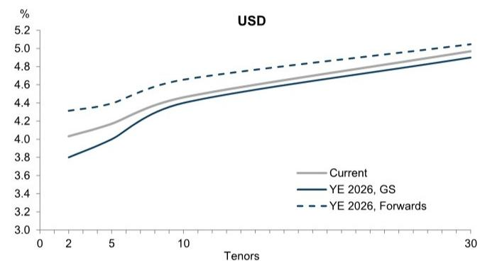

line

USD
| Tenors | Current (%) | YE 2026, GS (%) | YE 2026, Forwards (%) |
|---|---|---|---|
| 2 | 4.05 | 3.8 | 4.35 |
| 5 | 4.15 | 4.0 | 4.45 |
| 10 | 4.4 | 4.4 | 4.7 |
| 30 | 4.95 | 4.9 | 5.05 |

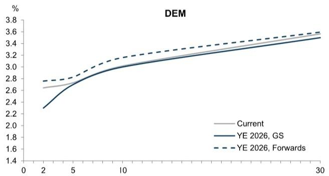

line

DEM
| Time | Current (%) | YE 2026, GS (%) | YE 2026, Forwards (%) |
|---|---|---|---|
| 0 | 2.6 | 2.3 | 2.8 |
| 2 | 2.7 | 2.4 | 2.8 |
| 5 | 2.8 | 2.7 | 3.0 |
| 10 | 3.0 | 3.0 | 3.2 |
| 30 | 3.5 | 3.5 | 3.6 |

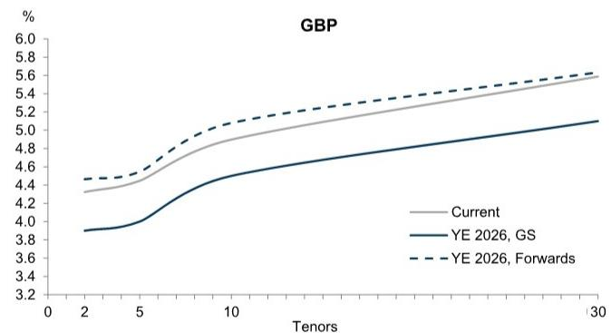

line

GBP
| Tenors | Current (%) | YE 2026, GS (%) | YE 2026, Forwards (%) |
|---|---|---|---|
| 2 | 4.35 | 3.9 | 4.45 |
| 5 | 4.45 | 4.0 | 4.55 |
| 10 | 4.85 | 4.5 | 5.1 |
| 30 | 5.6 | 5.1 | 5.6 |

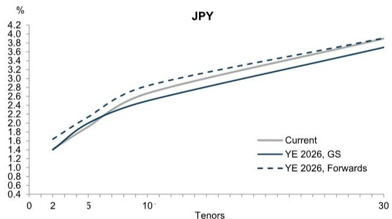

line

JPY
| Tenors | Current (%) | YE 2026, GS (%) | YE 2026, Forwards (%) |
|---|---|---|---|
| 2 | 1.4 | 1.3 | 1.5 |
| 10 | 2.6 | 2.4 | 2.8 |
| 30 | 3.9 | 3.7 | 3.9 |

Source: Bloomberg, GS Global Investment Research

# Central Bank Dashboard

Cumulative amount of hikes/cuts priced from today   
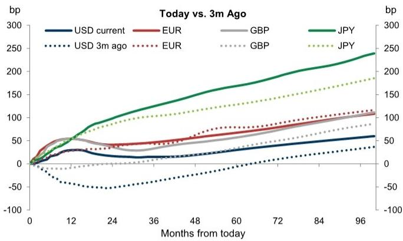  
Source: GS Global Investment Research

Expected hikes by year, GS vs. Market   
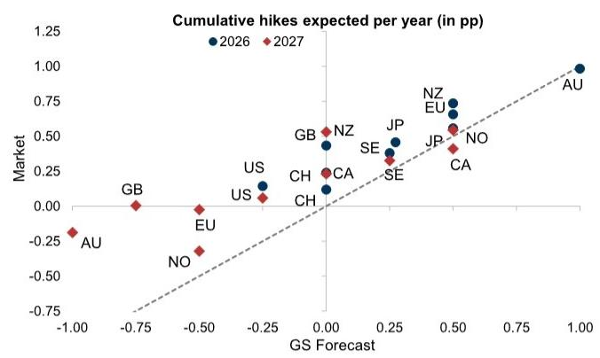

scatter

Cumulative hikes expected per year (in pp)
| Region | Year | GS Forecast | Market |
| :--- | :--- | :--- | :--- |
| AU | 2027 | -1.0 | -0.25 |
| GB | 2027 | -0.75 | 0.0 |
| EU | 2027 | -0.5 | -0.1 |
| US | 2026 | -0.25 | 0.15 |
| CH | 2026 | -0.1 | 0.1 |
| NZ | 2026 | 0.0 | 0.45 |
| CA | 2027 | 0.0 | 0.25 |
| SE | 2027 | 0.25 | 0.35 |
| JP | 2026 | 0.3 | 0.45 |
| NO | 2027 | 0.5 | 0.5 |
| CA | 2027 | 0.5 | 0.4 |
| NZ | 2026 | 0.5 | 0.7 |
| EU | 2026 | 0.5 | 0.65 |
| JP | 2027 | 0.5 | 0.55 |
| CA | 2027 | 0.5 | 0.45 |
| NZ | 2026 | 1.0 | 1.0 |
The dashed diagonal line represents the expected growth rate from the previous forecast to the long-term forecast. The data points are labeled with country codes and abbreviations (e.g., “US”, “NZ”, “SE”, “CA”, “NO”).

Source: GS Global Investment Research

Central bank ownership of sovereign bonds, current vs. 1y ago   
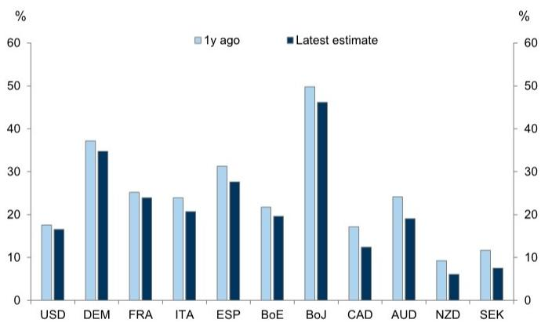

bar

| Currency | 1y ago (%) | Latest estimate (%) |
| :--- | :--- | :--- |
| USD | 17.5 | 16.5 |
| DEM | 37.0 | 34.5 |
| FRA | 25.0 | 23.5 |
| ITA | 23.5 | 20.5 |
| ESP | 31.0 | 27.5 |
| BoE | 21.5 | 19.5 |
| BoJ | 49.5 | 46.0 |
| CAD | 17.0 | 12.5 |
| AUD | 24.0 | 19.0 |
| NZD | 9.0 | 6.0 |
| SEK | 11.5 | 7.5 |

Source: Haver Analytics

Central bank assets as a share of GDP   
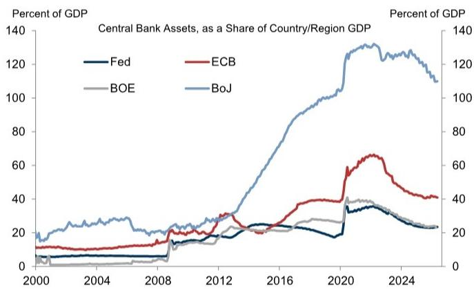

line

| Year | Fed  | ECB  | BOE  | BoJ  |
|------|------|------|------|------|
| 2000 | ~5   | ~10  | ~5   | ~20  |
| 2004 | ~5   | ~15  | ~5   | ~25  |
| 2008 | ~10  | ~20  | ~10  | ~30  |
| 2012 | ~15  | ~30  | ~15  | ~60  |
| 2016 | ~20  | ~40  | ~20  | ~90  |
| 2020 | ~30  | ~60  | ~35  | ~130 |
| 2024 | ~25  | ~45  | ~30  | ~110 |

Source: Haver Analytics

# Positioning and Flows Monitor

Option implied position indicator   
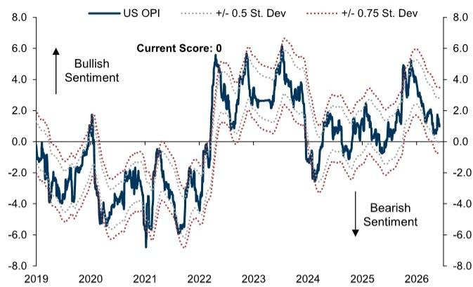

line

| Year | US OPI | +/- 0.5 St. Dev | +/- 0.75 St. Dev |
|------|--------|-----------------|------------------|
| 2019 | -1.0   | 1.5             | 1.0              |
| 2020 | -4.0   | 1.0             | 0.5              |
| 2021 | -6.0   | -1.0            | -1.5             |
| 2022 | -2.0   | -3.0            | -4.0             |
| 2023 | 6.0    | 5.0             | 4.0              |
| 2024 | -2.0   | -3.0            | -4.0             |
| 2025 | 1.0    | 2.0             | 1.5              |
| 2026 | 5.0    | 4.0             | 3.0              |

Source: GS Global Investment Research

GS Fund Positioning Indicator   
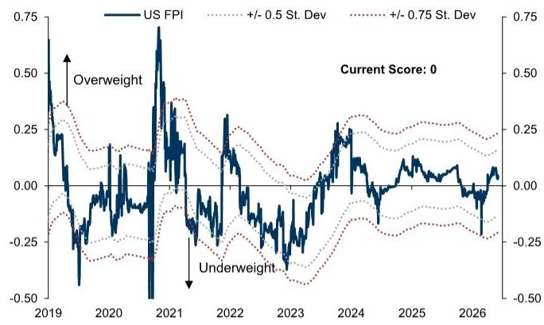

line

| Year | US FPI | +/- 0.5 St. Dev | +/- 0.75 St. Dev |
|------|--------|-----------------|------------------|
| 2019 | 0.75   | 0.30            | 0.40             |
| 2020 | -0.25  | -0.10           | -0.15            |
| 2021 | 0.75   | 0.35            | 0.45             |
| 2022 | -0.25  | -0.15           | -0.20            |
| 2023 | -0.50  | -0.30           | -0.35            |
| 2024 | 0.25   | 0.10            | 0.20             |
| 2025 | 0.10   | 0.05            | 0.15             |
| 2026 | 0.05   | -0.05           | -0.10            |

Source: GS Global Investment Research

US Data Response Indicator (DRI)   
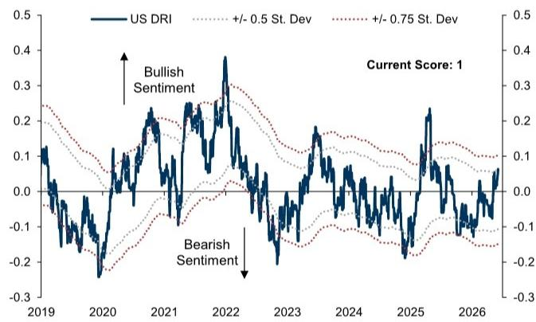

line

| Year | US DRI | +/- 0.5 St. Dev | +/- 0.75 St. Dev |
|------|--------|-----------------|------------------|
| 2019 | 0.1    | 0.2             | 0.1              |
| 2020 | -0.2   | 0.1             | 0.0              |
| 2021 | 0.2    | 0.1             | 0.1              |
| 2022 | 0.4    | 0.3             | 0.2              |
| 2023 | -0.1   | 0.1             | 0.1              |
| 2024 | 0.1    | 0.1             | 0.1              |
| 2025 | -0.1   | 0.1             | 0.1              |
| 2026 | 0.1    | 0.1             | 0.1              |

Source: GS Global Investment Research

# CFTC Commitment of Traders and Traders in Financial Futures

Duration-weighted net position by investor type

Duration-Weighted Positioning, by Contract 

<table><tr><td>$mm/bp</td><td>SFR</td><td>TU</td><td>FV</td><td>TY</td><td>TN</td><td>US</td><td>WN</td></tr><tr><td>Spec Current</td><td>-56.0</td><td>-43.2</td><td>-53.7</td><td>-46.6</td><td>-10.2</td><td>-27.2</td><td>-45.0</td></tr><tr><td>Spec 1w Change</td><td>-5.8</td><td>10.9</td><td>0.1</td><td>4.2</td><td>-0.5</td><td>-1.7</td><td>-2.3</td></tr><tr><td>LF Current</td><td>-48.8</td><td>-61.0</td><td>-84.3</td><td>-120.4</td><td>-20.7</td><td>-44.6</td><td>-151.0</td></tr><tr><td>LF 1w Change</td><td>-3.7</td><td>4.0</td><td>7.8</td><td>1.6</td><td>2.6</td><td>0.1</td><td>-2.3</td></tr><tr><td>AM + Other Current</td><td>-3.5</td><td>72.2</td><td>110.7</td><td>131.6</td><td>53.0</td><td>61.9</td><td>186.5</td></tr><tr><td>AM + Other 1w Change</td><td>0.4</td><td>-4.7</td><td>-8.9</td><td>-17.2</td><td>-0.3</td><td>2.0</td><td>3.3</td></tr><tr><td>Dealer Current</td><td>52.0</td><td>-13.1</td><td>-29.1</td><td>-29.9</td><td>-22.1</td><td>-29.7</td><td>-33.3</td></tr><tr><td>Dealer 1w Change</td><td>3.1</td><td>1.0</td><td>-2.9</td><td>1.4</td><td>-2.4</td><td>-3.9</td><td>-0.3</td></tr></table>

Source: CFTC, GS Global Investment Research

Net positions in Eurodollars   
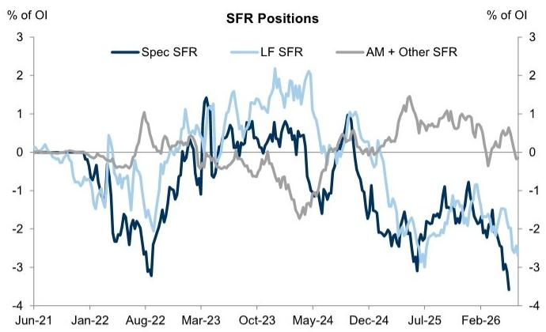

line

| Date    | Spec SFR | LF SFR | AM + Other SFR |
|---------|----------|--------|----------------|
| Jun-21  | 0        | 0      | 0              |
| Jan-22  | -1       | -1     | -1             |
| Aug-22  | -3       | -2     | -1             |
| Mar-23  | 1        | 1      | 0              |
| Oct-23  | 0        | 2      | 1              |
| May-24  | -1       | -1     | -1             |
| Dec-24  | -2       | -2     | -1             |
| Jul-25  | -3       | -3     | -1             |
| Feb-26  | -4       | -4     | -1             |

Note: Duration-weighted net position (long - short) as a % of duration-weighted gross exposure (long + short + spreading)   
Source: CFTC, GS Global Investment Research

Primary dealer transactions   
Net dealer position in US Treasuries   
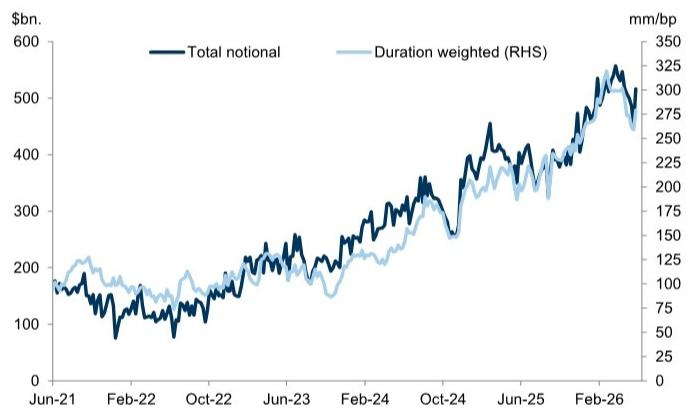

line

| Date   | Total notional ($bn) | Duration weighted (RHS) (mm/bp) |
|--------|------------------------|----------------------------------|
| Jun-21 | ~180                   | ~100                             |
| Feb-22 | ~100                   | ~125                             |
| Oct-22 | ~180                   | ~150                             |
| Jun-23 | ~250                   | ~175                             |
| Feb-24 | ~300                   | ~200                             |
| Oct-24 | ~350                   | ~225                             |
| Jun-25 | ~400                   | ~250                             |
| Feb-26 | ~550                   | ~300                             |

Source: Federal Reserve Bank of New York, GS Global Investment Research

Net positions in UST futures   
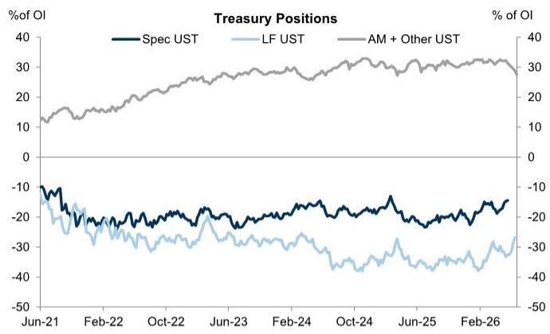

line

| Date   | Spec UST | LF UST | AM + Other UST |
|--------|----------|--------|----------------|
| Jun-21 | -10      | -15    | 15             |
| Feb-22 | -20      | -25    | 20             |
| Oct-22 | -15      | -20    | 25             |
| Jun-23 | -18      | -22    | 28             |
| Feb-24 | -17      | -28    | 30             |
| Oct-24 | -15      | -30    | 32             |
| Jun-25 | -18      | -35    | 31             |
| Feb-26 | -15      | -30    | 30             |

Note: Duration-weighted net position (long - short) as a % of duration-weighted gross exposure (long + short + spreading)   
Source: CFTC, GS Global Investment Research

US Commercial Banks' Holdings of Treasury and Agency Securities   
Total domestic and foreign holdings, all commercial banks   
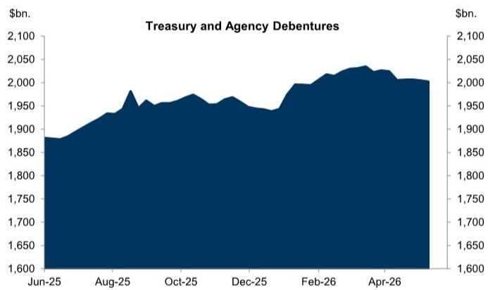

area

| Date   | Value ($bn) |
|--------|-------------|
| Jun-25 | 1,880       |
| Aug-25 | 1,950       |
| Oct-25 | 1,970       |
| Dec-25 | 1,960       |
| Feb-26 | 2,000       |
| Apr-26 | 2,050       |

Source: Federal Reserve Board

# NY Fed Custody Holdings

Marketable US Treasuries

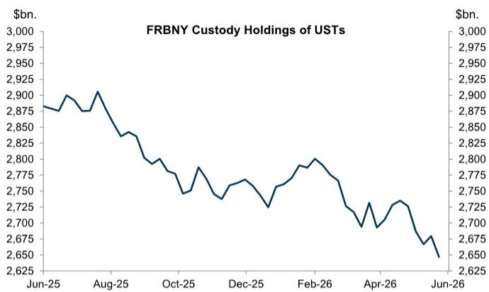

line

| Date   | Value ($bn) |
|--------|-------------|
| Jun-25 | 2,875       |
| Aug-25 | 2,900       |
| Oct-25 | 2,750       |
| Dec-25 | 2,775       |
| Feb-26 | 2,800       |
| Apr-26 | 2,700       |
| Jun-26 | 2,650       |

Source: Federal Reserve Bank of New York

Net monthly purchases of short- and long-term US Treasuries by Japanese investors   
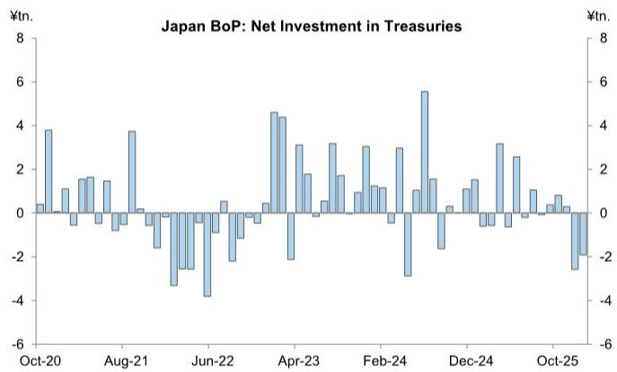

bar

Japan BoP: Net Investment in Treasuries
| Date | Net Investment (¥tn) |
|---|---|
| Oct-20 | 0.3 |
| Nov-20 | 3.9 |
| Dec-20 | -0.1 |
| Jan-21 | 1.2 |
| Feb-21 | 1.6 |
| Mar-21 | -0.4 |
| Apr-21 | 1.5 |
| May-21 | -0.8 |
| Jun-21 | 3.8 |
| Jul-21 | -0.2 |
| Aug-21 | 0.1 |
| Sep-21 | -1.5 |
| Oct-21 | -3.2 |
| Nov-21 | -2.7 |
| Dec-21 | -3.5 |
| Jan-22 | -0.6 |
| Feb-22 | -0.9 |
| Mar-22 | 0.5 |
| Apr-22 | -1.8 |
| May-22 | -0.3 |
| Jun-22 | 0.6 |
| Jul-22 | -2.3 |
| Aug-22 | -0.5 |
| Sep-22 | 0.4 |
| Oct-22 | -0.7 |
| Nov-22 | 0.5 |
| Dec-22 | 0.6 |
| Jan-23 | 4.5 |
| Feb-23 | 4.4 |
| Mar-23 | -1.9 |
| Apr-23 | 3.1 |
| May-23 | 1.8 |
| Jun-23 | -0.1 |
| Jul-23 | 0.6 |
| Aug-23 | 3.1 |
| Sep-23 | 1.7 |
| Oct-23 | 0.9 |
| Nov-23 | 3.0 |
| Dec-23 | 1.3 |
| Jan-24 | -0.4 |
| Feb-24 | 3.0 |
| Mar-24 | -3.0 |
| Apr-24 | 5.6 |
| May-24 | 1.4 |
| Jun-24 | -1.7 |
| Jul-24 | 0.4 |
| Aug-24 | 0.5 |
| Sep-24 | 1.4 |
| Oct-24 | -0.3 |
| Nov-24 | 3.1 |
| Dec-24 | -0.5 |
| Jan-25 | 0.5 |
| Feb-25 | 1.1 |
| Mar-25 | 0.6 |
| Apr-25 | -2.5 |
| May-25 | -0.8 |
| Jun-25 | -0.9 |
| Jul-25 | -0.9 |
| Aug-25 | -0.9 |

Source: Bank of Japan, Haver Analytics

# US TIC Treasury Flows

12m change in valuation-adjusted holdings of USTs, by holder of debt

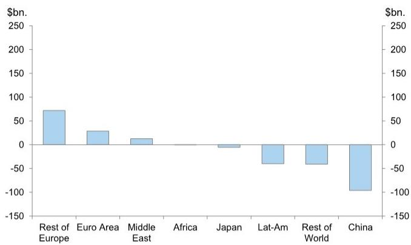

bar

| Region | Value ($bn) |
|---|---|
| Rest of Europe | 70 |
| Euro Area | 30 |
| Middle East | 15 |
| Africa | -5 |
| Japan | -10 |
| Lat-Am | -40 |
| Rest of World | -35 |
| China | -95 |

Source: US Treasury, GS Global Investment Research

Flow of Funds annual net purchases of US Treasuries, by sector   
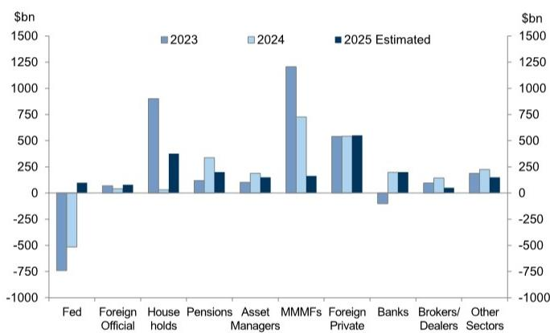

bar

| Sector | 2023 ($bn) | 2024 ($bn) | 2025 Estimated ($bn) |
|---|---|---|---|
| Fed | -750 | -500 | 100 |
| Foreign Official | 50 | 50 | 50 |
| Households | 900 | 100 | 350 |
| Pensions | 100 | 300 | 180 |
| Asset Managers | 80 | 150 | 120 |
| MMMFs | 1200 | 700 | 150 |
| Foreign Private | 500 | 500 | 500 |
| Banks | -100 | 180 | 180 |
| Brokers/Dealers | 80 | 120 | 30 |
| Other Sectors | 180 | 220 | 120 |

Source: Federal Reserve Board, GS Global Investment Research

# Outright Carry

Bar chart shows top two carry points by currency, with solid reflecting carry to a long position and striped carry to a short position. Scatter illustrates top 25 carry/vol points by currency, with top point by currency noted

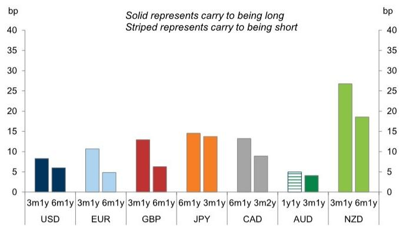

bar

Solid represents carry to being long Striped represents carry to being short
| Currency | Time Period | Value (bp) |
| :--- | :--- | :--- |
| USD | 3m1y | 8.5 |
| USD | 6m1y | 6.0 |
| EUR | 3m1y | 10.5 |
| EUR | 6m1y | 4.5 |
| GBP | 3m1y | 12.5 |
| GBP | 6m1y | 6.0 |
| JPY | 6m1y | 14.0 |
| JPY | 3m1y | 13.5 |
| CAD | 6m1y | 13.0 |
| CAD | 3m2y | 9.0 |
| AUD | 1y1y | 4.5 |
| AUD | 3m1y | 3.5 |
| NZD | 3m1y | 27.0 |
| NZD | 6m1y | 18.5 |

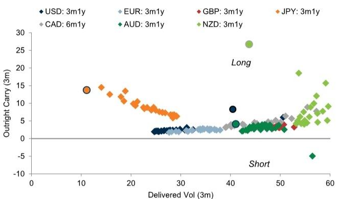

scatter

| Currency | Duration | Delivered Vol (3m) | Outright Carry (3m) |
| :--- | :--- | :--- | :--- |
| USD | 3m1y | 40 | 8 |
| EUR | 3m1y | 30 | 2 |
| GBP | 3m1y | 50 | 3 |
| JPY | 3m1y | 10 | 14 |
| CAD | 6m1y | 40 | 4 |
| AUD | 3m1y | 40 | 4 |
| NZD | 3m1y | 55 | 18 |
| Short | | 57 | -5 |

Source: GS Global Investment Research

# Curve Carry

Bar chart shows top two carry curves by currency, with solid reflecting carry to a steepening position and striped carry to a flattening position. Scatter illustrates top 5 carry/vol curves by currency, with top curve by currency noted

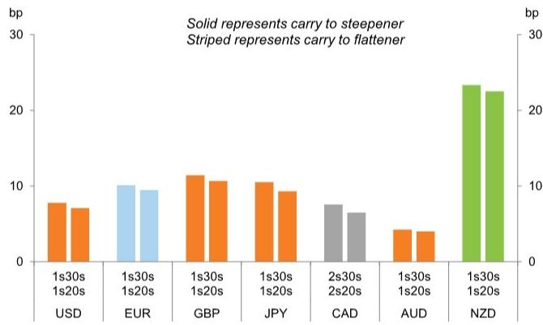

bar

Solid represents carry to steepener Striped represents carry to flattener
| Currency | Timeframe | 1s30s / 1s20s (bp) |
| :--- | :--- | :--- |
| USD | 1s30s | 8 |
| EUR | 1s30s | 10 |
| GBP | 1s30s | 12 |
| JPY | 1s30s | 11 |
| CAD | 2s30s | 8 |
| AUD | 1s30s | 4 |
| NZD | 1s30s | 24 |
| USD | 1s20s | 7 |
| EUR | 1s20s | 9 |
| GBP | 1s20s | 11 |
| JPY | 1s20s | 9 |
| CAD | 2s20s | 7 |
| AUD | 1s20s | 4 |
NZD | 1s20s | 23 |

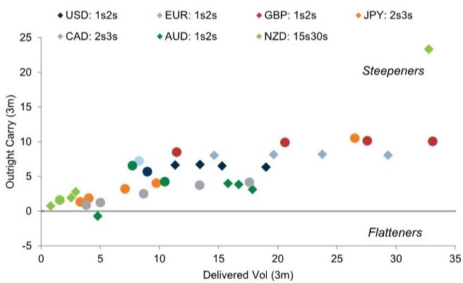  
Source: GS Global Investment Research

# Fly Carry

Bar chart shows top two carry flies by currency, with solid reflecting carry to a belly-richening fly and striped carry to a belly-cheapening fly. Scatter illustrates top 5 carry/vol flies by currency, with top fly by currency noted.

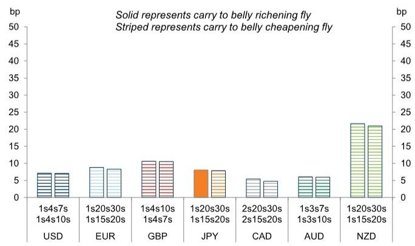

bar

Solid represents carry to belly richening fly; Striped represents carry to belly cheapening fly
| Currency | Striped (bp) | Solid (bp) |
| :--- | :--- | :--- |
| USD | 7.5 | 7.5 |
| EUR | 8.5 | 9.0 |
| GBP | 10.5 | 11.0 |
| JPY | 8.0 | 8.0 |
| CAD | 5.0 | 5.0 |
| AUD | 6.0 | 6.0 |
| NZD | 21.5 | 22.0 |

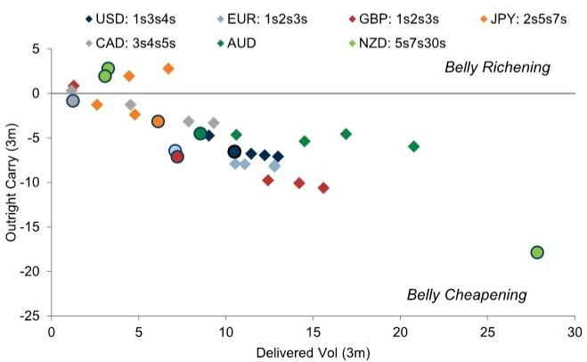  
Source: GS Global Investment Research

# Treasury Supply Monitor

Gross Treasury auction size estimates by year end, with GS projections 

<table><tr><td colspan="12">Monthly Auction Amounts at End of Calendar Year ($ billions)</td></tr><tr><td></td><td>2y FRNs</td><td>2y</td><td>3y</td><td>5y</td><td>7y</td><td>10y</td><td>20y</td><td>30y</td><td>5y TIPS</td><td>10y TIPS</td><td>30y TIPS</td></tr><tr><td>YE-25 (CY)</td><td>30 / 28 (r)</td><td>69</td><td>58</td><td>70</td><td>44</td><td>42 / 39 (r)</td><td>16 / 13 (r)</td><td>25 / 22 (r)</td><td>26 / 24 (r)</td><td>21 / 19 (r)</td><td>9 / 8 (r)</td></tr><tr><td>YE-26 (CY, GS)</td><td>30 / 28 (r)</td><td>69</td><td>58</td><td>70</td><td>44</td><td>42 / 39 (r)</td><td>16 / 13 (r)</td><td>25 / 22 (r)</td><td>26 / 24 (r)</td><td>21 / 19 (r)</td><td>9 / 8 (r)</td></tr><tr><td>YE-27 (CY, GS)</td><td>33 / 30 (r)</td><td>83</td><td>72</td><td>84</td><td>58</td><td>42 / 39 (r)</td><td>16 / 13 (r)</td><td>25 / 22 (r)</td><td>28 / 26 (r)</td><td>21 / 19 (r)</td><td>9 / 8 (r)</td></tr></table>

\* Original Issue / Reopening listed for FRNs, 10s, 20s, 30s, and TIPS.

<table><tr><td colspan="7">US Treasury Net Issuance by Calendar Year ($ billions)</td></tr><tr><td></td><td>Net Coupons</td><td>Fed</td><td>Net of Fed</td><td>Net Bills</td><td>Fed</td><td>Net of Fed</td></tr><tr><td>CY 2024</td><td>1346</td><td>-475</td><td>1821</td><td>511</td><td>-23</td><td>534</td></tr><tr><td>CY 2025</td><td>1566</td><td>-115</td><td>1681</td><td>360</td><td>38</td><td>322</td></tr><tr><td>CY 2026, GS</td><td>1225</td><td>-1</td><td>1226</td><td>811</td><td>422</td><td>389</td></tr><tr><td>CY 2027, GS</td><td>1286</td><td>0</td><td>1286</td><td>927</td><td>449</td><td>478</td></tr></table>

<table><tr><td colspan="3">Duration supply ($bn 10y equiv)</td></tr><tr><td>Gross supply</td><td>Fed</td><td>Net of Fed</td></tr><tr><td>2765</td><td>0</td><td>2765</td></tr><tr><td>2797</td><td>0</td><td>2797</td></tr><tr><td>2796</td><td>0</td><td>2796</td></tr><tr><td>2929</td><td>0</td><td>2929</td></tr></table>

Source: GS Global Investment Research, US Department of the Treasury

Net issuance per quarter   
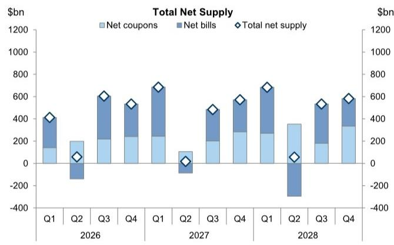

bar

| Year | Quarter | Net coupons ($bn) | Net bills ($bn) | Total net supply ($bn) |
|------|---------|-------------------|-----------------|------------------------|
| 2026 | Q1      | 150               | 300             | 400                    |
| 2026 | Q2      | 200               | -150            | 100                    |
| 2026 | Q3      | 200               | 400             | 600                    |
| 2026 | Q4      | 250               | 350             | 550                    |
| 2027 | Q1      | 250               | 450             | 700                    |
| 2027 | Q2      | -100              | -50             | -50                    |
| 2027 | Q3      | 200               | 350             | 500                    |
| 2027 | Q4      | 300               | 350             | 600                    |
| 2028 | Q1      | 250               | 450             | 700                    |
| 2028 | Q2      | 350               | -300            | 100                    |
| 2028 | Q3      | 150               | 350             | 550                    |
| 2028 | Q4      | 350               | 350             | 600                    |

Source: GS Global Investment Research, US Department of the Treasury

Average monthly UST issuance, gross and net of Fed purchases; \$bn 10y equivalents   
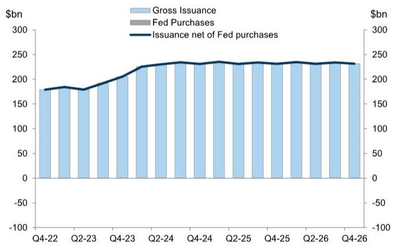

bar_line

| Quarter | Gross Issuance ($bn) | Fed Purchases ($bn) | Issuance net of Fed purchases ($bn) |
|---|---|---|---|
| Q4-22 | 180 | - | 185 |
| Q2-23 | 175 | - | 178 |
| Q4-23 | 200 | - | 205 |
| Q2-24 | 230 | - | 235 |
| Q4-24 | 235 | - | 238 |
| Q2-25 | 230 | - | 235 |
| Q4-25 | 230 | - | 235 |
| Q2-26 | 230 | - | 235 |
| Q4-26 | 230 | - | 235 |

Source: GS Global Investment Research, US Department of the Treasury

Free float (Treasuries outstanding less Fed and foreign official holdings) as % of GDP   
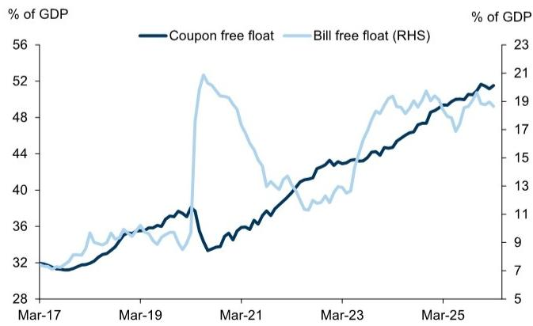

line

| Date   | Coupon free float | Bill free float (RHS) |
|--------|-------------------|------------------------|
| Mar-17 | 32                | 7                      |
| Mar-19 | 36                | 11                     |
| Mar-21 | 33                | 21                     |
| Mar-23 | 44                | 17                     |
| Mar-25 | 52                | 19                     |

Source: Haver Analytics, US Treasury, GS Global Investment Research

Bills as a share of Treasuries outstanding and GS forecast Gray shading denotes TBAC recommended 15-20% range   
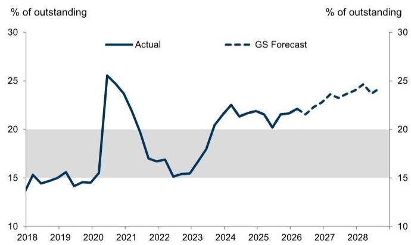

line

| Year | Actual | GS Forecast |
|------|--------|-------------|
| 2018 | 14.0   | -           |
| 2019 | 15.0   | -           |
| 2020 | 14.5   | -           |
| 2021 | 25.5   | -           |
| 2022 | 16.5   | -           |
| 2023 | 15.5   | -           |
| 2024 | 22.5   | -           |
| 2025 | 21.5   | -           |
| 2026 | 21.0   | -           |
| 2027 | -      | 23.0        |
| 2028 | -      | 24.5        |

Source: US Treasury, GS Global Investment Research

# GS Term Premium Decomposition

1y Range of G10 10y Yields, by Term Premium and Expectations Components   
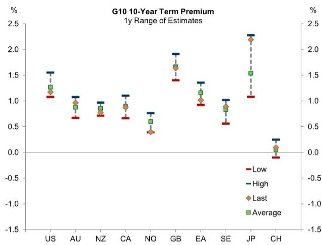

boxplot

G10 10-Year Term Premium
| Country | Low (%) | High (%) | Last (%) | Average (%) |
|---|---|---|---|---|
| US | 1.1 | 1.55 | 1.2 | 1.3 |
| AU | 0.7 | 1.05 | 0.95 | 0.9 |
| NZ | 0.75 | 0.95 | 0.85 | 0.85 |
| CA | 0.65 | 1.1 | 0.9 | 0.9 |
| NO | 0.4 | 0.75 | 0.45 | 0.6 |
| GB | 1.4 | 1.9 | 1.65 | 1.6 |
| EA | 0.95 | 1.35 | 1.05 | 1.2 |
| SE | 0.55 | 1.05 | 0.85 | 0.85 |
| JP | 1.1 | 2.25 | 2.2 | 1.5 |
| CH | -0.1 | 0.25 | 0.15 | 0.1 |

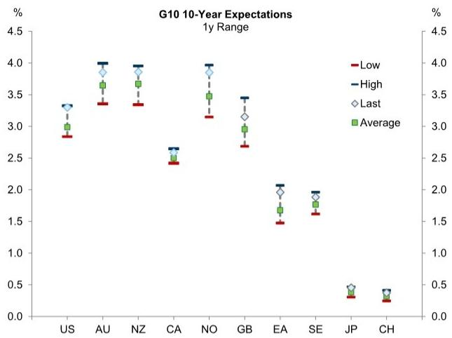

boxplot

G10 10-Year Expectations
1y Range
| Country | Low (%) | High (%) | Last (%) | Average (%) |
|---|---|---|---|---|
| US | 2.8 | 3.3 | 3.4 | 3.0 |
| AU | 3.4 | 4.0 | 3.9 | 3.6 |
| NZ | 3.4 | 3.9 | 3.9 | 3.7 |
| CA | 2.4 | 2.6 | 2.7 | 2.5 |
| NO | 3.2 | 3.9 | 3.9 | 3.5 |
| GB | 2.7 | 3.5 | 3.2 | 3.0 |
| EA | 1.5 | 2.0 | 2.0 | 1.7 |
| SE | 1.6 | 1.9 | 1.9 | 1.8 |
| JP | 0.3 | 0.4 | 0.4 | 0.4 |
| CH | 0.2 | 0.4 | 0.4 | 0.4 |

Term Structure of Fitted Yields, by Component   
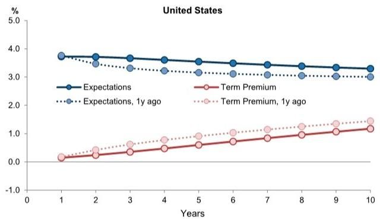

line

United States
| Years | Expectations (%) | Term Premium (%) |
|---|---|---|
| 1 | 3.8 | 0.1 |
| 2 | 3.7 | 0.2 |
| 3 | 3.6 | 0.4 |
| 4 | 3.5 | 0.5 |
| 5 | 3.4 | 0.6 |
| 6 | 3.3 | 0.7 |
| 7 | 3.2 | 0.8 |
| 8 | 3.1 | 0.9 |
| 9 | 3.0 | 1.0 |
| 10 | 2.9 | 1.1 |

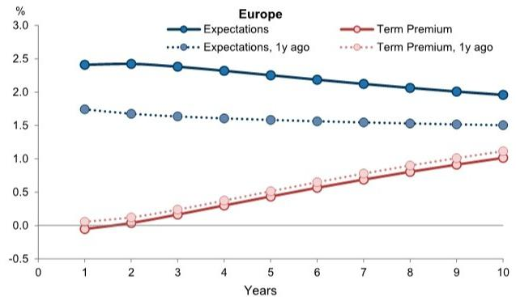

line

Europe
| Years | Expectations (%) | Term Premium (%) |
|---|---|---|
| 1 | 2.4 | -0.05 |
| 2 | 2.4 | 0.05 |
| 3 | 2.35 | 0.2 |
| 4 | 2.3 | 0.3 |
| 5 | 2.25 | 0.45 |
| 6 | 2.2 | 0.6 |
| 7 | 2.15 | 0.75 |
| 8 | 2.1 | 0.9 |
| 9 | 2.0 | 1.0 |
| 10 | 1.95 | 1.1 |

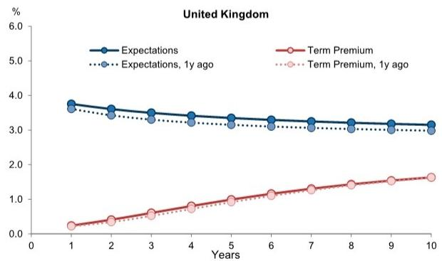

line

United Kingdom
| Years | Expectations (%) | Expectations, 1y ago (%) | Term Premium (%) | Term Premium, 1y ago (%) |
|---|---|---|---|---|
| 1 | 3.7 | 3.6 | 0.2 | 0.2 |
| 2 | 3.5 | 3.4 | 0.4 | 0.4 |
| 3 | 3.4 | 3.3 | 0.6 | 0.6 |
| 4 | 3.3 | 3.2 | 0.8 | 0.8 |
| 5 | 3.2 | 3.1 | 1.0 | 1.0 |
| 6 | 3.1 | 3.0 | 1.2 | 1.2 |
| 7 | 3.0 | 2.9 | 1.3 | 1.3 |
| 8 | 2.9 | 2.8 | 1.4 | 1.4 |
| 9 | 2.8 | 2.7 | 1.5 | 1.5 |
| 10 | 2.7 | 2.6 | 1.6 | 1.6 |

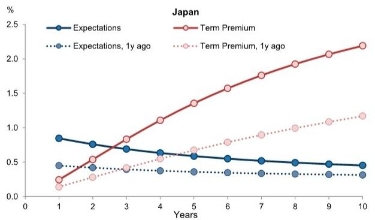

line

Japan
| Years | Expectations (%) | Term Premium (%) | Expectations, 1y ago (%) | Term Premium, 1y ago (%) |
|---|---|---|---|---|
| 1 | 0.85 | 0.25 | 0.45 | 0.15 |
| 2 | 0.75 | 0.55 | 0.45 | 0.30 |
| 3 | 0.70 | 0.85 | 0.40 | 0.40 |
| 4 | 0.65 | 1.15 | 0.35 | 0.55 |
| 5 | 0.60 | 1.35 | 0.35 | 0.70 |
| 6 | 0.55 | 1.60 | 0.35 | 0.80 |
| 7 | 0.50 | 1.75 | 0.35 | 0.90 |
| 8 | 0.48 | 1.90 | 0.35 | 1.00 |
| 9 | 0.45 | 2.05 | 0.35 | 1.10 |
| 10 | 0.45 | 2.20 | 0.35 | 1.20 |

Source: GS Global Investment Research

2026 Trade Recommendations 

<table><tr><td colspan="8">GS Rates Trades</td></tr><tr><td colspan="2">Active</td><td>Entry Date</td><td>Opened</td><td>Latest</td><td>Stop</td><td>Target</td><td>Performance</td></tr><tr><td>1.</td><td>Long 3y France, Spain, Italy vs OIS (equally weighted)</td><td>10-Apr-26</td><td>0.33</td><td>0.31</td><td>0.32</td><td>0.23</td><td>+2 bps</td></tr><tr><td>2.</td><td>Long 3y SOFR swap spread</td><td>17-Apr-26</td><td>-0.226</td><td>-0.201</td><td>-0.230</td><td>-0.180</td><td>+3 bps</td></tr><tr><td>3.</td><td>2s5s CAD steepeners</td><td>24-Apr-26</td><td>0.20</td><td>0.22</td><td>0.20</td><td>0.35</td><td>+2 bps</td></tr><tr><td>4.</td><td>Long 5y5y EUR OIS - HICP</td><td>01-May-26</td><td>1.09</td><td>1.05</td><td>1.22</td><td>0.88</td><td>+4 bps</td></tr><tr><td>5.</td><td>Long 5y Receivers on 3m 2s5s10s Receiver Fly (bp running)</td><td>08-May-26</td><td>0.01</td><td>-0.01</td><td>-0.05</td><td>0.10</td><td>-2 bps</td></tr><tr><td>6.</td><td>1y forward 2s10s GBP OIS steepeners</td><td>29-May-26</td><td>0.38</td><td>0.36</td><td>0.25</td><td>0.55</td><td>-2 bps</td></tr><tr><td colspan="2">Closed</td><td>Entry Date</td><td>Closed</td><td colspan="4">Performance</td></tr><tr><td>1.</td><td>SFRZ6/Z7 steepeners</td><td>21-Nov-25</td><td>14-Jan-26</td><td>+6bps</td><td></td><td></td><td></td></tr><tr><td>2.</td><td>Long 10y Gilts on ASW</td><td>21-Nov-25</td><td>30-Jan-26</td><td>+12 bps</td><td></td><td></td><td></td></tr><tr><td>3.</td><td>Long USD 3m2y A-25 receiver vs short 3m10y A-25 receiver (return in bp running)</td><td>07-Nov-25</td><td>09-Feb-26</td><td>-2 bps</td><td></td><td></td><td></td></tr><tr><td>4.</td><td>2s5s CORRA steepener</td><td>16-Jan-26</td><td>13-Feb-26</td><td>+0 bps</td><td></td><td></td><td></td></tr><tr><td>5.</td><td>Receive AUD 5y5y IRS vs pay NZD 5y5y</td><td>28-Nov-25</td><td>18-Feb-26</td><td>+0 bps</td><td></td><td></td><td></td></tr><tr><td>6.</td><td>Long 20s on 10s20s30s weighted SOFR fly (weights 0.6x : 2x : 1.4x)</td><td>01-Aug-25</td><td>02-Mar-26</td><td>+6 bps</td><td></td><td></td><td></td></tr><tr><td>7.</td><td>Long SFIU6</td><td>30-Jan-26</td><td>03-Mar-26</td><td>+7 bps</td><td></td><td></td><td></td></tr><tr><td>8.</td><td>Long 10y Gilts vs Bunds</td><td>07-Nov-25</td><td>09-Mar-26</td><td>+4 bps</td><td></td><td></td><td></td></tr><tr><td>9.</td><td>3m10y A+5/A+20/A+27.5 payer ladders (bp running)</td><td>20-Feb-26</td><td>23-Mar-26</td><td>-5 bps</td><td></td><td></td><td></td></tr><tr><td>10.</td><td>Long 10y NOK vs SEK</td><td>13-Feb-26</td><td>25-Mar-26</td><td>+20 bps</td><td></td><td></td><td></td></tr><tr><td>11.</td><td>Long EU 30y on the fly against 30y Austria and Spain</td><td>27-Feb-26</td><td>10-Apr-26</td><td>-5 bps</td><td></td><td></td><td></td></tr><tr><td>12.</td><td>Long USD 3m 2s10s A+10/A+25 curve cap spread (bp of notional)</td><td>23-Jan-26</td><td>15-Apr-26</td><td>-2 bps</td><td></td><td></td><td></td></tr><tr><td>13.</td><td>USD 3m3y A-5/A-40 receiver spreads</td><td>13-Mar-26</td><td>30-Apr-26</td><td>-7 bps</td><td></td><td></td><td></td></tr><tr><td>14.</td><td>Long 10y Inflation Swap vs 0.25x Receive 10y SOFR</td><td>27-Mar-26</td><td>07-May-26</td><td>+15 bps</td><td></td><td></td><td></td></tr><tr><td>15.</td><td>Pay 10s on 5s10s30s SOFR fly</td><td>09-Jan-26</td><td>08-May-26</td><td>-1 bps</td><td></td><td></td><td></td></tr></table>

Note: Potential profit/loss estimates are given as per unit of duration risk, through yesterday's close.   
Source: GS Global Investment Research

# Global Interest Rates Strategy

# George Cole

+44(20)7552-1214

george.cole@gs.com

GS International

# William Marshall

+1(212)357-0413

william.c.marshall@gs.com

GS & Co. LLC

# Simon Freycenet

+44(20)7774-5017

simon.freycenet@gs.com

GS Bank Europe SE - Paris

Branch

# Isabella Rosenberg

+1(212)357-7628

isabella.rosenberg@gs.com

GS & Co. LLC

# Friedrich Schaper

+1(917)343-3214

friedrich.schaper@gs.com

GS & Co. LLC

# Loic Mathys

+44(20)7051-1664

loic.mathys@gs.com

GS International

# Disclosure Appendix

# Reg AC

We, George Cole, William Marshall, Simon Freycenet, Isabella Rosenberg, Friedrich Schaper and Loic Mathys, hereby certify that all of the views expressed in this report accurately reflect our personal views, which have not been influenced by considerations of the firm's business or client relationships.

Unless otherwise stated, the individuals listed on the cover page of this report are analysts in GS' Global Investment Research division.

Contributing Authors: George Cole GS International, William Marshall GS & Co. LLC, Simon Freycenet GS Bank Europe SE - Paris Branch, Isabella Rosenberg GS & Co. LLC, Friedrich Schaper GS & Co. LLC, Loic Mathys GS International.

Unless otherwise stated, the individuals listed in the Contributing Authors disclosure of this report are analysts in GS' Global Investment Research division.

# Disclosures

# Option Specific Disclosures

Price target methodology: Please refer to the analyst's previously published research for methodology and risks associated with equity price targets.

Pricing Disclosure: Option prices and volatility levels in this note are indicative only, and are based on our estimates of recent mid-market levels (unless otherwise noted). All prices and levels exclude transaction costs unless otherwise stated.

General Options Risks – The risks below and any other options risks mentioned in this research report pertain both to specific derivative trade recommendations mentioned and to discussion of general opportunities and advantages of derivative strategies. Unless otherwise noted, options strategies mentioned in this report may be a combination of the strategies below and therefore carry with them the risks of those strategies.

Buying Options – Investors who buy call (put) options risk loss of the entire premium paid if the underlying security finishes below (above) the strike price at expiration. Investors who buy call or put spreads also risk a maximum loss of the premium paid. The maximum gain on a long call or put spread is the difference between the strike prices, less the premium paid.

Selling Options – Investors who sell calls on securities they do not own risk unlimited loss of the security price less the strike price. Investors who sell covered calls (sell calls while owning the underlying security) risk having to deliver the underlying security or pay the difference between the security price and the strike price, depending on whether the option is settled by physical delivery or cash-settled. Investors who sell puts risk loss of the strike price less the premium received for selling the put. Investors who sell put or call spreads risk a maximum loss of the difference between the strikes less the premium received, while their maximum gain is the premium received.

For options settled by physical delivery, the above risks assume the options buyer or seller, buys or sells the resulting securities at the settlement price on expiry.

# Regulatory disclosures

# Disclosures required by United States laws and regulations

See company-specific regulatory disclosures above for any of the following disclosures required as to companies referred to in this report: manager or co-manager in a pending transaction; $1\%$ or other ownership; compensation for certain services; types of client relationships; managed/co-managed public offerings in prior periods; directorships; for equity securities, market making and/or specialist role. GS trades or may trade as a principal in debt securities (or in related derivatives) of issuers discussed in this report.

The following are additional required disclosures: Ownership and material conflicts of interest: GS policy prohibits its analysts, professionals reporting to analysts and members of their households from owning securities of any company in the analyst's area of coverage. Analyst compensation: Analysts are paid in part based on the profitability of GS, which includes investment banking revenues. Analyst as officer or director: GS policy generally prohibits its analysts, persons reporting to analysts or members of their households from serving as an officer, director or advisor of any company in the analyst's area of coverage. Non-U.S. Analysts: Non-U.S. analysts may not be associated persons of GS & Co. LLC and therefore may not be subject to FINRA Rule 2241 or FINRA Rule 2242 restrictions on communications with a subject company, public appearances and trading in securities covered by the analysts.

# Additional disclosures required under the laws and regulations of jurisdictions other than the United States

The following disclosures are those required by the jurisdiction indicated, except to the extent already made above pursuant to United States laws and regulations. Australia: GS Australia Pty Ltd and its affiliates are not authorised deposit-taking institutions (as that term is defined in the Banking Act 1959 (Cth)) in Australia and do not provide banking services, nor carry on a banking business, in Australia. This research, and any access to it, is intended only for “wholesale clients” within the meaning of the Australian Corporations Act, unless otherwise agreed by GS. In producing research reports, members of Global Investment Research of GS Australia may attend site visits and other meetings hosted by the companies and other entities which are the subject of its research reports. In some instances the costs of such site visits or meetings may be met in part or in whole by the issuers concerned if GS Australia considers it is appropriate and reasonable in the specific circumstances relating to the site visit or meeting. To the extent that the contents of this document contains any financial product advice, it is general advice only and has been prepared by GS without taking into account a client’s objectives, financial situation or needs. A client should, before acting on any such advice, consider the appropriateness of the advice having regard to the client’s own objectives, financial situation and needs. A copy of certain GS Australia and New Zealand disclosure of interests and a copy of GS’ Australian Sell-Side Research Independence Policy Statement are available at: https://www.goldmansachs.com/disclosures/australia-new-zealand/index.html. Brazil: Disclosure information in relation to CVM Resolution n. 20 is available at https://www.gs.com/worldwide/brazil/area/gir/index.html. Where applicable, the Brazil-registered analyst primarily responsible for the content of this research report, as defined in Article 20 of CVM Resolution n. 20, is the first author named at the beginning of this report, unless indicated otherwise at the end of the text. Canada: This information is being provided to you for information purposes only and is not, and under no circumstances should be construed as, an advertisement, offering or solicitation by GS & Co. LLC for purchasers of securities in Canada to trade in any Canadian security. GS & Co. LLC is not registered as a dealer in any jurisdiction in Canada under applicable Canadian securities laws and generally is not permitted to trade in Canadian securities and may be prohibited from selling certain securities and products in certain jurisdictions in Canada. If you wish to trade in any Canadian securities or other products in Canada please contact GS Canada Inc., an affiliate of The GS Group Inc., or another registered Canadian dealer. Hong Kong: Further information on the securities of covered companies referred to in this research may be obtained on request from GS (Asia) L.L.C. India: Further information on the subject company or companies referred to in this research may be obtained from GS (India) Securities Private Limited, Research Analyst – SEBI Registration Number INH000001493, 10th Floor, Ascent-Worli, Sudam Kalu Ahire Marg, Worli, Mumbai-400 025, India, Corporate Identity Number U74140MH2006FTC160634, Phone +91 22 6616 9000, Fax +91 22 6616 9001. GS may beneficially own 1% or more of the securities (as such term is defined in clause 2 (h) the Indian Securities Contracts (Regulation) Act, 1956) of the subject company or companies referred to in this research report. Investment in securities market are subject to market risks. Read all the related documents carefully before investing. Registration granted by SEBI and certification from NISM in no way guarantee performance of the intermediary or provide any assurance of returns to investors. GS (India) Securities Private Limited compliance officer and investor grievance contact details can be found at: https://www.goldmansachs.com/worldwide/india/documents/Grievance-Redressal-and-Escalation-Matrix.pdf, and a copy of the annual audit compliance report can be found at this link: https://publishing.gs.com/content/site/india-annual-compliance-report.html. Japan: See below. Korea: This research, and any access to it, is intended only for “professional investors” within the meaning of the Financial Services and Capital Markets Act, unless otherwise agreed by GS. Further information on the subject company or companies referred to in this research may be obtained from GS (Asia) L.L.C., Seoul Branch. New Zealand: GS New Zealand Limited and its affiliates are neither “registered banks” nor “deposit takers” (as defined in the Reserve Bank of New Zealand Act 1989) in New Zealand. This research, and any access to it, is intended for “wholesale clients” (as defined in the Financial Advisers Act 2008) unless otherwise agreed by GS. A copy of certain GS Australia and New Zealand disclosure of interests is available at: https://www.goldmansachs.com/disclosures/australia-new-zealand/index.html. Russia: Research reports distributed in the Russian Federation are not advertising as defined in the Russian legislation, but are information and analysis not having product promotion as their main purpose and do not provide appraisal within the meaning of the Russian legislation on appraisal activity. Research reports do not constitute a personalized investment recommendation as defined in Russian laws and regulations, are not addressed to a specific client, and are prepared without analyzing the financial circumstances, investment profiles or risk profiles of clients. GS assumes no responsibility for any investment decisions that may be taken by a client or any other person based on this research report. Singapore: GS (Singapore) Pte. (Company Number: 198602165W), which is regulated by the Monetary Authority of Singapore, accepts legal responsibility for this research, and should be contacted with respect to any matters arising from, or in connection with, this research. Taiwan: This material is for reference only and must not be reprinted without permission. Investors should carefully consider their own investment risk. Investment results are the responsibility of the individual investor. United Kingdom: Persons who would be categorized as retail clients in the United Kingdom, as such term is defined in the rules of the Financial Conduct Authority, should read this research in conjunction with prior GS on the covered companies referred to herein and should refer to the risk warnings that have been sent to them by GS International. A copy of these risks warnings, and a glossary of certain financial terms used in this report, are available from GS International on request.

European Union and United Kingdom: Disclosure information in relation to Article 6 (2) of the European Commission Delegated Regulation (EU) (2016/958) supplementing Regulation (EU) No 596/2014 of the European Parliament and of the Council (including as that Delegated Regulation is implemented into United Kingdom domestic law and regulation following the United Kingdom's departure from the European Union and the European Economic Area) with regard to regulatory technical standards for the technical arrangements for objective presentation of investment recommendations or other information recommending or suggesting an investment strategy and for disclosure of particular interests or indications of conflicts of interest is available at https://www.gs.com/disclosures/europeanpolicy.html which states the European Policy for Managing Conflicts of Interest in Connection with Investment Research.

Japan: GS Japan Co., Ltd. is a Financial Instrument Dealer registered with the Kanto Financial Bureau under registration number Kinsho 69, and a member of Japan Securities Dealers Association, Financial Futures Association of Japan Type II Financial Instruments Firms Association, and Investment Management Association of Japan. Sales and purchase of equities are subject to commission pre-determined with clients plus consumption tax. See company-specific disclosures as to any applicable disclosures required by Japanese stock exchanges, the Japanese Securities Dealers Association or the Japanese Securities Finance Company.

# Global product; distributing entities

GS Global Investment Research produces and distributes research products for clients of GS on a global basis. Analysts based in GS offices around the world produce research on industries and companies, and research on macroeconomics, currencies, commodities and portfolio strategy. This research is disseminated in Australia by GS Australia Pty Ltd (ABN 21 006 797 897); in Brazil by GS do Brasil Corretora de Títulos e Valores Mobiliários S.A.; Public Communication Channel GS Brazil: 0800 727 5764 and / or contatogoldmanbrasil@gs.com. Available Weekdays (except holidays), from 9am to 6pm. Canal de Comunicação com o Público GS Brasil: 0800 727 5764 e/ou contatogoldmanbrasil@gs.com. Horário de funcionamento: segunda-feira à sexta-feira (exceto feriados), das 9h às 18h; in Canada by GS & Co. LLC; in Hong Kong by GS (Asia) L.L.C.; in India by GS (India) Securities Private Ltd.; in Japan by GS Japan Co., Ltd.; in the Republic of Korea by GS (Asia) L.L.C., Seoul Branch; in New Zealand by GS New Zealand Limited; in Russia by OOO GS; in Singapore by GS (Singapore) Pte. (Company Number: 198602165W); and in the United States of America by GS & Co. LLC. GS International has approved this research in connection with its distribution in the United Kingdom.

GS International ("GSI"), authorised by the Prudential Regulation Authority ("PRA") and regulated by the Financial Conduct Authority ("FCA") and the PRA, has approved this research in connection with its distribution in the United Kingdom.

European Economic Area: GS Bank Europe SE ("GSBE") is a credit institution incorporated in Germany and, within the Single Supervisory Mechanism, subject to direct prudential supervision by the European Central Bank and in other respects supervised by German Federal Financial Supervisory Authority (Bundesanstalt für Finanzdienstleistungsaufsicht, BaFin) and Deutsche Bundesbank and disseminates research within the European Economic Area.

# General disclosures

This research is for our clients only. Other than disclosures relating to GS, this research is based on current public information that we consider reliable, but we do not represent it is accurate or complete, and it should not be relied on as such. The information, opinions, estimates and forecasts contained herein are as of the date hereof and are subject to change without prior notification. We seek to update our research as appropriate, but various regulations may prevent us from doing so. Other than certain industry reports published on a periodic basis, the large majority of reports are published at irregular intervals as appropriate in the analyst's judgment.

GS conducts a global full-service, integrated investment banking, investment management, and brokerage business. We have investment banking and other business relationships with a substantial percentage of the companies covered by Global Investment Research. GS & Co. LLC, the United States broker dealer, is a member of SIPC (https://www.sipc.org).

Our salespeople, traders, and other professionals may provide oral or written market commentary or trading strategies to our clients and principal trading desks that reflect opinions that are contrary to the opinions expressed in this research. Our asset management area, principal trading desks and investing businesses may make investment decisions that are inconsistent with the recommendations or views expressed in this research.

We and our affiliates, officers, directors, and employees will from time to time have long or short positions in, act as principal in, and buy or sell, the securities or derivatives, if any, referred to in this research, unless otherwise prohibited by regulation or GS policy.

The views attributed to third party presenters at GS arranged conferences, including individuals from other parts of GS, do not

necessarily reflect those of Global Investment Research and are not an official view of GS.

Any third party referenced herein, including any salespeople, traders and other professionals or members of their household, may have positions in the products mentioned that are inconsistent with the views expressed by analysts named in this report.

This research is focused on investment themes across markets, industries and sectors. It does not attempt to distinguish between the prospects or performance of, or provide analysis of, individual companies within any industry or sector we describe.

Any trading recommendation in this research relating to an equity or credit security or securities within an industry or sector is reflective of the investment theme being discussed and is not a recommendation of any such security in isolation.

This research is not an offer to sell or the solicitation of an offer to buy any security in any jurisdiction where such an offer or solicitation would be illegal. It does not constitute a personal recommendation or take into account the particular investment objectives, financial situations, or needs of individual clients. Clients should consider whether any advice or recommendation in this research is suitable for their particular circumstances and, if appropriate, seek professional advice, including tax advice. The price and value of investments referred to in this research and the income from them may fluctuate. Past performance is not a guide to future performance, future returns are not guaranteed, and a loss of original capital may occur. Fluctuations in exchange rates could have adverse effects on the value or price of, or income derived from, certain investments.

Certain transactions, including those involving futures, options, and other derivatives, give rise to substantial risk and are not suitable for all investors. Investors should review current options and futures disclosure documents which are available from GS sales representatives or at https://www.theocc.com/about/publications/character-risks.jsp and https://www.goldmansachs.com/disclosures/cftc\_fcm\_disclosures. Transaction costs may be significant in option strategies calling for multiple purchase and sales of options such as spreads. Supporting documentation will be supplied upon request.

Differing Levels of Service provided by Global Investment Research: The level and types of services provided to you by GS Global Investment Research may vary as compared to that provided to internal and other external clients of GS, depending on various factors including your individual preferences as to the frequency and manner of receiving communication, your risk profile and investment focus and perspective (e.g., marketwide, sector specific, long term, short term), the size and scope of your overall client relationship with GS, and legal and regulatory constraints. As an example, certain clients may request to receive notifications when research on specific securities is published, and certain clients may request that specific data underlying analysts' fundamental analysis available on our internal client websites be delivered to them electronically through data feeds or otherwise. No change to an analyst's fundamental research views (e.g., ratings, price targets, or material changes to earnings estimates for equity securities), will be communicated to any client prior to inclusion of such information in a research report broadly disseminated through electronic publication to our internal client websites or through other means, as necessary, to all clients who are entitled to receive such reports.

All research reports are disseminated and available to all clients simultaneously through electronic publication to our internal client websites. Not all research content is redistributed to our clients or available to third-party aggregators, nor is GS responsible for the redistribution of our research by third party aggregators. For research, models or other data related to one or more securities, markets or asset classes (including related services) that may be available to you, please contact your GS representative or go to https://research.gs.com.

Disclosure information is also available at https://www.gs.com/research/hedge.html or from Research Compliance, 200 West Street, New York, NY 10282.

# © 2026 GS.

You are permitted to store, display, analyze, modify, reformat, and print the information made available to you via this service only for your own use. You may not resell or reverse engineer this information to calculate or develop any index for disclosure and/or marketing or create any other derivative works or commercial product(s), data or offering(s) without the express written consent of GS. You are not permitted to publish, transmit, or otherwise reproduce this information, in whole or in part, in any format to any third party without the express written consent of GS. This foregoing restriction includes, without limitation, using, extracting, downloading or retrieving this information, in whole or in part, to train or finetune a machine learning or artificial intelligence system, or to provide or reproduce this information, in whole or in part, as a prompt or input to any such system.