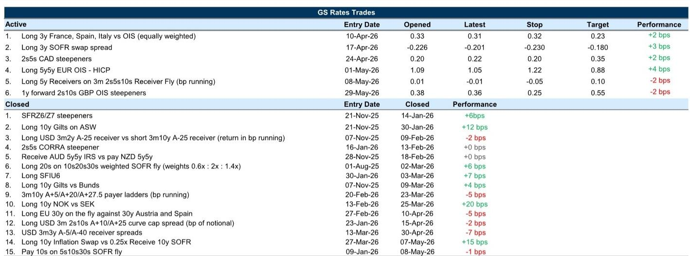
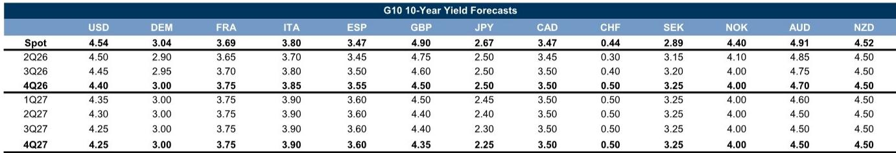
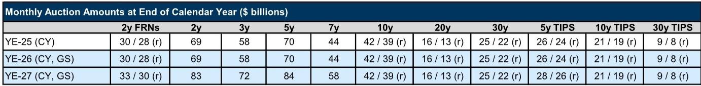

# 美国利率的真正拐点，取决于一个被忽视的变量

这份研报的核心判断值得每一个关注全球资产定价的人仔细琢磨：市场目前对美联储路径的定价，可能低估了一个结构性因素——利率的“新地板”已经抬升，而非短期波动的噪音。

五月非农就业报告的强劲表现，让美国国债收益率在近期找到了一个更高的底部。但这不仅仅是数据本身的问题。真正重要的不是“美联储会不会再加息一次”，而是整个利率分布的形态已经发生了变化。研报明确指出，尽管最终仍预期年底收益率低于当前水平，但近期内，前端的加息定价压力难以消散。

这意味着，投资者需要调整的，不是对某个具体利率水平的预测，而是对整个风险收益框架的重新认知。过去一年里，市场在“衰退交易”和“再通胀交易”之间剧烈摇摆，但这一轮周期可能正在进入一个新的阶段：增长韧性叠加通胀粘性，正在把利率的“地板”钉在一个更高的位置。

## 1. 市场低估的不是加息本身，而是加息定价的“不对称性”

研报中一个关键的洞察是，市场对美联储政策路径的定价，目前呈现出一个显著的不对称结构：加息的风险被前置，而降息的空间被压缩。五月就业报告发布后，前端利率的重新定价并非均匀分布，而是朝着一个方向倾斜。

这种不对称性，并非来自市场对美联储单次行动的预期，而是来自对“政策反应函数”本身的重新评估。当经济增长数据持续超预期，而通胀回落速度不及预期时，市场会自然而然地认为，美联储维持高利率的时间会更长，甚至不排除在某个时点再次加息的可能性。研报中提到的“长期暂停”而非“加息周期”的判断，恰恰是这种不对称定价的核心体现。

对于投资者而言，这意味着不能简单地用“加息见顶”的思维来布局。更务实的做法是，承认前端利率在短期内可能维持在一个相对较高的水平，并且任何向下的修正都需要来自数据层面的明确验证。研报中提到的“需要一定数量的数据验证”这一表述，恰恰点明了当前市场定价的脆弱性所在——它依赖于后续数据的配合。

## 2. 1y1y利率的“领跑”角色：一个被忽略的曲线信号

在整份研报中，对1y1y远期利率的分析，可能是最具交易价值的部分。这个期限点自本轮冲突以来，已经成为美国远期曲线上波动最大的环节，累计重新定价幅度高达约110个基点，并且总是在涨跌中扮演领跑角色。

这个现象背后，反映的是市场对政策路径短期不确定性的集中定价。1y1y利率本质上代表了市场对未来一年内一年期利率的预期，它天然地对短期政策变动最为敏感。当市场对美联储下一步行动存在分歧时，这个点就会成为多空博弈的主战场。

研报提出了两个可能的修正路径：要么是通胀信号趋于温和，导致前端利率曲线（1y/1y1y）变平；要么是增长和就业市场更具韧性，使得加息风险的时间点进一步后移，从而导致1y1y/2y1y的曲线变陡。这两种路径对资产价格的含义截然不同。

对于固定收益投资者来说，这个信号意味着，曲线交易可能比方向性交易更具吸引力。在1y1y利率已经大幅波动之后，市场可能正在接近一个关键节点：是继续朝着更陡峭的方向发展，还是开始修正。研报倾向于认为，一段稳定期本身就可以为这个点带来压力缓解，但前提是市场看到足够多的数据来支撑这种稳定。

## 3. 英国国债的“高贝塔”属性：一个被低估的溢出效应

研报对英国国债的调整值得单独拿出来讲。在将美国10年期国债收益率预测上调至4.4%的同时，报告也将英国10年期国债的年末预测上调了10个基点至4.5%。这个调整的直接原因是英国国债近年来表现出的“更高贝塔”。

“更高贝塔”意味着，当全球利率上升时，英国国债的收益率上行幅度更大；而当全球利率下降时，其下行幅度也可能更大。这种特征并非来自英国特有的财政风险或政治风险，而是来自其更高的通胀敏感度和更长的久期结构。

研报中一个有趣的发现是，尽管市场对英国国债的叙事集中在政治和供给风险上，但近期英国国债在资产互换上的表现相对稳定。这暗示，当前英国国债的风险溢价更多是宏观驱动而非供给驱动。这意味着，如果全球利率环境出现变化，英国国债的波动性可能会比美国国债更大。

对于全球资产配置者来说，这个信号提醒我们，不能孤立地看待任何一个国家的利率。英国国债的“高贝塔”属性，意味着它可能成为全球利率重新定价的放大器。当美国利率的“地板”抬升时，英国国债的调整幅度可能会超出预期。

## 4. 欧洲央行的“一锤子买卖”：一个尚未被充分定价的尾部风险

研报对欧洲央行的分析，提出了一个值得警惕的尾部风险：市场可能低估了欧洲央行在7月再次加息的可能性。报告指出，7月加息定价与12月加息定价之间出现了一定程度的脱钩，这表明市场对欧洲央行的政策路径存在分歧。

如果欧洲央行在6月加息后，暗示7月可能继续行动，那么整个欧元区利率曲线的重新定价将远超当前市场的预期。相反，如果欧洲央行选择在6月加息后“按兵不动”，那么市场可能会迅速将注意力转向更远期的路径。

这个判断的关键在于，欧洲央行面临的是与美国截然不同的经济组合：更弱的经济增长叠加更粘性的通胀。这意味着，欧洲央行的政策选择空间可能比美联储更小。如果欧洲央行被迫在经济增长放缓的背景下继续加息，那么其对欧洲资产价格的冲击可能会比美国更为显著。

研报建议，相比于直接做多欧洲短期利率，做多终端利率（terminal rate）可能更具吸引力，因为经济增长信号正在减弱，而加息本身有助于锚定远期利率。这个策略的本质是，押注欧洲央行加息周期对长期利率的压制作用，而非短期利率的上行空间。

## 5. 报告尚未完全回答的关键问题：日本央行的“反应函数”会改变吗？

在整份研报中，日本央行的部分可能是最耐人寻味的。尽管日本央行行长植田和男释放了更加鹰派的信号，市场对6月加息的概率定价也大幅上升，但研报发现，曲线在最初变平后又重新变陡，这与典型的鹰派信号导致的“熊市变平”模式并不一致。

这个现象的核心问题是：市场是否真的相信日本央行的“反应函数”已经发生了根本性转变？研报的结论是，目前可能还没有。尽管前端利率的变动方向是鹰派的，但更远端的利率和日元汇率的反应相对有限，这表明市场对日本央行政策框架的重新评估并不充分。

这是一个尚未被完全回答的关键问题。如果日本央行在未来某个时点明确表示愿意加快加息步伐或提高终端利率水平，那么对全球利率市场的影响将是深远的。日本作为全球最大的债权国，其利率的正常化将改变全球资本的流动格局。但目前，市场似乎仍倾向于认为日本央行的鹰派态度是战术性的，而非战略性的。

这个问题的答案，可能需要等到日本央行真正采取超出市场预期的行动时才能揭晓。在此之前，日本国债曲线的“便宜”可能主要集中在曲线的腹部，而非前端。

---

以上几点，只是这份研报中部分核心洞察的提炼。实际上，报告还深入讨论了加拿大央行面临的“两难困境”、欧洲通胀定价与宏观模型的偏离、以及货币基金资产规模增长对流动性条件的含义。这些内容在原文中都有详细的图表和数据支撑，但受限于篇幅，我们无法在此一一展开。

报告的完整版本还包含了大量未在本文中呈现的细节：例如，美国5y5y远期利率的公平价值评估、英国国债供给风险与宏观风险的区分模型、以及日本央行鹰派信号与曲线形态的历史对比。这些内容对于深入理解当前全球利率市场的结构性变化至关重要。

如果你对上述任何一个方向感兴趣，或者希望看到完整的图表和原始分析框架，欢迎来知识星球微信群里继续讨论。我们会在群内分享完整的研报解读和原始图表，并围绕这些未解问题展开更深入的交流。

Personal reading notes and learning share only. Not investment advice.

