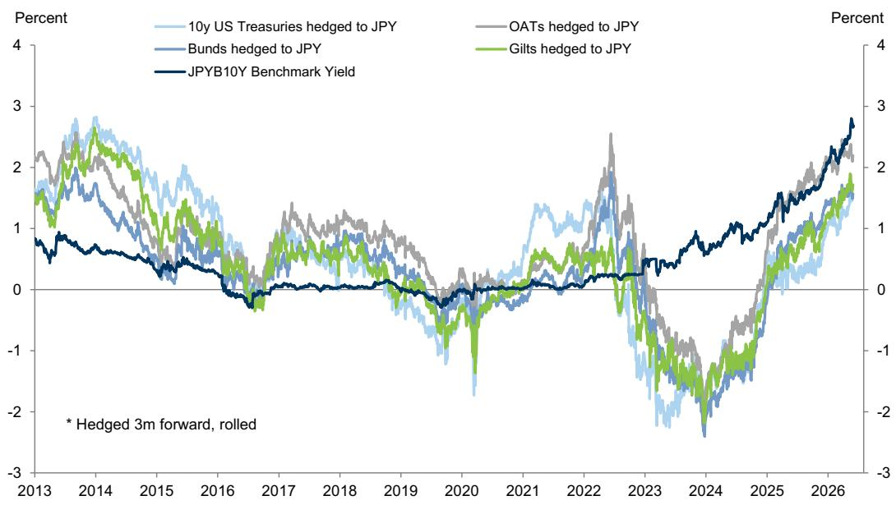
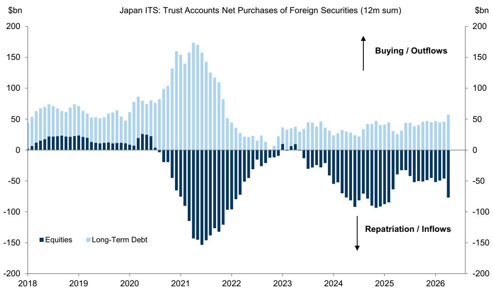
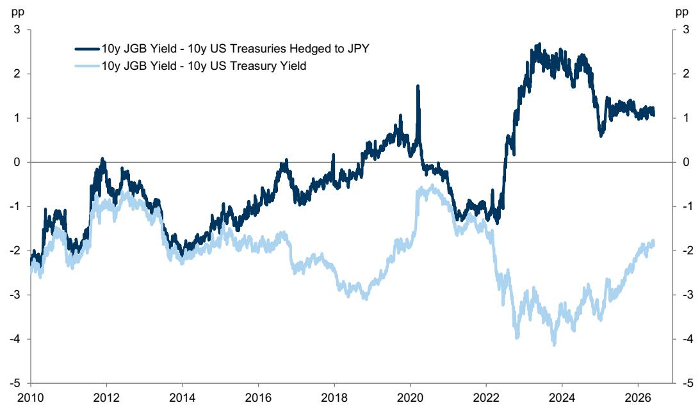

# 日元回流叙事被高估了：真正驱动汇率的不是日本邮政银行，而是GPIF的未对冲仓位

过去几周，日本邮政银行CEO一句“可能将日本国债持有量翻倍”的表态，迅速点燃了市场对日元大规模回流叙事的想象。10年期日债收益率处于数十年高位，日元汇率仍处于历史低位——这两个事实叠加在一起，看起来确实像是一个“资金回家”的完美剧本。

但某外资投行最新发布的研报给出了一个更冷静的判断：市场对日元回流规模与速度的预期，很可能被过度简化了。真正可能对日元汇率产生实质性影响的，并不是日本邮政银行这类对冲型投资者，而是以GPIF为代表的、持有近6万亿美元海外资产且大部分未对冲的日本机构投资者。而恰恰是后者，当前缺乏大规模回流的充分动机。

这份报告的核心价值不在于否定日元回流的可能性，而在于拆解了“谁在推动回流”以及“什么条件下回流才会真正发生”。它提供了一个区分信号与噪音的分析框架——这对于任何关注日元资产定价、全球利率传导或日本资本流动的决策者而言，都是必要的前提工作。

## 1. 日本邮政银行的表态更多是利率市场信号，而非汇率市场信号

日本邮政银行持有约5500亿美元的海外资产，主要是债券，是日本除财务省外最大的单一外债持有者。当它的CEO公开表示可能增持日债时，市场本能地将其解读为日元利好。

但这份研报指出一个关键区别：日本邮政银行是一个高度对冲的投资者。它的投资决策主要取决于“对冲后的海外收益率”与“日债收益率”之间的比较，而非简单的名义收益率高低。数据显示，尽管10年期日债收益率已升至3%以上，但同期全球主要国债收益率也在同步上升，导致日债的相对吸引力并未显著改善。

这意味着，即便日本邮政银行真的增加日债持仓，它对日元汇率的直接影响也相当有限——因为对冲操作已经锁定了汇率风险。真正需要关注的，是它是否在减少海外资产持有、并将资金真正汇回日本。如果是单纯调整日元资产组合，那对利率市场的影响远大于对汇率市场的影响。

报告提供了一个实用的跟踪框架：如果日本邮政银行真的在推动实质性回流，最早会在“国际证券交易”数据中的“银行”分项中显现为海外资产购买减少或卖出；随后，在更滞后的“资金循环统计”数据中，如果“面向中小企业的金融机构”同步出现海外证券卖出和日债买入，才能更确信地将这一流动归因于日本邮政银行。目前，这两个信号都尚未得到确认。

## 2. GPIF才是真正能撼动日元的关键玩家，但它当前缺乏回流动机

如果日本邮政银行对汇率的影响被高估，那么谁才是真正的变量？答案是GPIF——日本政府养老金投资基金。

GPIF持有近1万亿美元的海外资产，且大部分未对冲。更重要的是，日本的私人养老金在资产配置上往往会跟随GPIF的决策，这意味着GPIF的调整可能引发连锁反应。它的策略评估每五年进行一次，上一次发生在2025年，这意味着重大战略调整在2030年之前不太可能发生。

但GPIF可以在目标配置区间内进行灵活调整。报告测算了一个理论情景：如果GPIF将海外债券持有比例降至目标区间的下限（20%），并将释放的资金转入日债（使日债比例升至30%），总规模可达约870亿美元。这个数字听起来可观，但需要指出的是，这样的调整不可能一蹴而就，而且当前的经济条件并不支持这一方向。

关键问题在于GPIF的回报目标。GPIF追求的是名义工资增长率加1.9%的回报，这意味着它作为未对冲投资者，最关心的是不同资产之间的利率差。尽管过去一年日债收益率上升幅度超过美债，但利差仍然为负。在利率差没有显著改善的情况下，GPIF大规模转向国内债券的动机并不强。

报告明确表示：对于任何协调性的、未对冲的日债回流，现在的吸引力甚至低于今年早些时候——当时美联储降息的前景还没有像现在这样充满不确定性。

## 3. 市场低估了一个关键变量：利差方向比利差水平更重要

当前市场讨论日元回流时，往往聚焦于“日债收益率已经很高了”这个静态事实。但报告揭示了一个更微妙的动态：真正驱动未对冲投资者决策的，不是利率的绝对水平，而是利差的变化方向和预期。

对于未对冲的日本投资者而言，投资海外资产的实际回报取决于两个变量：海外资产本身的收益率，以及未来日元兑外币的汇率变动。当美日利差仍然为负时，即便日债收益率处于历史高位，持有日债的相对吸引力也未必优于持有美债——尤其是如果市场预期日元可能继续走弱。

这就是为什么报告认为“现在比年初更不具吸引力”。年初时，市场对美联储降息的预期较强，这意味着美债收益率可能下行、美元可能走弱，从而增强了日元回流的逻辑。但随着通胀数据反复、美联储降息预期推迟，这一逻辑的基础正在被削弱。

对于决策者而言，这意味着判断日元回流时机时，不能只看日债收益率本身，而需要同时跟踪美联储的政策路径、全球利率曲线的变动，以及这些因素如何影响未对冲投资者的“有效利差”。

## 4. 报告尚未完全回答的关键问题：政策干预的可能性与二阶效应

这份报告提供了一个扎实的分析框架，但有两个关键问题并未完全展开——而这恰恰可能是未来市场波动的来源。

第一个问题是：日本政府或财务省是否会主动推动GPIF调整配置？报告提到GPIF的调整可以“在行政指导下”发生。如果日本政府认为日元过度贬值已经损害了经济，它是否可能通过行政手段引导GPIF减少海外资产、增持国内资产？这种政策驱动的回流与市场驱动的回流，在速度和规模上可能有本质区别。报告对此着墨不多，但这可能是一个需要持续跟踪的政策变量。

第二个问题是：如果GPIF真的开始调整，其二阶效应对全球资产定价意味着什么？GPIF作为全球最大的机构投资者之一，其资产配置变化不仅影响日元汇率，还会通过资金流动影响美债、欧债乃至全球股票市场的定价。报告指出了调整的可能性，但没有深入探讨这种调整对全球利率和风险溢价的传导机制。

这两个问题目前都缺乏确定的答案，但它们恰恰是决定日元回流叙事能否从“市场讨论”升级为“实际交易主题”的关键。

## 5. 一个更务实的观察框架：区分对冲与未对冲，跟踪数据信号而非市场叙事

综合报告的框架，对于关注日元和日本资产价格的读者，可以建立一个更清晰的观察体系：

第一，区分投资者类型。对冲型投资者（如日本邮政银行）的配置调整，主要影响日本利率市场，对汇率的影响有限。未对冲型投资者（如GPIF和私人养老金）的调整，才是汇率变动的真正驱动力。

第二，关注利差变化的方向而非水平。对于未对冲投资者而言，美日利差的收窄预期比利差本身的宽度更重要。这意味着需要同时跟踪美联储和日本央行的政策路径，以及市场对这两条路径的重新定价。

第三，使用正确的数据信号。报告提供了一个分步验证框架：第一步看“国际证券交易”数据中的银行分项是否出现持续的外资卖出；第二步看“资金循环统计”数据中相关机构是否同步出现海外资产减持和日债增持。在这两个信号同时确认之前，任何关于“大规模回流已经开始”的说法都缺乏实证支撑。

第四，保持对政策变量的敏感度。如果日元继续贬值至日本政府和央行认为需要干预的水平，政策引导下的配置调整可能绕过市场逻辑，成为一个独立的风险因素。

## 欢迎来星球微信群里继续讨论

这份研报的核心价值，不在于给出一个“回流会/不会发生”的二元判断，而在于提供了一个拆解问题的分析框架。真正值得讨论的问题不是“日元会不会升值”，而是“在什么条件下、由谁驱动、以多大规模、通过什么渠道——日元回流才会真正改变资产定价”。

关于政策干预的可能性、GPIF配置调整的二阶效应、以及如何将这一框架应用到实际的资产配置决策中，这些话题在一篇文章中很难穷尽。欢迎加入我们的知识星球微信群，与更多关注全球宏观与资产配置的读者一起，持续跟踪这些未解问题的演变。

Personal reading notes and learning share only. Not investment advice.

