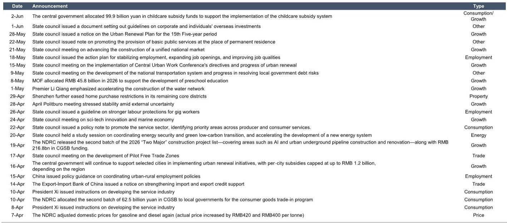
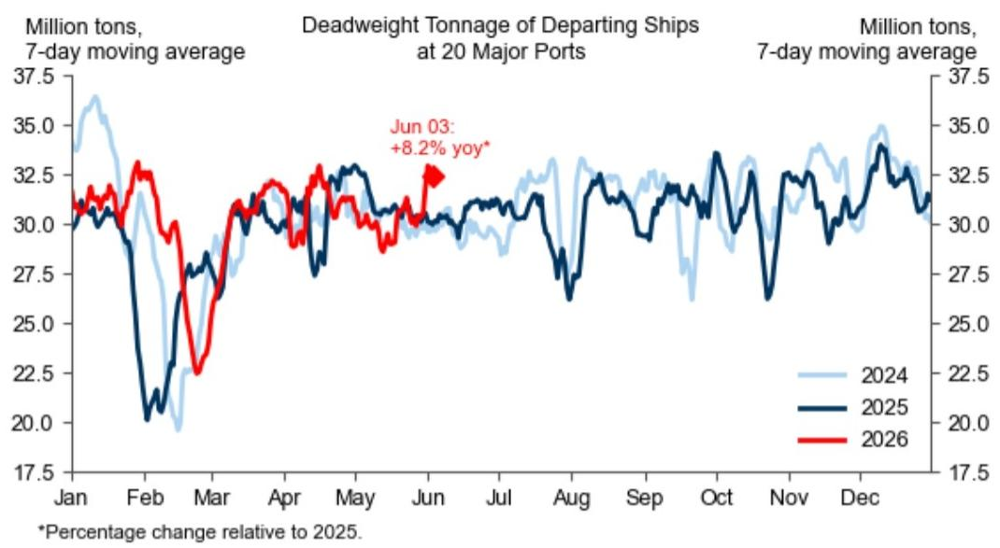
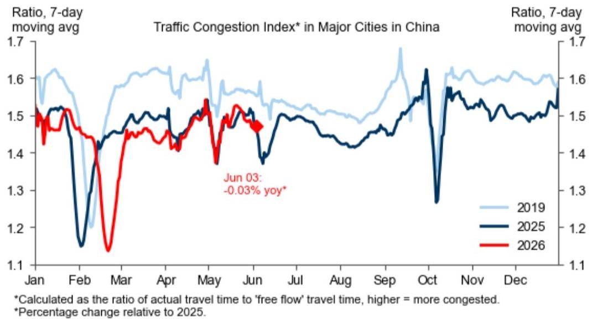

# China’s Economic Signals Are Contradicting Themselves — And That Is the Real Story

The latest high-frequency data from China paints a picture that is neither a clear recovery nor a definitive slowdown. It is something more nuanced and, for strategists, more important: a regime of selective acceleration and persistent fragility. Consumption indicators show tentative strength in property transactions and consumer confidence, yet mobility data and flight cancellations point to a population that remains cautious. Production indicators reveal coal consumption rising above year-ago levels, while steel demand and output edge down. The export sector shows robust port throughput, yet domestic freight volumes are mixed. This is not a uniform economy. It is a bifurcated one, where policy stimulus, structural drags, and external demand are pulling in different directions simultaneously.

The critical question for investors is not whether China is growing or slowing. It is which signals to trust and which to treat as noise. The answer has direct implications for asset allocation, sector rotation, and risk management in the second half of the year. The data from the latest weekly tracker, updated to early June, provides the raw material for this strategic judgment. But the raw data alone is insufficient. What matters is the interpretive framework.

This article argues that the most informative signal in the current data is not the level of any single indicator, but the divergence between indicators that should, in a normal cycle, move together. The widening gap between consumer confidence and actual mobility, between export strength and domestic industrial demand, and between fiscal issuance and credit creation tells a story of an economy where policy is working in some channels but failing in others. Understanding which divergence is temporary and which is structural is the key to positioning.

## The Consumer Confidence Recovery Is Real, but It Is Not Yet Translating into Action

The most striking positive signal in the recent data is the Morning Consult consumer confidence index, which has edged up to a multi-year high. This is not a trivial development. Consumer sentiment has been a persistent weak point in China’s post-pandemic recovery, and a sustained improvement would be a necessary condition for a durable domestic demand revival. The tracker shows that confidence has now surpassed levels seen in mid-2024 and is approaching the highs of early 2023.

Yet the behavioral data tells a different story. Domestic passenger flights have declined and remain below year-ago levels. Flight cancellation rates have increased over the last week. Traffic congestion has edged down. These are not the actions of a confident consumer base. People may feel better about their economic prospects in surveys, but they are not yet translating that sentiment into travel, dining out, or commuting patterns that would signal a genuine normalization of activity.

This divergence matters because it suggests that the improvement in confidence is fragile and potentially concentrated among higher-income or asset-owning households. The property market data offers a clue. Primary market transaction volumes in 30 cities were roughly flat over the last week but remained above year-ago levels. Secondary market volumes declined but also stayed above last year. This suggests that the property stimulus measures are having some effect, but the recovery is not broad-based. It is likely driven by Tier 1 and select Tier 2 cities, where policy support has been most aggressive and where household balance sheets are stronger.

The implication is that consumer confidence may be a leading indicator for high-end consumption and asset purchases, but it is not yet a reliable predictor of mass-market spending or mobility. For investors, this means that consumer discretionary sectors exposed to premium segments may benefit, while those dependent on volume-driven mass consumption could continue to disappoint. The risk is that if confidence does not broaden out, the current improvement could plateau or reverse.

## Industrial Production Is Splitting into Export-Led and Domestic-Led Segments

The production data reveals a similar bifurcation. Coal consumption in coastal provinces has increased further over the last week and remains above year-ago levels. This is a positive signal for industrial activity, particularly in energy-intensive manufacturing and power generation. It suggests that the export-oriented industrial base is running at a healthy clip.

But steel demand and production have both edged down. Steel is a bellwether for domestic construction and infrastructure activity. Its weakness indicates that the property sector recovery, while visible in transaction volumes, has not yet translated into new construction starts. The infrastructure push, while supported by local government special bond issuance, may be facing implementation bottlenecks or fiscal constraints at the local level.

The divergence between energy consumption and steel demand is telling. It implies that the industrial engine is running on two different fuels. Export-oriented manufacturing, supported by global demand and China’s competitive pricing, is consuming energy and producing goods for overseas markets. Domestic construction, which would consume steel and drive broader industrial demand, remains sluggish.

This has a clear strategic implication. Investors should differentiate between sectors that are leveraged to global trade and those that depend on domestic fixed asset investment. The former may continue to perform well, especially if global demand remains resilient. The latter will require a more aggressive and sustained fiscal push to turn around. The data on local government special bond issuance shows that the pace of issuance has accelerated, but the cumulative amount remains modest relative to the scale of the property downturn. The question is whether the issuance will be sufficient to lift domestic demand in the second half of the year.

## The Export Surge Is Real, but It Carries Hidden Risks for Domestic Supply Chains

Port container throughput and freight volumes at major ports have risen over the last week and remain above year-ago levels. This is consistent with the narrative of a strong export sector. China’s exporters have been a bright spot, benefiting from global demand for manufactured goods and from price competitiveness.

But there is a second-order implication that deserves attention. The strength of exports is not an unalloyed positive for the domestic economy. When export demand is strong, it absorbs production capacity that might otherwise serve the domestic market. It also pulls up input costs for domestic-oriented producers who compete for the same raw materials and energy.

The data on chemical prices is instructive. Sulfuric acid prices have edged up, while other exposed chemicals have stabilized. This suggests that some industrial input costs are beginning to rise, potentially squeezing margins for domestic manufacturers that cannot pass on higher costs to consumers. If export demand remains strong while domestic demand is weak, China could experience a form of cost-push pressure that hurts domestic profitability without triggering broad inflation.

For investors, this means that the export story is not a simple buy signal for all industrial sectors. Companies with pricing power and exposure to global markets may benefit. But domestic-oriented manufacturers with high input costs and weak demand face a margin squeeze. The risk is that the export boom masks underlying weakness in the domestic industrial ecosystem, and that any slowdown in global demand would expose that fragility quickly.

## The Credit Data Raises Questions about the Transmission Mechanism of Policy

One of the most important but underappreciated signals in the tracker is the contraction in Pledged Supplementary Lending (PSL) loans outstanding in May. PSL has been a key tool for funding urban renewal and affordable housing projects. Its contraction suggests that the policy stimulus channel through policy banks is not expanding, and may even be shrinking.

This is happening at a time when local government special bond issuance is ramping up. The implication is that the composition of fiscal stimulus is shifting. More funds are being raised, but they may be going to different types of projects. If PSL is contracting while bond issuance is rising, the net effect on credit creation and on the property sector could be less than the headline numbers suggest.

The employment data adds another layer of concern. The weighted PMI employment sub-index edged up in May, which is a positive signal. But the level remains weak, and the three-month moving average is still negative. This suggests that the labor market is improving from a low base, but not yet growing. Without a sustained improvement in employment, the consumer confidence recovery will remain fragile.

The strategic question for investors is whether the current policy mix is sufficient to generate a self-sustaining recovery. The data suggests that the answer is not yet clear. Fiscal issuance is rising, but credit creation through policy bank channels is contracting. Consumer confidence is improving, but actual mobility and spending are not. Export demand is strong, but domestic industrial demand is weak. The policy transmission mechanism appears to be working in some channels but not others.

## A Decision Framework for Interpreting the Next Phase

Given the conflicting signals, investors need a framework for deciding which indicators to prioritize. The following decision logic can help.

First, treat consumer confidence as a necessary but not sufficient condition for a consumption recovery. Monitor mobility data and flight cancellations as real-time confirmations. If confidence continues to rise but mobility does not follow within four to six weeks, the improvement in sentiment is likely concentrated and unsustainable.

Second, treat coal consumption as a proxy for export-oriented industrial activity and steel demand as a proxy for domestic construction. If coal consumption remains strong while steel demand weakens, the economy is becoming more reliant on external demand. This increases vulnerability to global trade shocks.

Third, treat the PSL data as a leading indicator for property sector stimulus. If PSL continues to contract, the property recovery is likely to be shallow and confined to select cities. If PSL stabilizes or expands, a broader recovery in construction and housing investment becomes more plausible.

Fourth, treat port throughput as a coincident indicator for export strength but as a lagging indicator for domestic demand. Strong port data does not imply strong domestic consumption. It may, in fact, signal that production capacity is being diverted away from domestic markets.

Finally, monitor the employment sub-index as the single most important lagging indicator. If employment improves meaningfully over the next two months, the consumer confidence recovery will have a foundation. If it does not, the divergence between sentiment and behavior will likely resolve through a decline in confidence.

## What the Report Does Not Yet Answer

The weekly tracker provides invaluable high-frequency data, but it leaves several critical questions open. It does not answer why consumer confidence is rising while mobility is not. It does not explain whether the improvement in confidence is broad-based or concentrated among higher-income households. It does not clarify whether the contraction in PSL reflects a deliberate policy shift or a temporary funding gap. And it does not resolve whether the strength in exports is masking a deterioration in domestic manufacturing margins.

These are not gaps in the data. They are analytical questions that require interpretation beyond what any single tracker can provide. The data gives us the symptoms. The diagnosis requires a deeper understanding of policy intent, household behavior, and global demand dynamics. For serious investors, the weekly tracker is a starting point, not an endpoint. The real work is in connecting these dots across time and across sectors.

Join the community to read the full report and review the original charts.

*This article is for learning and discussion only and does not constitute investment advice.*

Personal reading notes and learning share only. Not investment advice.

