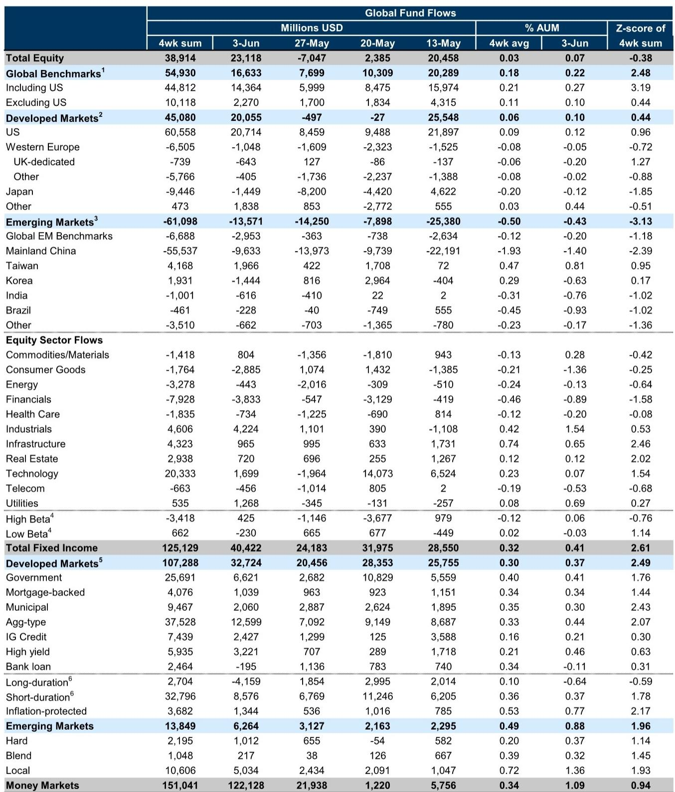
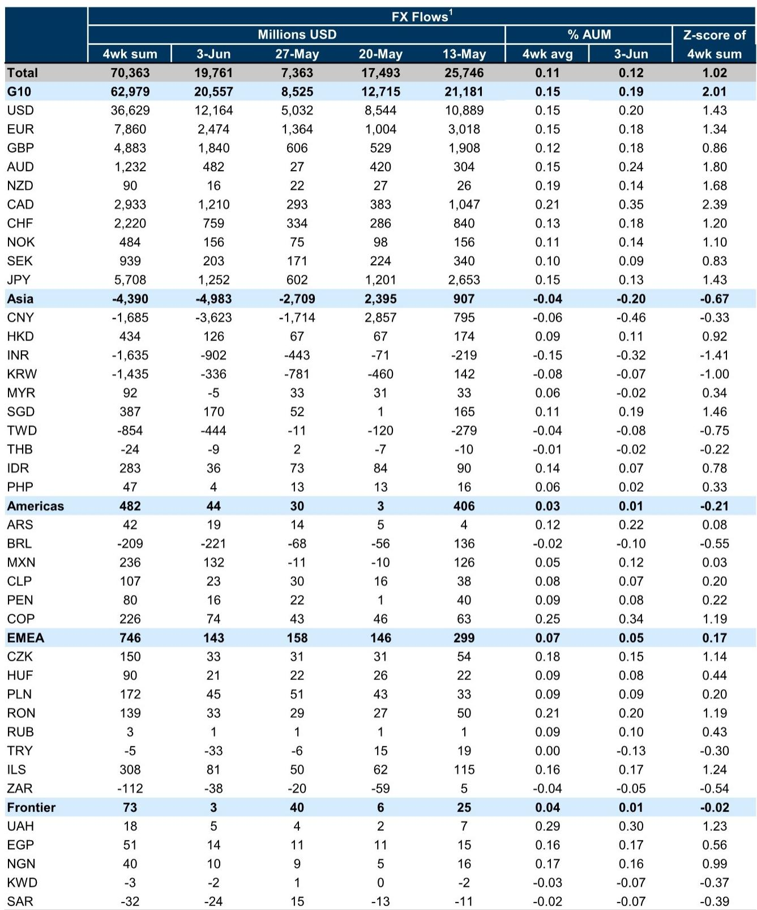
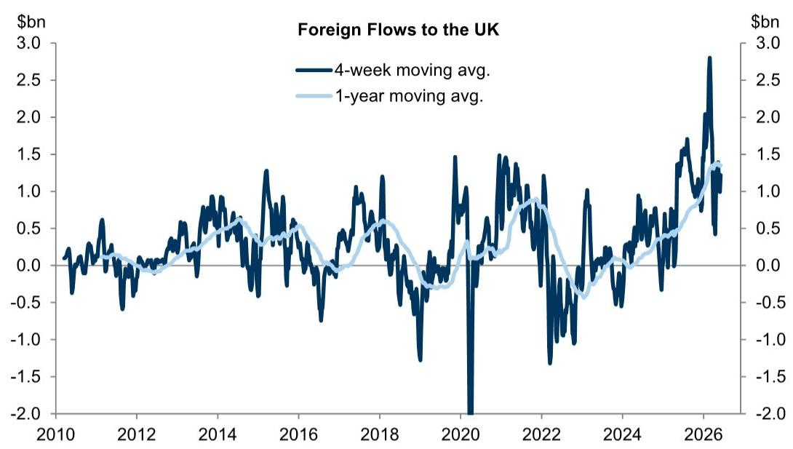

# Global Equity Inflows Are Hiding a Dangerous Divergence: Capital Is Concentrating in the US While Rotating Out of China and Into Korean Industrials

The week ending June 3 delivered a seemingly straightforward signal: global equity funds attracted $23 billion in net inflows, reversing the prior week's $7 billion outflow. Fixed income inflows remained robust at $40 billion, and money market funds swelled by another $122 billion. On the surface, this looks like a broad-based risk-on move. But the composition tells a far more unsettling story.

The headline inflow masks a three-way divergence that should concern any global allocator. US equity funds absorbed the vast majority of capital, while developed market ex-US funds experienced net outflows. Within emerging markets, the pattern was even more extreme: Taiwan and Korea attracted capital, while Mainland China and broader EM benchmark funds bled. This is not a uniform reflation trade. It is a selective, almost surgical, reallocation that reflects deep shifts in how institutional investors are pricing geopolitical risk, sector leadership, and the end of the liquidity super-cycle.

The data forces a strategic question: are we witnessing the beginning of a structural rotation away from China and toward a new axis of industrial growth centered on Korea and Taiwan, or is this a tactical squeeze that will reverse when US exceptionalism fades? The flows suggest the former, but the conviction behind them is thinner than the headline numbers imply.

## The US Magnetic Pull Is Not About Growth Anymore; It Is About the Absence of Viable Alternatives

US equity funds have now sustained positive inflows for multiple consecutive weeks, and the cumulative effect is visible across every time horizon. The four-week moving average of net flows into US-dedicated funds has climbed steadily, even as other developed markets saw net redemptions. This is not a new phenomenon, but its persistence in the face of elevated valuations and political uncertainty demands explanation.

The conventional narrative ties US inflows to AI-driven earnings momentum and the resilience of the technology sector. Yet the sector-level flow data complicates that story. Technology sector funds have seen positive but relatively modest cumulative inflows year-to-date, at roughly 3% of AUM. The real action is elsewhere. Industrials sector funds have absorbed 24% of AUM year-to-date, infrastructure 17%, and energy 15%. Even commodities and materials funds have drawn 11%.

What this suggests is that the US inflows are not a bet on the Magnificent Seven or on AI hype. They are a bet on the physical economy: onshoring, defense spending, energy infrastructure, and industrial policy. The US is attracting capital not because its tech sector is unstoppable, but because it is the only large developed market where the government is actively underwriting industrial investment through the CHIPS Act, the Inflation Reduction Act, and defense appropriations. Europe has no equivalent fiscal program. Japan has corporate governance reform but not a comparable fiscal impulse. The UK is dealing with political instability and fiscal constraints.

The implication is uncomfortable: US inflows are a default allocation, not an enthusiastic one. If European or Asian policymakers were to deliver a credible fiscal stimulus or if US growth were to falter, these flows could reverse rapidly. The concentration of inflows in industrials and infrastructure suggests that investors are positioning for a multiyear capex cycle, but they are also crowding into a narrow set of themes that could become overcrowded.

## The China Exodus Is Real and Has Not Yet Bottomed

The most striking pattern in the regional flow data is the persistent and accelerating outflow from Mainland China equity funds. Year-to-date cumulative flows into Mainland China-dedicated funds stand at negative 23% of AUM, the worst of any major region. Even India, which has seen negative flows of 6%, looks benign by comparison. The contrast with Taiwan and Korea, which have seen cumulative inflows of 13% and 37% respectively, could not be sharper.

This divergence is not new, but its magnitude is widening. The chart showing flows into Mainland China equity funds from both domestic and international sources reveals a critical detail: the outflows are overwhelmingly driven by international capital. Domestic Chinese investors have been net buyers, particularly during the policy-driven rallies of late 2024 and early 2025. But foreign investors have been steadily reducing exposure, and the pace of outflows has accelerated in recent months.

The conventional explanation points to geopolitical tensions, regulatory uncertainty, and the property sector crisis. But those factors have been in place for years. What has changed is the availability of alternatives. Korean and Taiwanese equities now offer exposure to the same global semiconductor and industrial supply chains that investors previously accessed through Chinese markets. The Korea discount is narrowing as corporate governance reforms take hold, and Taiwan's dominance in advanced chip manufacturing gives it pricing power that Chinese semiconductor firms cannot match.

The strategic question is whether this is a permanent reallocation or a cyclical one. If the thesis is that China's growth model is structurally impaired, then the outflows should continue. But if the thesis is simply that China is out of favor tactically, then current valuations could present a contrarian opportunity. The data does not resolve this question, but it does suggest that the burden of proof has shifted. China now needs to demonstrate not just policy support but a credible growth narrative before international capital returns.

## The Korea and Taiwan Surge Is a Bet on Industrial Supply Chains, Not on Tech Exuberance

Korea has been the standout performer in regional equity flows, with cumulative year-to-date inflows of 37% of AUM. Taiwan is not far behind at 13%. But the sector composition of these flows matters enormously. The cumulative global equity flows by sector show that industrials and infrastructure are the dominant recipients, not technology.

This is a crucial insight. The conventional narrative frames Korea and Taiwan as tech plays, tied to the semiconductor cycle. But the flow data suggests that investors are buying these markets for their industrial and manufacturing capabilities, not just their chip exposure. Korea's shipbuilding, defense, and battery supply chains are attracting capital. Taiwan's advanced manufacturing and automation capabilities are being valued as strategic assets, not just as cyclical plays on memory chips or foundry utilization.

The chart showing cumulative global equity flows by sector year-to-date reinforces this interpretation. Industrials have absorbed 24% of AUM, infrastructure 17%, and energy 15%. Technology is at just 3%. The rotation is toward physical assets, tangible production capacity, and supply chain resilience. This is consistent with the US industrial inflow story, but it also suggests that investors are looking beyond the US for exposure to these themes.

The risk is that this trade becomes crowded and overvalued. Korean equities have already rerated significantly. The Korea discount has narrowed, but if corporate governance reforms fail to deliver tangible improvements in shareholder returns, the inflows could reverse. Taiwan faces the structural risk of geopolitical escalation, which no amount of industrial strength can fully hedge. The flows are rational, but they are also vulnerable to a shift in sentiment.

## Fixed Income Flows Confirm the Search for Yield Has Become a Search for Safety at the Short End

Fixed income flows were overwhelmingly positive, with $40 billion in net inflows for the week and a four-week sum of $125 billion. But the composition reveals a defensive posture. Short-duration bond funds and inflation-protected bond funds have seen sustained inflows, while long-duration funds have experienced net outflows. Money market fund assets rose by $122 billion in a single week.

This pattern is consistent with an investor base that is seeking yield but is unwilling to take duration risk. The preference for short-duration instruments suggests that the market does not believe the current level of long-term rates is sustainable, or that inflation will remain sticky enough to erode real returns on long-dated bonds. The continued inflows into inflation-protected bonds reinforce this interpretation.

The implication for equity investors is that the fixed income market is not signaling a soft landing. It is signaling uncertainty about the path of rates and inflation. If the bond market is correct, then the equity inflows into industrials and infrastructure could be premature, as those sectors are sensitive to both interest rates and the cost of capital. If the bond market is wrong, then the equity rotation into cyclicals could have more room to run.

The cross-border FX flow data adds another dimension. The US dollar saw the strongest net demand, while the Chinese renminbi saw the largest net outflows. This is consistent with the equity flow pattern: capital is flowing into the US and out of China. The resilience of GBP flows is noteworthy, given the domestic political risks, and is attributed to larger-than-usual cross-border M&A inflows into the UK. This suggests that the UK is attracting strategic corporate investment even as portfolio flows remain tepid.

## What the Report Does Not Fully Answer: Is This a Secular Shift or a Liquidity-Driven Squeeze?

The data presents a compelling narrative, but it leaves several critical questions unresolved. First, the flows are measured in absolute dollar terms and as a percentage of AUM, but they do not distinguish between active and passive flows. If the inflows are overwhelmingly passive, then they reflect asset allocation decisions made months ago, not active conviction. The report does not break down flows by active versus passive vehicles, which means we cannot determine whether the Korea and Taiwan inflows represent active stock-picking or ETF-driven momentum.

Second, the sector flow data captures dedicated sector funds, but it does not capture the sector exposure of broad equity funds. A large portion of the inflows into US funds could be going into technology stocks through broad market indices, even as dedicated technology funds see modest flows. The report's sector data may understate the true technology exposure of the aggregate equity inflow.

Third, the report does not address the role of corporate buybacks and share issuance. In a market where companies are net buyers of their own stock, fund flows can overstate or understate the true demand for equities. If US corporations are buying back shares at a record pace while foreign investors are selling, the net demand picture could be very different from what the fund flow data suggests.

These gaps are not criticisms of the report. They are the natural limitations of any flow-based analysis. But they mean that the conclusions drawn from the data should be treated as hypotheses, not certainties. The burden is on the investor to triangulate the flow data with other signals: corporate behavior, valuation metrics, and macroeconomic conditions.

## A Decision Framework for Allocators: Four Questions to Ask Before Acting on These Flows

For institutional allocators, the flow data is useful only if it informs a concrete decision. Based on the patterns in this report, here is a framework for evaluating whether to follow or fade the current flow trends.

First, ask whether the US industrial and infrastructure inflow is sustainable. The answer depends on fiscal policy. If the US government continues to fund the CHIPS Act, the IRA, and defense procurement, then the industrial capex cycle has years of runway. If fiscal discipline forces cuts, the inflows could reverse. The risk is that investors are pricing in a multiyear capex cycle that is only partially funded.

Second, ask whether the Korea and Taiwan rotation is still early or already late. The cumulative flows into Korea are 37% of AUM year-to-date. That is a large move in a short period. The question is whether valuation has caught up to the fundamental story. Korean equities have rerated, but if earnings follow, the inflows could continue. If earnings disappoint, the flows could reverse sharply.

Third, ask whether the China outflows are creating an opportunity. The data shows that international investors are selling Chinese equities at an accelerating pace. But domestic investors are buying. This suggests that the selloff is driven by sentiment and geopolitics, not by fundamentals. For contrarian allocators with a long time horizon, the current valuation gap between China and the rest of EM could be attractive. But the timing risk is substantial.

Fourth, ask whether the fixed income signal is a warning or a confirmation. The preference for short-duration and inflation-protected bonds suggests that the bond market is skeptical of the equity optimism. If the bond market is right, then the equity inflows into cyclicals are a mistake. If the equity market is right, then the bond market is too defensive. Resolving this tension is the key to positioning for the next six months.

## The Full Report Contains the Charts That Make These Patterns Visible

The data discussed here is drawn from a detailed weekly fund flow report that includes charts on cumulative flows by region, sector, and time horizon. These charts reveal the trajectory of the Korea and Taiwan rotation, the depth of the China outflows, and the concentration of US inflows in industrial sectors. They also show the evolution of cross-border FX flows and the divergence between domestic and international investor behavior in China.

To see the original charts and to access the full dataset, including the weekly and four-week moving averages that underpin this analysis, join the community. The complete report includes the visual evidence that makes these patterns unmistakable.

*This article is for learning and discussion only and does not constitute investment advice.*

Personal reading notes and learning share only. Not investment advice.

