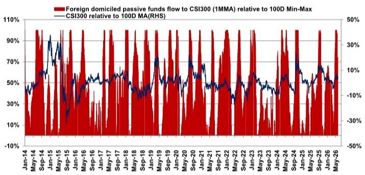
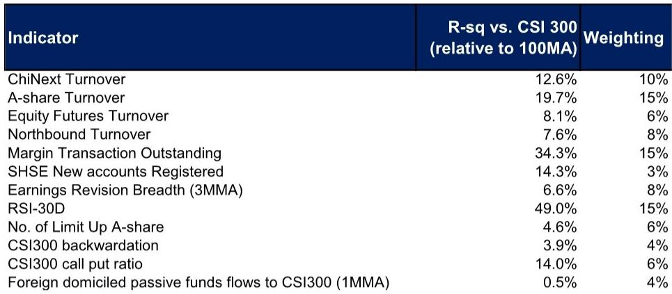

# The K-Shape Is Not a Pause: Why A-Share Sentiment Softening Signals a Strategic Entry, Not an Exit

China’s A-share market is entering a phase that looks like weakness but functions as a filter. The weighted MSASI, a composite sentiment gauge, declined by 4 percentage points to 62% in the latest reading, while trading volumes on ChiNext and the broader A-share market contracted by 9% and 6% respectively. On the surface, this appears to confirm a market losing conviction. But the data tells a more strategic story: what is happening is not a broad retreat, but a differentiation of quality within a K-shaped macro environment that is becoming the defining structural feature of Chinese equities.

The persistence of the K-shaped recovery—where high-end manufacturing and select technology segments outperform while consumption, energy-intensive industries, and infrastructure lag—means that aggregate sentiment indicators will remain noisy. The MSASI decline is not a signal to reduce exposure. It is a signal that the market is correctly repricing the dispersion between winners and losers. For investors who treat sentiment as a contrarian tool rather than a directional signal, the current softening is precisely the kind of environment that rewards selective conviction.

This is not the moment to ask whether Chinese equities are investable. It is the moment to ask which parts of the Chinese equity market are becoming mispriced relative to the structural forces at work. The answer, supported by the data on earnings revisions, factor rotation, and policy timing, points decisively toward A-shares over offshore markets, and toward upstream and hard-tech sectors over broad beta plays.

## Investor Sentiment Has Weakened, but the Composition of That Weakness Reveals a Market That Is Becoming More Discriminating

The 4-point drop in the weighted MSASI to 62% is meaningful, but its composition matters more than the headline number. The MSASI is constructed from 12 individual indicators, each capturing a distinct dimension of sentiment. The decline was led by turnover-related metrics: ChiNext turnover fell 9% and A-share turnover fell 6% relative to the prior cycle. These are volume-driven contractions, not price-driven ones. The 30-day RSI actually increased by 1% over the same period, and equity futures turnover and margin outstanding remained largely unchanged.

This divergence tells us that the market is not panicking. It is thinning out. Participants are withdrawing from the most speculative and least differentiated segments of the market—small-cap ChiNext names with weak earnings visibility—while maintaining positions in index futures and leveraged exposure. This is the behavior of a market that is consolidating, not collapsing. The fact that earnings estimate revision breadth stayed negative and unchanged versus last week reinforces the point: analysts are not cutting forecasts aggressively; they are holding steady, which in a K-shaped environment implies that the downgrades are concentrated in the lagging half of the economy while the leading half remains intact.

The strategic implication is clear. When sentiment softens but earnings revisions plateau, the market is pricing in a known macro weakness rather than discovering new downside. That creates a window for investors who can distinguish between cyclical noise and structural deterioration.

## The Macro Data Confirms the K-Shape, and the Policy Response Is Becoming More Predictable, Which Reduces Tail Risk

The May Manufacturing PMI slipped to 50%, exactly in line with expectations. This is not a surprise, and markets do not react to confirmed data; they react to the gap between data and expectations. The more important story lies beneath the headline. Consumption export orders weakened, energy-intensive production softened, but high-end manufacturing held up. This is the K-shape in real time: the economy is bifurcated along lines of technological sophistication and energy exposure.

Infrastructure, meanwhile, continues to lack policy traction. This is not a failure of will but a deliberate choice. The Chinese policymaker is not deploying broad-based stimulus. Instead, the fiscal rollout expected to re-accelerate from June is likely to be targeted, with precision infrastructure support aimed at preventing GDP from falling materially below 4.5%. This is a floor, not a launchpad. The market is beginning to understand that the policy framework has shifted from demand management to supply-side quality control.

For equity investors, this means that the macro environment will remain supportive for sectors that align with policy priorities—hard tech, advanced manufacturing, energy transition—while remaining indifferent or hostile to consumption and commodity-intensive industries. The K-shape is not a temporary condition. It is the new equilibrium. Portfolios must be constructed accordingly.

## The Preference for A-Shares over Offshore Is Not a Tactic; It Is a Structural Call on Where the Policy and Earnings Tailwinds Are Strongest

The report maintains an overweight on A-shares versus offshore markets, and this is one of the most important strategic signals for global allocators. The rationale is not sentimental. It is structural. A-shares offer higher exposure to upstream manufacturing, hard technology, and the IPO pipeline—three areas that are directly supported by the policy framework and the K-shaped macro dynamics.

Offshore markets, particularly Hong Kong and ADRs, are more exposed to consumption, property, and internet platforms. While internet platforms may benefit from easing price competition, that is a relative improvement within a challenged sector, not a structural tailwind. The offshore market also faces specific headwinds: the July Hong Kong IPO unlocking could introduce supply pressure, and the ongoing uncertainty around the Hormuz situation adds a geopolitical risk premium that is harder to hedge in offshore listings.

The National Team support for A-shares is another factor that cannot be ignored. This support is not about propping up the index; it is about providing a liquidity backstop during periods of sentiment weakness. In a market where the MSASI is declining, knowing that a large, patient, and policy-aligned buyer is present in the A-share market changes the risk-reward calculus. It does not eliminate downside, but it compresses the left tail. For long-only investors, that is a meaningful asymmetry.

## The Report Leaves an Unanswered Question about the Timing of Sentiment Recovery and Whether the MSASI Methodology Can Capture Regime Shifts in Real Time

The MSASI is a sophisticated tool, and its construction—using 12 indicators normalized by 100-day min-max scaling and weighted by R-squared against the CSI 300—is methodologically sound. But it has a limitation that the report does not fully address. The weighting scheme is backward-looking. It assigns greater weight to indicators that have historically correlated with the CSI 300, such as the 30-day RSI (R-squared of 49%) and margin outstanding (R-squared of 34.3%). This works well in stable regimes, but it may underweight indicators that become more important during structural transitions.

For example, foreign passive fund flows to the CSI 300 have an R-squared of only 0.5% and receive a 4% weight. In a regime where foreign allocation decisions become a primary driver of A-share returns—which is plausible given the global search for diversification and the index inclusion trend—the MSASI could understate the influence of external capital. Similarly, the CSI 300 call-put ratio has a high R-squared but is assigned a lower weight due to data availability constraints.

The question that the report leaves open is this: at what point does a sentiment indicator become structurally less relevant, and how should investors adapt when the regime is shifting but the methodology has not yet caught up? This is not a flaw in the MSASI; it is a reminder that all quantitative frameworks require qualitative judgment. The report implicitly acknowledges this by maintaining a constructive view despite the sentiment decline. The investor who relies solely on the MSASI without understanding its construction and limitations will be late to the turning point.

## The Decision Framework for Investors: Use Sentiment as a Timing Tool, Not a Thesis Driver, and Focus on the K-Shape Winners

The most actionable framework from this report is not the sentiment reading itself, but the decision logic that connects sentiment to positioning. Here is how to operationalize it.

First, treat the MSASI as a congestion indicator rather than a trend indicator. When the MSASI is declining but remains above 50%, the market is in a digestion phase, not a reversal. This is the time to add to positions in sectors that have structural support, not to reduce equity exposure. The 62% reading is still in the upper half of the historical range. It does not signal fear; it signals consolidation.

Second, use the K-shape as the primary sector allocation framework. The report favors upstream Materials, Industrials, and Energy, alongside Semis, with moderate exposure to Financials and yield plays. This is consistent with the macro narrative: high-end manufacturing and energy infrastructure are the beneficiaries of policy support and global demand for advanced inputs. Consumer and property-related sectors are likely to remain under pressure until the consumption export orders recover, which the macro data suggests is not imminent.

Third, favor A-shares for the tactical reasons outlined above, but also for a strategic reason that the report implies but does not fully state: the A-share market is more insulated from global liquidity shocks than offshore markets. In a world where the Fed cutting expectations are fading and the Hormuz situation adds to energy price uncertainty, a market that is primarily driven by domestic policy, domestic liquidity, and domestic sentiment offers a lower correlation to global risk factors. That is a diversification benefit that is particularly valuable in the current environment.

Finally, be patient with the timing. The report expects market dynamics to become clearer and smoother around or after the summer. This is consistent with the policy timeline: fiscal rollout from June, potential stabilization of the Hormuz situation, and the resolution of the July IPO unlocking. The next 4-6 weeks may remain volatile, but that volatility is the price of entry for a market that offers 10-12% upside over a 6-12 month horizon.

Join the community to read the full report and review the original charts.

*This article is for learning and discussion only and does not constitute investment advice.*

Personal reading notes and learning share only. Not investment advice.

