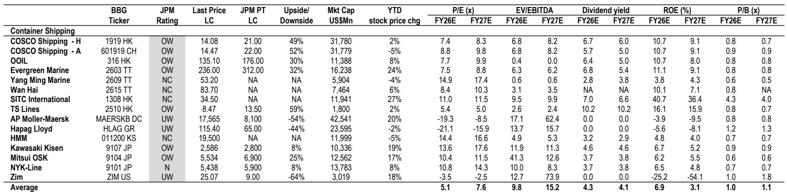
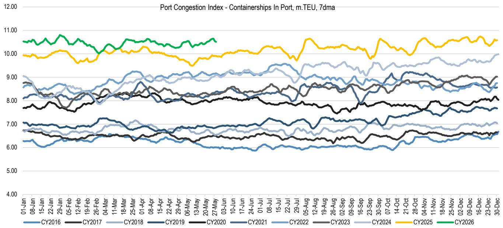
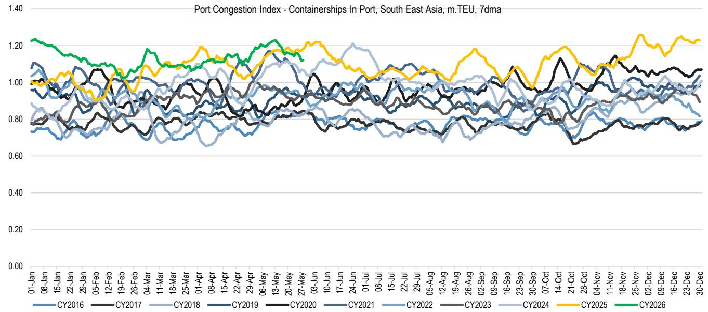

# 市场真正低估的不是需求，而是供给侧的再定价

过去两个月，全球集装箱航运业经历了一场被多数人误解的行情反弹。上海出口集装箱运价指数（SCFI）自3月以来飙升73%，跨太平洋和亚欧航线录得两位数周涨幅，船公司普遍征收紧急燃油附加费和旺季附加费。表面上看，这是地缘冲突和旺季前备货驱动的短期脉冲。但某外资投行最新发布的行业深度报告揭示了一个更结构性的判断：当前市场定价的核心驱动力，并非需求端的意外强劲，而是供给侧已经发生且不可逆的再定价。

这份报告基于对亚洲头部船公司1Q26运营数据的系统梳理，结合美国终端市场指标、运力管理动态和监管环境变化，勾勒出一幅“行业盈利能力正在经历结构性抬升”的图景。报告覆盖的标的包括TS Lines、中远海控、东方海外、长荣海运和商船三井等亚洲领先航运商，其核心逻辑值得每一位关注全球贸易和产业周期的决策者仔细推敲。

为什么说这不是又一个“旺季故事”？因为支撑当前运价水平的三个结构性因素——有效运力持续收紧、船公司成本传导能力增强、以及行业竞争格局的优化——都具有超越短期周期的持续性。而市场对此的定价，可能才刚刚开始。

## 1. 有效运力比名义运力紧张得多，且这一缺口短期内无法弥补

报告中最具洞察力的判断之一，是对“有效运力”与“名义运力”的区分。从全球集装箱船队总量看，运力似乎并不短缺。但港口拥堵、航线绕行（因中东冲突导致的红海绕行好望角）以及船公司主动的空白航行管理，正在吸收大量可用运力。Clarksons的港口拥堵指数在2026年1-5月创下历史新高，这意味着全球相当比例的集装箱船队实际上处于“等待”或“绕行”状态，而非有效运输货物。

这一结构性紧平衡解释了为什么在名义运力增长、需求并未爆发式扩张的背景下，运价却能持续上行。报告指出，当前的有效供给紧张程度远高于名义数据所反映的水平。对于船公司而言，这意味着即使需求增速放缓，运价的下行风险也相对可控，因为供给侧的约束构成了一个坚实的底部。

对行业竞争的启示是：拥有自有船队比例较高的运营商，在这一环境中获得了结构性优势。长荣海运的自有船队比例约为70%（远高于前十大船公司约57%的平均水平），TS Lines更是高达83%。在当前期租费率处于疫情后最高位的背景下（Clarksons期租费率指数报206点），自有船队比例高的公司天然免疫于租金成本上涨，其盈利能力的可持续性远优于依赖租赁运力的同行。

## 2. 成本传导能力是区分“好公司”与“普通公司”的关键分水岭

报告用大量篇幅分析了船公司应对成本上涨的能力，这恰恰是投资者最容易忽视的维度。中东冲突导致燃油价格大幅上涨（相关航线燃油价格自2月底以来上涨约75%），同时高低硫油价差扩大至每吨135美元以上，是去年同期的数倍。在这一背景下，船公司能否将成本压力有效传导给客户，直接决定了其盈利能力的稳定性。

报告揭示了一个被低估的结构性优势：亚洲船公司因配备脱硫塔（scrubber）的船舶比例远高于全球平均水平，在高低硫油价差扩大的环境中获得了额外的成本缓冲。长荣海运95%的运力配备脱硫塔，TS Lines为94%，中远海控/东方海外为58%，阳明海运为73%，而全球行业平均水平仅为47%。这意味着在同等运价水平下，这些公司的单位运营成本低于全球同行，盈利能力更具韧性。

更关键的是，船公司正在通过征收紧急燃油附加费、调整合同条款等方式，将成本压力系统性地转嫁给货主。报告提到，马士基在1Q26实现了超出预期的盈利，并维持了全年指引，这得益于其强大的成本传导能力和高船舶利用率。这标志着行业定价权的转移：船公司不再是被动接受运价的市场参与者，而是主动管理运价和成本传导的定价者。

## 3. 美国终端市场并非“衰退前夜”，而是“高成本韧性期”

对于全球航运需求最大的担忧，往往来自美国终端市场的走弱。但报告引用的物流经理人指数（LMI）显示，2026年5月该指数录得69.5，虽略低于4月的69.9，但仍是2022年初以来第二快的扩张速度。更值得关注的是分项数据：运输成本飙升至历史新高（96.0），仓储成本维持高位（70.7），而运输能力继续收缩（31.7）。这说明美国供应链正在经历“高成本、紧运力”的格局，而非需求崩溃。

报告还指出，美国下游库存增长已超过上游库存增长3.6个百分点，意味着制造业前期的补库行为正在向下游传导。这一信号的意义在于：即使终端消费增速放缓，供应链补库的惯性仍将在未来1-2个季度支撑货运需求。报告没有给出“美国经济软着陆”的判断，但提供的证据足以让投资者重新审视“航运需求即将断崖式下跌”的悲观叙事。

对于关注中国出口的读者而言，这一判断尤为重要。中国商务部的表态——中美双方就解决非关税壁垒达成积极共识——进一步强化了全球贸易前景的改善预期。如果中美贸易关系出现边际缓和，跨太平洋航线将直接受益，而这正是当前运价涨幅最大的区域之一。

## 4. 监管真空期的“窗口红利”可能被低估

报告提到，国际海事组织（IMO）关于净零排放框架的投票在2025年10月的特别会议后被推迟，最近结束的MEPC 84会议仍未达成最终决议，下一次特别会议定于2026年底举行。这意味着在2027年之前，全球航运业将处于一个“监管真空期”——没有新的强制性碳排放法规落地，船公司无需为碳排放支付额外成本或进行大规模资本开支。

这一窗口期对船公司盈利能力的正面影响是双重的。一方面，当前无需承担碳税或购买碳配额的成本，运营成本保持低位。另一方面，船公司可以利用这段时间加速对替代燃料船舶和节能技术（ESTs）的投资——目前62%的船队运力已配备节能技术，较2019年初的35%大幅提升——为未来的合规做好准备，同时享受当前低成本运营的红利。

对于投资者而言，这意味着行业利润率的改善可能比市场预期的更具持续性。一旦2027年后新的监管框架落地，碳成本将系统性抬升行业运营成本，届时拥有更高效、更环保船队的公司将获得显著的竞争优势。而当前那些在替代燃料和节能技术上投入不足的公司，未来将面临盈利压力。

## 5. 报告尚未完全回答的关键问题：运价能维持多久，以及谁在真正受益

尽管报告提供了大量支撑行业乐观前景的证据，但仍有几个关键问题悬而未决。首先，当前运价的高位能否持续进入2027年？报告强调了运力管理和港口拥堵的结构性支撑，但也承认了监管真空期的“窗口红利”具有时效性。一旦监管框架落地或地缘冲突缓和，运价中枢可能面临下行压力。

其次，不同船公司的受益程度差异巨大。报告明确指出了自有船队比例、脱硫塔配备率、航线布局等结构性差异，但并未对每家公司的盈利弹性进行量化测算。对于投资者而言，这意味着“买整个行业”的策略可能不如“精选标的”的策略有效。

第三，报告对需求端的判断依赖于美国终端市场的韧性，但LMI指数中的预期分项已经有所回落，受访者对未来12个月的物流状况持“略有克制”的态度。如果美国经济在2026年下半年出现超预期放缓，当前的需求支撑逻辑将面临挑战。

这些未解问题恰恰是深度研究最有价值的部分。对于希望构建完整投资框架的读者而言，报告的原始图表、盈利模型和敏感性分析，远比这篇文章中的文字摘要更具参考价值。这些内容在公开渠道难以获取，但在我们的社群中，每周都有分析师对这类报告的逐段拆解和讨论。

---

Personal reading notes and learning share only. Not investment advice.

