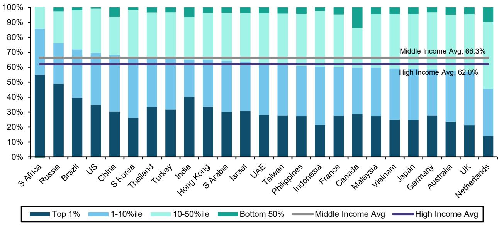
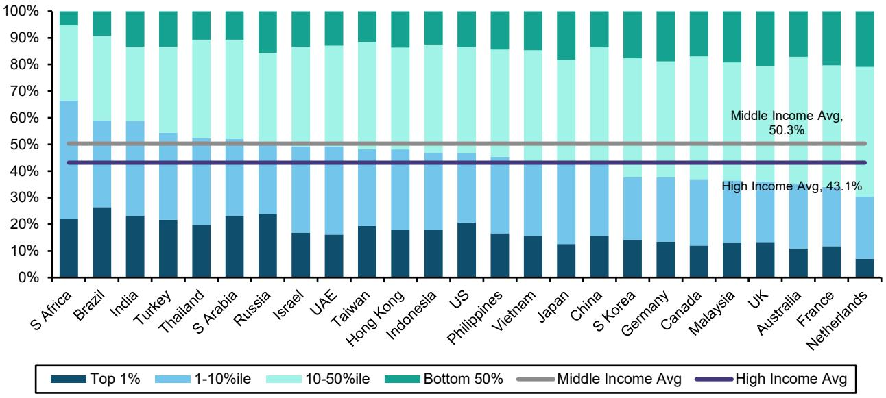
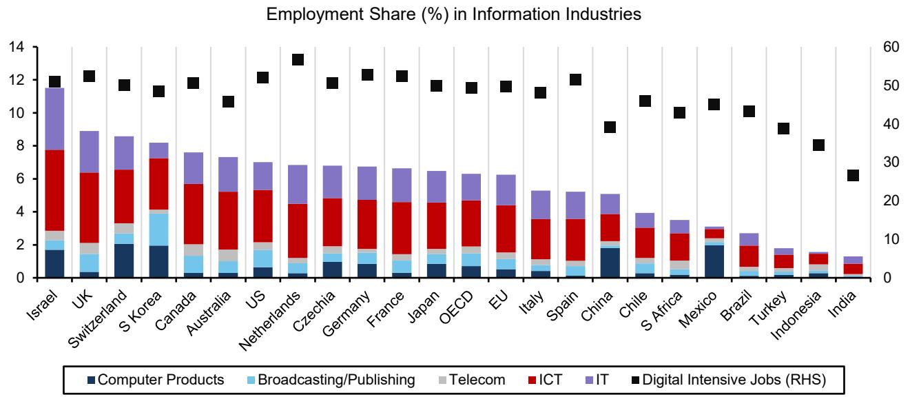

# The Gen AI Disruption Is Not What Markets Think: Developed Economies Have the Most to Lose

The dominant narrative around generative AI has become dangerously self-reinforcing. It runs as follows: knowledge workers will be displaced first, entry-level roles will vanish, and low-cost labor economies such as India, Indonesia, and Mexico face existential threats because their entire growth model rests on wage arbitrage. This story is intuitive, widely repeated, and almost certainly wrong in its most critical dimensions.

A global investment bank report challenges this consensus with a simple but devastating observation. Information and knowledge sectors account for only one to four percent of employment in most middle-income economies, compared with six to ten percent in high-income ones. The gap in GDP contribution is even starker: services contribute roughly fifty-five percent of output in middle-income countries, versus more than seventy percent in advanced economies. If AI truly disrupts knowledge work, the economic blast radius is far larger in Boston than in Bangalore.

The timing of this reassessment matters. Markets have already priced a specific AI narrative into equity valuations, rewarding US and Korean tech names while punishing Indian and Indonesian indices. But what if the market is looking through the wrong end of the telescope? What if the greatest disruption is not to the low-cost provider but to the high-cost consumer of knowledge labor? This report suggests that the conventional wisdom has the geography of AI disruption exactly inverted, and that investors who accept the dominant narrative may be positioning for the wrong outcome.

## The Wage Differential Makes AI Replacement Economically Rational Only in High-Income Economies

The second pillar of the conventional argument collapses when examined through the lens of unit economics. A typical software engineer earns roughly ten thousand dollars per year in India, compared with approximately one hundred and thirty thousand dollars in the United States and eighty thousand dollars in the United Kingdom. The pattern repeats across accountants, paralegals, data analysts, and customer service representatives—every white-collar category where AI capabilities are advancing most rapidly.

The arithmetic is decisive. Replacing a ten-thousand-dollar worker with an AI subscription yields marginal savings that rarely justify the organizational disruption and implementation costs. Replacing a one-hundred-thirty-thousand-dollar worker transforms the profit-and-loss statement of most organizations. This is not a subtle distinction; it is the fundamental economic driver of adoption rates.

Furthermore, if firms adopt human-in-the-loop systems that retain a limited pool of decision-makers and risk-bearers, the question of which humans to keep becomes a pure cost optimization problem. A firm running a global operation will retain the forty-thousand-dollar engineer in Hyderabad before the two-hundred-thousand-dollar engineer in San Francisco, assuming equivalent skill sets. The high-income economy worker faces a double threat: higher absolute cost and a global pool of lower-cost alternatives that AI makes accessible.

The implication is uncomfortable but logically inescapable. The wage structure that has made offshoring attractive for decades now makes AI substitution most economically compelling in precisely the countries that have benefited most from the existing knowledge economy. The developed world's comparative advantage in high-value cognitive work is not merely under threat; it is the primary target.

## The Inverse Market Reaction Reflects Short-Term Mechanics, Not Long-Term Economics

Given this analysis, the market's behavior appears paradoxical. Equity indices in middle-income economies such as India and Indonesia have underperformed dramatically since major AI announcements, while the US and Korean markets have surged. A reasonable observer might conclude that markets are irrational. The report suggests a more nuanced explanation: markets are pricing the next few quarters, not the next few decades.

The short-term mechanics are straightforward. Large, pure-play AI beneficiaries are concentrated in developed markets and a few Asian technology hubs. The US has hyperscalers, semiconductor designers, and foundational model companies. Korea and Taiwan have memory and fabrication. India, Indonesia, and Mexico have none of these. Their broad indices carry significant exposure to IT services—roughly five percent compared with under three percent for high-income peers—which faces genuine near-term disruption from AI automation tools.

This creates a temporal myopia that may be the market's next big blind spot. The immediate winners of the AI build-out are visible and tradeable. The long-term losers of the AI saturation are diffuse and distant. But the report's analysis suggests that as adoption scales, the economic burden shifts decisively toward high-income economies. The market is correctly pricing the first derivative of the AI wave but may be entirely wrong about the second.

Investors need to distinguish between the infrastructure phase of AI adoption and the displacement phase. The infrastructure phase benefits capital-intensive technology providers concentrated in developed markets. The displacement phase will hit the employment-intensive service economies of those same developed markets hardest. The market is currently rewarding the first phase participants while ignoring that they may be investing in the very technologies that will disrupt their own domestic labor markets.

## AI Functions as an Economic Leveller, Not a Diverger, Along Two Critical Dimensions

The report's most provocative claim is that AI, far from widening inequality between nations, may act as the great leveller. This runs counter to every instinct of the current discourse, but the logic is structurally sound.

The first dimension is between countries. Using current service-sector employment shares and income inequality data, the report estimates an average ten percent hit to national income in middle-income economies, versus approximately twenty-two percent in high-income economies. The developed world's greater reliance on knowledge services means it has more to lose in absolute and relative terms. This does not mean middle-income economies escape unscathed; it means the relative gap between country income cohorts narrows.

The second dimension is within countries. The burden of AI displacement falls disproportionately on the next-richest nine to ten percent income cohort after the top roughly one percent. This is the cohort of mid-career professionals, specialized knowledge workers, and upper-middle management—precisely the group that has benefited most from the knowledge economy of the past three decades. The top one percent, owning capital and controlling organizations, retains its position. The bottom ninety percent, engaged in physical and service work less exposed to current AI capabilities, is relatively insulated. The squeezed middle is the professional class.

This has profound implications for consumption patterns across economies. If the report's scenario plays out, we may see an exceptionally rich top one percent holding a disproportionate share of income, followed by a more equal remaining ninety-nine percent. The consumer companies that rely on high-volume discretionary spending from the professional middle class face a structural headwind. Ultra-luxury brands serving the top percentile may survive or even thrive, but mass-market discretionary names across economies face a demand shock that few are modeling.

## What the Report Does Not Fully Answer: The Timing and Political Response Functions

For all its analytical rigor, the report leaves several critical questions open. The first is timing. The analysis describes an end-state in which AI saturation has occurred and labor markets have adjusted. It does not specify the timeline for this transition, which could span five years or thirty. The difference matters enormously for investment strategy.

The second open question is the political response function. The report acknowledges that advanced economies have the most to lose and suggests that AI may become a tightly regulated industry with minimum employment mandates or usage restrictions. But it does not model the probability or form of such intervention. History suggests that large-scale labor displacement in democratic societies generates political backlash that reshapes regulatory frameworks. The nature of that backlash—whether it takes the form of AI taxes, employment quotas, or outright bans on certain use cases—will determine which asset classes and geographies are ultimately protected.

The third unanswered question is whether AI will create new industries at a scale comparable to previous technological revolutions. The report argues persuasively that AI's current trajectory differs from the Industrial Revolution and the computer age, which generated entirely new employment categories. But the future is inherently uncertain. The emergence of agentic AI could create demand for entirely new roles in AI supervision, ethics, customization, and integration that we cannot yet conceive. The report is appropriately skeptical of the "it creates more jobs than it destroys" narrative, but skepticism is not proof.

These open questions are not weaknesses in the analysis. They are the points where informed investors can develop differentiated views. The report provides the structural framework; the investor must supply the judgment on timing, politics, and second-order innovation.

## A Decision Framework for Investors Navigating the AI Disruption

The report's analysis can be translated into a practical decision framework with four dimensions.

First, assess geographic exposure not by where AI is built but by where it displaces. The conventional approach of buying AI infrastructure names in developed markets may be correct for the near term but carries hidden long-term risk if those same economies face the largest labor displacement. Consider whether your portfolio's geographic allocation properly weights the displacement risk of each country's service sector.

Second, evaluate sector exposure through the lens of income cohort impact. Companies serving the top one percent of income earners may be relatively insulated. Companies relying on the professional middle class for volume—discretionary retail, mid-market hospitality, consumer finance, education—face a structural demand risk that is not yet priced. The report suggests that the squeeze on the nine-to-ten percent cohort below the top will be the most significant consumption effect.

Third, incorporate regulatory optionality. The report suggests that advanced economies will impose tighter controls on AI adoption as displacement becomes visible. This creates potential value for companies with strong regulatory relationships, domestic employment profiles, and the ability to shape compliance standards. It also creates risk for companies whose business models depend on aggressive automation without political cover.

Fourth, distinguish between the current market pricing and the long-term economic trajectory. Markets are pricing the infrastructure build-out. The displacement phase will follow. The investor who can identify companies positioned to benefit from or survive the displacement phase—rather than merely the build-out phase—will have a structural advantage.

## The Full Report Reveals the Charts That Challenge Every Assumption

The analysis summarized here only scratches the surface of the data and reasoning in the original report. The exhibits on employment share by country, services contribution to GDP, wage differentials for exposed job categories, and market performance since key AI announcements contain granular data that fundamentally challenges the prevailing narrative. The charts are not decorative; they are the analytical foundation for an argument that inverts conventional wisdom.

Join the community to read the full report and review the original charts. The data on employment structures, wage differentials, and market reactions will change how you think about geographic allocation in an AI-saturated world. The open questions on timing, political response, and new industry creation are the points where informed debate can generate genuine investment insight.

*This article is for learning and discussion only and does not constitute investment advice.*

Personal reading notes and learning share only. Not investment advice.

