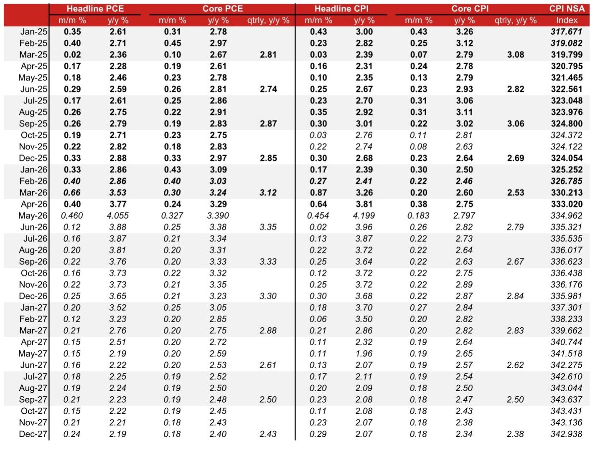
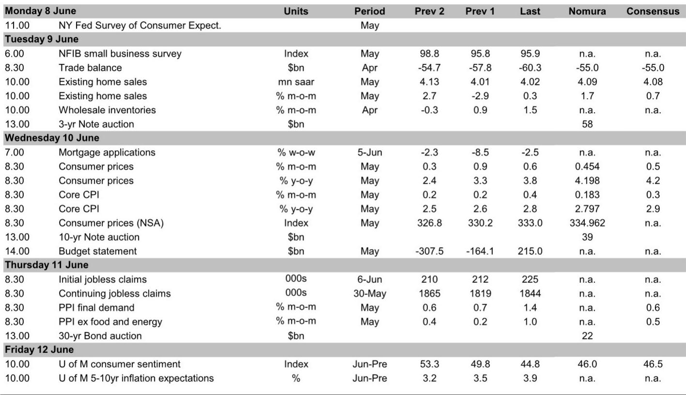
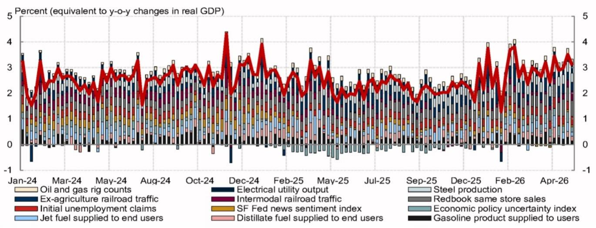

# 就业市场比通胀更值得关注的信号：美联储的降息叙事正在被重新定价

市场对美联储降息的预期，可能正建立在一个正在被数据推翻的假设上：劳动力市场会显著放缓。但最新发布的5月就业报告表明，实际情况恰恰相反。

非农就业人数增长17.2万，远高于市场预期的8.8万，且前两个月数据被上修。失业率稳定在4.3%，而衡量失业的多个指标在5月出现回落，逆转了4月的恶化趋势。这不是一个正在冷却的劳动力市场——这是一个在政策利率维持高位的情况下，依然表现出韧性的市场。

某外资投行在最新研报中明确指出：这份报告应让美联储官员继续聚焦通胀风险。其核心判断是，当前政策立场并未对经济构成实质性抑制。这一结论对资产定价的含义是深远的——如果劳动力市场不降温，通胀回落至2%目标的路径就更难被确认，降息的时间窗口可能比市场预期的更远。

以下是我们从这份研报中提炼的五个核心洞察，以及在数据背后值得追问的关键问题。

## 1. 就业增长的广度在改善，这比总量数字更值得关注

非农就业17.2万的增量本身已经超出预期，但真正重要的信号藏在结构里。研报使用的扩散指数显示，就业增长的广度在近期持续改善，周期性行业的表现尤为突出。这意味着增长不是由少数几个板块拉动的，而是具有更广泛的产业基础。

具体来看，休闲酒店业增长了7万，部分受世界杯临时性因素推动；地方政府就业增加了5.5万。这些看似有“噪音”的细节，恰恰说明劳动力市场的韧性并非虚胖。即便剔除这些一次性因素，私营部门就业的3个月移动均值也已攀升至2024年3月以来的最高水平。

对于投资者而言，这意味着一个关键判断：劳动力市场的韧性正在从“结构性短缺”转向“周期性复苏”。如果后者成立，那么工资增长和消费支出的下行空间将比市场预期的更有限。

## 2. 失业率稳定的背后，是失业者找到工作的速度在改善

4月失业率数据曾引发市场对劳动力市场恶化的担忧。但5月数据给出了相反的信号：衡量失业的多个指标——包括初请失业金人数、JOLTS裁员率、短期失业率——都在5月出现回落。研报特别指出，求职成功率（job-finding rate）虽然仍显疲弱，但已较4月有所回升。

这意味着什么？4月的数据可能是一次统计噪音，而非趋势反转。失业率稳定在4.3%，同时失业者找到工作的速度在改善，这组组合指向的是一个“有摩擦但不出清”的劳动力市场。对于美联储而言，这恰恰是最难处理的状态：既不足以触发降息，也不至于引发衰退恐慌。

## 3. 核心CPI可能放缓，但核心PCE却在加速——市场在关注错误的通胀指标

研报预测5月核心CPI环比增速将从4月的0.376%放缓至0.183%，主要受租金相关技术性调整的暂时性影响消退。但与此同时，核心PCE通胀预计将从4月的0.239%加速至0.327%，同比增速进一步升至3.4%。

这两组数字的分歧源于统计口径差异：PCE中的投资管理服务价格和机票价格（均来自PPI相关分项）在5月表现强劲。而美联储明确以PCE作为通胀目标。

这里有一个容易被忽略的细节：即便核心CPI放缓，也只是因为4月的一次性因素消退。研报明确指出，核心商品通胀仍保持小幅正增长，科技相关价格压力正在抵消关税影响的消退。更值得警惕的是，ISM服务业价格支付指数已升至2022年中以来最高，企业报告的成本上升范围涵盖能源、货运、包装材料、食品、化肥、建筑材料甚至劳动力。

通胀的“广度”在扩大，而非收窄。

## 4. 鹰派声音在强化：有官员已开始讨论加息的可能性

研报特别点名了达拉斯联储主席Logan的发言。她明确表示，当前经济状况表明“货币政策并未抑制经济”，并“越来越担心今年晚些时候可能需要提高利率”。这是近期美联储官员中，第一个无条件主张加息的。

克利夫兰联储主席Hammack也维持鹰派立场，认为5月就业报告确认了劳动力市场大致平衡。她虽然没有直接主张加息，但明确表示维持利率稳定是合理的。

只有纽约联储主席Williams仍属鸽派，认为通胀不会持续，且没有明显理由修改前瞻指引。但他目前是少数派。

一个关键信号是：美联储主席Warsh据报可能不会在6月FOMC会议上提交自己的利率预测，因为他认为前瞻指引无用。同时他任命的两名顾问此前曾呼吁对货币政策操作进行大幅改革。这暗示美联储内部对政策框架的反思正在深化。

## 5. 关税政策本质是“连续性”而非“升级”，但通胀预期的传导渠道已经打开

研报对最新关税政策的定性值得注意：美国宣布的新301关税主要目的是在122条关税7月24日到期后保持贸易体制的连续性，而非实质性升级。对终端有效关税率的估计仍维持在8-9%。

但问题在于，通胀预期的传导渠道已经打开。企业正在将上升的投入成本转嫁给下游，而劳动力市场的韧性又为这一传导提供了支撑。即便关税本身没有大幅升级，伊朗战争引发的能源冲击、货运成本上升、金属价格上涨等，都在通过供应链层层叠加。

研报估算，从国家层面的IEEPA关税转向普遍的10% 122条关税，使有效关税率下降了约1.5个百分点。而301关税的全面实施很可能将逆转大部分降幅，使有效关税率从当前的约7%回升至8.5%。这不是一次性的冲击，而是一个持续抬升的过程。

## 报告尚未完全回答的关键问题：劳动力市场的“韧性”能持续多久？

研报对劳动力市场的判断是“健康但不过热”——失业率稳定，工资增速放缓速度快于预期。但有一个关键假设尚未充分验证：当前就业增长的韧性有多少来自一次性因素（世界杯、地方政府招聘），多少来自结构性改善？

报告本身也承认，休闲酒店业的7万增长可能部分受世界杯推动，而地方政府就业的增长是否可持续，取决于州和地方政府的财政状况。如果这些临时性因素消退，就业增长能否维持当前速度？

此外，研报提到“横向的工资增长意味着消费者支出应在夏末开始放缓”。但这一判断与就业增长加速、失业率稳定的数据之间存在张力。消费者支出何时真正放缓，是决定美联储政策路径的关键变量，但报告对此的论证链条并不完整。

## 一个值得持续跟踪的观察框架

基于这份研报的逻辑，我们建议读者建立一个三变量的观察框架：

第一，就业增长的广度是否持续改善。不要只看非农总数，要关注扩散指数和周期性行业的就业变化。

第二，核心PCE与核心CPI的分歧何时收敛。如果PCE持续高于CPI，意味着美联储关注的实际通胀压力比市场想象的大。

第三，企业成本转嫁的意愿和能力。ISM服务业价格指数和美联储褐皮书的定性描述，比单纯的CPI数字更能反映通胀的“温度”。

这三个变量将共同决定美联储的政策路径。当前市场定价隐含的降息预期，可能正在被劳动力市场的韧性和通胀的广度所挑战。

---

以上是我们基于某外资投行最新研报的解读与延伸分析。报告原文还包含更详细的通胀分项预测、Q2 GDP跟踪数据、以及关税政策的完整推演框架，这些内容因篇幅限制未能完全展开。

如果你对以下问题感兴趣——劳动力市场的“结构性韧性”能否在2026年下半年持续？核心PCE加速是否意味着美联储的加息讨论将从“个别声音”变为“主流叙事”？关税政策的“连续性”背后是否隐藏着新一轮升级的风险？——欢迎来星球的微信群里继续讨论。我们会在群内分享完整的研报原文、数据图表，以及围绕这些未解问题的持续跟踪。

Personal reading notes and learning share only. Not investment advice.

