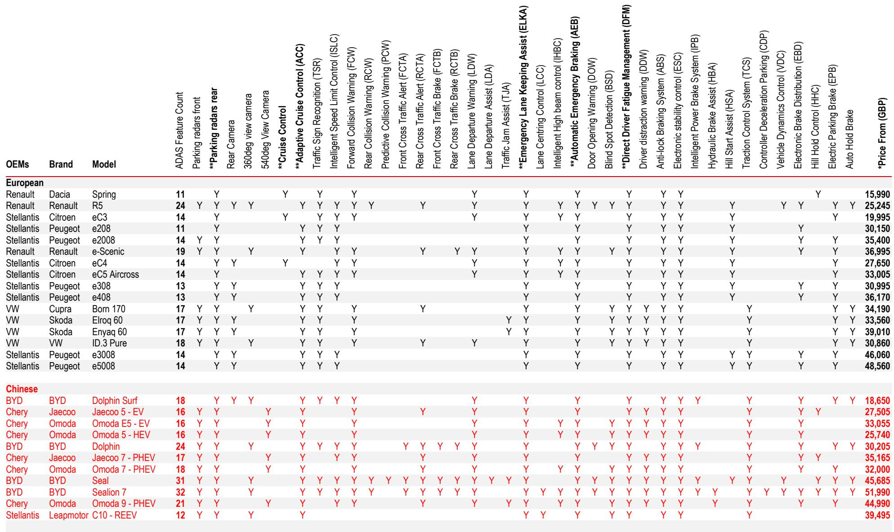
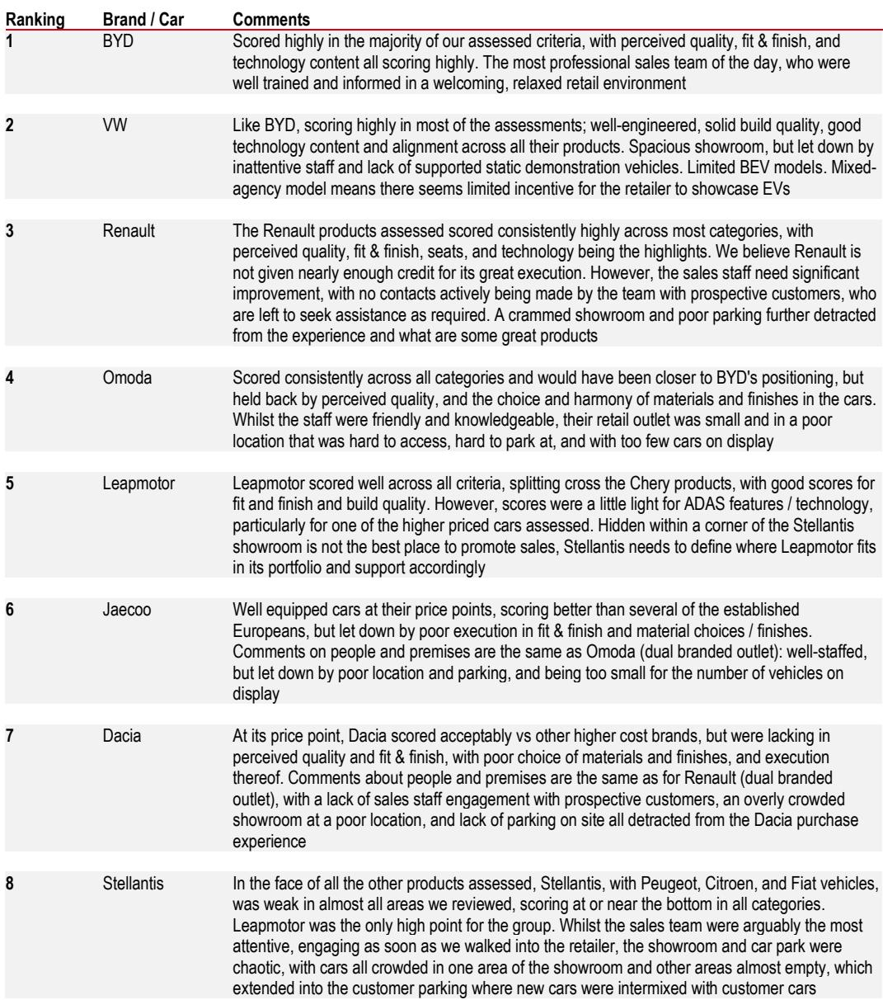
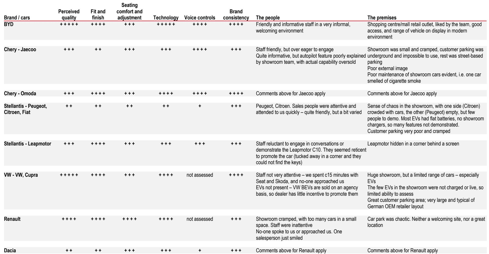

# 欧洲汽车市场真正被低估的风险，不是中国份额，而是欧洲的利润优先策略

欧洲正在经历一场它不愿承认的结构性变化。中国汽车制造商在欧洲的市场份额在过去12个月内翻了一倍，达到约6.8%。这个数字本身并不惊人，真正值得关注的，是这背后两股力量的分化：中国车企在加速渗透，而欧洲车企却在主动选择“不反击”。

这不是一个关于“谁将赢得市场”的故事，而是一个关于“谁愿意为市场份额牺牲利润”的博弈。某外资投行最新发布的全球汽车研报给出了一个反直觉的判断：市场过度关注了中国的进攻，却低估了欧洲的防守策略——后者可能才是决定未来五年行业利润分配的核心变量。

这份报告的核心洞察在于：中国车企的崛起并非靠简单的价格战，而是产品力的系统性提升；欧洲车企并非无力反击，而是选择了保护利润而非份额。这两种策略的碰撞，正在重塑欧洲汽车业的竞争逻辑。

## 1. 中国车企的欧洲攻势：份额翻倍背后是产品力而非补贴

中国车企在欧洲的市场份额从2023年初的约1%攀升至2026年4月的近7%，这一增速远超历史上任何新进入者。以英国市场为例，奇瑞集团和比亚迪在极短时间内就达到了3-4%的市场份额，而丰田和现代当年达到这一水平耗费了数倍的时间。

报告特别强调了一个关键判断：中国车企的竞争力并非来自价格战。在德国市场，中国品牌的定价基本处于各细分市场的中位区间，并未出现系统性低价倾销。真正驱动消费者选择的，是产品本身的“物超所值”——更丰富的配置、更精致的工艺、更先进的智能化功能。

这一点在报告中得到了实地验证。该投行的分析师团队在2025年北京车展和英国经销商走访中发现，中国汽车的产品质量已经不再是“够用”，而是“更好”。这背后是中国国内市场的“完美竞争”逻辑：大量生产资质和地方政府资金支持，迫使车企在配置和品质上不断内卷，最终催生出全球范围内最具竞争力的产品矩阵。

反补贴关税并未有效阻挡这一趋势。欧盟对中国产电动汽车加征的关税，中国车企似乎选择了直接吸收，而不是转嫁给消费者。这意味着，关税壁垒的有效性正在被中国车企的成本优势和利润空间所削弱。

## 2. 欧洲车企的利润优先策略：一场主动放弃的阵地战

面对中国车企的攻势，欧洲车企的反应出乎许多人意料——它们没有选择在价格上硬碰硬，而是明确将保护利润和现金流作为首要目标。

报告引用了多家欧洲车企高管的公开表态。雷诺CEO明确表示“中国车企应该与欧洲合作、在欧洲投资生产”，而非直接对抗。Stellantis则强调其品牌组合优势是对抗中国新进入者的核心武器。福特CEO更是直言“我们知道自己正处在一场生死之战中”。

但这些表态背后，是一个更现实的商业逻辑：欧洲汽车市场本身就是一个利润微薄的市场。产能过剩、僵化的劳动法、小型车主导的产品结构，使得在这个市场赚钱本就困难。在这样的背景下，与中国车企展开全面的价格战，只会加速利润率的崩塌。

因此，欧洲车企的策略是双管齐下：一方面通过采用磷酸铁锂（LFP）电池等低成本技术降低可变成本，另一方面利用老龄化劳动力自然减员来压缩固定成本。这是一种“防守型”策略——不是不反击，而是选择在自己有优势的领域（品牌、渠道、服务）上竞争，而不是在价格上硬拼。

## 3. 竞争格局的赢家和输家：谁在为中国车企的扩张买单

报告的数据揭示了另一个重要洞察：中国车企的市场份额增长并非来自欧洲本土车企，而是主要蚕食了其他亚洲品牌和部分美系品牌的市场。

在整体市场份额变化中，Stellantis是最大的输家，过去三年流失了约3.9个百分点的份额。其次是福特（-1.5%）、起亚（-0.8%）和现代（-0.5%）。而大众集团反而实现了1.5个百分点的增长，雷诺和沃尔沃也略有上升。

这一格局意味着：中国车企的冲击波并非均匀分布。对于部分欧洲本土车企而言，中国品牌的崛起可能反而“帮”它们挤走了日韩品牌和福特等竞争对手。这或许解释了为何一些欧洲车企并未表现出强烈的反击意愿——只要自己的份额没有受到直接冲击，它们更愿意坐视竞争对手的退场。

在纯电动车领域，竞争更为激烈。大众集团以6.8个百分点的份额增长领先，比亚迪以6.3个百分点紧随其后。而Stellantis在电动车市场流失了7.6个百分点，特斯拉也损失了4.4个百分点。这说明，电动车市场正在经历一场“新老交替”，而中国品牌和大众集团是最大的受益者。

## 4. 报告尚未完全回答的关键问题：欧洲车企的利润优先策略能持续多久

尽管报告给出了清晰的分析框架，但一个关键问题悬而未决：欧洲车企的利润优先策略在长期是否可持续？

当前，中国车企在定价上相对克制，部分原因在于欧洲市场60%是公司车队采购，残值管理至关重要。但如果中国车企的本地化生产（如比亚迪在欧洲建厂）进一步降低成本，或者它们开始更激进地定价，欧洲车企的利润优先策略将面临严峻考验。

另一个未解之谜是：欧洲车企的“成本削减”能走多远？通过采用LFP电池降低可变成本，通过自然减员降低固定成本，这些措施都有其极限。当成本削减空间耗尽，而中国车企仍在不懈推进时，欧洲车企是否会被迫转向价格战？

此外，报告提到了一个值得警惕的趋势：中国汽车正在向更大尺寸演化，这可能使其与欧洲市场的需求错位。但这一判断仍需验证——如果中国车企能够同时提供多种尺寸的产品，这一“错位”就可能不复存在。

## 5. 投资者和产业决策者应该关注的三个观察框架

基于报告的分析逻辑，我们可以提炼出三个核心观察框架，用于跟踪这一趋势的演进：

**第一，关注中国车企的定价策略是否出现系统性变化。** 目前中国车企在德国的定价基本处于各细分市场的中位区间。如果它们开始主动降价，意味着竞争进入新阶段。反之，如果它们继续维持当前定价，说明产品力本身足以支撑增长，这对欧洲车企的威胁更大。

**第二，跟踪欧洲车企的成本削减进度。** LFP电池的采用速度和工厂关闭计划是关键指标。如果欧洲车企能够在保持利润的同时快速缩小与中国车企的成本差距，它们的防守策略就是有效的。反之，如果成本削减速度跟不上，利润压力将迫使它们重新考虑竞争策略。

**第三，分辨哪些品牌最脆弱。** 报告数据显示，Stellantis、福特和日韩品牌是中国车企的主要“受害者”。这些品牌的反应速度和调整能力，将是判断行业洗牌深度的重要指标。如果这些品牌也转向利润优先策略，意味着整个行业正在接受“份额换利润”的新常态。

## 6. 这场博弈的真正终局：欧洲汽车市场可能走向“双轨制”

综合报告的判断和逻辑推导，一个可能的终局正在浮现：欧洲汽车市场可能走向“双轨制”——一部分消费者选择中国品牌的高性价比产品，另一部分消费者继续忠于欧洲品牌的溢价和服务。两个阵营之间的竞争，将不再是简单的价格战，而是产品定义、用户体验和品牌价值的全方位较量。

对于中国车企而言，真正的挑战在于能否在欧洲市场建立起可持续的品牌认知和售后服务体系。对于欧洲车企而言，真正的考验在于能否在保护利润的同时，不丧失对未来产品的定义权。

这份报告的价值，不仅在于它提供了最新的市场份额数据和竞争分析，更在于它揭示了一个被市场忽视的底层逻辑：在利润和份额之间，欧洲车企已经做出了选择。这个选择将深刻影响未来五年的行业利润分配、投资方向和竞争格局。

但报告也留下了几个值得深入探讨的问题：中国车企的本地化生产将如何改变竞争态势？欧洲车企的利润优先策略在多大程度上是主动选择，而非被动接受？如果中国车企开始更激进地定价，欧洲车企的防守策略会否瞬间瓦解？

这些问题的答案，可能就藏在报告的原始数据和更深入的图表分析中。欢迎来星球微信群里继续讨论，我们将结合完整报告和最新行业动态，持续追踪这一趋势的演进。

Personal reading notes and learning share only. Not investment advice.

