# ASIA IN FOCUS

# Cost of China's Retail Fuel Price Management Modest and Sustainable

To mitigate the global energy-supply shock, Chinese policymakers have implemented a multi-pronged response encompassing domestic price interventions, temporary export restrictions, and import diversification, broadly in line with their past practice. At the core is a pricing mechanism where the government has limited the pass-through rate of global oil price increases to around half since the start of the Middle East conflict. This has partially shielded the domestic economy, albeit at the cost of margin compression for refiners and even fiscal burdens.   
China regulates domestic retail fuel prices through a mechanism anchored by a USD40-130/bbl international crude price corridor. Specifically, when international crude prices fall below USD40/bbl, retail fuel prices freeze, with the surplus directed to a Risk Reserve Fund. International prices above USD130 trigger retail price freezes and government subsidies for refiners. Within this range, full pass-through applies below USD80/bbl, while it shifts to partial pass-through above USD80/bbl.   
Historical patterns suggest that every $10\%$ increase in Brent crude prices would raise domestic gasoline and diesel prices by around $5\%$ , with variations by product and price level. Given that Brent crude has fluctuated within the USD80-130/bbl range in recent months, the pass-through rate is expected to remain modestly below its historical average, reflecting recent discretionary price interventions by the NDRC. We also estimate that every $10\%$ increase in China's domestic retail fuel prices is associated with around $5\%$ decline in domestic oil product retail sales volume historically.   
Since the start of the Middle East conflict, domestic oil product retail sales volume fell 17% yoy in March-April 2026, while average retail prices rose 17% yoy. This implies a larger demand response than historical patterns would suggest, likely because alternatives such as non-oil/gas energy supply and rapid EV adoption are now more widely available than in earlier oil-price upcycles.   
China's oil price interventions appear fiscally manageable, in our view. Based on our estimates, government intervention costs remain modest at around $0.3\%$ of GDP annualized, and could be further mitigated by inventory valuation gains and stronger upstream profitability. This suggests that the broad government sector can comfortably absorb the cost if international prices continue to fluctuate within the recent range.

# Lisheng Wang

+852-3966-4004

lisheng.wang@gs.com

GS (Asia) L.L.C.

# Cost of China's Retail Fuel Price Management Modest and Sustainable

To mitigate the global energy supply shock triggered by the Middle East conflict and the closure of the Strait of Hormuz, Chinese policymakers have implemented a multi-pronged response encompassing domestic price interventions, temporary export restrictions, and import diversification, broadly in line with their past practice. At the core is a pricing mechanism overseen by the National Development and Reform Commission (NDRC), China's top economic planner. Since March 2026, the NDRC has partially insulated domestic retail fuel prices from international volatility by permitting only around half of global oil price increases to be passed through (Exhibit 1). These measures entail costs, as major state-owned refiners such as Sinopec and PetroChina are required to absorb margin compression, and the government may need to provide subsidies when international prices exceed certain thresholds.

In this note, we explain China's domestic retail oil product pricing mechanism, quantify the pass-through from international crude price changes to domestic retail prices and consumption, and estimate the government costs for oil price interventions. China's oil price interventions appear fiscally manageable, in our view. We estimate that government intervention costs remain modest – below 0.3% of GDP annualized – and could be further mitigated by inventory valuation gains and stronger upstream profitability.

Beyond direct price intervention, China has also acted on the supply side by temporarily tightening exports of refined oil products – including gasoline, diesel, and jet fuel – as well as selected by-products such as sulphuric acid (a key input for fertilizers and copper mining). At the same time, it has significantly increased oil imports from Russia and Latin America to partially offset the sharp decline in Middle East supply, $^{1}$ while drawing on previously accumulated inventories to alleviate near-term shortages. Based on our estimates, total oil import volume fell 11% yoy in March-April, as a 38% yoy contraction in imports from the Middle East more than offset the gains from Russia and Latin America (+13% yoy and +64% yoy, respectively; Exhibit 2). Our Global Commodities Strategy team's high-frequency tracker pointed to a sharper drop in China's crude oil imports in May.

The government is also using the shock to accelerate China's long-term shift toward energy independence. Policy support for the “New Three” industries – electric vehicles, lithium-ion batteries, and solar products – has been strengthened, reducing the economy’s long-term exposure to fossil-fuel price jumps. Reflecting this shift, the penetration ratio of new energy vehicles (NEVs) – measured as the share of NEV in total auto sales – rose from 1% in 2016 to 54% in 2025, and increased further to 63% in May 2026, according to data from the China Passenger Car Association (CPCA). During the Labor Day holiday this year (1-5 May), highway EV charging demand jumped 52.8% yoy, meaningfully outpacing passenger trips via roads (+3.5% yoy). Within roads transportation, passenger flows via public transportation services gained 9.5% yoy, while self-driving trips only rose 2.6% yoy. These highlighted the elasticity of oil demand amid higher oil prices, with EV usage and public transportation replacing traditional Internal Combustion Engine (ICE) cars amid higher oil prices.

Exhibit 1: Domestic retail fuel prices have risen less than Brent crude oil prices since the start of the Middle East conflict   
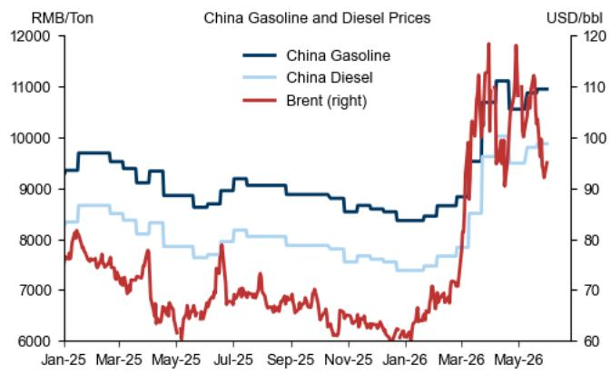

<details>
<summary>line</summary>

| Date   | China Gasoline (RMB/Ton) | China Diesel (RMB/Ton) | Brent (right) (USD/bbl) |
|--------|--------------------------|------------------------|-------------------------|
| Jan-25 | ~9500                    | ~8500                  | ~75                     |
| Mar-25 | ~9800                    | ~8300                  | ~78                     |
| May-25 | ~9200                    | ~7800                  | ~65                     |
| Jul-25 | ~9000                    | ~8000                  | ~78                     |
| Sep-25 | ~8800                    | ~7800                  | ~70                     |
| Nov-25 | ~8500                    | ~7500                  | ~65                     |
| Jan-26 | ~8300                    | ~7300                  | ~60                     |
| Mar-26 | ~9500                    | ~8500                  | ~110                    |
| May-26 | ~11000                   | ~9500                  | ~105                    |
</details>

Source: Haver Analytics, GS Global Investment Research

Exhibit 2: Increased imports from Russia and Latin America have partially offset falling Middle East supply   
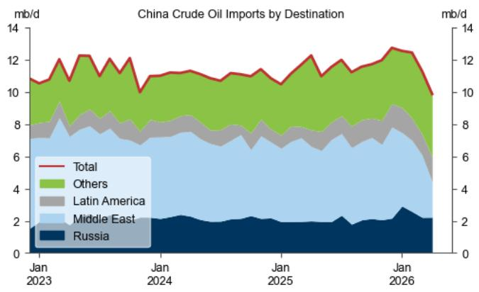

<details>
<summary>area</summary>

| Date     | Total | Others | Latin America | Middle East | Russia |
|----------|-------|--------|---------------|-------------|--------|
| Jan 2023 | 10.5  | 3.0    | 1.5           | 2.0         | 1.0    |
| Jan 2024 | 11.0  | 3.5    | 1.8           | 2.5         | 1.2    |
| Jan 2025 | 11.5  | 4.0    | 2.0           | 3.0         | 1.5    |
| Jan 2026 | 12.5  | 4.5    | 2.5           | 3.5         | 2.0    |
</details>

Source: China Customs, Wind, GS Global Investment Research

# How China's domestic retail oil product pricing framework works

China's domestic retail oil products pricing framework uses a ceiling mechanism to shield the domestic economy from extreme global volatility (Exhibit 3). When international crude prices reach or exceed USD130/bbl, the NDRC typically suspends retail price increases to protect consumers, with the resulting losses absorbed through government transfers to major state-owned refiners. The framework is complemented by a fuel-price linkage system that provides targeted support to essential and price-sensitive sectors such as agriculture and public transport once domestic prices cross specified thresholds.

Conversely, when international prices fall below USD40/bbl, a floor mechanism applies. Rather than allowing refiners to retain the windfall from unchanged retail prices, the surplus is directed to a state-managed Risk Reserve Fund. The fund is earmarked for strategic uses, including energy conservation and emissions reduction, fuel-quality upgrades to meet higher national standards, and measures to strengthen energy security.

When international prices fall between the floor of USD40/bbl and the ceiling of USD130/bbl, USD80/bbl serves as an additional threshold. Below USD80/bbl, the NDRC allows full pass-through to domestic retail prices. Above USD80/bbl, it permits only partial pass-through of the calculated increase and requires refiners to absorb part of the shock through lower processing margins.

Although these price interventions do not involve direct cash transfers to consumers, they remain an important policy tool for stabilizing domestic prices during severe global energy-supply shocks. In addition, the NDRC's reference price is not tied to a single benchmark. Instead, it is based on a weighted basket of international crude prices. While the exact weights are not disclosed to avoid market speculation, industry consensus, including sources quoted by CCTV, identifies Brent, Dubai, and Minas as the main components.

Exhibit 3: An illustration of China's domestic retail oil product pricing framework   
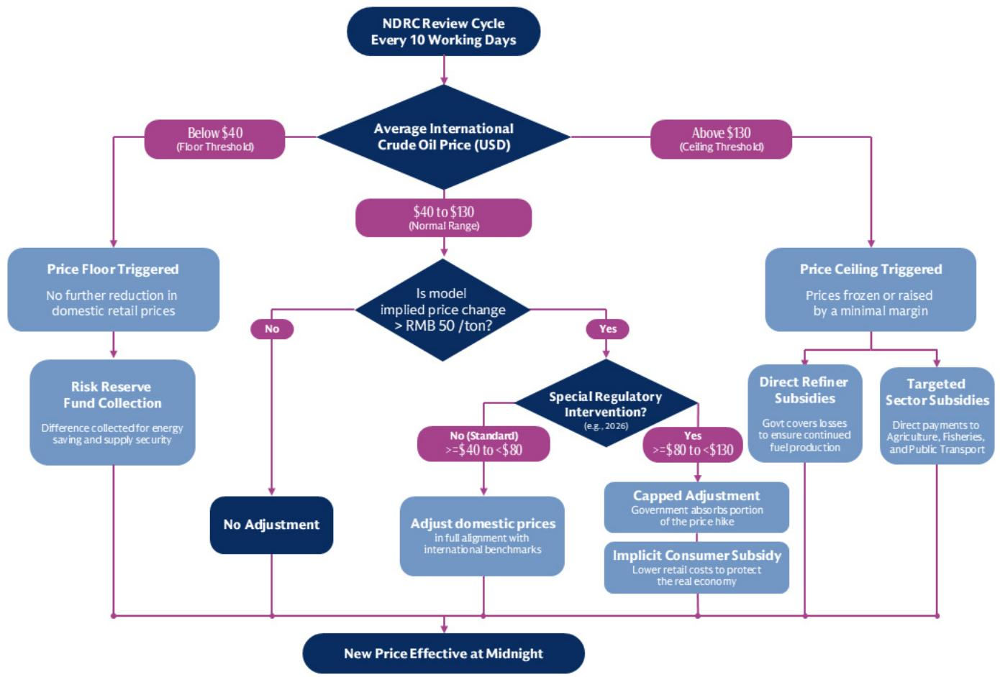

<details>
<summary>flowchart</summary>

```mermaid
graph TD
    A["NDRC Review Cycle Every 10 Working Days"] --> B{Average International Crude Oil Price (USD)}
    B -->|Below $40 (Floor Threshold)| C["Price Floor Triggered"]
    B -->|Above $130 (Ceiling Threshold)| D["Price Ceiling Triggered"]
    C --> E["No further reduction in domestic retail prices"]
    E --> F["Risk Reserve Fund Collection"]
    F --> G["Difference collected for energy saving and supply security"]
    G --> H["No Adjustment"]
    H --> I["Adjust domestic prices in full alignment with international benchmarks"]
    I --> J["Special Regulatory Intervention? (e.g., 2026)"]
    J --> K["Yes >=$80 to <$130"]
    K --> L["Capped Adjustment"]
    L --> M["Implicit Consumer Subsidy"]
    M --> N["Lower retail costs to protect the real economy"]
    N --> O["New Price Effective at Midnight"]
    O --> H
    J --> P["Direct Refiner Subsidies"]
    P --> Q["Govt covers losses to ensure continued fuel production"]
    Q --> R["Targeted Sector Subsidies"]
    R --> S["Direct payments to Agriculture, Fisheries, and Public Transport"]
    S --> O
    J --> T["Price Frozen or raised by a minimal margin"]
    T --> U["Price Ceiling Triggered"]
    U --> V["Normal Range: $40 to $130"]
    V --> W{Is model implied price change > RMB 50 /ton?}
    W -->|No| C
    W -->|Yes| J
```
</details>

Source: NDRC, GS Global Investment Research

# The impact of global oil price changes on domestic retail markets

Changes in international crude prices are only partially transmitted to China's domestic retail fuel prices. Our time series regressions based on monthly data from 2017-26 suggest that every $10\%$ increase in Brent crude price would raise domestic gasoline and diesel prices by around $5\%$ (Exhibit 4). The pass-through rate is generally lower when Brent prices are closer to the ceiling or floor than when they are within a more normal range (also see our earlier studies here and here for more analyses on the pass-through impact). Given that Brent crude has fluctuated within the USD80-130/bbl range in recent months, the pass-through rate is expected to remain modestly below its historical average, reflecting recent discretionary price interventions by the NDRC.

Exhibit 4: Every 10% increase in Brent crude price would raise domestic gasoline and diesel prices by around 5% 

<table><tr><td colspan="9">Sample period: 2017M1 - 2026M5</td></tr><tr><td>Dependent variables</td><td colspan="4">Log (Gasoline Price)</td><td colspan="4">Log (Diesel Price)</td></tr><tr><td>Explanatory variables</td><td>Full sample(1)</td><td>Brent &gt;= 70 and &lt;100(2)</td><td>Brent &lt; 70 or &gt;=100(3)</td><td>Brent &gt;= 80 and &lt;130 (recent range)(4)</td><td>Full sample(5)</td><td>Brent &gt;= 70 and &lt;100(6)</td><td>Brent &lt; 70 or &gt;=100(7)</td><td>Brent &gt;= 80 and &lt;130 (recent range)(8)</td></tr><tr><td>Log (Brent oil price)</td><td>0.54(16.44)***</td><td>0.55(5.51)***</td><td>0.49(13.80)***</td><td>0.49(5.07)***</td><td>0.50(8.73)***</td><td>0.78(9.80)***</td><td>0.46(7.57)***</td><td>0.31(5.03)***</td></tr><tr><td>Log (USDCNY)</td><td>0.75(4.36)</td><td>0.64(6.56)***</td><td>0.60(1.78)*</td><td>0.42(2.89)***</td><td>1.07(5.04)***</td><td>0.69(3.98)***</td><td>1.27(5.11)***</td><td>0.32(1.64)</td></tr><tr><td>Constant</td><td>1.85(1.63)</td><td>2.51(3.17)***</td><td>2.95(1.30)</td><td>5.19(5.23)***</td><td>-0.28(-0.21)</td><td>1.02(0.82)</td><td>-1.44(-0.91)</td><td>5.48(3.87)***</td></tr><tr><td># observations</td><td>113</td><td>53</td><td>60</td><td>34</td><td>113</td><td>53</td><td>60</td><td>34</td></tr><tr><td>Adjusted R-squared</td><td>0.88</td><td>0.66</td><td>0.87</td><td>0.40</td><td>0.86</td><td>0.78</td><td>0.85</td><td>0.46</td></tr></table>

Note: T-stats in robust standard errors are reported in parentheses;   
\*\*\*, \*\*, \* denotes statistical significance at 1%, 5%, and 10% levels, respectively.

We use Brent oil price at USD70/bbl and USD100/bbl as cut-off levels to divide our full-sample, with sufficient number of observations for sub-sample regressions. USD70/bbl and USD100/bbl have the same absolute distance to their neighboring intervention thresholds (USD40/bbl and USD130/bbl, respectively). Brent prices between USD80/bbl and USD130/bbl refer to the range in recent months, though the sample size is smaller than other regressions.

Source: GS Global Investment Research

Pass-through rates differ across refined oil products depending on the degree of administrative pricing control, end-demand conditions, and market structure. Gasoline and diesel together accounted for $46\%$ of China's total oil product consumption in 2025 (Exhibit 5), which means the NDRC-controlled segment covers less than half of all oil products. For other products such as LPG, naphtha, and fuel oil, refiners generally have greater flexibility to pass through changes in international prices to downstream buyers. Accordingly, the weighted average pass-through rate across all oil products should be higher than the around 0.5 that we estimated on gasoline and diesel prices.

The NBS measure of retail sales for gasoline and other oil products by enterprises above the designated size captures sales by the “Big Three” state-owned oil giants (i.e., Sinopec, PetroChina, CNOOC) and a small number of large private firms. $^{2}$ Compared with the broader NDRC measure of apparent oil product consumption, the NBS series excludes sales by smaller gas stations, direct supplies to industry and construction, as well as aviation and shipping sales. We estimate that NBS retail sales volume of gasoline and other oil products accounted for roughly 75% of NDRC apparent oil product consumption in recent years (Exhibit 6).

Exhibit 5: Gasoline and diesel together accounted for less than half of China's domestic oil product consumption in 2025   
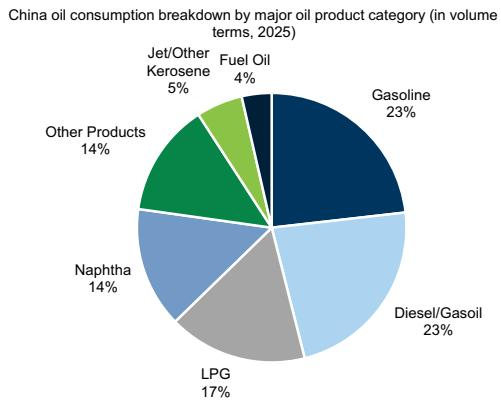

<details>
<summary>pie</summary>

China oil consumption breakdown by major oil product category (in volume terms, 2025)
| Product Category | Volume (%) |
| :--- | :--- |
| Gasoline | 23 |
| Diesel/Gasoil | 23 |
| LPG | 17 |
| Naphtha | 14 |
| Other Products | 14 |
| Jet/Other Kerosene | 5 |
| Fuel Oil | 4 |
</details>

Source: Wood Mackenzie, Data compiled by GS Global Investment Research

Exhibit 6: NBS oil product retail sales volume accounted for around 75% of NDRC oil product apparent consumption in recent years   
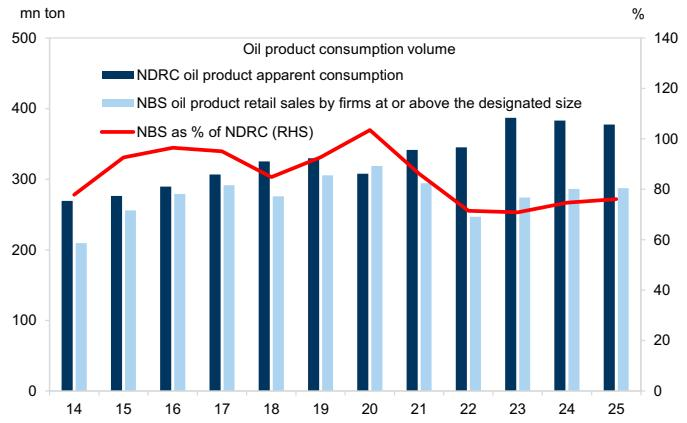

<details>
<summary>bar_line</summary>

Oil product consumption volume
| Year | NDRC oil product apparent consumption (mn ton) | NBS oil product retail sales by firms at or above the designated size (mn ton) | NBS as % of NDRC (RHS) (%) |
| :--- | :--- | :--- | :--- |
| 14 | 270 | 210 | 78 |
| 15 | 275 | 255 | 93 |
| 16 | 290 | 280 | 95 |
| 17 | 305 | 290 | 94 |
| 18 | 325 | 275 | 83 |
| 19 | 330 | 305 | 90 |
| 20 | 310 | 320 | 106 |
| 21 | 340 | 290 | 88 |
| 22 | 345 | 245 | 71 |
| 23 | 385 | 275 | 70 |
| 24 | 380 | 290 | 76 |
| 25 | 375 | 290 | 77 |
</details>

NBS oil product retail sales volume is based on GS estimates using the weighted average of domestic refined oil prices.   
Source: NDRC, Wind, CEIC, GS Global Investment Research

# Recent government interventions to reduce global oil price pass-through

Since the Middle East conflict that began from end-February, the NDRC has adjusted domestic retail oil product prices seven times as of early June, including five increases and two cuts (Exhibit 7). During the two largest hikes, on 23 March and 7 April, the authority capped the increase at roughly half the level implied by the standard pricing formula, with the intervention cost absorbed by state-owned refiners through reduced processing margins. Across all the seven adjustments, we estimate that the NDRC has passed through around half of the increase in international crude prices to domestic retail oil prices (as the actual cumulative increase in domestic fuel prices since March is 47% less than model implied).

Exhibit 7: A summary of NDRC adjustments to domestic retail oil product prices since the start of the Middle East conflict (as of early June) 

<table><tr><td rowspan="2">Domestic Fuel Price Adjustment Date</td><td colspan="2">Gasoline Price Change (RMB/ton)</td><td colspan="2">Diesel Price Change (RMB/ton)</td><td rowspan="2">Price Intervention?</td></tr><tr><td>Actual</td><td>Model Implied</td><td>Actual</td><td>Model Implied</td></tr><tr><td>9 Mar 2026</td><td>+695</td><td>+695</td><td>+670</td><td>+670</td><td>No</td></tr><tr><td>23 Mar 2026</td><td>+1160</td><td>+2205</td><td>+1115</td><td>+2120</td><td>Yes, Partial</td></tr><tr><td>7 Apr 2026</td><td>+420</td><td>+800</td><td>+400</td><td>+770</td><td>Yes, Partial</td></tr><tr><td>21 Apr 2026</td><td>-555</td><td>-555</td><td>-530</td><td>-530</td><td>No</td></tr><tr><td>8 May 2026</td><td>+320</td><td>+320</td><td>+310</td><td>+310</td><td>No</td></tr><tr><td>21 May 2026</td><td>+75</td><td>+75</td><td>+70</td><td>+70</td><td>No</td></tr><tr><td>4 Jun 2026</td><td>-525</td><td>-525</td><td>-505</td><td>-505</td><td>No</td></tr><tr><td>Since Mar 2026</td><td>+1590</td><td>+3015</td><td>+1530</td><td>+2885</td><td>Yes, Partial (47% less than model implied)</td></tr></table>

Source: NDRC, GS Global Investment Research

# A larger-than-normal contraction in domestic oil consumption

Higher retail prices weigh on end demand. Using monthly data from January 2015 to April 2026, we estimate that every $10\%$ increase in China's domestic retail oil prices is associated with around $5\%$ decline in domestic oil product retail sales volume (Exhibit 8). However, since the start of the Middle East conflict, domestic oil product retail sales volume fell $17\%$ yoy in March-April 2026, while average retail prices gained $17\%$ yoy, based on our estimates (Exhibit 9). This implies a larger demand response than historical patterns would suggest, likely because alternatives such as non-fossil energy supply, rapid EV adoption, and urban public transportation are now more widely available than in earlier oil-price upcycles.

Exhibit 8: For every $10\%$ domestic retail oil price increase, China's domestic oil product retail sales volume would decline by around $5\%$   
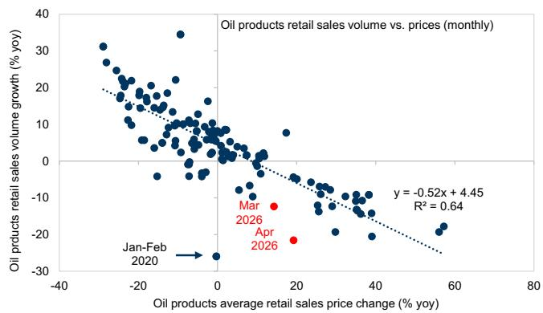

<details>
<summary>scatter</summary>

| Date       | Oil products average retail sales price change (% yoy) | Oil products retail sales volume growth (% yoy) |
| ---------- | ---------------------------------------------------- | ----------------------------------------------- |
| Mar 2026   | ~15                                                  | ~-10                                            |
| Apr 2026   | ~20                                                  | ~-20                                            |
| Jan-Feb 2020 | ~-10                                                 | ~35                                             |
</details>

Our sample period includes January 2015 – April 2026.

Exhibit 9: Domestic retail oil product sales volume contracted by 17% yoy during March-April whereas retail prices gained 17%   
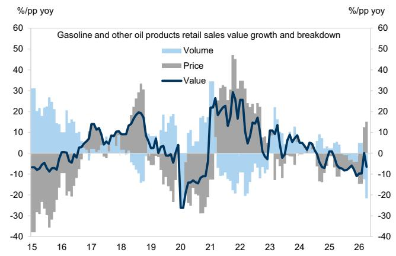

<details>
<summary>line</summary>

| Year | Volume (%/pp yoy) | Price (%/pp yoy) | Value (%/pp yoy) |
|------|-------------------|------------------|------------------|
| 15   | ~30               | ~-40             | ~-10             |
| 16   | ~20               | ~-30             | ~-5              |
| 17   | ~15               | ~-20             | ~5               |
| 18   | ~10               | ~-10             | ~10              |
| 19   | ~5                | ~0               | ~20              |
| 20   | ~0                | ~-30             | ~-30             |
| 21   | ~35               | ~30              | ~30              |
| 22   | ~25               | ~45              | ~25              |
| 23   | ~15               | ~20              | ~15              |
| 24   | ~10               | ~10              | ~10              |
| 25   | ~5                | ~0               | ~5               |
| 26   | ~0                | ~-10             | ~0               |
</details>

Source: NBS, Wind, Data compiled by GS Global Investment Research   
Source: NDRC, Wind, CEIC, GS Global Investment Research

Government intervention cost appears modest and sustainable ...

In a counterfactual scenario with international price increases fully passed through to domestic retail prices but no change to domestic oil consumption, we estimate that weighted average retail fuel prices in March-April 2026 would have been $15\%$ higher than observed. On an annualized basis, the gap in domestic oil consumption value between this counterfactual scenario and the actual outcome would be around RMB400bn, equivalent to $0.3\%$ of 2026 nominal GDP. Because January-February was not yet affected by the global energy-supply shock, the full-year 2026 intervention cost should be lower, at roughly 25bp of GDP. These numbers are very small relative to our forecasts for China's effective and augmented fiscal deficits this year ( $5.3\%$ and $12.0\%$ of GDP, respectively), suggesting that the broad government sector can comfortably absorb the intervention cost if international prices continue to fluctuate within the recent range.

# ... and could be offset by other buffers

That said, we do not expect the intervention cost to fully fall on the government and the refining sector, because part of it should be offset by other buffers, including mark-to-market gains on oil inventories and stronger margins in exploration and production.

As policy priorities have increasingly focused on securing domestic energy supply chains, China has continued to build oil inventories over the past decade through the national Strategic Petroleum Reserve (SPR), commercial reserve, and refinery reserve (Exhibit 10). Stockpiling accelerated last year when oil prices were relatively low, echoing the pattern seen in 2019-20 (Exhibit 11). With oil prices higher this year, oil refiners may have benefited from mark-to-market gains on those inventories.

Exhibit 10: China's visible oil inventory level has been on the rise since 2022 ...   
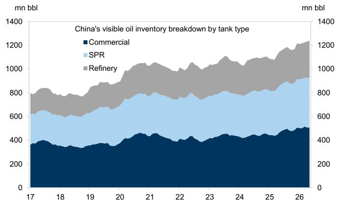

<details>
<summary>area_stacked</summary>

| Year | Commercial (mn bbl) | SPR (mn bbl) | Refinery (mn bbl) |
|------|---------------------|--------------|-------------------|
| 17   | ~350                | ~300         | ~250              |
| 18   | ~350                | ~300         | ~250              |
| 19   | ~350                | ~300         | ~250              |
| 20   | ~400                | ~350         | ~300              |
| 21   | ~450                | ~400         | ~350              |
| 22   | ~400                | ~400         | ~400              |
| 23   | ~450                | ~450         | ~450              |
| 24   | ~450                | ~450         | ~500              |
| 25   | ~450                | ~500         | ~550              |
| 26   | ~500                | ~550         | ~600              |
</details>

SPR refers to the national Strategic Petroleum Reserve.   
Source: Kpler, GS Global Investment Research

Exhibit 11: ... with rapid stockpiling in 2025 when oil prices were relatively low   
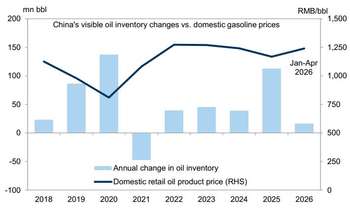

<details>
<summary>bar_line</summary>

China's visible oil inventory changes vs. domestic gasoline prices
| Year | Annual change in oil inventory (mn bbl) | Domestic retail oil product price (RHS) |
| :--- | :--- | :--- |
| 2018 | 25 | 1200 |
| 2019 | 85 | 1000 |
| 2020 | 135 | 600 |
| 2021 | -45 | 1100 |
| 2022 | 40 | 1300 |
| 2023 | 45 | 1300 |
| 2024 | 40 | 1250 |
| 2025 | 110 | 1150 |
| Jan-Apr 2026 | 15 | 1250 |
</details>

Our measure of China's visible oil inventory includes Strategic Petroleum Reserve (SPR), commercial reserve and refinery reserve.   
Source: Kpler, Wind, GS Global Investment Research

Moreover, among all the businesses of oil companies, although refining and chemicals operations may come under pressure, higher oil prices should support profits in exploration and production. The annual operating profits of China’s “Big Three” oil companies averaged RMB480bn during 2021-25, peaking in 2022 when the Russia-Ukraine war drove oil prices sharply higher (Exhibit 12). On a quarterly basis, despite the recent oil-price shock, the “Big Three” saw operating profit growth rebound in Q1 2026 (Exhibit 13).

Exhibit 12: China's "Big Three" Oil Giants operating profits averaged RMB480bn over the past five years   
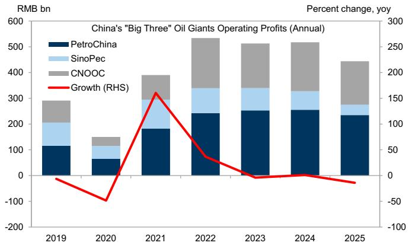

<details>
<summary>bar_stacked</summary>

China's "Big Three" Oil Giants Operating Profits (Annual)
| Year | PetroChina (RMB bn) | SinoPec (RMB bn) | CNOOC (RMB bn) | Growth (RHS) (Percent change, yoy) |
|---|---|---|---|---|
| 2019 | 110 | 70 | 60 | -30 |
| 2020 | 60 | 40 | 30 | -80 |
| 2021 | 180 | 100 | 70 | 160 |
| 2022 | 240 | 80 | 150 | 40 |
| 2023 | 250 | 70 | 130 | 0 |
| 2024 | 255 | 65 | 135 | 5 |
| 2025 | 230 | 60 | 130 | -15 |
</details>

Source: Company data, Wind, Data compiled by GS Global Investment Research

Exhibit 13: Despite the global energy-supply shock, oil giants operating profit growth rebounded in Q1 2026   
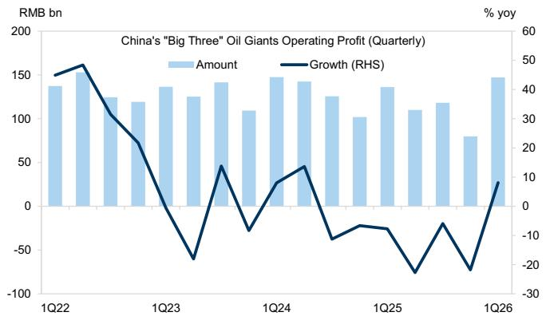

<details>
<summary>bar_line</summary>

China's "Big Three" Oil Giants Operating Profit (Quarterly)
| Quarter | Amount (RMB bn) | Growth (%) yoy (%) |
| :--- | :--- | :--- |
| 1Q22 | 140 | 45 |
| 2Q22 | 155 | 50 |
| 3Q22 | 125 | 30 |
| 4Q22 | 115 | 15 |
| 1Q23 | 135 | -10 |
| 2Q23 | 125 | -20 |
| 3Q23 | 140 | -60 |
| 4Q23 | 110 | -15 |
| 1Q24 | 145 | 10 |
| 2Q24 | 140 | 15 |
| 3Q24 | 125 | -10 |
| 4Q24 | 100 | -15 |
| 1Q25 | 135 | -10 |
| 2Q25 | 110 | -20 |
| 3Q25 | 115 | -5 |
| 4Q25 | 75 | -20 |
| 1Q26 | 145 | 8 |
</details>

Source: Company data, Wind, Data compiled by GS Global Investment Research

# Lisheng Wang

The author would like to thank Samson Yau, an intern on the Asia Economics team, for his contribution to this report.

# The China Economics Team

# Andrew Tilton

+852-2978-1802

andrew.tilton@gs.com

GS (Asia) L.L.C.

# Xinquan Chen

+852-2978-2418

xinquan.chen@gs.com

GS (Asia) L.L.C.

# Hui Shan

+852-2978-6634

hui.shan@gs.com

GS (Asia) L.L.C.

# Yuting Yang

+852-2978-7283

yuting.y.yang@gs.com

GS (Asia) L.L.C.

# Lisheng Wang

+852-3966-4004

lisheng.wang@gs.com

GS (Asia) L.L.C.

# Chelsea Song

+852-2978-0106

chelsea.song@gs.com

GS (Asia) L.L.C.

# Disclosure Appendix

# Reg AC

I, Lisheng Wang, hereby certify that all of the views expressed in this report accurately reflect my personal views, which have not been influenced by considerations of the firm's business or client relationships.

Unless otherwise stated, the individuals listed on the cover page of this report are analysts in GS' Global Investment Research division.

Contributing Authors: Lisheng Wang GS (Asia) L.L.C..

Unless otherwise stated, the individuals listed in the Contributing Authors disclosure of this report are analysts in GS' Global Investment Research division.

# Disclosures

# Regulatory disclosures

# Disclosures required by United States laws and regulations

See company-specific regulatory disclosures above for any of the following disclosures required as to companies referred to in this report: manager or co-manager in a pending transaction; 1% or other ownership; compensation for certain services; types of client relationships; managed/co-managed public offerings in prior periods; directorships; for equity securities, market making and/or specialist role. GS trades or may trade as a principal in debt securities (or in related derivatives) of issuers discussed in this report.

The following are additional required disclosures: Ownership and material conflicts of interest: GS policy prohibits its analysts, professionals reporting to analysts and members of their households from owning securities of any company in the analyst's area of coverage. Analyst compensation: Analysts are paid in part based on the profitability of GS, which includes investment banking revenues. Analyst as officer or director: GS policy generally prohibits its analysts, persons reporting to analysts or members of their households from serving as an officer, director or advisor of any company in the analyst's area of coverage. Non-U.S. Analysts: Non-U.S. analysts may not be associated persons of GS & Co. LLC and therefore may not be subject to FINRA Rule 2241 or FINRA Rule 2242 restrictions on communications with a subject company, public appearances and trading in securities covered by the analysts.

# Additional disclosures required under the laws and regulations of jurisdictions other than the United States

The following disclosures are those required by the jurisdiction indicated, except to the extent already made above pursuant to United States laws and regulations. Australia: GS Australia Pty Ltd and its affiliates are not authorised deposit-taking institutions (as that term is defined in the Banking Act 1959 (Cth)) in Australia and do not provide banking services, nor carry on a banking business, in Australia. This research, and any access to it, is intended only for “wholesale clients” within the meaning of the Australian Corporations Act, unless otherwise agreed by GS. In producing research reports, members of Global Investment Research of GS Australia may attend site visits and other meetings hosted by the companies and other entities which are the subject of its research reports. In some instances the costs of such site visits or meetings may be met in part or in whole by the issuers concerned if GS Australia considers it is appropriate and reasonable in the specific circumstances relating to the site visit or meeting. To the extent that the contents of this document contains any financial product advice, it is general advice only and has been prepared by GS without taking into account a client’s objectives, financial situation or needs. A client should, before acting on any such advice, consider the appropriateness of the advice having regard to the client’s own objectives, financial situation and needs. A copy of certain GS Australia and New Zealand disclosure of interests and a copy of GS’ Australian Sell-Side Research Independence Policy Statement are available at: https://www.goldmansachs.com/disclosures/australia-new-zealand/index.html. Brazil: Disclosure information in relation to CVM Resolution n. 20 is available at https://www.gs.com/worldwide/brazil/area/gir/index.html. Where applicable, the Brazil-registered analyst primarily responsible for the content of this research report, as defined in Article 20 of CVM Resolution n. 20, is the first author named at the beginning of this report, unless indicated otherwise at the end of the text. Canada: This information is being provided to you for information purposes only and is not, and under no circumstances should be construed as, an advertisement, offering or solicitation by GS & Co. LLC for purchasers of securities in Canada to trade in any Canadian security. GS & Co. LLC is not registered as a dealer in any jurisdiction in Canada under applicable Canadian securities laws and generally is not permitted to trade in Canadian securities and may be prohibited from selling certain securities and products in certain jurisdictions in Canada. If you wish to trade in any Canadian securities or other products in Canada please contact GS Canada Inc., an affiliate of The GS Group Inc., or another registered Canadian dealer. Hong Kong: Further information on the securities of covered companies referred to in this research may be obtained on request from GS (Asia) L.L.C. India: Further information on the subject company or companies referred to in this research may be obtained from GS (India) Securities Private Limited, Research Analyst - SEBI Registration Number INH000001493, 10th Floor, Ascent-Worli, Sudam Kalu Ahire Marg, Worli, Mumbai-400 025, India, Corporate Identity Number U74140MH2006FTC160634, Phone +91 22 6616 9000, Fax +91 22 6616 9001. GS may beneficially own 1% or more of the securities (as such term is defined in clause 2 (h) the Indian Securities Contracts (Regulation) Act, 1956) of the subject company or companies referred to in this research report. Investment in securities market are subject to market risks. Read all the related documents carefully before investing. Registration granted by SEBI and certification from NISM in no way guarantee performance of the intermediary or provide any assurance of returns to investors. GS (India) Securities Private Limited compliance officer and investor grievance contact details can be found at: https://www.goldmansachs.com/worldwide/india/documents/Grievance-Redressal-and-Escalation-Matrix.pdf, and a copy of the annual audit compliance report can be found at this link: https://publishing.gs.com/content/site/india-annual-compliance-report.html. Japan: See below. Korea: This research, and any access to it, is intended only for “professional investors” within the meaning of the Financial Services and Capital Markets Act, unless otherwise agreed by GS. Further information on the subject company or companies referred to in this research may be obtained from GS (Asia) L.L.C., Seoul Branch. New Zealand: GS New Zealand Limited and its affiliates are neither “registered banks” nor “deposit takers” (as defined in the Reserve Bank of New Zealand Act 1989) in New Zealand. This research, and any access to it, is intended for “wholesale clients” (as defined in the Financial Advisers Act 2008) unless otherwise agreed by GS. A copy of certain GS Australia and New Zealand disclosure of interests is available at: https://www.goldmansachs.com/disclosures/australia-new-zealand/index.html. Russia: Research reports distributed in the Russian Federation are not advertising as defined in the Russian legislation, but are information and analysis not having product promotion as their main purpose and do not provide appraisal within the meaning of the Russian legislation on appraisal activity. Research reports do not constitute a personalized investment recommendation as defined in Russian laws and regulations, are not addressed to a specific client, and are prepared without analyzing the financial circumstances, investment profiles or risk profiles of clients. GS assumes no responsibility for any investment decisions that may be taken by a client or any other person based on this research report. Singapore: GS (Singapore) Pte. (Company Number: 198602165W), which is regulated by the Monetary Authority of Singapore, accepts legal responsibility for this research, and should be contacted with respect to any matters arising from, or in connection with, this research. Taiwan: This material is for reference only and must not be reprinted without permission. Investors should carefully consider their own investment risk. Investment results are the responsibility of the individual investor. United Kingdom: Persons who would be categorized as retail clients in the United Kingdom, as such term is defined in the rules of the Financial Conduct Authority, should read this research in conjunction with prior GS on the covered

companies referred to herein and should refer to the risk warnings that have been sent to them by GS International. A copy of these risks warnings, and a glossary of certain financial terms used in this report, are available from GS International on request.

European Union and United Kingdom: Disclosure information in relation to Article 6 (2) of the European Commission Delegated Regulation (EU) (2016/958) supplementing Regulation (EU) No 596/2014 of the European Parliament and of the Council (including as that Delegated Regulation is implemented into United Kingdom domestic law and regulation following the United Kingdom's departure from the European Union and the European Economic Area) with regard to regulatory technical standards for the technical arrangements for objective presentation of investment recommendations or other information recommending or suggesting an investment strategy and for disclosure of particular interests or indications of conflicts of interest is available at https://www.gs.com/disclosures/europeanpolicy.html which states the European Policy for Managing Conflicts of Interest in Connection with Investment Research.

Japan: GS Japan Co., Ltd. is a Financial Instrument Dealer registered with the Kanto Financial Bureau under registration number Kinsho 69, and a member of Japan Securities Dealers Association, Financial Futures Association of Japan Type II Financial Instruments Firms Association, and Investment Management Association of Japan. Sales and purchase of equities are subject to commission pre-determined with clients plus consumption tax. See company-specific disclosures as to any applicable disclosures required by Japanese stock exchanges, the Japanese Securities Dealers Association or the Japanese Securities Finance Company.

# Global product; distributing entities

GS Global Investment Research produces and distributes research products for clients of GS on a global basis. Analysts based in GS offices around the world produce research on industries and companies, and research on macroeconomics, currencies, commodities and portfolio strategy. This research is disseminated in Australia by GS Australia Pty Ltd (ABN 21 006 797 897); in Brazil by GS do Brasil Corretora de Títulos e Valores Mobiliários S.A.; Public Communication Channel GS Brazil: 0800 727 5764 and / or contatogoldmanbrasil@gs.com. Available Weekdays (except holidays), from 9am to 6pm. Canal de Comunicação com o Público GS Brasil: 0800 727 5764 e/ou contatogoldmanbrasil@gs.com. Horário de funcionamento: segunda-feira à sexta-feira (exceto feriados), das 9h às 18h; in Canada by GS & Co. LLC; in Hong Kong by GS (Asia) L.L.C.; in India by GS (India) Securities Private Ltd.; in Japan by GS Japan Co., Ltd.; in the Republic of Korea by GS (Asia) L.L.C., Seoul Branch; in New Zealand by GS New Zealand Limited; in Russia by OOO GS; in Singapore by GS (Singapore) Pte. (Company Number: 198602165W); and in the United States of America by GS & Co. LLC. GS International has approved this research in connection with its distribution in the United Kingdom.

GS International (“GSI”), authorised by the Prudential Regulation Authority (“PRA”) and regulated by the Financial Conduct Authority (“FCA”) and the PRA, has approved this research in connection with its distribution in the United Kingdom.

European Economic Area: GS Bank Europe SE (“GSBE”) is a credit institution incorporated in Germany and, within the Single Supervisory Mechanism, subject to direct prudential supervision by the European Central Bank and in other respects supervised by German Federal Financial Supervisory Authority (Bundesanstalt für Finanzdienstleistungsaufsicht, BaFin) and Deutsche Bundesbank and disseminates research within the European Economic Area.

# General disclosures

This research is for our clients only. Other than disclosures relating to GS, this research is based on current public information that we consider reliable, but we do not represent it is accurate or complete, and it should not be relied on as such. The information, opinions, estimates and forecasts contained herein are as of the date hereof and are subject to change without prior notification. We seek to update our research as appropriate, but various regulations may prevent us from doing so. Other than certain industry reports published on a periodic basis, the large majority of reports are published at irregular intervals as appropriate in the analyst's judgment.

GS conducts a global full-service, integrated investment banking, investment management, and brokerage business. We have investment banking and other business relationships with a substantial percentage of the companies covered by Global Investment Research. GS & Co. LLC, the United States broker dealer, is a member of SIPC (https://www.sipc.org).

Our salespeople, traders, and other professionals may provide oral or written market commentary or trading strategies to our clients and principal trading desks that reflect opinions that are contrary to the opinions expressed in this research. Our asset management area, principal trading desks and investing businesses may make investment decisions that are inconsistent with the recommendations or views expressed in this research.

We and our affiliates, officers, directors, and employees will from time to time have long or short positions in, act as principal in, and buy or sell, the securities or derivatives, if any, referred to in this research, unless otherwise prohibited by regulation or GS policy.

The views attributed to third party presenters at GS arranged conferences, including individuals from other parts of GS, do not necessarily reflect those of Global Investment Research and are not an official view of GS.

Any third party referenced herein, including any salespeople, traders and other professionals or members of their household, may have positions in the products mentioned that are inconsistent with the views expressed by analysts named in this report.

This research is focused on investment themes across markets, industries and sectors. It does not attempt to distinguish between the prospects or performance of, or provide analysis of, individual companies within any industry or sector we describe.

Any trading recommendation in this research relating to an equity or credit security or securities within an industry or sector is reflective of the investment theme being discussed and is not a recommendation of any such security in isolation.

This research is not an offer to sell or the solicitation of an offer to buy any security in any jurisdiction where such an offer or solicitation would be illegal. It does not constitute a personal recommendation or take into account the particular investment objectives, financial situations, or needs of individual clients. Clients should consider whether any advice or recommendation in this research is suitable for their particular circumstances and, if appropriate, seek professional advice, including tax advice. The price and value of investments referred to in this research and the income from them may fluctuate. Past performance is not a guide to future performance, future returns are not guaranteed, and a loss of original capital may occur. Fluctuations in exchange rates could have adverse effects on the value or price of, or income derived from, certain investments.

Certain transactions, including those involving futures, options, and other derivatives, give rise to substantial risk and are not suitable for all investors. Investors should review current options and futures disclosure documents which are available from GS sales representatives or at https://www.theocc.com/about/publications/character-risks.jsp and https://www.goldmansachs.com/disclosures/cftc\_fcm\_disclosures. Transaction costs may be significant in option strategies calling for multiple purchase and sales of options such as spreads. Supporting documentation will be supplied upon request.

Differing Levels of Service provided by Global Investment Research: The level and types of services provided to you by GS Global Investment Research may vary as compared to that provided to internal and other external clients of GS, depending on various factors including your individual preferences as to the frequency and manner of receiving communication, your risk profile and investment focus and perspective (e.g.,

marketwide, sector specific, long term, short term), the size and scope of your overall client relationship with GS, and legal and regulatory constraints. As an example, certain clients may request to receive notifications when research on specific securities is published, and certain clients may request that specific data underlying analysts' fundamental analysis available on our internal client websites be delivered to them electronically through data feeds or otherwise. No change to an analyst's fundamental research views (e.g., ratings, price targets, or material changes to earnings estimates for equity securities), will be communicated to any client prior to inclusion of such information in a research report broadly disseminated through electronic publication to our internal client websites or through other means, as necessary, to all clients who are entitled to receive such reports.

All research reports are disseminated and available to all clients simultaneously through electronic publication to our internal client websites. Not all research content is redistributed to our clients or available to third-party aggregators, nor is GS responsible for the redistribution of our research by third party aggregators. For research, models or other data related to one or more securities, markets or asset classes (including related services) that may be available to you, please contact your GS representative or go to https://research.gs.com.

Disclosure information is also available at https://www.gs.com/research/hedge.html or from Research Compliance, 200 West Street, New York, NY 10282.

# © 2026 GS.

You are permitted to store, display, analyze, modify, reformat, and print the information made available to you via this service only for your own use. You may not resell or reverse engineer this information to calculate or develop any index for disclosure and/or marketing or create any other derivative works or commercial product(s), data or offering(s) without the express written consent of GS. You are not permitted to publish, transmit, or otherwise reproduce this information, in whole or in part, in any format to any third party without the express written consent of GS. This foregoing restriction includes, without limitation, using, extracting, downloading or retrieving this information, in whole or in part, to train or finetune a machine learning or artificial intelligence system, or to provide or reproduce this information, in whole or in part, as a prompt or input to any such system.