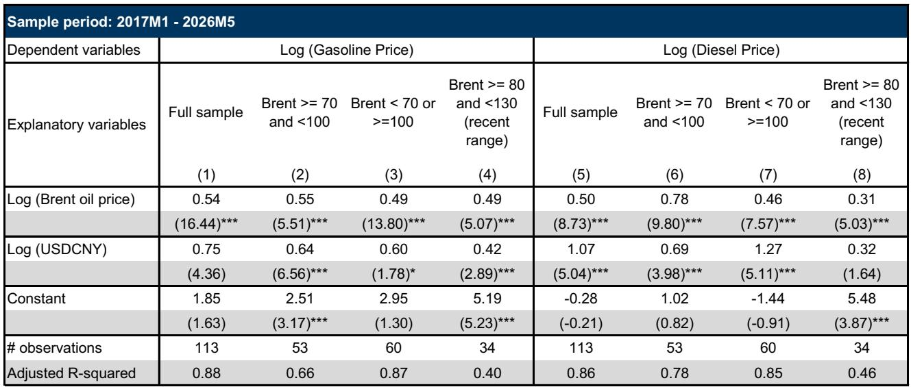
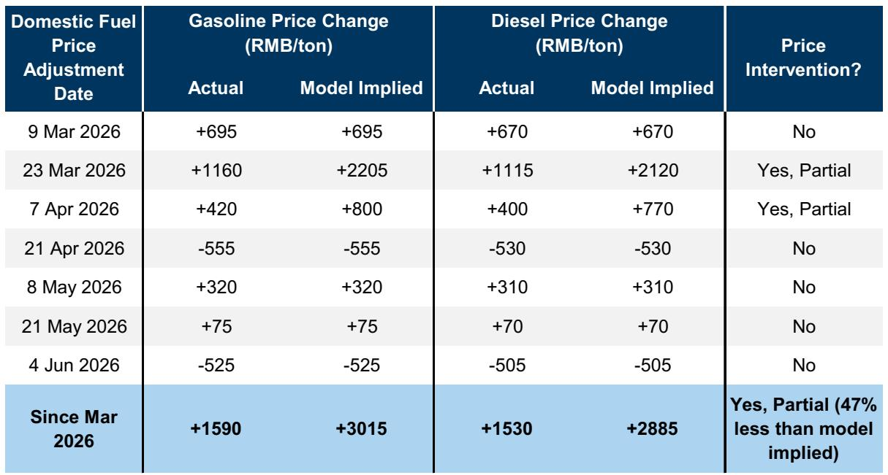

# 中国油价调控的真正成本，比市场担心的低得多

当霍尔木兹海峡的阴影笼罩全球能源市场，3月以来布伦特原油在每桶80-130美元区间剧烈波动时，中国决策者面临一个老问题：如何在外部冲击与内部稳定之间找到平衡。市场普遍关注油价上涨对通胀和消费的冲击，但这份来自某外资投行的研报给出了一个反直觉的核心判断：中国零售燃油价格管理的财政成本是可控的，年化不到GDP的0.3%，且这一成本正在被结构性变量——尤其是新能源汽车的加速渗透——所稀释。

真正值得关注的不是短期油价波动本身，而是中国在应对这场危机中暴露出的定价机制弹性、需求侧的结构性转移，以及政策空间的实际边界。这份报告的深度在于，它没有停留在描述“政府干预了什么”，而是量化了“干预的代价有多大”，并指出了“哪些成本被市场高估了”。

以下是我们从这份研报中提炼出的五个核心洞察。

## 1. 定价机制的核心不是“补贴”，而是一个精密的非线性传导器

中国成品油定价机制常被外界简单理解为“政府补贴油价”，但报告揭示的框架远比这复杂。其核心是一个以国际原油价格每桶40-130美元为边界的非线性传导系统。

当布伦特原油低于40美元时，国内零售价格不再下调，价差部分进入“风险准备金”，用于节能减碳和油品升级。当高于130美元时，零售价格冻结，政府通过转移支付补偿炼油商损失。而在40-130美元的正常区间内，每桶80美元又构成一个关键阈值：低于80美元时，国际价格变动几乎全额传导；高于80美元时，政府启动“部分传导”机制，要求炼油商通过压缩加工利润来吸收部分冲击。

这个机制的精妙之处在于，它天然具备“自动稳定器”功能。在油价温和上涨时，市场化传导维持了价格信号的有效性；在油价极端波动时，行政干预介入保护实体经济。报告特别指出，自中东冲突以来，国家发改委在七次调价中，实际累计上调幅度比模型隐含的理论值低了约47%，相当于只传导了国际涨幅的一半。

这意味着什么？对于下游企业和消费者，这是一个“成本缓释器”，但代价由上游炼油环节承担。对于投资者，这意味着中石化、中石油等国有炼油商的利润表，实质上承载了部分宏观稳定职能——这是评估这些公司估值时不能忽略的制度性折价。

## 2. 需求侧的反应正在偏离历史规律，替代效应比预期更强

报告中最具洞察力的发现之一，是需求对价格的反应弹性正在发生结构性变化。历史数据显示，国内零售油价每上涨10%，成品油零售量大约下降5%。但2026年3-4月的实际数据却呈现出一个显著偏离：零售均价同比上涨17%的同时，零售量同比下降了17%。

这意味着需求弹性从约0.5跃升至约1.0，翻了一倍。报告给出的解释是，非石油能源供应和新能源汽车的快速普及，提供了比以往油价上涨周期更广泛的替代选择。这不是一个短期现象，而是一个结构性拐点。

数据支撑了这一判断：新能源汽车渗透率从2016年的1%上升到2025年的54%，2026年5月进一步攀升至63%。五一假期期间，高速公路电动车充电需求同比增长52.8%，而私家车出行仅增长2.6%。这些数字共同指向一个结论：中国经济的石油需求强度正在加速下降。

对于关注能源转型的投资者，这意味着传统石油需求的“价格弹性”正在被“技术替代弹性”所覆盖。油价越高，替代速度越快，形成一个自我强化的负反馈循环。这反过来又降低了长期油价冲击对中国经济的潜在伤害——这是一个市场尚未充分定价的宏观韧性来源。

## 3. 财政成本被高估了，但隐性成本在炼油商的资产负债表上

市场对油价干预的担忧，往往集中在“财政补贴会拖累政府预算”。报告用数据打消了这个疑虑：根据估算，政府干预的年化成本仅占GDP的0.3%左右，并且这一成本还可以通过库存估值收益和上游盈利能力增强来进一步对冲。

但“财政成本可控”不等于“没有成本”。成本只是被转移到了不同的承担者身上。报告明确指出，当国际油价高于80美元/桶时，国有炼油商被要求吸收部分涨价压力，这意味着它们的加工利润被压缩。这是一种隐性的“准财政支出”，不体现在政府预算中，但体现在国有企业的利润表中。

此外，报告还揭示了一个容易被忽视的细节：成品油只占中国石油产品消费总量的46%。汽油和柴油以外的产品——如液化石油气、石脑油、燃料油——定价更为市场化，炼油商可以更灵活地将国际价格变动传导给下游买家。这意味着，整个石油产品的加权平均传导率，要高于报告估算的汽油和柴油约0.5的水平。对于化工、物流等行业的成本分析，只看汽油柴油价格是不够的，需要关注更广泛的石油产品价格传导链条。

## 4. 供应侧调整正在重塑贸易流向，但存在一个尚未回答的关键问题

除了价格干预，中国还采取了供应侧的应对措施：临时收紧成品油出口、从俄罗斯和拉丁美洲大幅增加原油进口。报告估算，3-4月中国原油进口总量同比下降11%，但结构发生了剧烈变化：中东进口暴跌38%，而俄罗斯进口增长13%，拉丁美洲进口增长64%。

这种“东退西进”的贸易流向调整，在短期内缓解了供应缺口，但报告没有完全展开的一个关键问题是：这种替代的可持续性如何？中东原油的API度和含硫量与俄罗斯、拉美原油存在差异，这可能影响炼油厂的运营效率和产品产出结构。此外，长期依赖非中东原油，意味着中国在能源安全上需要承担不同的地缘政治成本和运输风险。这些二阶效应，报告没有给出量化评估，但却是产业决策者必须纳入考量的变量。

另一个悬而未决的问题是，政府正在利用这次冲击加速“新三样”——电动汽车、锂电池、太阳能——的政策支持。这无疑会降低经济的长期化石燃料依赖，但加速的节奏是否会在油价回落后面临政策回摆？这是一个值得跟踪的观察点。

## 5. 一个被低估的观察框架：政策干预的“隐形成本”与“显性收益”需要分开看

对于决策者和投资者而言，这份报告提供了一个更精细的分析框架：不要将“财政成本”等同于“总社会成本”。

显性财政成本是可控的，不到GDP的0.3%。但隐性成本包括：国有炼油商的利润压缩、贸易伙伴结构变化带来的运营效率损失、以及长期依赖行政干预可能弱化的价格信号功能。另一方面，显性收益包括：保护了农业、公共交通等敏感部门的正常运营，避免了油价冲击向通胀的全面传导。隐性收益则包括：加速了新能源汽车替代，推动了能源独立战略的实质性进展。

这个框架的实用价值在于，它帮助读者区分“短期稳定”与“长期转型”之间的权衡。当前的政策组合，本质上是用短期财政成本和炼油商利润，换取长期的能源结构优化和外部冲击韧性。只要隐性收益的现值大于隐性成本，这套干预就是合理的。报告的数据暗示，这个不等式可能正在成立。

当然，报告没有完全回答的一个深层问题是：如果布伦特原油持续运行在100美元以上，甚至逼近130美元的天花板，干预成本会如何非线性地攀升？当前的估算基于“近期波动区间”的假设，但极端情景下的财政压力测试，才是真正检验这套机制韧性的试金石。

---

这份报告提供了中国油价调控的完整拼图，但正如我们所指出的，几个关键问题——贸易替代的可持续性、极端情景下的财政压力、政策加速的持续性——仍有待深入讨论。在完整报告中，分析师还提供了更详细的子样本回归结果、分产品的传导率比较，以及库存估值收益的对冲机制测算。

欢迎来星球微信群里继续讨论这些未解问题，一起拆解报告中的图表数据，探讨不同情景下的投资含义。

Personal reading notes and learning share only. Not investment advice.

