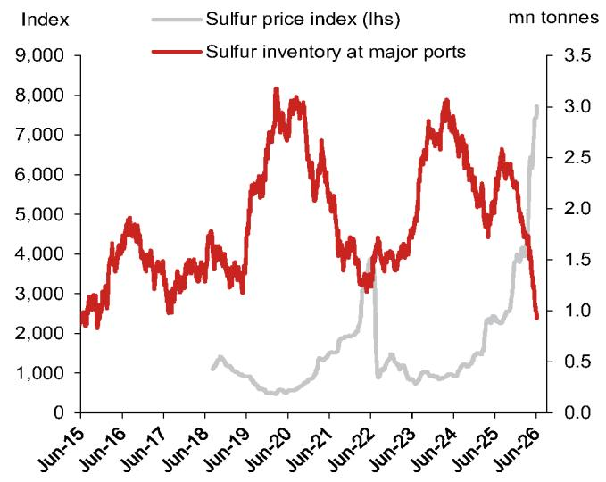
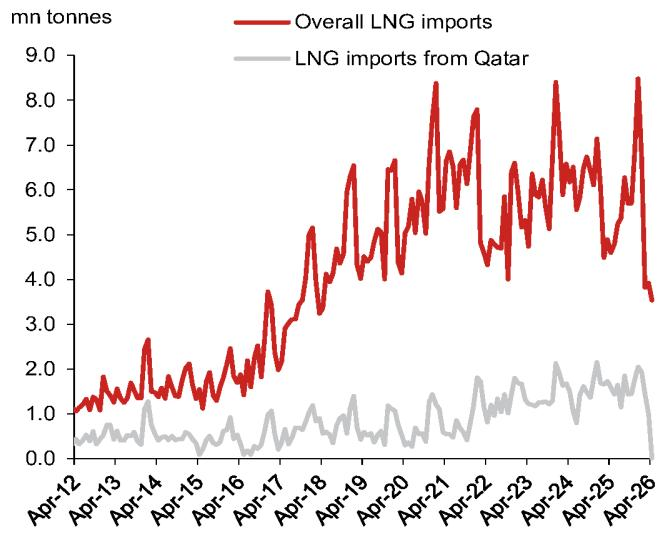
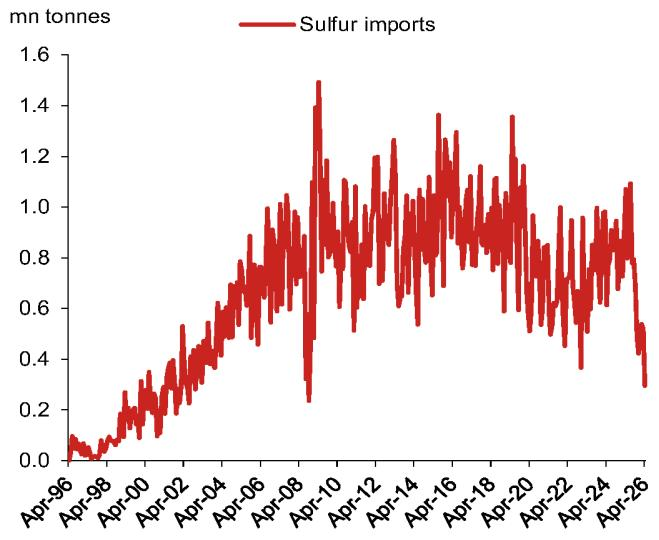

# China's Raw Material Crisis Is Already Reshaping Its Industrial Trajectory, and the Worst May Be Yet to Come

The sharp slowdown in China's April industrial production was not a broad-based demand shock. It was a supply-side seizure concentrated in two sectors: oil processing and chemicals. Together, these sectors account for roughly 40 percent of China's raw materials industry and about 15 percent of total industrial output. Our analysis of the April data reveals that the direct and indirect drag from these two sectors likely explains half of the 1.6 percentage point deceleration in headline IP growth. Without the offsetting boost from the AI-driven electronics sector, IP growth would have fallen below 4 percent. This is not a transient blip. With the Strait of Hormuz blockade potentially persisting through September, the supply bottleneck is set to deepen, not ease.

The conventional narrative has focused on China's domestic demand weakness. That story is incomplete. The April IP miss was far worse than consensus expectations of 6.0 percent, and even undershot our own cautious forecast of 5.2 percent. The culprit was not a sudden collapse in consumer spending or property investment. It was a raw material supply crunch originating thousands of kilometers away, in the Middle East. The implication is clear: China's industrial engine is now vulnerable to external supply disruptions in ways that many investors have underestimated. The question is no longer whether the disruption will pass, but how deeply it will reshape China's production structure, trade flows, and policy priorities.

This article unpacks the mechanisms of the disruption, traces its propagation through the industrial chain, and identifies the strategic decisions that will determine whether China can contain the damage or whether the crisis will metastasize into a broader economic drag.

## The April IP Collapse Was Not a Demand Problem; It Was a Raw Material Supply Shock That Cut Deeply Into Two Critical Sectors

The headline numbers tell a stark story. IP growth slowed to 4.1 percent year-on-year in April, the lowest monthly reading in nearly three years. But the composition matters more than the aggregate. The oil, coal, and other fuel processing sector saw its IP growth plunge from 8.1 percent in March to negative 0.9 percent in April. Crude oil processing volumes contracted by 5.8 percent year-on-year, worsening from a 2.2 percent decline in March. Asphalt output, a byproduct of crude oil used extensively in road construction, collapsed by 40.1 percent year-on-year, more than doubling its March decline of 19.7 percent.

The chemical sector followed a similar trajectory. Chemical raw materials and products IP growth slowed to 5.3 percent from 9.0 percent. Chemical fiber manufacturing dropped to 2.2 percent, its lowest since March 2023. Sulfuric acid output, a foundational input for fertilizers and industrial processes, fell by 2.2 percent year-on-year after growing 6.2 percent in March. The common thread is a shortage of imported crude oil, LNG, and derivative feedstocks. As refineries cut runs and chemical plants reduce throughput, the effects cascade downstream.

The direct drag from oil and chemicals alone was about 0.70 percentage points on April IP growth. Adding indirect effects through supply chains, our estimate is that these two sectors account for roughly half of the total deceleration. Meanwhile, the electronics sector, buoyed by global AI investment, accelerated to 15.6 percent growth and contributed a 0.4 percentage point boost. Remove that tailwind, and the underlying IP picture is materially weaker than the headline suggests.

## High-Frequency Data Confirm the Supply Damage Has Extended into May and June, With Operating Rates Falling Across the Entire Refining and Petrochemical Chain

Weekly operating rate data from May and early June leave no doubt that the disruption is not abating. The operating rate of Shandong teapot refineries, which manage roughly 25 percent of China's refining capacity, dropped to 53.6 percent in early June from 60.0 percent at end-April. The monthly average operating rate in May fell to 6.2 percentage points above last year's level, down from 7.0 points in April and 9.7 points in March. These small, independent refineries are the canary in the coal mine for the broader refining system.

Asphalt factory operating rates tell an even more alarming story. They dipped to 13.3 percent in early June from 16.2 percent at end-April and 19.3 percent at end-March. The May average was 14.6 percentage points below last year's level, a deterioration from 11.2 points below in April. Given asphalt's role in infrastructure construction, this decline signals that the supply disruption is beginning to feed into fixed asset investment, not just industrial production.

The petrochemical chain shows similar stress. Purified terephthalic acid (PTA) factory operating rates fell sharply to 59.3 percent at end-May from 69.0 percent at end-April. Downstream, polyester filament yarn (PFY) factories in Jiangsu and Zhejiang saw operating rates drop to 79.2 percent from 81.9 percent. The monthly average for PFY in May was 10.3 percentage points below last year, worsening from 10.1 points below in April. The entire textile and synthetic fiber supply chain is being squeezed by raw material shortages.

The official manufacturing PMI for May, which came in at 50.0, masks this deterioration. When adjusted for the suppliers' delivery time sub-index, which is inverted, the headline PMI likely dipped below 50. The NBS specifically identified petroleum, coal processing, chemical fibers, and rubber and plastic products as major drags, with both production and new orders sub-indices remaining below 50. The data are consistent: the supply shock is persisting and broadening.

## The Import Data Reveal the Depth of the Disruption: Crude Oil Imports at Three-Year Lows, LNG Imports at Seven-Year Lows, and Sulfur Imports at Levels Not Seen Since 2008

Before the conflict, 50 percent of China's oil imports and 16 percent of its natural gas imports transited the Strait of Hormuz. The blockage and damage to Middle Eastern energy facilities are now visible in the trade data. In April, China's crude oil import volume slumped by 20.0 percent year-on-year to its lowest level since August 2022. Replacement from Russia has been insufficient; Russian oil import growth slowed to 11.3 percent year-on-year in April and 13.8 percent in March, following a 40.9 percent spike in January-February.

The naphtha import data are even more striking. Naphtha, a lightly refined petroleum product used to produce ethylene and propylene, saw imports plunge by 51.3 percent year-on-year in April, worsening from a 35.7 percent drop in March. China's import reliance on naphtha is about 17 percent, with roughly 40 percent of those imports coming from the Persian Gulf. The supply chain for plastics, fibers, and rubbers is being directly impaired.

LNG imports tumbled by 23.1 percent year-on-year in April to the lowest monthly reading since April 2018. The reason is stark: imports from Qatar crashed by 99.4 percent year-on-year due to damage to the Ras Laffan export facility. For a country that has invested heavily in gas-based industrial and residential infrastructure, this is a significant strategic vulnerability.

Perhaps most concerning is sulfur. China's import dependence on sulfur is around 50 percent, with about 55 percent sourced from the Middle East. In April, sulfur import volumes crashed by 72.4 percent year-on-year to their lowest since October 2008. The situation has worsened since. Inventories at major ports slumped by another 26 percent from end-April to early June, following a 28 percent decline in March-April. Sulfur prices have jumped by 94.4 percent since end-February. Given that 80 to 90 percent of global sulfur goes into sulfuric acid production, and 55 to 60 percent of sulfuric acid is used for fertilizer production, this shortage has direct implications for agricultural input costs and food security.

## The Report Leaves an Unanswered Strategic Question: Can China's Strategic Reserves and Alternative Sourcing Bridge the Gap, or Is a Structural Rerouting of Supply Chains Inevitable?

The report provides a detailed diagnosis of the problem but leaves a critical question open: what is the capacity of China's strategic reserves to absorb this shock? The data on port inventories of sulfur suggest that reserves are being drawn down rapidly. But the report does not quantify the total size of China's strategic petroleum reserve, its strategic sulfur stockpile, or its ability to source alternative supplies from Russia, Central Asia, or Africa in the short term.

There are also unanswered questions about the second-order effects on downstream industries. If sulfuric acid production remains constrained, fertilizer output will eventually be affected, which could drive up food prices and complicate China's inflation management. If asphalt shortages persist, infrastructure spending, a key pillar of fiscal stimulus, may face execution delays. The report notes that the Strait of Hormuz blockade could last until September. If that timeline holds, the cumulative effect on Q3 GDP could be larger than the Q2 impact captured in the report's below-consensus forecast.

The deeper strategic question is whether this crisis accelerates China's long-term push for energy independence and supply chain diversification. The report documents the acute dependence on Middle Eastern oil and gas, but it does not model how quickly China could reorient its import mix. The data on Russian oil suggest that replacement is possible but limited in scale. The question for investors is whether this crisis is a one-off shock or a catalyst for a permanent restructuring of China's raw material sourcing.

## A Decision Framework for Investors: Three Questions to Determine Whether Your Portfolio Is Exposed to the Raw Material Supply Chain Disruption

For investors trying to assess their exposure, three questions provide a useful starting point.

First, does your portfolio have exposure to Chinese industrial sectors that are downstream of oil refining and chemical feedstocks? The most directly affected sectors include asphalt and road construction, synthetic fibers and textiles, plastics and packaging, fertilizer production, and sulfuric acid-intensive manufacturing. If your holdings include companies in these sectors, the operating rate data and import volumes should be leading indicators of earnings risk.

Second, are your portfolio companies able to pass through raw material cost increases? The sulfur price surge of 94.4 percent since end-February is not being absorbed evenly. Companies with pricing power and diversified supply contracts will fare better than those operating in competitive, low-margin segments. The report's data on PTA and PFY operating rates suggest that the textile chain is already being squeezed.

Third, do your holdings benefit from the structural tailwind in electronics and AI? The report shows that the computer and electronic equipment sector accelerated to 15.6 percent growth in April, providing a 0.4 percentage point boost to overall IP. This sector is less dependent on Middle Eastern raw materials and is benefiting from the global AI investment cycle. If the supply disruption deepens, the divergence between electronics and the rest of manufacturing may widen further.

These three questions help separate companies that are directly vulnerable to the supply shock from those that are insulated. The data in the report provide a granular basis for making that distinction, but the ultimate outcome depends on policy responses, reserve drawdowns, and the duration of the blockade, all of which remain uncertain.

## The Full Report Contains the Original Charts and Granular Data That Make These Risks Quantifiable, Not Just Qualitatively Observable

This article has synthesized the core analytical argument from a detailed research report on the raw material supply disruption in China. The original report contains the charts and data that underpin every claim made here: the IP growth decomposition by sector, the operating rate trends for teapot refineries, asphalt plants, PTA and PFY factories, the import volumes for crude oil, LNG, naphtha, and sulfur, and the port inventory and price data for sulfur. These are not illustrative figures. They are the empirical foundation for the argument that China's industrial slowdown is primarily a supply shock, not a demand collapse.

For investors and strategists who want to track these risks in real time, the full report provides the baseline data and analytical framework. The charts allow readers to see the trends for themselves and to update their assessments as new monthly data become available. The report also includes the detailed methodology for estimating the direct and indirect drag on IP growth, which can be applied to future months.

Join the community to read the full report and review the original charts.

*This article is for learning and discussion only and does not constitute investment advice.*

Personal reading notes and learning share only. Not investment advice.

