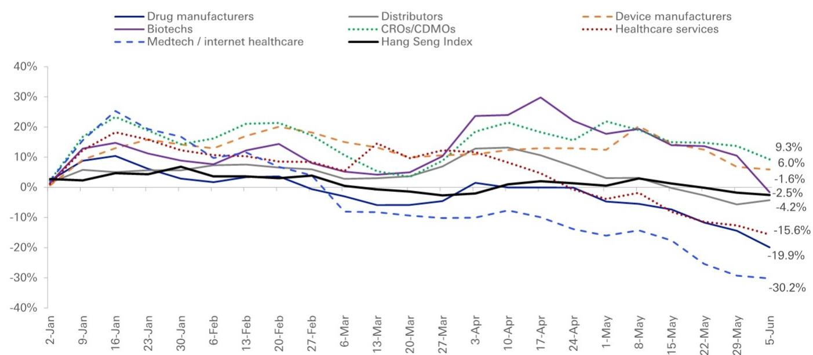
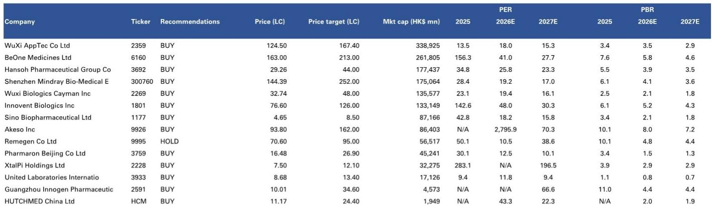
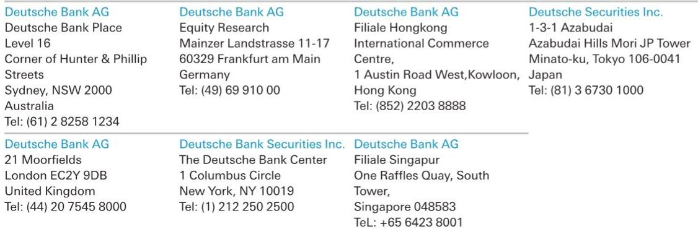

# 市场真正低估的不是地缘风险，而是中国药企已不可替代的全球研发节点地位

2026年6月初，港股医药板块在ASCO数据公布后依然呈现“卖事实”的弱势表现。表面看，市场是在消化地缘政治带来的监管不确定性——美国国会接连提出将生物技术纳入COINS法案、引入BINSA法案，试图限制美国资本与中国生物科技公司的交易。但一份来自某外资投行的最新研报提出了一个值得反复推敲的判断：**市场可能严重高估了这些法案的实际影响，同时严重低估了中国药企在全球创新药研发链条中已经形成的结构性位置。**

这不是一个情绪层面的判断，而是一个基于全球R&D投入分布、临床资产供给格局、以及交易对手方利益结构的硬逻辑。报告的核心主张是，如果美国真的选择“脱钩”，受损更大的可能不是中国，而是美国自身的生物技术产业。这个结论听起来有些反直觉，但报告用三组数据链条支撑了这一判断。

我们详细拆解这份报告的核心逻辑，并沿着其分析框架，探讨一个更深层次的问题：这轮地缘博弈，真正考验的是什么？

## 1. 中国已不是“低成本替代”，而是全球最大的创新药早期资产供给方

许多投资者对中国的印象仍停留在“仿制药大国”或“低成本CRO基地”。但报告提供的数据揭示了另一个现实：中国在创新药早期研发阶段的资产供给能力，已经全球领先。

2020年至2025年，中国制药研发支出从260亿美元增长至约390亿美元，年复合增长率8.5%，占全球制药研发支出的比例稳定在11%至13%之间。但更关键的是产出效率——自2020年以来，中国每年进入临床试验的创新药数量已经超过美国，成为全球第一。2024年，中国有722个创新药进入临床试验，而美国为457个。2025年，这一数字进一步拉大到827比482。

这些数字意味着什么？中国已经从一个“跟随者”变成了全球新药候选分子的最大“矿场”。在ADC、多特异性抗体等前沿领域，中国企业的资产积累尤为突出。任何一家全球药企，如果试图绕过中国进行早期管线布局，将面临候选分子数量锐减、同质化竞争加剧的风险。

这不是“成本优势”的问题，而是“供给结构性依赖”的问题。报告指出，美国的生物技术产业如果拒绝与中国合作，将错过大量有潜力的药物候选分子。这不仅是商业判断，更是产业逻辑。

## 2. 法案对美国的伤害可能远大于对中国——交易对手利益才是真正的阻力

BINSA法案的逻辑是“防止美国资本和技术流向中国生物技术领域”。但报告揭示了一个关键的反向机制：美国生物技术产业同样高度依赖来自中国的资产输入。

2020年至2026年5月，中国生物科技公司的对外授权交易中，美国买家占据了42%的交易数量和57%的前期付款金额。这意味着，美国药企是中国创新药资产最大的“进口商”。如果法案落地，这些交易不会消失，而是会流向欧洲、亚洲其他地区的买家。

报告进一步指出，来自美国本土产业界的强烈反对是可以预见的。一方面，限制合作意味着美国患者可能无法及时获得来自中国的创新疗法；另一方面，在公众和政府要求降低药价的背景下，切断与中国的高效研发合作只会推高美国药企的研发成本。这种“自损八百”的政策，很难获得产业界的支持。

更重要的是，立法过程本身将是漫长且充满博弈的。报告认为，市场对消息面的反应可能过度了。2026年前五个月，中国药企对外授权交易的前期付款总额已达48.33亿美元，同比增长93%，相当于2025年全年的68%。其中5月单月就贡献了12.5亿美元，主要由恒瑞与百时美施贵宝、信达与辉瑞的两笔大交易驱动。交易本身没有停滞，反而在加速。

## 3. 交易数据正在讲述一个与市场情绪截然相反的故事

如果只看股价，港股医药板块年初至今的表现确实疲弱。但如果看交易数据，中国药企的对外授权正在经历一个历史性的爆发期。

2025年全年，中国药企对外授权交易的前期付款总额达到了72.29亿美元，交易数量193笔，均创历史新高。2026年仅前五个月，前期付款总额就已经达到48.33亿美元，同比增长93%。按照这个速度，2026年全年很可能突破100亿美元。

更值得关注的是交易结构的变化。早期交易往往以小金额、小分子为主，但近期的交易中，大额付款越来越频繁。恒瑞与BMS、信达与Pfizer的交易，单笔前期付款均在数亿美元级别。这说明中国药企的资产质量得到了全球顶级买家的认可，而不仅仅是“便宜”。

这种交易热度与股价疲弱之间的背离，本身就是一种市场定价的“错位”。报告隐含的判断是：如果交易的基本面没有恶化，甚至还在加速改善，那么当前的估值压缩主要来自情绪和流动性因素，而不是产业逻辑的破坏。

## 4. 报告尚未完全回答的关键问题：竞争优势的“可迁移性”到底有多强？

尽管报告对中国药企的研发节点地位给出了强有力的论证，但它对一个更深层次的问题着墨不多：**如果美国真的通过行政手段或税收激励，推动本土生物技术产业重建类似中国的早期研发基础设施，需要多长时间？**

报告提到，中国过去五年建立了高效、经验丰富、技术积累深厚的研发生态系统。但这种生态的形成，既依赖于大量受过良好教育的研发人才，也依赖于临床资源的可及性、监管效率以及资本市场的支持。这些要素在美国是否可以被快速复制？如果可以，需要多少资本投入和时间成本？

从历史经验看，产业生态的重建通常以十年为周期。美国的生物技术产业虽然资本雄厚，但在早期临床阶段的“资产密度”上，短期内很难赶上中国。这意味着，即使政策落地，美国药企在过渡期内依然需要依赖中国资产。但“过渡期”的具体长度，以及中国药企能否在这段时间内完成从“资产输出”到“自主商业化”的跃迁，是报告没有完全展开的关键变量。

另一个未解问题是：如果欧洲和亚洲其他地区的买家开始大规模承接原本流向美国的交易，这些地区的估值体系和交易条款是否会发生变化？这对中国药企的定价权意味着什么？这些问题需要更细致的竞争格局分析。

## 5. 投资者应该用什么样的框架重新审视这个行业？

基于报告的论证，我们认为投资者可以建立一个两层观察框架：

第一层，区分“地缘噪音”和“产业基本面”。当前市场的定价似乎过度放大了地缘政治的不确定性，而忽视了交易数据的持续改善。如果BINSA法案最终未能通过，或者通过的版本大幅弱化，那么当前被压制的估值可能会迎来修复。反过来，即使法案有所进展，只要交易数据没有出现断崖式下滑，产业逻辑依然站得住。

第二层，区分“资产质量”和“交易结构”。不是所有中国药企都能在对外授权中获得有利条款。报告数据显示，大额交易集中在少数头部公司。投资者需要关注的是，哪些公司拥有真正差异化的管线资产、成熟的临床开发能力，以及与国际药企长期合作的经验。那些依赖单一资产或单一交易对手的公司，面临的不确定性更大。

此外，报告覆盖的公司名单中，多数被给予“买入”评级，但估值差异巨大。从市盈率看，有的公司2026年预期PE在10倍左右，有的则高达数百倍。这种分化本身就说明，市场正在对不同类型的公司进行“选择性定价”。投资者需要基于资产质量和商业化潜力做出判断，而不是简单押注整个板块。

报告还隐含了一个更宏观的观察框架：全球制药产业的研发分工正在从“西方研发、全球销售”向“多中心研发、全球交易”演变。中国已经在这个新格局中占据了早期资产供给的核心位置。任何试图逆转这一趋势的政策，都可能面临巨大的执行成本和产业反弹。

## 6. 顺着这些未解问题，继续深入

报告的核心判断——“市场可能过度反应了地缘政治紧张”——建立在扎实的数据基础上。但它也留下了几个值得进一步探讨的问题：如果美国真的推动本土替代，中国的研发生态优势能否维持？欧洲买家能否填补美国留下的缺口？以及，中国药企在对外授权中的定价权，是否会在交易量激增后反而被稀释？

这些问题的答案，可能决定了当前估值是“暂时的错杀”还是“结构性的重估”。我们会在社群中继续拆解这些关键变量，并结合更多行业数据，帮助读者建立更完整的投资框架。

欢迎来星球微信群里继续讨论。

Personal reading notes and learning share only. Not investment advice.

