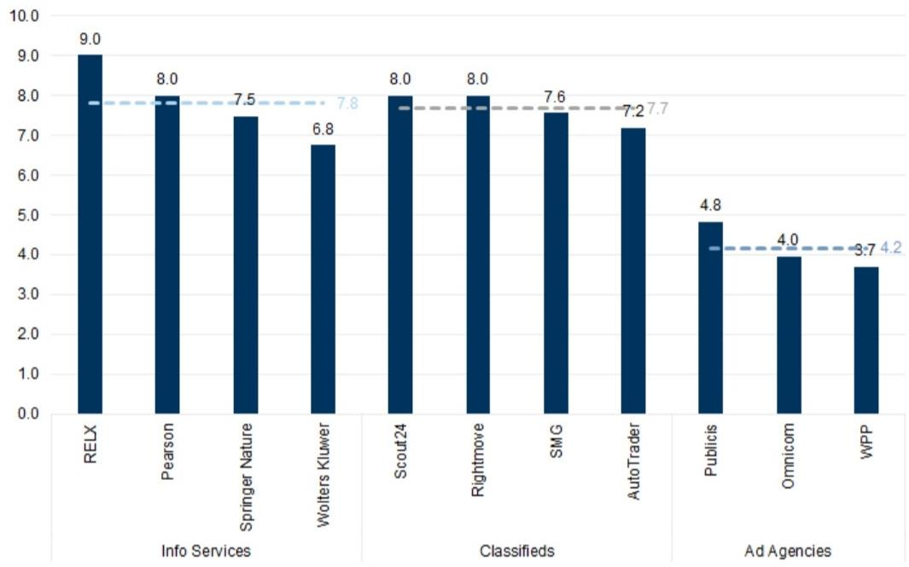
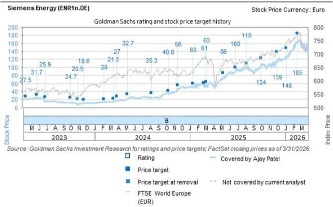
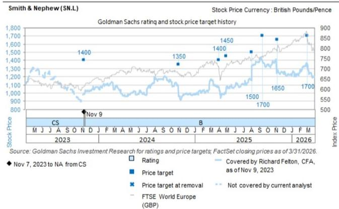
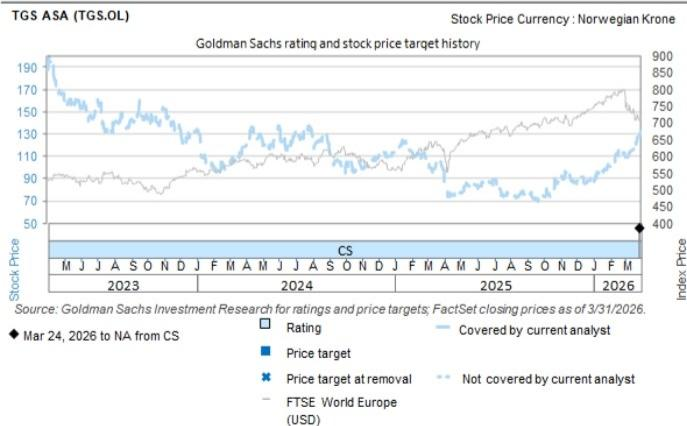

# CONNECTING THE DOTS

# Conviction List, bringing a different lens to AI and TGS plus key research

Conviction List. We added two new ideas to our Conviction List with Jessica Graham. The new additions are: 1) Siemens Energy, still a structural winner and Ajay Patel thinks the FY results will be a catalyst, expecting a raise to medium-term guidance; the story is increasingly led by Grid Technologies. 2) Smith & Nephew, which Richard Felton thinks has a potential near-term guidance reset creating an opportunity to revisit a name with innovation-driven growth momentum starting in the back half of this year. More below and a podcast version with the analysts on the new additions here.

AI – a different lens on the theme overall... We spent time with Jim Covello this week which brought us back to his April piece on AI Spend vs. Benefit and a couple of points to revisit from that: 1) the concentration of economic value in Semis is not sustainable; 2) data structure and orchestration are critical factors to unlock AI in the enterprise; and 3) despite significant spending, enterprise AI results are mixed at best.

...and on the AI disruption debate in Media & Internet names. Our new European Media and Internet analyst, Adam Berlin, initiated this week and also reminded us that the AI debate is nuanced. You can find the full suite of initiations below but this sector piece is a good one-stop-shop on why he remains generally constructive. Adam argues that the AI moats are generally more resilient and many of his Buy ratings are correlated with GBM's "AI at risk" basket despite having strong moats (e.g., Buy rated RELX scores best on his new AI framework, see Exhibit 11). One key variable in his framework is proprietary, difficult-to-replicate databases (and in sensitive areas like Legal, it is important that these data sources are reliable) which is a key part of having a defensible AI moat as we have discussed for other names (e.g., LSEG, which was at our European Financials Conference this week and talked about delivering trusted, licensed and AI-ready content).

TGS – Don’t forget the oil capex story. While the market focus is narrow, we still think it is worth paying attention to oil services and TGS (Buy) in particular. Michele della Vigna has highlighted the growing evidence that IOCs are warming up to spend more on exploration and, while calling timing is difficult, when seismic spend comes in, it is historically lumpy and shares re-rate quickly. The seismic industry has consolidated along with TGS and is in a position to wait for the upcycle and see real pricing power when it comes through. Before the Middle East dominated energy

# Sahar Islam

+44(20)7051-4935

sahar.islam@gs.com

GS International

headlines, we were already starting to see the case for a return to capex, underpinned by falling reserve life and maturing shale (see here for what we wrote in December 2025 on the topic) so this is not just a SoH trade.

Ferrari field trip. We sat down to discuss Christian Frenes' Ferrari field trip, timely after the EV launch last week saw shares sell off and a social media debate. Listen to him explain why he still likes the name for ASP-driven upgrades (Buy rated).

Exhibit 1: Overview of Adam Berlin's AI moat scores by sector across stocks that have shown a correlation with the GS AI basket   
GS structural AI moat score (1-10) - Higher score is a higher moat   

bar

| Category | Value |
| :--- | :--- |
| RELX | 9.0 |
| Pearson | 8.0 |
| Springer Nature | 7.5 |
| Wolters Kluwer | 6.8 |
| Scout24 | 8.0 |
| Rightmove | 8.0 |
| SMG | 7.6 |
| AutoTrader | 7.2 |
| Publicis | 4.8 |
| Omnicom | 4.0 |
| WPP | 3.7 |
The dashed line indicates a reference value of 7.8 for Info Services, 7.7 for Classifieds, and 4.2 for Ad Agencies. The chart is grouped by the three categories on the x-axis.

Source: GS Global Investment Research

# Conviction List

European Conviction List: June 2026 Update – We add Siemens Energy and Smith & Nephew to the Conviction List. Listen to the podcast version here.

Siemens Energy: Ajay Patel thinks that we will see medium-term guidance raised at FY results (he is 10% ahead of FY30E consensus EBITA) and an update on capital return (he sees potential for €29bn to be returned by 2030E, well above the €10bn currently committed to). This is a structural winner, in his view, exposed to increased power demand from data centers and grid investment (via the less appreciated Grid Technologies business). While the stock has already had a strong run, he continues to see upside on a valuation basis vs. its closest peer (GEV in the US).

Smith & Nephew: Richard Felton sees a potential near-term guidance reset at Smith & Nephew as an opportunity to revisit a name with innovation-driven accelerating growth momentum starting in the back half of this year. He sees numerous product launches which, along with operating model simplification, should drive margins higher. Valuation for this growth looks reasonable, with his stress tests suggesting the market is not pricing in the launches. See also: Continue to see attractive risk-reward

Wise Group (WSE): Wise addresses Belgian investigation into AML practices; Buy (on Conviction List)

BT Group (BT.L): Submits targeted, time-limited Openreach pricing proposals to Ofcom; Buy (on Conviction List)

Regional Conviction Lists

US Conviction List - Adds: CWST, TPG, TSN, XYZ while removing: ARES, KTB, WYNN. Podcast version here.

APAC Conviction List - Adds: S-Oil.

# Ratings Changes & Initiations

Media & Internet initiations from Adam Berlin were in focus this week – Sector note here summarises his views but he also has sub-sector/company notes below: European Media & Internet: AI exposure in focus, but we see value in most sub-sectors

- Advertising: Initiate on Publicis/Omnicom at Buy and WPP at Sell - Recovery in sector growth and limited evidence that barriers to entry are weakening due to AI (see his AI framework). Buy Publicis (HSD EPS growth to 2028E helped by M&A and margin expansion, 11% FCF yield), Omnicom (18% FCF yield with core biz delivering org growth), Sell WPP (limited visibility on return to growth).   
RELX Plc (REL.L): Initiate at Buy - Scores 9 /10 on AI framework and yet misplaced as AI at risk category, strong growth tailwinds across divisions, $6\%$ FCF yield vs market pricing in $2.5\%$ to perpetuity.   
Wolters Kluwer (WLSNc.AS): Initiate at Neutral - Valuation is undemanding but few catalysts for a re-rating, below consensus and already assumes acceleration in top line after soft 1Q.   
Classifieds: Initiate on Autotrader and Scout24 at Buy, Rightmove at Neutral; maintain SMG at Neutral - AI does not materially increase disintermediation risks (general LLMs can't scrape real time, DIY agents to remain niche). Stocks: Buy Scout24 and Autotrader (slowdown in UK could remind dealers of value of leads), Neutral Rightmove (incl M&A component). SMG (Neutral, transfer of coverage).   
Prosus/Naspers: Initiating on Prosus and Naspers (both Neutral) – Cautious stance reflects his view that current management guidance for operating performance and buybacks, even if met, is insufficient to narrow its discount to its NAV over the next 12m.

Stroeer SE & Co. (SAXG.DE): Downgrade to Sell – James Tate highlights a weaker German consumer macro picture and deteriorating trends at Statista and ASAM Beauty with execution risk on AI strategy; the upside risk is value crystallisation above SOTP.

Ahold Delhaize NV (AD.AS): Downgrade to Neutral - Richard Edwards notes OBBB changes have led to a HSD drop in national SNAP participation (food benefits) with potential for further declines. There are also weakening trends beyond this; however, Richard remains Neutral as he assumes margins will hold up.

Wartsila (WRT1V.HE): Up to Neutral - Daniela Costa materially increases her estimates to reflect capacity announcement in May (in addition to the Feb one) and 1Q, which saw a strong order backlog from Energy and Marine capex growth with potential O&G recovery as limiting downside risk. She is now $16\% / 14\%$ ahead on Visible Alpha Consensus adj EBIT 27/28.

Barry Callebaut (BARN.S): Down to Neutral - Sam Darbyshire highlights the strategy update was encouraging but will take time to materialise and industry overcapacity headwinds is set to persist till end of FY27. She cuts her volume growth (key driver near term) to $3.6\%$ in FY27 vs cons $4.1\%$ .

Segro (SGRO.L) up to Buy as Jonathan Kownator sees letting momentum improving and support from data centres, he also brings Castellum (CAST.ST) down to Neutral given a less favorable macro outlook, see note in sectors updates bucket.

# Conferences & Management takeaways

30 $^{th}$ European Financials Conference in Zurich was the focus this week, with 130 corporates attending (113 C-Suite). See all takeaway notes here, some highlights and sector pieces

HSBC (HSBC.L/000.5.HK): Buy (HSBC.L also on Conviction List) –1) structural trends within the current global environment; 2) wealth opportunities in particular; and 3) ongoing simplification efforts and the re-allocation of investment.   
BBVA (BBVA.MC): Buy (on Conviction List) – 1) key levers for their 2028 ROTE target of 22%, 2) AI-related opportunity and focus on operating efficiency, 3) client acquisition focus in Spain, 4) positive customer dynamics in Mexico, and 5) focus on organic capital generation and shareholder distribution.   
- Europe Insurance – P&C cycle management remains key given pricing trends, retail pricing generally at least inline with claims inflation in most major markets (ex UK) but companies are prepared for potential inflationary risk from Middle East conflict. Several examples of AI as enablers. M&A consistently seen as a tool for additional capital deployment.   
- Europe Real Estate – Investors were focused on further risks on AI on offices and from inflation on retail and there was a general view that total return needs to go up for the sector to be more attractive (Jonathan Kownator remains broadly constructive – see sector updates)   
Vonovia (VNAn.DE); Buy (on Conviction List) - 1) rental growth (eg Berlin Mietspiegel), 2) potential benefits from AI, 3) disposals and balance sheet, 4) regulation and the Berlin election. Management reiterated its mid-term EPS growth ambition of mid-single digit, increasing towards high-single digit in the medium term.   
Europe Software & Payments – Importance of orchestrating semantic layers around business context to leverage Agentic AI was a key discussion   
- Europe Capital Markets Retail investing panel – Success of Nordic model was highlighted and emerging opportunities in Europe more broadly. The panel focused on the impact of a shifting regulatory landscape, the rise of cross-border competition and the importance of scale, as well as the transformative role of AI.

Ferrari NV (RACE.MI): Maranello Fieldtrip takeaways; Buy - Following his trip, Christian Frenes highlights the Luce EV is positioned as additive, seeing sustained strength of personalization supporting his view of continued ASP strength. We had Christian on our new edition of On the Road with GS - Europe edition, discussing his visit in detail, listen here.

Wartsila (WRT1V.HE): Key takeaways from CEO Webcast; Neutral – Daniela Costa highlights very solid datacenter growth and a sustained electrification push underpin a robust demand outlook, with off-grid power generation taking share as a core enabling technology.

Getlink (GETP.PA): Feedback from management meeting; Buy

# Capital Markets Activity

US Strategy: Corporate equity demand should outweigh record IPO supply in 2026 - Ben Snider highlights corporate equity demand should outweigh record IPO supply in 2026, raising his forecast for 2026 IPO volumes to \$225bn from \$160bn. He notes additional supply as lock-ups expire is an area to watch, expecting nearly \$500bn of potential equity supply in 2026 following historical patterns, although this may not materialize if investors choose to maintain ownership positions.

Europe Strategy: Deal Momentum Builds, Europe Stays Cautious - Guillaume Jaisson highlights H2 2026 pipeline is underpinned by structural supply from corporates and valuation dispersion reinforces the case for mid-market deal activity.

Partners Group (PGHN.S): Ad-hoc release: FY26 fundraising guidance reiterated amidst recent evergreen weakness - Ad hoc update following strong negative share price performance driven by its prior update on the Global Value SICAV fund, where the group had estimated redemption requests of c.9.8% of NAV for 2Q26.

Blackstone Group (BX): BCRED's redemptions in line with expectations; signs of inflow stabilization / robust trends for non-credit funds

Global Credit Trader: The Hybrid Renaissance - Amanda Lynam highlights given her more cautious positioning in the EUR market (relative to USD); she would focus on higher-quality hybrid issuers in more economically resilient sectors.

Europe Capital Markets: Retail platforms monthly metrics: May-26 - Oliver Carruthers flags all platforms saw the number of customers increase vs. Apr-26 (+1% MoM across each of the three platforms) and up 10% yoy.

Americas Capital Markets: Perpetual Futures: Framing impact on US Exchanges and Investor FAQs

# AI & Data Centres

Global Technology: Semiconductors - Memory: Higher for longer DRAM/NAND/HBM cycles to expand memory valuation multiples; Raise TPs for Samsung/Hynix and reiterate Buys, upgrade Kioxia to Buy. Global memory podcast here.

Broadcom Inc. (AVGO): Strong AI revenue momentum for 2027, despite modest near-term shortfall relative to elevated expectations

Nvidia Corp. (NVDA): Takeaways from GTC Taipei Keynote at Computex – James

Schneider notes that Vera Rubin is now ramping full capacity and focuses on the launch of enterprise agentic toolkit and physical AI announcements.

Schneider Electric (SCHN.PA): Announces collaboration with SoftBank for 5 GW AI data center buildout; Buy (on Conviction List)

Halma Plc (HLMA.L): Raising forecasts on higher customer capex; reiterate Buy

Alternatives Analyst: Infrastructure capital meets the data center boom – Amanda Lynam sees scope for the private infrastructure market growth rate to accelerate—potentially close to 16% to 17% annualized growth. This would place the infrastructure AUM comfortably above \$3 trillion by 2030.

Powering Up Europe: Electrification keeps driving power demand higher - Alberto Gandolfi sees power demand trends continuing to move higher at +2% YTD on average in Spain, Germany, Italy, UK and Portugal with heat pumps, EVs and manufacturing all driving up demand. This is positive for Electrification names, including Naturgy and Enel (on CL) plus Engie.

US Daily: Wealth Effects on Consumption Growth: AI Leads the Way – Elise Peng notes positive wealth effects from the equity rally but rising concern of AI infra companies means wealth effects are unusually sensitive to the performance of a narrow set.

US Inflation Monitor: April 2026: Commodity Prices and AI-Related Effects Continue to Boost Inflation

Energy across the continent on the road with GS podcast, listen here.

# Commodities & Power

Commodities 101 Back to Basics podcast providing a practical introduction to commodity markets, listen here.

Powering Up Europe: Electrification keeps driving power demand higher - Alberto Gandolfi sees power demand trends continuing to move higher at +2% YTD on average in Spain, Germany, Italy, UK and Portugal with heat pumps, EVs and manufacturing all driving up demand. This is positive for Electrification names, including Naturgy and Enel (on CL) plus Engie.

Oil: Weak Demand Implies Price Risks Remain Two-Sided - Dan Struyven highlights Brent futures are down despite low flows given 1) physical and financial destocking, 2) end demand weakness (ex3), demand weak for jet fuel and petchem feedstock.

Oil: Hormuz Boost to Product Margins Amplifies Structural Tailwinds - Yulia Zhestkova Grigsby notes oil is to stay 2-3x higher for the rest of 2026 with risks skewed to upside. A one-month delay can boost 2H margins by \$6-7/bbl, recommends long Dec26 NW European Gasoil to hedge against escalation.

Europe Metals & Mining: Lifting Copper Prices on Ex-US Tightness Ahead of US Tariff Catalyst. Buy LUN, ANTO – As our commodities team see materially tighter ex US copper mkt through 27 given weaker mine supply and tariff related shifts, Matt Green refreshes estimates for exposed equities, Buy Lundin and Anto.

Americas Energy Services: See Near-Term Strength in North America as Middle East Uncertainty Continues, but Incrementally More Positive on International Long-Term;

XPRO Up to Buy

# Sector Updates

Global Healthcare: The Obesity Evolution: Framing global AOM peptide manufacturing capacity and implications for the branded/generic markets – Our global team looks at global capacity (focusing on demand), and Novo’s fermentation approach likely sets it up to remain the lowest-cost manufacturer and brand loyalty matters in this category.

See also: Novo Nordisk (NOVOb.CO): The Obesity Evolution: Pill positioning enhances Wegovy competitiveness, but uncertainties remain; Neutral

Real Estate: Lack of supply and corporate actions to drive catalysts; SGRO up to Buy; CAST down to Neutral - Jonathan Kownator notes real estate is still a sector you can invest in despite rates. He likes data center and logistics-exposed names in particular.

See also: Europe Real Estate: 2026 Berlin Mietspiegel released; median prices up c.7% since 2024

# Reiterate Buy

Nestle (NESN.S): Cash generation & disposals on-track to restore Nestlé balance sheet optionality; Buy

Philips (PHG.AS): Framing the opportunity of potential return to US Sleep; Buy – Richard Felton highlights the sales injunction in US sleep but management comments indicate some progress. He has no view on timing but scenario analysis indicates return to US sleep could add potential upside (2-8% to FY27-29E EPS).

Telia Co. (TELIA.ST): Halebop exit reinforces Swedish market rationality, strengthening pricing power and growth; Buy Telia, Telenor, and Tele2

Telenor (TEL.OL): Analysing potential inorganic catalysts: Asia portfolio simplification & Nordic consolidation could drive meaningful upside; Buy

# Reiterate Sell

Alstom (ALSO.PA): Revisiting valuation through a DCF lens; Sell

# Tracking the Data

Around the world in 80 charts: Mid-Q2 check in across transport subsectors - Patrick Creuset highlights noisy data but underlying global trade is slowing from $+4\%$ in 4Q to $+1\%$ in 2Q (to 22 May). US re-stocking is still driving growth but Europe, EM, China are slowing. In Airlines, Gulf carriers are adding/reactivating capacity (impacts LHA).

Multi-Industry: China Trade Tracker and what it foretells for European Capital Goods - Daniela Costa notes April export growth has accelerated sharply above consensus expectations (+14% yoy vs +2.5% in March). She sees the highest growth in Tungsten (Sandvik, Weir, FLSmidth), light commercial vehicles, heat pumps and industrial robots.

Europe Automobiles: US SAAR returns to growth in May, Stellantis continues YoY sales growth, although market share is moderating sequentially and inventory remains elevated

Europe Automobiles: EVs continue to drive European big 5 car sales growth in May, BMW Group outperforms broader industry growth

Europe Branded Consumer Goods: Luxury Goods: Watches round-up April 2026: Swiss Watch Exports -17% y/y given base effect induced by tariff volatility; latest industry news wrap

Pearson (PSON.L): US Student Assessment contract analysis suggests modest upside; introducing new high-frequency data tracking; reiterate Buy

Informa (INF.L): Middle East events data demonstrates resilience of domestic demand, new activity data tracking; Buy

# Earnings & CMDs

# Consumer

Inditex (ITX.MC): Ongoing disciplined execution combined with structurally superior supply chain continues to enable premium growth; PT to €61, Buy

Barry Callebaut (BARN.S): Focus for Growth strategy: new mid-term guidance implies EPS cuts, but phasing is uncertain; Neutral – see rating change section – downgraded to Neutral

Ocado Group (OCDO.L): First Take: E-commerce software partnership with Asda announced; cash flow guidance reiterated, Neutral

Remy Cointreau (RCOP.PA): First Take: Better operating profit and FCF, further details on transformation plan; Neutral

# Healthcare

British American Tobacco (BATS.L): H1 26 Pre-Close trading update broadly in line with expectations; Encouraging Momentum for New Categories; Neutral

AstraZeneca (AZN.L): Takeaways from ASCO management event: Datroway, bispecifics, camizestrant and puxi-sam in focus; Buy

Roche (ROP.C.S): ASCO 2026 event takeaways - giradestrant speed and breadth of uptake remains key; Neutral

Immatics NV (IMTX): ASCO updates: Impressive IMA203CD8 ovarian data adds further validation; Buy

# BSTL

IAG (ICAG.L): Feedback from Loyalty CMD; Buy – Patrick Creuset highlights a target to double Loyalty profit over next 4-5y, implying MSD upside vs his current estimates. He sees Loyalty as the highest quality business within IAG and also within broader coverage.

Mitie Group (MTO.L): FY26 results: Results broadly inline with trading update; incremental £60m buyback announced; Buy

Brenntag SE (BNRGn.DE): 1Q'26: Focus shifts to potential for earnings upgrades following re-rating YTD; Buy

# Financials

Partners Group (PGHN.S): Evergreen update: Global Value SICAV limits redemptions to $5\%$ ; Neutral

Partners Group (PGHN.S): Ad-hoc release: FY26 fundraising guidance reiterated amidst recent evergreen weakness

Colonial Inmobiliaria (COL.MC): CMD: New 2028 EPS guidance €0.39–0.41/sh (c.5% above cons), but deleveraging intent may fall short; Neutral

EQT AB (EQTAB.ST): Target size for Infrastructure VII set at €21bn (\$24.5bn); Buy

# Commodities & Industrials

Elekta AB (EKTAb.ST): 4Q 26 highlights key challenges ahead; lowering estimates post results; Sell

# Events incl M&A

UK Banks: Unpacking the New Growth Allowance for ringfenced banks – Ben Caven-Roberts deep dives on the New Growth Allowance, reading positive for Lloyds and Natwest and may help improve profitability but it’s unclear how much incremental lending we will see.

HK Banks & Insurance: Addressing frequently asked questions on the latest regulatory announcements - Read for HSBC (on CL) given HK wealth fees account for \~20% of group wealth fees.

Aena SA (AENA.MC): CNMC proposes tariff cuts in DORA III; Sell - Patrick Creuset highlights proposed tariff cuts which were in line with his view that AENA enters the next regulatory period overearning, supporting his cautious view.

Drax Group (DRX.L): Announces an all-cash offer for Bluefield Solar Income Fund; Neutral

British Land (BLND.L): CEO Change; Buy

Pepco Group (PCOP.WA): First Take: Agrees sale of Dealz Poland; Buy

# Macro

GOAL: Global Opportunity Asset Locator: Balancing micro tailwinds and macro headwinds — narrow growth optimism vs. rates pressures – Christian Mueller-Glissmann shifts back to being fully invested for 3m, downgrading cash back to N (from O/W) and upgrading credit to N (from U/W). He remains N on equities tactically (OW 12m and would look to buy any dips in the coming months).

GOAL Positioning: Tracking positioning in the Tech rally - Christian Mueller-Glissmann notes indicators are elevated but below historical peaks, re-risking has been unusually fast and narrow with focus on Tech as global HF net leverage is up from below 70% to above 80% in less than 2m and retail flows to Tech also picked up. See also: GOAL: From Yield Spike to Slide - Dissecting cross-asset moves during rate relief

Europe: ECB Preview—A June Hike as Inflation Risks Rebuild – Jari Stehn expects a hike next Thursday (in line with consensus) and he continues to expect two hikes (next one in Sept, contingent on energy prices and inflation).

Europe Strategy: Beyond the Bounce - Sharon Bell raises her STOXX 600 targets to 660 for 12m, c.6% price return and 9% total return. She prefers structural winners including capital-intensive areas but also sees scope for tactical broadening assuming energy moderates and rates expectations move lower (preferring Staples to Cons Discretionary).

UK: UK Homebuilders: Headwinds persist, downside risks contained

USA: Job Openings Well Above Expectations Due to Outsized Increase in the Professional and Business Services Category; QCEW Suggests Small Upward Revision to Payroll Employment Through December 2025

USA: Productivity Growth and Unit Labor Costs Revised Down; Initial Claims Rise

Japanese Repatriation Flows—What Matters Most for the Yen

The World Cup and Economics: World Cup 2026: Predictions, Probabilities, and Paths to Victory

# Other Global

Nike Inc. (NKE): Takeaways from sell-side Nike Global Football event – Brooke Roach's key takeaways include early signs of traction from its sport-led offense and building momentum into the World Cup and football as a scaled global demand drive.

Kioxia Holdings (285A.T): Upgrade to Buy; view of NAND as cyclical market unchanged, but now see profits higher and more sustainable over the next 2-3 years

Palo Alto Networks (PANW): 3QFY: Early signs that demand can catch up to expectations

BYD Co. (002594.SZ/1121.HK): Most affordable urban NOA model, in-house smart driving chip; Buy

Hong Kong Real Estate: Assessing China's tighter capital controls. Analyze demand drivers, exposure and earnings sensitivity

# Disclosure Appendix

# Reg AC

I, Sahar Islam, hereby certify that all of the views expressed in this report accurately reflect my personal views about the subject company or companies and its or their securities. I also certify that no part of my compensation was, is or will be, directly or indirectly, related to the specific recommendations or views expressed in this report.

Unless otherwise stated, the individuals listed on the cover page of this report are analysts in GS' Global Investment Research division.

Contributing Authors: Sahar Islam GS International.

Unless otherwise stated, the individuals listed in the Contributing Authors disclosure of this report are analysts in GS' Global Investment Research division.

# GS Factor Profile

The GS Factor Profile provides investment context for a stock by comparing key attributes to the market (i.e. our universe of rated stocks) and its sector peers. The four key attributes depicted are: Growth, Financial Returns, Multiple (e.g. valuation) and Integrated (a composite of Growth, Financial Returns and Multiple). Growth, Financial Returns and Multiple are calculated by using normalized ranks for specific metrics for each stock. The normalized ranks for the metrics are then averaged and converted into percentiles for the relevant attribute. The precise calculation of each metric may vary depending on the fiscal year, industry and region, but the standard approach is as follows:

Growth is based on a stock's forward-looking sales growth, EBITDA growth and EPS growth (for financial stocks, only EPS and sales growth), with a higher percentile indicating a higher growth company. Financial Returns is based on a stock's forward-looking ROE, ROCE and CROCI (for financial stocks, only ROE), with a higher percentile indicating a company with higher financial returns. Multiple is based on a stock's forward-looking P/E, P/B, price/dividend (P/D), EV/EBITDA, EV/FCF and EV/Debt Adjusted Cash Flow (DACF) (for financial stocks, only P/E, P/B and P/D), with a higher percentile indicating a stock trading at a higher multiple. The Integrated percentile is calculated as the average of the Growth percentile, Financial Returns percentile and (100% - Multiple percentile).

Financial Returns and Multiple use the GS analyst forecasts at the fiscal year-end at least three quarters in the future. Growth uses inputs for the fiscal year at least seven quarters in the future compared with the year at least three quarters in the future (on a per-share basis for all metrics).

For a more detailed description of how we calculate the GS Factor Profile, please contact your GS representative.

# M&A Rank

Across our global coverage, we examine stocks using an M&A framework, considering both qualitative factors and quantitative factors (which may vary across sectors and regions) to incorporate the potential that certain companies could be acquired. We then assign a M&A rank as a means of scoring companies under our rated coverage from 1 to 3, with 1 representing high (30%-50%) probability of the company becoming an acquisition target, 2 representing medium (15%-30%) probability and 3 representing low (0%-15%) probability. For companies ranked 1 or 2, in line with our standard departmental guidelines we incorporate an M&A component into our target price. M&A rank of 3 is considered immaterial and therefore does not factor into our price target, and may or may not be discussed in research.

# Quantum

Quantum is GS' proprietary database providing access to detailed financial statement histories, forecasts and ratios. It can be used for in-depth analysis of a single company, or to make comparisons between companies in different sectors and markets.

# Disclosures

# Pricing Information

Aena SA (€24.40), Ahold Delhaize NV (€35.22), Alstom (€17.05), Antofagasta Plc (4,210p), Ares Management Corp. (\$130.50), AstraZeneca (13,554p), Auto Trader Group (459.6p), BBVA (€19.65), BT Group (201.6p), BYD Co. (A) (Rmb93.01), BYD Co. (H) (HK\$89.70), Barry Callebaut (SFr1,157.00), Blackstone Group (\$118.55), Block Inc. (\$70.89), Brenntag SE (€56.28), British American Tobacco (4,320p), British Land (398.8p), Broadcom Inc. (\$418.91), Casella Waste Systems Inc. (\$83.65), Castellum (Skr123.35), Colonial Inmobiliaria (€5.56), Drax Group (803p), EQT AB (Skr299.50), Elekta AB (Skr55.30), Enel SpA (€9.57), Engie (€26.60), Expro Group Holdings NV (\$16.59), FLSmidth & Co. (Dkr530.50), Ferrari NV (€301.70), Ferrari NV (\$349.92), GE Vernova (\$963.33), Getlink (€18.26), HSBC (1,367p), HSBC Holdings (HK\$141.80), Halma Plc (4,878p), IAG (421.3p), Immatics NV (\$10.18), Inditex (€54.06), Kioxia Holdings (¥77,900), Kontoor Brands Inc. (\$68.65), Lloyds Banking Group (100.5p), London Stock Exchange Group (9,162p), Lundin Mining Corp. (C\$42.59), Lundin Mining Corp. (Skr288.50), Mitie Group (170.2p), Naspers Ltd. (R870.00), Naturgy Energy Group (€28.62), Natwest Group (601.4p), Nestle (SFr76.68), Nike Inc. (\$43.62), Novo Nordisk (Dkr283.85), Novo Nordisk (ADR) (\$43.75), Nvidia Corp. (\$218.66), Ocado Group (209.2p), Omnicom (\$75.63), Palo Alto Networks (\$279.25), Partners Group (SFr712.40), Pepco Group (PLN33.77), Philips (€22.38), Prosus N.V (€40.09), Publicis (€89.22), RELX Plc (2,583p), Remy Cointreau (€41.16), Rightmove Plc (439.7p), Roche (SFr324.60), S-Oil Corp. (W112,800), SEGRO Plc (723.8p), SK Hynix Inc. (W2,070,000), SMG Swiss Marketplace Group (SFr27.45), Samsung Electronics (W329,000), Samsung Electronics (Pref) (W211,000), Sandvik (Skr382.30), Schneider Electric (€281.85), Scout24 SE (€74.50), Siemens Energy (€159.48), Smith & Nephew (1,132.5p), Stroeer SE & Co. (€35.28), TGS ASA (Nkr145.10), TPG Inc. (\$42.15), Tele2 (Skr173.90), Telenor (Nkr150.40), Telia Co. (Skr48.95), Tyson Foods Inc. (\$56.88), Vonovia (€20.57), WPP Plc (271.3p), Wartsila (€36.12), Weir Group (2,438p), Wise Group (826p), Wise Group (\$11.06), Wolters Kluwer (€64.26) and Wynn Resorts Ltd. (\$103.60)

The rating(s) for TGS ASA is/are relative to the other companies in its/their coverage universe: Aker BP ASA, BP Plc, Ceres Power, ENI, Equinor, GTT, Galp, Harbour Energy, HelleniQ Energy, ITM Power, Industrie De Nora SpA, Ithaca Energy, Motor Oil, Nel, Neste OYJ, OMV, Repsol, Saudi Aramco, Shell Plc, TGS ASA, Technip Energies, Tenaris, Thyssenkrupp Nucera, TotalEnergies SE, Vallourec, Var Energi ASA

The rating(s) for Smith & Nephew is/are relative to the other companies in its/their coverage universe: Alcon Inc., Carl Zeiss Meditec AG, Coloplast, ConvaTec Plc, Demant, Elekta AB, EssilorLuxottica, Fresenius Medical Care, Fresenius SE, Ottobock SE & Co., Philips, Siemens Healthineers AG, Smith & Nephew, Sonova Holdings, Straumann AG

The rating(s) for Siemens Energy is/are relative to the other companies in its/their coverage universe: Acciona Energia, Centrica, Drax Group, E.ON, EDP Renovaveis SA, Elia Group, Enagas, Endesa SA, Enel SpA, Energias de Portugal, Engie, Fortum OYJ, Iberdrola SA, National Grid Plc, Naturgy Energy Group, Nordex SE, Orsted A/S, Pennon Group, RWE, Redeia, SSE Plc, Severn Trent Plc, Siemens Energy, Snam SpA, Solaria, Terna, United Utilities Group, Veolia Environnement, Vestas Wind Systems A/S

# Company-specific regulatory disclosures

The following disclosures relate to relationships between The GS Group, Inc. (with its affiliates, “GS”) and companies covered by GS Global Investment Research and referred to in this research.

GS has received compensation for investment banking services in the past 12 months: Siemens Energy (€159.48)

GS expects to receive or intends to seek compensation for investment banking services in the next 3 months: Siemens Energy (€159.48), Smith & Nephew (1,132.5p) and Smith & Nephew (ADR) (\$30.85)

GS had an investment banking services client relationship during the past 12 months with: Siemens Energy (€159.48), Smith & Nephew (1,132.5p) and Smith & Nephew (ADR) (\$30.85)

GS had a non-investment banking securities-related services client relationship during the past 12 months with: Siemens Energy (€159.48)

GS had a non-securities services client relationship during the past 12 months with: Siemens Energy (€159.48)

GS makes a market in the securities or derivatives thereof: Smith & Nephew (1,132.5p) and Smith & Nephew (ADR) (\$30.85)

There are no company-specific disclosures for: TGS ASA (Nkr145.10)

# Distribution of ratings/investment banking relationships

GS Investment Research global Equity coverage universe

<table><tr><td rowspan="2"></td><td colspan="3">Rating Distribution</td></tr><tr><td>Buy</td><td>Hold</td><td>Sell</td></tr><tr><td>Global</td><td>50%</td><td>34%</td><td>16%</td></tr></table>

<table><tr><td colspan="3">Investment Banking Relationships</td></tr><tr><td>Buy</td><td>Hold</td><td>Sell</td></tr><tr><td>65%</td><td>60%</td><td>45%</td></tr></table>

As of April 1, 2026, GS Global Investment Research had investment ratings on 3,074 equity securities. GS assigns stocks as Buys and Sells on various regional Investment Lists; stocks not so assigned are deemed Neutral. Such assignments equate to Buy, Hold and Sell for the purposes of the above disclosure required by the FINRA Rules. See ‘Ratings, Coverage universe and related definitions’ below. The Investment Banking Relationships chart reflects the percentage of subject companies within each rating category for whom GS has provided investment banking services within the previous twelve months.

Price target and rating history chart(s)   
  
The price targets shown should be considered in the context of all prior published GS, which may or may not have included price targets, as well as developments relating to the company, its industry and financial markets.

  
The price targets shown should be considered in the context of all prior published GS, which may or may not have included price targets, as well as developments relating to the company, its industry and financial markets.

line

| Date       | Stock Price | Rating | Price Target | Price Target at Removal | FTSE World Europe (USD) |
|------------|-------------|--------|--------------|--------------------------|-------------------------|
| Mar 24, 2026 | 400         |        |              |                          |                         |

The price targets shown should be considered in the context of all prior published GS, which may or may not have included price targets, as well as developments relating to the company, its industry and financial markets.

Target price history table(s) TGS ASA (TGS.OL) 

<table><tr><td>Date of report</td><td>Target price (Nkr)</td><td>Closing price (Nkr)</td></tr><tr><td>01-May-26</td><td>180.00</td><td>150.50</td></tr><tr><td>20-Apr-26</td><td>170.00</td><td>137.80</td></tr></table>

Smith & Nephew (SN.L) 

<table><tr><td>Date of report</td><td>Target price (£)</td><td>Closing price (£)</td></tr><tr><td>22-May-26</td><td>1,550</td><td>1,138</td></tr><tr><td>03-Mar-26</td><td>1,700</td><td>1,360</td></tr><tr><td>10-Nov-25</td><td>1,650</td><td>1,271</td></tr><tr><td>14-Sep-25</td><td>1,700</td><td>1,405</td></tr><tr><td>05-Aug-25</td><td>1,500</td><td>1,331</td></tr><tr><td>30-Apr-25</td><td>1,450</td><td>1,054</td></tr><tr><td>02-Apr-25</td><td>1,400</td><td>1,075</td></tr><tr><td>31-Oct-24</td><td>1,350</td><td>961</td></tr><tr><td>10-Nov-23</td><td>1,400</td><td>989</td></tr></table>

Siemens Energy (ENR1n.DE) 

<table><tr><td>Date of report</td><td>Target price (€)</td><td>Closing price (€)</td></tr><tr><td>12-May-26</td><td>212.00</td><td>169.48</td></tr><tr><td>17-Feb-26</td><td>185.00</td><td>161.05</td></tr><tr><td>07-Jan-26</td><td>148.00</td><td>129.40</td></tr><tr><td>01-Dec-25</td><td>139.00</td><td>112.55</td></tr><tr><td>01-Oct-25</td><td>124.00</td><td>104.15</td></tr><tr><td>06-Aug-25</td><td>110.00</td><td>98.66</td></tr><tr><td>24-Jun-25</td><td>100.00</td><td>91.12</td></tr><tr><td>08-May-25</td><td>86.00</td><td>73.34</td></tr><tr><td>06-Mar-25</td><td>63.00</td><td>58.48</td></tr><tr><td>25-Feb-25</td><td>61.00</td><td>51.54</td></tr><tr><td>13-Jan-25</td><td>60.00</td><td>49.23</td></tr><tr><td>18-Nov-24</td><td>56.00</td><td>45.64</td></tr><tr><td>10-Oct-24</td><td>40.80</td><td>34.69</td></tr><tr><td>08-Aug-24</td><td>35.30</td><td>24.39</td></tr><tr><td>08-May-24</td><td>32.70</td><td>22.56</td></tr><tr><td>27-Mar-24</td><td>27.00</td><td>16.47</td></tr><tr><td>14-Mar-24</td><td>21.50</td><td>14.41</td></tr><tr><td>07-Feb-24</td><td>20.00</td><td>14.37</td></tr><tr><td>22-Nov-23</td><td>18.60</td><td>10.89</td></tr><tr><td>30-Oct-23</td><td>20.50</td><td>8.44</td></tr><tr><td>02-Oct-23</td><td>24.70</td><td>12.14</td></tr><tr><td>26-Jun-23</td><td>25.90</td><td>14.35</td></tr></table>

Price targets shown in table(s) are unadjusted for corporate actions.

# Regulatory disclosures

# Disclosures required by United States laws and regulations

See company-specific regulatory disclosures above for any of the following disclosures required as to companies referred to in this report: manager or co-manager in a pending transaction; $1\%$ or other ownership; compensation for certain services; types of client relationships; managed/co-managed public offerings in prior periods; directorships; for equity securities, market making and/or specialist role. GS trades or may trade as a principal in debt securities (or in related derivatives) of issuers discussed in this report.

The following are additional required disclosures: Ownership and material conflicts of interest: GS policy prohibits its analysts, professionals reporting to analysts and members of their households from owning securities of any company in the analyst's area of coverage. Analyst compensation: Analysts are paid in part based on the profitability of GS, which includes investment banking revenues. Analyst as officer or director: GS policy generally prohibits its analysts, persons reporting to analysts or members of their households from serving as an officer, director or advisor of any company in the analyst's area of coverage. Non-U.S. Analysts: Non-U.S. analysts may not be associated persons of GS & Co. LLC and therefore may not be subject to FINRA Rule 2241 or FINRA Rule 2242 restrictions on communications with a subject company, public appearances and trading in securities covered by the analysts.

Distribution of ratings: See the distribution of ratings disclosure above. Price chart: See the price chart, with changes of ratings and price targets in prior periods, above, or, if electronic format or if with respect to multiple companies which are the subject of this report, on the GS website at https://www.gs.com/research/hedge.html.

# Additional disclosures required under the laws and regulations of jurisdictions other than the United States

The following disclosures are those required by the jurisdiction indicated, except to the extent already made above pursuant to United States laws and regulations. Australia: GS Australia Pty Ltd and its affiliates are not authorised deposit-taking institutions (as that term is defined in the Banking Act 1959 (Cth)) in Australia and do not provide banking services, nor carry on a banking business, in Australia. This research, and any access to it, is intended only for “wholesale clients” within the meaning of the Australian Corporations Act, unless otherwise agreed by GS. In producing research reports, members of Global Investment Research of GS Australia may attend site visits and other meetings hosted by the companies and other entities which are the subject of its research reports. In some instances the costs of such site visits or meetings may be met in part or in whole by the issuers concerned if GS Australia considers it is appropriate and reasonable in the specific circumstances relating to the site visit or meeting. To the extent that the contents of this document contains any financial product advice, it is general advice only and has been prepared by GS without taking into account a client's objectives, financial situation or needs. A client should, before acting on any such advice, consider the appropriateness of the advice having regard to the client's own objectives, financial situation and needs. A copy of certain GS Australia and New Zealand disclosure of interests and a copy of GS' Australian Sell-Side Research Independence Policy Statement are available at: https://www.goldmansachs.com/disclosures/australia-new-zealand/index.html. Brazil: Disclosure information in relation to CVM Resolution n. 20 is available at https://www.gs.com/worldwide/brazil/area/gir/index.html. Where applicable, the Brazil-registered analyst primarily responsible for the content of this research report, as defined in Article 20 of CVM Resolution n. 20, is the first author named at the beginning of this report, unless indicated otherwise at the end of the text. Canada: This information is being provided to you for information purposes only and is not, and under no circumstances should be construed as, an advertisement, offering or solicitation by GS & Co. LLC for purchasers of securities in Canada to trade in any Canadian security. GS & Co. LLC is not registered as a dealer in any jurisdiction in Canada under applicable Canadian securities laws and generally is not permitted to trade in Canadian securities and may be prohibited from selling certain securities and products in certain jurisdictions in Canada. If you wish to trade in any Canadian securities or other products in Canada please contact GS Canada Inc., an affiliate of The GS Group Inc., or another registered Canadian dealer. Hong Kong: Further information on the securities of covered companies referred to in this research may be obtained on request from GS (Asia) L.L.C. India: Further information on the subject company or companies referred to in this research may be obtained from GS (India) Securities Private Limited, Research Analyst - SEBI Registration Number INH000001493, 10th Floor, Ascent-Worli, Sudam Kalu Ahire Marg, Worli, Mumbai-400 025, India, Corporate Identity Number U74140MH2006FTC160634, Phone +91 22 6616 9000, Fax +91 22 6616 9001. GS may beneficially own 1% or more of the securities (as such term is defined in clause 2 (h) the Indian Securities Contracts (Regulation) Act, 1956) of the subject company or companies referred to in this research report. Investment in securities market are subject to market risks. Read all the related documents carefully before investing. Registration granted by SEBI and certification from NISM in no way guarantee performance of the intermediary or provide any assurance of returns to investors. GS (India) Securities Private Limited compliance officer and investor grievance contact details can be found at: https://www.goldmansachs.com/worldwide/india/documents/Grievance-Redressal-and-Escalation-Matrix.pdf, and a copy of the annual audit compliance report can be found at this link: https://publishing.gs.com/content/site/india-annual-compliance-report.html. Japan: See below. Korea: This research, and any access to it, is intended only for “professional investors” within the meaning of the Financial Services and Capital Markets Act, unless otherwise agreed by GS. Further information on the subject company or companies referred to in this research may be obtained from GS (Asia) L.L.C., Seoul Branch. New Zealand: GS New Zealand Limited and its affiliates are neither “registered banks” nor “deposit takers” (as defined in the Reserve Bank of New Zealand Act 1989) in New Zealand. This research, and any access to it, is intended for “wholesale clients” (as defined in the Financial Advisers Act 2008) unless otherwise agreed by GS. A copy of certain GS Australia and New Zealand disclosure of interests is available at: https://www.goldmansachs.com/disclosures/australia-new-zealand/index.html. Russia: Research reports distributed in the Russian Federation are not advertising as defined in the Russian legislation, but are information and analysis not having product promotion as their main purpose and do not provide appraisal within the meaning of the Russian legislation on appraisal activity. Research reports do not constitute a personalized investment recommendation as defined in Russian laws and regulations, are not addressed to a specific client, and are prepared without analyzing the financial circumstances, investment profiles or risk profiles of clients. GS assumes no responsibility for any investment decisions that may be taken by a client or any other person based on this research report. Singapore: GS (Singapore) Pte. (Company Number: 198602165W), which is regulated by the Monetary Authority of Singapore, accepts legal responsibility for this research, and should be contacted with respect to any matters arising from, or in connection with, this research. Taiwan: This material is for reference only and must not be reprinted without permission. Investors should carefully consider their own investment risk. Investment results are the responsibility of the individual investor. United Kingdom: Persons who would be categorized as retail clients in the United Kingdom, as such term is defined in the rules of the Financial Conduct Authority, should read this research in conjunction with prior GS on the covered companies referred to herein and should refer to the risk warnings that have been sent to them by GS International. A copy of these risks warnings, and a glossary of certain financial terms used in this report, are available from GS International on request.

European Union and United Kingdom: Disclosure information in relation to Article 6 (2) of the European Commission Delegated Regulation (EU) (2016/958) supplementing Regulation (EU) No 596/2014 of the European Parliament and of the Council (including as that Delegated Regulation is implemented into United Kingdom domestic law and regulation following the United Kingdom's departure from the European Union and the European Economic Area) with regard to regulatory technical standards for the technical arrangements for objective presentation of investment recommendations or other information recommending or suggesting an investment strategy and for disclosure of particular interests or indications of conflicts of interest is available at https://www.gs.com/disclosures/europeanpolicy.html which states the European Policy for Managing Conflicts of Interest in Connection with Investment Research.

Japan: GS Japan Co., Ltd. is a Financial Instrument Dealer registered with the Kanto Financial Bureau under registration number Kinsho 69, and a member of Japan Securities Dealers Association, Financial Futures Association of Japan Type II Financial Instruments Firms Association, and Investment Management Association of Japan. Sales and purchase of equities are subject to commission pre-determined with clients plus consumption tax. See company-specific disclosures as to any applicable disclosures required by Japanese stock exchanges, the Japanese Securities Dealers Association or the Japanese Securities Finance Company.

# Ratings, coverage universe and related definitions

Buy (B), Neutral (N), Sell (S) Analysts recommend stocks as Buys or Sells for inclusion on various regional Investment Lists. Being assigned a Buy or Sell on an Investment List is determined by a stock's total return potential relative to its coverage universe. Any stock not assigned as a Buy or a Sell on an Investment List with an active rating (i.e., a stock that is not Rating Suspended, Not Rated, Early-Stage Biotech, Coverage Suspended or Not Covered), is deemed Neutral. Each region manages Regional Conviction Lists, which are selected from Buy rated stocks on the respective region's Investment Lists and represent investment recommendations focused on the size of the total return potential and/or the likelihood of the realization of the return across their respective areas of coverage. The addition or removal of stocks from such Conviction Lists are managed by the Investment Review Committee or other designated committee in each respective region and do not represent a change in the analysts' investment rating for such stocks.

Total return potential represents the upside or downside differential between the current share price and the price target, including all paid or anticipated dividends, expected during the time horizon associated with the price target. Price targets are required for all covered stocks. The total return potential, price target and associated time horizon are stated in each report adding or reiterating an Investment List membership.

Coverage Universe: A list of all stocks in each coverage universe is available by primary analyst, stock and coverage universe at https://www.gs.com/research/hedge.html.

Not Rated (NR). The investment rating, target price and earnings estimates (where relevant) are removed pursuant to GS policy when GS is acting in an advisory capacity in a merger or in a strategic transaction involving this company, when there are legal, regulatory or policy constraints due to GS' involvement in a transaction, and in certain other circumstances. Early-Stage Biotech (ES). An investment rating and a target price are not assigned pursuant to GS policy when this company has neither a drug, treatment or medical device that has passed a Phase II clinical trial nor a license to distribute a post-Phase II drug, treatment or medical device. Rating Suspended (RS). GS has suspended the investment rating and price target for this stock, because there is not a sufficient fundamental basis for determining an investment rating or target price. The previous investment rating and target price, if any, are no longer in effect for this stock and should not be relied upon. Coverage Suspended (CS). GS has suspended coverage of this company. Not Covered (NC). GS does not cover this company.

# Global product; distributing entities

GS Global Investment Research produces and distributes research products for clients of GS on a global basis. Analysts based in GS offices around the world produce research on industries and companies, and research on macroeconomics, currencies, commodities and portfolio strategy. This research is disseminated in Australia by GS Australia Pty Ltd (ABN 21 006 797 897); in Brazil by GS do Brasil Corretora de Títulos e Valores Mobiliários S.A.; Public Communication Channel GS Brazil: 0800 727 5764 and / or contatogoldmanbrasil@gs.com. Available Weekdays (except holidays), from 9am to 6pm. Canal de Comunicação com o Público GS Brasil: 0800 727 5764 e/ou contatogoldmanbrasil@gs.com. Horário de funcionamento: segunda-feira à sexta-feira (exceto feriados), das 9h às 18h; in Canada by GS & Co. LLC; in Hong Kong by GS (Asia) L.L.C.; in India by GS (India) Securities Private Ltd.; in Japan by GS Japan Co., Ltd.; in the Republic of Korea by GS (Asia) L.L.C., Seoul Branch; in New Zealand by GS New Zealand Limited; in Russia by OOO GS; in Singapore by GS (Singapore) Pte. (Company Number: 198602165W); and in the United States of America by GS & Co. LLC. GS International has approved this research in connection with its distribution in the United Kingdom.

GS International (“GSI”), authorised by the Prudential Regulation Authority (“PRA”) and regulated by the Financial Conduct Authority (“FCA”) and the PRA, has approved this research in connection with its distribution in the United Kingdom.

European Economic Area: GS Bank Europe SE (“GSBE”) is a credit institution incorporated in Germany and, within the Single Supervisory Mechanism, subject to direct prudential supervision by the European Central Bank and in other respects supervised by German Federal Financial Supervisory Authority (Bundesanstalt für Finanzdienstleistungsaufsicht, BaFin) and Deutsche Bundesbank and disseminates research within the European Economic Area.

# General disclosures

This research is for our clients only. Other than disclosures relating to GS, this research is based on current public information that we consider reliable, but we do not represent it is accurate or complete, and it should not be relied on as such. The information, opinions, estimates and forecasts contained herein are as of the date hereof and are subject to change without prior notification. We seek to update our research as appropriate, but various regulations may prevent us from doing so. Other than certain industry reports published on a periodic basis, the large majority of reports are published at irregular intervals as appropriate in the analyst's judgment.

GS conducts a global full-service, integrated investment banking, investment management, and brokerage business. We have investment banking and other business relationships with a substantial percentage of the companies covered by Global Investment Research. GS & Co. LLC, the United States broker dealer, is a member of SIPC (https://www.sipc.org).

Our salespeople, traders, and other professionals may provide oral or written market commentary or trading strategies to our clients and principal trading desks that reflect opinions that are contrary to the opinions expressed in this research. Our asset management area, principal trading desks and investing businesses may make investment decisions that are inconsistent with the recommendations or views expressed in this research.

The analysts named in this report may have from time to time discussed with our clients, including GS salespersons and traders, or may discuss in this report, trading strategies that reference catalysts or events that may have a near-term impact on the market price of the equity securities discussed in this report, which impact may be directionally counter to the analyst's published price target expectations for such stocks. Any such trading strategies are distinct from and do not affect the analyst's fundamental equity rating for such stocks, which rating reflects a stock's return potential relative to its coverage universe as described herein.

We and our affiliates, officers, directors, and employees will from time to time have long or short positions in, act as principal in, and buy or sell, the securities or derivatives, if any, referred to in this research, unless otherwise prohibited by regulation or GS policy.

The views attributed to third party presenters at GS arranged conferences, including individuals from other parts of GS, do not necessarily reflect those of Global Investment Research and are not an official view of GS.

Any third party referenced herein, including any salespeople, traders and other professionals or members of their household, may have positions in the products mentioned that are inconsistent with the views expressed by analysts named in this report.

This research is not an offer to sell or the solicitation of an offer to buy any security in any jurisdiction where such an offer or solicitation would be illegal. It does not constitute a personal recommendation or take into account the particular investment objectives, financial situations, or needs of individual clients. Clients should consider whether any advice or recommendation in this research is suitable for their particular circumstances and, if appropriate, seek professional advice, including tax advice. The price and value of investments referred to in this research and the income from them may fluctuate. Past performance is not a guide to future performance, future returns are not guaranteed, and a loss of original capital may occur. Fluctuations in exchange rates could have adverse effects on the value or price of, or income derived from, certain investments.

Certain transactions, including those involving futures, options, and other derivatives, give rise to substantial risk and are not suitable for all investors. Investors should review current options and futures disclosure documents which are available from GS sales representatives or at https://www.theocc.com/about/publications/character-risks.jsp and https://www.goldmansachs.com/disclosures/cftc\_fcm\_disclosures. Transaction costs may be significant in option strategies calling for multiple purchase and sales of options such as spreads. Supporting documentation will be supplied upon request.

Differing Levels of Service provided by Global Investment Research: The level and types of services provided to you by GS Global Investment Research may vary as compared to that provided to internal and other external clients of GS, depending on various factors including your individual preferences as to the frequency and manner of receiving communication, your risk profile and investment focus and perspective (e.g., marketwide, sector specific, long term, short term), the size and scope of your overall client relationship with GS, and legal and regulatory constraints. As an example, certain clients may request to receive notifications when research on specific securities is published, and certain clients may request that specific data underlying analysts' fundamental analysis available on our internal client websites be delivered to them electronically through data feeds or otherwise. No change to an analyst's fundamental research views (e.g., ratings, price targets, or material changes to earnings estimates for equity securities), will be communicated to any client prior to inclusion of such information in a research report broadly disseminated through electronic publication to our internal client websites or through other means, as necessary, to all clients who are entitled to receive such reports.

All research reports are disseminated and available to all clients simultaneously through electronic publication to our internal client websites. Not all research content is redistributed to our clients or available to third-party aggregators, nor is GS responsible for the redistribution of our research by third party aggregators. For research, models or other data related to one or more securities, markets or asset classes (including related services) that may be available to you, please contact your GS representative or go to https://research.gs.com.

Disclosure information is also available at https://www.gs.com/research/hedge.html or from Research Compliance, 200 West Street, New York, NY 10282.

© 2026 GS.

You are permitted to store, display, analyze, modify, reformat, and print the information made available to you via this service only for your own use. You may not resell or reverse engineer this information to calculate or develop any index for disclosure and/or marketing or create any other derivative works or commercial product(s), data or offering(s) without the express written consent of GS. You are not permitted to publish, transmit, or otherwise reproduce this information, in whole or in part, in any format to any third party without the express written consent of GS. This foregoing restriction includes, without limitation, using, extracting, downloading or retrieving this information, in whole or in part, to train or finetune a machine learning or artificial intelligence system, or to provide or reproduce this information, in whole or in part, as a prompt or input to any such system.