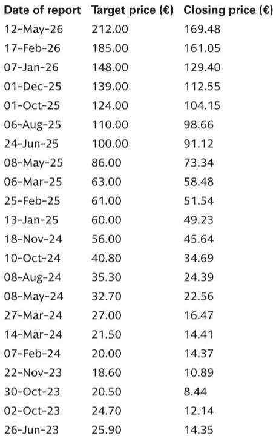

# The AI Value Chain Is Misunderstood: Why Proprietary Data, Not Semiconductor Scale, Will Determine the Winners

The prevailing narrative that artificial intelligence value creation flows primarily to semiconductor companies is not merely incomplete—it is strategically dangerous for investors. A global investment bank report this week revisits a critical argument first made in April: the concentration of economic value in AI semiconductors is unsustainable. This is not a short-term trading call. It is a structural observation about where durable competitive advantage actually resides in the AI ecosystem. The report makes clear that enterprise AI results remain mixed at best despite enormous spending, and that data structure and orchestration have emerged as the binding constraints on value realization. For serious investors, the question is no longer whether AI will matter. The question is which parts of the value chain will capture the profits, and which will simply absorb the costs.

The timing of this reassessment matters. We are entering a phase where the distinction between AI hype and AI substance is becoming measurable. The report's analysis of European media and internet stocks, initiated by a new analyst, provides a concrete framework for separating genuine AI moats from AI-exposed names that lack defensible positions. The framework scores companies on a structural AI moat scale from one to ten, and the dispersion is revealing. RELX scores a nine, while advertising agencies score between three and five. Yet many of the high-moat names are ironically correlated with the bank's "AI at risk" basket. This mispricing is exactly the kind of analytical wedge that generates asymmetric returns.

The argument that follows is not a summary of the report. It is an interpretation of what the report's patterns mean for capital allocation, and it raises questions that the report itself does not fully resolve.

## Proprietary, Difficult-to-Replicate Databases Are the Real AI Moat, Not Compute Scale

The report's AI framework for media and internet stocks centers on a single variable that deserves far more attention than it receives: proprietary, difficult-to-replicate databases. This is not about having more data. It is about having data that cannot be scraped, synthesized, or reverse-engineered by general-purpose large language models. The report identifies RELX as scoring nine out of ten on its AI moat framework, and the reasoning is instructive. RELX operates in legal and scientific information, domains where accuracy, reliability, and licensing matter. A general LLM cannot simply ingest publicly available legal rulings and produce reliable advice. The data must be curated, verified, and structured in ways that require domain expertise and institutional trust.

This insight has second-order implications that the report only begins to explore. If proprietary data is the moat, then companies that own unique, licensable, and AI-ready content are not just defensive—they are positioned to become toll collectors on the AI economy. The report notes that LSEG, which presented at the bank's European Financials Conference, is focused on delivering trusted, licensed, and AI-ready content. This is not a niche observation. It points to a broader structural shift: the winners in enterprise AI will be those who control the inputs, not those who build the models or the chips. The semiconductor companies may capture the upfront capital expenditure, but the recurring revenue from data licensing and AI-ready content has a fundamentally different economic profile—higher margins, lower reinvestment requirements, and longer duration.

The question the report raises but does not fully answer is how to value this data advantage. Traditional valuation frameworks treat data as a cost center or an intangible asset with uncertain useful life. But if data is becoming the primary input for AI-driven revenue growth, then companies with proprietary databases may deserve a valuation premium that current metrics do not capture. The report's initiation of RELX at Buy, with a six percent free cash flow yield versus market pricing of 2.5 percent to perpetuity, suggests that the market is not yet pricing in this structural advantage. The open question is whether this mispricing is a temporary anomaly or a persistent feature of a market that has not yet internalized the shift from compute-led AI to data-led AI.

## The Concentration of Economic Value in Semiconductors Is Structurally Unsustainable

The report's revisiting of the April piece on AI spend versus benefit is timely because the semiconductor trade has become crowded and consensus. The argument is straightforward but powerful: the concentration of economic value in semiconductors is not sustainable. This is not a bearish call on AI. It is a call on the distribution of profits along the value chain. When a single segment captures an outsized share of the economic surplus, competitive dynamics inevitably erode those returns. New entrants emerge. Customers push back. Substitution becomes viable.

The report does not make this explicit, but the logical extension is that the semiconductor cycle in AI has created an extraordinary window of profitability that is likely to narrow. The question is not whether it will narrow, but when and how. The report's analysis of memory semiconductors provides a useful case study. The team raises price targets for Samsung, SK Hynix, and upgrades Kioxia to Buy, citing "higher for longer" DRAM, NAND, and HBM cycles. This is a near-term positive, but it also highlights the cyclicality that makes semiconductor investing structurally different from owning data platforms. Memory cycles turn. HBM demand will eventually normalize. The proprietary data advantage, by contrast, does not cycle. It compounds.

The report also notes that enterprise AI results are mixed at best despite significant spending. This is a critical data point that the market has been slow to internalize. If enterprise AI is not yet delivering measurable returns on investment, then the spending trajectory is not guaranteed. Companies may continue to invest for competitive reasons, but the pace of investment will eventually be disciplined by measurable outcomes. The semiconductor beneficiaries of AI spending are exposed to this risk in ways that data platform companies are not. If enterprise AI disappoints, semiconductor orders can be cut. Data licensing agreements, by contrast, tend to be more sticky and less discretionary.

The report's analysis of the AI disruption debate in media and internet stocks reinforces this point. The new analyst argues that AI moats are generally more resilient than the market assumes, and that many Buy-rated names are correlated with the "AI at risk" basket despite having strong moats. This is a classic mispricing opportunity. The market is treating all AI-exposed names as equivalent, when in reality the dispersion in competitive durability is enormous. The report's framework provides a systematic way to identify which names are genuinely at risk and which are being unfairly penalized.

## The Seismic Industry Offers a Forgotten Play on Oil Capex That the Market Is Overlooking

While the AI narrative dominates market attention, the report reminds us that there are other structural stories worth following. The oil services and seismic data industry, particularly TGS, represents a contrarian opportunity that the report frames in terms of option value. The argument is that international oil companies are warming up to spend more on exploration, driven by falling reserve life and maturing shale. When seismic spend comes in, it is historically lumpy, and shares re-rate quickly. The seismic industry has consolidated, leaving TGS and its peers in a position to wait for the upcycle and exercise real pricing power when it arrives.

This is not a near-term catalyst story. The report is clear that calling timing is difficult, and that the Middle East headlines have temporarily distracted from the underlying case for a return to exploration capex. But the structural logic is compelling. Reserve life is falling. Shale is maturing. The supermajors cannot rely on the Permian basin forever. At some point, they will need to replenish their resource bases, and seismic data is the first step in that process. The companies that own the data and the processing capabilities will benefit disproportionately.

The report does not quantify the potential upside, but the framework is clear: this is a high-conviction, low-probability-of-permanent-loss opportunity. The downside is that the upcycle takes longer to materialize. The upside is that when it does, the re-rating is rapid and significant. For investors who are willing to be patient and contrarian, this is precisely the kind of asymmetric risk-reward profile that generates outsized returns.

The question the report leaves open is whether the oil capex story is independent of the AI narrative or whether there is a connection that the market has not yet made. Data centers are driving power demand, which is positive for electrification names. But data centers also require reliable baseload power, and in many regions, natural gas is the bridge fuel. If AI infrastructure buildout accelerates natural gas demand, that could indirectly support exploration spending. The report does not make this connection explicitly, but it is a logical extension worth considering.

## The Report Leaves Unresolved Questions About the Interaction Between AI and Capital Markets Activity

The report's coverage of capital markets activity is extensive but raises more questions than it answers. The US strategy team raises its forecast for 2026 IPO volumes to $225 billion, citing corporate equity demand that should outweigh record supply. The Europe strategy team notes that deal momentum is building but that Europe remains cautious. The report also highlights the "hybrid renaissance" in credit markets and the growth of retail investing platforms.

The unresolved question is how AI will interact with these capital markets trends. If AI is driving a concentration of value creation in a narrow set of companies, that could have implications for IPO activity, M&A, and capital allocation. Companies with strong AI moats may be more likely to go public or to be acquired at premium valuations. Companies that are exposed to AI disruption risk may need to raise capital or restructure. The report provides the data points but does not synthesize them into a coherent framework for how AI is reshaping the capital markets landscape.

A second unresolved question is about the role of private infrastructure capital in the data center boom. The report notes that the alternatives analyst sees scope for infrastructure AUM to reach $3 trillion by 2030, driven by data center investment. But the report does not address the implications for public market investors. If a significant portion of data center investment is funded by private capital, that could reduce the addressable market for public equities and change the competitive dynamics. The private infrastructure players may be willing to accept lower returns in exchange for long-term, inflation-protected cash flows, which could compress margins for publicly traded data center operators.

A third unresolved question is about the sustainability of AI-driven wealth effects. The US daily report notes that wealth effects from the equity rally are unusually sensitive to the performance of a narrow set of AI infrastructure companies. This concentration of wealth creation creates vulnerability. If the AI trade reverses, the wealth effect could reverse disproportionately, with knock-on effects on consumption and economic growth. The report flags this risk but does not model the scenarios.

## A Decision Framework for Positioning Across the AI Value Chain

For investors who accept the report's premise that the AI value chain is mispriced, the question becomes how to position. The framework below translates the report's insights into actionable portfolio decisions.

First, distinguish between AI enablers and AI beneficiaries. Enablers are companies that provide the infrastructure, data, or tools that make AI possible. Beneficiaries are companies that use AI to improve their existing business models. The report's analysis suggests that the market is overvaluing some enablers (semiconductors) and undervaluing some beneficiaries (data platforms). The framework should overweight companies with proprietary, difficult-to-replicate data assets and underweight companies whose AI exposure is purely about capital expenditure.

Second, use the AI moat score as a screening tool but not as a standalone signal. The report's framework scores companies on a scale of one to ten, with RELX at nine and advertising agencies at three to five. But the score is only useful if it is compared to the market's implied assessment. The report notes that many high-moat names are in the "AI at risk" basket, which suggests mispricing. The framework should identify names where the AI moat score is high but the market is pricing in disruption risk. Those are the candidates for long positions.

Third, consider the interaction between AI and other structural themes. The report highlights oil capex, electrification, and data center buildout as themes that are often treated separately but are increasingly interconnected. The framework should look for names that benefit from multiple themes simultaneously. Siemens Energy, which the report adds to the Conviction List, is an example. It benefits from data center power demand, grid investment, and electrification. The report's analyst expects medium-term guidance to be raised at fiscal year results, and sees potential for 29 billion euros in capital return by 2030. This is not just an AI play. It is a multi-thematic infrastructure play with a catalyst.

Fourth, be patient with contrarian positions. The report's analysis of TGS and the seismic industry is a reminder that the best opportunities often require waiting for the cycle to turn. The framework should allocate a portion of the portfolio to high-conviction, long-duration positions where the downside is limited and the upside is asymmetric. These positions may underperform in the short term, but they provide diversification and optionality.

## The Full Report Contains the Charts and Data That Make These Arguments Actionable

The analysis above is based on a reading of the report's patterns and implications, but it is not a substitute for engaging with the original research. The report contains detailed exhibits, including the AI moat scores by sector, the valuation comparisons for Siemens Energy, and the oil capex data that underpins the TGS thesis. These charts and data points are essential for investors who want to move from conceptual understanding to portfolio implementation.

The report also includes the full suite of initiation notes, conference takeaways, and sector updates that provide the granularity needed for stock-specific decisions. The discussion of the European Financials Conference, for example, includes specific takeaways on HSBC, BBVA, and Vonovia that are not captured in the high-level analysis above. The healthcare section on obesity and peptide manufacturing capacity is a separate deep dive that intersects with AI in ways that the report only begins to explore.

For investors who want to see the original charts, read the full analyst notes, and understand the specific valuation arguments that support the Conviction List additions, the complete report is available to members of the community.

Join the community to read the full report and review the original charts.

*This article is for learning and discussion only and does not constitute investment advice.*

Personal reading notes and learning share only. Not investment advice.

