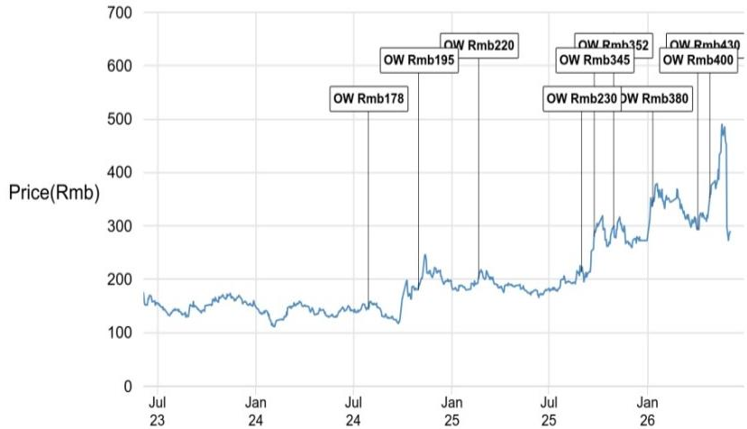
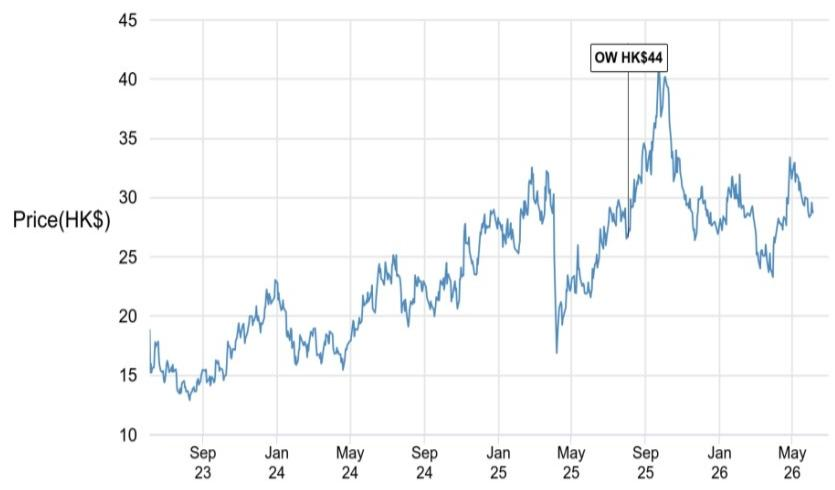
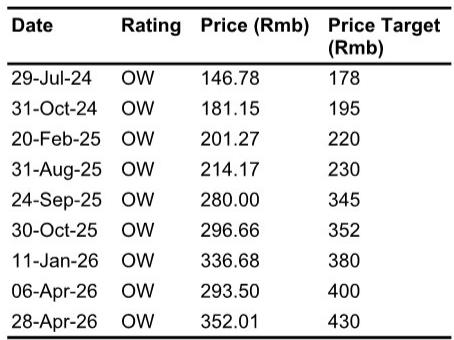

# 中国科技股的核心机会不在下游，而在上游的设备与封测

五月中国科技板块反弹18%之后，市场对近期回调的看法分化。多数讨论集中在AI应用、消费电子复苏节奏和芯片设计公司的估值上。但某外资投行最新研报给出的判断与此不同：当前真正值得加仓的，不是下游的芯片设计或终端组装，而是上游的半导体设备、封测和代工。这个排序的逆转，背后是供应链利润分配的结构性变化。

这份研报将半导体子行业的优先顺序重新排列为：半导体设备大于封测，封测大于代工，代工大于无晶圆设计。对于长期关注中国科技股的投资者而言，这个排序的变动意味着什么？它是否暗示了市场共识的盲点？

简单说，上游企业的订单可见度正在从“季度”拉长到“两年”。下游企业的利润则面临成本上升和需求分化的双重挤压。这不是一个短期的交易信号，而是一个可能持续到2027年的结构性配置逻辑。

## 1. 半导体设备的增长可见度正在从“季度”拉长到“两年”

研报给出的核心数据是：2026年，本土WFE（晶圆前端设备）供应商来自存储和先进逻辑的需求，预计将分别同比增长超过50%和30%，且2027年还有进一步上行空间。这个判断的底层支撑，是长鑫存储和长江存储的IPO时间表推进——这两家企业的资本开支计划正在从“不确定”变为“可预期”。

更关键的是，这个增长周期与以往不同。过去中国半导体设备公司的订单多依赖单一客户的扩产节奏，波动大、可预测性差。但本轮驱动因素更加多元：存储扩产之外，本土AI芯片从2026年下半年开始进入量产爬坡期，将带动后端设备（先进封装、测试等）的增量需求。这意味着设备公司的收入来源正在从“单引擎”变为“双引擎”，增长的可预测性显著提升。

对于估值而言，这带来的不是简单的盈利上调，而是估值框架的切换——从“周期股”切换到“成长股”。研报明确提到，“延长增长可见性有助于支撑该板块的高估值”。这句话的实际含义是：市场此前对设备股的高估值存在疑虑，但如果订单能见度从12个月拉长到24个月，那么当前估值就有了基本面支撑。

## 2. 封测与代工正在享受一轮“量价齐升”，但利润分配并不均匀

研报观察到，2026年第二季度，代工厂和封测厂出现了“强劲且持续的涨价”。背后的逻辑是产能利用率提升，以及上游材料成本上涨的传导。这听起来像是整个板块的利好，但细看之下，利润分配并不均匀。

涨价能否转化为利润，取决于两个变量：折旧压力和产品结构。代工厂和封测厂正面临因资本开支增加而上升的折旧负担，这会侵蚀毛利。真正能跑赢的，是那些对AI相关产品（如GPU、PMIC）敞口更高的封测厂——这些产品的毛利率更高，涨价传导也更顺畅。

这意味着，投资者不能简单地把“封测涨价”等同于“所有封测股受益”。真正的区分度在于：哪些公司拿到了AI相关的封装订单，哪些公司还在做传统的消费电子封装。前者可以享受“量价齐升”的正向循环，后者可能面临“涨价但被折旧吃掉”的尴尬。

## 3. 下游的分化比市场想象的更剧烈：AI在加速，消费在减速

研报对下游的判断采取了“精选”策略，而非全面看多。从需求端看，云服务提供商的资本开支依然强劲，AI应用的渗透正在拉动服务器和AI芯片的采购。汽车和工业领域的组件需求也在2026年第二季度出现复苏。但消费电子——尤其是安卓手机和AIoT设备——的需求正在走弱。

这个分化意味着什么？对于本土GPU和AI ASIC公司而言，本土代工产能的增加正在缓解供应瓶颈，新一代芯片的量产有望加速销售增长。但对于那些高度依赖消费电子、且无法将上游涨价转嫁给客户的无晶圆设计公司而言，利润压力正在累积。

研报没有明说但逻辑上可以推导的是：下游的“精选”策略，本质上是在押注那些有定价权或产品不可替代性的公司。如果一家芯片设计公司的主要客户是手机厂商，且产品可替代性高，那么上游涨价和下游需求走弱的双重压力，可能会在2026年下半年集中体现。

## 4. 一个尚未完全回答的问题：上游的涨价能持续多久？

研报对上游持乐观态度，但有一个关键变量没有被充分讨论：涨价的可持续性。当前封测和代工的涨价，部分原因是材料成本上涨的被动传导。如果材料成本回落，涨价逻辑会如何演变？如果下游消费电子需求进一步走弱，导致部分产能利用率下降，涨价是否还能维持？

这个问题之所以重要，是因为它决定了上游利润改善的“质量”。如果是需求驱动的涨价（如AI相关封装），利润改善是可持续的；如果是成本驱动的涨价，利润改善可能是一次性的。研报倾向于前者，但对于成本端的变化着墨不多，这可能是完整报告中需要进一步探讨的部分。

## 5. 观察框架：用三个维度筛选上游的“真赢家”

基于研报的逻辑，投资者在评估上游机会时，可以建立一个三层筛选框架：

第一层是订单可见度。设备公司的订单是否来自存储和先进逻辑的双轮驱动？订单能见度是否超过12个月？这决定了估值能否从“周期”切换到“成长”。

第二层是涨价传导能力。封测和代工公司的涨价，是成本驱动的被动传导，还是产能紧张驱动的主动提价？如果是后者，利润改善的持续性更强。

第三层是产品结构。公司对AI相关产品的敞口有多大？AI封装、GPU测试等业务的毛利率是否显著高于传统业务？这决定了在行业整体涨价中，哪些公司能拿到更大的利润份额。

这个框架可以帮助投资者避免“买整个板块”的粗放策略，转而聚焦那些真正受益于结构性变化的公司。

## 6. 报告没有完全展开的两个风险

第一个风险是IPO时间表的变数。研报将设备需求增长的重要假设建立在长鑫存储和长江存储的IPO推进上。但这两家公司的上市进程受到政策、市场环境和地缘政治等多重因素影响，时间表可能存在不确定性。如果IPO延迟，对应的资本开支节奏也可能低于预期。

第二个风险是AI芯片量产的实际爬坡速度。研报假设2026年下半年本土AI芯片开始量产，但芯片从流片到量产再到良率爬坡，中间存在大量技术风险。如果量产进度慢于预期，后端设备的需求增量也会相应推迟。

这两个风险并非研报的缺陷，而是任何前瞻性判断都需要面对的不确定性。对于投资者而言，关键在于跟踪这些假设的验证节奏，而不是简单接受结论。

---

这篇文章的完整版本，包含更详细的子行业分析、具体公司的估值讨论，以及研报中未充分展开的图表和情景分析，已经在知识星球和微信群中分享。如果你对上述框架中的某个环节有疑问，或者想看到更多关于设备订单能见度和封测涨价传导的量化分析，欢迎来星球微信群里继续讨论。

Personal reading notes and learning share only. Not investment advice.

