# US Biopharmaceuticals

# GLP-1 tracker: Long weekend impacts weekly scripts (W/E May 29th)

Courtney Breen

+1 917 344 8407

courtney.breen@bernsteinsg.com

Woody Polglase

+1 917 344 8314

woody.polglase@bernsteinsg.com

Louisa Qiu

+1 917 344 8495

louisa.qiu@bernsteinsg.com

# Specialist Sales

Christian Moore

+1 917 344 8555

christian.moore@bernsteinsg.com

This week's scripts were (as expected, and flagged previously) impacted by the long weekend, and hence total scripts were down \~6% for the class. Foundayo saw 16,982 TRx in its eighth week, +971 and +6.1% sequentially, given it is still in its launch phase. Wegovy Pill, on the other hand, saw 134k TRx this week, down -11.9k (-8%) sequentially. On NBRx, Lilly maintains a share of \~53% despite volatility at the start of 2026, due to the Wegovy Pill launch (Exhibit 18).

Total scripts: Total weekly scripts for the week ending 29th May were 2.44M, down vs last week (-5.67%, or -146k in absolute terms). The 4-week YoY growth for sema+tirz was 39.2%, down slightly on 39.3% last week. The company market share split (sema vs tirz) on a TRx basis is now 59.7% Lilly (26.4% Zepbound, 32.6% Mounjaro, 0.7% Foundayo) to 40.3% Novo (13.3% Wegovy pen, 5.8% Wegovy pill, 21.2% Ozempic).

Zepbound: Weekly market share for Zepbound decreased to 26.4% (-0.48 pp vs last week). YoY growth (4-wk avg) decreased to 79% from 82% (although impacted by recent drops). Whilst it has appeared like Zepbound NBRx has declined post-Wegovy pill launch (Exhibit 18), absolute numbers of NBRxs have held at around 60k per week this year (Exhibit 17). Zepbound growth split by presentations is, unsurprisingly, also volatile in light of IQVIA reporting (Exhibit 15, Exhibit 16). Mounjaro: This week Mounjaro posted 40.6% growth (4-week YoY), flat week on week (vs 40.6%), but down from the \~60% level sustained from Aug '25-Jan '26. Mkt share increased marginally to \~32.6% (+0.20 pp).

Semaglutide: Growth diverges significantly by indication and presentation. Wegovy Pill had \~134k TRx this week, -12k scripts. Wegovy pen's 4-week avg YoY growth is \~45%. However, Ozempic (T2D) continues to decline YoY at a 4-week avg of -12.5% (versus last week at -12.6%). Overall, semaglutide (Ozempic and Wegovy) posted 20.4% YoY growth, up on 19.5% last week.

Recent Foundayo/Orfo notes: LLY: With an earlier than expected approval, we frame early expectations for Lilly's oral (orfo / Foundayo) GLP-1 launch /// LLY: Refining Foundayo (orfo) scenarios for 2026 - \$2.0B well within reach; Raising estimates for 2026 after Q1: Eli Lilly: 26Q1 wrap - raising revenue estimates to 87.3B FY (+34% yoy), (further refines Q2 Foundayo estimates to \$157m)

BERNSTEIN TICKER TABLE 

<table><tr><td rowspan="2"></td><td colspan="4">4 Jun 2026</td><td rowspan="2">TTMRel.</td><td colspan="4">Adjusted EPS</td><td colspan="3">Adjusted P/E (x)</td></tr><tr><td>Rating</td><td>Cur</td><td>Closing Price</td><td>Price Target</td><td>Cur</td><td>2025A</td><td>2026E</td><td>2027E</td><td>2025A</td><td>2026E</td><td>2027E</td></tr><tr><td>LLY (Eli Lilly)</td><td>O</td><td>USD</td><td>1,125.27</td><td>1,300.00</td><td>19.9%</td><td>USD</td><td>24.20</td><td>37.41</td><td>47.99</td><td>46.5</td><td>30.1</td><td>23.4</td></tr><tr><td>SPX</td><td></td><td></td><td>7,584.31</td><td></td><td></td><td></td><td></td><td></td><td></td><td></td><td></td><td></td></tr></table>

O - Outperform, M - Market-Perform, U - Underperform, NR - Not Rated, CS - Coverage Suspended   
Source: Bloomberg, Bernstein estimates and analysis.

# INVESTMENT IMPLICATIONS

We rate LLY Outperform with a price target of \$1,300.

# DETAILS

# ORAL GLP-1 LAUNCH DYNAMICS

Early, daily-to-weekly script conversion for Foundayo seems to correlate (Exhibit 8), but large gaps in conversion of absolute daily TRx into weekly numbers continue; \~12% vs \~79% for Wegovy Pill in week 5 (Exhibit 9). However, based on Lilly's earnings commentary, we continue to view oral GLP-1s as market-expanding, and estimate the IQVIA capture rate for Foundayo at \~70% (Exhibit 7). We agree with management that this launch is likely to play out over months, not weeks, for a couple of reasons: (1) this is an entirely new molecule (Wegovy Pill is a sema line extension), and requires greater physician education, and (2) given this, DTC advertising is unable to begin until physicians have been sufficiently educated, meaning DTC ads, including TV, won't start until Q3.

At the 2026 Novo AGM, Novo (covered by Justin Smith) reported that weekly Wegovy pill TRx were 3x higher than tirzepatide at week 10, whereas IQVIA prescription data suggested 1.6× (assuming tirzepatide = Zepbound). The patient/TRx counts reported by Novo may somewhat differ to our data considering that: (1) Novo has access to more timely and granular data, (2) NovoCare & other scripts may not yet be fully captured in IQVIA, and (3) in the future, adherence rates may influence observed patterns; i.e. adherence rates below 100% would imply a higher actual patient count than TRx suggests. Novo has been suggesting IQVIA has a capture rate of only 50% for the Wegovy pill to date - similar to the low capture rates we saw for the Zepbound vial when launched in Lilly Direct, and triangulating with their new 3x tirzepatide figure. On the 1Q26 earnings call, Lilly reported approximately 20k patients to date. We estimate an IQVIA capture rate for Foundayo of \~70%, compared with Novo's estimated \~50% capture rate for oral Wegovy.

EXHIBIT 1: Oral GLP-1 Launch Trajectories (TRx)   
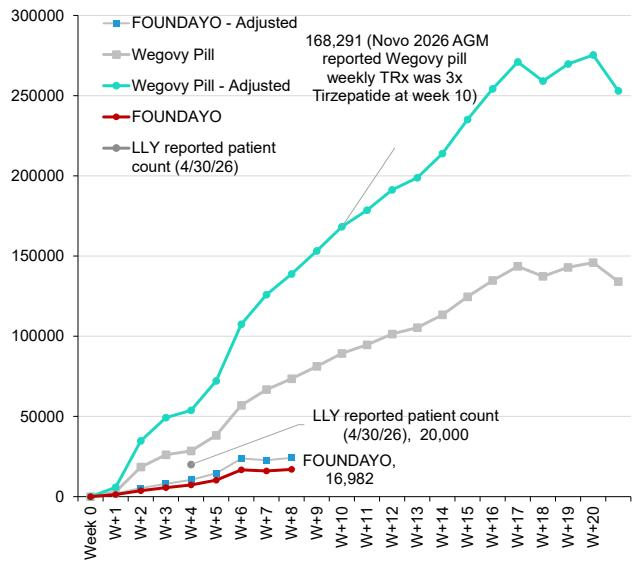

line

| Week | FOUNDAYO - Adjusted | Wegovy Pill | Wegovy Pill - Adjusted | LLY reported patient count |
|------|---------------------|-------------|------------------------|----------------------------|
| 0    | 0                   | 0           | 0                      | 0                          |
| W+1  | ~5000               | ~10000      | ~35000                 | ~5000                      |
| W+2  | ~10000              | ~20000      | ~50000                 | ~10000                     |
| W+3  | ~15000              | ~25000      | ~75000                 | ~15000                     |
| W+4  | ~20000              | ~30000      | ~100000                | ~20000                     |
| W+5  | ~25000              | ~40000      | ~125000                | ~25000                     |
| W+6  | ~30000              | ~55000      | ~155000                | ~30000                     |
| W+7  | ~35000              | ~65000      | ~175000                | ~35000                     |
| W+8  | ~40000              | ~75000      | ~195000                | ~40000                     |
| W+9  | ~45000              | ~85000      | ~215000                | ~45000                     |
| W+10 | ~50000              | ~95000      | ~235000                | ~50000                     |
| W+11 | ~55000              | ~105000     | ~255000                | ~55000                     |
| W+12 | ~60000              | ~115000     | ~275000                | ~60000                     |
| W+13 | ~65000              | ~125000     | ~295000                | ~65000                     |
| W+14 | ~70000              | ~135000     | ~315000                | ~70000                     |
| W+15 | ~75000              | ~145000     | ~335000                | ~75000                     |
| W+16 | ~80000              | ~155000     | ~355000                | ~80000                     |
| W+17 | ~85000              | ~165000     | ~375000                | ~85000                     |
| W+18 | ~90000              | ~175000     | ~395000                | ~90000                     |
| W+19 | ~95000              | ~185000     | ~415000                | ~95000                     |
| W+20 | 16,982              | ~195,982    | ~435,982               | 2,2,3,4,6,8,9,12,16,29,3,4,6,7,8,9,16,29,29,4,6,8,9,16,9,29,4,6,8,9,8,9,8,9,8,9,8,9,8,9,8,9,8,9,8,9,8,9,8,9,8,9,8,9,8,9,8,9,8,9,8,9,8,9,8,9,8,9,8,9,8,9,8,9,8,9,8,9,8,8,9,8,9,8,9,8,9,8,9,8,9,8,9,8,9,8,9,8,9,8,9,8,9,8,9,8,9,8,9,8,9,8,9,8,9,8,9,8,9,8,9,8,9,8,9,8,9,8,<nl>

Novo '26 AGM reported that weekly oral Wegovy scripts were 3x those of tirzepatide (assumed to be Zepbound) at week 10; adjusted Wegovy figures assume the same capture rate as reported by Novo at week 10.
Source: IQVIA, Bernstein analysis

EXHIBIT 2: Wegovy Pill & Foundayo vs Zepbound Launch (New to Brand - NBRx; Weekly)   
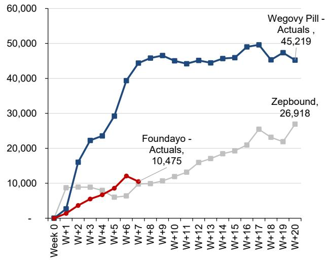

line

| Week | Wegovy Pill - Actuals | Zepbound |
|------|------------------------|----------|
| W+1  | 0                      | 0        |
| W+2  | 15000                  | 8000     |
| W+3  | 22000                  | 9000     |
| W+4  | 24000                  | 8500     |
| W+5  | 30000                  | 7000     |
| W+6  | 40000                  | 6000     |
| W+7  | 45000                  | 10,475   |
| W+8  | 46000                  | 10,475   |
| W+9  | 45000                  | 11,000   |
| W+10 | 44000                  | 12,000   |
| W+11 | 45000                  | 13,000   |
| W+12 | 44000                  | 14,000   |
| W+13 | 45000                  | 15,000   |
| W+14 | 46000                  | 16,000   |
| W+15 | 47000                  | 17,000   |
| W+16 | 48000                  | 18,000   |
| W+17 | 49000                  | 25,000   |
| W+18 | 45000                  | 23,000   |
| W+19 | 47000                  | 22,000   |
| W+20 | 45,219                 | 26,918   |

Data from W/E 22nd May
Source: IQVIA, Bernstein analysis

EXHIBIT 3: Daily scripts track below weekly in absolute amount, but are directionally correct   
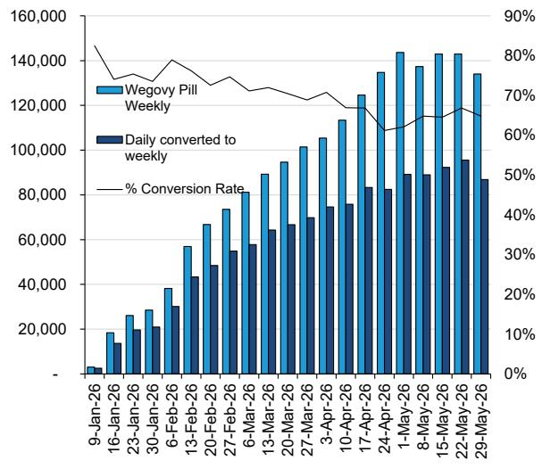

bar_line

| Date | Wegovy Pill Weekly | Daily converted to weekly | % Conversion Rate (%) |
|---|---|---|---|
| 9-Jan-26 | 5000 | - | 85 |
| 16-Jan-26 | 18000 | 15000 | 75 |
| 23-Jan-26 | 27000 | 20000 | 78 |
| 30-Jan-26 | 34000 | 22000 | 80 |
| 6-Feb-26 | 58000 | 30000 | 82 |
| 13-Feb-26 | 67000 | 45000 | 78 |
| 20-Feb-26 | 74000 | 55000 | 75 |
| 27-Feb-26 | 81000 | 58000 | 73 |
| 6-Mar-26 | 90000 | - | 72 |
| 13-Mar-26 | - | 65000 | 71 |
| 20-Mar-26 | 95000 | 67000 | 70 |
| 27-Mar-26 | 102000 | 71000 | 69 |
| 3-Apr-26 | 106000 | 75000 | 68 |
| 10-Apr-26 | 113000 | 77000 | 67 |
| 17-Apr-26 | 125000 | 84000 | 65 |
| 24-Apr-26 | 135000 | 83000 | 64 |
| 1-May-26 | 144000 | 91000 | 63 |
| 8-May-26 | 138000 | 91000 | 64 |
| 15-May-26 | 143000 | 94000 | 65 |
| 22-May-26 | 143000 | 97000 | 66 |
| 29-May-26 | 135000 | 87000 | 65 |

Source: IQVIA, Bernstein analysis

EXHIBIT 4: Daily TRx's correlate well with the Weekly data IQVIA collects   
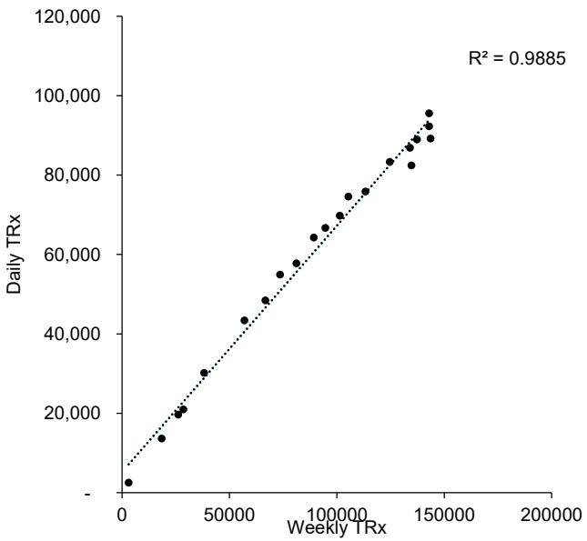

scatter

| Weekly TRx | Daily TRx |
| ---------- | --------- |
| 0          | 0         |
| 20000      | 15000     |
| 40000      | 30000     |
| 60000      | 45000     |
| 80000      | 60000     |
| 100000     | 75000     |
| 120000     | 90000     |
| 140000     | 105000    |
| 160000     | 120000    |

Source: IQVIA, Bernstein analysis

EXHIBIT 5: Initial weeks of launch scripts (TRx) 

<table><tr><td>Weekly TRx Indexed to Launch</td><td>Week 0</td><td>W+1</td><td>W+2</td><td>W+3</td><td>W+4</td><td>W+5</td><td>W+6</td><td>W+7</td><td>W+8</td></tr><tr><td>Zepbound</td><td>0</td><td>1,255</td><td>7,642</td><td>15,964</td><td>22,327</td><td>19,045</td><td>25,199</td><td>38,703</td><td>37,021</td></tr><tr><td>Wegovy Pill</td><td>0</td><td>3,071</td><td>18,410</td><td>26,109</td><td>28,515</td><td>38,220</td><td>56,943</td><td>66,748</td><td>73,544</td></tr><tr><td>Wegovy Pill - Adjusted</td><td>0</td><td>5,794</td><td>34,736</td><td>49,262</td><td>53,802</td><td>72,113</td><td>107,440</td><td>125,940</td><td>138,762</td></tr><tr><td>FOUNDAYO</td><td>0</td><td>1,390</td><td>3,707</td><td>5,612</td><td>7,335</td><td>10,248</td><td>16,698</td><td>16,011</td><td>16,982</td></tr><tr><td>FOUNDAYO - Adjusted</td><td>0</td><td>1,978</td><td>5,275</td><td>7,985</td><td>10,437</td><td>14,582</td><td>23,760</td><td>22,782</td><td>24,164</td></tr></table>

Wegovy Pill adjusted for poor capture rates (Novo commented only 50% capture rate)   
Source: IQVIA, Bernstein analysis

EXHIBIT 6: Wegovy NBRx seemed to inflect much more than Foundayo early in its launch 

<table><tr><td>NBRx</td><td>Week 0</td><td>W+1</td><td>W+2</td><td>W+3</td><td>W+4</td><td>W+5</td><td>W+6</td><td>W+7</td></tr><tr><td>Zepbound</td><td>-</td><td>8,712</td><td>8,905</td><td>8,863</td><td>7,946</td><td>6,001</td><td>6,366</td><td>9,785</td></tr><tr><td>Wegovy Pill - Actuals</td><td>-</td><td>2,690</td><td>16,022</td><td>22,260</td><td>23,547</td><td>29,217</td><td>39,366</td><td>44,366</td></tr><tr><td>Wegovy Pill First Week Adjusted (5/7 days)</td><td>-</td><td>3,202</td><td>16,022</td><td>22,260</td><td>23,547</td><td>29,217</td><td>39,366</td><td>44,366</td></tr><tr><td>Foundayo - Actuals</td><td>-</td><td>1,381</td><td>3,641</td><td>5,494</td><td>6,710</td><td>8,578</td><td>12,078</td><td>10,475</td></tr><tr><td>Foundayo First Week Adjusted (2/7 days)</td><td>-</td><td>3,836</td><td>3,641</td><td>5,494</td><td>6,710</td><td>8,578</td><td>12,078</td><td>10,475</td></tr></table>

This is based on Weekly NBRx data, not daily   
Source: IQVIA, Bernstein analysis

EXHIBIT 7: We estimate \~70% capture rate for Foundayo 

<table><tr><td colspan="2">Foundayo IQVIA capture rate estimation</td></tr><tr><td>Foundayo launch date</td><td>4/9/2026</td></tr><tr><td>LLY comment of 20k pts effective date</td><td>4/29/2026</td></tr><tr><td>Days since launch</td><td>21</td></tr><tr><td>TRx per day</td><td>952</td></tr><tr><td>IQVIA latest scripts day</td><td>4/24/2026</td></tr><tr><td>Days since launch</td><td>16</td></tr><tr><td>IQVIA latest cumulative TRx</td><td>10709</td></tr><tr><td>TRx per day</td><td>669</td></tr><tr><td>Estimated LLY/IQVIA capture rate</td><td>70.3%</td></tr></table>

Source: Company reports, Bernstein analysis

EXHIBIT 8: Early data points, but daily Foundayo scripts - although materially lower - look to trend well with weekly scripts   
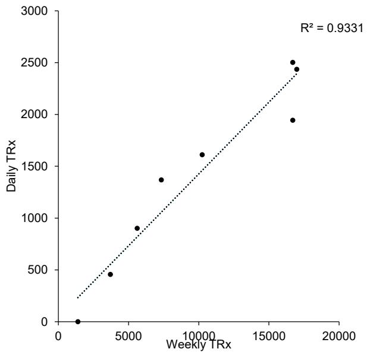

scatter

| Weekly TRx | Daily TRx |
| ---------- | --------- |
| 0          | 0         |
| 4000       | 450       |
| 6000       | 900       |
| 8000       | 1350      |
| 10000      | 1600      |
| 17000      | 2450      |

Source: IQVIA, Bernstein analysis

EXHIBIT 9: Daily-to-weekly script conversion does not yet show a stable or directional relationship   
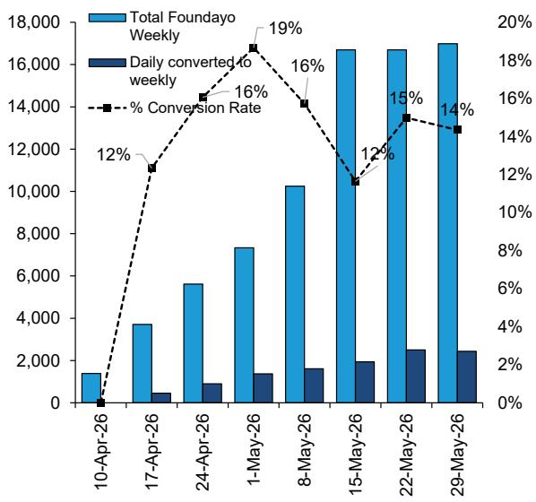

bar_line

| Date | Total Foundayo Weekly | Daily converted to weekly | % Conversion Rate |
| :--- | :--- | :--- | :--- |
| 10-Apr-26 | 1500 | 0 | 0% |
| 17-Apr-26 | 3800 | 500 | 12% |
| 24-Apr-26 | 5600 | 900 | 16% |
| 1-May-26 | 7400 | 1400 | 19% |
| 8-May-26 | 10300 | 1700 | 16% |
| 15-May-26 | 16800 | 2000 | 12% |
| 22-May-26 | 16800 | 2500 | 15% |
| 29-May-26 | 17000 | 2500 | 14% |

Source: IQVIA, Bernstein analysis

EXHIBIT 10: Potentially some impact on Wegovy daily NRx following the Foundayo approval   
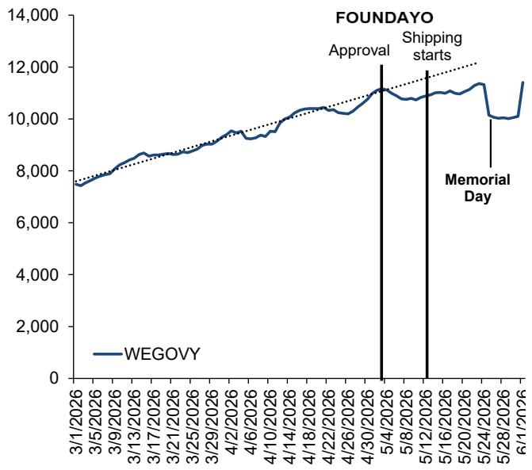

line

| Date       | WEGOVY |
| ---------- | ------ |
| 3/1/2026   | 7,500  |
| 4/30/2026  | 11,000 |
| 5/8/2026   | 11,000 |
| 5/12/2026  | 11,000 |
| 5/24/2026  | 10,500 |
| 6/1/2026   | 11,500 |

Source: IQVIA Daily TRx, Bernstein analysis

EXHIBIT 11: At the 2026 Novo AGM, Novo reported that weekly Wegovy pill TRx were three times higher than tirzepatide at week 10   
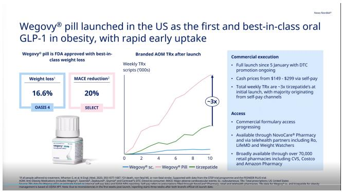

line

| Metric | Value |
|--------|-------|
| Weight loss¹ | 16.6% |
| MACE reduction² | 20% |
| Select | - |
| Branded AOM TRx after launch | ~3X |

Source: Novo 2026 AGM

EXHIBIT 12: Total new patient starts on GLP-1s remain elevated   
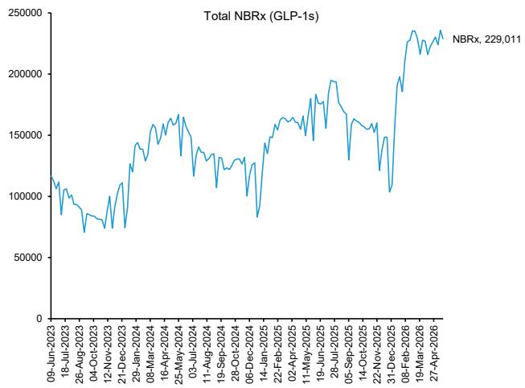

line

| Date       | Total NBRx |
| ---------- | ---------- |
| 27-Apr-2026 | 229,011    |

Data from week ending 22-May
Source: IQVIA, Bernstein analysis

# TOTAL PRESCRIPTIONS (TRX) & NEW PRESCRIPTIONS (NRX)

TRx demonstrates total scripts, whereas NRx demonstrates all new prescriptions (regardless of whether they are for new patients, or for renewals for current patients).

EXHIBIT 13: GLP1 Weekly TRx data   
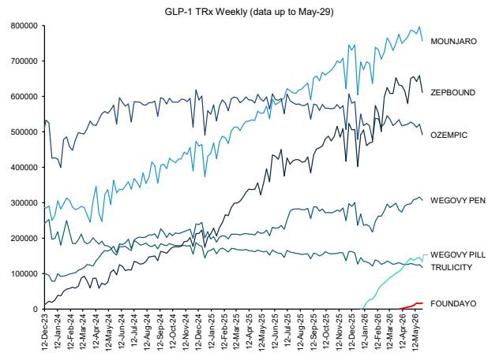  
Source: IQVIA, Bernstein analysis

EXHIBIT 14: GLP1 Weekly NRx data   
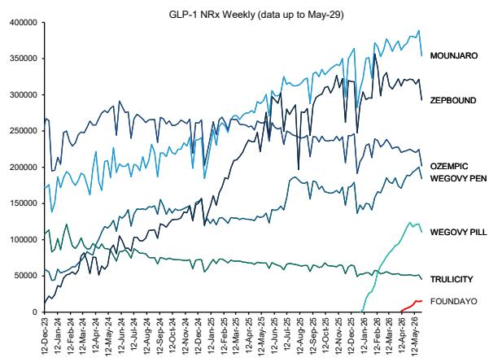  
Source: IQVIA, Bernstein analysis

EXHIBIT 15: Zepbound Weekly TRx data by form   
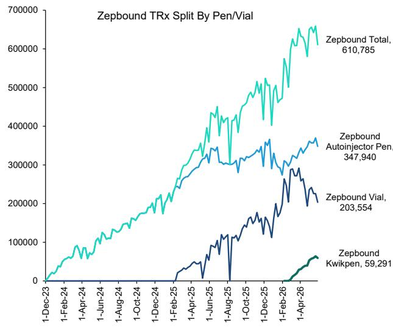

line

| Date       | Zepbound Total | Zepbound Autoinjector Pen | Zepbound Vial | Zepbound Kwikpen |
| ---------- | -------------- | ------------------------ | ------------- | ---------------- |
| 1-Dec-23   | 0              | 0                        | 0             | 0                |
| 1-Feb-24   | ~50,000        | ~10,000                  | ~0            | ~0               |
| 1-Apr-24   | ~100,000       | ~20,000                  | ~0            | ~0               |
| 1-Jun-24   | ~150,000       | ~30,000                  | ~0            | ~0               |
| 1-Aug-24   | ~200,000       | ~40,000                  | ~0            | ~0               |
| 1-Oct-24   | ~250,000       | ~50,000                  | ~0            | ~0               |
| 1-Dec-24   | ~300,000       | ~60,000                  | ~0            | ~0               |
| 1-Feb-25   | ~350,000       | ~70,000                  | ~5,000        | ~5,000           |
| 1-Apr-25   | ~400,000       | ~80,000                  | ~15,000       | ~15,000          |
| 1-Jun-25   | ~450,000       | ~90,000                  | ~30,000       | ~30,000          |
| 1-Aug-25   | ~500,000       | ~10,000                  | ~5,000        | ~5,000           |
| 1-Oct-25   | ~550,000       | ~12,000                  | ~15,000       | ~15,000          |
| 1-Dec-25   | ~600,000       | ~15,000                  | ~25,000       | ~25,000          |
| 1-Feb-26   | ~650,000       | ~25,000                  | ~35,000       | ~35,000          |
| 1-Apr-26   | 610,785        | 347,940                  | 203,554       | 59,291           |

Zepbound vials and kwikpens are offered in the LillyDirect DTC channel Source: IQVIA, Bernstein analysis

EXHIBIT 16: 4 Wk Rolling growth rates for Zepbound TRx by form   
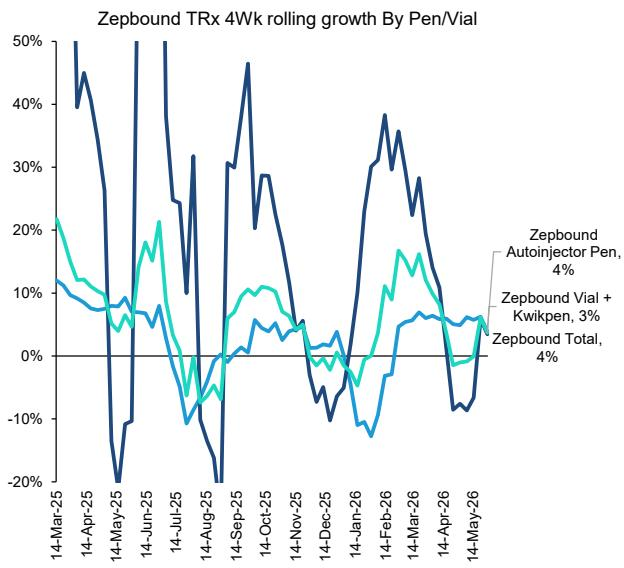

line

| Date       | Zepbound Autoinjector Pen | Zepbound Vial + Kwikpen | Zepbound Total |
| ---------- | ------------------------ | ----------------------- | -------------- |
| 14-Mar-25  | 20%                      | 10%                     | 10%            |
| 14-Apr-25  | 10%                      | 5%                      | 5%             |
| 14-May-25  | -20%                     | 0%                      | 0%             |
| 14-Jun-25  | 50%                      | 20%                     | 20%            |
| 14-Jul-25  | 10%                      | -5%                     | -5%            |
| 14-Aug-25  | -20%                     | -10%                    | -10%           |
| 14-Sep-25  | 30%                      | 10%                     | 10%            |
| 14-Oct-25  | 20%                      | 5%                      | 5%             |
| 14-Nov-25  | 0%                       | 0%                      | 0%             |
| 14-Dec-25  | -10%                     | -5%                     | -5%            |
| 14-Jan-26  | -10%                     | -5%                     | -5%            |
| 14-Feb-26  | 30%                      | 10%                     | 10%            |
| 14-Mar-26  | 20%                      | 5%                      | 5%             |
| 14-Apr-26  | -10%                     | -5%                     | -5%            |
| 14-May-26  | 0%                       | 0%                      | 0%             |

Zepbound vials and kwikpens are offered in the LillyDirect DTC channel Source: IQVIA, Bernstein analysis

# NEW TO BRAND PRESCRIPTIONS (NBRX)

NBRx data - new to brand are scripts just for new users, that haven't filled a script for that brand in the past (either naive to the GLP1 market, or switching from another brand). This demonstrates with greater fidelity what we've seen from the CVS Caremark formulary change & provides a sense for where shares are trending towards.

Note, the new to brand weekly data is released by IQVIA at a lag to the rest of the weekly data. Please reach out if you'd like updated graphs before our next tracker when the data is released next week.

EXHIBIT 17: NBRx - Broken out by pens and vials for Zepbound (vs Wegovy)   
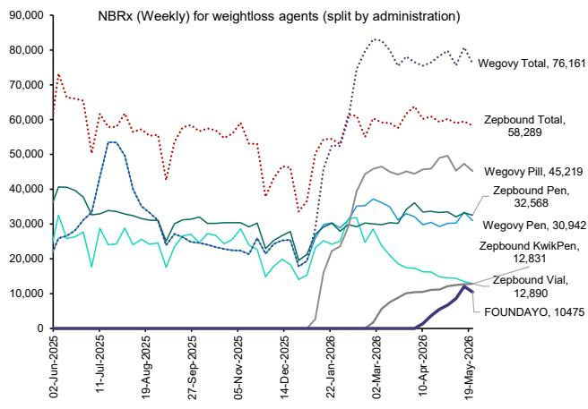

line

| Date       | Wegovy Total | Zepbound Total | Wegovy Pill | Zepbound Pen | Wewgopy Total | Wewgopy Pen | Zepbound KwikPen | Zepbound Vial | FOUNDAYO |
|------------|--------------|----------------|-------------|--------------|---------------|-------------|------------------|--------------|----------|
| 02-Jun-2025 | 76,161       | 58,289         | 45,219      | 32,568       | -             | -           | -                | -            | -        |
| 11-Jul-2025 | -            | -              | -           | -            | -             | -           | -                | -            | -        |
| 19-Aug-2025 | -            | -              | -           | -            | -             | -           | -                | -            | -        |
| 27-Sep-2025 | -            | -              | -           | -            | -             | -           | -                | -            | -        |
| 05-Nov-2025 | -            | -              | -           | -            | -             | -           | -                | -            | -        |
| 14-Dec-2025 | -            | -              | -           | -            | -             | -           | -                | -            | -        |
| 22-Jan-2026 | -            | -              | -           | -            | -             | -           | -                | -            | -        |
| 02-Mar-2026 | 76,161       | 58,289         | 45,219      | 32,568       | -             | -           | -                | -            | -        |
| 10-Apr-2026 | 76,161       | 58,289         | 45,219      | 32,568       | -             | -           | 12,831           | 12,890       | 10475    |
| 19-May-2026 | 76,161       | 58,289         | 45,219      | 32,568       | 12,890        | 12,890      | 12,831           | 12,890       | 10475    |

Data from week ending 22-May   
Source: IQVIA, Bernstein analysis

EXHIBIT 18: LLY vs Novo on % of share of NBRx   
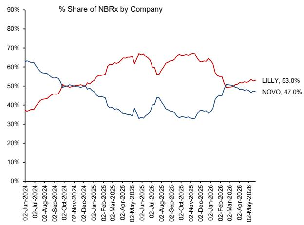

line

| Date       | LILLY | NOVO  |
| ---------- | ----- | ----- |
| 02-Jun-2024 | 53.0% | 47.0% |

Data from week ending 22-May   
Source: IQVIA, Bernstein analysis

EXHIBIT 19: The Wegovy pill is taking NBRx share of weightloss drugs   
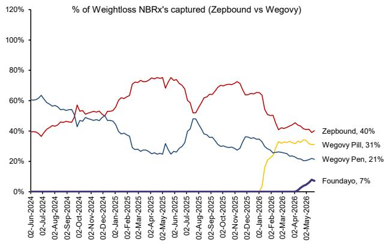

line

| Date       | Zepbound | Wegovy Pill | Wegovy Pen |
| ---------- | -------- | ----------- | ---------- |
| 02-Jun-2024 | 40%      | -           | -          |
| 02-Jul-2024 | -        | -           | 60%        |
| 02-Aug-2024 | -        | -           | 55%        |
| 02-Sep-2024 | -        | -           | 50%        |
| 02-Oct-2024 | -        | -           | 45%        |
| 02-Nov-2024 | -        | -           | 40%        |
| 02-Dec-2024 | -        | -           | 35%        |
| 02-Jan-2025 | -        | -           | 30%        |
| 02-Feb-2025 | -        | -           | 25%        |
| 02-Mar-2025 | -        | -           | 20%        |
| 02-Apr-2025 | -        | -           | 15%        |
| 02-May-2025 | -        | -           | 10%        |
| 02-Jun-2025 | -        | -           | 5%         |
| 02-Jul-2025 | -        | -           | 0%         |
| 02-Aug-2025 | -        | -           | 0%         |
| 02-Sep-2025 | -        | -           | 0%         |
| 02-Oct-2025 | -        | -           | 0%         |
| 02-Nov-2025 | -        | -           | 0%         |
| 02-Dec-2025 | -        | -           | 0%         |
| 02-Jan-2026 | -        | 31%         | 35%        |
| 02-Feb-2026 | -        | -           | 30%        |
| 02-Mar-2026 | -        | -           | 25%        |
| 02-Apr-2026 | -        | -           | 20%        |
| 02-May-2026 | 40%      | 31%         | 21%        |
| Foundayo   | -        | -           | 7%         |

Data from week ending 22-May   
Source: IQVIA, Bernstein analysis

# TRX 4-WEEKLY ROLLING TRENDS

EXHIBIT 20: Semaglutide vs Tirzepatide - 4 weekly average TRx share   
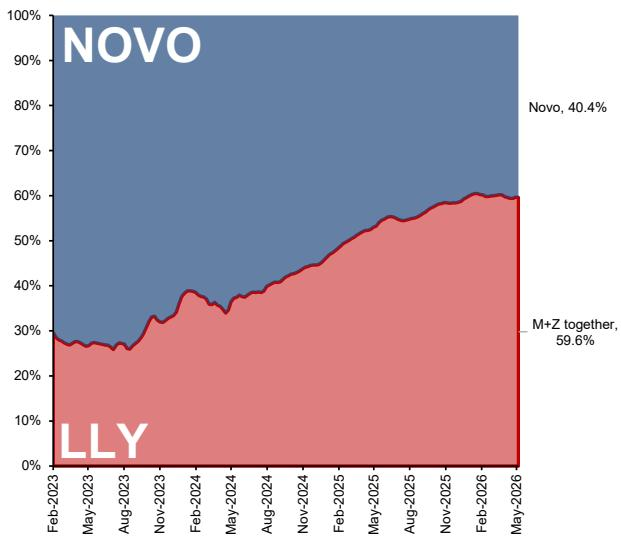

area

| Date       | LLY   | Novo  |
| ---------- | ----- | ----- |
| Novo       | 59.6% | 40.4% |

Source: IQVIA, Bernstein analysis

EXHIBIT 21: 4 weekly average TRx share by Brand   
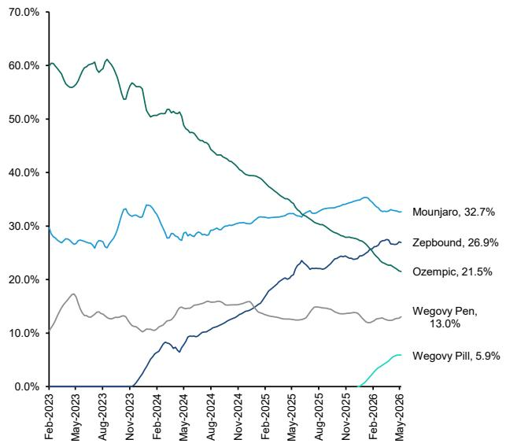

line

| Date       | Mounjaro | Zepbound | Ozempic | Wegovy Pen | Wegovy Pill |
| ---------- | -------- | -------- | ------- | ---------- | ----------- |
| Feb-2023   | 60.0%    | 30.0%    | 28.0%   | 10.0%      | 0.0%        |
| May-2023   | 60.0%    | 30.0%    | 28.0%   | 15.0%      | 0.0%        |
| Aug-2023   | 60.0%    | 30.0%    | 28.0%   | 15.0%      | 0.0%        |
| Nov-2023   | 60.0%    | 30.0%    | 28.0%   | 15.0%      | 0.0%        |
| Feb-2024   | 55.0%    | 35.0%    | 28.0%   | 15.0%      | 0.0%        |
| May-2024   | 55.0%    | 35.0%    | 28.0%   | 15.0%      | 0.0%        |
| Aug-2024   | 55.0%    | 35.0%    | 28.0%   | 15.0%      | 0.0%        |
| Nov-2024   | 55.0%    | 35.0%    | 28.0%   | 15.0%      | 0.0%        |
| Feb-2025   | 55.0%    | 35.0%    | 28.0%   | 15.0%      | 0.0%        |
| May-2025   | 55.0%    | 35.0%    | 28.0%   | 15.0%      | 0.0%        |
| Aug-2025   | 55.0%    | 35.0%    | 28.0%   | 15.0%      | 0.0%        |
| Nov-2025   | 55.0%    | 35.0%    | 28.0%   | 15.0%      | 0.0%        |
| Feb-2026   | 55.0%    | 35.0%    | 28.0%   | 15.0%      | 5.9%        |
| May-2026   | 55.0%    | 35.0%    | 28.0%   | 15.0%      | 5.9%        |

Source: IQVIA, Bernstein analysis

EXHIBIT 22: TRx 4 week growth rate 

<table><tr><td></td><td>Feb 13-Mar 06</td><td>Mar 13-Apr 03</td><td>Apr 10-May 01</td><td>May 08-May 29</td></tr><tr><td>Mounjaro</td><td>2,926,525</td><td>3,006,177</td><td>3,062,905</td><td>3,115,061</td></tr><tr><td>vs prior 4 weeks (abs)</td><td></td><td>79,652</td><td>56,728</td><td>52,156</td></tr><tr><td>vs prior 4 weeks (%)</td><td></td><td>2.7%</td><td>1.9%</td><td>1.7%</td></tr><tr><td>Zepbound</td><td>2,277,277</td><td>2,502,301</td><td>2,476,209</td><td>2,568,109</td></tr><tr><td>vs prior 4 weeks (abs)</td><td></td><td>225,024</td><td>26,092</td><td>91,900</td></tr><tr><td>vs prior 4 weeks (%)</td><td></td><td>9.9%</td><td>-1.0%</td><td>3.7%</td></tr><tr><td>M+Z together</td><td>5,203,802</td><td>5,508,478</td><td>5,539,114</td><td>5,683,170</td></tr><tr><td>vs prior 4 weeks (abs)</td><td></td><td>304,676</td><td>30,636</td><td>144,056</td></tr><tr><td>vs prior 4 weeks (%)</td><td></td><td>5.9%</td><td>0.6%</td><td>2.6%</td></tr><tr><td>Foundayo</td><td>-</td><td>-</td><td>18,044</td><td>59,939</td></tr><tr><td>vs prior 4 weeks (abs)</td><td></td><td>-</td><td>18,044</td><td>41,895</td></tr><tr><td>vs prior 4 weeks (%)</td><td></td><td>-</td><td>-</td><td>232.2%</td></tr><tr><td>Other LLY (trulicity)</td><td>525,979</td><td>517,109</td><td>507,406</td><td>493,304</td></tr><tr><td>vs prior 4 weeks (abs)</td><td>-</td><td>8,870</td><td>9,703</td><td>14,102</td></tr><tr><td>vs prior 4 weeks (%)</td><td></td><td>-1.7%</td><td>-1.9%</td><td>-2.8%</td></tr><tr><td>Ozempic</td><td>2,118,865</td><td>2,112,058</td><td>2,085,321</td><td>2,049,707</td></tr><tr><td>vs prior 4 weeks (abs)</td><td>-</td><td>6,807</td><td>26,737</td><td>35,614</td></tr><tr><td>vs prior 4 weeks (%)</td><td></td><td>-0.3%</td><td>-1.3%</td><td>-1.7%</td></tr><tr><td>Wegovy Pen</td><td>1,097,977</td><td>1,157,274</td><td>1,157,485</td><td>1,243,177</td></tr><tr><td>vs prior 4 weeks (abs)</td><td></td><td>59,297</td><td>211</td><td>85,692</td></tr><tr><td>vs prior 4 weeks (%)</td><td></td><td>5.4%</td><td>0.0%</td><td>7.4%</td></tr><tr><td>Wegovy Pill</td><td>278,419</td><td>390,687</td><td>516,324</td><td>560,268</td></tr><tr><td>vs prior 4 weeks (abs)</td><td></td><td>112,268</td><td>125,637</td><td>43,944</td></tr><tr><td>vs prior 4 weeks (%)</td><td></td><td>40.3%</td><td>32.2%</td><td>8.5%</td></tr><tr><td>O+W together</td><td>3,495,261</td><td>3,660,019</td><td>3,759,130</td><td>3,853,152</td></tr><tr><td>vs prior 4 weeks (abs)</td><td></td><td>164,758</td><td>99,111</td><td>94,022</td></tr><tr><td>vs prior 4 weeks (%)</td><td></td><td>4.7%</td><td>2.7%</td><td>2.5%</td></tr><tr><td>Other Novo (Saxenda/Victoza)</td><td>9,200</td><td>7,475</td><td>8,154</td><td>7,382</td></tr><tr><td>vs prior 4 weeks (abs)</td><td>-</td><td>1,725</td><td>679</td><td>772</td></tr><tr><td>vs prior 4 weeks (%)</td><td></td><td>-18.8%</td><td>9.1%</td><td>-9.5%</td></tr><tr><td>M+Z+O+W</td><td>8,699,063</td><td>9,168,497</td><td>9,298,244</td><td>9,536,322</td></tr><tr><td>vs prior 4 weeks (abs)</td><td></td><td>469,434</td><td>129,747</td><td>238,078</td></tr><tr><td>vs prior 4 weeks (%)</td><td></td><td>5.4%</td><td>1.4%</td><td>2.6%</td></tr></table>

Source: IQVIA, Bernstein analysis

# TOTAL GLP-1 SCRIPT TRENDS

EXHIBIT 23: Total GLP-1 Weekly TRx   
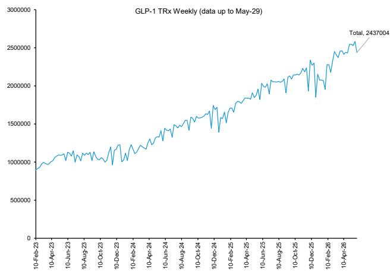

line

| Date       | Value   |
| ---------- | ------- |
| 10-Feb-23  | 900000  |
| 10-Apr-23  | 1050000 |
| 10-Jun-23  | 1100000 |
| 10-Aug-23  | 1050000 |
| 10-Oct-23  | 1150000 |
| 10-Dec-23  | 1250000 |
| 10-Feb-24  | 1350000 |
| 10-Apr-24  | 1450000 |
| 10-Jun-24  | 1550000 |
| 10-Aug-24  | 1650000 |
| 10-Oct-24  | 1750000 |
| 10-Dec-24  | 1850000 |
| 10-Feb-25  | 1950000 |
| 10-Apr-25  | 2050000 |
| 10-Jun-25  | 2150000 |
| 10-Aug-25  | 2250000 |
| 10-Oct-25  | 2350000 |
| 10-Dec-25  | 2450000 |
| 10-Feb-26  | 2550000 |
| 10-Apr-26  | 2650000 |
| Total      | 2437004 |

Source: IQVIA, Bernstein analysis

EXHIBIT 24: Total GLP-1 Weekly NRx   
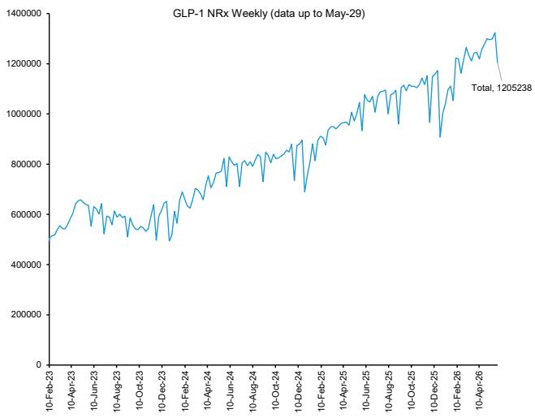

line

| Date       | Value   |
| ---------- | ------- |
| 10-Feb-23  | 500000  |
| 10-Apr-23  | 650000  |
| 10-Jun-23  | 550000  |
| 10-Aug-23  | 600000  |
| 10-Oct-23  | 550000  |
| 10-Dec-23  | 650000  |
| 10-Feb-24  | 750000  |
| 10-Apr-24  | 800000  |
| 10-Jun-24  | 850000  |
| 10-Aug-24  | 800000  |
| 10-Oct-24  | 850000  |
| 10-Dec-24  | 950000  |
| 10-Feb-25  | 1050000 |
| 10-Apr-25  | 1100000 |
| 10-Jun-25  | 1150000 |
| 10-Aug-25  | 1150000 |
| 10-Oct-25  | 1150000 |
| 10-Dec-25  | 1250000 |
| 10-Feb-26  | 1350000 |
| 10-Apr-26  | 1350000 |
| 10-May-26  | 1350000 |
| 10-Jun-26  | 1350000 |
| 10-Jul-26  | 1350000 |
| 10-Sep-26  | 1350000 |
| 10-Oct-26  | 1350000 |
| 10-Nov-26  | 1350000 |
| 10-Dec-26  | 1350000 |
| 10-Jan-27  | 1350000 |
| 10-Feb-27  | 1350000 |
| 10-Mar-27  | 1350000 |
| 10-Apr-27  | 1350000 |
| 10-May-27  | 1350000 |
| 10-Jun-27  | 1350000 |
| 10-Jul-27  | 1350000 |
| 10-Aug-27  | 1350000 |
| 10-Sep-27  | 1350000 |
| 10-Oct-27  | 1350000 |
| 10-Nov-27  | 1350000 |
| 10-Dec-27  | 1350000 |
| 10-Jan-28  | 1350000 |
| 1Q-Feb-28   | 1350000 |
| Q1-Mar-28   | 1350000 |
| Q2-Apr-28   | 1350000 |
| Q3-May-28   | 1350000 |
| Q4-Jun-28   | 1350000 |
| Q1-Jul-28   | 1350000 |
| Q2-Aug-28   | 1350000 |
| Q3-Sep-28   | 1350000 |
| Q4-Oct-28   | 1350000 |
| Q1-Dec-28   | 1350000 |
| Q2-Jan-29   | 1350000 |
| Q3-Feb-29   | 1350000 |
| Q4-Mar-29   | 1350000 |
| Q1-May-29   | 135,238 |

Source: IQVIA, Bernstein analysis

# GLP-1 MARKET SHARE DYNAMICS

EXHIBIT 25: Market share evolution (TRx) 

<table><tr><td colspan="2"></td><td colspan="4">Current Week: 29-May-26</td></tr><tr><td colspan="2">Market share - TRx</td><td>This week (scripts)</td><td>This week %</td><td>Past 4 weeks %</td><td>Past 12 weeks %</td></tr><tr><td>Mounjaro</td><td>LLY</td><td>756,666</td><td>31.1%</td><td>30.9%</td><td>31.0%</td></tr><tr><td>Zepbound</td><td>LLY</td><td>610,785</td><td>25.1%</td><td>25.5%</td><td>25.5%</td></tr><tr><td>Foundayo</td><td>LLY</td><td>16,982</td><td>0.7%</td><td>0.6%</td><td>0.3%</td></tr><tr><td>Trulicity</td><td>LLY</td><td>117,454</td><td>4.8%</td><td>4.9%</td><td>5.1%</td></tr><tr><td>Total</td><td>LLY</td><td>1,501,887</td><td>61.7%</td><td>61.8%</td><td>61.9%</td></tr><tr><td>Ozempic</td><td>NOVO</td><td>491,998</td><td>20.2%</td><td>20.3%</td><td>21.1%</td></tr><tr><td>Wegovy Pen</td><td>NOVO</td><td>307,241</td><td>12.6%</td><td>12.3%</td><td>12.0%</td></tr><tr><td>Wegovy Pill</td><td>NOVO</td><td>134,054</td><td>5.5%</td><td>5.6%</td><td>5.0%</td></tr><tr><td>Total</td><td>NOVO</td><td>933,293</td><td>38.3%</td><td>38.2%</td><td>38.1%</td></tr></table>

<table><tr><td rowspan="2" colspan="2"></td><td colspan="4">Current Week: 29-May-26</td></tr><tr><td>Market share - TRx just sema/tirz</td><td>This week (scripts)</td><td>This week %</td><td>Past 4 weeks %</td></tr><tr><td rowspan="4"></td><td>Mounjaro</td><td>LLY</td><td>756,666</td><td>32.6%</td><td>32.5%</td></tr><tr><td>Zepbound</td><td>LLY</td><td>610,785</td><td>26.4%</td><td>26.8%</td></tr><tr><td>Foundayo</td><td>LLY</td><td>16,982</td><td>0.7%</td><td>0.6%</td></tr><tr><td>M&amp;Z&amp;F</td><td>LLY</td><td>1,384,433</td><td>59.7%</td><td>59.8%</td></tr><tr><td rowspan="4"></td><td>Ozempic</td><td>NOVO</td><td>491,998</td><td>21.2%</td><td>21.4%</td></tr><tr><td>Wegovy Pen</td><td>NOVO</td><td>307,241</td><td>13.3%</td><td>13.0%</td></tr><tr><td>Wegovy Pill</td><td>NOVO</td><td>134,054</td><td>5.8%</td><td>5.8%</td></tr><tr><td>O&amp;W</td><td>NOVO</td><td>933,293</td><td>40.3%</td><td>40.2%</td></tr><tr><td colspan="3"></td><td colspan="3">2,317,726</td></tr></table>

Source: IQVIA, Bernstein analysis

EXHIBIT 26: Last week's market share evolution 

<table><tr><td colspan="2"></td><td colspan="4">Current Week: 22-May-26</td></tr><tr><td colspan="2">Market share - TRx</td><td>This week (scripts)</td><td>This week %</td><td>Past 4 weeks %</td><td>Past 12 weeks %</td></tr><tr><td>Mounjaro</td><td>LLY</td><td>796,781</td><td>32.7%</td><td>30.9%</td><td>31.0%</td></tr><tr><td>Zepbound</td><td>LLY</td><td>659,023</td><td>27.1%</td><td>25.6%</td><td>25.5%</td></tr><tr><td>Foundayo</td><td>LLY</td><td>16,011</td><td>0.7%</td><td>0.5%</td><td>0.2%</td></tr><tr><td>Trulicity</td><td>LLY</td><td>125,406</td><td>5.1%</td><td>4.9%</td><td>5.2%</td></tr><tr><td>Total</td><td>LLY</td><td>1,597,221</td><td>61.9%</td><td>61.9%</td><td>62.0%</td></tr><tr><td>Ozempic</td><td>NOVO</td><td>521,961</td><td>21.4%</td><td>20.5%</td><td>21.3%</td></tr><tr><td>Wegovy Pen</td><td>NOVO</td><td>316,191</td><td>13.0%</td><td>12.1%</td><td>12.0%</td></tr><tr><td>Wegovy Pill</td><td>NOVO</td><td>145,922</td><td>6.0%</td><td>5.6%</td><td>4.8%</td></tr><tr><td>Total</td><td>NOVO</td><td>984,074</td><td>38.1%</td><td>38.1%</td><td>38.0%</td></tr></table>

<table><tr><td rowspan="2" colspan="2"></td><td colspan="4">Current Week: 22-May-26</td></tr><tr><td>Market share - TRx just sema/tirz</td><td>This week (scripts)</td><td>This week %</td><td>Past 4 weeks %</td></tr><tr><td rowspan="4"></td><td>Mounjaro</td><td>LLY</td><td>796,781</td><td>32.4%</td><td>32.5%</td></tr><tr><td>Zepbound</td><td>LLY</td><td>659,023</td><td>26.8%</td><td>26.9%</td></tr><tr><td>Foundayo</td><td>LLY</td><td>16,011</td><td>0.7%</td><td>0.5%</td></tr><tr><td>M&amp;Z&amp;F</td><td>LLY</td><td>1,471,815</td><td>59.9%</td><td>59.9%</td></tr><tr><td rowspan="4"></td><td>Ozempic</td><td>NOVO</td><td>521,961</td><td>21.3%</td><td>21.5%</td></tr><tr><td>Wegovy Pen</td><td>NOVO</td><td>316,191</td><td>12.9%</td><td>12.7%</td></tr><tr><td>Wegovy Pill</td><td>NOVO</td><td>145,922</td><td>5.9%</td><td>5.9%</td></tr><tr><td>O&amp;W</td><td>NOVO</td><td>984,074</td><td>40.1%</td><td>40.1%</td></tr></table>

Source: IQVIA, Bernstein analysis

YEAR-ON-YEAR (YOY) GROWTH TRENDS

EXHIBIT 27: Rolling 4-weekly year-on-year volume growth for GLP-1s   

line

| Date       | Zepbound | M+Z together | Wegovy Pen | Mounjaro | Total  | O+W together | Ozempic |
|------------|----------|--------------|------------|----------|--------|--------------|---------|
| 5/23/2026  | 79%      | 55.7%        | 44.9%      | 40.6%    | 39.2%  | 20.4%        | -12.5%  |

Source: IQVIA, Bernstein analysis

EXHIBIT 28: TRx 4-week growth rate vs prior year 

<table><tr><td></td><td>Feb 14-Mar 07</td><td>Mar 14-Apr 04</td><td>Apr 11-May 02</td><td>May 09-May 30</td><td>Feb 13-Mar 06</td><td>Mar 13-Apr 03</td><td>Apr 10-May 01</td><td>May 08-May 29</td></tr><tr><td>Mounjaro</td><td>1,966,027</td><td>2,065,898</td><td>2,154,680</td><td>2,215,830</td><td>2,926,525</td><td>3,006,177</td><td>3,062,905</td><td>3,115,061</td></tr><tr><td>vs PY (abs)</td><td></td><td></td><td></td><td></td><td>960,498</td><td>940,279</td><td>908,225</td><td>899,231</td></tr><tr><td>vs PY (%)</td><td></td><td></td><td></td><td></td><td>48.9%</td><td>45.5%</td><td>42.2%</td><td>40.6%</td></tr><tr><td>Zepbound</td><td>1,115,141</td><td>1,248,567</td><td>1,370,156</td><td>1,433,535</td><td>2,277,277</td><td>2,502,301</td><td>2,476,209</td><td>2,568,109</td></tr><tr><td>vs PY (abs)</td><td></td><td></td><td></td><td></td><td>1,162,136</td><td>1,253,734</td><td>1,106,053</td><td>1,134,574</td></tr><tr><td>vs PY (%)</td><td></td><td></td><td></td><td></td><td>104.2%</td><td>100.4%</td><td>80.7%</td><td>79.1%</td></tr><tr><td>M+Z together</td><td>3,081,168</td><td>3,314,465</td><td>3,524,836</td><td>3,649,365</td><td>5,203,802</td><td>5,508,478</td><td>5,539,114</td><td>5,683,170</td></tr><tr><td>vs PY (abs)</td><td></td><td></td><td></td><td></td><td>2,122,634</td><td>2,194,013</td><td>2,014,278</td><td>2,033,805</td></tr><tr><td>vs PY (%)</td><td></td><td></td><td></td><td></td><td>68.9%</td><td>66.2%</td><td>57.1%</td><td>55.7%</td></tr><tr><td>Foundayo</td><td>-</td><td>-</td><td>-</td><td>-</td><td>-</td><td>-</td><td>18,044</td><td>59,939</td></tr><tr><td>vs PY (abs)</td><td></td><td></td><td></td><td></td><td>-</td><td>-</td><td>18,044</td><td>59,939</td></tr><tr><td>vs PY (%)</td><td></td><td></td><td></td><td></td><td>-</td><td>-</td><td>-</td><td>-</td></tr><tr><td>Other LLY (trulicity)</td><td>669,890</td><td>669,702</td><td>656,844</td><td>640,469</td><td>525,979</td><td>517,109</td><td>507,406</td><td>493,304</td></tr><tr><td>vs PY (abs)</td><td></td><td></td><td></td><td></td><td>143,911</td><td>152,593</td><td>149,438</td><td>147,165</td></tr><tr><td>vs PY (%)</td><td></td><td></td><td></td><td></td><td>-21.5%</td><td>-22.8%</td><td>-22.8%</td><td>-23.0%</td></tr><tr><td>Ozempic</td><td>2,332,551</td><td>2,364,979</td><td>2,367,508</td><td>2,342,846</td><td>2,118,865</td><td>2,112,058</td><td>2,085,321</td><td>2,049,707</td></tr><tr><td>vs PY (abs)</td><td></td><td></td><td></td><td></td><td>213,686</td><td>252,921</td><td>282,187</td><td>293,139</td></tr><tr><td>vs PY (%)</td><td></td><td></td><td></td><td></td><td>-9.2%</td><td>-10.7%</td><td>-11.9%</td><td>-12.5%</td></tr><tr><td>Wegovy Pen</td><td>825,790</td><td>845,499</td><td>850,402</td><td>858,206</td><td>1,097,977</td><td>1,157,274</td><td>1,157,485</td><td>1,243,177</td></tr><tr><td>vs PY (abs)</td><td></td><td></td><td></td><td></td><td>272,187</td><td>311,775</td><td>307,083</td><td>384,971</td></tr><tr><td>vs PY (%)</td><td></td><td></td><td></td><td></td><td>33.0%</td><td>36.9%</td><td>36.1%</td><td>44.9%</td></tr><tr><td>Wegovy Pill</td><td>-</td><td>-</td><td>-</td><td>-</td><td>278,419</td><td>390,687</td><td>516,324</td><td>560,268</td></tr><tr><td>vs PY (abs)</td><td></td><td></td><td></td><td></td><td>278,419</td><td>390,687</td><td>516,324</td><td>560,268</td></tr><tr><td>vs PY (%)</td><td></td><td></td><td></td><td></td><td></td><td></td><td></td><td></td></tr><tr><td>O+W together</td><td>3,158,341</td><td>3,210,478</td><td>3,217,910</td><td>3,201,052</td><td>3,495,261</td><td>3,660,019</td><td>3,759,130</td><td>3,853,152</td></tr><tr><td>vs PY (abs)</td><td></td><td></td><td></td><td></td><td>336,920</td><td>449,541</td><td>541,220</td><td>652,100</td></tr><tr><td>vs PY (%)</td><td></td><td></td><td></td><td></td><td>10.7%</td><td>14.0%</td><td>16.8%</td><td>20.4%</td></tr><tr><td>Other Novo (Saxenda/Victoza)</td><td>19,562</td><td>13,744</td><td>12,240</td><td>10,814</td><td>9,200</td><td>7,475</td><td>8,154</td><td>7,382</td></tr><tr><td>vs PY (abs)</td><td></td><td></td><td></td><td></td><td>10,362</td><td>6,269</td><td>4,086</td><td>3,432</td></tr><tr><td>vs PY (%)</td><td></td><td></td><td></td><td></td><td>-53.0%</td><td>-45.6%</td><td>-33.4%</td><td>-31.7%</td></tr><tr><td>M+Z+O+W</td><td>6,239,509</td><td>6,524,943</td><td>6,742,746</td><td>6,850,417</td><td>8,699,063</td><td>9,168,497</td><td>9,298,244</td><td>9,536,322</td></tr><tr><td>vs PY (abs)</td><td></td><td></td><td></td><td></td><td>2,459,554</td><td>2,643,554</td><td>2,555,498</td><td>2,685,905</td></tr><tr><td>vs PY (%)</td><td></td><td></td><td></td><td></td><td>39.4%</td><td>40.5%</td><td>37.9%</td><td>39.2%</td></tr></table>

Source: IQVIA, Bernstein analysis

# GLP-1 PRESCRIPTIONS (TRX) DELINEATED BY DOSE

EXHIBIT 29: Mounjaro TRx by dose   
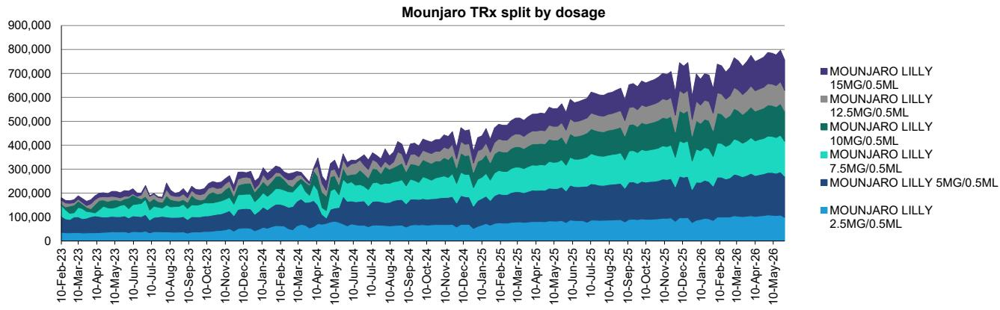  
Source: IQVIA, Bernstein analysis

EXHIBIT 30: Zepbound TRx by dose   
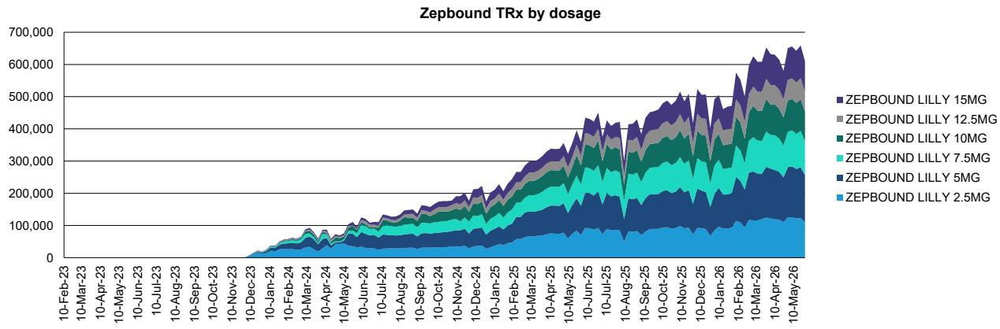  
Source: IQVIA, Bernstein analysis

EXHIBIT 31: Ozempic TRx by dose   
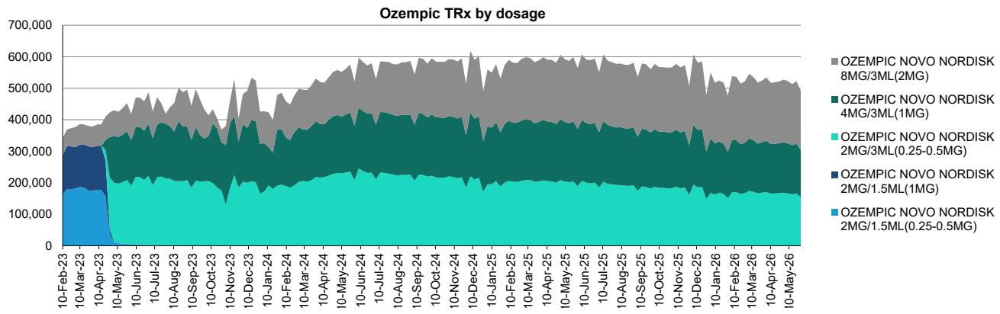  
Source: IQVIA, Bernstein analysis

EXHIBIT 32: Wegovy TRx by dose   
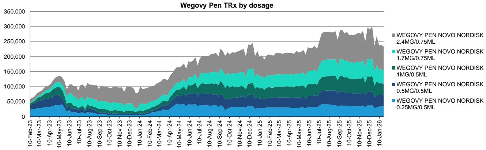  
Source: IQVIA, Bernstein analysis

EXHIBIT 33: Wegovy Pill TRx by dose   
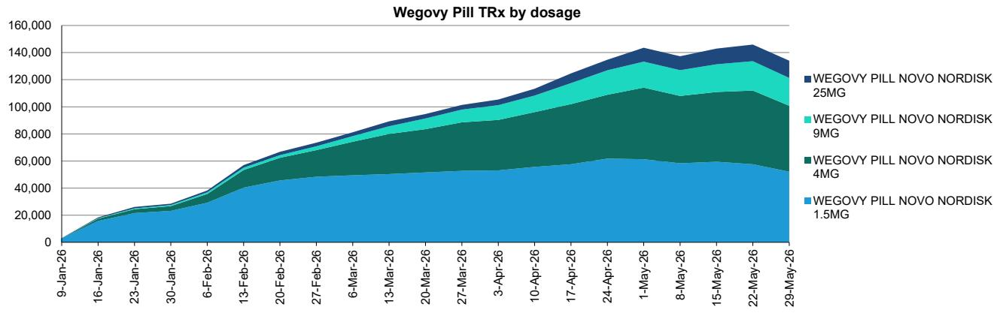

area

| Date       | WEGOVY PILL NOVO NORDISK 25MG | WEGOVY PILL NOVO NORDISK 9MG | WEGOVY PILL NOVO NORDISK 4MG | WEGOVY PILL NOVO NORDISK 1.5MG |
|------------|-------------------------------|------------------------------|------------------------------|--------------------------------|
| 9-Jan-26   | 0                             | 0                            | 0                            | 0                              |
| 16-Jan-26  | 0                             | 0                            | 0                            | 0                              |
| 23-Jan-26  | 0                             | 0                            | 0                            | 0                              |
| 30-Jan-26  | 0                             | 0                            | 0                            | 0                              |
| 6-Feb-26   | 0                             | 0                            | 0                            | 0                              |
| 13-Feb-26  | 0                             | 0                            | 0                            | 0                              |
| 20-Feb-26  | 0                             | 0                            | 0                            | 0                              |
| 27-Feb-26  | 0                             | 0                            | 0                            | 0                              |
| 6-Mar-26   | 0                             | 0                            | 0                            | 0                              |
| 13-Mar-26  | 0                             | 0                            | 0                            | 0                              |
| 20-Mar-26  | 0                             | 0                            | 0                            | 0                              |
| 27-Mar-26  | 0                             | 0                            | 0                            | 0                              |
| 3-Apr-26   | 0                             | 0                            | 0                            | 0                              |
| 10-Apr-26  | 0                             | 0                            | 0                            | 0                              |
| 17-Apr-26  | 0                             | 0                            | 0                            | 0                              |
| 24-Apr-26  | 0                             | 0                            | 0                            | 0                              |
| 1-May-26   | 0                             | 0                            | 0                            | 0                              |
| 8-May-26   | 0                             | 0                            | 0                            | 0                              |
| 15-May-26  | 0                             | 0                            | 0                            | 0                              |
| 22-May-26  | 0                             | 0                            | 0                            | 0                              |
| 29-May-26  | 0                             | 0                            | 0                            | 0                              |

Source: IQVIA, Bernstein analysis

EXHIBIT 34: Foundayo TRx by dose   
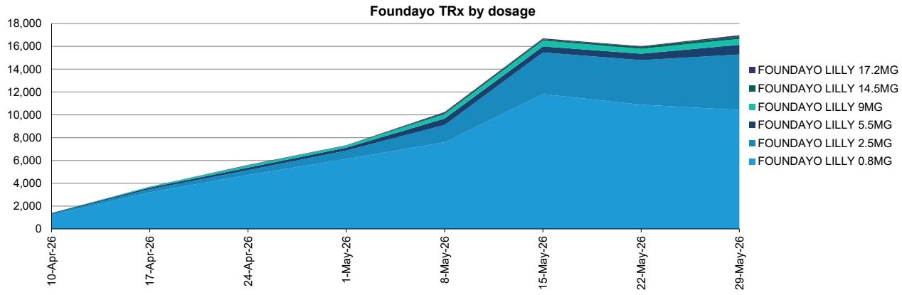

area

| Date       | FOUNDAYO LILLY 17.2MG | FOUNDAYO LILLY 14.5MG | FOUNDAYO LILLY 9MG | FOUNDAYO LILLY 5.5MG | FOUNDAYO LILLY 2.5MG | FOUNDAYO LILLY 0.8MG |
| ---------- | --------------------- | --------------------- | ------------------ | -------------------- | -------------------- | -------------------- |
| 10-Apr-26  | 1,500                 | 1,500                 | 1,500              | 1,500                | 1,500                | 1,500                |
| 17-Apr-26  | 3,500                 | 3,500                 | 3,500              | 3,500                | 3,500                | 3,500                |
| 24-Apr-26  | 5,000                 | 5,000                 | 5,000              | 5,000                | 5,000                | 5,000                |
| 1-May-26   | 7,000                 | 7,000                 | 7,000              | 7,000                | 7,000                | 7,000                |
| 8-May-26   | 9,500                 | 9,500                 | 9,500              | 9,500                | 9,500                | 9,500                |
| 15-May-26  | 16,500                | 16,500                | 16,500             | 16,500               | 16,500               | 16,500               |
| 22-May-26  | 15,500                | 15,500                | 15,500             | 15,500               | 15,500               | 15,500               |
| 29-May-26  | 17,2M                 | 17.2M                 | 17.2M              | 17.2M                | 17.2M                | 17.2M                |

Source: IQVIA, Bernstein analysis

# IQVIA PRESCRIPTION METRICS: QUICK REFERENCE GUIDE

# THE CORE EQUATION

Every prescription dispensed rolls up into TRx. There are two ways to break it down:

- TRx = NRx + RRx (new + refills)   
- TRx = NBRx + CBRx (new-to-brand + continuations)

# PRESCRIPTION VOLUME METRICS

# TRx — Total Prescriptions

All prescriptions dispensed — both new and refill scripts combined. The top-level volume metric.

# NRx — New Prescriptions

New prescriptions dispensed by pharmacists. Includes scripts written when a patient has exhausted their authorized refills and receives a new Rx number to continue existing therapy.

# RRx — Refill Prescriptions

Authorized refill prescriptions dispensed by pharmacists, drawn from a panel of computerized pharmacies.

# NBRx — New-to-Brand Prescriptions

Prescriptions for patients starting a specific brand for the first time, with no prior use of that brand in the previous 12 months (the look-back period).

# CBRx — Continuation Prescriptions

All prescriptions associated with continued use of a product within the previous 12 months (the look-back period). Includes both authorized refills AND new scripts written when a patient's refills run out.

# NBRX SUBTYPES

NBRx - new to brand scripts - is made up of two mutually exclusive patient groups:

# NTS Rx — New to Therapy Start

\- The patient's first-ever prescription in the therapy class; specifically a prescription dispensed to a patient who, during the assigned look-back period, has not filled any therapy within the defined USC 3 or USC 4 relevant defined market.

# Switch / Add Rx

\- The patient is new to this brand but has filled another drug in the same therapy class (USC3 or USC4) during the look-back period

• Covers two scenarios:

- Switch: Patient moves from a competitor brand to this brand   
- Add-on: Patient adds this brand on top of an existing therapy in the same class

$$
\mathrm{NBRx} = \text { NTS   Rx } + \text { Switch / Add   Rx }
$$

# KEY DISTINCTIONS TO KNOW

# NRx vs. NBRx

- NRx counts any new script, including renewal scripts for patients who ran out of refills — the patient may already be long-established on the drug   
- NBRx is stricter: it only counts patients with no prior use of that brand in the last 12 months, making it the true measure of patient acquisition

# RRx vs. CBRx

- RRx counts only authorized refills   
- CBRx is broader — it includes refills plus renewal scripts written for patients who ran out of refills but are continuing therapy

# LOOK-BACK PERIOD

- The standard look-back period for classifying NTS vs. Switch/Add is 12 months   
- Certain acute therapy classes use a 1-month look-back to better reflect short-course treatment patterns   
- Acute classes with a 1-month look-back include anti-infective, anti-biotics, and anaesthetics.

# Prior GLP1 tracker notes:

- 29 May 2026 - GLP-1 tracker: IQVIA reporting noise weighs on Foundayo, class TRx/NRx continue to hit all-time highs (W/E May 22nd)   
• 22 May 2026 - GLP-1 tracker: Wegovy Pill gets EMA approval & Foundayo effective in older adults (W/E May 15th)   
• 15 May 2026 - GLP-1 tracker: First sequential decline for Wegovy Pill (W/E May 8th)   
- 08 May 2026 - GLP-1 tracker: Zepbound data volatility; & finally a correlation 19% Foundayo conversion from daily to weekly (W/E May 1st)   
• 01 May 2026 - GLP-1 tracker: Zepbound WoW volatility likely driven by mail channel underreporting (W/E April 24th)   
• 24 Apr 2026 - GLP-1 tracker: Foundayo Week 2 - Scripts Trail Peers but Capture likely volatile (W/E April 17th)   
• 17 Apr 2026 - GLP-1 tracker: Strong start -1390 TRx for Foundayo from only two true days of launch (W/E April 10th)   
• 10 Apr 2026 - GLP-1 tracker: Novo pill plateauing ahead of Foundayo launch? (W/E April 3rd)   
• 6 Apr 2026 - GLP-1 tracker: The last week of Wegovy pill's monopoly (W/E March 27th)   
• 27 Mar 2026 - GLP-1 tracker: Oral Wegovy WoW growth moderates, & Zepbound new starts remain high (W/E March 20th)   
- 20 Mar 2026 - GLP-1 tracker: Scripts stabilize near last week's peak levels; oral Wegovy WoW TRx growth steadies (W/E March 13th)   
• 13 Mar 2026 - GLP-1 tracker: Scripts & new patients back to all-time highs (W/E March 6th)   
- 6 Mar 2026 - GLP-1 tracker: Total weekly TRx/NRx near historical peak, Zepbound strength returns (W/E Feb 27th)   
• 2 Mar 2026 - GLP-1 tracker: Wegovy pill giving Novo a lifeline via new patient starts (W/E Feb 20th)   
• 23 Feb 2026 - GLP-1 tracker: Pill growth isn't cannibalising new Zepbound patients just yet (W/E Feb 13th)   
• 13 Feb 2026 - GLP-1 tracker: Zepbound achieves all time TRx highs, while oral GLP-1 uptake accelerates (W/E Feb 6th)   
- 6 Feb 2026 - GLP-1 tracker: New GLP-1 patient starts hit all time high (W/E Jan 30th)   
• 30 Jan 2026 - GLP-1 tracker: Wegovy pill excitement; a rising tide that lifts all boats? (W/E Jan 23rd)   
- 23 Jan 2026 - GLP-1 tracker: Oral market week 2 robust [18k scripts] & potential patient interest at new highs (W/E Jan 16th)   
• 16 Jan 2026 - GLP-1 tracker: The (first) obesity pill is here (W/E Jan 9th)   
• 9 Jan 2026 - GLP-1 tracker: Zepbound starts the new year strong, first Wegovy pill data expected next week (W/E Jan 2nd)   
• 26 Dec 2025 - GLP-1 tracker: Scripts recover marginally, Zepbound's new patient trends strengthen (W/E Dec 19th)   
• 19 Dec 2025 - GLP-1 tracker: A pre-holiday lull in scripts (W/E 12th Dec)   
• 12 Dec 2025 - GLP-1 tracker: Scripts rebound post-Thanksgiving, Novo captures some new patient share (W/E 5th Dec)   
• 05 Dec 2025 - GLP-1 tracker: Thanksgiving hits total scripts; lower prices increase Wegovy patient starts (W/E 28th Nov)   
• 28 Nov 2025 - GLP-1 tracker: Total script growth returns, Zepbound's favorable switch dynamic continues (W/E 21st Nov)   
• 21 Nov 2025 - GLP-1 tracker: New patient trends positive for Zepbound (W/E 14th Nov)

- 14 Nov 2025 - GLP-1 tracker: Scripts growth accelerates, Lilly continues share gain momentum with Zepbound strength (W/E 7th Nov)   
- 7 Nov 2025 - GLP-1 tracker: Script growth returns, Lilly regains share with Zepbound (W/E 31st Oct)   
• 31 Oct 2025 - GLP-1 tracker: Scripts remain volatile, but LLY vs NOVO trends consistent (W/E 24th Oct)   
• 24 Oct 2025 - GLP-1 tracker: Zepbound breakout continues; capturing 70% of new weightloss patients (W/E 17th Oct)   
- 10 Oct 2025 - GLP-1 tracker: Scripts trending up and to the right, on a path to 69-70% Obesity share for Zepbound (W/E 3rd Oct)   
• 03 Oct 2025 - GLP-1 tracker: Lilly regains momentum, Novo losing ground (W/E 26th Sept)   
• 19 Sept 2025 - GLP-1 tracker: Wegovy switching saga clearly over (W/E 12th Sept)   
• 12 Sept 2025 - GLP-1 tracker: Labor day lowers scripts; Wegovy switches below Zepbound (W/E 5th Sept)   
• 05 Sept 2025 - GLP-1 tracker: WHO declares GLP-1s essential medicines (W/E 29th August)   
• 29 Aug 2025 - GLP1 tracker: Wegovy flattens, Zepbound still below pre-CVS change levels (W/E 22nd August)   
• 22 Aug 2025 - GLP1 tracker: Semaglutide switches slow (W/E 15th August)   
• 15 Aug 2025 - GLP1 tracker: Wegovy rounding out? And Zepbound reporting issues (W/E 8th August)   
• 08 Aug 2025 - GLP1 tracker: Easing of Sema switches continue (W/E 1st August)   
• 01 Aug 2025 - GLP1 tracker: Rate of Wegovy switches subsiding & Zepbound share beginning to rebound (W/E 25th July)   
• 25 Jul 2025 - GLP1 tracker: Wegovy continues to gain off CVS-switches (W/E 18th July)   
• 11 July 2025 - GLP1 tracker: Is Mounjaro the real beneficiary of Wegovy's CVS preferred status? [W/E 4th July]   
• 04 July 2025 - GLP1 tracker: Lilly gains before potentially choppy scripts ahead [W/E 27th June]   
• 27 Jun 2025 - GLP1 tracker: Week on week Wegovy up & Zepbound down - [W/E 20th June]   
• 23 June 2025 - GLP1 tracker: Not a Novo rebound just yet [W/E 13th June]   
• 13 June 2025 - GLP1 tracker: Zepbound continues to propel Lilly [W/E 6th June]   
- 6 June 2025 - GLP1 tracker: Lighter scripts for the market, but still growth YoY [W/E 30th May]   
• 30 May 2025 - GLP1 tracker: Zepbound continues to rocket, some volumes still to be validated by IQVIA [W/E 23rd May]   
• 23 May 2025 - GLP1 tracker: LLY growth continues, despite Zepbound data issues continuing [W/E 16th May]   
• 19 May 2025 - GLP1 tracker: Zepbound TRx drops (underreporting via IQVIA) [W/E 9th May]   
• 13 May 2025 - GLP1 tracker: Total scripts jump, but Lilly more so than Novo [W/E 2nd May]   
• 05 May 2025 - GLP1 tracker: Softer week for total scripts, but Lilly still gains share [W/E 25th April]   
• 28 Apr 2025 - GLP1 tracker: LLY share ticks upward more marginally, growth remains strong [W/E 18th April]   
- 21 Apr 2025 - GLP1 tracker: The story repeats - LLY keeps taking share (52%), growing faster than supply guidance & faster than NOVO [W/E 11th April]

- 14 Apr 2025 - GLP1 tracker: LLY keeps taking share, growing faster than supply guidance & faster than NOVO [W/E 4th April]   
- 4 Apr 2025 - GLP1 tracker: Medicare exclusion quicktake; Script growth is back, LLY driving growth, NovoCare likely absent [W/E 28th March]   
- 31 Mar 2025 - GLP1 tracker: Continued superiority demonstrated in scripts for tirzepatide, waiting to see impact of Novo cash-pay [W/E 21st March]   
- 24 Mar 2025 - GLP1 tracker: Recent trends continue, although M drives LLY's market share expansion (rather than Z) [W/E 14th March]   
• 17 Mar 2025 - GLP1 Tracker: LLY takes majority share & anti-cancer potential for retatrutide [W/E 7th March]   
• 10 Mar 2025 - GLP1 Tracker: Lilly continues to outgrow Novo with market share now rounding to 50% [W/E 28th Feb]   
- 3 Mar 2025 - GLP1 Tracker: Lilly continues to outgrow Novo with market share stretching towards equal (49.1%) [W/E 21st Feb]   
- 25 Feb 2025 - GLP1 tracker: Zepbound price-drop announced, uptick with LillyDirect visibility, not yet seeing more starter doses on sema

# I. REQUIRED DISCLOSURES

References to "Bernstein" or the "Firm" in these disclosures relate to the following entities: Bernstein Institutional Services LLC (April 1, 2024 onwards), Bernstein & Co., LLC (pre April 1, 2024), Bernstein Autonomous LLP, BSG France S.A. (April 1, 2024 onwards), Bernstein (Hong Kong) Limited 盛博香港有限公司, Bernstein (Canada) Limited, Bernstein (India) Private Limited (SEBI registration no. INH000006378), Bernstein (Singapore) Private Limited, Bernstein Japan KK (サンフォード・C・バーンスタイン株式会社) and analysts employed by SG Africa Technologies & Services to produce Bernstein under a Global Services Agreement in place between Bernstein and SG.

Bernstein is part of a joint venture between SG (SG) and AllianceBernstein, L.P. (AB). Unless specifically noted otherwise, for purposes of these disclosures, references to Bernstein's “affiliates” relate to both SG and AB and their respective affiliates.

# VALUATION METHODOLOGY

# Novo Nordisk A/S

Our price target (DKK200) is the average of an EV/EBITA-multiples based valuation (applying a 36% discount to 2026-28e peer group and DCF (WACC 8.0%, terminal growth 0%).

# Eli Lilly & Co

We arrive at our valuation using a blend of DCF (7.6% WACC, 5% FCFF CAGR to '43, and 2.5% TV GR) and multiples approach (32x P/E on FY27E adj. EPS), with equal weighting. Our \$1,300 target price implies a '27 P/E of 29x, well above pharma peers, although within the range of trading over the TTM.

# RISKS

# Novo Nordisk A/S

Upside risks: 1. The major FDA approved growth drivers (Ozempic, Wegovy and Oral-Sema) and pipeline (in particular Cagri-Sema) deliver the consensus estimates 2. Novo's manufacturing scale means that patent expiries are even more benign than we expect 3. Management engages in major, value accretive, bridging M&A.

# Eli Lilly & Co

Downside: Pressures on obesity TAM are more substantial than we estimate (demand, regulatory, pricing, competitive, compounding)

Downside: Manufacturing expansion stalls, limiting LLY obesity expansion

Downside: Excess value destruction through high-risk M&A / R&D advancement

# RATINGS DEFINITIONS, BENCHMARKS AND DISTRIBUTION

# EQUITY RATINGS DEFINITIONS

# Bernstein brand

The Bernstein brand rates stocks based on forecasts of relative performance for the next 12 months versus the S&P 500 for stocks listed on the U.S. and Canadian exchanges, versus the Bloomberg Europe Developed Markets Large and Mid Cap Price Return Index EUR (EDME) for stocks listed on the European exchanges and emerging markets exchanges outside of the Asia Pacific region, versus the Bloomberg Japan Large and Mid Cap Price Return Index USD (JPL) for stocks listed on the Japanese exchanges, and versus the Bloomberg Asia ex-Japan Large and Mid Cap Price Return Index (ASIAX) for stocks listed on the Asian (ex-Japan) exchanges -unless otherwise specified.

The Bernstein brand has three categories of ratings:

- Outperform: Stock will outpace the market index by more than 15 pp   
• Market-Perform: Stock will perform in line with the market index to within +/-15 pp   
• Underperform: Stock will trail the performance of the market index by more than 15 pp

Coverage Suspended: Coverage of a company under the Bernstein brand has been suspended. Ratings and price targets are suspended temporarily, are no longer current, and should therefore not be relied upon.

Not Rated: A rating assigned when the stock cannot be accurately valued, or the performance of the company accurately predicted, at the present time. The covering analyst may continue to publish research reports on the company to update investors on events and developments.

Not Covered (NC) denotes companies that are not under coverage.

Bernstein brand stock ratings are based on a 12-month time horizon.

# Autonomous brand – common stocks

The Autonomous brand rates common stocks as indicated below. As our benchmarks we use the Bloomberg Europe 500 Banks And Financial Services Index (BEBANKS) and Bloomberg Europe Dev Mkt Financials Large and Mid Cap Price Ret Index EUR (EDMFI) index for developed European banks and Payments, the Bloomberg Europe 500 Insurance Index (BEINSUR) for European insurers, the S&P 500 and S&P Financials for US banks and Payments coverage, S5LIFE for US Insurance, the S&P Insurance Select Industry (SPSIINS) for US Non-Life Insurers coverage, and the Bloomberg Emerging Markets Financials Large, Mid and Small Cap Price Return Index (EMLSF) for emerging market banks and insurers and Payments. Ratings are stated relative to the sector (not the market).

The Autonomous brand has three categories of common stock ratings:

- Outperform (OP): Stock will outpace the relevant index by more than 10 pp   
- Neutral (N): Stock will perform in line with the market index to within +/-10 pp   
- Underperform (UP): Stock will trail the performance of the relevant index by more than 10 pp

Coverage Suspended: Coverage of a company under the Autonomous research brand has been suspended. Ratings and price targets are suspended temporarily, are no longer current, and should therefore not be relied upon.

Not Rated: A rating assigned when the stock cannot be accurately valued, or the performance of the company accurately predicted, at the present time. The covering analyst may continue to publish research reports on the company to update investors on events and developments.

Those denoted as ‘Feature’ (e.g., Feature Outperform FOP, Feature Under Outperform FUP) are our core ideas.

Not Covered (NC) denotes companies that are not under coverage.

Autonomous brand common stock ratings are based on a 12-month time horizon.

# Autonomous brand – preferred stocks

The Autonomous brand has three categories of preferred stock ratings:

- Outperform (OP): The total return of the preferred instrument is expected to outperform preferred securities of other issuers operating in similar sectors or rating categories over the next six months.   
- Neutral (N): The total return of the preferred instrument is expected to perform in line with preferred securities of other issuers operating in similar sectors or rating categories over the next six months.   
- Underperform (UP): The total return of the preferred instrument is expected to underperform preferred securities of other issuers operating in similar sectors or rating categories over the next six months.

Autonomous preferred stock ratings are based on a 6-month time horizon.

# AUTONOMOUS CREDIT RESEARCH

Where this report contains investment recommendations for credit instruments, as defined in article 3(1)(35) of the Market Abuse Regulation, the information below is presented to comply with its disclosure requirements.

The report may also include reference(s) to published opinions by other Autonomous or Bernstein analysts covering the equity securities of the issuer(s) referenced herein. Please note an investment recommendation for credit instruments published by the author(s) of this report may differ from the published view of the analyst covering equity securities for the issuer(s) contained in this report and vice versa.

# CREDIT RATINGS DEFINITIONS

The Autonomous brand has three categories of credit ratings:

- Credit Outperform (C-OP): The total return of the Reference Credit Instrument is expected to outperform the credit spread of bonds of other issuers operating in similar sectors or rating categories over the next six months.   
- Credit Neutral (C-N): The total return of the Reference Credit Instrument is expected to perform in line with the credit spread of bonds of other issuers operating in similar sectors or rating categories over the next six months.   
- Credit Underperform (C-UP): The total return of the Reference Credit Instrument is expected to underperform the credit spread of bonds of other issuers operating in similar sectors or rating categories over the next six months.

Autonomous credit ratings are based on a 6-month time horizon.

A list of all investment recommendations produced by the author(s) of this report alongside credit ratings history are available upon request.

It is at the sole discretion of the Firm as to when to initiate, update and cease research coverage. The Firm has established, maintains and relies on information barriers to control the flow of information contained in one or more areas (i.e. the private side) within the Firm, and into other areas, units, groups or affiliates (i.e. public side) of the Firm

DISTRIBUTION OF EQUITY RATINGS/INVESTMENT BANKING SERVICES 

<table><tr><td>Equity Rating</td><td>Market Abuse Regulation (MAR) and FINRA Rating Category</td><td>Global Rating Distribution</td><td>Investment Banking Relationships*</td></tr><tr><td>Outperform</td><td>BUY</td><td>51.1%</td><td>16.5%</td></tr><tr><td>Market-Perform (Bernstein Brand) Neutral (Autonomous Brand)</td><td>HOLD</td><td>36.3%</td><td>17.8%</td></tr><tr><td>Underperform</td><td>SELL</td><td>12.6%</td><td>14.9%</td></tr></table>

\* These figures represent the percentage of companies within each equity rating category for which affiliates of Bernstein have provided investment banking services within the previous 12 months.   
As of March 31, 2026. All figures are updated quarterly.

# PRICE CHARTS / RATINGS AND PRICE TARGET HISTORY

Eli Lilly & Co (LLY) Rating History for Bernstein as of 06/04/2026   
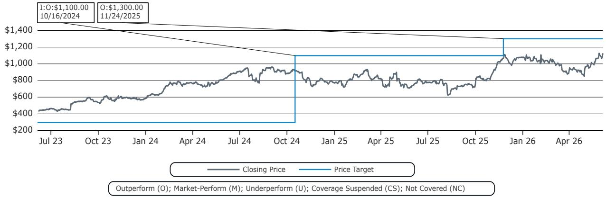

line

| Date       | Closing Price | Price Target |
| ---------- | ------------- | ------------ |
| 10/16/2024 | $1,100.00     | $1,300.00    |
| 11/24/2025 | $1,300.00     | $1,300.00    |

Novo Nordisk A/S (NOVOB.DC) Rating History for Bernstein as of 06/04/2026   
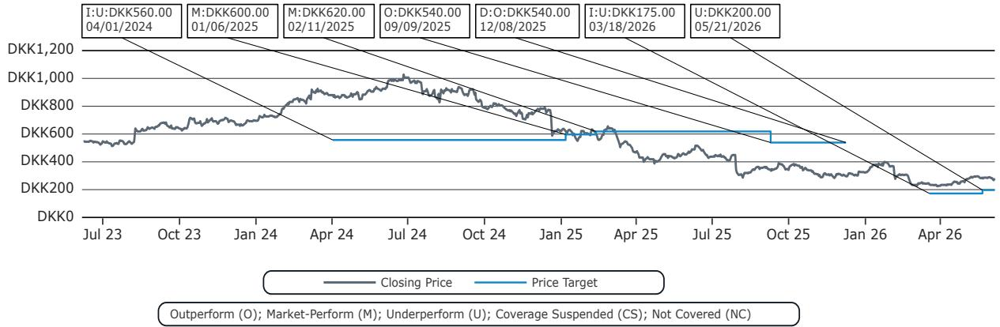

line

| Date       | Closing Price | Price Target |
| ---------- | ------------- | ------------ |
| 04/01/2024 | DKK560.00     | DKK560.00    |
| 01/06/2025 | DKK600.00     | DKK600.00    |
| 02/11/2025 | DKK620.00     | DKK620.00    |
| 09/09/2025 | DKK540.00     | DKK540.00    |
| 12/08/2025 | DOK540.00     | DOK540.00    |
| 03/18/2026 | DOK175.00     | DOK175.00    |
| 05/21/2026 | DOK200.00     | DOK200.00    |

All price target and closing price data in the chart(s) above are denominated in the currency noted in the Ticker Table of this report.

# CONFLICTS OF INTEREST

Bernstein has received compensation for non-investment banking securities-related products or services in the previous twelve months from the following clients: Novo Nordisk A/S.

Bernstein and/or affiliates have received compensation for non-investment banking securities-related products or services in the previous twelve months from the following clients: Novo Nordisk A/S.

Certain affiliates of Bernstein act as market maker or liquidity provider in the equities securities of: Eli Lilly & Co and Novo Nordisk A/S.

Certain affiliates of Bernstein act as market maker or liquidity provider in the debt securities of: Eli Lilly & Co and Novo Nordisk A/S.

# OTHER MATTERS

The legal entity(ies) employing the analyst(s) listed in this report, and their location, can be determined by the country code of their phone number, as follows:

+1 Bernstein Institutional Services LLC; New York, New York, USA

+44 Bernstein Autonomous LLP; London UK

+212 SG Africa Technologies & Services; Casablanca, Morocco   
+33 BSG France S.A.; Paris, France   
+34 BSG France S.A.; Madrid, Spain   
+41 Bernstein Autonomous LLP; Geneva, Switzerland   
+49 BSG France S.A.; Frankfurt, Germany   
+91 Bernstein (India) Private Limited; Mumbai, India   
+852 Bernstein (Hong Kong) Limited 盛博香港有限公司; Hong Kong, China   
+65 Bernstein (Singapore) Private Limited; Singapore   
+81 Bernstein Japan KK; Tokyo, Japan

Where this report has been prepared by research analyst(s) employed by a non-US affiliate, such analyst(s), is/are (unless otherwise expressly noted below) not registered as associated persons of Bernstein Institutional Services LLC or any other SEC-registered broker-dealer and are not licensed or qualified as research analysts with FINRA. Accordingly, such analyst(s) may not be subject to FINRA's restrictions regarding (among other things) communications by research analysts with a subject company, interactions between research analysts and investment banking personnel, participation by research analysts in solicitation and marketing activities relating to investment banking transactions, public appearances by research analysts, and trading securities held by a research analyst account.

Where this report has been prepared by research analyst(s) employed by SG Africa Technologies & Services (part of the SG group of companies), it has been prepared on behalf of a Bernstein company under a Global Services Agreement in place between Bernstein and SG.

# CERTIFICATION

Each research analyst listed in this report, who is primarily responsible for the preparation of the content of this report, certifies that all of the views expressed in this publication accurately reflect that analyst's personal views about any and all of the subject securities or issuers and that no part of that analyst's compensation was, is, or will be, directly or indirectly, related to the specific recommendations or views in this publication.

# II. ADDITIONAL GLOBAL CONFLICT DISCLOSURES

It is at the sole discretion of the Firm as to when to initiate, update and cease research coverage. The Firm has established, maintains and relies on information barriers to control the flow of information contained in one or more areas (i.e., the private side) within the Firm, and into other areas, units, groups or affiliates (i.e., public side) of the Firm.

# III. OTHER IMPORTANT INFORMATION AND DISCLOSURES

Separate branding is maintained for “Bernstein” and “Autonomous” research products.

- Bernstein produces a number of different types of research products including, among others, fundamental analysis and quantitative analysis under both the “Autonomous” and “Bernstein” brands. Recommendations contained within one type of research product may differ from recommendations contained within other types of research products, whether as a result of differing time horizons, methodologies or otherwise. Furthermore, views or recommendations within a research product issued under one brand may differ from views or recommendations under the same type of research product issued under the other brand. The Research Ratings System for the two brands and other information related to those Rating Systems are included in the previous section.   
- Autonomous operates as a separate business unit within the following entities: Bernstein Institutional Services LLC, Bernstein Autonomous LLP, Bernstein (Hong Kong) Limited 盛博香港有限公司 and Bernstein (India) Private Limited. For information relating to “Autonomous” branded products (including certain Sales materials) please visit: www.autonomous.com. For information relating to Bernstein branded products please visit: www.bernsteinresearch.com.

Analysts are compensated based on aggregate contributions to the research franchise as measured by account penetration, productivity and proactivity of investment ideas. No analysts are compensated based on performance in, or contributions to,

generating investment banking revenues.

This report has been produced by an independent analyst as defined in Article 3 (1)(34)(i) of EU 596/2014 Market Abuse Regulation (“MAR”) and the same article of MAR as it forms part of United Kingdom domestic law by virtue of the European Union (Withdrawal) Act 2018.

To our readers in the United States: Bernstein Institutional Services LLC, a broker-dealer registered with the U.S. Securities and Exchange Commission (“SEC”) and a member of the U.S. Financial Industry Regulatory Authority, Inc. (“FINRA”) is distributing this publication in the United States and accepts responsibility for its contents. Where this material contains an analysis of debt product(s), such material is intended only for institutional investors and is not subject to the US independence and disclosure standards applicable to debt research prepared for retail investors.

Bernstein Institutional Services LLC may act as principal for its own account or as agent for another person (including an affiliate) in sales or purchases of any security which is a subject of this report. This report does not purport to meet the objectives or needs of any specific individuals, entities or accounts.

To our readers in Canada: If this publication pertains to a Canadian domiciled company, it is being distributed in Canada by Bernstein (Canada) Limited, which is licensed and regulated by the Canadian Investment Regulatory Organization. If the publication pertains to a non-Canadian domiciled company, it is being distributed by Bernstein Institutional Services LLC, which is licensed and regulated by both the SEC and FINRA, into Canada under the International Dealers Exemption.

This document may not be passed onto any person in Canada unless that person qualifies as "permitted client" as defined in Section 1.1 of NI 31-103.

To our readers in Brazil: This report has been prepared by Bernstein Institutional Services LLC, and Banco BTG Pactual S.A. ("BTG") is responsible for the distribution of this report in Brazil.

To readers in the United Kingdom: This publication has been issued or approved for issue in the United Kingdom by Bernstein Autonomous LLP, authorised and regulated by the Financial Conduct Authority and located at 60 London Wall, London EC2M 5SH, +44 (0)20-7170-5000. Registered in England & Wales No OC343985.

This document is for distribution only to persons who (i) have professional experience in matters relating to investments falling within Article 19(5) of the Financial Services and Markets Act 2000 (Financial Promotion) Order 2005 (as amended, the “Financial Promotion Order”), (ii) are persons falling within Article 49(2)(a) to (d) (“high net worth companies, unincorporated associations, etc.”) of the Financial Promotion Order, (iii) are outside the United Kingdom, or (iv) are persons to whom an invitation or inducement to engage in investment activity (within the meaning of section 21 of the FSMA) in connection with the issue or sale of any securities may otherwise lawfully be communicated or caused to be communicated (all such persons together being referred to as “relevant persons”). This document is directed only at relevant persons and must not be acted on or relied on by persons who are not relevant persons. Any investment or investment activity to which this document relates is available only to relevant persons and will be engaged in only with relevant persons.

To our readers in the member states of the EEA: This publication is being distributed by BSG France SA, which is authorised and regulated by the Autorité de Contrôle Prudentiel et de Résolution (ACPR) and Autorité des Marchés Financiers (AMF).

To our readers in Hong Kong: This publication is being distributed in Hong Kong by Bernstein (Hong Kong) Limited 盛博香港有限公司, which is licensed and regulated by the Hong Kong Securities and Futures Commission (Central Entity No. AXC846) to carry out Type 4 (Advising on Securities) regulated activities and subject to the licensing conditions mentioned in the SFC Public Register (https://www.sfc.hk/publicregWeb/corp/AXC846/details)). This publication is solely for professional investors, as defined in the Securities and Futures Ordinance (Cap. 571). The purpose of this report is solely to provide an analysis of the issuers referred to in this report and is not intended for any purpose contrary to the laws of Hong Kong.

To our readers in Singapore: This publication is being distributed in Singapore by Bernstein (Singapore) Private Limited, only to accredited investors or institutional investors, as defined in the Securities and Futures Act 2001 of Singapore ("SFA"). Recipients in Singapore should contact Bernstein (Singapore) Private Limited in respect of matters arising from, or in connection with, this publication. Bernstein (Singapore) Private Limited is regulated by the Monetary Authority of Singapore and licensed under the SFA as a capital markets services licence holder for dealing in capital markets products that are securities and collective investment schemes and an exempt financial adviser for advising on, issuing and promulgating analyses and reports on securities. Bernstein (Singapore) Private Limited is registered in Singapore with Company Registration No. 20213710W and located at One Raffles Quay, #27-11 South Tower, Singapore 048583, +65-6230-4612.

To our readers in the People's Republic of China: The securities referred to in this document are not being offered or sold and may not be offered or sold, directly or indirectly, in the People's Republic of China (for such purposes, not including the Hong Kong and Macau Special Administrative Regions or Taiwan, the “PRC”) in contravention of any applicable laws of the PRC.

This document does not constitute an offer to sell or the solicitation of an offer to buy any securities in the PRC to any person to whom it is unlawful to make the offer or solicitation in the PRC.

We do not represent that this document may be lawfully distributed, or that any securities may be lawfully offered, in compliance with any applicable registration or other requirements in the PRC, or pursuant to an exemption available thereunder, or assume any responsibility for facilitating any such distribution or offering. In particular, no action has been taken by us which would permit a public offering of any securities or distribution of this document in the PRC. Accordingly, the securities are not being offered or sold within the PRC by means of this document or any other document. Neither this document nor any advertisement or other offering material may be distributed or published in the PRC, except under circumstances that will result in compliance with any applicable laws and regulations.

To our readers in Japan: This publication is being distributed in Japan by Bernstein Japan KK (サンフォード・C・バーンスタイン株式会社), which is registered in Japan as a Financial Instruments Business Operator with the Kanto Local Finance Bureau (registration number: The Director-General of Kanto Local Finance Bureau (FIBO) No.3387) and regulated by the Financial Services Agency. It is also a member of Japan Investment Advisers Association. This publication is solely for qualified institutional investors in Japan only, as defined in Article 2, paragraph (3), items (i) of the Financial Instruments and Exchange Act.

For the institutional client readers in Japan who have been granted access to the Bernstein website by Daiwa Group Inc. ("Daiwa"), your access to this document should not be construed as meaning that Bernstein is providing you with investment advice for any purposes. Whilst Bernstein has prepared this document, your relationship is, and will remain with, Daiwa, and Bernstein has neither any contractual relationship with you nor any obligations towards you.

To our readers in Australia: Bernstein (Hong Kong) Limited 盛博香港有限公司 is responsible for distributing research in Australia. It is regulated by the Securities and Exchange Commission under U.S. laws, by the Financial Conduct Authority under U.K. laws, which differs from Australian laws. Bernstein (Hong Kong) Limited 盛博香港有限公司 is exempt from the requirement to hold an Australian financial services license under the Corporations Act 2001 in respect of the provision of the following financial services to wholesale clients:

• providing financial product advice;   
• dealing in a financial product;   
• making a market for a financial product; and   
• providing a custodial or depository service.

To our readers in India: This publication is being distributed in India by Bernstein (India) Private Limited (SCB India) which is licensed and regulated by Securities and Exchange Board of India ("SEBI") as a research analyst entity under the SEBI (Research Analyst) Regulations, 2014, having registration no. INH000006378 and as a stock broker having registration no. INZ000213537. SCB India is currently engaged in the business of providing research and stock broking services. Please refer to www.bernsteinresearch.in for more information.

- SCB India is a Private limited company incorporated under the Companies Act, 2013, on April 12, 2017 bearing corporate identification number U65999MH2017FTC293762, and registered office at Level 3A, 4th Floor, First International Financial Centre, Plot Nos C-54 and C-55, G Block, Near CBI Office, Bandra Kurla Complex, Bandra (East), Mumbai 400098, Maharashtra, India (Phone No: +91-22-68421401).   
- For details of Associates (i.e., affiliates/group companies) of SCB India, kindly email MUM-BERNSTEIN-InCompliance@bernsteinsg.com.   
• SCB India does not have any disciplinary history as on the date of this report.   
- Except as noted above, SCB India and/or its Associates (i.e., affiliates/group companies), the Research Analysts authoring this report, and their relatives

• do not have any financial interest in the subject company   
• do not have actual/beneficial ownership of one percent or more in securities of the subject company;   
• is not engaged in any investment banking activities for Indian companies, as such;

• have not managed or co-managed a public offering in the past twelve months for any Indian companies;   
- have not received any compensation for investment banking services or merchant banking services from the subject company in the past 12 months;   
• have not received compensation for brokerage services from the subject company in the past twelve months;   
- have not received any compensation or other benefits from the subject company or third party related to the specific recommendations or views in this report; and   
- do not currently, but may in the future, act as a market maker in the financial instruments of the companies covered in the report.   
• do not have any conflict of interest in the subject company as of the date of this report.

- Except as noted above, the subject company has not been a client of SCB India during twelve months preceding the date of distribution of this research report. Neither SCB India nor its Associates (i.e., affiliates/group companies) have received compensation for products or services other than investment banking, merchant banking or brokerage services from the subject company in the past twelve months.   
- The principal research analyst(s) who prepared this report, members of the analysts' team, and members of their households are not an officer, director, employee or advisory board member of the companies covered in the report.   
- Our Compliance officer / Grievance officer is Ms. Rupal Talati, who can be reached at +91-22-68421451, or MUM-BERNSTEIN-InCompliance@bernsteinsg.com / Scbin-investorgrievance@bernsteinsg.com   
- The Research investor charter and Terms & Conditions of SCB India are available on its website and may be accessed at Bernstein (India) Private Limited (https://bernsteinresearch.in/) for your reference.   
- Disclaimer: Registration granted by SEBI, and certification from NISM, is in no way a guarantee of performance of the intermediary or provide any assurance of returns to investors. Investments in securities market are subject to market risks. Read all the related documents carefully before investing.

To our readers in Switzerland: This document is provided in Switzerland by or through Bernstein Autonomous LLP, and is provided only to qualified investors as defined in article 10 of the Swiss Collective Investment Scheme Act (“CISA”) and related provisions of the Collective Investment Scheme Ordinance and in strict compliance with applicable Swiss law and regulations. The products mentioned in this document may not be suitable for all types of investors. This document is based on the Directives on the Independence of Financial Research issued by the Swiss Bankers Association (SBA) in January 2008.

To our readers in the Middle East: Bernstein Autonomous LLP, DIFC branch has its principal office at Gate Village 06, DIFC, Dubai, UAE. Bernstein Autonomous LLP, DIFC branch is regulated by the Dubai Financial Services Authority (DFSA) with the registration number CL10040 and is provisioned for Arranging Deals in Investments and Advising on Financial Products. All communications and services are directed at Professional Clients and Market Counterparties only (as defined in the DFSA rulebook). Persons other than Professional Clients and Market Counterparties, such as Retail Clients, are not the intended recipients of our communications or services.

# LEGAL

All research publications are disseminated to our clients through posting on the firm's password protected websites, bernsteinresearch.com and autonomous.com. Certain, but not all, research publications are also made available to clients through third-party vendors or redistributed to clients through alternate electronic means as a convenience.

This publication has been published and distributed in accordance with the Firm's policy for management of conflicts of interest in investment research, a copy of which is available from Bernstein Institutional Services LLC, Director of Compliance, 245 Park Avenue, New York, NY 10167. Additional disclosures and information regarding Bernstein's business are available on our website www.bernsteinresearch.com.

The securities described herein may not be eligible for sale in all jurisdictions or to certain categories of investors where that permission profile is not consistent with the licenses held by the entities noted herein. This document is for distribution only as may be permitted by law. This publication is not directed to, or intended for distribution to or use by, any person or entity who is a citizen or resident of, or located in any locality, state, country or other jurisdiction where such distribution, publication, availability or use would be contrary to law or regulation or which would subject any of the entities referenced herein or any of their subsidiaries or affiliates to any registration or licensing requirement within such jurisdiction. This publication is based upon public sources we believe to be reliable, but no representation is made by us that the publication is accurate or complete. We do not undertake to advise you of any change in the reported information or in the opinions herein. This publication was prepared and issued by entity referred to herein for distribution to eligible counterparties or professional clients. This publication is not an offer to buy or sell any security, and it does not constitute investment, legal or tax advice. The investments referred to herein may not be suitable for you. Investors must make their own investment decisions in consultation with their professional advisors in light of their specific circumstances. The value of investments may fluctuate, and investments that are denominated in foreign currencies may fluctuate in value as a result of exposure to exchange rate movements. Information about past performance of an investment is not necessarily a guide to, indicator of, or assurance of, future performance.

This report is directed to and intended only for our clients who are “eligible counterparties”, “professional clients”, “institutional investors” and/or “professional investors” as defined by the aforementioned regulators, and must not be redistributed to retail clients as defined by the aforementioned regulators. Retail clients who receive this report should note that the services of the entities noted herein are not available to them and should not rely on the material herein to make an investment decision. The result of such act will not hold the entities noted herein liable for any loss thus incurred as the entities noted herein are not registered/authorised/licensed to deal with retail clients and will not enter into any contractual agreement/arrangement with retail clients. This report is provided subject to the terms and conditions of any agreement that the clients may have entered into with the entities noted herein. All research reports are disseminated on a simultaneous basis to eligible clients through electronic publication to our client portal.

The information in this report was prepared by Bernstein solely for the internal business use of our clients. Clients may store, display, analyze, reformat and print the information in this report for this limited use only. Clients may not copy, alter, create derivative works, resell, reverse engineer, commercially exploit, share or distribute any part of the information contained herein for any purpose without Bernstein's express written consent. These restrictions include extracting data or using the content to develop indices or other products. Further, you may not use this report, or any portion of this report, to train or finetune any third-party machine learning or artificial intelligence system, or as a prompt or input into any such system. You also may not, without Bernstein's express written consent, do any of the foregoing in connection with your own internal machine learning or artificial intelligence system.

Bernstein may use artificial intelligence tools in the preparation of its materials. Any such materials are reviewed by Bernstein's research analysts prior to publication.

This report has been prepared for information purposes only and is based on current public information that we consider reliable, but the entities noted herein do not warrant or represent (express or implied) as to the sources of information or data contained herein are accurate, complete, not misleading or as to its fitness for the purpose intended even though the entities noted herein rely on reputable or trustworthy data providers, it should not be relied upon as such. Opinions expressed are the author(s)' current opinions as of the date appearing on the material only and we do not undertake to advise you of any change in the reported information or in the opinions herein.

Any references to SG herein are purely factual, based upon publicly available information, and included for comparative purposes only. They do not constitute an opinion or recommendation with respect to the securities of SG.

This publication was prepared and issued by the entity referred to herein for distribution to eligible counterparties or professional clients. The information in this report is intended for general circulation and does not constitute an offer to buy or sell any security, investment, legal or tax advice nor a personal recommendation, as defined by any of the aforementioned regulators. It does not take into account the particular investment objectives, financial situations, or needs of individual investors. The report has not been reviewed by any of the aforementioned regulators and does not represent any official recommendation from the aforementioned regulators. The investments referred to herein may not be suitable for you. Investors must make their own investment decisions in consultation with advice sought from a financial adviser regarding the suitability of the investment product, taking into account the specific investment objectives, financial situation or particular needs of any recipient of the recommendation, before the recipient makes a commitment to purchase the investment product.

The analysis contained herein is based on numerous assumptions. Different assumptions could result in materially different results. The information in this report does not constitute, or form part of, any offer to sell or issue, or any offer to purchase or subscribe for shares, or to induce engage in any other investment activity. The value of any securities or financial instruments mentioned in this report may fluctuate subject to market conditions. Information about past performance of an investment is not necessarily a guide to, indicative of, or assurance of future performance. Estimates of future performance mentioned by the research analyst in this report are based on assumptions that may not be realized due to unforeseen factors like market volatility/fluctuation. In relation to securities or financial instruments denominated in a foreign currency other than the clients' home currency, movements in exchange rates will have an effect on the value, either favorable or unfavorable. Before acting on any recommendations in this report, recipients should consider the appropriateness of investing in the subject securities or financial instruments mentioned in this report and, if necessary, seek for independent professional advice.

The securities described herein may not be eligible for sale in all jurisdictions or to certain categories of investors where that permission profile is not consistent with the licenses held by the entities noted herein. This document is for distribution only as may be permitted by law. It is not directed to, or intended for distribution to or use by, any person or entity who is a citizen or resident of or located in any locality, state, country or other jurisdiction where such distribution, publication, availability or use would be contrary to law or regulation or would subject the entities noted herein to any regulation or licensing requirement within such jurisdiction.

Source: Bloomberg Index Services Limited. BLOOMBERG® is a trademark and service mark of Bloomberg Finance L.P. and its affiliates (collectively “Bloomberg”). Bloomberg or Bloomberg’s licensors own all proprietary rights in the Bloomberg Indices. Neither Bloomberg nor Bloomberg’s licensors approves or endorses this material, or guarantees the accuracy or completeness of any information herein, or makes any warranty, express or implied, as to the results to be obtained therefrom and, to the maximum extent allowed by law, neither shall have any liability or responsibility for injury or damages arising in connection therewith.

No part of this material may be reproduced, distributed or transmitted or otherwise made available without prior consent of the entities noted herein. Copyright Bernstein Institutional Services LLC Bernstein Autonomous LLP, BSG France S.A., Bernstein (Hong Kong) Limited 盛博香港有限公司, Bernstein (Canada) Limited, Bernstein (India) Private Limited (SEBI registration no. INH000006378), Bernstein (Singapore) Private Limited and Bernstein Japan KK (サンフォード・C・バーンスタイン株式会社). All rights reserved. The trademarks and service marks contained herein are the property of their respective owners. Any unauthorized use or disclosure is strictly prohibited. The entities noted herein may pursue legal action if the unauthorized use results in any defamation and/or reputational risk to the entities noted herein and research published under the Bernstein and Autonomous brands.