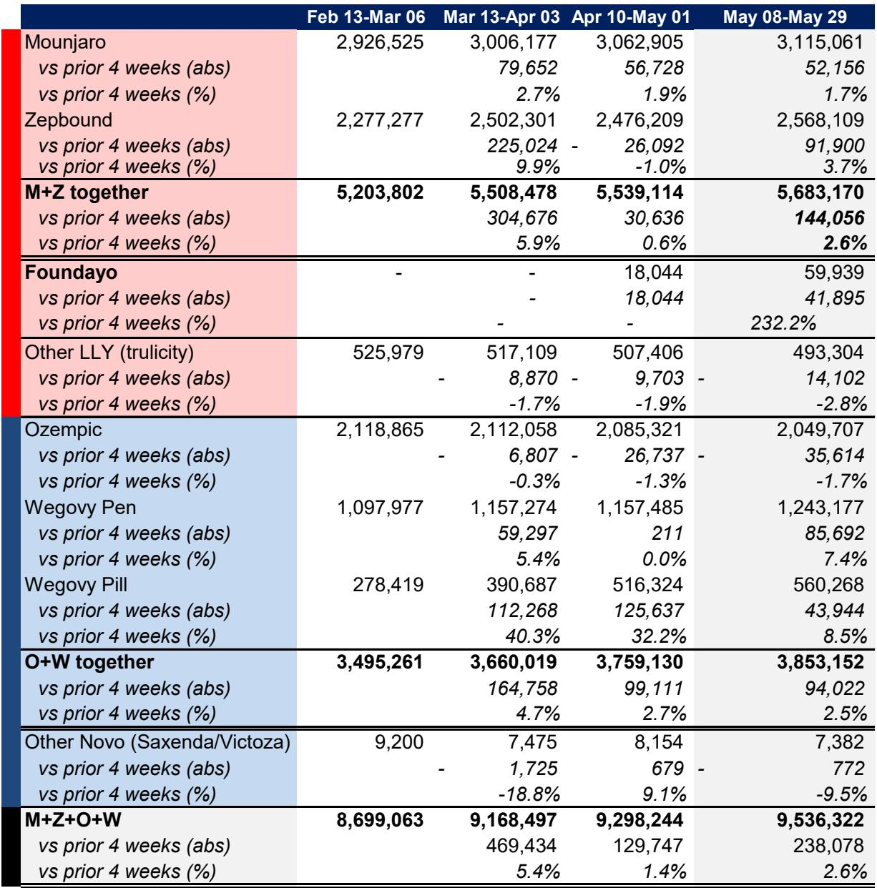
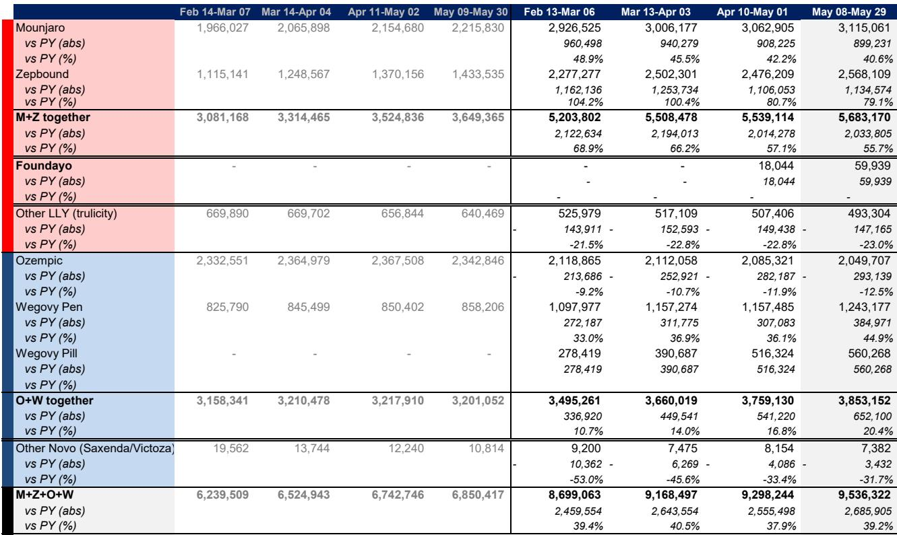
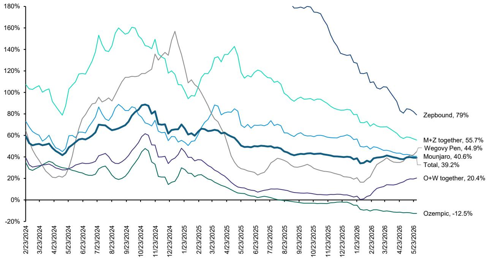

# The Oral GLP-1 Race Is Not a Sprint: Early Script Data Masks the Real Strategic Battle Between Eli Lilly and Novo Nordisk

The weekly prescription data for GLP-1 therapies in late May 2026 confirms what careful observers already suspected: the long weekend created a predictable dip in total scripts, but the underlying competitive dynamics are far more complex than top-line numbers suggest. Total weekly scripts fell to 2.44 million, down nearly 6% sequentially, yet the four-week year-over-year growth held steady at 39.2%. This is not a market cooling. It is a market digesting two simultaneous oral launches, each with fundamentally different strategic implications for the companies involved.

The real story is not about whether total prescriptions are growing. They are, and they will continue to do so for the foreseeable future. The real story is about how the oral GLP-1 launch trajectories are revealing critical differences in market capture, physician education cycles, and data transparency that will determine who wins the next phase of this therapeutic revolution. What appears at first glance to be a straightforward head-to-head comparison between Eli Lilly's Foundayo and Novo Nordisk's Wegovy Pill is, upon deeper inspection, a contest between two very different launch strategies playing out on uneven informational terrain.

The central question for investors is not which drug will accumulate more prescriptions in the first six months. It is whether the early data we can see is telling us the truth about relative demand. The answer, based on the available evidence, is that it is not. And that gap between observable data and underlying reality is where the most important strategic insights reside.

## The Wegovy Pill Launch Is Running at a Different Velocity Than the Data Shows, and That Should Change How You Read Every Weekly Report

The raw IQVIA prescription numbers tell one story. In week eight of its launch, Wegovy Pill recorded approximately 134,000 total prescriptions, down roughly 8% from the prior week. Foundayo, in its eighth week, posted just under 17,000 total prescriptions, a sequential increase of about 6%. On the surface, this looks like a blowout for Novo and a modest start for Lilly. But the surface is misleading.

Novo Nordisk's management has explicitly stated at their 2026 Annual General Meeting that IQVIA is capturing only about 50% of Wegovy Pill prescriptions. The company reported that at week ten, weekly oral Wegovy scripts were three times higher than tirzepatide, which they defined as Zepbound. The IQVIA data, by contrast, showed only a 1.6x ratio. That discrepancy is not noise. It is a signal that the official data stream is systematically undercounting Novo's oral launch by a wide margin.

Why does this matter? Because weekly prescription reports from IQVIA have become the de facto scorecard for investors tracking the GLP-1 market. If the capture rate for Wegovy Pill is only 50%, then every week investors are looking at a number that is roughly half of reality. The adjusted figures tell a dramatically different story. When you apply Novo's implied capture rate, Wegovy Pill's week-eight total jumps from approximately 134,000 to nearly 196,000 adjusted scripts. That is not a modest difference. It is the difference between a successful launch and a transformative one.

For Lilly, the capture rate problem is less severe but still material. Based on the company's reported patient count of approximately 20,000 patients by late April, combined with IQVIA cumulative script data, the estimated capture rate for Foundayo is about 70%. That is better than Novo's 50%, but it still means roughly three out of every ten Foundayo prescriptions are invisible to the standard tracking systems. The adjusted Foundayo numbers for week eight rise from approximately 17,000 to over 24,000 scripts.

The implication is straightforward: anyone making investment decisions based on unadjusted IQVIA data is operating with incomplete information. The gap between reported and actual scripts is not static. It varies by company, by drug, and potentially by channel. Investors who do not adjust for these capture rates are systematically underestimating the scale of the oral GLP-1 opportunity and misjudging the relative competitive positions.

## Foundayo Is a Genuinely New Molecule Launch, Not a Line Extension, and That Changes the Entire Time Horizon for Assessing Success

The temptation to compare Foundayo and Wegovy Pill directly is understandable. Both are oral GLP-1 therapies. Both launched within months of each other. Both are targeting the same massive obesity and metabolic disease market. But this comparison obscures a fundamental strategic difference: Wegovy Pill is a line extension of semaglutide, a molecule that physicians already know intimately. Foundayo is an entirely new chemical entity.

This distinction has profound implications for launch trajectory. When Wegovy Pill entered the market, physicians did not need to learn a new mechanism of action, a new safety profile, or a new dosing protocol. They already understood semaglutide from years of experience with Ozempic and the injectable Wegovy. The educational burden was minimal. The prescription decision was largely about form factor and patient preference.

Foundayo, by contrast, requires significant physician education. Doctors need to understand how orforglipron differs from semaglutide, what the efficacy and safety data look like, and how to manage patients on a novel molecule. This educational process takes time. It cannot be accelerated by advertising, because direct-to-consumer campaigns cannot begin until physicians are sufficiently informed. The report notes that DTC advertising for Foundayo, including television, will not start until the third quarter of 2026.

This means the first several months of Foundayo's launch are inherently constrained. The company is limited to seeding the market through specialist channels and building awareness among prescribers. The volume of new prescriptions will be lower than it would be for a line extension, not because the drug is inferior, but because the commercial infrastructure requires time to build.

The data supports this interpretation. Foundayo's daily-to-weekly script conversion rate remains low, hovering around 12% to 16% in the early weeks, compared to roughly 65% to 80% for Wegovy Pill. This is not necessarily a sign of weak demand. It is a sign of a launch that is still in the physician education phase. The daily scripts are directionally correlated with weekly totals, but the absolute conversion gap is large. As physician awareness grows and the educational cycle matures, that conversion rate should improve.

Investors who judge Foundayo's success based on its first eight weeks of data are making a category error. This is a marathon, not a sprint. The relevant question is not how Foundayo compares to Wegovy Pill in May 2026. It is how Foundayo will perform once the educational groundwork is laid and DTC advertising begins in the third quarter.

## The Competitive Dynamics Are Shifting Beneath the Surface, and Zepbound's Apparent Decline May Be a Misreading of the Data

One of the more concerning data points for Lilly investors is the apparent decline in Zepbound's market share following the Wegovy Pill launch. Zepbound's weekly market share decreased to 26.4%, down nearly half a percentage point from the prior week. Its four-week average year-over-year growth declined from 82% to 79%. On the surface, this looks like cannibalization or competitive pressure.

But the absolute numbers tell a different story. New-to-brand prescriptions for Zepbound have held steady at around 60,000 per week throughout 2026. The apparent decline in NBRx share is not driven by a drop in Zepbound's absolute volume. It is driven by the addition of Wegovy Pill prescriptions to the denominator. The pie is growing, and Zepbound's slice is holding its absolute size even as the total expands.

This is a critical distinction. Market share analysis in a rapidly expanding market can be misleading. A declining share percentage does not necessarily indicate competitive weakness if the absolute number of new patients remains stable. The more relevant metric is whether Zepbound is continuing to attract new patients at a consistent rate, and the data suggests it is.

Meanwhile, the semaglutide franchise is showing divergent trends by indication. Wegovy pen continues to post strong year-over-year growth of approximately 45% on a four-week average basis. But Ozempic, used for type 2 diabetes, continues to decline year over year at roughly negative 12.5%. This divergence is not new, but it is becoming more pronounced. The obesity indication is driving growth while the diabetes indication faces maturation and potential competition from other therapies.

The strategic implication is that Novo Nordisk's overall semaglutide franchise is becoming increasingly dependent on the obesity market. The diabetes segment, which provided the foundation for the entire GLP-1 revolution, is now a declining contributor to growth. This concentration risk is worth monitoring, particularly as new oral therapies enter the market and potentially expand the total addressable patient population beyond what injectable therapies have achieved.

## The Report Raises More Questions Than It Answers About Adherence, Channel Dynamics, and the True Size of the Oral Opportunity

For all its granularity, the weekly prescription data leaves several critical questions unanswered. These gaps are not weaknesses in the analysis. They are the natural result of trying to measure a dynamic market with imperfect tools. But they are gaps that investors need to acknowledge.

First, adherence rates remain a black box. The report notes that future adherence patterns may influence observed relationships between patient counts and prescription volumes. If adherence rates for oral GLP-1s differ significantly from injectables, the long-term revenue implications could be substantial. Lower adherence would mean higher prescription volumes for the same patient base, but it could also mean lower efficacy and higher discontinuation rates. The data does not yet tell us which scenario is playing out.

Second, the channel dynamics are opaque. Novo has suggested that IQVIA's capture rate for Wegovy Pill is only 50%, partly because scripts written through NovoCare and other direct channels may not be fully captured. If this is true, it raises questions about how other drugs are being tracked. Are there systematic biases in IQVIA's data collection that affect some companies more than others? Are certain channels systematically undercounted? The report estimates a 70% capture rate for Foundayo, but this is an estimate based on limited data points. The true rate could be higher or lower.

Third, the relationship between daily and weekly script data remains unstable. For Foundayo, the conversion rate has fluctuated between 12% and 19% over the first eight weeks, with no clear directional trend. This instability makes it difficult to extrapolate from daily data to weekly projections. It also raises questions about whether the daily data is capturing the same population as the weekly data, or whether there are systematic differences in prescribing behavior across days of the week.

These open questions are not reasons to dismiss the data. They are reasons to treat the data with appropriate humility. The weekly prescription numbers are valuable, but they are not the whole story. Investors who rely on them exclusively are missing important dimensions of the competitive landscape.

## A Decision Framework for Navigating the Oral GLP-1 Launch Uncertainty

Given the complexity and uncertainty inherent in the current data, investors need a structured approach to making decisions. The following framework is designed to help separate signal from noise and identify the most important inflection points to watch.

**Step one: Adjust for capture rates before comparing launch trajectories.** Raw IQVIA data is not comparable across companies. Apply the estimated capture rates of 50% for Wegovy Pill and 70% for Foundayo to get a more accurate picture of relative demand. Update these estimates as new company disclosures become available. The gap between reported and actual scripts is the single most important adjustment you can make.

**Step two: Focus on absolute new-to-brand prescriptions, not market share.** In a rapidly expanding market, share percentages can be misleading. Track the absolute number of new patients starting each therapy. As long as Zepbound and Foundayo are maintaining or growing their absolute NBRx volumes, concerns about share erosion are premature.

**Step three: Monitor the daily-to-weekly conversion rate as a leading indicator of launch maturity.** For Foundayo, a sustained improvement in this conversion rate would signal that physician education is taking hold and the launch is transitioning from seeding to scaling. For Wegovy Pill, stability in the conversion rate would confirm that the launch is operating at steady state.

**Step four: Watch for the start of DTC advertising as a catalyst.** The report indicates that Foundayo's DTC campaign will not begin until the third quarter. The weeks following the start of television advertising will be the first real test of consumer demand. If Foundayo scripts inflect meaningfully after DTC begins, it will validate the thesis that the early launch was constrained by education, not demand.

**Step five: Track the divergence between obesity and diabetes indications.** The semaglutide franchise is becoming increasingly dependent on obesity. Any signs that the obesity market is maturing or facing competitive pressure would have outsized implications for Novo Nordisk's growth trajectory. Conversely, if diabetes demand stabilizes or recovers, it would provide an additional growth lever.

This framework will not eliminate uncertainty, but it will help investors focus on the metrics that matter most and avoid being misled by surface-level data.

## The Full Report Contains the Charts and Data You Need to Make These Decisions Yourself

The analysis presented here is based on a careful reading of the weekly prescription data and the strategic context surrounding the oral GLP-1 launches. But no summary can capture the full richness of the underlying data. The original report contains detailed exhibits showing launch trajectories, capture rate estimates, daily-to-weekly conversion patterns, and market share trends across multiple presentations and indications.

These charts are not decorative. They are the raw material from which strategic insights are derived. If you are making investment decisions based on the GLP-1 market, you need to see the data for yourself and form your own conclusions about what it means.

Join the community to read the full report and review the original charts.

*This article is for learning and discussion only and does not constitute investment advice.*

Personal reading notes and learning share only. Not investment advice.

