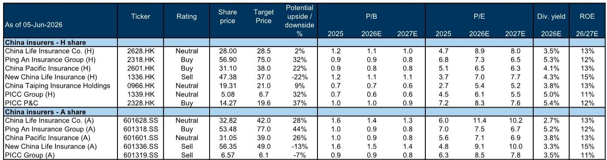
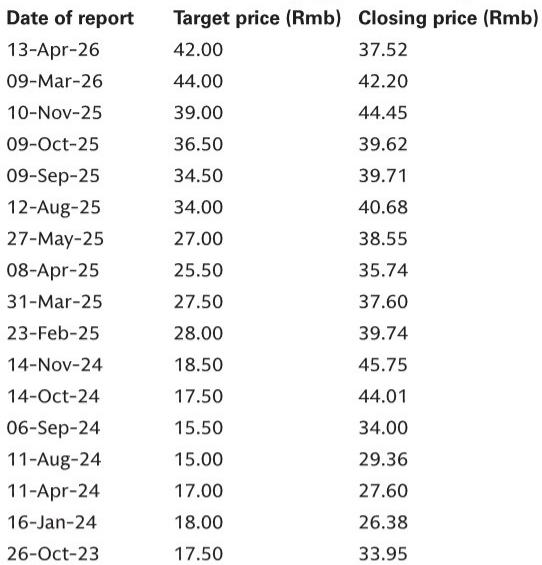
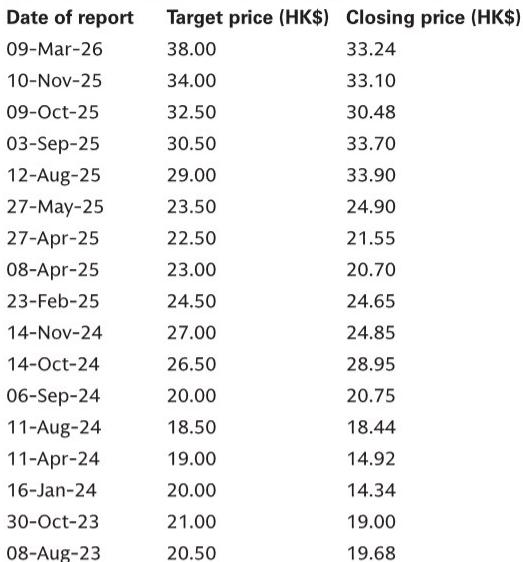

# 保险股反弹背后，市场真正低估的是渠道结构重塑的定价权

如果你在过去三个月看到中国保险公司的股价反弹，自然会问一个问题：这是跟着A股大盘走的贝塔，还是行业基本面发生了结构性改善？

某外资投行在5月底对中国主要保险公司进行了一轮深度调研，覆盖平安、太保、太平、众安、国寿、新华和人保财险。调研的结论可以浓缩为一句话：行业基本面确实在变好，但变好的方式比多数人想象的更微妙——不是单纯靠股市上涨拉高投资收益，而是渠道费用监管收紧正在悄悄改变竞争格局，让大型保险公司重新拿回定价权。

这份调研释放的信号，值得认真拆解。

## 1. 银保渠道的“监管红利”正在重塑寿险竞争格局，大型险企是最大受益者

2025年3月，国家金融监管总局发布了银保渠道费用新规。这次调研中，所有寿险公司都对这一政策表达了欢迎态度。这不是客套话，而是有实质含义的。

过去几年，银保渠道的竞争本质上是费用战。中小保险公司为了抢占银行网点，不惜以高额手续费换取规模，导致整个渠道的利润率被压得很低。新规的核心在于对渠道费用进行更精细化的审查，这直接抬高了中小公司的竞争门槛。

大型险企的逻辑很清楚：银行在费用受控的条件下，会更倾向于与偿付能力充足、品牌认知度高、能够提供长期服务的大型保险公司合作。这不是猜测，而是已经在发生的事实。以中国太平为例，其银保渠道的VONB贡献在2025年约为35%，但管理层明确表示这个比例有潜力逐步提升到50%。太平人寿已经是银保渠道前七大寿险公司之一，这恰恰是监管整顿后的结果。

当然，监管红利不是免费的午餐。多家公司都承认，短期内销售激励的减少会造成一定的业务扰动。国寿在经历了2026年一季度VONB同比增长75%的异常高增长后，管理层预计后续增速会回归正常，部分原因就是银保新规带来的短期冲击。但关键在于，这种冲击是一次性的，而竞争格局的改善是结构性的。

这意味着什么？对于投资者而言，银保渠道的利润率能否持续改善，取决于大型险企能否将节省下来的费用真正转化为利润率，而不是重新投入到价格战中去。这份调研中，保险公司普遍预期“大部分节省将让利给投保人”，这暗示利润率改善的幅度可能有限，但规模的集中化趋势是确定的。

## 2. 权益投资策略正在发生静默转变：从追逐弹性到配置“类债型”高股息

调研中一个容易被忽视但极其重要的信号，是保险公司对权益投资策略的一致表述。

几乎所有受访的寿险公司都强调了一个共同点：不会因为近期股市反弹而大幅提升权益配置比例。平安、国寿、新华都明确表示，整体权益配置比例将保持相对稳定。新华甚至指出，其2025年权益配置比例为22%，一季度略有下降，且中期内不打算提高到25%-30%的区间。

这听起来像是一个保守的信号，但深入看会发现，真正重要的不是配置比例，而是配置结构的变化。

报告反复提到一个关键指标：OCI权益投资的占比在提升。OCI（其他综合收益）账户下的股权投资，其市值波动不计入当期损益，这使得保险公司可以将高股息股票作为“类债型”资产来持有，提供稳定的分红收益和久期匹配。国寿的OCI权益占比已达到约30%，与行业平均水平大致相当。

这些保险公司对高股息股票的“目标股息率”普遍设定在4%或以上。平安特别提到，如果负债成本继续下降，这个门槛还可以降低。这意味着，在利率长期下行的背景下，保险公司正在主动将权益资产“债券化”——不是追求股价弹性，而是追求稳定的现金流回报。

这个趋势对市场的含义是深远的。当中国最大的机构投资者群体开始系统性地将高股息股票作为长期配置核心，而不是交易性资产，这些股票的估值逻辑就会从“周期股”转向“类固收资产”。这或许可以解释为什么银行股和部分公用事业股在利率下行的环境中反而获得了重估。

但报告也留下了一个未解的问题：如果股市出现大幅回调，这些OCI账户中的高股息股票是否会因为浮亏而影响偿付能力？保险公司对此的应对机制，报告没有完全展开。

## 3. 代理人队伍的“质量换数量”已基本完成，但真正的考验在于能否突破中产客群

寿险行业过去几年的核心叙事是代理人数量的大幅缩减。这份调研给出的信号是，这个调整阶段可能已经接近尾声。

多家寿险公司预期，未来2-3年代理人数量将保持稳定。但稳定不意味着回到过去，而是意味着行业已经接受了“精兵路线”的常态化。资源支持向高产能代理人倾斜，招募和培训流程也围绕这一群体重新设计。

一个值得注意的细节是，尽管银保渠道增长迅猛，但大多数寿险公司仍然认为，代理人渠道在服务高净值客户方面具有不可替代的优势。银保渠道更适合销售储蓄类产品，而复杂的保障型产品和健康险，仍然需要代理人的面对面服务。

这意味着，未来寿险行业的竞争将不再是“谁的人多”，而是“谁能真正渗透到中产及以上客群的保障需求”。太保在调研中提到，其代理人渠道的VONB利润率已接近30%，主要由长期缴储蓄产品驱动。但银保渠道的利润率只有15%左右，且主要通过趸缴产品实现。如果太保能够通过减少趸缴产品的占比来提升银保利润率，这将是一个重要的边际改善。

但这里存在一个尚未被充分讨论的风险：如果代理人数量真的稳定下来，而银保渠道的利润率提升有限，那么整个行业的VONB增长将越来越依赖规模扩张，而不是利润率提升。这恰恰是报告没有完全回答的问题——在费用监管红利释放完毕后，行业下一轮增长的动力来自哪里？

## 4. 财险的承保利润率改善有结构性支撑，但新能源车险仍是最大变量

财险板块的调研信号相对清晰。人保财险将自身优于同业的综合成本率（COR）归因于四个因素：更好的风险定价、内部费用管理、与主机厂的紧密关系、以及理赔管理的专业能力。这些优势不是短期内能够复制的。

更重要的是，整个财险行业都看到了承保利润率改善的空间。驱动因素包括：更灵活的风险定价能力、ADAS（高级驾驶辅助系统）的渗透率提升降低了事故频率、维修流程的改进，以及风险保费的可能重新校准。

但新能源车险仍然是最大的不确定因素。太保和人保财险都提到了这一点。随着自动驾驶功能的改善和维修网络的成熟，新能源车险的赔付率有望改善，但这个改善的节奏和幅度仍然高度不确定。报告没有给出具体的COR改善幅度预测，这本身就说明行业对这个变量的判断仍然缺乏共识。

值得注意的是，2026年一季度车险保费出现了行业性下滑，主要原因是新车销量同比下降。但保险公司普遍预期，随着汽车销售逐步恢复，车险保费增速将在中期恢复到低至中个位数。这意味着，财险行业的短期增长可能面临压力，但中期趋势仍然正面。

## 5. 报告尚未完全回答的关键问题：偿付能力新规的落地节奏与影响

调研中提到的C-ROSS第三阶段更新是一个值得密切关注但信息仍然有限的变量。监管机构尚未就各项风险参数做出最终决定，实施时间可能在2026年下半年或2027年。

大型保险公司目前都表示偿付能力充足率远高于监管最低要求。但问题在于，新规的具体参数将决定保险公司能够承担多大的权益风险敞口，进而影响其资产配置策略。如果新规对权益资产的风险资本要求提高，保险公司可能需要降低权益配置比例，或者转向更低风险的资产。

这正是报告没有完全展开的一阶影响。目前保险公司普遍将权益配置比例维持在相对稳定的水平，但这一稳定建立在现有监管框架之上。如果C-ROSS第三阶段对权益风险权重做出实质性调整，整个行业的资产配置逻辑可能需要重新校准。

对于投资者来说，这意味着当前保险股的估值中隐含了一个重要假设：监管框架不会出现对权益配置的不利变化。这个假设是否成立，需要持续跟踪监管动态。

## 从调研到决策：需要持续跟踪的三个观察变量

基于这份调研，我们建议读者建立一个简化的观察框架，用来持续检验报告的判断是否成立：

第一，银保渠道的费用率变化。如果未来几个季度，大型保险公司的银保渠道手续费率持续下降，而VONB利润率保持稳定或略有改善，说明监管红利的释放是真实的。反之，如果费用率下降但利润率同步下降，说明节省的成本被让利给了投保人，股东受益有限。

第二，高股息股票的持仓变化。关注保险公司OCI账户中高股息股票的占比是否持续提升，以及目标股息率是否真的能够维持在4%以上。如果保险公司在股市回调时被迫减持这些持仓，说明“类债型”配置的逻辑尚未真正建立。

第三，C-ROSS第三阶段的落地时间与参数。这是所有判断中最大的外生变量。一旦新规出台，需要立即重新评估保险公司的权益配置空间和偿付能力边际。

这份调研报告提供了大量有价值的公司层面细节，包括平安对银行网点渗透率的具体数据、太保对分红险产品演进的判断、新华对H股机会的看好、以及人保财险对主机厂关系的竞争优势分析。限于篇幅，我们无法在这里逐一展开。

这些细节中，有些直接支持了我们对行业主判断的信心，有些则提出了新的疑问。比如，平安的资产管理业务在2026年预期能实现正利润贡献，这一判断是否可靠？新华将2025年分红比例维持在25%是否可持续？太保提到的“香港式分红险”在中国大陆市场的可复制性有多高？

这些问题，正是我们希望在更深入的讨论中与读者共同探讨的方向。欢迎来星球微信群里继续讨论，一起追踪这些关键变量的变化。

---

Personal reading notes and learning share only. Not investment advice.

