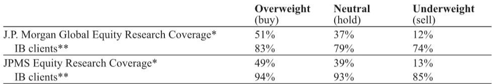

# AI基础设施的供给瓶颈，正在从芯片设计延伸至整个物理供应链

这份来自某外资投行的研报，在Broadcom 2Q26财报后第一时间更新了对AI半导体产业链的判断。表面上看，它是对一家公司业绩的追踪。但当我们把数字背后的信号串联起来，一个更重要的结构性叙事浮现出来：AI基础设施的竞争，已经从“谁的芯片算力更强”进入了“谁能锁定物理世界的供应”阶段。

报告中最值得关注的判断，不是Broadcom AI收入突破100亿美元的时间表，而是管理层披露的AI半导体订单积压已超过300亿美元，且订单能见度已延伸至2028年。客户之所以提前下单，不仅是为了锁定晶圆和HBM产能，更是为了确保电力基础设施的配套到位。这是一个信号：AI基础设施的供给瓶颈，正在从硅片层面蔓延到整个物理世界。

以下，我们从四个层次来拆解这份报告的核心洞察，并在最后提出一个报告尚未完全回答的关键问题。

## 1. 订单能见度延伸至2028年，供应链约束正在从晶圆向物理基础设施转移

报告中最硬核的数字，是Broadcom AI半导体季度订单积压超过300亿美元。管理层明确表示，客户正在提前下单，原因不仅仅是晶圆和HBM的交付周期长，更关键的是电力基础设施的配套周期。

这指向一个被市场低估的变化：AI基础设施的供给约束，正在从“芯片产能”向“数据中心电力容量”迁移。当电力成为瓶颈，客户不得不提前数年锁定芯片供应，以确保在拿到电力配额时，配套的计算设备已经就位。反过来，这也意味着芯片供应商的订单能见度被大幅拉长。

报告提到，这份研报的亚洲供应链调研确认，3至5年的长期协议已经越来越多地覆盖基板、HBM和CCL等关键瓶颈环节，而先进制程晶圆仍维持年度谈判周期。这隐含了一个判断：供应链约束的关键变量，正在从台积电的CoWoS产能向更上游的物理材料和电力转移。基板、HBM、CCL的产能扩张周期长于晶圆，一旦这些环节出现瓶颈，恢复时间将更长。

对投资者的含义：关注AI基础设施的“物理层”供应商——基板、HBM、CCL、封装测试——可能比关注芯片设计公司本身，更能捕捉到供给约束下的定价权溢价。报告明确列出的受益标的包括TSMC、ASE、SK Hynix、Samsung、Unimicron、Ibiden和EMC。

## 2. 客户组合多元化正在加速，但真正的赢家是那些能适应“半定制化”模式的供应商

Broadcom的客户名单正在快速扩容。除了Google、Meta、Anthropic、OpenAI这些已公开的客户，报告还基于供应链调研指出，另外两家客户——字节跳动和软银/ARM——将在2026年底开始出货，2027年加速放量。目前这些客户的采购订单金额已达约60亿美元。

但报告最值得细读的部分，是管理层首次公开承认Google将保持TPU供应链的多元化。这意味着，即使Broadcom与Google签有长期协议，Google仍将与联发科在TPU上合作，甚至可能与Marvell在LPU类芯片上合作。

报告指出，长期来看，大型云服务商同时与2至3家后端设计服务商合作，可能成为常态。驱动因素有两个：一是产品类型更加多样化（AI加速器、AI CPU、LPU类芯片等）；二是随着云服务商前端设计能力的成熟，它们会尝试不同的商业结构（半定制化vs.全定制化）。

这里的关键洞察是：联发科和Alchip这类毛利率较低（联发科40%以上、Alchip十几%）的供应商，反而可能成为赢家，因为云服务商在转向半定制化模式时，会更倾向于与利润率结构更“薄”的供应商合作。相比之下，那些同时提供前端设计服务的交钥匙供应商（毛利率60%以上），在价格谈判中可能处于劣势。

对投资者的含义：不要简单地把“客户多元化”等同于“Broadcom被分走份额”。真正的竞争格局变化，是商业模式的分化——半定制化供应商的崛起，可能重新定义整个AI芯片设计服务市场的利润分配。

## 3. 网络互联正在成为AI基础设施的“第二战场”，但市场对其重要性仍定价不足

报告揭示了一个容易被忽视的结构性变化：网络互联收入已经占Broadcom AI收入的约40%。管理层虽然表示这个比例偏高，未来可能回落至30%左右，但即便如此，网络互联仍然是AI半导体中不可忽视的板块。

Broadcom在网络互联领域的布局，从铜缆/SerDes到100Tb以太网交换机（Tomahawk 6已出货超过一年），再到1.6T DSP和CW/EML激光器等CPO构建模块，正在试图定义行业标准。下一代的200Tb交换机计划在本季度流片。

报告特别指出，随着agentic AI推动更大规模的扩展域和规模化域，高带宽数据传输的需求正在快速增长。但Broadcom对CPO（共封装光学）的推进节奏仍相对保守，预计其CPO量产时间表比NVIDIA晚约两年。

这里有一个隐含判断：网络互联的竞争，正在从“提供更高带宽”转向“定义互联标准”。谁能在交换机、SerDes、光学模块上确立标准，谁就能在AI基础设施的“互联税”中获得最大的份额。

对投资者的含义：市场目前对AI基础设施的关注仍集中在算力芯片上，但网络互联的竞争格局和定价权变化，可能在未来12至18个月内成为新的投资主线。CPO的渗透节奏、交换机带宽的升级周期、铜缆与光模块的替代关系，都是需要持续跟踪的变量。

## 4. 非AI半导体正在复苏，但驱动力并非传统需求，而是AI的“挤出效应”

报告提到，Broadcom的非AI半导体收入在2Q26达到42亿美元，同比增长6%，订单积压超过60亿美元，管理层预计3Q26非AI半导体收入将环比增长至约45亿美元。

表面上，这是一个传统半导体周期复苏的信号。但报告指出，亚洲供应链调研显示，本轮复苏的主要驱动力并非汽车和工业的全面回暖——虽然这些领域确实在缓慢恢复——而是两个与AI相关的结构性因素：一是AI对产能的“挤出效应”导致主流制程产能趋紧；二是AI周边需求（如PMIC）正在上升。

这意味着，非AI半导体的复苏，与其说是“周期回归”，不如说是“AI溢出”。那些被AI挤占产能的成熟制程代工厂和封装测试厂，反而因为供给收紧而获得了定价权。

对投资者的含义：传统的半导体周期分析框架——盯着库存、出货、终端需求——可能正在失效。AI的产能挤出效应，正在重塑整个半导体供应链的定价逻辑。成熟制程代工厂（如VIS）、封装测试厂（如ASE）、被动元件供应商（如YAGEO和Murata），都可能受益于这种“非自愿的供给收缩”。

## 报告尚未完全回答的关键问题：当所有客户都在提前下单，真正的需求曲线在哪里？

这份报告揭示了AI基础设施供应链的一个深层矛盾：所有客户都在提前下单，所有供应商都在扩产，但真正的最终需求——即终端用户实际使用的AI计算量——是否能支撑如此激进的供给扩张？

Broadcom的订单能见度已延伸至2028年，客户提前下单的原因之一是锁定电力配额。但电力配额本身是一个物理约束，而不是一个需求信号。如果AI应用的商业变现速度慢于基础设施投资的节奏，那么这些提前下单的订单，本质上是在“抢位”而不是“满足真实需求”。

报告没有深入讨论的是：当所有客户都在提前下单时，订单积压这个指标本身是否还能反映真实需求强度？或者，它更多地反映了客户对供给短缺的恐慌性预防？如果后者成立，那么在某个时点，一旦电力配额不再成为瓶颈，或者AI应用的商业化低于预期，这些订单可能会被重新评估。

这个问题的答案，决定了当前AI基础设施投资的估值锚点。如果订单积压是真实需求的映射，那么当前的估值仍有支撑；如果它更多是供给恐慌的产物，那么市场可能需要重新思考AI资本开支的可持续性。

---

以上是基于这份研报的四个核心洞察。报告原文还包含了对Broadcom各业务线的详细财务拆解、对竞争对手的份额分析、以及对2027至2028年AI半导体收入路径的情景推演。这些内容由于篇幅限制未能完全展开。

如果你对以下问题感兴趣——客户提前下单的“恐慌系数”如何量化？联发科与Google的TPU合作对Broadcom的份额影响到底有多大？CPO的量产时间表对光模块供应链意味着什么？——欢迎来星球微信群里继续讨论。我们会在社群中分享完整的研报解读、原始图表，以及围绕这些未解问题的持续追踪。

Personal reading notes and learning share only. Not investment advice.

